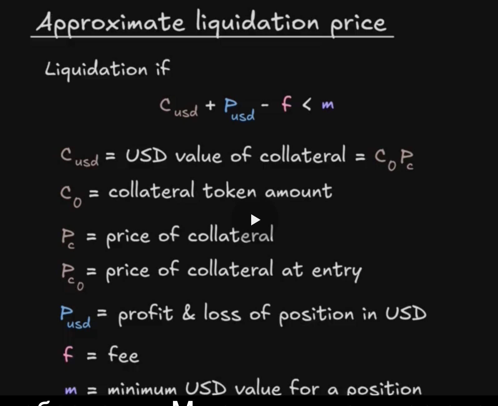
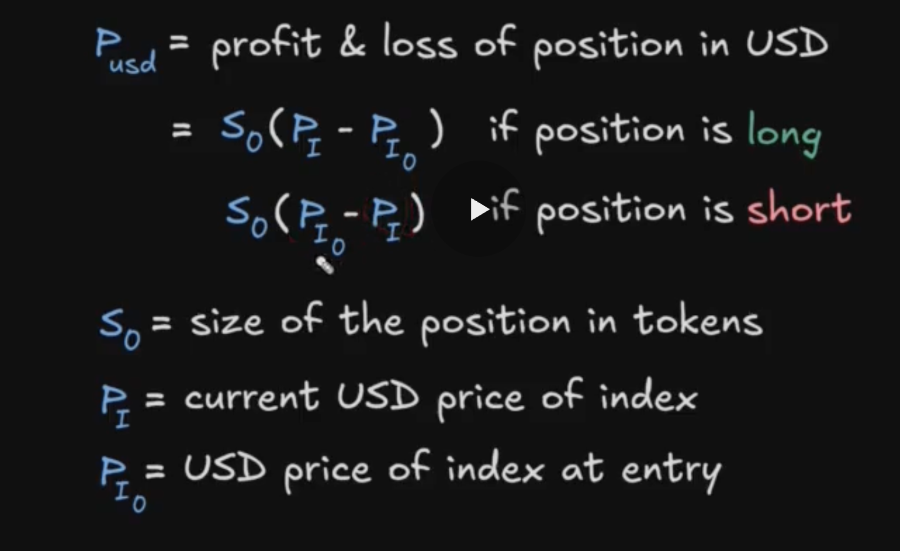

# Section 4. liquidation

Условия для ликвидации:
1. Если залог в USD меньше, чем минимально установленное в GMX
2. Если оставшийся залог меньше или равно нулю
3. Если оставшийся залог меньше чем минимально необходимый залог для leverage

_Важно!_ От залога будут вычтены все комиссии, которые накопились на момент проверки.

