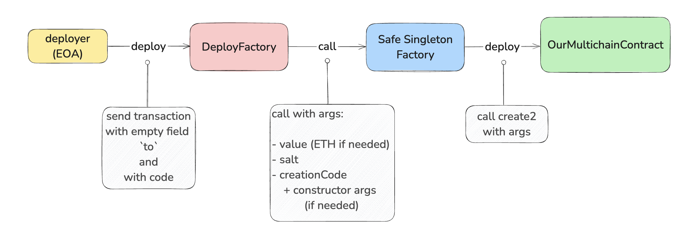

# Safe Singleton Factory

**Автор:** [Роман Ярлыков](https://github.com/rlkvrv) 🧐

## Введение

Возможно, вы замечали, что у смарт-контрактов некоторых DeFi-протоколов одинаковые адреса в разных блокчейнах. Речь, конечно же, о блокчейнах на основе EVM. Недавно я столкнулся с подобной задачей и хочу поделиться существующими решениями.

## Что необходимо для того, чтобы адреса были одинаковыми?

Для начала нужно разобраться, из чего формируется адрес смарт-контракта. В зависимости от способа развертывания есть два варианта входных параметров:

1. **Адрес деплойера и `nonce`**. В этом случае адрес вычисляется по следующей формуле:

    ```js
    keccak256(rlp([sender_address, sender_nonce]))[12:]
    ```

    Этот способ используется в двух случаях:
    - Если смарт-контракт создается путем отправки транзакции с пустым полем `to`. Для его развертывания используется опкод `RETURN`.
    - Если смарт-контракт создается внутри другого смарт-контракта с помощью ключевого слова `new`, либо через `assembly` и функцию `create`. В обоих случаях под капотом применяется опкод `CREATE`.

2. **Адрес деплойера, `bytecode` и `salt`**. Такой способ вычисления адреса появился вместе с опкодом `CREATE2`. Подробно об этом можно почитать в другой статье wiki под названием "EIP-1014: Skinny CREATE2". Если коротко, этот метод позволяет убрать зависимость от `nonce` адреса, что значительно упрощает задачу. Но есть и недостаток — развернуть контракт с помощью `CREATE2` можно только из другого смарт-контракта.

    Полная формула вычисления адреса в этом случае:

    ```js
    keccak256(0xff + sender_address + salt + keccak256(initialisation_code))[12:]
    ``` 

Таким образом, чтобы адреса были одинаковыми во всех сетях, необходимо использовать один и тот же `nonce` для деплойера. На первый взгляд, это несложно: достаточно создать "чистый" адрес и развернуть контракт. Однако на практике этот метод не самый надежный и удобный.

Например, в одном из блокчейнов можно случайно отправить не ту транзакцию, что изменит `nonce`. Бывают и другие ситуации: транзакция может "подвиснуть", и чтобы ее пропустить, придется отправить пустую транзакцию с тем же `nonce`, что снова его увеличит.

Поэтому был придуман более надежный, удобный и предсказуемый вариант — **Deterministic Deployment Proxy**.

## Deterministic Deployment Proxy

Если упростить, идея довольно проста: нужно создать "чистый" адрес и развернуть в каждой сети один и тот же смарт-контракт — фабрику. Этот контракт выполняет единственную функцию: деплоит другие смарт-контракты с использованием `CREATE2`. То есть для развертывания любого контракта потребуется только `salt` и его байткод.

Так появился [Deterministic Deployment Proxy](https://github.com/Arachnid/deterministic-deployment-proxy). Чтобы минимизировать размер кода и расходы на газ, контракт был написан на `Yul`. Вот его полный код:

```solidity
object "Proxy" {
    // deployment code
    code {
        let size := datasize("runtime")
        datacopy(0, dataoffset("runtime"), size)
        return(0, size)
    }
    object "runtime" {
        // deployed code
        code {
            calldatacopy(0, 32, sub(calldatasize(), 32))
            let result := create2(callvalue(), 0, sub(calldatasize(), 32), calldataload(0))
            if iszero(result) { revert(0, 0) }
            mstore(0, result)
            return(12, 20)
        }
    }
}
```

Как вызывать этот контракт и передавать ему данные, разберем позже в практических примерах. Сейчас важно другое: как найти свободный адрес для деплоя смарт-контракта во всех существующих и будущих сетях? И как быть уверенным, что доступ к этому аккаунту никогда не будет потерян?

Решение оказалось довольно тривиальным. Любая транзакция в Ethereum подписывается некоторым приватным ключом, а затем с помощью функции `ecrecover` из подписи можно восстановить публичный адрес владельца. Подпись передается в виде трех параметров: `v, r, s`.

Но что если пойти от обратного? Алгоритм следующий:

1. **Придумываем подпись** — заранее выбираем `v, r, s` таким образом, чтобы `ecrecover` гарантированно дал нам фиксированный адрес.
2. **Финансируем этот адрес** — отправляем на него небольшое количество нативных токенов для оплаты газа. Точный расчет возможен, но лучше предусмотреть небольшой запас.
3. **Создаем транзакцию** — подписываем ее заранее выбранной подписью, указываем байткод `Proxy` и оставляем поле `to` пустым, чтобы транзакция развернула контракт.

Этого достаточно, чтобы кто угодно мог развернуть контракт в любой сети. При этом никто не владеет этим аккаунтом, а значит, он не может быть утерян. Предполагается, что `nonce` всегда будет равен `0`, а значит, и адрес `Proxy` останется неизменным.

Такая транзакция называется `pre-signed`. Подпись при этом может быть максимально простой. Например, в [Deterministic Deployment Proxy](https://github.com/Arachnid/deterministic-deployment-proxy) используется такая:

```js
const v = arrayFromNumber(27)
const r = arrayFromHexString('2222222222222222222222222222222222222222222222222222222222222222')
const s = arrayFromHexString('2222222222222222222222222222222222222222222222222222222222222222')
```

Решение изящное, но есть нюансы.

## Safe Singleton Factory

Deterministic Deployment Proxy — рабочее решение, но у него есть несколько проблем:

1. В новой сети, где контракт `Proxy` еще не развернут, кто-то может отправить транзакцию с той же подписью, но с невалидными данными или другим байткодом. Это увеличит `nonce`, и исправить ситуацию уже не удастся.
2. Вторая проблема связана с [EIP-155: Simple replay attack protection](https://github.com/ethereum/EIPs/blob/master/EIPS/eip-155.md). Этот стандарт требует добавления `chainId` в подписываемые данные транзакции, чтобы предотвратить их повторное выполнение в другой сети. Это правило строго применяется только в некоторых новых сетях. Однако оно ломает саму концепцию использования одной и той же подписи.

Из-за этих проблем предложение [ERC-2470: Singleton Factory](https://eips.ethereum.org/EIPS/eip-2470) не было принято. Сообщество решило, что принимать отдельный ERC ради такого хака "избыточно".

Так мы подошли к [Safe Singleton Factory](https://github.com/safe-global/safe-singleton-factory). Чтобы решить описанные выше проблемы, команда [Safe](https://safe.global/) использует один конкретный аккаунт для развертывания фабрики во всех сетях.

Изначально это была внутренняя разработка, но поскольку контрактом может пользоваться любой, команда поделилась им с сообществом. Кроме того, фабрика уже развернута во множестве блокчейнов, неофициальный список доступен [здесь](https://contractscan.xyz/contract/0x914d7Fec6aaC8cd542e72Bca78B30650d45643d7).

Фабрика Safe основана на концепции [Deterministic Deployment Proxy](https://github.com/Arachnid/deterministic-deployment-proxy), но с одним ключевым отличием: вместо общей подписи используется подпись, контролируемая Safe. 

Если вам нужно добавить новый блокчейн, команда Safe может развернуть контракт самостоятельно. Для этого необходимо:

1. Убедиться, что сеть есть на [Chainlist](https://chainlist.org/). Другие сети не принимаются.
2. Создать `issue` в репозитории [Safe Singleton Factory](https://github.com/safe-global/safe-singleton-factory) с запросом на деплой.
3. После создания `issue` бот автоматически подтвердит его и опубликует комментарий с адресом деплойера и суммой нативных токенов, необходимых для развертывания.
4. Перевести указанные средства на адрес деплойера и отметить задачу как выполненную. Команда Safe развернет контракт.

Процесс занимает около двух недель. 

*Примечание:* Блокчейны, основанные на `OP Stack`, включают Safe Singleton Factory как предустановленный контракт, поэтому развертывать его вручную не требуется.

Но все это касается **только развертывания фабрики в новой сети**. Если же нужно просто деплоить смарт-контракты с одинаковыми адресами в разных сетях, можно использовать уже развернутую фабрику Safe по адресу:  
`0x914d7Fec6aaC8cd542e72Bca78B30650d45643d7`. Ее адрес будет одинаковым во всех EVM-сетях, где нет каких-то существенных отличий в работе опкодов или особенностей, которые не позволяют это сделать (всегда нужно проверять, возможны исключения).

## Пример использования

Есть несколько способов развернуть смарт-контракты с помощью Safe Singleton Factory. Начнем с самого наглядного, хотя он включает промежуточный деплой, который **не является обязательным**, но помогает лучше понять процесс.

Для этого создадим смарт-контракт "прослойку" `DeployFactory`, на схеме это будет выглядеть так:

  
*Процесс деплоя с использованием дополнительного смарт-контракта DeployFactory*

### Отдельный смарт-контракт для деплоя

Напишем простой контракт `OurMultichainContract`, который должен иметь одинаковый адрес во всех сетях. Предположим, что у него есть управляющая роль, поэтому в конструктор передается `owner`:

```solidity
contract OurMultichainContract {
    address public owner;

    constructor(address _owner) {
        owner = _owner;
    }
}
```

Теперь создадим смарт-контракт `DeployFactory`. Это промежуточный контракт, который обеспечит предсказуемость результата, независимо от того, кто его развернет. Сначала добавим несколько констант:

1. **Адрес Safe Singleton Factory**, выполняющей основную работу.
2. **Соль (`salt`)** — может быть любым `bytes32`. На самом деле ее не обязательно делать константой, можно просто передать в конструкторе. В случае ошибки достаточно будет заново развернуть контракт с правильной солью.
3. **Адрес `owner`**, который будет добавлен к байт-коду, как аргумент конструктора.
4. **Переменную для хранения адреса развернутого контракта**.

```solidity
contract DeployFactory {
    error AlreadyDeployed();

    /// @notice Адрес Singleton Factory
    address constant SAFE_SINGLETON_FACTORY =
        0x914d7Fec6aaC8cd542e72Bca78B30650d45643d7;

    /// @notice Любая фиксированная соль
    bytes32 constant SALT = keccak256(bytes("any salt"));

    /// @notice Адрес owner, он будет "зашит" в байт-код
    /// Его смена приведет к смене результирующего адреса
    address public immutable owner = 0x32bb35Fc246CB3979c4Df996F18366C6c753c29c;

    /// @notice Адрес развернутого смарт-контракта
    address public immutable ourMultichainContract;
}
```

Деплой `OurMultichainContract` выполняется в конструкторе, так как `DeployFactory` используется только один раз:

```solidity
constructor() {
    /// Шаг 1. Вызываем Singleton Factory напрямую
    (bool success, bytes memory result) = SAFE_SINGLETON_FACTORY.call(
        abi.encodePacked(
            SALT,
            type(OurMultichainContract).creationCode,
            abi.encode(owner)
        )
    );

    /// Шаг 2. Проверяем, что контракт еще не развернут
    if (!success) {
        revert AlreadyDeployed();
    }

    /// Шаг 3. Извлекаем адрес развернутого контракта
    ourMultichainContract = address(bytes20(result));
}
```

Разберем процесс:

1. **Прямой вызов Safe Singleton Factory** через `call`. Если помните, у фабрики нет никаких функций.
2. **Проверка успешности деплоя** — если контракт уже развернут, выбрасываем ошибку.
3. **Получение адреса нового контракта** из возвращенных данных.

Полный код контракта доступен [здесь](./contracts/DeployFactory.sol). Его можно развернуть в нескольких сетях через Remix.

### Использование Foundry-скрипта

Первый способ подходит для демонстрации и развертывания через Remix. Либо, возможно, если вы хотите явно задекларировать все параметры конструктора, чтобы упростить жизнь будущим разработчикам, которым понадобится деплоить контракт в новой сети.

Но есть способ проще — можно напрямую вызвать Safe Singleton Factory, используя Foundry или Hardhat (можно конечно и в ручную сделать такой вызов, но это уже совсем экзотика). Начнем с Foundry.

Клонируем [этот репозиторий](https://github.com/wilsoncusack/safe-singleton-deployer-sol), рекомендованный командой Safe. В нем есть все необходимое, хотя сам скрипт несложный, и его можно написать с нуля.

В [этом скрипте](https://github.com/wilsoncusack/safe-singleton-deployer-sol/blob/main/scripts/ExampleDeploy.s.sol) заменим контракт, аргументы конструктора и соль, например так:

```solidity
// SPDX-License-Identifier: MIT
pragma solidity ^0.8.26;

import {Script, console} from "forge-std/Script.sol";
import {SafeSingletonDeployer} from "../src/SafeSingletonDeployer.sol";
import {OurMultichainContract} from "../src/OurMultichainContract.sol"; /// Заменяем Mock на нужный контракт

contract ExampleDeployScript is Script {
    /// Добавляем соль
    bytes32 constant SALT = keccak256(bytes("any salt"));
    /// Добавляем аргументы конструктора
    address public immutable owner = 0x32bb35Fc246CB3979c4Df996F18366C6c753c29c;

    function run() public {
        uint256 deployerPrivateKey = vm.envUint("PRIVATE_KEY");

        address ourMultichainContract = SafeSingletonDeployer.broadcastDeploy({
            deployerPrivateKey: deployerPrivateKey,
            creationCode: type(OurMultichainContract).creationCode,
            args: abi.encode(owner),
            salt: SALT
        });

        console.log("OurMultichainContract: ", ourMultichainContract);
    }
}
```

Остается добавить файл `.env` с приватным ключом и запустить скрипт:

```bash
forge script ./scripts/ExampleDeploy.s.sol --rpc-url <rpc_url>
```

Под капотом никакой магии: функция `SafeSingletonDeployer.broadcastDeploy` вызывает `_deploy`, которая работает почти так же, как наш код в Remix:

```solidity
function _deploy(bytes memory creationCode, bytes memory args, bytes32 salt) private returns (address) {
    bytes memory callData = abi.encodePacked(salt, creationCode, args);

    (bool success, bytes memory result) = SAFE_SINGLETON_FACTORY.call(callData);

    if (!success) {
        revert DeployFailed();
    }

    return address(bytes20(result));
}
```

Так мы избавляемся от дополнительного промежуточного контракта [`DeployFactory`](./contracts/DeployFactory.sol).

#### Важное предостережение!

Функция `type(T).creationCode` возвращает байткод контракта, включая метаданные. Здесь кроется коварная проблема: если не контролировать настройки компиляции, **вы не получите одинаковый байткод** в разных средах, так как они применяют настройки компилятора по умолчанию, которые также различаются.

В метаданные могут быть добавлены даже название папки и файла, на результирующий байт-код может повлиять даже форматирование смарт-контракта!

Если не хочется заморачиваться с настройками компилятора, есть простой способ: взять байткод уже развернутого смарт-контракта и вставить его вместо `creationCode`. 

Например так:

```solidity
contract ExampleDeployScript is Script {
    bytes32 constant SALT = keccak256(bytes("any salt"));
    address public immutable owner = 0x32bb35Fc246CB3979c4Df996F18366C6c753c29c;

    function run() public {
        uint256 deployerPrivateKey = vm.envUint("PRIVATE_KEY");

        address ourMultichainContract = SafeSingletonDeployer.broadcastDeploy({
            deployerPrivateKey: deployerPrivateKey,
            creationCode: bytes(hex"608060405234801561000f575f80fd5b506040516101fa3803806101fa833981810160405281019061003191906100d4565b805f806101000a81548173ffffffffffffffffffffffffffffffffffffffff021916908373ffffffffffffffffffffffffffffffffffffffff160217905550506100ff565b5f80fd5b5f73ffffffffffffffffffffffffffffffffffffffff82169050919050565b5f6100a38261007a565b9050919050565b6100b381610099565b81146100bd575f80fd5b50565b5f815190506100ce816100aa565b92915050565b5f602082840312156100e9576100e8610076565b5b5f6100f6848285016100c0565b91505092915050565b60ef8061010b5f395ff3fe6080604052348015600e575f80fd5b50600436106026575f3560e01c80638da5cb5b14602a575b5f80fd5b60306044565b604051603b919060a2565b60405180910390f35b5f8054906101000a900473ffffffffffffffffffffffffffffffffffffffff1681565b5f73ffffffffffffffffffffffffffffffffffffffff82169050919050565b5f608e826067565b9050919050565b609c816086565b82525050565b5f60208201905060b35f8301846095565b9291505056fea26469706673582212201102563111b55a92cb68c5de9418b7273304d9a266387f0ed1a875db23315d3464736f6c634300081a0033"),
            args: abi.encode(owner),
            salt: SALT
        });

        console.log("OurMultichainContract: ", ourMultichainContract);
    }
}
```

Этот метод гарантированно даст ожидаемый адрес. Смарт-контракт `OurMultichainContract` развернут в следующих тестовых сетях:  
- [Sepolia](https://sepolia.etherscan.io/address/0x215cd90dec2168876618114A0910E1765b257A6D#code)  
- [Polygon Amoy](https://amoy.polygonscan.com/address/0x215cD90Dec2168876618114A0910E1765b257A6D#code)  
- [Scroll Sepolia](https://sepolia.scrollscan.com/address/0x215cD90Dec2168876618114A0910E1765b257A6D#code)  
- [Base Sepolia](https://sepolia.basescan.org/address/0x215cD90Dec2168876618114A0910E1765b257A6D#code)  


### Использование Hardhat и npm-пакета Safe

В плагине `hardhat-deploy` есть функция [deterministicDeployment](https://github.com/wighawag/hardhat-deploy/blob/42964ca4f74a3f3c57cf694e9713b335f8ba7b2c/README.md#4-deterministicdeployment-ability-to-specify-a-deployment-factory), которая позволяет выполнить развертывание аналогичным образом.

Кроме того, можно воспользоваться [NPM-пакетом](https://www.npmjs.com/package/@safe-global/safe-singleton-factory) от Safe.

## Ссылки

- [EIP-1014: Skinny CREATE2](https://github.com/ethereum/EIPs/blob/master/EIPS/eip-1014.md)
- [ERC-2470: Singleton Factory](https://eips.ethereum.org/EIPS/eip-2470)
- [Github: Deterministic Deployment Proxy](https://github.com/Arachnid/deterministic-deployment-proxy)
- [Github: Safe Singleton Factory](https://github.com/safe-global/safe-singleton-factory)
- [Github: Safe Singleton Deployer](https://github.com/wilsoncusack/safe-singleton-deployer-sol)