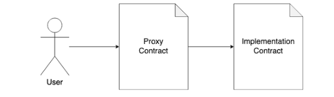
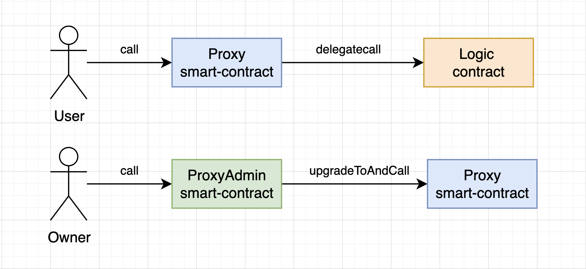
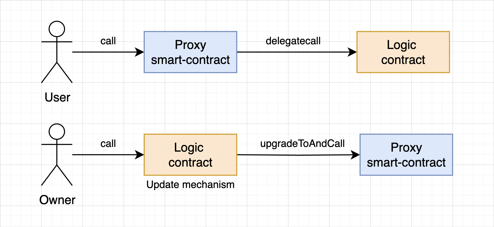
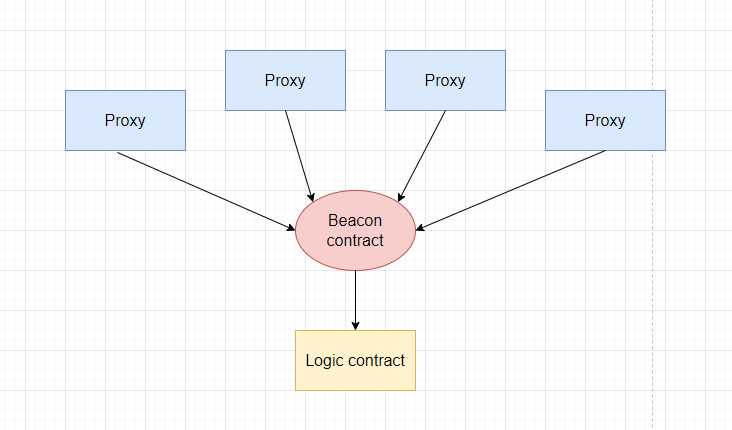

# Proxy pattern

Шаблон прокси использует разделение данных для хранения бизнес-логики и состояние в отдельных контрактах. Однако шаблон прокси отличается от способа 2(разделение данных). Это обратный метод разделения данных, когда контракт хранилище вызывает логический контракт.

_Важно !_ Дальше контракт хранилище состояний будем называть "прокси".

Схематично взаимодействие пользователя с контрактами реализации и прокси выглядит так.


## Концепт

Прокси шаблон работает следующим образом:
1. Пользователь взаимодействует с контрактом прокси. Например вызывает некий метод на контракте согласно бизнес-логике. Взаимодействие пользователя происходит только с контрактом прокси.
2. Прокси контракт не имеет реализованной функции, которая вызывается и поэтому контракт вызывает встроенную функцию ```fallback()```. Внутри этой функции происходит перенаправление вызова на логический контракт.
3. Прокси-контракт хранит адрес логического контракта и делегирует все вызовы функций логическому контракту (который содержит бизнес-логику) с использованием ```delegatecall()``` функции.
4. После перенаправления вызова на логический контракт возвращенные данные из логического контракта извлекаются и возвращаются пользователю или записываются на контракте прокси.

Чтобы понять принцип работы шаблона прокси необходимо понимать работу функции ``` delegatecall()```. По сути, ```delegatecall()``` - это код операции, который позволяет контракту вызывать другой контракт, в то время как фактическое выполнение кода происходит в контексте вызывающего контракта. Смысл использования ```delegatecall()``` в шаблонах прокси заключается в том, что прокси-контракт читает и записывает в свое хранилище и выполняет логику, хранящуюся в логическом контракте, как-будто если бы он вызывал внутреннюю функцию.

[Пример контракта](https://solidity-by-example.org/delegatecall/) с вызовом```delegateCall()```.

Чтобы заставить шаблон прокси работать, необходимо написать пользовательскую резервную функцию ```fallback()```, которая указывает, как контракт прокси должен обрабатывать вызовы функций, которые он не поддерживает. А уже внутри сделать вызов логического контракта через ```delegateCall()```.

В контракте прокси в любой момент можно изменить адрес контракта логики. Это позволяет нам обновлять логику контракта, не заставляя пользователей переходить на использование нового контракта.

## Конфликты селекторов функций
Шаблоны прокси — самый популярный способ обновления смарт-контрактов. Он устраняет трудности, связанные с миграцией контрактов или разделения данных. Однако шаблоны прокси более сложны в использовании и могут привести к критическим ошибкам при неправильном использование, таком как **конфликты селекторов функций**.

Для того, чтобы вызов с контракта прокси всегда делегировался, нужно чтобы вызов любой функции всегда попадал в ```fallback()``` и делегировался контракту логики. Поэтому контракт прокси не должен содержать одноименных функций с контрактом логики. Если это случится, то вызов не будет делегирован. Это значит, что всегда необходимо помнить о конфликте селекторов функций. Подробнее можно почитать об этом [тут](https://medium.com/nomic-foundation-blog/malicious-backdoors-in-ethereum-proxies-62629adf3357).

## Простой прокси
Весь вышеописанный опыт был описан в стандарте [eip-1967](https://eips.ethereum.org/EIPS/eip-1967). Стандарт описывает механизм безопасного делегирования вызова и несколько нюансов, связанных с хранением данных.

Простой пример контракта прокси можно посмотреть [тут](./contracts/SimpleProxy.sol).

Основное, что нужно усвоить:
1. Все вызовы проходят через контракт прокси, попадая в ```fallback()``` с последующим вызовом ```delegateCall()```.
2. Контракт прокси хранит адрес контракта реализации в качестве переменной состояния. Так как переменные контракта логики будут затирать значения в нулевом слоте, все собственные переменные контракта прокси должны хранится по случайным и недоступным слотам для контракта логики. Суть этой проблемы и ее решение описаны в [eip-1967](https://eips.ethereum.org/EIPS/eip-1967).
3. При обновление контракта до новой реализации нужно сохранять прошлую схему хранения переменных. Иначе старые данные будут перезаписаны.
4. Так как ```constructor()``` не является частью байт кода и запускается лишь один раз во время деплоя, необходим другой способ установки значений инициализации. Общепринятым считается использование функции ```initialize()```. Подробнее об этом можно прочитать у [openzeppelin](https://docs.openzeppelin.com/upgrades-plugins/1.x/proxies#the-constructor-caveat).

Поскольку прокси-контракт существует, ему потребуются собственные функции. Например ```upgradeTo(address newLogic)``` для смены адреса логического контракта. Но тогда прокси должен решить, следует ли проксировать/делегировать вызов к контракту логики. Что, если в контракте логики тоже есть функция с таким же именем, т.е. ```upgradeTo(address someAddr)```?

Первыми решение для этой проблемы придумали в OpenZeppelin. Они добавили понятие администратора прокси. Тогда, если администратор (т.е. **msg.sender == admin**) делает вызовы к прокси, прокси не будет делегировать вызов, а выполнит функцию в самом прокси, если она существует или сделает revert. Таким образом родилось собственное решение, которое называется [Transparent Proxy](https://docs.openzeppelin.com/upgrades-plugins/1.x/proxies#transparent-proxies-and-function-clashes).

_Важно !_ Чтобы адрес администратора мог быть обычным пользователем и его вызовы делегировались к контракту логики, openzeppelin предлагает дополнительный контракт ProxyAdmin. Вызовы от имени этого контракта на контракте прокси не будут делегироваться к контракту логики.

### Transparent vs UUPS

Transparent и UUPS(Universal Upgradeable Proxy Standard) — это разные реализации шаблона прокси для механизма обновления контрактов от openzeppelin. На самом деле между этими двумя реализациями нет большой разницы в том смысле, что они используют один и тот же интерфейс для обновлений и делегирования вызовов с прокси на реализацию.

Разница заключается в том, где находится логика обновления, в прокси контракте или контракте реализации.

> В Transparent proxy логика обновления находится в контракте прокси. Это означает, что контракт прокси имеет метод ```upgradeTo(address newLogic)```




```js
contract Logic {
    uint256 private _value;

    function store(uint256 value) public { /*..*/ }
    function retrieve() public view returns (uint256) { /*..*/ }
}

contract TransparentProxy {
    function _delegate(address implementation) internal virtual { /*..*/ }
    function getImplementationAddress() public view returns (address) { /*..*/ }

    /// @notice Обновить адрес контракта логики для прокси
    upgradeTo(address newlogic) external {
        // Меняем адрес логики в специальном слоте памяти прокси контракта
    }

    fallback() external { /*..*/ }
}
```

> В UUPS логика обновления обрабатывается самим контрактом логики. Это означает, что контракт логики имеет метод ```upgradeTo(address newLogic)```



```js
contract Logic {
    uint256 private _value;

    function store(uint256 value) public { /*..*/ }
    function retrieve() public view returns (uint256) { /*..*/ }

    /// @notice Обновить адрес контракта логики для прокси
    upgradeTo(address newlogic) external {
        // Меняем адрес логики в специальном слоте памяти прокси контракта
    }
}

contract TransparentProxy {
    function _delegate(address implementation) internal virtual { /*..*/ }
    function getImplementationAddress() public view returns (address) { /*..*/ }
    fallback() external { /*..*/ }
}
```

Так как реализация Transparent Proxy включает в себя методы по управлению прокси и дополнительный контракт ProxyAdmin для определения необходимости делегирования деплой таких контрактов дороже, чем UUPS. Так как UUPS более легковесный и не требует proxyAdmin.

Однако нужно помнить, что в случае с UUPS контракт логики хранит дополнительный код обновления, а значит деплой такого контракта дороже, чем деплой просто логики.

Еще важный момент, TransparentProxy в каждом вызове проверяет от кого вызов, от админа или простого пользователя. Это нужно для того, чтобы определить нужно ли делегировать выполнение или выполнять собственные методы администрирования прокси. Из-за дополнительного кода такой проверки все вызовы функций TransparentProxy незначительно дороже UUPS.

С другой стороны, для UUPS необходимо не забыть правильно реализовать в контракте логики методы для управления прокси. Иначе есть угроза никогда не обновить контракт. Для минимизации рисков можно посоветовать использовать возможности готового решения [библиотеки OpenZeppelin](https://docs.openzeppelin.com/contracts/4.x/api/proxy#UUPSUpgradeable)

С примером использования TransparentProxy на базе библиотеки openzeppelin можно ознакомиться [тут](./contracts/TransparentProxy.sol).

С примером использования UUPS на базе библиотеки openzeppelin можно ознакомиться [тут](./contracts/UUPSProxy.sol).

## Beacon Proxy
Это шаблон прокси, в котором несколько прокси контрактов ссылаются на один смарт-контракт. Этот смарт-контракт предоставляет им адрес контракта логики. Контракт, который дает адрес контракта реализации для любых прокси, называется контрактом "Beacon".



_Важно!_ Этот подход оправдывает себя, когда у вас несколько прокси, а контракт логики один. При этом контракт логики постоянно обновляется. В случае с TransparentProxy и UUPS будет необходимо обновлять каждый прокси. Beacon proxy прекрасное решение для этого случая. Нам достаточно сделать только один вызов на контракте Beacon для обновления логики сразу для всех контрактов прокси.

Пример простой реализации Beacon proxy [тут](./contracts/BeaconProxy.sol).

## Minimal Clones

Это стандарт на основе [eip-1167](https://eips.ethereum.org/EIPS/eip-1167) для развертывания минимальных прокси контрактов, которые называют клонами. OpenZeppelin предлагает собственную [библиотеку](https://docs.openzeppelin.com/contracts/4.x/api/proxy#Clones) реализации стандарта.

Использовать этот подход следует, когда нужно на смарт контракте создавать новый экземпляр другого контракта и это действие повторяющиеся с течением времени. За счет низкоуровневых вызовов и свертки кода библиотеки в байткод такое клонирование относительно недорогое. Позволяет инициализировать экземпляр клона в транзакции создания.

_Важно!_ Библиотека поддерживает функции для создания контрактов ```create()``` и ```create2()```. Также поддерживает функции для прогнозирования адресов клонов.

_Очень важно!_ Этот подход не служит для обновления логики контрактов задеплоенных при помощи **eip-1167**. Это просто дешевый, контролируемый способ создать клона существующего контракта.

Простой пример использования библиотеки Clones можно посмотреть [тут](./contracts/ClonesProxy.sol). Пример показывает создание контракта пары внутри контракта фабрики. Вдохновлялся концептом Uniswap.

Больше примеров использования [тут](https://github.com/OpenZeppelin/workshops/tree/master/02-contracts-clone).

## Плагин от openzeppelin

Для Hardhat у OpenZeppelin существуют плагин дял скриптов при помощи которого можно деплоить и управлять различными прокси. [Ссылка на документацию](https://docs.openzeppelin.com/upgrades-plugins/1.x/). [Использование вместе с hardhat](https://docs.openzeppelin.com/upgrades-plugins/1.x/hardhat-upgrades).

Плагин поддерживают шаблоны прокси UUPS, Transparent и Beacon. В зависимости от шаблона варианты обновления отличаются.

## OpenZeppelin utils

Как мы говорили выше upgradeable контракты не имеют ```constructor()```. Вместо этого используется общепринятая функция ```initialize()```. Напоминаем, что она используется для первичной инициализации данных при деплое обновляемого контракта.

OpenZeppelin предлагает собственную утилиту [Initializable](https://docs.openzeppelin.com/contracts/4.x/api/proxy#Initializable) для безопасного управления инициализацией. По сути это базовый контракт, который предлагает помощь в написание обновляемого контракта с возможностью защитить функцию ```initialize()``` от повторного вызова.

_Важно!_ Чтобы не оставлять proxy контракт неинициализированным, нужно вызывать функцию ```initialize()``` как можно раньше. Обычно это делается при помощи аргумента **data** в момент деплоя proxy.

_Важно!_ Помимо того, что нельзя оставлять proxy контракт неинициализированным, также не рекомендуется оставлять возможность вызвать функцию ```initialize()``` на контракте логики.

Для запрета вызова функции ```initialize()``` на контракте логики утилита реализует функцию ```_disableInitializers();```.

Пример использования:
```solidity
/// @custom:oz-upgrades-unsafe-allow constructor
constructor() {
    _disableInitializers();
}
```

Рабочий пример кода контрактов можно посмотреть [тут](./contracts/Initialize.sol).

## Links

1. [Пример delegateCall вызова](https://solidity-by-example.org/delegatecall/)
2. [DelegateCall: Calling Another Contract Function in Solidity](https://medium.com/coinmonks/delegatecall-calling-another-contract-function-in-solidity-b579f804178c)
3. [Delegate call solidity doc](https://docs.soliditylang.org/en/latest/introduction-to-smart-contracts.html#delegatecall-and-libraries)
4. [Malicious backdoors in Ethereum Proxies](https://medium.com/nomic-foundation-blog/malicious-backdoors-in-ethereum-proxies-62629adf3357)
5. [Proxy patterns](https://blog.openzeppelin.com/proxy-patterns/)
6. [Proxy Patterns For Upgradeability Of Solidity Contracts: Transparent vs UUPS Proxies](https://mirror.xyz/0xB38709B8198d147cc9Ff9C133838a044d78B064B/M7oTptQkBGXxox-tk9VJjL66E1V8BUF0GF79MMK4YG0)
7. [Upgrading your Smart Contracts | A Tutorial & Introduction](https://www.youtube.com/watch?v=bdXJmWajZRY&ab_channel=PatrickCollins)
8. [ERC-1822: Universal Upgradeable Proxy Standard (UUPS)](https://eips.ethereum.org/EIPS/eip-1822)
9. [How to create a Beacon Proxy](https://medium.com/coinmonks/how-to-create-a-beacon-proxy-3d55335f7353)
10. [ERC-1167: Minimal Proxy Contract](https://eips.ethereum.org/EIPS/eip-1167)