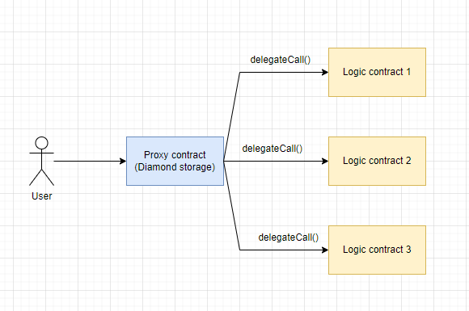

# Diamond pattern

Этот подход можно считать улучшением прокси шаблона. Главное отличие заключается в том, что diamond proxy может делегировать вызовы более чем одному логическому контракту.



Diamond шаблон обновления имеет некоторые преимущества по сравнению с обычными шаблонами прокси:

1. Можно обновить только небольшую часть контракта без изменения всего кода.

2. Diamond шаблон позволяет легко разделить функции на несколько логических контрактов. Таким образом можно легко обойти ограничение размера контракта в 24 КБ.

3. Diamond шаблон обеспечивает модульный подход к управлению разрешениями на обновление, можно ограничить обновление определенных функций в рамках смарт-контракта.

Снаружи Diamond паттерн кажется единым смарт-контрактом и имеет один адрес. Внутри использует набор смарт-контрактов, которые называются **facets**.

Когда снаружи на контракте Diamond прокси вызывается функция, прокси проверяет, есть ли у него **facet** с этой функцией, и вызывает ее, если она существует. При этом все состояния хранятся на контракте на основном Diamond.

_Важно!_ Diamond также, как и обычные прокси имеет резервную функцию ```fallback()``` внутри которой реализовано делегирование вызова к **facets**

Первоначально EIP-2535 Diamonds был создан для устранения ограничения контракта в 24 КБ, но оказалось, что он полезен и помимо этого. Он обеспечивает основу для создания более крупных систем смарт-контрактов, которые могут расширяться в процессе разработки.

## Inherited storage

Так как много facets используют одно и тоже адресное пространство хранения в рамках контракта Diamond proxy необходимо правильно реализовать процесс создания и обновления **state** контракта.

Самая простая стратегия заключается в создание отдельного контракта Storage. Тут вспоминаем наш [второй метод](../method-2/readme.md) обновления смарт-контрактов. Важно строгое определение любых state переменных только в этом контракте. Эта стратегия работает и успешно используется в реализации паттерна.

Однако с большим количеством facets достаточно легко начать путать переменные объявленные в Storage и локально. Поэтому существует еще один подход к организации storage.

## Diamond Storage

Для каждого facet можно указать разные места для начала хранения данных, тем самым предотвращая конфликты разных facets с разными переменными состояния в местах хранения.

Мы можем хэшировать уникальную строку, чтобы получить случайную позицию хранения и сохранить там структуру. Структура может содержать все переменные состояния, которые нам нужны. Уникальная строка может действовать как пространство имен для определенных функций.

## App Storage

Еще один вариант это завести одну структуру AppStorage для всех facets сразу. И в этой структуре хранить все переменные. Это может быть намного удобнее, потому что не нужно будет думать о разграничение state переменных.

# Examples
1. [Simple implementation](https://github.com/mudgen/diamond-1-hardhat)
2. [Gas-optimized](https://github.com/mudgen/diamond-2-hardhat)
3. [Simple loupe functions](https://github.com/mudgen/diamond-3-hardhat)

## Links
1. [Introduction to EIP-2535 Diamonds](https://eip2535diamonds.substack.com/p/introduction-to-the-diamond-standard?s=w)
2. [ERC-2535: Diamonds, Multi-Facet Proxy](https://eips.ethereum.org/EIPS/eip-2535)
3. [Smart Contract Security Audits for EIP-2535 Diamonds Implementations](https://eip2535diamonds.substack.com/p/smart-contract-security-audits-for)