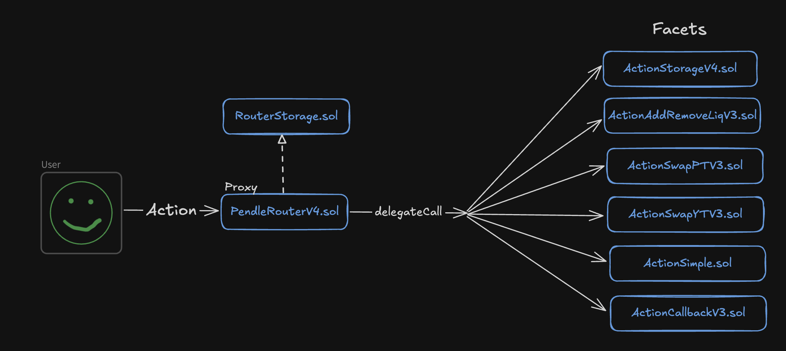

# Pendle маршрутизация. Свой путь в разделение логики протокола

[Pendle](https://www.pendle.finance/) - это протокол токенизации доходности c элементами трейдинга в нескольких EVM-совместимых сетях.

Pendle в своих смарт-контрактах пересмотрел шаблон **Diamond** и упростил его. Кодовая база протокола делится на два репозитория, но core функционал все равно большой, поэтому существует необходимость разделять код на несколько логических групп.

Протокол Pendle выстраивает взаимодействие пользователя со смарт-контрактами подобно Uniswap и другим протоколам через один смарт-контракт маршрутизации [(роутер или PendleRouterV4.sol)](https://github.com/pendle-finance/pendle-core-v2-public/blob/main/contracts/router/PendleRouterV4.sol).



На схеме видно, что любое действие пользователя будет делегировано к соответствующему смарт-контракту с логикой (facet). Например, логика свапа находится на смарт-контрактах [ActionSwapPTV3.sol](https://github.com/pendle-finance/pendle-core-v2-public/blob/main/contracts/router/ActionSwapPTV3.sol) и [ActionSwapYTV3.sol](https://github.com/pendle-finance/pendle-core-v2-public/blob/main/contracts/router/ActionSwapYTV3.sol).

## Упрощенная реализация маршрутизации

В этом разделе мы подробно построим минимально рабочий прототип системы маршрутизации вызовов, который был реализован в протоколе Pendle.

### Концепт прототипа

Для прототипа реализуем смарт-контракт **Router**, который будет единой точкой входа. Этот смарт-контракт будет прокси смарт-контрактом и сможет делегировать вызов к смарт-контракту `ActionSimple.sol` или другому фасету. Каждый из фасетов может реализовывать собственный функционал. Смотри схему ниже.


Логично, что смарт-контракт роутера должен уметь определять список своих фасетов для делегирования вызова к нужному. Для этого реализуем отдельный смарт-контракт `ActionStorage.sol`, который будет обрабатывать список всех фасетов.

### Реализация

**Шаг 1**

Первым делом реализуем простой смарт-контракт [ActionSimple.sol](./contracts/ActionSimple.sol), который является целевым для вызова и будет содержать всего одну функцию `execute()` и бросать событие.

```solidity
contract ActionSimple {
    event Executed(bool success);

    function execute() external {
        emit Executed(true);
    }
}
```

Мы будем вызывать функцию `execute()` на смарт-контракте `Router.sol` и будем ожидать, что вызов будет делегирован смарт-контракту `ActionSimple.sol`.

**Шаг 2**

Реализуем простой смарт-контракт [Router.sol](./contracts/Router.sol), который наследуем от [Proxy.sol](https://github.com/OpenZeppelin/openzeppelin-contracts/blob/master/contracts/proxy/Proxy.sol). Это смарт-контракт OpenZeppelin, который даст возможность делегировать вызов.

Наследование от **Proxy.sol** диктует нам необходимость реализовать функцию `_implementation()` в которой мы будем определять куда делегировать вызов для исполнения.

```solidity
import {Proxy} from "@openzeppelin/contracts/proxy/Proxy.sol";

contract Router is Proxy {
  function _implementation() internal view override returns (address facet) {}
}
```

Все вызовы пришедшие на смарт-контракт `Router.sol` будут попадать в [fallback()](https://github.com/OpenZeppelin/openzeppelin-contracts/blob/master/contracts/proxy/Proxy.sol#L58) функцию, а уже оттуда вызывается функция `_implementation()`, которую мы переопределили. В следующих шагах мы напишем код этой функции.

**Шаг 3**

На этом шаге необходимо реализовать хранилище, которое будет содержать информацию по всем фасетам. Для этого реализуем абстрактный смарт-контракт [RouterStorage.sol](./contracts/RouterStorage.sol).

```solidity
abstract contract RouterStorage {
    // Структура для хранения списка фасетов
    struct CoreStorage {
        // Для каждого селектора функции будем хранить адрес смарт-контракта, где эта функция реализована
        mapping(bytes4 selector => address facet) selectorToFacet;
    }

    // keccak256(abi.encode("the-same-pendle-routing"))
    bytes32 private constant STORAGE_LOCATION = 0x25e5c12553aca6bac665d66f71e8380eae2ff9ef17f649227265212ec2f7f613;

    // Функция, которая будет возвращать слот с фасетами
    function _getCoreStorage() internal pure returns (CoreStorage storage $) {
        assembly {
            $.slot := STORAGE_LOCATION
        }
    }
}
```

Сделаем так, чтобы `Router.sol` наследовался от `RouterStorage.sol`. Теперь роутер может получать адрес имплементации для каждого селектора функции из вызова.

```solidity
import {Proxy} from "@openzeppelin/contracts/proxy/Proxy.sol";

import {RouterStorage} from "./RouterStorage.sol";

contract Router is Proxy, RouterStorage {
  function _implementation() internal view override returns (address facet) {
      RouterStorage.CoreStorage storage $ = _getCoreStorage();

      // Получение адреса фасета из данных вызова
      facet = $.selectorToFacet[msg.sig];
      if (facet == address(0)) {
          revert InvalidSelector();
      }
  }
}
```

**Шаг 4**

Здесь нужно понимать, что `Router.sol` - это прокси и физически мы работаем с его **storage**. Но при этом нам необходимо записать в `mapping selectorToFacet` данные по доступным селекторам вызова и адресам исполнения.

Сделаем отдельный смарт-контракт [ActionStorage.sol](./contracts/ActionStorage.sol), который будет отвечать за обновление `mapping selectorToFacet` и другие функции управления.

```solidity
import {RouterStorage} from "./RouterStorage.sol";

struct SelectorsToFacet {
    address facet;
    bytes4[] selectors;
}

contract ActionStorage is RouterStorage {
    function setSelectorToFacets(SelectorsToFacet[] calldata arr) external {
        CoreStorage storage $ = _getCoreStorage();

        for (uint256 i = 0; i < arr.length; i++) {
            SelectorsToFacet memory s = arr[i];

            for (uint256 j = 0; j < s.selectors.length; j++) {
                // Записываем данные по фасетам и селекторам
                $.selectorToFacet[s.selectors[j]] = s.facet;
            }
        }
    }
}
```

**Шаг 5**

Есть важный момент, `ActionStorage.sol` - это отдельный самостоятельный смарт-контракт, поэтому смарт-контракт `Router.sol` уже в момент деплоя должен знать об `ActionStorage.sol` и уметь делегировать вызов  `setSelectorToFacets()` на него.

Добавим адрес `ActionStorage.sol` в constructor роутера.

```solidity
import {IActionStorage} from "./ActionStorage.sol";

contract Router is Proxy, RouterStorage {
    constructor(address actionStorage) {
        RouterStorage.CoreStorage storage $ = _getCoreStorage();
        // Реализуем возможность делегировать setSelectorToFacets() вызовы на адрес смарт-контракта ActionStorage
        $.selectorToFacet[IActionStorage.setSelectorToFacets.selector] = actionStorage;
    }
    ...
}
```

Таким образом все что остается сделать, это закрыть свободный вызов функции `setSelectorToFacets()`. Для этого можно воспользоваться паттернами Ownable, AccessControl.

Полная реализация смарт-контрактов:
- [Router.sol](./contracts/Router.sol)
- [RouterStorage.sol](./contracts/RouterStorage.sol)
- [ActionStorage.sol](./contracts/ActionStorage.sol)
- [ActionSimple.sol](./contracts/ActionSimple.sol)

## Проверка в Remix IDE

В качестве домашнего задания воспроизведите вызов функции `execute()` через смарт-контракт `Router.sol`.

Для этого необходимо открыть [Remix IDE](https://remix.ethereum.org/), перенести код смарт-контрактов, задеплоить и сделать вызов. В результате вы должны получить событие `Executed()`.

**Подсказка 1**

Calldata для вызова функции `execute()` - `0x61461954`. Проверить можно при помощи Chisel от Foundry. Для этого вызвать команду `abi.encodeWithSignature("execute()")`.

**Подсказка 2**

После того, как все смарт-контракты задеплоены необходимо добавить селектор функции `execute()` и адрес смарт-контракта `ActionSimple.sol` (куда должен быть делегирован вызов) в `mapping selectorToFacet`.

Для этого придется закодировать вызов функции `setSelectorToFacets()` для смарт-контракта `Router.sol`. Это можно сделать при помощи chisel, еще одного смарт-контракта или своим способом. Затем вызывать функцию `setSelectorToFacets()` на смарт-контракте `Router.sol`.

## Вывод

Протокол Pendle пересмотрел паттерн **Diamond** и упростил его под себя. При этом, реализованный код по-прежнему позволяет не только эффективно маршрутизировать пользовательские вызовы, но и:
- Обходить проблему ограничения размера смарт-контракта.
- Обновлять логику работы смарт-контрактов, добавлять новые смарт-контракты, отключать старые.

Осторожно - личное мнение! Порой, лично меня останавливало внедрение паттерна **Diamond** на своем проекте. Я постоянно прикидывал насколько будет целесообразно увеличить сложность в угоду возможной масштабируемости. Поэтому использование упрощенного подхода, как в Pendle, может быть компромиссом между сложностью и масштабируемостью.

## Links

1. [Pendle documentation](https://docs.pendle.finance/Home)
2. [Pendle github](https://github.com/pendle-finance/pendle-core-v2-public/tree/main)


