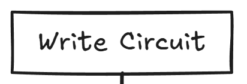
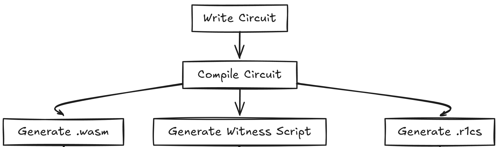
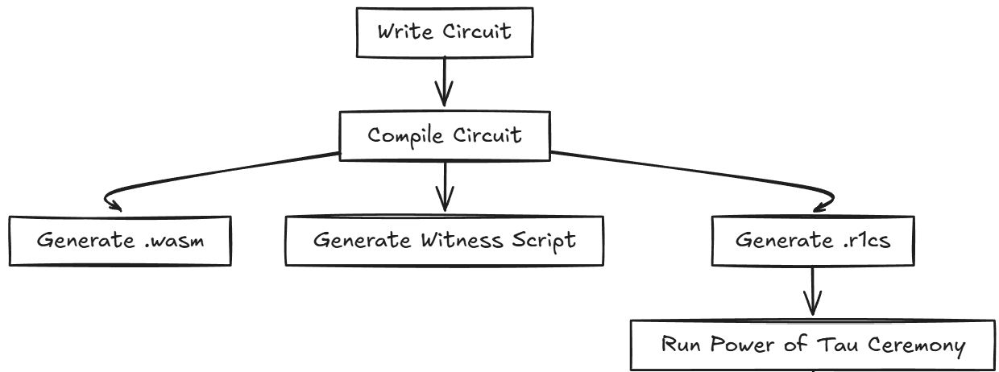
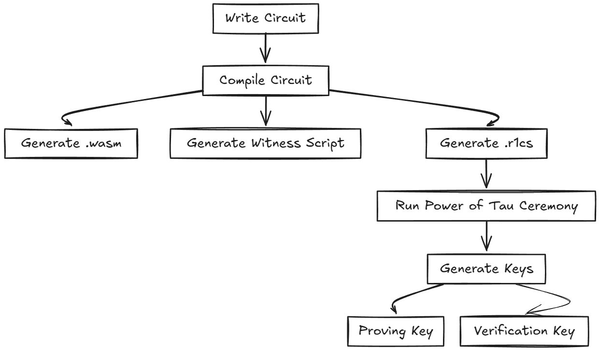
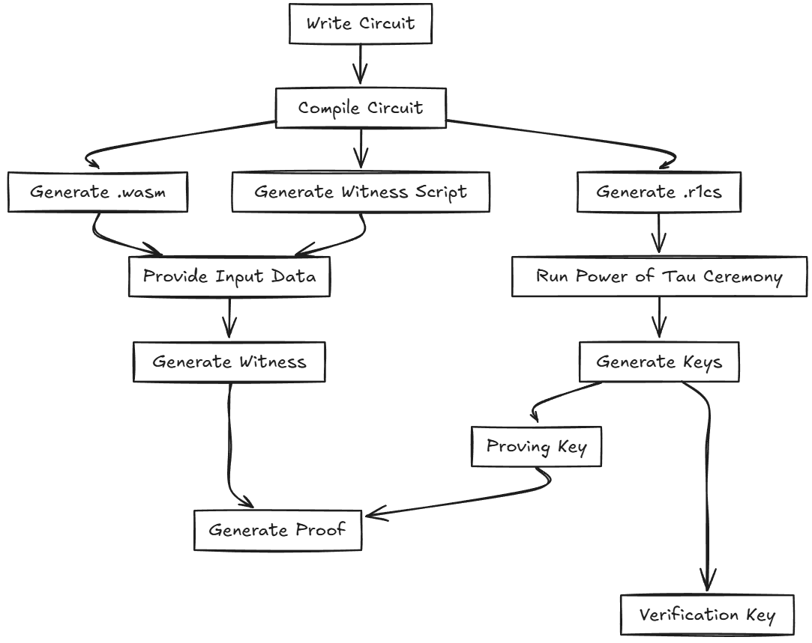
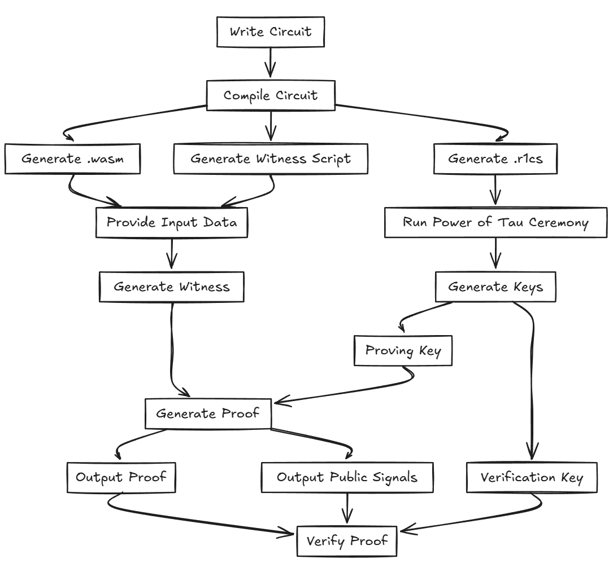
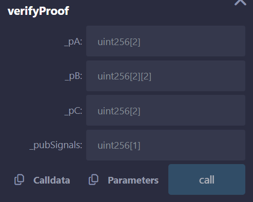

# Circom и SnarkJS: Практическое руководство по созданию схем и Zero-Knowledge Proofs

**Автор:** [Алексей Куценко](https://github.com/bimkon144) 👨‍💻

## Введение

Circom — это специализированный язык программирования, созданный для разработки арифметических схем, которые лежат в основе доказательств с нулевым разглашением (Zero-Knowledge Proofs, ZKPs). Эти доказательства позволяют одной стороне (доказывающему) продемонстрировать другой стороне (проверяющему), что некое утверждение истинно, не раскрывая при этом никакой дополнительной информации о самом утверждении. Ознакомиться с концепцией доказательств с нулевым разглашением вы можете в нашем вики, там есть прекрасная статья.

Арифметические схемы — это набор математических выражений, которые описывают, как связаны входные данные, промежуточные вычисления и конечные результаты. Эти выражения преобразуются в полиномиальные уравнения, которые решаются с использованием ограниченного набора чисел, где все операции (сложение, умножение и другие) выполняются по определённым правилам. Такие схемы широко используются в криптографических протоколах для проверки правильности данных и обеспечения их безопасности.

Этот язык позволяет описывать сложные математические зависимости в виде набора ограничений (constraints), которые затем могут быть использованы для генерации доказательств и проверки утверждений без раскрытия исходных данных. Как пример использования Circom можете посмотреть на [Tornado cash](https://github.com/tornadocash/tornado-core/blob/master/circuits/withdraw.circom).

Circom предоставляет разработчикам удобные инструменты для создания этих схем в простом и понятном виде.

## Установка Circom и snarkjs

Перед началом изучения, необходимо установить circom и snarkjs, почитать как это сделать, можно [тут](https://docs.circom.io/getting-started/installation/#installing-dependencies).

После установки, необходимо убедиться что вы установили их: `circom --version` и `snarkjs --version`.

## Основные концепции Circom

На каждом этапе мы будем дорисовывать схемы по меру продвижения, чтобы у вас сложилась полная и понятная картина работы circom в паре со snarkjs.
Начнём с того, что схему необходимо написать.



Для того, чтобы мы могли написать минимально понятную в целях обучения схему, необходимо понять основные понятия.

### Сигналы: Что это и какие они бывают?

Сигналы в Circom играют роль переменных, но с более строгими правилами использования. Они задают значения, которые участвуют в ограничениях и вычислениях внутри схемы. В зависимости от назначения сигналы делятся на три типа:

Входные сигналы (input)
Эти сигналы представляют собой данные, которые передаются в схему извне. Они задаются пользователем перед выполнением схемы.

Выходные сигналы (output)
это результаты вычислений, которые схема возвращает как конечный результат.

Промежуточные сигналы
Эти сигналы используются внутри схемы для промежуточных вычислений. Они не видны за пределами схемы и служат исключительно для внутренних операций.

В отличие от переменных, которые могут менять своё значение в процессе выполнения программы, сигналы представляют собой постоянные величины в рамках схемы, и их значения фиксируются при вычислении доказательства.

```circom
pragma circom 2.1.6;       // Определяет версию circom

template Addition {
    signal input a;        // Входной приватный сигнал: первое число
    signal input b;        // Входной приватный сигнал: второе число
    signal output result;  // Выходной сигнал
}
```

Сигналы `a` и `b`
Это входные сигналы, представляющие два числа, которые пользователь задаёт перед выполнением схемы. Они используются в вычислениях. Данные сигналы приватные, и их значения известны только пользователю, который будет создавать доказательство.

Сигнал `result`
Выходной сигнал, представляющий результат выполнения будущих вычислений. Это значение возвращается наружу после выполнения схемы. Он всегда существует только в виде публичного сигнала.

### Ограничения (Constraints)

В языке Circom ограничения (constraints) — это базовые строительные блоки для описания вычислений в системе доказательств с нулевым разглашением (ZKP). Ограничения выражают математические отношения между переменными, которые должны быть соблюдены, чтобы доказательство считалось корректным.

Проще говоря, это набор уравнений, которые определяют допустимые значения переменных.  В контексте Circom, эти уравнения затем преобразуются в рангифицированные системы уравнений (R1CS), которые используются для создания ZKP.

Ограничения необходимы, чтобы гарантировать, что доказательство точно соответствует заявленным условиям, без раскрытия самого вычисления или исходных данных.

Теперь можно воспользоваться ограничениями чтобы убедиться, что результат входных сигналов a и b это их сумма.

```circom
pragma circom 2.1.6;       // Определяет версию circom

template Addition {
    signal input a;        // Входной сигнал: первое число
    signal input b;        // Входной сигнал: второе число
    signal output result;  // Выходной сигнал: результат сложения

    // Ограничение: результат равен сложения входных сигналов
    result <== a + b;
}
```

Ограничение `result <== a + b` определяет связь между входами и выходом. Оно говорит, что `result` должен быть равен сумме `a` и `b`.

### Шаблоны

Шаблоны (templates) — это основной механизм модульного построения схем в Circom. Они позволяют создавать универсальные и переиспользуемые фрагменты логики, упрощая разработку сложных схем и повышая их читаемость и поддерживаемость. Каждая схема изначально создаётся через шаблон.

Как работают шаблоны?

1. Создание шаблона

    Шаблон в Circom — это своего рода "заготовка". Шаблоны определяются с помощью ключевого слова template и содержат: Сигналы, ограничения, логику вычисления.

2. Инициализация шаблона

    Для использования шаблона создаётся его экземпляр, называемый компонентом (component). Компоненты можно параметризовать, чтобы сделать их более гибкими. Подключать к сигналам основной схемы или другим компонентам.

3. Параметры шаблона

    Шаблоны могут принимать параметры при создании, что делает их подходящими для разных сценариев. Например, можно задать фиксированное значение или логику, зависящую от параметра.

Пример: Шаблон сложения

Создадим файл `Main.circom`:

```solidity
pragma circom 2.2.1;       // Определяет версию circom

template Addition {
    signal input a;        // Входной сигнал
    signal input b;        // Входной сигнал
    signal output sum;     // Выходной сигнал

    sum <== a + b;
}

template Main {
    // Инициализируем шаблон Addition как компонент adder
    component adder = Addition();

    signal input x;        // Первое число
    signal input y;        // Второе число
    signal output result;  // Результат сложения

    // Подключаем сигналы
    adder.a <== x;         // Передаём x в шаблон
    adder.b <== y;         // Передаём y в шаблон
    result <== adder.sum;  // Подключаем результат
}

// Указываем главный компонент main
component main = Main();
```

Разбор кода

1. Шаблон Addition

    Входные сигналы `a` и `b`: значения для сложения.
    Выходной сигнал `sum`: результат сложения.
    Ограничение: `sum <== a + b`, которое задаёт математическое правило для входов и выхода.

2. Инициализация в основной схеме

    Основная схема Main использует шаблон Addition как компонент adder.
    Сигналы основной схемы `x`, `y` и `result` подключаются к сигналам компонента:
    `x` передаётся как вход `a`.
    `y` передаётся как вход `b`.
    Выход `sum` компонента подключается к сигналу `result`.

3. Переиспользование и масштабируемость

    Такой подход позволяет легко переиспользовать шаблон Addition в других схемах. Например, можно инициализировать его несколько раз для построения более сложных вычислений.

## Генерация и проверка доказательств

### Компиляция схем

Для компиляции схемы используется команда `circom Main.circom --r1cs --wasm`



Результат компиляции указан на картинке ниже:


Вы получите следующие файлы:

`Main.r1cs` — файл ограничений (R1CS), описывающий арифметическую схему.

`Main_js` — папка с файлами JavaScript и WebAssembly:

- `Main.wasm` — webAssembly файл, который содержит описание схемы. Используется для вычислений внутри схемы, при генерации файла свидетельства.
- `generate_witness.js` — скрипт на JavaScript для создания файла свидетельства (`witness.wtns`) на основе входных данных.
- `witness_calculator.js` — основной модуль, выполняющий вычисление свидетельства.

Результат компиляции включает следующую информацию:

`template instances`: 2 — количество созданных экземпляров шаблонов.

`non-linear constraints`: 0 — количество нелинейных ограничений (умножения переменных).

`linear constraints`: 1 — количество линейных ограничений (сложение, вычитание, умножение на константу).

`public inputs`: 0 — количество публичных входов (видимых проверяющим).

`private inputs`: 2 — количество приватных входов (скрытых значений - a и b сигналы).

`public outputs`: 1 — количество публичных выходов (видимых в доказательстве - result).

`wires`: 4 — провода" (wires) представляют собой внутренние значения, передаваемые между компонентами схемы.
В схеме 4 провода, потому что:

`x` — входной сигнал (создаёт провод).

`y` — входной сигнал (создаёт провод).

`sum` — результат сложения внутри компонента `adder` (создаёт провод).

`result` — выходной сигнал схемы Main, который берёт значение из sum (создаёт провод).

`labels`: 7 - "метки" (labels) представляют собой идентификаторы для всех сигналов и ограничений схемы.

`x` — метка для входного сигнала `x`.

`y` — метка для входного сигнала `y`.

`result` — метка для выходного сигнала `result`.

`a` — метка для сигнала a внутри шаблона `Addition`.

`b` — метка для сигнала b внутри шаблона `Addition`.

`sum` — метка для сигнала sum внутри шаблона `Addition`.

Ограничение: уравнение `sum <== a + b`.

### Power of Tau Ceremony

Для создания доказательства (proof) в системе ZK-SNARKs используется несколько этапов. В частности, необходимо выполнить Power of Tau Ceremony.

Что такое Power of Tau Ceremony?

Это процедура, применяемая в протоколах ZK-SNARKs для установки доверенного начального состояния. Power of Tau Ceremony создаёт файл формата `.ptau` с заранее вычисленными значениями, который:

- Ускоряет генерацию proving и verifying ключей.
- Делает возможным использование одного файла для разных схем.

Подробнее об этом можно почитать в [документации snarkjs](https://github.com/iden3/snarkjs?tab=readme-ov-file#1-start-a-new-powers-of-tau-ceremony). Существуют уже заранее [сгенерированные файлы](https://github.com/iden3/snarkjs?tab=readme-ov-file#7-prepare-phase-2), вам только требуется выбрать подходящий файл.

Как выбрать подходящий .ptau файл?

1. Подсчитайте количество ограничений в вашей схеме с помощью команды: `snarkjs r1cs info Main.r1cs`
2. Подберите .ptau файл, подходящий для количества ограничений. Например, для схем до 256 подходит `powersOfTau28_hez_final_08.ptau`, который можем скачать командой `wget https://storage.googleapis.com/zkevm/ptau/powersOfTau28_hez_final_08.ptau -O hez8.ptau`

### Генерация proving и verifying keys



1. Создание proving и verifying ключей, которые необходимы для работы схемы в протоколе ZK-SNARKs. Эти ключи обеспечивают возможность генерировать доказательства корректности вычислений и проверять их.
Для этого мы используем следующую команду:`snarkjs groth16 setup Main.r1cs hez8.ptau Main_0000.zkey`.
Эта команда использует описание схемы (`Main.r1cs`) и предварительно подготовленный файл (`hez8.ptau`) из Power of Tau Ceremony для генерации промежуточного proving ключа `Main_0000.zkey`. Этот ключ необходим для последующих этапов настройки и доказательства.

1. Добавление вашего личного вклада (contribution) в процесс настройки схемы, чтобы завершить генерацию proving ключа.
Это делается с помощью команды: `snarkjs zkey contribute Main_0000.zkey Main_final.zkey --name="My Contribution" -v`.

    Для чего это нужно?

    - Усиление безопасности: На этом этапе вы добавляете случайность, вводя произвольное секретное слово. Это гарантирует, что даже если предыдущие этапы настройки были скомпрометированы, ваша схема остаётся безопасной.
    - Генерация финального proving ключа: После добавления вклада создаётся файл `Main_final.zkey`, который будет использоваться для создания доказательств (proofs) корректности вычислений.
    - Прозрачность процесса: Ваш вклад регистрируется, и благодаря опции -v вы видите детальную информацию о выполнении команды, включая подтверждение того, что вклад успешно добавлен.

    Этот этап завершает настройку proving ключа, делая его уникальным и защищённым от вмешательства.

3. Процесс экспорта верификационного ключа осуществляется с помощью команды: `snarkjs zkey export verificationkey Main_final.zkey verification_key.json`.

    Для чего это нужно?

    - Создание верификационного ключа: Эта команда извлекает из финального proving ключа (`Main_final.zkey`) данные, необходимые для проверки доказательства. Полученный файл `verification_key.json` содержит публичную информацию, которая будет использоваться для верификации корректности доказательства.

    - Упрощение проверки: Верификационный ключ (`verification key`) представляет собой компактный набор данных, который не содержит приватных сведений. Он может быть безопасно передан любому проверяющему для выполнения проверки.

    - Необходимый этап для верификации: Этот ключ требуется на этапе проверки доказательства, чтобы подтвердить, что предоставленные данные соответствуют условиям схемы.

    Команда считывает данные из файла `Main_final.zkey` (финального proving ключа) и извлекает публичные параметры, формируя JSON-файл `verification_key.json`. Этот файл используется в последующих шагах для проверки доказательства.

### Генерация доказательства



Процесс создания доказательства в ZK-SNARKs состоит из нескольких этапов:

1. Генерация файла свидетельства
Файл свидетельства создаётся на основе входных данных и схемы.
Для этого в корневом каталоге создаём `input.json` и указываем наши два входных сигнала схемы:
    ```
        {
            "x": 3,
            "y": 4
        }
    ```

Используйте команду:`node Main_js/generate_witness.js Main_js/Main.wasm input.json witness.wtns`.

- Схема: `Main.wasm` — webAssembly-файл, описывающий логику схемы.
- Входные данные: `input.json` — файл, содержащий значения публичных и приватных сигналов.
- Результат: `witness.wtns` — файл, содержащий вычисленные значения всех сигналов схемы.

2. Создание доказательства

Для создания доказательства используется файл свидетельства (`witness.wtns`) и финальный proving ключ (`Main_final.zkey`). Выполните следующую команду:`snarkjs groth16 prove Main_final.zkey witness.wtns proof.json public.json`.

Что происходит на этом этапе:

- Входные файлы:
    `Main_final.zkey` — финальный proving ключ, полученный на этапе настройки.
    `witness.wtns` — файл свидетельства, сгенерированный на предыдущем этапе.
- Результат выполнения:
    `proof.json` — файл доказательства, который подтверждает, что вычисления в схеме выполнены корректно.
    `public.json` — файл, содержащий публичные входные и выходные значения схемы. Этот файл необходим для проверки доказательства.

### Проверка доказательства



Последний этап, на котором нам нужно проверить доказательство на подлинность.

Что требуется для проверки:

`verification_key.json` — файл верификационного ключа, сгенерированный ранее.
`public.json` — файл с публичными данными, который связывает входы схемы и выходное значение.
`proof.json` — файл доказательства, созданный на предыдущем этапе.

Выполнить проверку можно командой: `snarkjs groth16 verify verification_key.json public.json proof.json`.
Если доказательство корректно, вы получите сообщение об успешной проверке `[INFO]  snarkJS: OK!`.

Поздравляю, вы смогли создать доказательство и верифицировать его, не раскрывая входных данных схемы a и b.

### Создание верификатора on-chain

Создание верификатора on-chain позволяет переносить проверку доказательств (proof) и публичных сигналов (public signals) в блокчейн, где она может быть выполнена децентрализованно. Это особенно полезно для смарт-контрактов, которые требуют доказательств корректности вычислений без раскрытия приватных данных. Например, это может понадобиться для финансовых приложений, децентрализованных голосований, приватных транзакций, аукционов или других случаев, где важна прозрачность и конфиденциальность.

#### Генерация Solidity-верификатора

Предпологается что вы уже сгенерировали `Main_final.zkey` ранее.
Чтобы создать верификатор, который будет работать on-chain, необходимо сгенерировать смарт-контракт, реализующий проверку доказательств. Это делается с помощью команды: `snarkjs zkey export solidityverifier Main_final.zkey Verifier.sol`.

Для чего это нужно:

Создаётся смарт-контракт (Verifier.sol), который содержит функцию verifyProof. Эта функция позволяет проверять доказательства на основе публичных данных.
Контракт инкапсулирует все необходимые параметры схемы для выполнения верификации on-chain.

Выходной файл:
`Verifier.sol` — готовый к компиляции и деплою смарт-контракт.

Если вы хотите проверить, что контракт верификатора действительно работает, можете воспользоваться [remix](https://remix.ethereum.org/) для деплоя контракта.

После деплоя верификатора вы можете использовать функцию verifyProof для проверки доказательств.

Выглядит вызов функции в ремиксе вот так:



В файле `proof.json`, который вы сгенерировали, содержится информация о доказательстве. Его нужно преобразовать в формат, подходящий для вызова функции verifyProof в смарт-контракте.

Давайте разберём его содержимое:

Структура `proof.json`: 

`pi_a`: Массив из трёх элементов, представляющий первую часть доказательства a.

`pi_b`: Двумерный массив, представляющий вторую часть доказательства b. В Solidity это передаётся как массив из двух массивов.

`pi_c`: Массив из трёх элементов, представляющий третью часть доказательства c.

`protocol`: Указывает используемый протокол (например, groth16).

`curve`: Указывает используемую эллиптическую кривую (например, bn128).

С помощью команды ` snarkjs generatecall` получаем подготовленные данные для вставки в функцию `verifyProof` через ремикс. Если все сделали правильно, то при нажатии кнопки `call` верификация проходит успешно и возвращает `true`, что означает что верификация пройдена.

Поздравляю, вы смогли создать доказательство и верифицировать его on-chain, не раскрывая данных об параметрах схемы a и b.

## Возможности Circom

- Компактность описания схем:
Circom позволяет легко и компактно описывать даже сложные арифметические схемы с помощью простого синтаксиса. Язык использует такие конструкции, как шаблоны и сигналы, что значительно упрощает создание и тестирование доказательств с нулевым разглашением. Благодаря этому разработчики могут сосредоточиться на логике и безопасности схем, а не на сложных технических деталях.

- Модульность и переиспользование кода:
В Circom реализована концепция шаблонов (templates), что позволяет создавать повторно используемые компоненты. Это делает код более структурированным и понятным, а также облегчает поддержку и расширение проектов, особенно в крупных и сложных приложениях. Модульность особенно важна для многократного использования одинаковых вычислений в различных схемах или для интеграции с другими криптографическими протоколами.

- Интеграция с инструментами для ZKPs:
После создания схемы в Circom её можно скомпилировать и использовать в связке с инструментами для генерации и верификации доказательств, такими как snarkjs. Это позволяет легко создавать zk-SNARKs доказательства, которые можно применять в различных криптографических протоколах, включая блокчейны и другие децентрализованные системы.

### Применение Circom

Circom активно используется для решения задач, связанных с приватностью, безопасностью и верификацией вычислений в криптографических приложениях. Вот несколько ключевых областей применения:

**Приватные транзакции**

Одним из самых популярных применений Circom является создание приватных транзакций в блокчейн-системах. Например, в проекте Zcash используется Circom для обеспечения конфиденциальности транзакций, позволяя скрывать информацию о суммах и адресах отправителей и получателей, при этом предоставляя доказательства валидности транзакций с нулевым разглашением.

**Верификация вычислений**

Circom используется для создания доказательств правильности сложных вычислений, которые можно проверить без необходимости раскрывать сами данные. Это важно для приложений, в которых необходимо подтвердить, что вычисления были выполнены корректно, но без разглашения конкретных входных данных (например, в случае с вычислениями на удалённых серверах или в облачных вычислениях).

**Идентификация и авторизация**

Circom также применяется для построения схем, которые позволяют проверять идентичность пользователей или авторизовывать их действия без раскрытия их личной информации. Примером такого применения является использование zk-диапазонов или zk-хэшей для безопасной аутентификации и подтверждения прав пользователя без необходимости раскрывать подробности.

**Децентрализованные приложения (DApps)**

В блокчейн смарт-контрактах Circom применяется для создания функций, обеспечивающих приватность, таких как защита личных данных пользователей и анонимизация транзакций. Кроме того, использование Circom позволяет оптимизировать вычислительные процессы в смарт-контрактах, повышая их безопасность и эффективность.
## Вывод

В этом обзоре мы изучили, как с помощью Circom создавать арифметические схемы и использовать SnarkJS для работы с zero knowledge proof. Circom упрощает процесс описания сложных вычислений, а SnarkJS позволяет быстро генерировать и проверять доказательства.

Эти инструменты находят применение в блокчейн-проектах, приватных транзакциях, децентрализованных приложениях и других криптографических решениях. Изучив базовые принципы, вы можете приступить к созданию своих схем и интеграции их в проекты.

Для дальнейшего изучения рекомендуем ознакомиться с официальной документацией и попробовать применить эти знания на практике.

## Ссылки:

- [Docs: Circom](https://docs.circom.io/)
- [GitHub: Circom](https://github.com/iden3/circom)
- [GitHub: SnarkJS](https://github.com/iden3/snarkjs)
- [Article: Programming ZKPs: From Zero to Hero](https://zkintro.com/articles/programming-zkps-from-zero-to-hero#building-our-circuit)
- [Paper: ZK-SNARKs Explained](https://eprint.iacr.org/2013/879.pdf)
- [Guide:  ZK-SNARKs and circom guide](https://dev.to/thebojda/zero-knowledge-proofs-using-snarkjs-and-circom-536n)

