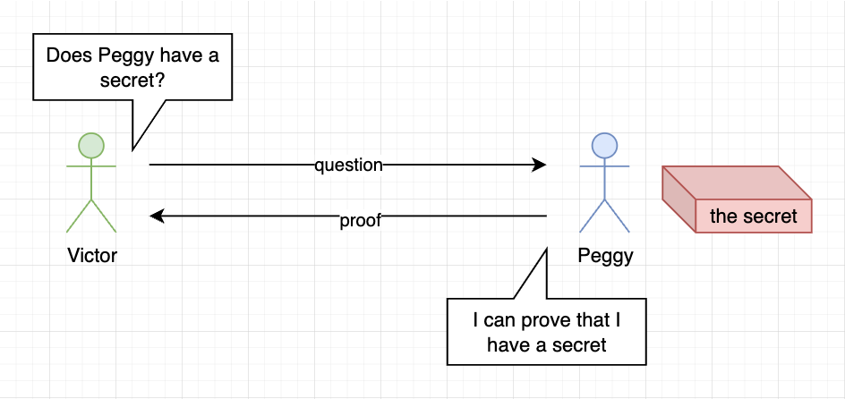
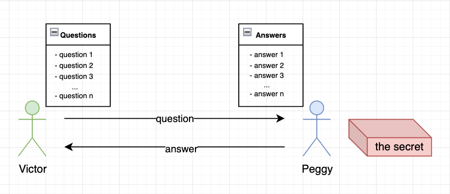
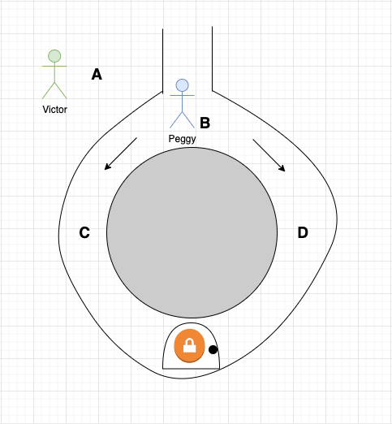
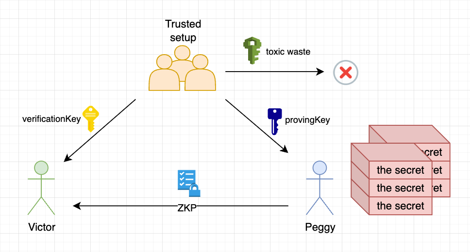

# Zero-knowledge proof

**Автор:** [Роман Ярлыков](https://github.com/rlkvrv) 🧐

Центральным элементом ZK-Rollups являются доказательства с нулевым разглашением (ZKP) — это продвинутый криптографический инструмент, который позволяет проверять данные, не раскрывая конкретных деталей содержимого.

Развитие криптографии в контексте аутентификации данных можно условно разделить на три этапа:

1. **Симметричные протоколы шифрования**: Эти протоколы обеспечивают безопасную передачу информации, где обе стороны должны знать приватный ключ для расшифровки.

2. **Ассиметричные протоколы шифрования**: Здесь одна сторона использует пару публичного и приватного ключей для создания подписи, в то время как другая сторона может проверить эту подпись, используя только публичный ключ.

3. **Доказательства с нулевым разглашением**: Это новейший этап в эволюции криптографии, который позволяет проверять подлинность данных публично, без необходимости раскрытия или использования приватных ключей.

ZKP — это криптографический протокол, позволяющий одной стороне (проверяющей, или verifier) убедиться в правдивости утверждения другой стороны (доказывающей, или prover), не получая при этом никакой конкретной информации об этом утверждении.

Для наглядности представим двух персонажей: Виктора (verifier) и Пегги (prover). Предположим, у Пегги есть секрет, который она не хочет раскрывать Виктору. Виктор же заинтересован не в самом секрете, а в подтверждении его существования. Именно здесь ZKP становится ключевым инструментом: Пегги может доказать наличие секрета, не раскрывая его сути Виктору.

Для успешного применения ZKP должны выполняться три основных свойства:

1. **Completeness (Полнота)**: Пегги (prover) может убедить Виктора (verifier) в наличии секрета с высокой, хотя и не абсолютной, вероятностью.

2. **Soundness (Достоверность)**: Пегги не сможет убедить Виктора в наличии секрета, если он у неё на самом деле отсутствует (с вероятностью ошибки стремящейся к 0).

3. **Zero-knowledgeness (Нулевое разглашение)**: В процессе доказательства Виктор не получает никакой информации о самом секрете.

Так как вероятность истинности доказательства не абсолютна, Виктору и Пегги необходимо провести несколько итераций, чтобы Виктор с высокой уверенностью убедился в наличии секрета у Пегги. Это делает ZKP интерактивным или коммуникационным протоколом.

Помимо описания взаимодействия Виктора и Пегги, существуют и другие наглядные примеры для понимания ZKP. Один из таких примеров подробно описан в [этой статье](https://blog.cryptographyengineering.com/2014/11/27/zero-knowledge-proofs-illustrated-primer/). Спойлер - там рассказывается как заключить безопасную сделку с Гугл.

Ещё один интересный пример — это "пещера Али-Бабы". Этот пример демонстрирует концепцию вероятностного доказательства. Представьте пещеру с тоннелем, идущим по кругу и имеющим один вход. В середине тоннеля находится дверь, которая не видна из начала тоннеля и открывается только с помощью волшебных слов. Пегги знает эти слова и хочет доказать это Виктору, не раскрывая сами слова. Этот пример иллюстрирует, как ZKP позволяет доказать наличие знаний или способностей, не раскрывая самой секретной информации.

Процесс доказательства с нулевым разглашением в сценарии пещеры Али-Бабы проходит следующим образом:

1. **Исходная позиция**: Виктор находится в точке А, в начале пещеры.
2. **Перемещение Пегги**: Пегги входит в пещеру и идет до двери либо по проходу C, либо по проходу D, скрывая свой выбор от Виктора.
3. **Выбор Виктора**: После того как Пегги исчезает из виду, Виктор переходит к точке B и кричит Пегги, указывая, из какого прохода он хочет, чтобы она вышла.
4. **Выход Пегги**: Пегги выходит из указанного Виктором прохода. Если необходимо, она использует волшебные слова для открытия двери.
5. **Повторение**: Эти шаги повторяются несколько раз, чтобы Виктор убедился в знаниях Пегги.

Такая последовательность действий демонстрирует, что Пегги знает волшебные слова, но не раскрывает их Виктору, а Виктор убеждается в наличии знаний у Пегги, не получая дополнительной информации.

В случае, когда Пегги не знает секрета, ее шансы обмануть Виктора при многократном повторении этапов доказательства снижаются. Если Пегги не знает волшебных слов, то она может выбраться только из того прохода, в который изначально вошла. При этом вероятность того, что Пегги случайно выберет правильный проход, равна 50% в каждом раунде. Следовательно, вероятность того, что она сможет обмануть Виктора в одном раунде, также составляет 50%.

Однако, с каждым последующим раундом эта вероятность снижается экспоненциально. Например, вероятность обмана в двух раундах составляет уже только 25% (1/4), а в n раундах - 1/2^n. Если Виктор проведет достаточное количество раундов (например, n=10-20), и каждый раз Пегги успешно выполнит задачу, он может быть уверен, что она действительно знает волшебные слова, открывающие дверь между точками C и D.

Доказательства с нулевым разглашением можно применять в различных сферах, включая:

1. **Конфиденциальность**:

    - Подтверждение владения определенной суммой в банке, не раскрывая точного размера средств.
    - Подтверждение совершеннолетия без разглашения точной даты рождения или личной информации.
    - Подтверждение уплаты налогов, не раскрывая их точный размер.

2. **Масштабирование**:

    - Хранение подтверждения наличия информации вместо полных данных.
    - Увеличение пропускной способности сети TPS (Transactions per second) в блокчейне за счет эффективности ZKP.

3. **Анонимная авторизация**:

    - Авторизация пользователей без раскрытия их идентификационных данных.

4. **Распределенные вычисления**:
    - Использование ZKP для обеспечения безопасности и конфиденциальности в распределенных системах.

Для блокчейна проблемой является интерактивность традиционных ZKP, поскольку в роли проверяющих выступает множество участников, например, валидаторы сети. Решение нашлось в преобразовании интерактивных протоколов в неинтерактивные с помощью [эвристики Фиата-Шамира](https://en.wikipedia.org/wiki/Fiat–Shamir_heuristic). Это привело к созданию более сложных алгоритмов, таких как zk-SNARKs, обладающих следующими свойствами:

-   **S**uccinctly (Сжато): Доказательство имеет небольшой, фиксированный размер, не зависимо от объема вычислений.
-   **N**on-interactively (Неинтерактивно): После вычисления доказательство может быть использовано для убеждения любого числа проверяющих без прямого взаимодействия с доказывающей стороной.
-   **Ar**gumented knowledge (Аргументированное знание): Подлинность утверждения подтверждается с высокой вероятностью, и создание поддельного доказательства невозможно. Доказывающий знает необходимые данные (witness) для подтверждения утверждения.
-   In Zero-**K**nowledge (С Нулевым Разглашением): Из доказательства невозможно извлечь дополнительные знания, оно неотличимо от случайного набора данных.

Для тех, кто интересуется математическими основами zk-SNARKs, рекомендую статью Виталика Бутерина [Quadratic Arithmetic Programs: from Zero to Hero](https://medium.com/@VitalikButerin/quadratic-arithmetic-programs-from-zero-to-hero-f6d558cea649).

Важным аспектом zk-SNARKs является введение третьей стороны, отвечающей за процесс настройки (trusted setup). В ходе этого процесса создаются два ключа: "provingKey" для доказывающей стороны и "verificationKey" для проверяющей. Эти ключи используются соответственно для создания доказательств и их проверки. Важной частью процесса настройки является генерация специального числа, известного как "toxic waste", которое должно быть уничтожено после завершения настройки, чтобы обеспечить безопасность системы.

Одно из ключевых свойств zk-SNARKs — succinctly (сжатость) — позволяет вычислять доказательства для любого объема данных за фиксированное время (приблизительно О(1)). Это свойство придает zk-SNARKs особую ценность, делая его отличным решением для масштабируемости блокчейна, обеспечивая при этом высокий уровень безопасности и скорости.

Одной из основных проблем zk-SNARKs является необходимость проведения trusted setup. Однако, разрабатываются альтернативные протоколы, такие как zk-STARKs (Succinct Transparent ARguments of Knowledge). Основное отличие zk-STARKs заключается в отсутствии необходимости trusted setup, что обеспечивает его "прозрачность".

Однако, как и во всем, существуют компромиссы. В случае zk-STARKs, это увеличенная вычислительная сложность и больший размер доказательств по сравнению с zk-SNARKs. Для наглядности, вот таблица, показывающая сравнение этих двух протоколов, взятая [отсюда](https://github.com/matter-labs/awesome-zero-knowledge-proofs#comparison-of-the-most-popular-zkp-systems):

|                                       |                                   SNARKs |                             STARKs |
| ------------------------------------: | ---------------------------------------: | ---------------------------------: |
|        Algorithmic complexity: prover |                           O(N \* log(N)) |                O(N \* poly-log(N)) |
|      Algorithmic complexity: verifier |                                    ~O(1) |                     O(poly-log(N)) |
| Communication complexity (proof size) |                                    ~O(1) |                     O(poly-log(N)) |
|              - size estimate for 1 TX |                Tx: 200 bytes, Key: 50 MB |                          Tx: 45 kB |
|         - size estimate for 10.000 TX |               Tx: 200 bytes, Key: 500 GB |                         Tx: 135 kb |
|    Ethereum/EVM verification gas cost |                          ~600k (Groth16) |         ~2.5M (estimate, no impl.) |
|               Trusted setup required? |                           YES :unamused: |                         NO :smile: |
|                   Post-quantum secure |                            NO :unamused: |                        YES :smile: |
|                    Crypto assumptions | DLP + secure bilinear pairing :unamused: | Collision resistant hashes :smile: |

Виталик Бутерин подробно осветил тему zk-STARKs в серии из трех статей: [часть 1](https://vitalik.ca/general/2017/11/09/starks_part_1.html), [часть 2](https://vitalik.ca/general/2017/11/22/starks_part_2.html) и [часть 3](https://vitalik.ca/general/2018/07/21/starks_part_3.html).

Несмотря на новизну zk-STARKs, zk-SNARKs остается проверенным временем протоколом и наиболее популярным выбором для блокчейнов, использующих ZKP. Этот протокол продолжает развиваться: изначально был Groth16, затем последовал PLONK.

Таким образом, ZKP представляет собой значительный прогресс в области криптографии, позволяя более эффективно и безопасно работать с данными. Технология многообещающая, поэтому в этой теме действительно стоит разобраться.

## Ссылки

-   [Repo: Awesome zero knowledge proofs](https://github.com/ventali/awesome-zk)
-   [Site: zkp.science](https://zkp.science/)
-   [Site: learn.0xparc.org](https://learn.0xparc.org/)
