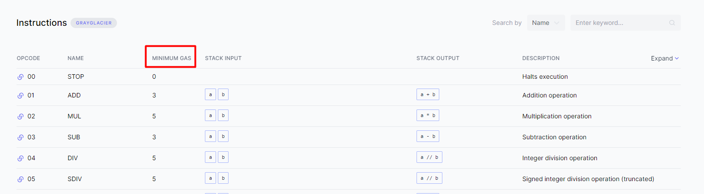
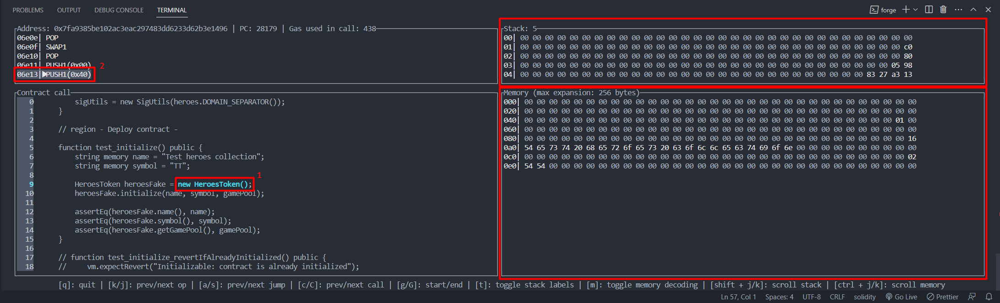

# EVM Opcodes

Прежде чем начать погружаться в изучение **opcodes** необходимо вспомнить, что такое EVM и как она устроена. Смело читай наше [intro](../intro/README.md). Это даст углубленные знания в области архитектуры виртуальных машин и их особенностей. Если ты и так знаешь достаточно об EVM, то чтение **intro** можно пропустить.

## Что такое opcodes?

> **Opcodes** - низкоуровневые машинные инструкции. Еще их называют кодами операций.

EVM не может интерпретировать код смарт-контракта, написанный на высокоуровневом языке программирования. Любой код должен быть скомпилирован в машиночитаемый код или **байт-код**, который содержит инструкции в двоичном формате.

По сути, процесс преобразования кода Solidity выглядит следующим образом:
> Solidity → Байт-код → Opcodes

**Для чего необходимо понимать opcodes?** Ответ прост - для минимизации потребления **gas** и снижения затрат конечного пользователя. Дополнительным бонусом будет умение правильно применять практики из других языков программирования. Например, яркими примерами особенности разработки под EVM являются работа с памятью и массивами данных.

_Важно!_ На момент написания этой статьи существует чуть больше [140 уникальных opcodes](https://www.evm.codes/?fork=grayGlacier). За счет этих opcodes EVM считается Тьюринг полной.

## Категории opcodes

Для простоты восприятия можно разбить все **opcodes** на следующие группы:
1. Управление стеком. ```POP, PUSH, DUP, SWAP```.
2. Арифметика. ```ADD, SUB, MUL, SMUL, DIV, SDIV, MOD, EXP, ADDMOD, MULMOD, SMOD```
3. Сравнение и побитовые сдвиги. ```GT, LT, EQ, SLT, SGT, ISZERO, AND, OR, XOR, NOT, BYTE, SHL, SHR, SAR```
4. Операции среды. ```CALLER, CALLVALUE, NUMBER, CODESIZE, CALLDATACOPY, CALLDATALOAD, CALLDATASIZE, EXTCODECOPY```
5. Управление памятью memory. ```MLOAD, MSTORE, MSTORE8, MSIZE```
6. Управление памятью storage. ```SLOAD, SSTORE```
7. Управление program counter. ```JUMP, JUMPI, PC, JUMPDEST```
8. Остановка процесса. ```STOP, RETURN, REVERT, INVALID, SELFDESTRUCT```
9. Информация о блоке. ```BLOCKHASH, TIMESTAMP, COINBASE, NUMBER, DIFFICULTY, GASLIMIT, CHAINID, SELFBALANCE, BASEFEE```

Объяснять все значения opcodes нет смысла. Чтобы узнать, что каждый из них делает, необходимо прочитать документацию [тут](https://www.evm.codes/). Каждому коду операции выделяется 1 байт памяти. Например

```0x00``` - STOP
```0x01``` - ADD


_Важно!_ 1 байт представлен 2-мя шестнадцатеричными символами.

## Gas

Я уже сказал, что **gas** помогает поддерживать безопасность сети Ethereum. Для каждого вычисления требуется плата за выполнение операции в сети. Это не позволяет злоумышленнику делать злонамеренные действия в сети. Например создавать транзакции для спама.

Таким образом у каждого **opcode** есть своя базовая стоимость **gas**. Посмотреть ее можно в столбце **MINIMUM GAS**.



 **Opcodes**, которым необходимо больше вычислительных ресурсов, требуется более высокая плата за **gas**. Например, простая инструкция ```POP``` требует 5 газа, а чуть более сложная ```JUMP``` требует 8 единиц газа.

|Код | Название | Gas|
|--- | -------- | ---|
|04 |DIV| 5 единиц газа|
|50 |POP| 2 единицы газа|
|56 |JUMP| 8 единиц газа|
|38 |CODESIZE| 2 единицы газа|

Однако существуют еще более сложные **opcode**, которые взимают динамическую стоимость **gas**. Например, операция кодирования ```SHA3``` требует 30 единиц газа плюс 6 единиц газа за каждое кодируемое слово.
|Код | Название | Static gas | Dynamic gas|
|--- | -------- | ---------- | -----------|
|04 | SHA3 | 30 единиц газа | 6 единиц за каждое слово|
|31 | BALANCE | 0 единиц газа | Если адрес доступа теплый, динамическая стоимость равна 100. Иначе стоимость равна 2600|
| 51 | MLOAD | 3 единицы газа | Рассчитывается по принципу [memory_expansion_cost](https://www.evm.codes/about#memoryexpansion) |

_Важно!_ Кроме таблицы газа для **opcodes**, каждая транзакция требует **21_000** gas. А самый дорогой opcode```CREATE```, отвечающий за создание контракта, требует **32_000** газа сверх стоимости транзакции.

При выполнение инструкций, которые уменьшают размер общего состояния блокчейн дополнительный **gas** может быть возвращен обратно в качестве **награды**. Например выполнение **opcode** ```SELFDESTRUCT``` возвращает 24_000 **gas**. Возврат происходит только после завершения исполнения контракта, поэтому контракты не могут себя окупить. Кроме того, возмещение не может превышать половину стоимости **gas**, использованного для текущего вызова контракта.

## Пример разбора байт-кода

Давай попробуем разобрать следующий пример байт-кода ```0x6002600201600202```. Согласно таблице opcodes мы можем брать первый байт(**60**) и искать его в талице [opcodes](https://www.evm.codes/?fork=grayGlacier). Это будет opcode ```PUSH1```. Таким образом вся строка байт-кода будет разобрана.


1. Первый байт равен ```60```. Согласно таблице [opcodes](https://www.evm.codes/?fork=grayGlacier) это код ```PUSH1```. Этот код помещает значение следующего байта ```02``` в **stack**.
2. Следующий байт равен ```60```. Что обозначает добавление следующего байта ```02``` в **stack**. Сейчас в **stack** находится два значения [0x02, 0x02]. Это отображено на схеме.
3. Следующий байт ```01``` обозначает код ```ADD```. Этот код берет два последних значения из **stack**, складывает и записывает результат сложения [0x04] в **stack**.
4. Следующий байт обозначает повторение шага 1 или 2. В **stack** кладется значение ```0x02```. Таким образом в **stack** [0x04, 0x02].
5. Последний байт ```02``` обозначает код ```MUL```. Он выполняет умножение двух значений из **stack** между собой. Результатом выполнения байт-кода будет значение [0x08] в **stack**.

Должно быть ты обратил внимание, что этот байт-код выполнил простейшие математические операции 4-го класса. ```(2 + 2) * 2```. Задачка на очередность выполнения операций. В результате мы получили значение равное 8. Попробуй самостоятельно предложить такой байт-код, при котором ```2 + 2 * 2 = 6```. Помочь тебе проверить себя поможет [playground](https://www.evm.codes/playground). Ответ смотри внизу этого документа.

## Примеры не интуитивных шаблонов проектирования, влияющих на количество затраченного газа

Здесь мы разберем несколько примеров, которые наглядно покажут важность темы "**Evm Opcodes**".

1. **MUL vs EXP**
  Умножение против возведения в степень. ```MUL``` стоит 5 газа. EXP стоит 10 статических единиц газа и 50 * количество_байт_в_показатели_степени. Сам ответишь на вопрос, что выгоднее? Конечно, если возможно, то выгоднее использовать умножение вместо возведения в степень.
2. **SLOAD vs MLOAD**
  ```MLOAD``` всегда стоит 3 статического газа + динамический газ за расширение памяти.```SLOAD``` стоит 2100 газа для первоначального доступа и по 100 газа за повторные. Это говорит о том, что в большинстве случаев дешевле загружать данные из **memory**, нежели чем из **storage**. Отсюда и появляются оптимизации массивов, где сначала дешевле раз скопировать массив из **storage** в **memory**, а потом уже с ним работать.
1. **Приемы объектно-ориентированного подхода**
  Выделение новых сущностей в виде контрактов, любых аккаунтов будет интерпретировано в **opcode** ```CREATE```. Его стоимость не менее 32_000 газа. Это самый дорогой код операцию EVM. Таким образом, лучше свести к минимуму количество используемых смарт-контрактов. Это отличается от типичного объектно-ориентированного программирования, в котором разделение кода на классы поощряется для повторного использования кода.
1. **SSTORE**
  Здесь все просто. Запись в **storage** - это одна из самых дорогих операций. Поэтому в реализации нфт, метаданные не хранятся в **storage** контракта. **Storage** хранит всего лишь ссылку на эти метаданные.

Подробнее с этими примерами можно ознакомиться в этой [статье](https://medium.com/@danielyamagata/understand-evm-opcodes-write-better-smart-contracts-e64f017b619).

## Обратный инженеринг

Зачастую контракты верифицированы и код контракта можно посмотреть на [etherscan](https://etherscan.io/). Однако, если контракт не верифицирован, то можно попробовать разобрать байт-код контракта.

Прекрасную [статью](https://ethereum.org/en/developers/tutorials/reverse-engineering-a-contract/) на эту тему предлагает Ори Померанц в официальной документации Ethereum. Хочу предупредить, что разбор не верифицированных контрактов - это нетривиальная задача. Поэтому смотри сам, на сколько тебе сейчас нужно погрузиться в эту тему.

## Практика

Теория - это хорошо. Однако закрепление теории практикой всегда гораздо продуктивнее. Franco Victorio - один из разработчиков hardhat, создал [коллекцию головоломок](https://github.com/fvictorio/evm-puzzles). Эта коллекция головоломок предлагает посмотреть на набор **opcodes** и ввести такое значение, которое позволит инструкциям успешно выполниться. Постарайся решить эти головоломки самостоятельно, прежде чем искать ответы. У меня получилось решить 7 головоломок.

Для удобство решать головоломки можно в [playground](https://www.evm.codes/playground).

## Хорошие новости

В Foundry есть встроенный [debugger](https://book.getfoundry.sh/forge/debugger?highlight=opcode#debugger-layout), который умеет поддерживать отображение **opcodes**.



Под цифрой 1 выделена область исполняемого кода тестовой функции.
Под цифрой 2 выделена область соответствующего исполнения инструкции.
В правой части рамками без номеров выделены две области отвечающие за отображение **stack** и **memory**.

## Ответ на задачку 2 + 2 * 2

```6002600202600201```

[01] -> 6002 -> ```PUSH1 02```
[02] -> 6002 -> ```PUSH1 02```
[04] -> 02 -> ```MUL```
[05] -> 6002 -> ```PUSH1 02```
[07] -> 01 -> ```ADD```

## Links
1. [An Ethereum Virtual Machine Opcodes Interactive Reference](https://www.evm.codes/)
3. [The Ethereum Virtual Machine — How does it work?](https://medium.com/mycrypto/the-ethereum-virtual-machine-how-does-it-work-9abac2b7c9e)
4. [Demystifying EVM Opcodes](https://www.youtube.com/watch?v=_tcyI_lNvo0&ab_channel=ETHGlobal)