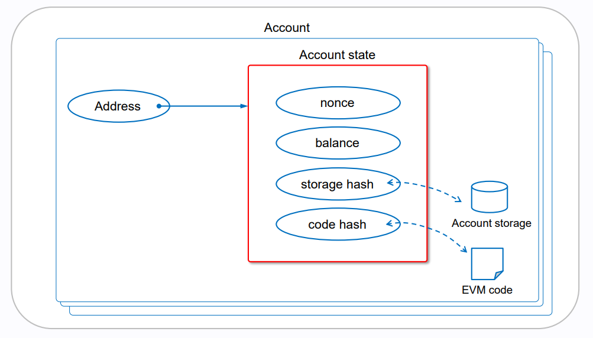
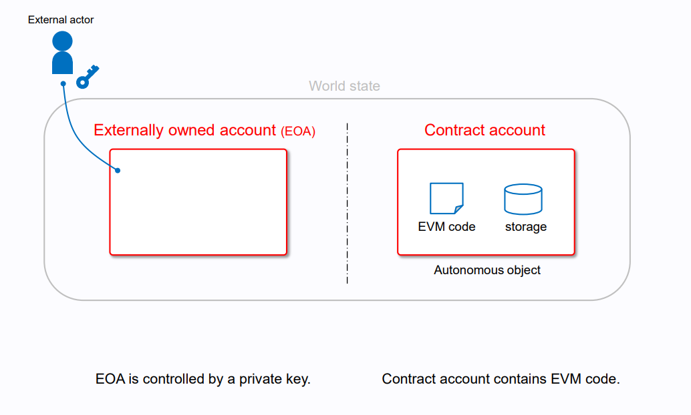
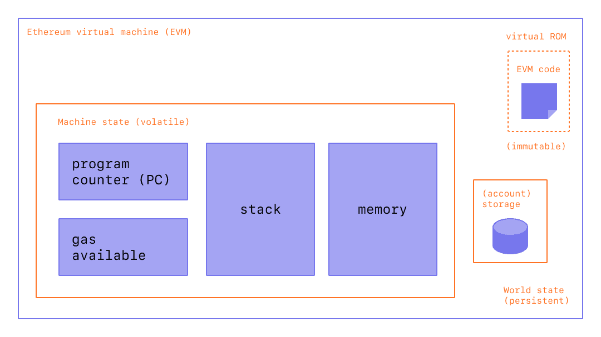
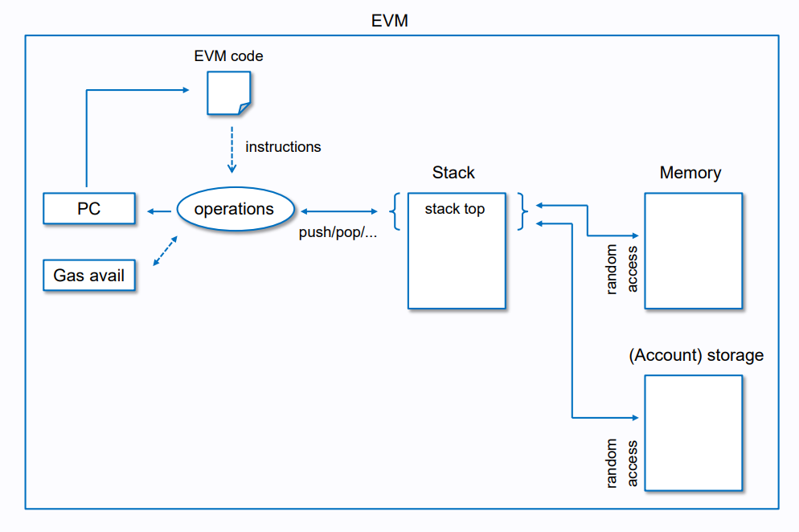

# Intro

**Автор:** [Павел Найданов](https://github.com/PavelNaydanov) 🕵️‍♂️

Если ты совсем новичок в блокчейн разработке, я предлагаю разобраться с самого начала и прочитать статью Прити Касиредди "[How does Ethereum work?](https://www.preethikasireddy.com/post/how-does-ethereum-work-anyway#:~:text=The%20Ethereum%20blockchain%20is%20essentially,transition%20to%20a%20new%20state.)". Однако и разработчику со стажем это может быть полезным. Я уверен он сможет найти интересные вещи для себя в этой статье.🙃

## Ethereum

Ethereum - это сеть, где каждый участник сети хранит копию состояния единственного канонического компьютера(называемого виртуальной машиной Ethereum или EVM). Любой участник сети может транслировать запрос этому компьютеру на выполнение произвольных вычислений.

Запросы на вычисление называются **транзакциями**. Запись всех транзакций и текущего состояния EVM сохраняется в блокчейне, который, в свою очередь согласовывается всеми участниками сети.

Подробнее про ethereum можно прочитать [тут](https://ethereum.org/ru/developers/docs/intro-to-ethereum/#what-is-ethereum).

Подробнее про анатомию транзакций можно прочитать [тут](https://medium.com/remix-ide/the-anatomy-of-a-transaction-receipt-d935aacc9fcd).

## Account based model

Мы знаем, что Ethereum в отличие от Bitcoin поддерживает [стратегию аккаунтов](https://jcliff.medium.com/intro-to-blockchain-utxo-vs-account-based-89b9a01cd4f5).

Аккаунты нужны для хранения балансов пользователей. Аккаунты и балансы аккаунтов хранятся в большой таблице в EVM. Они являются частью общего состояния EVM.

Сущность **аккаунт** содержит следующие поля:
1. **Баланс**. Количество эфира в Wei.
2. **Nonce**. Счетчик транзакций этого аккаунта.
3. **Storage root**. Также известен как хэш хранилища.
4. **Code hash**. Этот хэш ссылается на **code** аккаунта на виртуальной машине. По сути, это 256-битный хэш корня «[дерева Меркла Патрисии](https://en.wikipedia.org/wiki/Merkle_tree)», кодирующего содержимое хранилища аккаунт.



В природе EVM аккаунты делятся на два типа:
1. Внешний EOA(Externally Owned Account)
2. Смарт-контракт

Оба этих типа аккаунтов могут не только получать, хранить и отправлять эфиры, но и взаимодействовать с другими смарт-контрактами.

**Ключевое отличие** аккаунтов типа "EOA" и "смарт-контракт" заключается в следующем:
1. Адрес EOA создается на основе приватного ключа пользователя. Адрес контракта создается на основе адреса деплоера, байт-кода и nonce.
2. Поля **code hash** и **storage root** заполняются только для аккаунта типа "смарт-контракт". Для EOA аккаунтов эти поля пустые.



Подробнее про аккаунты можно почитать [тут](https://ethereum.org/ru/developers/docs/accounts/).

## EVM

Ethereum Virtual Machine — это глобальный виртуальный компьютер, состояние которого хранит (и с которым согласовывается) каждый участник сети Ethereum. Любой участник может запросить выполнение произвольного кода в EVM.

С точки зрения **opcodes**, EVM - это полная по Тьюрингу [стековая машина](https://en.wikipedia.org/wiki/Stack_machine), отвечающая за выполнение кода смарт-контрактов.

**Смарт-контракт** — это набор инструкций. Каждая инструкция представляет собой код операций(со своей удобной мнемоникой, своего рода текстовым представлением присвоенных им значений от 0 до 255). Когда EVM выполняет смарт-контракт, она последовательно считывает и выполняет каждую инструкцию.

## Упрощенная архитектура EVM

Упрощенно можно представить внутреннее устройство EVM схемой ниже. Забегая вперед скажем, что объекты на схеме **EVM code** и **Storage** это не что иное, как то на что ссылаются **code hash** и **storage** аккаунта. Я говорил про них в разделе выше, где рассказывал про аккаунты.


*// Простая stack-based архитектура EVM*

На схеме выше мы видим две крупных области:
  - **Machine state**(volatile). Эта область содержит непостоянные объекты, которые будут созданы в рамках контекста вызова. Под контекстом вызова можно понимать исполнение любого набора инструкций, полученных из байт-кода смарт-контракта.
  - **World state**(persistent). Эта область содержит объекты, которые не зависят от контекста вызова.

**Machine state** включает:
  - **PC(Program counter)**. Решает, какую инструкцию из области **code** EVM должна прочитать следующей. **PC** обычно увеличивается на один байт, чтобы указать на следующую инструкцию. За исключением всего нескольких команд. Я имею ввиду команды ```JUMP```, ```JUMPI```.
  - **Stack**. Список инструкций смарт-контракта. Максимально может включать **1024** инструкции. Размер инструкции равен 32-м байтам. Для каждого вызова в рамках контекста вызова создается один **Stack**. Он уничтожается, когда контекст вызова завершается.
  - **Memory**. Также как и **Stack** создается в начале вызова в рамках контекста и очищается по окончанию.

**World state** включает:
  - **Code**. Это область где хранятся инструкции. Код - это байты данных, прочитанные, интерпретированные и выполненные EVM во время исполнения смарт-контракта. Код в этой области неизменяем. Это показано аббревиатурой ROM(Read-only memory)
  - **Storage**. Хранилище отвечает за хранение состояния блокчейна. По сути, это мапа(сопоставление) 32-байтовых слотов с 32-байтовыми значениями. Хранилище постоянно для смарт-контракта. Любое значение записанное кодом смарт-контракта сохраняется после окончания вызова. Каждый контракт имеет собственное хранилище и не может читать или изменять хранилище из другого контракта

Для более простого понимания можно провести следующие аналогии. **Stack** имеет ограничение на хранение 1024-х инструкций. Используется **stack** больше для передачи значений функциям ```function(arg,arg2)``` и выполнение функций. Из-за ограничений **stack** сложные комбинации **opcodes** используют память контракта(**memory**) для извлечения или передачи данных. Однако память непостоянна(когда выполнение вызова функции закончится, память очистится) и подходит для хранения объявленных переменных. Чтобы хранить данные неограниченное время и сделать их доступными для выполнения в следующих вызовах нужно использовать **storage**. По сути это общедоступная база данных. Можно даже считывать значения извне без необходимости отправлять транзакции. Однако запись в хранилище - это одна из самых дорогостоящих операций.

Итог:
- **Stack**. Хранение аргументов функции. Плюс операции выполнения.
- **Memory**. Краткосрочное хранение объявленных переменных в рамках контекста одного вызова функции.
- **Storage**. Долгосрочное хранение данных в рамках жизни блокчейна. Данные доступны в рамках любых контекстов вызова функции и для считывания извне.

Можно на все это посмотреть со стороны официальной реализации [Ethereum протокола на go](https://github.com/ethereum/go-ethereum):
1. [Opcodes](https://github.com/ethereum/go-ethereum/blob/master/core/vm/instructions.go)
2. [Stack](https://github.com/ethereum/go-ethereum/blob/master/core/vm/stack.go)
3. [Memory](https://github.com/ethereum/go-ethereum/blob/master/core/vm/memory.go)

## Выполнение инструкций

Помним, что EVM - стековая машина. Стек здесь играет ключевую роль. На схеме ниже показано выполнение некоторого набора инструкций.



Этот алгоритм можно описать следующим образом:
1. В рамках контекста вызова создаются следующие объекты **machine state**: **memory**, **stack**, **program counter**.
2. **Program counter** получает команду на инициализацию исполнения инструкций.
3. Из **EVM code** берутся инструкции и разбиваются на операции(**opcodes**).
4. Каждая операция попадает в **stack**.
5. Операции попавшие в **stack** начинают выполняться.
6. Выполнение каждой операции может задействовать **storage** или **memory**.

_Важно!_ В этой схеме мы опускаем проверку **gas**. Каждый opcode стоит несколько единиц **gas**. Gas помогает поддерживать безопасность сети Ethereum. Расчет **gas** выходит за рамки этой схемы.

## Ключевые вещи

> Solidity код преобразуется → Байт-код → Opcodes

> Аккаунты бывают двух типов: EOA и смарт-контракты. Только смарт-контракты имеют код.

> Понимание, как работает EVM. Под каждый контекст вызова создается **Memory** и **Stack**. При этом **EVM code** неизменяем. **Storage** постоянен, но может быть изменен.

## Links

1. [Ethereum virtual machine](https://ethereum.org/en/developers/docs/evm/)
2. [About the EVM](https://www.evm.codes/about)
3. [Интересный сборник иллюстраций](https://takenobu-hs.github.io/downloads/ethereum_evm_illustrated.pdf)