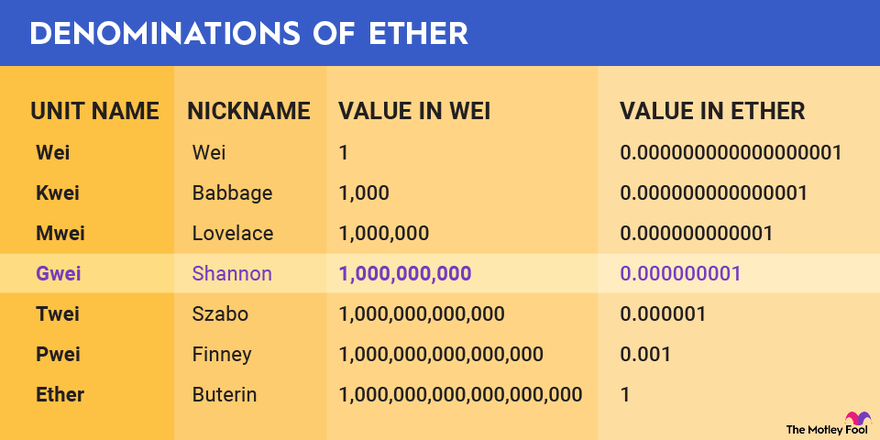
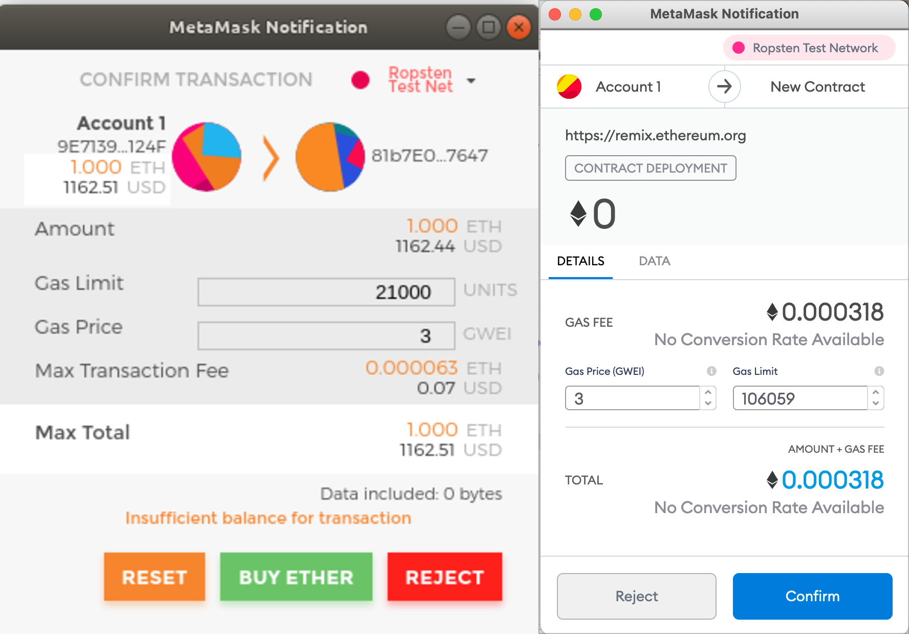
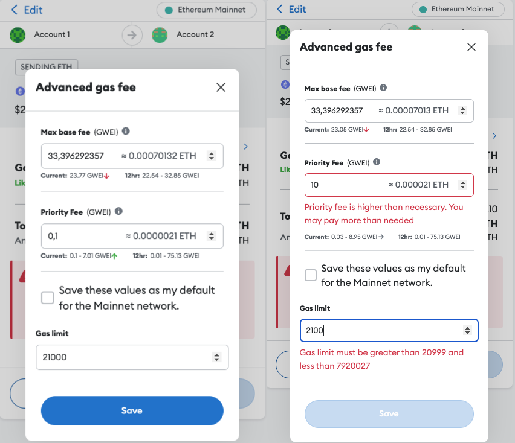
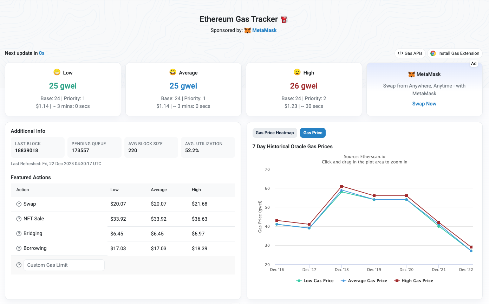
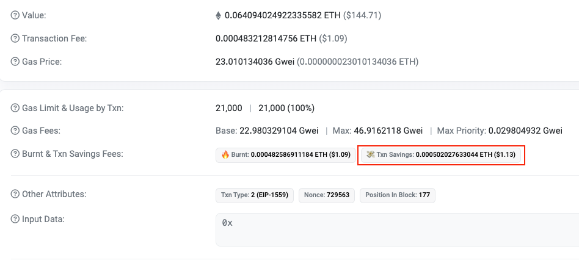

# Gas Price

**Автор:** [Роман Ярлыков](https://github.com/rlkvrv) 🧐

Эта статья исследует механизмы расчета и составляющие цены газа в блокчейне Ethereum, описывает историческое развитие этих методов и их значимость, а также демонстрирует, как вычислить стоимость транзакции на основе ее газовых затрат.

## Базовая концепция

Газ (gas) — это единица измерения количества вычислительных ресурсов, необходимых для выполнения определенных операций в блокчейне.

> Вычислительные ресурсы - это технические средства ЭВМ, в том числе процессор, объемы оперативной и внешней памяти, время, в течение которого программа занимает эти средства в ходе выполнения.

Если приводить аналогию из реального мира, то газ будет выступать в роли бензина для автомобиля (на что и намекает его название - "gas" от слова "gasoline").

В привычном нам мире, мы не привыкли оплачивать вычислительные ресурсы, как отдельную услугу. Например, в случае онлайн-банкинга, банк берет на себя расходы за вычисления, производимые на его серверах. Это пример централизованной системы. В децентрализованных системах, пользователи оплачивают операции, потребляющие вычислительные ресурсы, поскольку эти операции напрямую служат их интересам.

Газ служит не только в качестве меры вычислительных усилий в блокчейне, но и является ключевым инструментом защиты от спама и [DoS](https://en.wikipedia.org/wiki/Denial-of-service_attack)-атак. Поскольку каждая операция в сети требует оплаты газа, злоумышленникам становится экономически нецелесообразно проводить массовые и повторяющиеся транзакции с целью перегрузки сети. Лимиты блока на газ дополнительно ограничивают масштаб таких попыток, делая атаку непомерно дорогой и технически сложной. Это также стимулирует разработчиков писать более эффективный, чистый и оптимизированный код, поскольку более экономное использование газа напрямую влияет на снижение операционных расходов.

Наконец газ играет ключевую роль в регулировании спроса и предложения в блокчейне Ethereum. Цена газа измеряется в Gwei за единицу (пример - 50 Gwei), и при высоком спросе может существенно возрастать.

> Gwei - это деноминация криптовалюты эфир (ETH), используемая в сети Ethereum для покупки и продажи товаров и услуг.



В Ethereum 1.0 этом могло приводить к сумасшедшим ценам на транзакции (как вам например идея заплатить 100-300$ за покупку USDT на Uniswap?).

## Расчет комиссий за газ в Ethereum 1.0

В Ethereum 1.0 каждая транзакция включала два ключевых элемента, связанных с газом:

-   `gasPrice` - цена в ETH, указанная в Gwei за единицу газа
-   `gasLimit` - максимальное количество газа, которое пользователь готов заплатить в этой транзакции

Майнеры получали фиксированную награду за блок и всю комиссию за использованный газ.

Комиссия для каждой транзакции рассчитывалась так:

```bash
    totalFee = gasPrice * gasUsed
```

где `gasUsed` обозначает реально использованное количество газа. Объяснение из чего складывается `gasUsed` выходит за рамки данной статьи, но важно упомянуть, что любой неиспользованный газ (`gasLimit` - `gasUsed`) возвращался инициатору транзакции, поэтому `gasUsed` всегда был меньше или равен `gasLimit`.

```bash
    gasUsed <= gasLimit
```

В этой модели пользователь сам устанавливал `gasPrice`.

Выглядело это так:



_Заметка:_ Пользователь мог выставить `gasPrice` равным нулю и такая транзакция технически могла быть включена в блок, майнер в таком случае получал бы только фиксированную награду за блок.

Фактически, `gasPrice` в Ethereum 1.0 был ключевым фактором, определяющим скорость включения транзакции в блок. Майнеры отбирали транзакции на основе системы "**аукциона первой цены**", где приоритет отдавался тем, кто предлагал более высокую плату за газ. Это создавало риск задержек или даже невозможности включения транзакции в блок, особенно при низком предложенном `gasPrice`.

У такого подхода был ряд недостатков:

-   **Высокая волатильность комиссий**: Цены на газ часто колебались, что не отражало реальную стоимость обработки транзакций в сети.

-   **Задержки в обработке транзакций**: Из-за ограниченного лимита газа на блок, транзакции могли долго ожидать включения в блокчейн.

-   **Неэффективность аукционов первой цены**: Система, при которой пользователи указывали максимальную стоимость газа, а майнеры выбирали самые выгодные предложения, была сложной и неэффективной.

-   **Переплата за газ**: Сложные механизмы оценки комиссий часто приводили к ненужной переплате за газ.

Эти проблемы были подняты в [EIP-1559](https://eips.ethereum.org/EIPS/eip-1559), как основание для перехода на новую модель расчета комиссий за газ, что и было реализовано в хардфорке [London](https://ethereum.org/en/history#london).

## Расчет комиссий за газ в Ethereum 2.0

EIP-1559 ввел ключевое нововведение — **base fee** (базовую стоимость), которая является обязательной платой за каждую транзакцию.

Это значительно изменило модель расчета комиссий:

1. `base fee` определяется протоколом и алгоритмически корректируется в зависимости от загрузки сети.
2. Размер блока стал динамическим. Он напрямую влияет на величину `base fee` и помогает регулировать спрос автоматически. Подробнее об этом можно узнать [здесь](https://ethereum.org/en/developers/docs/gas/#base-fee).
3. `base fee` сжигается, а не достается майнерам/валидаторам, что потенциально делает эфир дефляционной монетой.

> Дефляционная криптовалюта - это криптовалюта с уменьшающимся общим количеством монет, что увеличивает её ценность со временем.

Для майнеров был добавлен новый параметр — **priority fee** или чаевые (tips), которые мотивируют быстрее включать транзакции в блок. Этот параметр, выраженный в Gwei, представляет собой дополнительное вознаграждение для майнера за добавление отдельной транзакции в блок. Прибавляется к базовому вознаграждению за весь блок.

Теперь, с введением **priority fee**, аукцион по-прежнему существует, но с ключевым отличием: для майнеров уже не так важно, сколько газа потребляет транзакция. Различие в газовых затратах между простой передачей эфира и развертыванием смарт-контракта стало менее значимым. Чаевые также обеспечивают стимул для майнеров включать транзакции в блоки, а не оставлять их пустыми. Более того, новая модель сделала расчет цен на газ более предсказуемым и менее подверженным волатильности.

Еще одним нововведением является параметр **`maxFeePerGas`** — максимальная сумма, которую пользователь готов заплатить за обработку своей транзакции (похоже на "проскальзывание цены" которое устанавливается при обменах на DEX, чтобы обезопаситься от колебания цен на актив). Этот параметр объединяет `base fee` и `priority fee`, обеспечивая защиту пользователя от колебаний `base fee`.

> Проскальзывание цены (англ. «price slippage») — это исполнение рыночного ордера по цене, которая отличается от цены указанной в заявке (order) на бирже. Это явление характерно для любых активов, в том числе криптовалют.

### Новые параметры газа в транзакции

В результате, структура параметров газа в транзакции претерпела следующие изменения:

1. **`maxPriorityFeePerGas`** (чаевые в Gwei за единицу газа) — комиссия за приоритет, которая направляется валидатору, стимулируя быстрое включение транзакции в блок.
2. **`maxFeePerGas`** — максимальная сумма в Gwei за единицу газа, выделенная на оплату газа, включая `base fee` и `maxPriorityFeePerGas`. Защищает в первую очередь от колебаний `base fee`.
3. **`gasLimit`** — максимальное количество газа (в ед. газа), которое пользователь готов оплатить за выполнение этой транзакции.

Таким образом, поле `gasPrice` было убрано из транзакции, вместо него добавлены два новых параметра, связанных с газом. Фактически, они разделяют `gasPrice` на две части - обязательная плата протоколу и чаевые майнерам.

Параметр `maxFeePerGas` может немного путать, поэтому в Metamask вы его не увидите, кошелек предлагает выставить "Max base fee", а `maxFeePerGas` кошелек рассчитает сам под капотом, прибавив чаевые для майнера (Priority fee в Metamask).

В Metamask можно выбрать с какой скоростью транзакция будет выполнена. Кошелек сам рассчитывает и предлагает приблизительные параметры.


Разберем на примере скриншота справа. Рассчитаем предоплату, которую нужно внести для выполнения транзакции. Чтобы оплатить транзакцию "по рынку" (Market), кошелек предлагается нам следующие значения:

-   **Max base fee**: 34.5899 Gwei (При этом реальный `base fee` система оценивает в 26 Gwei)
-   **Priority fee**: 0.1 Gwei (То есть это рекомендованный размер чаевых на данный момент)
-   **Gas limit**: 21000 (Это базовое количество газа, которого достаточно для перевода ETH между двумя аккаунтами EOA)

Посчитаем сколько средств нам нужно внести в качестве предоплаты:

```bash
    prepay = maxFeePerGas * gasLimit
    prepay = (34.5899 + 0.1) * 21000 = 728487.9 Gwei
```

Можем разделить это число на 1 млрд. (чтобы перевести в ETH) и умножить на цену эфира в долларах, чтобы получить значение комиссии в долларах. Например если взять цену эфира за 2500$, тогда:

```bash
    728487.9 Gwei / 1_000_000_000 = 0.0007284879 ETH
    0.0007284879 ETH * 2500$ = 1.82$
```

Но т.к. реальный размер `base fee` 26 Gwei (предположим он будет таким же в момент выполнения транзакции) и `gasUsed` в данном случе будет ровно 21000, то результирующая цена транзакции будет считаться так:

```bash
    totalFee = (base fee + maxPriorityFeePerGas) * gasUsed

    totalFee = (26 + 0.1) * 21000 = 548100 Gwei

    548100 Gwei / 1_000_000_000 * 2500$ = 1,37$
```

То есть подписывая транзакцию вы одобрите `1.82$`, но фактически транзакция будет стоить `1.37$`, поэтому `0.45$` будет возвращено на ваш счет.

### Metamask advanced

Можно настроить все параметры самостоятельно в режиме "Advanced".



Данный режим позволяет выставить три параметра, которые мы уже рассмотрели выше: "Max base fee", "Priority fee" и "Gas limit".

_Важно!_ Повторюсь, это упрощение. `maxFeePerGas` будет складываться из "Max base fee" + "Priority fee". Поэтому, косвенно, можно установить и параметр транзакции `maxFeePerGas`.

Как видно на скриншоте, кошелек заботливо подскажет, что вы указываете параметры не совсем разумно. Это может привести к сбою транзакции или сильной переплате комиссии. Поэтому данный режим и называется "Advanced". Режим создан только для продвинутых юзеров.

Актуальные цены на газ можно посмотреть на [etherscan.io](https://etherscan.io/gastracker#chart_gasprice) для Ethereum и в подобных сервисах для других сетей.



Примерные значения тут рассчитываются похожим образом. Обратите внимание, что значение в Gwei уже включает base fee и priority fee. То есть, чтобы узнать, какую комиссию вы заплатите в ETH, достаточно перемножить количество потребляемого транзакцией газа с этой величиной. Чтобы зафиксировать, покажу этот расчет еще раз, но уже на примере данных с etherscan.

Например, для перевода ETH это будет выглядеть так:

```bash
    totalFee = 25 Gwei * 21000 gas = 525000 Gwei
```

Если хотим получить значение в ETH, достаточно разделить на 1 миллиард.

```bash
    525000 Gwei / 1_000_000_000 = 0.000525 ETH
```

Собственно, для получения цены в долларах, остается только умножить на текущий курс ETH. На момент написания он равен 2253$.

```bash
    0.000525 ETH * 2253$ ≈ $1.18$
```

Полная формула будет такая:

```bash
    totalFeeInUsd = gasPrice * gasUsed / 1_000_000_000 * ethPriceInUsd
```

### Типы транзакций в Ethereum

В Ethereum на данный момент существует 3 типа транзакций:

1. **Тип 0**. Транзакции старого формата (Legacy). Имеют поле `gasPrice`.
2. **Тип 1**. Транзакции включающие "список доступа". Подробнее [тут](https://eips.ethereum.org/EIPS/eip-2930).
3. **Тип 2**. Транзакции нового формата (EIP-1559). Используют `maxPriorityFeePerGas` и `maxFeePerGas` вместо `gasPrice`.

Для нас, в данном контексте, интерес представляют типы 0 и 2. Чтобы сохранить обратную совместимости EIP-1559 не отменяет транзакции старого формата (Legacy транзакции типа 0, где указывались только `gasPrice` и `gasLimit`).

Когда Legacy транзакция попадает в мемпул, весь указанный в ней `gasPrice` используется, но из него вычитается и сжигается **base fee**, а оставшаяся сумма становится **priority fee**. Хотя для выполнения транзакции технически достаточно только **base fee**, без достаточного **priority fee** транзакция вряд ли будет включена в блок, особенно если есть более выгодные предложения. В случае с Legacy-транзакциями крайне важно точно рассчитать комиссию, чтобы избежать недостатка средств на покрытие **base fee**.

_Важно!_ **base fee** сжигается протоколом независимо от типа транзакции.

В случае с транзакциями типа 2 (EIP-1559), пользователи могут не беспокоиться о размере **base fee** (сеть сама предложит подходящее значение, достаточно указать его максимально значение) и при этом ставить очень низкие **priority fee.** В периоды низкого спроса такой подход может сработать, так как майнеры могут включать в блок даже транзакции с очень низкими чаевыми или без них вовсе, чтобы заполнить блок.

Рассмотрим на примерах.

### Legacy транзакция (тип 0)


Это скриншот обычного трансфера ETH. В поле "Other Attributes" можно увидеть что тип транзакции - Legacy (тип 0). В данной транзакции пользователь "взял с запасом":

-   gasPrice выставлен в 25 Gwei
-   gasLimit 60,000 (при том, что на трансфер ETH всегда тратится 21000)

Base fee равен 22.980329104 Gwei, для удобства округлим до 23 Gwei. Таким образом 23 Gwei были сожжены, а все что осталось 25 - 23 = 2 Gwei за единицу газа составляет чаевые валидатору.

### Legacy транзакция с минимальным priority fee (тип 0)


В этой транзакции пользователь выставил `gasPrice` всего 23 Gwei, что рисково, потому что было сожжено 22.98 Gwei, а майнер получил только 0.02 Gwei за единицу газа.

_Забавный факт:_ Обе эти транзакции были выполнены в одном блоке, рядом друг с другом.

### Транзакция EIP-1559 (тип 2)

Перейдем к транзакциям EIP-1559. С ними все гораздо интереснее.



Если пройтись по параметрам связанным с газом в транзакции, то:

-   `Max priority fee` инициатор транзакции выставил 0.029804932 Gwei
-   `Max base fee` равен 46.9162118 Gwei
-   `gasLimit` составляет стандартные 21000 Gwei

То есть здесь `base fee` с двухкратным запасом, но при этом `maxPriorityFeePerGas` довольно скромные и равны 0.03 Gwei за единицу газа.

Обратите внимание, что в поле "Burnt & Txn Savings Fees" этого типа транзакции есть еще и "Txn Savings", это как раз те средства которые были возвращены пользователю потому, что не были использованы в транзакции.

### Транзакция EIP-1559 без priority fee (тип 2)


Последний пример на сегодня. Ничего не смущает? Да, **priority fee** равно 0. Более того, `base fee` выставлен идеально точно, поэтому возврат средств тоже делать не пришлось.

_Забавный факт №2:_ Третья транзакция взята из того же блока, что и две предыдущих.

Важно отметить, что `base fee` сжигается во всех типах транзакций, не зависимо от их формата. Для наблюдения за процессом сжигания ETH в реальном времени можно воспользоваться ресурсом [beaconcha.in/burn](https://beaconcha.in/burn).

## Заключение

Хотя расчет цен на газ сейчас во многом автоматизирован, пользователи все же несут ответственность за свои транзакции, т.к. это принцип децентрализации. Возможность отказаться от транзакции при высоких ценах на газ или увеличить комиссию для ее ускорения остается за пользователем. Но нужно быть осторожным, есть случаи, когда за транзакции по ошибки платили [немыслимо большие](https://decrypt.co/207263/bitcoin-sender-overpays-record-breaking-3-million-transaction-fee) комиссии.
