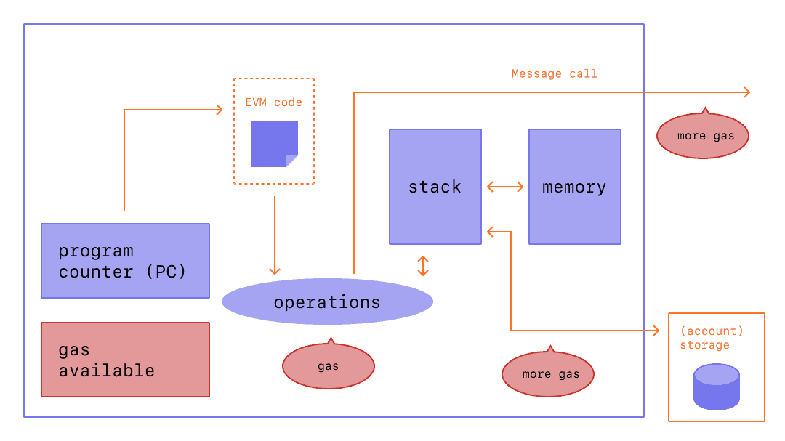
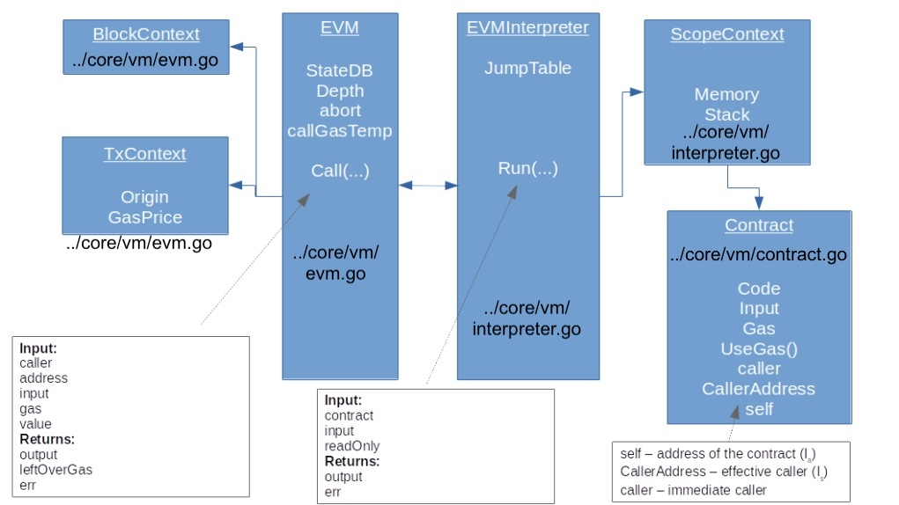
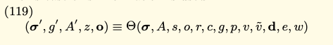

# Gas used part 1: Overview

**Автор:** [Роман Ярлыков](https://github.com/rlkvrv) 🧐

## TL;DR

В первой части нашей статьи о механизмах использования газа в Ethereum, мы сосредоточимся на общих принципах расчета газа на уровне транзакции. Это даст основу для понимания, как газ используется и рассчитывается в блокчейне Ethereum. Во второй части мы углубимся в аспекты работы с хранилищем смарт-контрактов, рассматривая их в контексте расчетов газа.

## Введение

Исполнение транзакции в Ethereum зависит от доступного газа: при её инициализации задаётся `gasLimit`, определяющий максимальное количество газа, которое может быть использовано. На основе `gasLimit` рассчитывается предоплата в ETH, списываемая с аккаунта пользователя до начала транзакции. Фактически, потраченный газ отображается в `gasUsed`. Если потребление газа превышает `gasLimit`, происходит следующее:

-   Возникает ошибка "out of gas".
-   Состояние смарт-контракта откатывается к моменту до выполнения транзакции.
-   Предоплата на вычисления в ETH не возвращается, потому что уже была полностью использована для покрытия расходов на газ.

В данной статье мы детально проанализируем составляющие `gasUsed`, на основе которых рассчитывается, сколько ETH необходимо вернуть, в случае если `gasLimit` был больше, чем фактически истраченный газ. Также, с учетом `gasUsed` протокол высчитывает оставшееся количество газа в блоке для обработки последующих транзакций.

## Роль газа в блокчейне

Для понимания механизма газа, важно осознать, почему он был введен. EVM (Ethereum Virtual Machine) обладает Тьюринг-полнотой, что позволяет ей выполнять любые вычисления, в том числе бесконечные циклы. Эти вычисления включают в себя выполнение транзакций, меняющих состояние блокчейна. Для вознаграждения участников сети, занятых в проверке транзакций, была введена комиссия за их исполнение. Комиссия также играет роль регуляторного механизма, предотвращающего злоупотребления при работе с блокчейном.

Размер комиссии всегда задается отправителем транзакции, ничего не мешает ему сделать комиссию равной нулю, вопрос в том, примут ли другие участники сети такую транзакцию.

## Газ в Ethereum

Bitcoin обрабатывает транзакции, изменяя балансы пользователей при передаче BTC. В Ethereum, помимо изменения балансов ETH, выполняются вычисления на смарт-контрактах, которые могут требовать значительных ресурсов. Таким образом, перед обработкой транзакции важно оценить её потребление газа.

Рассмотрим каноническую схему, иллюстрирующую расход газа в Ethereum.


Из представленной схемы видно, что каждая вычислительная операция и взаимодействие с памятью в сети Ethereum требует определенное количество газа.

Чтобы хорошо разобраться в этом вопросе нам понадобится [Ethereum Yellow Paper](https://ethereum.github.io/yellowpaper/paper.pdf), разделы 6,8 и 9, а также исходный код основного клиента Ethereum [Go-Ethereum](https://github.com/ethereum/go-ethereum) (geth), находящийся в директории [go-ethereum/core/vm/](https://github.com/ethereum/go-ethereum/tree/576681f29b895dd39e559b7ba17fcd89b42e4833/core/vm).

Для начала, настоятельно рекомендую ознакомиться с [первой частью](https://leftasexercise.com/2021/09/12/understanding-the-ethereum-virtual-machine-part-i/) серии статей об устройстве EVM, где подробно разъясняется процесс подготовки транзакции к выполнению в EVM и какие блоки кода при этом задействованы.

Важно! _В статье рассматривается версия клиента 1.10.6, на данный момент код немного изменился, но основная структура и методы сохранились_.

Для понимания работы Ethereum, следует рассмотреть ключевые блоки кода в репозитории geth, как показано на данном изображении:



-   В файле [evm.go](https://github.com/ethereum/go-ethereum/blob/1010a79c7cbcdb4741e9f30e8cdc19c679ad7377/core/vm/evm.go) расположены основные сущности EVM, такие как BlockContext и TxContext.
-   EVMInterpreter и ScopeContext находятся в файле [interpreter.go](https://github.com/ethereum/go-ethereum/blob/1010a79c7cbcdb4741e9f30e8cdc19c679ad7377/core/vm/interpreter.go)
-   Класс `Contract` размещен в [contract.go](https://github.com/ethereum/go-ethereum/blob/1010a79c7cbcdb4741e9f30e8cdc19c679ad7377/core/vm/contract.go)

Далее рассмотрим более детально две основные функции EVM: `Call()` и `Run()`, попутно разбираясь, как задействуется код, связанный с этими функциями.

### Функция Call

Главной функцией, описывающей выполнение транзакции в yellow paper, является функция тета (Θ), ее можно найти в разделе 8:

, где

-   **Системное состояние (σ')**: Это текущее состояние всей блокчейн-системы Ethereum, включая все учетные записи и их состояния;
-   **Оставшийся газ (g')**: Количество газа, оставшееся после выполнения;
-   **Накопленное подсостояние (A')**: Это совокупность временных изменений в состоянии блокчейна, происходящих в результате выполнения транзакций. Она включает в себя такие вещи, как создание новых учетных записей, изменения балансов и т.д.;
-   **Возвращаемое значение функции смарт-контракта (z)**: Возвращаемое значение используется вызывающим смарт-контрактом или внешним вызовом для получения информации о результате выполнения функции;
-   **Возвращаемое значение вызова (o)**: Выходные данные транзакции, которые обычно представляют собой логи или события, сгенерированные в ходе выполнения транзакции.

В функцию необходимо передать следующие аргументы:

-   **σ,A** - Текущее состояние и подсостояние
-   **s** (msg.sender) - Адрес отправителя
-   **o** (tx.origin) - Адрес инициатора транзакции
-   **r** (recipient) - Адрес получателя
-   **c** (contract) - Адрес аккаунта, чей код должен быть выполнен
-   **g** (gas) - Доступное количество газа для выполнения
-   **p** (price) - Цена газа
-   **v** (value) - Количество эфира в wei, передается от вызывающего смарт-контракта к вызванному смарт-контракту
-   **ṽ** - Количество эфира в wei, которое предоставляется в контексте исполнения DELEGATECALL, но на самом деле не передается
-   **d** (data) - Массив байтов данных, который является входными данными вызова
-   **e** - Глубина стека вызовов/создания смарт-контрактов
-   **w** - Булев флаг, указывающий на возможность сделать изменения в состоянии

Таким образом данная функция содержит все атрибуты BlockContext, TxContext, EVM (смотреть на схеме выше) и реализуется функцией [Call()](https://github.com/ethereum/go-ethereum/blob/576681f29b895dd39e559b7ba17fcd89b42e4833/core/vm/evm.go#L167) в geth.

Функция `Call()` содержит много логики, поэтому для простоты восприятия мы разобьем ее на три блока, а также уберем служебный функционал.

#### Подготовка к выполнению транзакции

Перед исполнением транзакции происходит валидация входных данных для предотвращения возможных проблем.

```go
// Call выполняет контракт по адресу addr, используя переданные данные в качестве параметров.
// Функция также управляет необходимыми переводами средств и созданием аккаунтов, а также
// восстанавливает предыдущее состояние в случае ошибки выполнения или неудачного перевода средств.
func (evm *EVM) Call(caller ContractRef, addr common.Address, input []byte, gas uint64, value *big.Int) (ret []byte, leftOverGas uint64, err error) {
	// Прекращаем выполнение, если глубина вызовов превышает установленный лимит
	if evm.depth > int(params.CallCreateDepth) {
		return nil, gas, ErrDepth
	}
	// Отказ, если пытаемся перевести сумму больше, чем доступно на балансе
	if value.Sign() != 0 && !evm.Context.CanTransfer(evm.StateDB, caller.Address(), value) {
		return nil, gas, ErrInsufficientBalance
	}
	snapshot := evm.StateDB.Snapshot()
	p, isPrecompile := evm.precompile(addr)
	debug := evm.Config.Tracer != nil

	if !evm.StateDB.Exist(addr) {
		if !isPrecompile && evm.chainRules.IsEIP158 && value.Sign() == 0 {
			// Если вызываемый аккаунт не существует и это не прекомпилированный контракт,
			// то ничего не делаем

            // ... логика деббагера

			return nil, gas, nil
		}
		evm.StateDB.CreateAccount(addr)
	}

    // ...
```

**В этом блоке кода функция выполняет следующую логику:**

1. Проверяет, что глубина стека не превышена (на данный момент 1024);
2. Проверяет, что у отправителя достаточно эфира для перевода;
3. Делает снимок состояния, к которому можно вернуться если на этапе выполнения транзакции что-то пойдет не так;
4. Проверяет, что адрес получателя существует. Если нет, то адрес добавляется в базу данных Ethereum;

#### Изменение балансов ETH, выполнение кода

Основной блок производит изменение балансов отправителя и получателя. Если это вызов прекомпилированного смарт-контракта, исполняется соответствующий код. В противном случае, инициализируется новый смарт-контракт и код исполняется EVM, вызывая функцию `Run()`, далее возвращаются результаты, оставшийся газ и информация об ошибках.

> **Прекомпилированные смарт-контракты** - это смарт-контракты Ethereum, реализующие сложные и криптографические операции, логика которых нативно реализована в коде клиента geth, а не в коде смарт-контракта EVM.

```go
func (evm *EVM) Call(caller ContractRef, addr common.Address, input []byte, gas uint64, value *big.Int) (ret []byte, leftOverGas uint64, err error) {
    // ...

    // Перевод ETH
    evm.Context.Transfer(evm.StateDB, caller.Address(), addr, value)

	// Логика деббагера
	if isPrecompile {
		ret, gas, err = RunPrecompiledContract(p, input, gas)
	} else {
		// Инициализация нового контракта и установка кода для выполнения EVM.
		// Контракт создаёт изолированную среду для текущего контекста выполнения.
		code := evm.StateDB.GetCode(addr)
		if len(code) == 0 {
			ret, err = nil, nil // Количество газа не меняется
		} else {
			addrCopy := addr
			// Если у аккаунта нет кода, прерываем выполнение
			// Глубина вызовов и прекомпилированные контракты уже проверены
			contract := NewContract(caller, AccountRef(addrCopy), value, gas)
			contract.SetCallCode(&addrCopy, evm.StateDB.GetCodeHash(addrCopy), code)
			ret, err = evm.interpreter.Run(contract, input, false)
			gas = contract.Gas
		}
	}

    // ...
}
```

**Шаги выполнения следующие:**

5. Выполняет перевод эфира на адрес получателя;
6. Вызывает прекомпилированные контракты, если в этом есть необходимость;
7. Выполняет код смарт-контракта, если в смарт-контракте есть данные для вызова. Для этого вызывается функция `Run()` интерпретатора;

#### Обработка результатов выполнения транзакции

На последнем шаге функция обрабатывает ошибки если они есть.

```go
func (evm *EVM) Call(caller ContractRef, addr common.Address, input []byte, gas uint64, value *big.Int) (ret []byte, leftOverGas uint64, err error) {
    // ...

	// При ошибке возвращаемся к сохранённому снимку состояния и аннулируем оставшийся газ.
	// Единственное исключение это ошибка типа "revert", в таком случае оставшийся газ возвращается.
	if err != nil {
		evm.StateDB.RevertToSnapshot(snapshot)
		if err != ErrExecutionReverted {
			gas = 0
		}
	}
	return ret, gas, err
}
```

**Оставшиеся логика, которую выполняет Call():**

8. Возвращает оставшийся после выполнения газ;
9. Обрабатывает ошибки, в случае наличия таковых.

Ключевой момент для нас - газ, который остается после вызова `Run()` из `Call()`. Напомню, что перед выполнением, функция `Call()` получает весь доступный газ (`gasLimit`). Как этот газ используется в самой функции `Run()` рассмотрим позже. Логика возврата остатков газа в конце выполнения `Call()` следующая:

-   Если выполнение функции `Run()` завершилось успешно и не вызвало ошибок, то возвращаем значение, код ошибки и оставшийся газ;
-   Если `Run()` вернул специальный код ошибки, указывающий на отмену выполнения (произошел `revert`), то мы восстанавливаем состояние до предыдущего снимка;
-   Если код ошибки, возвращаемый `Run()`, отличный от `revert`, то также восстанавливаем состояние до предыдущего снимка, но при этом устанавливаем значение переменной `gas` в 0. Это означает, что любая ошибка, кроме `revert` потребует всего доступного газа. Посмотреть, какие еще существуют ошибки можно [тут](https://github.com/ethereum/go-ethereum/blob/1010a79c7cbcdb4741e9f30e8cdc19c679ad7377/core/vm/errors.go#L25C1-L25C4).

### Функция Run

Точкой входа в выполнение кода смарт-контракта является функция [Run()](https://github.com/ethereum/go-ethereum/blob/576681f29b895dd39e559b7ba17fcd89b42e4833/core/vm/interpreter.go#L118). Она вызывается в случае, если в транзакции содержится вызов смарт-контракта. Подробное описание функции `Run()` можно найти в разделе 9.3 yellow paper:


Функция Ξ (Кси) принимает текущее состояние системы **(σ)**, доступное количество газа **(g)**, накопленное подсостояние **(A)** и информационный кортеж **(I)**.

Возвращает новое состояние системы **(σ')** после исполнения кода, оставшийся газ **(g')**, накопленное подсостояние **(A')** и выходные данные исполнения **(o)**.

В кортеже **I** содержится параметры, которые мы уже видели ранее в функции тета плюс несколько дополнительных:

-   **I<sub>a</sub>** - адрес аккаунта, владеющий выполняемым кодом (`address(this)`);
-   **I<sub>o</sub>** - адрес инициатора транзакции (`tx.origin`);
-   **I<sub>p</sub>** - цена газа, уплаченная инициатором транзакции (`gasPrice`);
-   **I<sub>d</sub>** - байтовый массив, который является входными данными для этого исполнения (`data`);
-   **I<sub>s</sub>** - адрес аккаунта, который непосредственно вызвал текущую функцию (`msg.sender`);
-   **I<sub>v</sub>** - количество эфира в wei, передается от вызывающего смарт-контракта к вызванному смарт-контракту (`value`);
-   **I<sub>b</sub>** - байтовый массив, который является машинным кодом, который должен быть исполнен (`bytes`);
-   **I<sub>H</sub>** - заголовок текущего блока;
-   **I<sub>e</sub>** - глубина текущего стека вызовов сообщений или создания контрактов (т.е. количество `CALL` или `CREATE`, выполненных в настоящее время)
-   **I<sub>w</sub>** - разрешение на внесение изменений в состояние (`bool`).

Функция `Run` в контексте интерпретатора EVM (Ethereum Virtual Machine) является ключевой частью процесса выполнения смарт-контрактов в Ethereum. Вот основные аспекты её работы:

1. **Инициализация и подготовка:**

    - Увеличивает глубину вызова (ограничена 1024) для отслеживания вложенности транзакций. За глубину вызовов отвечает `callStack`, фактически, это еще один вид памяти в EVM, она увеличивается при вызове другого аккаунта и уменьшается при возврате значений.
    - Устанавливает режим "только для чтения", если он не был установлен ранее, чтобы предотвратить изменения состояния в определенных сценариях.
    - Сбрасывает данные, возвращаемые предыдущим вызовом, так как каждый новый вызов вернет свои данные.

2. **Проверка кода контракта:**

    - Если код контракта пуст, функция завершается, не выполняя никаких действий.

3. **Цикл выполнения:**

    - В цикле, функция обрабатывает каждую инструкцию (операцию) в коде контракта. Цикл продолжается до тех пор, пока не будет выполнена инструкция остановки (`STOP`), возврата (`RETURN`) или самоуничтожения (`SELFDESTURCT`), пока не возникнет ошибка или пока не будет установлен флаг завершения родительским контекстом.

4. **Расчет газа:**

    - Рассчитывает и вычитает стоимость газа для статической части операции.
    - Расширяет память и рассчитывает дополнительную стоимость газа для операций, требующих дополнительной памяти.

5. **Обработка каждой инструкции:**

    - Определяет текущую операцию (инструкцию) и проверяет, достаточно ли элементов в стеке для ее выполнения.
    - Проверяет, не превышает ли операция максимальный размер стека.
    - В режиме "только для чтения" функция гарантирует, что не выполняются операции, изменяющие состояние.

6. **Выполнение операции:**

    - Выполняет операцию и обновляет программный счетчик.
    - Если операция возвращает данные, обновляет буфер возвращаемых данных.

7. **Обработка результатов:**

    - В случае ошибки или если операция требует отмены транзакции, функция возвращает ошибку и результат операции.
    - В случае успешного завершения функция возвращает результат выполнения операции.

8. **Трассировка и отладка:**
    - Если включен режим отладки, функция фиксирует состояние перед и после каждой операции для целей трассировки.

Для нас важны пункты с 3 по 6. Перед тем как к ним перейти, обратим внимание на файл [contract.go](https://github.com/ethereum/go-ethereum/blob/1010a79c7cbcdb4741e9f30e8cdc19c679ad7377/core/vm/contract.go). В объекте `Contract` есть поля `Code`, `Input` и `Gas`, используемые в процессе исполнения кода контракта, именно этот объект получает в качестве аргумента функция `Run()`

```go
// Contract содержит код контракта, аргументы вызова
type Contract struct {
	// CallerAddress - это адрес вызывающего, который инициировал данный
	// контракт. Однако, когда метод вызова делегируется, это значение
	// нужно инициализировать адресом того кто вызвал вызывающего.
	CallerAddress common.Address
	caller        ContractRef
	self          ContractRef

	jumpdests map[common.Hash]bitvec // Агрегированный результат анализа JUMPDEST.
	analysis  bitvec                 // Локально кэшированный результат анализа JUMPDEST.

	Code     []byte          // Код контракта.
	CodeHash common.Hash     // Хеш кода контракта.
	CodeAddr *common.Address // Адрес кода контракта.
	Input    []byte          // Входные данные.

	Gas   uint64    // Газ для выполнения контракта.
	value *big.Int  // Значение передаваемое в контракт.
}
```

#### Цикл выполнения

Для детального ознакомления с функцией `Run()`, рекомендую изучить её полный код в [репозитории](https://github.com/ethereum/go-ethereum/blob/576681f29b895dd39e559b7ba17fcd89b42e4833/core/vm/interpreter.go#L118) geth. Перейдем сразу к циклу выполнения.

Цикл последовательно исполняет операции из массива `Code[]`. Этот процесс продолжается до тех пор, пока не будут выполнены все операции, либо пока не иссякнет газ, при условии, что выполнение происходит без других ошибок.

```go
// Run выполняет код контракта с входными данными и возвращает
// результат в виде массива байтов и ошибку, если она возникла.
//
// Важно заметить, что любые ошибки, возвращаемые интерпретатором, следует
// рассматривать как операцию "отменить и потратить весь газ", за исключением
// ErrExecutionReverted, что означает "отменить и сохранить оставшийся газ".
func (in *EVMInterpreter) Run(contract *Contract, input []byte, readOnly bool) (ret []byte, err error) {
    // ...

	// Определение переменных для выполнения кода
	var (
		op          OpCode        // текущая операция
		mem         = NewMemory() // выделенная память
		stack       = newstack()  // локальный стек
		callContext = &ScopeContext{ // контекст вызова
			Memory:   mem,
			Stack:    stack,
			Contract: contract,
		}
		// Используем uint64 как счетчик программы для оптимизации.
		// Теоретически он может превысить 2^64, но на практике это маловероятно.
		pc   = uint64(0) // счетчик программы
		cost uint64      // стоимость операции
		// копии для трассировщика
		pcCopy  uint64 // нужен для отложенного трассировщика
		gasCopy uint64 // для трассировки оставшегося газа до выполнения
		logged  bool   // трассировщик должен игнорировать уже залогированные шаги
		res     []byte // результат выполнения операции
	)

	// Служебный функционал, убран, т.к. для нашего разбора не имеет значения
    // ...

	// Основной цикл выполнения интерпретатора. Цикл продолжается до явного STOP,
	// RETURN или SELFDESTRUCT, возникновения ошибки или установки флага done родительским контекстом.
	steps := 0
	for {
        // ...

		// Получаем операцию из таблицы переходов и проверяем стек на наличие достаточного количества элементов.
		op = contract.GetOp(pc)
		operation := in.cfg.JumpTable[op]
		if operation == nil {
			return nil, &ErrInvalidOpCode{opcode: op}
		}
		// Проверка стека
		if sLen := stack.len(); sLen < operation.minStack {
			return nil, &ErrStackUnderflow{stackLen: sLen, required: operation.minStack}
		} else if sLen > operation.maxStack {
			return nil, &ErrStackOverflow{stackLen: sLen, limit: operation.maxStack}
		}
		// Если операция допустима, применяем ограничения на запись
		if in.readOnly && in.evm.chainRules.IsByzantium {
			// В режиме readOnly запрещаем любые операции, изменяющие состояние.
			// Передача значений между аккаунтами изменяет состояние и должна вызвать ошибку.
			if operation.writes || (op == CALL && stack.Back(2).Sign() != 0) {
				return nil, ErrWriteProtection
			}
		}

        // ...
	}
}
```

-   Перед выполнением происходит инициализация всех необходимых переменных;
-   Получаем все операции текущего выполнения из [JumpTable](https://github.com/ethereum/go-ethereum/blob/576681f29b895dd39e559b7ba17fcd89b42e4833/core/vm/jump_table.go);
-   Проверяем стек на переполнение;
-   Проверяем есть ли ограничения на изменения состояния.

#### Расчет газа и работа с memory

Для каждой операции учитывается количество потребляемого газа, а также выделяется необходимое количество временной памяти (memory). Статичную и динамичную часть газа рассмотрим детальнее чуть позже.

```go
func (in *EVMInterpreter) Run(contract *Contract, input []byte, readOnly bool) (ret []byte, err error) {
    // ...

	// Статичная часть газа
	cost = operation.constantGas // Для трассировки
	if !contract.UseGas(operation.constantGas) {
		return nil, ErrOutOfGas
	}

	var memorySize uint64
	// Расчет нового размера памяти и расширение памяти под операцию
	if operation.memorySize != nil {
		memSize, overflow := operation.memorySize(stack)
		if overflow {
			return nil, ErrGasUintOverflow
		}
		if memorySize, overflow = math.SafeMul(toWordSize(memSize), 32); overflow {
			return nil, ErrGasUintOverflow
		}
	}

    // Динамическая часть газа
	if operation.dynamicGas != nil {
		var dynamicCost uint64
		dynamicCost, err = operation.dynamicGas(in.evm, contract, stack, mem, memorySize)
		cost += dynamicCost // общая стоимость для трассировки
		if err != nil || !contract.UseGas(dynamicCost) {
			return nil, ErrOutOfGas
		}
	}

	if memorySize > 0 {
		mem.Resize(memorySize)
	}

    // ...
}
```

-   Потребление статичной части газа;
-   Потребление динамичной части газа;
-   Выделение памяти под операции.

Так выглядит функция `UseGas`, которая расходует газ из поля `Gas` вышеупомянутого объекта `Contract` и возвращает булевый флаг, если газ закончился - в таком случае выполнение транзакции прекратиться.

```go
func (c *Contract) UseGas(gas uint64) (ok bool) {
	if c.Gas < gas {
		return false
	}
	c.Gas -= gas
	return true
}
```

#### Выполнение операций

За выполнение операции отвечает всего одна строчка кода функции `Run()`.

```go
func (in *EVMInterpreter) Run(contract *Contract, input []byte, readOnly bool) (ret []byte, err error) {
    // ...

    // выполнение операции
	res, err = operation.execute(&pc, in, callContext)

    // ...
}
```

Объект `operation` содержит функцию, которая отвечает за выполнение текущей операции, такие функции находятся в [instructions.go](https://github.com/ethereum/go-ethereum/blob/master/core/vm/instructions.go).

Эти функции представляют собой опкоды EVM. Например, так выглядят функции сложения и вычитания, которым соответствуют опкоды [ADD](https://arc.net/l/quote/msbqghdy) и [SUB](https://arc.net/l/quote/txchdgum):

```go
func opAdd(pc *uint64, interpreter *EVMInterpreter, scope *ScopeContext) ([]byte, error) {
	x, y := scope.Stack.pop(), scope.Stack.peek()
	y.Add(&x, y)
	return nil, nil
}

func opSub(pc *uint64, interpreter *EVMInterpreter, scope *ScopeContext) ([]byte, error) {
	x, y := scope.Stack.pop(), scope.Stack.peek()
	y.Sub(&x, y)
	return nil, nil
}
```

#### Обработка результатов

В заключительной части процесса, после обработки результатов выполнения, происходит переход к следующей итерации цикла, либо возвращается ошибка, либо процесс выполнения завершается.

```go
func (in *EVMInterpreter) Run(contract *Contract, input []byte, readOnly bool) (ret []byte, err error) {
    // ...
    {
    // ...

	// если операция очищает данные возврата (например, если есть возвращаемые данные),
	// устанавливаем последний возврат в результат операции.
        if operation.returns {
            in.returnData = common.CopyBytes(res)
        }

        switch {
        case err != nil:
            return nil, err
        case operation.reverts:
            return res, ErrExecutionReverted
        case operation.halts:
            return res, nil
        case !operation.jumps:
            pc++
        }
	}
	return nil, nil
}
```

Функции которые выполняют работу со стеком можно посмотреть [тут](https://github.com/ethereum/go-ethereum/blob/v1.11.5/core/vm/stack.go).

Для лучшего понимания, что происходит в функции `Run()`, стоит прочитать [эту](https://medium.com/@deliriusz/dissecting-evm-using-go-ethereum-eth-client-implementation-part-iii-bytecode-interpreter-8f144004ed7a) статью. А также [вторую часть](https://leftasexercise.com/2021/09/15/understanding-the-ethereum-virtual-machine-part-ii/) серии статей об устройстве EVM.

### Статический и динамический газ

В ходе выполнения операций функции `Run()`, газ расходуется через вызов `contract.UseGas()`, уменьшая тем самым переменную `Gas` в объекте `Contract`. Недостаток газа приводит к ошибке "out of gas".

Расход газа, при выполнении кода смарт-контракта, можно разделить на **статическую** и **динамическую** части. Статический газ имеет фиксированную стоимость, записанную в константу, в то время как динамический газ зависит от таких факторов, как потребление памяти.

_Важно!_ Статический газ, используемый в контексте операций, не следует путать с внутренним газом, списываемым за транзакцию (intrinsic gas). Хотя его тоже можно назвать статическим, он будет рассмотрен отдельно.

#### Статический газ

Это газ, который предопределен протоколом для каждой операции. Для использования статического газа используется переменная `operation.constantGas`.

Вернемся к функции `Run()` в [interpreter.go](https://github.com/ethereum/go-ethereum/blob/576681f29b895dd39e559b7ba17fcd89b42e4833/core/vm/interpreter.go#L118):

```go
// функция Run
{
	// Статическая порция газа
	cost = operation.constantGas
	if !contract.UseGas(operation.constantGas) {
		return nil, ErrOutOfGas
	}
}
```

Мы уже обращались к файлу [jump_table.go](https://github.com/ethereum/go-ethereum/blob/master/core/vm/jump_table.go) и объекту `operation` в контексте выполнения операции (опкода), вернемся и рассмотрим его детальнее:

```go
type operation struct {
	execute     executionFunc     // execute - это функция выполнения операции.
	constantGas uint64            // Фиксированное количество газа, используемое операцией.
	dynamicGas  gasFunc           // Функция для расчета динамического газа.

    // ...
}
```

Помимо `executionFunc`, рассмотренной выше, мы видим переменные связанные с газом:

-   `constantGas` - как следует из названия это константа, определенная для каждой операции;
-   `dynamicGas` - это функция, которая рассчитывается каждый раз при выполнении той или иной операции.

У каждой операции есть предопределенная переменная constantGas (файл [jump_table.go](https://github.com/ethereum/go-ethereum/blob/master/core/vm/jump_table.go)):

```go
    /// ...
	ADD: {
		execute:     opAdd,
		constantGas: GasFastestStep,
		minStack:    minStack(2, 1),
		maxStack:    maxStack(2, 1),
	},
	SUB: {
		execute:     opSub,
		constantGas: GasFastestStep,
		minStack:    minStack(2, 1),
		maxStack:    maxStack(2, 1),
	},
    /// ...
```

Такие переменные находятся в файле [gas.go](https://github.com/ethereum/go-ethereum/blob/master/core/vm/gas.go#L26), вот они:

```go
const (
	GasQuickStep   uint64 = 2
	GasFastestStep uint64 = 3
	GasFastStep    uint64 = 5
	GasMidStep     uint64 = 8
	GasSlowStep    uint64 = 10
	GasExtStep     uint64 = 20
)
```

#### Динамический газ

Переменная, ответственная за динамический газ, представляет собой функцию, рассчитывающую количество потребляемого газа на основе использования памяти (`memory` или `storage`), размер стека и других факторов.

В коде это выглядит следующим образом ([interpreter.go](https://github.com/ethereum/go-ethereum/blob/576681f29b895dd39e559b7ba17fcd89b42e4833/core/vm/interpreter.go#L118)):

```go
// функция Run
{
    // Динамическая часть газа
    if operation.dynamicGas != nil {
    	var dynamicCost uint64
    	dynamicCost, err = operation.dynamicGas(in.evm, contract, stack, mem, memorySize)
    	cost += dynamicCost // общая стоимость для трассировки
    	if err != nil || !contract.UseGas(dynamicCost) {
    		return nil, ErrOutOfGas
    	}
    }
}
```

Для начала можете снова вернуться к [jump_table.go](https://github.com/ethereum/go-ethereum/blob/830f3c764c21f0d314ae0f7e60d6dd581dc540ce/core/vm/jump_table.go#L198), чтобы посмотреть из чего состоит `instructionSet`, в нем определена функция `dynamicGas` для каждой отдельной операции (не у всех операций есть такая функция):

```go
instructionSet[RETURNDATACOPY] = &operation{
	execute:     opReturnDataCopy,
	constantGas: GasFastestStep,
	dynamicGas:  gasReturnDataCopy,
	minStack:    minStack(3, 0),
	maxStack:    maxStack(3, 0),
	memorySize:  memoryReturnDataCopy,
}
```

Функции, определяющие динамический газ для различных операций, находятся в файле [gas_table.go](https://github.com/ethereum/go-ethereum/blob/master/core/vm/gas_table.go#L29). Например, для опкода `RETURNDATACOPY` соответствующая функция — `gasReturnDataCopy`. Рекомендую ознакомиться с этим файлом для лучшего понимания того, как устроены подобные функции.

Важные моменты в работе с памятью и газом в EVM:

1. **Стек:** Это самый экономичный вид памяти с ограничением в 1024 элемента. Это ограничение является частью протокола, хотя технически возможно обработать больше элементов.
2. **Временная память (Memory):** Расход газа на использование временной памяти в EVM увеличивается квадратично относительно её размера. Поэтому, чем больше объём `memory`, используемый при выполнении операций, тем выше стоимость. Однако это всё равно дешевле, чем использование `storage`.
3. **Постоянная память (Storage):** Это самый дорогой тип памяти в EVM, так как данные в `storage` записываются в StateDB — глобальную базу данных блокчейна, которая должна храниться децентрализовано у всех участников сети. Существуют определённые особенности в расходе газа при работе со `storage`, их мы рассмотрим более подробно во второй части статьи.

## Links

-   [Article: Understanding the Ethereum virtual machine – part I](https://leftasexercise.com/2021/09/12/understanding-the-ethereum-virtual-machine-part-i/)
-   [Article: Understanding the Ethereum virtual machine – part II](https://leftasexercise.com/2021/09/15/understanding-the-ethereum-virtual-machine-part-ii/)
-   [Article: Understanding the Ethereum virtual machine – part III](https://leftasexercise.com/2021/09/19/q-understanding-the-ethereum-virtual-machine-part-iii/)
-   [Article: Dissecting EVM using go-ethereum Eth client implementation. Part III — bytecode interpreter](https://medium.com/@deliriusz/dissecting-evm-using-go-ethereum-eth-client-implementation-part-iii-bytecode-interpreter-8f144004ed7a)
-   [Doc: Ethereum Yellow Paper](https://ethereum.github.io/yellowpaper/paper.pdf)
-   [Code: Go-Ethereum](https://github.com/ethereum/go-ethereum)
