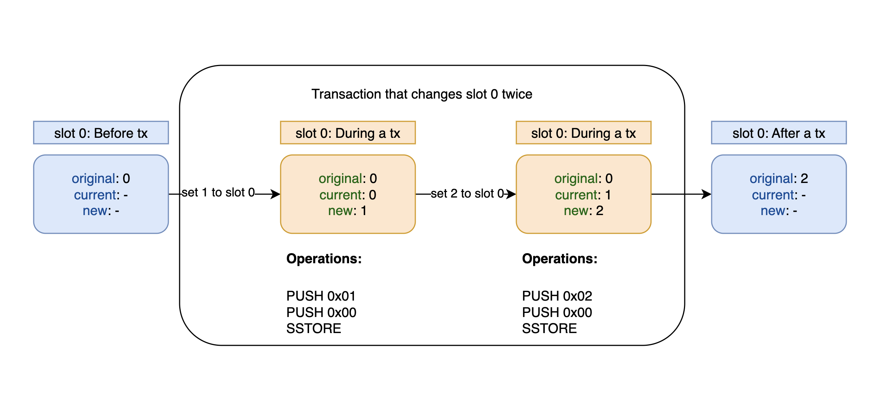

# Gas used part 2: Storage gas calculation

**Автор:** [Роман Ярлыков](https://github.com/rlkvrv) 🧐

После того как в первой части статьи мы исследовали общую механику расчета газа при выполнении транзакций, в этой части нашего погружения в мир Ethereum мы будем фокусироваться на операциях с хранилищем (`storage`). Пройдемся по истории изменений, связанных с расчетом газа в Ethereum, чтобы увидеть, по каким принципам сообщество принимало решения об изменениях в "правилах игры" и как сегодня, на основе этой истории, правильно выполнять расчеты газа.

## Расчет динамического газа для операции SSTORE

Существуют сложные правила, связанные с `SSTORE`, понять и запомнить которые с первого раза бывает непросто. Основная идея этих правил - сделать первую запись в слот (или изменение значения с 0 на ненулевое) более затратной по газу, в отличие от последующих перезаписей, так как в базе данных этот слот уже инициализирован. Кроме того, важно стимулировать очищение блокчейна от ненужных данных. Поэтому, если значение в слоте устанавливается обратно в 0, за такую операцию предусмотрен возврат газа.

### Изначальный механизм расчета

В начальные времена Ethereum расчёт газа для `SSTORE` выглядел следующим образом:

-   20,000 газа за установку значения слота с 0 на ненулевое;
-   5,000 газа за любые другие изменения значения слота;
-   Возврат 10,000 газа при установке значения слота с ненулевого на 0. Возвраты происходили в конце транзакции.

### EIP-1087: Учет газа для операций SSTORE

Эти простые правила, заложенные с самого начала, привели к ряду крайних случаев, описанных в разделе "мотивация" [EIP-1087](https://eips.ethereum.org/EIPS/eip-1087), когда расход газа оказывался нерациональным и несправедливым:

-   Контракт с пустым хранилищем, устанавливающий значение слота сначала на 1, а затем обратно на 0, тратит `20,000 + 5,000 - 10,000 = 15,000` газа, хотя такая последовательность операций не требует записи на диск. Это может использоваться, например, в механизмах защиты от повторного входа.
-   Контракт, который увеличивает значение слота 0 пять раз, тратит `20,000 + 5 * 5,000 = 45,000` газа, в то время как такая последовательность операций требует столько же активности диска, сколько одна запись, стоимостью в 20,000 газа.
-   Перевод средств с аккаунта A на B, а затем с B на C, при условии, что все аккаунты имеют ненулевые начальные и конечные балансы, обходится в `5,000 * 4 = 20,000` газа.

#### Dirty map

В качестве решения было предложено использовать **"dirty map"**, которое фиксирует все обращения к хранилищу в ходе текущей транзакции.

> Dirty map — это структура данных типа ключ-значение, записывающая все изменённые слоты хранения во всех контрактах за время транзакции.

Для повторных перезаписей предлагалось установить стоимость в 200 единиц газа, а также ввести счетчик для возврата газа.

Крайние случаи, описанные выше, после внедрения EIP-1087 стали выглядеть так:

-   Если контракт с пустым хранилищем устанавливает слот 0 в 1, а затем обратно в 0, с него будет взиматься `20,000 + 200 - 19,800 = 400` газа, что меньше по сравнению с 15,000.
-   Контракт с пустым хранилищем, который увеличивает слот 0 пять раз, будет облагаться `20,000 + 5 * 200 = 21,000` газа, что меньше по сравнению с 45,000.
-   Перевод баланса с аккаунта A на аккаунт B, за которым следует перевод с B на C, при всех ненулевых начальных и конечных балансах, будет стоить `5,000 * 3 + 200 = 15,200` газа, что меньше по сравнению с 20,000.

Все условия перечислены в [тестовых случаях](https://eips.ethereum.org/EIPS/eip-1087#test-cases) EIP-1087, всего их 12.

### EIP-1283: Учет газа для SSTORE без dirty map

Реализация концепции "dirty map" оказалась сложной, что привело к разработке [EIP-1283](https://eips.ethereum.org/EIPS/eip-1283), основанного на EIP-1087. В EIP-1283 предлагается новая система определения стоимости газа для операций с хранилищем. Значения, устанавливаемые в `storage`, классифицируются следующим образом:

-   **Исходное значение слота хранилища (original value):** Значение слота хранилища в случае, если происходит откат в рамках текущей транзакции.
-   **Текущее значение слота хранилища (current value):** Значение слота перед выполнением операции SSTORE.
-   **Новое значение слота хранилища (new value):** Значение слота после выполнения операции SSTORE.

Возьмем небольшой фрагмент кода, который берет значение смарт-контракта `ChangeNumberTwice` из слота 0 и дважды его меняет при выполнении транзакции, которая вызовет функцию `set()`:

```js
contract ChangeNumberTwice {
    uint256 public amount; // до транзакции равно 0

    function set() external {
        amount = 1; // до SSTORE: original = 0; current = 0; new = 1;
        amount = 2; // до SSTORE: original = 0; current = 1; new = 2;
    }
}

```

Так это будет выглядеть на схеме:



Помимо этого вместо "dirty map" вводятся три состояния хранилища:

-   **Бездействие (No-op):** Операция не требует изменений, если значение `current` == `new`.
-   **Свежее (Fresh):** Слот не изменялся или возвращён к `original` значению. Применяется, когда значение `current` != `new`, но совпадает с `original`.
-   **Грязное (Dirty):** Слот уже был изменён. Применяется, когда значение `current` отличается от `new` и `original`.

В отличие от EIP-1087, такой подход внедрить легче, к тому же он может обработать еще больше [крайних случаев](https://eips.ethereum.org/EIPS/eip-1283#test-cases) (17).

Если мы вернемся к коду клиента geth, то увидим что для `dynamicGas` опкода `SSTORE` установлена функция `gasSStore`.

```go
SSTORE: {
    execute:    opSstore,
    dynamicGas: gasSStore,
    minStack:   minStack(2, 0),
    maxStack:   maxStack(2, 0),
},
```

В коде функции [gasSStore](https://github.com/ethereum/go-ethereum/blob/ae4ea047e35bb35828231f1b93f2f65a964abdc9/core/vm/gas_table.go#L98) встречаются следующие комментарии:

```go
// Устаревший механизм учёта газа, учитывает только текущее состояние.
// Правила устаревшего режима должны применяться, если мы находимся в Petersburg
// (когда был отменен EIP-1283) ИЛИ если Constantinople не активен.
if evm.chainRules.IsPetersburg || !evm.chainRules.IsConstantinople {
    // ...
    // Логика расчета газа для хард-форка St.Petersburg и всех остальных
    // кроме хард-форка Constantinople
}
```

Которые вызывают ряд вопросов относительно хард-форков Petersburg и Constantinople, а также EIP-1283, давайте разбираться:

1. **Хард-форк Petersburg:** Хотя он официально не упоминается в [истории](https://ethereum.org/en/history) хард-форков Ethereum, Petersburg фактически является частью хард-форка Constantinople. Он был введен для отмены EIP-1283 из-за обнаруженной уязвимости.
2. **EIP-1283 и Constantinople:** EIP-1283 был включен в первоначальный план хард-форка Constantinople, но из-за обнаруженной уязвимости к атаке "повторного входа", его реализация была отменена.
3. **Работа Constantinople с EIP-1283:** Несмотря на то, что EIP-1283 был отменен, его код остался в некоторых тестовых версиях и клиентах до официального релиза Constantinople.
4. **Отмена EIP-1283:** EIP-1283 был отменен из-за обнаружения уязвимости, которая позволяла провести атаку "повторного входа". Это привело к необходимости внесения изменений и созданию хард-форка Petersburg вместе с Constantinople для устранения этой проблемы.

В результате, в мейннете Ethereum продолжил работать устаревший механизм учёта газа, описанный в начале статьи, вместо реализации предложенной в EIP-1283.

### EIP-2200: Структурированные определения для учета газа

Получается вернулись в ту точку, с которой начали, переходим к следующему хард-форку - [Istanbul](https://ethereum.org/en/history#istanbul), который вводит 2 предложения по газу: [EIP-2200](https://eips.ethereum.org/EIPS/eip-2200) и [EIP-1884](https://eips.ethereum.org/EIPS/eip-1884) (фактически их 3, но EIP-1108 связан с криптографией).

Основные изменения следующие:

-   **EIP-2200:** Берет за основу EIP-1283 и [EIP-1706](https://eips.ethereum.org/EIPS/eip-1706), последний из которых исправляет уязвимость EIP-1283. Теперь, если оставшийся газ (`gasleft`) в транзакции меньше или равен стипендии за перевод эфира (2300 газа), транзакция отменяется с ошибкой `out of gas`.
-   **Явные переменные для газа:** Введение переменных, таких как `SSTORE_SET_GAS` в EIP-2200, для явного учета изменений стоимости газа.
-   **Стоимость грязного хранилища:** В EIP-2200 стоимость обращения к "грязному хранилищу" установлена в переменной `SLOAD_GAS` и составляет 800 единиц газа.
-   **Увеличение стоимости `SLOAD`:** В EIP-1884 стоимость операции `SLOAD` увеличена с 200 до 800 единиц газа.
-   **Структурные изменения в EIP-2200:** Внесены изменения в реализацию EIP-1283, улучшающие структуру и исправляющие обнаруженные недостатки.

#### EIPs in geth

В файле [eips.go](https://github.com/ethereum/go-ethereum/blob/master/core/vm/eips.go) клиента geth представлены все изменения, связанные с EIPs, включая EIP-2200, внедренный после хард-форка Istanbul. Вот функция отвечающая за изменения:

```go
    func enable2200(jt *JumpTable) {
        jt[SLOAD].constantGas = params.SloadGasEIP2200
        jt[SSTORE].dynamicGas = gasSStoreEIP2200
    }
```

Эти строки кода отражают следующее:

-   **Изменение стоимости `SLOAD`:** Константное значение газа для `SLOAD` было изменено на 800 единиц, что соответствует новым параметрам, определенным в EIP-2200. Сами переменные, связанные с газом, можно найти в [protocol_params.go](https://github.com/ethereum/go-ethereum/blob/master/params/protocol_params.go#L108).
-   **Изменение функции расчета динамического газа для `SSTORE`:** Введена новая функция `gasSStoreEIP2200`, которая заменяет устаревшую функцию `gasSStore`. Эта новая функция учитывает изменения, внесенные EIP-2200, и обеспечивает более точный расчет стоимости газа для операций `SSTORE`. Код этой функции доступен в [gas_table.go](https://github.com/ethereum/go-ethereum/blob/7596db5f485e29dbbb66add8fcad6e25368bf96b/core/vm/gas_table.go#L183).

#### Тест-кейсы

EIP-2200 предоставляет [таблицу](https://arc.net/l/quote/kskrsgme) с тест-кейсами. Покажу как производится расчет на примере двух случаев с refund и без:

| Code                   | Used Gas | Refund | Original | Current | New |
| ---------------------- | -------- | ------ | -------- | ------- | --- |
| 0x60006000556000600055 | 1612     | 0      | 0        | 0       | 0   |
| 0x60006000556000600055 | 5812     | 15000  | 1        | 0       | 0   |

Важно понимать пару моментов:

1. Код написан для установки значений `current` и `new`, т.к. `original` это значение до выполнения транзакции (подразумеваем что оно уже записано в слот заранее).
2. Конкретно эти тестовые кейсы используют одинаковый код, но разные значения, здесь нет ошибки.

##### Тест-кейс 1

| Code                   | Used Gas | Refund | Original | 1st | 2nd |
| ---------------------- | -------- | ------ | -------- | --- | --- |
| 0x60006000556000600055 | 1612     | 0      | 0        | 0   | 0   |

Разложим код на опкоды и запишем сколько газа потребляет каждый опкод, затем посчитаем сколько газа было использовано и сколько накопилось в счетчике **refund**.

| Операция   | Значения                           | Газ  | Условие                        |
| ---------- | ---------------------------------- | ---- | ------------------------------ |
| PUSH1 0x00 | -                                  | 3    | -                              |
| PUSH1 0x00 | -                                  | 3    | -                              |
| SSTORE     | original = 0; current = 0; new = 0 | 800  | **current** == **new** (No-op) |
| PUSH1 0x00 | -                                  | 3    | -                              |
| PUSH1 0x00 | -                                  | 3    | -                              |
| SSTORE     | original = 0; current = 0; new = 0 | 800  | **current** == **new** (No-op) |
| **Итог**   | 3 + 3 + 800 + 3 + 3 + 800          | 1612 | -                              |
| **Refund** | -                                  | 0    | -                              |

В данной ситуации в обоих `sstore` сработало правило:

-   If current value equals new value (this is a no-op), `SLOAD_GAS` is deducted.

Константа SLOAD_GAS = 800.

##### Тест-кейс 2

| Code                   | Used Gas | Refund | Original | Current | New |
| ---------------------- | -------- | ------ | -------- | ------- | --- |
| 0x60006000556000600055 | 5812     | 15000  | 1        | 0       | 0   |

Флоу транзакции следующий:

| Код        | Описание                           | Газ   | Комментарий                                                               |
| ---------- | ---------------------------------- | ----- | ------------------------------------------------------------------------- |
| PUSH1 0x00 | -                                  | 3     | -                                                                         |
| PUSH1 0x00 | -                                  | 3     | -                                                                         |
| SSTORE     | original = 1; current = 1; new = 0 | 5000  | **current** != **new**, **original** != **current** (Dirty, refund 15000) |
| PUSH1 0x00 | -                                  | 3     | -                                                                         |
| PUSH1 0x00 | -                                  | 3     | -                                                                         |
| SSTORE     | original = 1; current = 0; new = 0 | 800   | **current** == **new** (No-op)                                            |
| **Итог**   | 3 + 3 + 5000 + 3 + 3 + 800         | 5812  | -                                                                         |
| **Refund** | -                                  | 15000 | -                                                                         |

В первом `sstore` применяются эти правила:

-   **If current value does not equal new value**
    -   **If original value equals current value (this storage slot has not been changed by the current execution context)**
        -   If original value is 0, SSTORE_SET_GAS is deducted.
        -   **Otherwise, SSTORE_RESET_GAS gas is deducted. If new value is 0, add SSTORE_CLEARS_SCHEDULE gas to refund counter.**

Переменная SSTORE_RESET_GAS = 5000, SSTORE_CLEARS_SCHEDULE = 15000.

Эти два примера показывают общую логику, попробуйте проделать подобный расчет для других тест-кейсов, чтобы улучшить свое понимание, потому что знание условий EIP-2200 еще пригодится.

## Теплый и холодный доступ

После хард-форка Istanbul, хард-форк [Berlin](https://ethereum.org/en/history#berlin) внес важные изменения, связанные с газом, в Ethereum. Одно из ключевых предложений — [EIP-2929: Gas cost increases for state access opcodes](https://eips.ethereum.org/EIPS/eip-2929). Эти изменения повлияли на расчет динамической части газа для `SSTORE`.

В EIP-2929 введены три новые константы, которые вносят понятия "теплого" и "холодного" доступа, применяемые не только к операциям с хранилищем, но и к другим опкодам, работающим с состоянием блокчейна, таким как `SLOAD`, семейство `*CALL`, `BALANCE`, семейство `EXT*` и `SELFDESTRUCT`.

| Constant                 | Value |
| ------------------------ | ----- |
| COLD_SLOAD_COST          | 2100  |
| COLD_ACCOUNT_ACCESS_COST | 2600  |
| WARM_STORAGE_READ_COST   | 100   |

> Холодный доступ - если в рамках транзакции к конкретному слоту в `storage` аккаунта обращаются впервые (выполняют загрузку данных).
> Теплый доступ - соответственно в случае с теплым доступом имеется в виду, что в рамках одной транзакции к этому слоту уже обращались (слот прогрет).

Нововведение необходимо для оптимизации работы сети и более эффективного распределения ресурсов.

Также изменились значения старых параметров:

| Parameter        | Old value | New value                     |
| ---------------- | --------- | ----------------------------- |
| SLOAD            | 800       | 2100                          |
| SLOAD_GAS        | 800       | 100 (=WARM_STORAGE_READ_COST) |
| SSTORE_RESET_GAS | 5000      | 2900 (5000 - COLD_SLOAD_COST) |

_Важно!_ EIP-2929 не отменяет понятия "Fresh" и "Dirty" хранилища, а также градацию значений на original/current/new из EIP-2200 (в контексте обращения к хранилищу). Ко всему этому еще добавляется первый и последующий доступы (холодный и теплый) к слотам.

_Важно!_ Доступы распространяется и на другие опкоды, не только на работу с `SLOAD` и `SSTORE`. Это ключевой момент в понимании данного EIP.

Если взять первый тестовый кейс из EIP-2200, тогда изменения следующие:

Было:
| Code | Used Gas | Refund | Original | 1st | 2nd | 3rd |
| -------------------- | -------- | ------ | -------- | --- | --- | --- |
| 0x600060055600600055 | 1612 | 0 | 0 | 0 | 0 | 0 |

```
    PUSH1 + PUSH1 + SSTORE + PUSH1 + PUSH1 + SSTORE
    3 + 3 + 800 + 3 + 3 + 800 = 1612
```

Стало:
| Code | Used Gas | Refund | Original | 1st | 2nd | 3rd |
| -------------------- | -------- | ------ | -------- | --- | --- | --- |
| 0x600060055600600055 | 2312 | 0 | 0 | 0 | 0 | 0 |

```
    PUSH1 + PUSH1 + SSTORE + PUSH1 + PUSH1 + SSTORE
    3 + 3 + (2100 + 100) + 3 + 3 + 100 = 2300
```

То есть, раньше каждая последующая запись в один и тот же слот (в случае когда **current** == **original**) стоило бы 800 ед. газа. После EIP-2929, самое первое обращение в рамках одной транзакции будет дороже (2200), но все последующие будут сильно дешевле (100).

Также поменялась логика и с возвратом газа в связи с изменением `SSTORE_RESET_GAS`.

### Списки доступа

Второе ключевое изменение, внесенное хард-форком Berlin, заключается в [EIP-2930: Optional access lists](https://eips.ethereum.org/EIPS/eip-2930), который вводит так называемые списки доступа. Это предложение разработано для смягчения последствий, введенных EIP-2929, и для этого предлагает новый тип транзакций (тип 1) с включением списка доступа. Также вводятся новые константы:

| Constant                     | Value |
| ---------------------------- | ----- |
| ACCESS_LIST_STORAGE_KEY_COST | 1900  |
| ACCESS_LIST_ADDRESS_COST     | 2400  |

Списки доступа в этих транзакциях типа 1 позволяют заранее указывать, к каким адресам и ключам хранения будет осуществляться доступ в ходе транзакции. Это уменьшает стоимость газа для "холодных" доступов, если они заранее указаны в списке доступа, таким образом смягчая воздействие увеличенной стоимости газа для "холодных" чтений, введенной в EIP-2929.

Смысл такой. Инициатор транзакции может сделать эту транзакцию немного дешевле в случае, если выполняются два условия:

-   Инициатор транзакции вызывает смарт-контракт А, который в свою очередь вызывает смарт-контракты Б, В и так далее. В таком случае `ACCESS_LIST_ADDRESS_COST` применяется для смарт-контрактов вызываемых из А - т.е смарт-контракт Б, В и т.д
-   Инициатор точно знает адреса смарт-контрактов, вызываемых контрактом А, и слоты памяти, к которым эти смарт-контракты обращаются.

При выполнении этих условий, стоимость первого (холодного) доступа к опкодам `CALL` и `SLOAD` для смарт-контракта Б снижается:

| Constant                     | Смарт-контракт | CALL | SLOAD |
| ---------------------------- | -------------- | ---- | ----- |
| ACCESS_LIST_STORAGE_KEY_COST | А              | 2600 | 2400  |
| ACCESS_LIST_ADDRESS_COST     | Б              | 2100 | 1900  |

#### Реализация списков доступа в клиенте geth

Для реализации EIP-2929 с "теплым" и "холодным" доступом к хранилищу в [интерфейсе StateDB](https://github.com/ethereum/go-ethereum/blob/f55a10b64d511b27beb02ff4978a6ed66d604cd8/core/vm/interface.go#L66), а именно добавление двух полей: `AddressInAccessList` и `SlotInAccessList`. При первом считывании переменной (т.е. "холодном" доступе), она регистрируется в `SlotInAccessList`. Второе и последующие обращения к этой переменной (т.е. "теплые" доступы) потребляют меньше газа.

Для подробного изучения, можно обратиться к функции [enable2929](https://github.com/ethereum/go-ethereum/blob/18e154eaa24d5f7a8b3c48983ad591e6c10963ca/core/vm/eips.go#L120), в частности, к функции расчета динамического газа для опкода `SLOAD` - `gasSLoadEIP2929`:

```go
func enable2929(jt *JumpTable) {
    jt[SSTORE].dynamicGas = gasSStoreEIP2929

    jt[SLOAD].constantGas = 0
    jt[SLOAD].dynamicGas = gasSLoadEIP2929

    // ...
}
```

Сама функция [gasSLoadEIP2929](https://github.com/ethereum/go-ethereum/blob/f55a10b64d511b27beb02ff4978a6ed66d604cd8/core/vm/operations_acl.go#L103) выглядит так:

```go
// Для SLOAD, если пара (адрес, ключ_хранения) (где адрес - это адрес контракта,
// чье хранилище считывается) еще не находится в accessed_storage_keys,
// взимается 2100 газа и пара добавляется в accessed_storage_keys.
// Если пара уже находится в accessed_storage_keys, взимается 100 газа.
func gasSLoadEIP2929(evm *EVM, contract *Contract, stack *Stack, mem *Memory, memorySize uint64) (uint64, error) {
	loc := stack.peek()
	slot := common.Hash(loc.Bytes32())
	// Проверяем наличие слота в списке доступа
	if _, slotPresent := evm.StateDB.SlotInAccessList(contract.Address(), slot); !slotPresent {
		// Если вызывающий не может позволить себе стоимость, изменение будет отменено
		// Если он может позволить, мы можем пропустить повторную проверку того же самого позже, в процессе выполнения
		evm.StateDB.AddSlotToAccessList(contract.Address(), slot)
		return params.ColdSloadCostEIP2929, nil
	}
	return params.WarmStorageReadCostEIP2929, nil
}
```

_Важно!_ Список доступа формируется до выполнения транзакции и добавляется непосредственно в данные транзакции.

Подробнее про списки доступа можно почитать в [этой](https://www.rareskills.io/post/eip-2930-optional-access-list-ethereum) статье.

### Возврат газа при очистке хранилища

Рассмотрим механизм возврата газа при очистке хранилища в Ethereum, когда значение слота возвращается к исходному, как определено в EIP-1283. Эта практика, менявшаяся с каждым хард-форком, началась с возмещения 10,000 единиц газа за очистку слота. Правила изменились в EIP-1283 и были дополнены в EIP-2200:

1. При замене ненулевого исходного значения (original) на ноль, возврат составляет `SSTORE_CLEARS_SCHEDULE` (15,000 газа).
2. Если значение `original` было нулевым, `current` - ненулевым, и `new` - нулевым, возврат равен `SSTORE_SET_GAS` - `SLOAD_GAS` (19,900 газа).
3. При замене ненулевого `original` значения на другое ненулевое, а затем обратно на `original`, возврат составляет `SSTORE_RESET_GAS` - `SLOAD_GAS` (4,900 газа).

Подробнее обработку таких случаев изучить в [тестовых примерах](https://arc.net/l/quote/bfzggnpq) EIP-2200.

#### EIP-3529: Изменения в механизме возврата газа

EIP-2929 не вносил изменений в механизм возврата газа, но таковые появились в хард-форке [London](https://ethereum.org/en/history#london) с [EIP-3529](https://eips.ethereum.org/EIPS/eip-3529). Этот EIP пересматривает правила возврата газа за `SSTORE` и `SELFDESTRUCT`. Ранее, эти возмещения предназначались для стимулирования разработчиков к "хорошей гигиене состояний", то есть к очистке ненужных слотов хранилища и смарт-контрактов. Однако, на практике это привело к нескольким проблемам:

1. **Проблема GasToken**: GasToken позволяет экономить газ в периоды низких комиссий и использовать его в периоды высоких цен, но это также приводит к увеличению размера состояния сети (потому что он использует слоты хранилища, как накопители газа) и неэффективно загружает сеть. Таким образом, правила возврата давали возможность манипулировать газом, влияя на работу всего блокчейна.

    > GasToken - смарт-контракт в сети Ethereum, который позволяет пользователям покупать и продавать газ напрямую, обеспечивая долгосрочный "банкинг" газа, который может помочь защитить пользователей от роста цен на газ.

2. **Увеличение вариативности размера блока**: Теоретически, максимальное количество газа, потребляемое в блоке, может быть почти вдвое больше установленного лимита газа из-за возмещений. Это увеличивает колебания размера блоков и позволяет поддерживать высокое потребление газа на более длительный период, что противоречит целям [EIP-1559](https://eips.ethereum.org/EIPS/eip-1559).

EIP-3529 внес предложения по уменьшению возмещений за операции, чтобы повысить предсказуемость и стабильность экономики газа. Основные изменения:

1. Удалить возмещение газа за `SELFDESTRUCT`.
2. Заменить `SSTORE_CLEARS_SCHEDULE` (как определено в EIP-2200) на `SSTORE_RESET_GAS` + `ACCESS_LIST_STORAGE_KEY_COST` (4,800 газа по состоянию на EIP-2929 + EIP-2930).
3. Уменьшить максимальное количество газа, возмещаемого после транзакции, до `gas_used` // `MAX_REFUND_QUOTIENT`.
    - Примечание: Ранее максимальное количество возмещаемого газа определялось как `gas_used` // 2. В EIP константе 2 присваивается название `MAX_REFUND_QUOTIENT`, значение изменяется на 5.

##### Изменения EIP-3529 в клиенте geth

Проследим изменения EIP-3529 в коде geth. Для этого переходим в файл [eips.go](https://github.com/ethereum/go-ethereum/blob/master/core/vm/eips.go), находим функцию [enable3529](https://github.com/ethereum/go-ethereum/blob/566754c74a74c8175ec2f1ee5cc10a8caced6015/core/vm/eips.go#L160C8-L160C8):

```go
// enable3529 активирует "EIP-3529: Сокращение возмещений":
// - Удаляет возмещения за selfdestruct
// - Уменьшает возмещения за SSTORE
// - Уменьшает максимальные возмещения до 20% от газа
func enable3529(jt *JumpTable) {
    jt[SSTORE].dynamicGas = gasSStoreEIP3529
    jt[SELFDESTRUCT].dynamicGas = gasSelfdestructEIP3529
}
```

Функция расчета для `dynamicGas` в очередной раз изменена, теперь это `gasSStoreEIP3529`:

```go
// gasSStoreEIP3529 реализует стоимость газа для SSTORE в соответствии с EIP-3529
// Заменяет SSTORE_CLEARS_SCHEDULE на SSTORE_RESET_GAS + ACCESS_LIST_STORAGE_KEY_COST (4,800)
gasSStoreEIP3529 = makeGasSStoreFunc(params.SstoreClearsScheduleRefundEIP3529)
```

Если посмотреть из чего складывается `SstoreClearsScheduleRefundEIP3529`, в комментариях можно увидеть всю историю изменений возвратов:

```go
// В EIP-2200: SstoreResetGas был 5000.
// В EIP-2929: SstoreResetGas был изменен на '5000 - COLD_SLOAD_COST'.
// В EIP-3529: SSTORE_CLEARS_SCHEDULE определяется как SSTORE_RESET_GAS + ACCESS_LIST_STORAGE_KEY_COST
// Что теперь ровняется: 5000 - 2100 + 1900 = 4800
SstoreClearsScheduleRefundEIP3529 uint64 = SstoreResetGasEIP2200 - ColdSloadCostEIP2929 + TxAccessListStorageKeyGas
```

В файле с константами также есть предыдущее значение:

```go
SstoreClearsScheduleRefundEIP2200 uint64 = 15000
```

##### Тестовые случаи EIP-3529 изменения расчета газа

[Тестовые случаи](https://eips.ethereum.org/EIPS/eip-3529#test-cases) EIP-3529 демонстрируют изменения в возвратах газа до и после его активации. Они представлены в виде двух таблиц, где заметно, что возвраты, ранее составлявшие 15,000 единиц газа, теперь сокращены до 4,800 единиц.

_Важно!_ Эти тесты проведены с предположением, что хранилище уже "прогрето".

На сайте evm.codes представлен калькулятор газа для опкода [SSTORE](https://arc.net/l/quote/yxdehesj), позволяющий указать три значения (original, current, new) и тип хранилища (warm или cold), чтобы рассчитать потребление и возврат газа. Там же доступно подробное описание правил расчета в зависимости от условий.

Эта информация отражает текущее состояние возвратов газа на момент написания статьи, когда Ethereum находится в хард-форке [Shanghai](https://ethereum.org/en/history#shanghai).

Стоит отметить, что в будущем правила для динамического расчета газа могут измениться. Однако теперь вы знаете, где искать эти изменения и как интерпретировать их, чтобы понять актуальную стоимость. В Ethereum, подобно законам в реальном мире, правила могут устаревать, меняться или претерпевать небольшие корректировки, хотя механизмы этих изменений отличаются от традиционных законодательных процессов.

## Внутренний газ

Мы уже рассмотрели расчет и списание газа при выполнении логики смарт-контракта, но существует также понятие внутреннего газа (intrinsic gas), взимаемого перед выполнением этой логики. Важно учитывать, что в некоторых транзакциях вызов смарт-контракта может отсутствовать.

Для понимания составляющих внутреннего газа, следует обратиться к разделу 6 Yellow paper Ethereum. Расчет внутреннего газа представлен формулой g<sub>0</sub>:


Для значений G, указанных в формуле, можно обратиться к "Appendix G. Fee Schedule" на 27 странице Yellow paper. Формула внутреннего газа довольно проста, и мы рассмотрим ее детально пошагово:

1. **Расчет газа за `calldata`:** В транзакции он основывается на сумме G<sub>txdatazero</sub> и G<sub>txdatanonzero</sub>. За каждый ненулевой байт `calldata` взимается G<sub>txdatanonzero</sub> (16 ед. газа), а за каждый нулевой байт — G<sub>txdatazero</sub> (4 ед. газа). Рассмотрим пример вызова функции `store(uint256 num)` с параметром num = 1:

```
    0x6057361d0000000000000000000000000000000000000000000000000000000000000001
```

-   Первые 4 байта — это ненулевая сигнатура функции, что обходится в 4 \* 16 = 64 единицы газа.
-   Затем следует 31 нулевой байт, что равно 31 \* 4 = 124 единицам газа.
-   Ненулевой байт, представляющий `num = 1`, взимает 1 \* 16 = 16 единиц газа.
-   Итого, общая стоимость составляет 64 + 124 + 16 = 204 единицы газа.

2. **Создание смарт-контракта**: Если транзакция включает создание смарт-контракта (поле `to` равно нулевому адресу), к внутреннему газу добавляется G<sub>txcreate</sub>, равный 32,000 единиц газа.

3. **Базовый газ за транзакцию**: Минимальное количество газа, требуемое для любой транзакции, составляет G<sub>transaction</sub> — 21,000 единиц газа. Это базовое значение применяется, например, к простым переводам эфира, где нет дополнительных операций, требующих увеличения газа.

4. **Стоимость доступа к списку**: Согласно [EIP-2930](https://eips.ethereum.org/EIPS/eip-2930), внутренний газ также учитывает G<sub>accesslistaddress</sub> (2,400 единиц газа) и G<sub>accessliststorage</sub> (1,900 единиц газа). Эти значения добавляются за каждый адрес и слот, указанные в списке доступа, если транзакция включает предоплату за "прогрев".

Таким образом, как можно видеть, расчет внутреннего газа в Ethereum относительно прост. Для более детального понимания, рекомендуется изучить функцию [IntrinsicGas](https://github.com/ethereum/go-ethereum/blob/c66ca8bf7a8c63ae54e44f4566e206cd1a4fa204/core/state_transition.go#L69), находящуюся в файле [state_transition.go](https://github.com/ethereum/go-ethereum/blob/master/core/state_transition.go) в репозитории go-ethereum.

## Общий процесс расчета газа в Ethereum

Давайте соберем всю информацию вместе для полного понимания процесса расчета газа в Ethereum. Все начинается с блока, в котором отслеживается суммарное количество использованного газа по всем транзакциям (`gasUsed`). Каждая индивидуальная транзакция в блоке проходит через обработку функцией [applyTransaction](https://github.com/ethereum/go-ethereum/blob/566754c74a74c8175ec2f1ee5cc10a8caced6015/core/state_processor.go#L107), в ходе которой происходит следующее:

1. **Инициализация счетчиков газа**: Первый счетчик (`st.gas`) отображает доступное количество газа для транзакции и инициализируется ее лимитом газа (`gasLimit`). Второй счетчик следит за фактически использованным газом.

2. **Авансовый платеж**: С баланса отправителя списывается авансовый платеж, равный произведению цены газа (`gasPrice`) на лимит газа (`gasLimit`).

3. **Уменьшение лимита газа блока**: Общий лимит газа блока уменьшается на величину лимита газа транзакции.
4. **Расчет внутреннего газа**: Вычисляется внутренний газ транзакции, включая базовую стоимость и стоимость за каждый байт `calldata`.
5. **Выполнение транзакции**: Функция `Call()` запускает выполнение транзакции, а при необходимости - и логику смарт-контракта через `Run()`.
6. **Обновление и возврат газа**: Счетчик оставшегося газа (`st.gas`) обновляется на основе данных от `Call()`. Неиспользованный газ, умноженный на цену газа, возвращается отправителю в ETH. Остаток газа также возвращается в общий пул газа блока.

На приведенной схеме наглядно показан процесс обработки газа на уровне протокола как для отдельных транзакций, так и для всего блока. Более подробно об этом можно прочитать [здесь](https://arc.net/l/quote/wdbuajzw).


Таким образом процесс расчета стоимости газа за транзакцию включает в себя две основные составляющие:

1. **Базовая стоимость газа**: Она учитывает внутренний газ транзакции, включающий стоимость данных (`calldata`) и базовые операционные расходы.
2. **Стоимость выполнения смарт-контракта**: Это дополнительные расходы газа, связанные с логикой и операциями смарт-контракта.

Важно гарантировать, что баланс отправителя содержит достаточно средств для покрытия максимально возможных расходов газа. Также критично убедиться, что лимит газа, установленный для транзакции, не превышает общий лимит газа блока, чтобы транзакция могла быть успешно обработана в рамках блока.

## Заключение

Поздравляю! Это было долгий и сложный путь, но теперь в расчете газа стало меньше магии. Вот тут есть краткая [шпаргалка](https://www.evm.codes/about) по основным моментам.

## Links

-   [Article: EIP-2930 - Ethereum access list](https://www.rareskills.io/post/eip-2930-optional-access-list-ethereum)
-   [Doc: Ethereum Yellow Paper](https://ethereum.github.io/yellowpaper/paper.pdf)
-   [Code: Go-Ethereum](https://github.com/ethereum/go-ethereum)
