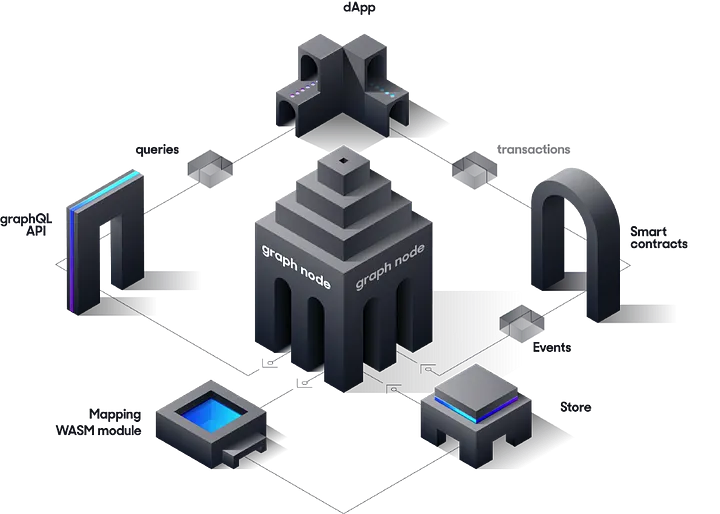

# The Graph
-   [Graph](#Graph)
    -   [Что такое Graph?](#что-такое-Graph)
    -   [Как он работает?](#как-он-работает)
    -   [Создание subgraph](#создание-subgraph)
         -   [Определение subgraph.yaml](#1-определение-subgraphyaml)
         -   [Определение schema.graphql](#2-определение-schemagraphql)
         -   [Написание маппингов](#3написание-assemblyscript-mappings)
              -   [Event Handlers](#eventhandlers)
              -   [Call Handlers](#call-handlers)
              -   [Block Handlers](#block-handlers)
              -   [Data Source Template](#data-source-templates)
              -   [File Data Sourcese](#file-data-sources⁠)
    -   [Unit testing Framework](#Unit-testing)
    -   [Ссылки](#ссылки)

## Что такое the Graph?

The Graph — это децентрализованный протокол для индексации и запроса данных блокчейна. The Graph позволяет запрашивать данные, которые трудно запросить напрямую с контракта.

Например, проекты со сложными смарт-контрактами, такие как Uniswap, и  NFT, такие как Bored Ape Yacht Club, хранят данные в блокчейне Ethereum, что очень затрудняет чтение чего-либо, кроме основных данных, непосредственно из блокчейна.

В случае NFT Bored Ape Yacht Club, мы можем выполнять основные операции чтения контракта, такие как получение владельца определенного id токена, получение URI контента  на основе id токена, или totalSupply, поскольку эти функция записаны в смарт-контракт. Более сложные запросы и операции реального мира, такие как агрегация, поиск, отношения и нетривиальная фильтрация, невозможны. 

Например, если бы мы хотели запросить id токенов, принадлежащих определенному адресу, и отфильтровать по одной из его характеристик, мы не смогли бы получить эту информацию, взаимодействуя непосредственно с самим контрактом.

Чтобы получить эти данные, вам придется обработать каждое событие transfer, когда-либо созданное, прочитать метаданные из IPFS с использованием id токена и хэша IPFS, а затем агрегировать их. Даже на такие относительно простые вопросы децентрализованному приложению (dapp), работающему в браузере, потребуются часы или даже дни, чтобы получить ответ.

Вы также можете создать свой собственный сервер, обрабатывать там транзакции, сохранять их в базе данных и создавать конечную точку API поверх всего этого, чтобы запрашивать данные. Однако этот вариант является [ресурсоемким](https://thegraph.com/docs/en/network/benefits/), требует обслуживания, представляет собой единую точку отказа и нарушает важные свойства безопасности, необходимые для децентрализации.

Индексировать данные блокчейна очень и очень сложно. 
Свойства блокчейна, такие как окончательность, реорганизация цепочки или неподключенные блоки, еще больше усложняют этот процесс и делают не только трудоемким, но и концептуально трудным получение правильных результатов запроса из данных блокчейна.

The Graph решает эту проблему с помощью децентрализованного протокола, который индексирует и обеспечивает производительный и эффективный запрос данных блокчейна. Эти API (indexed "subgraphs") затем можно запрашивать с помощью стандартного API GraphQL. 

Сегодня есть [hosted service](https://thegraph.com/docs/en/deploying/hosted-service/), который позволит деплоить бесплатно, не используя децентрализованную сеть, а также децентрализованный протокол с теми же возможностями. Оба поддерживаются реализацией [Graph Node](https://github.com/graphprotocol/graph-node) с открытым исходным кодом.

>Важно: Обратите внимание, что в 2023 году хостинговая служба начнет закрываться, но она останется доступной для сетей, которые не поддерживаются в децентрализованной сети. Разработчикам рекомендуется обновить свои подграфы до The Graph Network, поскольку поддерживается больше сетей. Хостинговые службы в каждой сети будут постепенно закрываться, чтобы у разработчиков было достаточно времени для обновления сабграфов до децентрализованной сети. Подробнее о прекращении действия размещенной службы можно прочитать [тут](https://thegraph.com/blog/sunsetting-hosted-service/).

## Как он работает?

The Graph узнает, что и как индексировать данные Ethereum, на основе описаний subgraph, известных как subgraph manifest.В subgraph manifest определяются интересующие смарт-контракты для subgraph, события в этих контрактах, на которые следует обратить внимание, и то, как сопоставлять данные событий с данными, которые The Graph будет хранить в своей базе данных.

После написания subgraph manifest вы используете Graph CLI для сохранения описания в IPFS и указываете индексатору начать индексацию данных для этого subgraph.


Разберем порядок работы: 
- Децентрализованное приложение добавляет данные в Ethereum через транзакции при взаимодействии со  смарт-контрактом. 
- Смарт-контракт генерирует одно или несколько событий при обработке транзакции.
- Graph Node постоянно сканирует Ethereum на наличие новых блоков и данных для вашего subgraph, которые они могут содержать. 
- Graph Node находит события Ethereum для вашего subgraph в этих блоках и запускает предоставленные вами обработчики сопоставления(mapping handlers). Обработчик — это модуль WASM, который создает или обновляет объекты данных, которые Graph Node хранит в ответ на события Ethereum. 
- Децентрализованное приложение запрашивает у Graph Node данные, проиндексированные из блокчейна, используя [node's GraphQL endpoint](https://graphql.org/learn/). Graph Node, в свою очередь, преобразует запросы GraphQL в запросы к своему базовому хранилищу данных, чтобы получить эти данные, используя возможности индексирования хранилища. Децентрализованное приложение отображает эти данные в пользовательском интерфейсе для конечных пользователей, которые они используют для создания новых транзакций в Ethereum. Цикл повторяется.

## Создание subgraph

В этом разделе мы разберемся в трех ключевых элементах при создании subgraph. 

Разберем создание основных элементов сабграфа на уже готовом [примере](https://github.com/graphprotocol/example-subgraph), немного модифицируя код.

Определение subgraph состоит из нескольких файлов:

 - **subgraph.yaml**: YAML файл который содержит subgraph manifest. В нем указываются информация необходимая для индесации и запроса к определенному сабграфу.
 - **schema.graphql**: GraphQL схема, которая определяет, какие данные хранятся для вашего subgraph и как запрашивать их через GraphQL.
 - **AssemblyScript Mappings**: Код [AssemblyScript](https://github.com/AssemblyScript/assemblyscript), который преобразует данные c событий в сущности, определенные в schema.graphql файле.

> Словарь терминов для статьи:
Сущность - entity - это часть схемы сабграфа, по которой мы будем определять как записывать, хранить, и как получать эти данные при запросе.
Сопоставление - маппинг - mapping - это Файл assebmlyScript, в котором написаны все функции, которые обрабатывают будь то тригер event, вызов функции, блок и обновляют/создают новою сущность в схеме сабграфа.

### **1. Определение subgraph.yaml**

Любой формат данных, который имеет четко определенное отображение с каноническим форматом [IPLD](https://github.com/ipld/specs/), может использоваться для определения манифеста подграфа. Сюда входят YAML и JSON.
Манифест подграфа и все связанные с ним файлы — это то, что развертывается в IPFS и хешируется для создания идентификатора подграфа, на который можно ссылаться и который можно использовать для извлечения подграфа в The Graph.

Примеры в этом документе представлены в формате YAML.

Самый первый шаг - определить subgraph manifest с использованием синтаксиса YAML. Полную спецификацию сабграф манифеста можно посмотреть [тут](https://github.com/graphprotocol/graph-node/blob/master/docs/subgraph-manifest.md).
Приведем пример:
```javascript
specVersion: 0.0.5
//удобочитаемое описание того, что представляет собой сабграф. 
//Это описание отображается в Graph Explorer при развертывании сабграфа в hosted service.
description: Gravatar for Ethereum
//URL-адрес репозитория, в котором можно найти манифест подграфа. Это также отображается в Graph Explorer
repository: https://github.com/graphprotocol/graph-tooling
//Путь до сабграф схемы
schema:
  file: ./schema.graphql
//Новые функции сабграфа, которые уже можно использовать, объявляются тут. Более подробно расскажем далее.
features:
  - fullTextSearch
////указываем источник в виде сети, название, адреса и abi контракта.
dataSources:
  - kind: ethereum/contract
    name: Gravity
    network: mainnet
    source:
      address: '0x2E645469f354BB4F5c8a05B3b30A929361cf77eC'
      abi: Gravity
// это необязательный параметр, который позволяет вам определить, с какого блока в начнетcя индексация. 
//Установка начального блока позволяет источнику данных потенциально пропускать миллионы ненужных блоков. 
//Обычно разработчик сабграфа устанавливает startBlock для блока, в котором был создан смарт-контракт.
      startBlock: 6175244
//раздел который описывает сущности схемы, abi контрактов и все типы хендлеров которые будут обрабатывать контракт.
    mapping:
      kind: ethereum/events
      apiVersion: 0.0.6
      language: wasm/assemblyscript
//сущности, которые источник данных записывает в хранилище. Схема для каждой сущности определяется в файле Schema.graphql.
      entities:
        - Gravatar
//Перечень abi для всех контрактов, с которыми мы будем взаимодействовать при написании сопоставлений(маппингов)
      abis:
        - name: Gravity
          file: ./abis/Gravity.json
//перечисляет события смарт-контракта, на которые реагирует сабграф, и хендлеры, которые преобразуют эти события в сущности согласно схеме сабграфа.
      eventHandlers:
        - event: NewGravatar(uint256,address,string,string)
          handler: handleNewGravatar
        - event: UpdatedGravatar(uint256,address,string,string)
          handler: handleUpdatedGravatar
//перечисляет функции смарт-контракта, на которые реагирует сабграф, и хендлеры, 
//которые преобразуют входные и выходные данные при вызове функции в сущности в схеме.
      callHandlers:
        - function: createGravatar(string,string)
          handler: handleCreateGravatar
//перечисляет блоки, на которые реагирует сабграф, и хендлеры в маппингах, которые 
//выполняются при добавлении блока в цепочку. Без фильтра обработчик блока будет запускаться в каждом блоке. 
//Дополнительный фильтр вызовов можно предоставить, добавив в обработчик поле фильтра с kind: call. 
//Обработчик будет запущен только в том случае, если блок содержит хотя бы один вызов контракта источника данных.
      blockHandlers:
        - handler: handleBlock
        - handler: handleBlockWithCall
          filter:
            kind: call
//путь где хранятся сопоставления(маппинги) для обработки событий, блоков, вызовов функций
      file: ./src/mapping.ts
```
Один сабграф может индексировать данные сразу из нескольких смарт-контрактов, для этого необходимо просто указать еще один источник даннных после поля ```DataSources:```

Но что будет если в одном блоке будет и тригер ивента и тригер вызова функции, а если еще и добавить блок к этому всему? В какой последовательности будут обрабатывать это все хендлеры в маппингах?

Для этого существуют правила, которые определяют, в какой последовательности будут запущены хендлеры в нашем манифесте для смарт-контракта внутри одного блока транзакций:

1. Триггеры событий и вызовов сортируются по индексу транзакции в блоке.
Это значит, что если в одном блоке несколько транзакций, сначала будут запущены все триггеры из первой транзакции, потом из второй и так далее.

2. Внутри одной транзакции сортировка идет по типу: сначала триггеры событий, потом триггеры вызовов функций.
Если в одной транзакции есть и события, и вызовы функций, то сначала будут обработаны все события, а потом все вызовы.
Кроме того, учитывается порядок, заданный в манифесте.

3. Триггеры, относящиеся к блоку, запускаются после всех остальных.
Эти триггеры сработают после того, как будут обработаны все события и вызовы во всех транзакциях этого блока.

>В будущем алгоритм упорядочивания может быть пересмотрен.

### **2. Определение schema.graphql**

Схемы GraphQL определяются с помощью языка определения интерфейса GraphQL. Если вы никогда не писали схему GraphQL, рекомендуется ознакомиться с [этим](https://thegraph.com/docs/en/querying/graphql-api/#schema) учебником по системе типов GraphQL
Из учебника, вы познакомились с понятием entities(сущности).

Перед определением сущностей важно подумать о том, как наши данные структурированы и связаны. Все запросы будут выполняться к модели данных, определенной в схеме сабграфа, и сущностям, индексированным подграфом. Из-за этого хорошо определить схему подграфа так, чтобы она соответствовала потребностям нашего децентрализованного приложения. Может быть полезно представлять сущности как «объекты, содержащие данные», а не как события или функции.

Мы просто определяем типы сущностей в schema.graphql, а Graph node генерирует поля верхнего уровня для запроса отдельных экземпляров и коллекций этого типа сущностей. Каждый тип, который должен быть сущностью, должен быть аннотирован директивой @entity. По умолчанию сущности являются изменяемыми, что означает, что сопоставления(mappings) могут загружать существующие сущности, изменять их и сохранять новую версию этой сущности. Изменчивость имеет свою цену, и для типов сущностей, о которых известно, что они никогда не будут изменены, рекомендуется помечать их как неизменяемые с помощью @entity(immutable: true). Сопоставления(mappings) могут вносить изменения в неизменяемые сущности, если эти изменения происходят в том же блоке, в котором была создана сущность. Неизменяемые сущности гораздо быстрее пишутся и запрашиваются, поэтому их следует использовать везде, где это возможно.

Пример определения сущности:
```javascript
type Gravatar @entity {
  id: ID!
  owner: Bytes!
  displayName: String!
  imageUrl: String!
}
```
Каждая сущность должна иметь поле идентификатора(id), которое должно быть типа Bytes! или String!. Обычно рекомендуется использовать Bytes!, если идентификатор не содержит удобочитаемый текст, поскольку объекты с Bytes! id будет быстрее записать и запросить, чем те, у которых есть String! идентификатор. Поле id служит первичным ключом и должно быть уникальным среди всех сущностей одного типа. По историческим причинам тип ID! также принимается и является синонимом String!.

Поля сущности могут быть определены как обязательные или необязательные. Обязательные поля отмечены ! в схеме. Если в сопоставлении(Mapping) не задано обязательное поле, вы получите эту ошибку при запросе поля: ```Null value resolved for non-null field 'name'```. Поэтому если мы делаем обязательное поле, то должны присвоить ему хотябы начальное значение, либо убрать пометку обязательности поля в схеме сабграфа.

Иногда, для создания уникальных сущностей можно использовать конкатинацию двух других id сущностей, например ``let id = left.id.concat(right.id)``. Тут мы создаем id третью сущность из сущности left b right.

Мы узнали создать сущность в схеме сабграфа, но какие еще типы(scalars) полей сущности могут быть?

| Type  | Description| 
| ----- | --------- |
| Bytes    | Массив байтов, представленный в виде шестнадцатеричной строки. Обычно используется для хэшей и адресов Ethereum| 
| String     | Скаляр для строковых значений. Нулевые символы не поддерживаются и автоматически удаляются.         |
| Boolean     | Скаляр для логических значений|
| Int     | Спецификация GraphQL определяет размер Int как 32 байта |
| BigInt     | Большие целые числа. Используется для типов Ethereum uint32, int64, uint64, ..., uint256. Примечание: Все, что ниже uint32, например int32, uint24 или int8, представляется как i32| 
| BigDecimal    | BigDecimal Десятичные числа высокой точности, представленные в виде мантиссы и экспоненты. Диапазон показателей составляет от -6143 до +6144.| 

Также при определении сабграфа можно использовать enum, например:
```
enum GravatarType {
  small
  averange
  big
}

И можем указать поле сущности в виде enum

type Gravatar @entity {
  id: ID!
  owner: Bytes!
  displayName: String!
  imageUrl: String!
  type: GravatarType!
}
```
Но самое интересное, что сущности могут иметь взаимосвязь с другими сущностями.

Взаимосвязь определяются для сущностей так же, как и любое другое поле, за исключением того, что указанный тип относится к другой сущности, например:

 - **One-To-One Relationships**

```javascript
type Transaction @entity(immutable: true) {
  id: Bytes!
  transactionReceipt: TransactionReceipt
}

type TransactionReceipt @entity(immutable: true) {
  id: Bytes!
  transaction: Transaction
}
```

Transaction представляет сущность, характеризующую транзакцию. У этой сущности есть уникальный идентификатор (id).

TransactionReceipt представляет сущность, характеризующую квитанцию или подтверждение о выполнении транзакции. У этой сущности также есть уникальный идентификатор (id).

Связь transactionReceipt: TransactionReceipt в Transaction и transaction: Transaction в TransactionReceipt определяет связь "один к одному" (one-to-one) между этими сущностями.

Если конкретизировать:

Каждая транзакция (Transaction) может иметь одно (или ни одного, так как связь не обязательна) соответствующее подтверждение транзакции (TransactionReceipt).

И аналогично, каждое подтверждение транзакции (TransactionReceipt) может быть связано с одной конкретной транзакцией (Transaction).

В примере: если у нас есть транзакция с ID = "TX_1", то может существовать квитанция TransactionReceipt с любым своим уникальным ID, которая будет связана с этой транзакцией. Но эта квитанция не может быть связана одновременно с какой-либо другой транзакцией. Таким образом, между этими двумя сущностями устанавливается связь "один к одному"..

 - **One-To-Many Relationships**

```javascript
 type Token @entity(immutable: true) {
  id: Bytes!
}

type TokenBalance @entity {
  id: Bytes!
  amount: Int!
  token: Token!
}
```

Token является сущностью, представляющей токен. У этой сущности есть уникальный идентификатор (id).

TokenBalance является сущностью, представляющей баланс токена для конкретного пользователя или адреса. У этой сущности также есть уникальный идентификатор (id), а также поле amount, которое показывает количество токенов на балансе.

Связь token: Token! в TokenBalance означает, что каждый TokenBalance обязательно связан с одним Token. Это и есть однонаправленная связь "один ко многим" (one-to-many): один Token может иметь множество связанных с ним TokenBalance, но каждый TokenBalance связан только с одним Token.

Если говорить на примере: представьте, что у нас есть токен с ID = "TOKEN_1". Разные пользователи могут иметь разное количество этого токена на своих балансах. Каждый такой баланс будет представлен отдельной записью TokenBalance, но все они будут ссылаться на одну и ту же запись Token с ID = "TOKEN_1".

 - **Reverse Lookups**

 Обратный поиск (@derivedFrom): Это метод, позволяющий одной сущности получить доступ к связанным с ней сущностям без явного хранения этой связи в базе данных. Это поле является "виртуальным" и это поле нельзя задать вручную через маппинги. Вместо этого оно выводится из отношения, определенного на другой сущности.

Когда у вас есть отношения "один ко многим", хранить связь лучше всего на стороне "один", а на стороне "многих" производить ее через @derivedFrom. Это обеспечивает лучшую производительность при индексации и выполнении запросов.

Приведем пример: 

```javascript
type Token @entity(immutable: true) {
  id: Bytes!
  tokenBalances: [TokenBalance!]! @derivedFrom(field: "token")
}

type TokenBalance @entity {
  id: Bytes!
  amount: Int!
  token: Token!
}
```

У нас есть сущность Token, представляющая определенный токен, и сущность TokenBalance, представляющая баланс токена для какого-либо адреса или пользователя.

В типе Token появляется новое поле tokenBalances, которое является списком (или массивом) сущностей TokenBalance. Однако это поле виртуальное и создается через директиву @derivedFrom. Оно показывает все балансы, связанные с этим токеном.

@derivedFrom(field: "token") указывает на то, что поле tokenBalances в Token выводится из связи поля token в TokenBalance. То есть, когда вы запрашиваете tokenBalances для конкретного Token, система будет искать все записи TokenBalance, где поле token ссылается на данный Token.

Простыми словами: при запросе информации о токене вы также можете получить список всех балансов, связанных с этим токеном, без необходимости хранить эту информацию прямо в сущности Token.

- **Many-To-Many Relationships⁠**

Разберемся  в концепции на примере пользователей и организаций.
Отношения "многие ко многим" могут быть представлены в виде массивов в каждой из двух задействованных сущностей. Например, каждый пользователь может принадлежать любому числу организаций, и каждая организация может иметь множество пользователей.

Простой способ:

```javascript
type Organization @entity {
  id: Bytes!
  name: String!
  members: [User!]!
}

type User @entity {
  id: Bytes!
  name: String!
  organizations: [Organization!]! @derivedFrom(field: "members")
}
```
В сущности Organization есть массив members, который содержит пользователей(User).
В сущности User есть виртуальное поле organizations, которое получено через @derivedFrom(field: "members"). Это означает, что при запросах, поле organizations в сущности User будет выдавать результат поиска всех сущностей Organization, у которых поле members будет включать идентификатор(id) сущности User. Тем самым мы можем узнать список сущностей организаций в которых есть наш User.

Этот подход прост и непосредственен, но он может быть менее эффективным, особенно если у вас много данных.

Более производительный способ:

```javascript
type Organization @entity {
  id: Bytes!
  name: String!
  members: [UserOrganization!]! @derivedFrom(field: "organization")
}

type User @entity {
  id: Bytes!
  name: String!
  organizations: [UserOrganization!] @derivedFrom(field: "user")
}

type UserOrganization @entity {
  id: Bytes! # Set to `user.id.concat(organization.id)`
  user: User!
  organization: Organization!
}
```

Вместо того чтобы прямо связывать User и Organization, используется отдельная сущность UserOrganization как "таблица связей". Она имеет поля user и organization, каждое из которых связывается с одной из основных сущностей.

У Organization и User есть виртуальные поля, которые выводятся из соответствующих полей в UserOrganization.

При выполнении запросов необходимо "спуститься" на один дополнительный уровень, чтобы получить информацию. Например, чтобы узнать организации конкретного пользователя, вы сначала получите UserOrganization для этого пользователя, а затем из этого запроса получите организацию.

Например:
```javascript
query usersWithOrganizations {
  users {
    organizations {
      # this is a UserOrganization entity
      organization {
        name
      }
    }
  }
}
```

Этот подход является более сложным, но он обычно более производителен. С точки зрения базы данных, это экономит пространство и уменьшает объем данных, который необходимо индексировать и запрашивать, что делает процесс индексации и выполнения запросов быстрее.

Когда вы моделируете свои данные, выбор способа представления отношений зависит от ваших потребностей. Если производительность является ключевым приоритетом и у вас есть много данных, рекомендуется использовать подход с отдельной "таблицей связей".

Но каким образом мы можем сделать запрос к схеме сущностей, чтобы найти сущности, поля которых содержат определенные текстовые значения?
Тут нам поможет [Fulltext Search Fields](https://thegraph.com/docs/en/developing/creating-a-subgraph/#experimental-features).
>Важно: Этот тип поиска относится к Experimental features и поэтому, чтобы эти запросы работали, начиная с версии specVersion 0.0.4 и выше, в subgraph.yaml необходимо  указать -  fullTextSearch в разделе features сабграф манифеста, как мы это делали при составлении манифеста.

Например:

```javascript
type _Schema_
  @fulltext(
    name: "tokenSearch"
    language: en
    algorithm: rank
    include: [{ entity: "Token", fields: [{ name: "name" }, { name: "description" }, { name: "address" }] }]
  )

type Token @entity {
  id: Bytes!
  name: String!
  description: String!
  address: Address
  wallet: Address
}
```
Пример поля tokenSearch можно использовать в запросах для фильтрации сущностей Token на основе текста в полях имени, описания и адреса. [Тут](https://thegraph.com/docs/en/querying/graphql-api/#fulltext-search-queries) можно посмотреть подробности составления запросов.
```
query {
 tokenSearch(text: "breaks & usdt & address") {
    id
    name
    description
    wallet
  }
}
```

### **3.Написание AssemblyScript Mappings**

Последняя важная часть при  написании сабграфа, это умение обработать данные полученные с ивентов/функций и создать/обновить сущность схемы сабграфа.

Для этого существует маппинг. Маппинги написаны на подмножестве TypeScript под названием [AssemblyScript](https://www.assemblyscript.org/), которое можно скомпилировать в WASM ([WebAssembly](https://webassembly.org/)). 
AssemblyScript более строгий, чем обычный TypeScript, но обеспечивает знакомый синтаксис.

#### Event Handlers

Для каждого event handler который определен в subgraph.yaml в разделе mapping.eventHandlers необходимо создать экспортирующую функцию с таким же названием, причем каждая функция должен принимать один параметр event, тип которого должен соответствовать названию ивента.

Составим маппинги для [нашего](#1-определение-subgraphyaml) сабграфа:

```
//src/mapping.ts
import { NewGravatar, UpdatedGravatar } from '../generated/Gravity/Gravity'
import { Gravatar } from '../generated/schema'

export function handleNewGravatar(event: NewGravatar): void {
  let gravatar = new Gravatar(event.params.id)
  gravatar.owner = event.params.owner
  gravatar.displayName = event.params.displayName
  gravatar.imageUrl = event.params.imageUrl
  gravatar.save()
}

export function handleUpdatedGravatar(event: UpdatedGravatar): void {
  let id = event.params.id
  let gravatar = Gravatar.load(id)
  if (gravatar == null) {
    gravatar = new Gravatar(id)
  }
  gravatar.owner = event.params.owner
  gravatar.displayName = event.params.displayName
  gravatar.imageUrl = event.params.imageUrl
  gravatar.save()
}
```

Как мы видем из примера, в функции handleNewGravatar, создается новая сущность Gravatar с ```id = event.params.id```, далее, в нашу созданную сущность записываем параметры события, которое произошло при вызове метода createGravatar в соответствующем [смарт-контракте](./GravatarRegistry.sol). 

В функции handleUpdateGravatar, мы пытаемя загрузить уже созданную сущность по id, полученную из события UpdatedGravatar. Если ее не существует, то создаем новую сущность и задаем ее параметры. После задания параметров, вызываем gravatar.save() для сохранения сущности.

Как мы ранее говорили, каждая сущность должна иметь уникальный id среди сущностей одинакового типа. id присваивается при создании сущности и должно быть типа string.
Рекомендуется создавать id таким образом: 
event.params.id.toHex()
event.transaction.from.toHex()
event.transaction.hash.toHex() + "-" + event.logIndex.toString()

Вы наверное заметили, откуда мы берем типы ивентов и что за папка generated?

Да, для того, чтобы упростить и обеспечить безопасность типов работы со смарт-контрактами, событиями и сущностями,  Graph CLI(команда graph codegen) может генерировать типы AssemblyScript из схемы GraphQL сабграфа и ABI контракта, включенных в data sources сабграф манифеста.

Таким образом, когда мы вызываем graph codegen происходит три важные генерации типов:
 - Класс AssemblyScript для каждого смарт-контракта в файлах ABI, упомянутых в subgraph.yaml, что позволяет привязывать эти инстансы контрактов к определенным адресам при написании маппингов и вызывать методы контракта только для чтения.
  - Класс для каждого события контракта, чтобы обеспечить легкий доступ к параметрам события, а также к блоку и транзакции, из которых возникло событие.
  - В дополнение к этому для каждого типа сущности в схеме GraphQL сабграфа создается один класс. Эти классы обеспечивают типобезопасную загрузку сущностей, доступ для чтения и записи к полям сущностей, а также метод save() для записи сущностей для хранения. Все классы сущностей записываются в <OUTPUT_DIR>/schema.ts, что позволяет импортировать в маппингах.

>Важно: Генерацию кода необходимо выполнять заново после каждого изменения схемы GraphQL или ABI, включенных в манифест. Это также необходимо выполнить хотя бы один раз перед созданием или развертыванием подграфа.

>Важно: Генерация кода не проверяет ваш код маппингов, если вам нужно проверить прежде чем деплоить сабграф, вы можете вызывать npm build и выявить любые синтаксические ошибки, которые может обнаружить компилятор TypeScript.

Таким образом, мы можем импортировать из вновь сгенерированой папки generated, типы ивентов, сущность схемы, или контракт который можем привязать к нужному адресу и вызвать методы чтения.

#### Call Handlers

Вы уже видели как задавать call handlers которые будут обрабатываться при вызове функции  [тут](#1-определение-subgraphyaml).

Разница от event handlers в том, что в манифесте вы указываете ```callHandlers```, в котором прописываете функцию при вызове которой будут срабатывать обработчики в маппинге.
И в самом маппинге, указываете тип входящего аргумента функции - ```createGravatarCall```, которая генерируется через команду ```graph codegen```.

Например:
```javascript
import { CreateGravatarCall } from '../generated/Gravity/Gravity'
import { Transaction } from '../generated/schema'

export function handleCreateGravatar(call: CreateGravatarCall): void {
  let id = call.transaction.hash
  let transaction = new Transaction(id)
  transaction.displayName = call.inputs._displayName
  transaction.imageUrl = call.inputs._imageUrl
  transaction.save()
}
```
Таким образом, в случае если в смарт-контрате необходимо получить данные которые нельзя получить через события, мы можем прибегнуть к такому методу.

#### Block Handlers

Возможно вам необходимо вызывать handler на каждый блок сети или только когда происходит вызов вашего смарт-контракта? В этом вам поможет block handlers, но следует учитывать что не все сети поддерживают данный тип обработчиков, например bnb chain  и Arbitrum.

Для того, чтобы handler работал только когда в блоке вызывали ваш смарт-контракт, не забудьте указать данную настройку в вашем манифесте: 
```
filter:
 kind: call
```
Пример маппинга для обработки информации. 
```javacsript
import { ethereum } from '@graphprotocol/graph-ts'

export function handleBlock(block: ethereum.Block): void {
  let id = block.hash
  //read smartcontract
  //create or update entities
  let entity = new Block(id)
  entity.save()
}
```

Мы научились писать сабграф манифест, схему сабграфа, маппинги которые их обрабатывают. Но если вы хорошо знакомы с DeFi, то у вас возникнет вопрос, а если нам не свегда заранее известно, какой адрес будет у контракта? Ведь часто в смарт-контрактах используется такой тип контрактов как registry или factory, где один контракт создает, управляет или ссылается на произвольное количество других контрактов, каждый из которых имеет свое собственное состояние и события. Получается, что адреса этих субконтрактов могут быть не известны заранее, что означает мы не можем определить заранее источники данных и необходим более динамичный подход

Верно, тут нам на помощь пришли шаблонные типы источников, о которых сейчас расскажу.

#### **Data Source Templates**

Для примера возьмем Uniswap Factory, который каждый раз деплоит новый контракт NewExchange.

Для начала мы создаем data source для основного контракта Factory, как указано в примере:

```javascript
dataSources:
  - kind: ethereum/contract
    name: Factory
    network: mainnet
    source:
      address: '0xc0a47dFe034B400B47bDaD5FecDa2621de6c4d95'
      abi: Factory
    mapping:
      kind: ethereum/events
      apiVersion: 0.0.6
      language: wasm/assemblyscript
      file: ./src/mappings/factory.ts
      entities:
        - Directory
      abis:
        - name: Factory
          file: ./abis/factory.json
      eventHandlers:
        - event: NewExchange(address,address)
          handler: handleNewExchange
```
Как мы видем, у нас есть NewExchange ивент, который генерируется, когда через фабрику создают новый контракт.

Затем вы добавляете в манифест источник данных ```templates```. Этот источник данных идентичен ```dataSources```, только отсутствует заранее указанный адрес контракта. 

```javascript
dataSources:
  - kind: ethereum/contract
    name: Factory
    # ... other source fields for the main contract ...
templates:
  - name: Exchange
    kind: ethereum/contract
    network: mainnet
    source:
      abi: Exchange
    mapping:
      kind: ethereum/events
      apiVersion: 0.0.6
      language: wasm/assemblyscript
      file: ./src/mappings/exchange.ts
      entities:
        - Exchange
      abis:
        - name: Exchange
          file: ./abis/exchange.json
      eventHandlers:
        - event: TokenPurchase(address,uint256,uint256)
          handler: handleTokenPurchase
        - event: EthPurchase(address,uint256,uint256)
          handler: handleEthPurchase
        - event: AddLiquidity(address,uint256,uint256)
          handler: handleAddLiquidity
        - event: RemoveLiquidity(address,uint256,uint256)
          handler: handleRemoveLiquidity
```

Как можете заметить, под этот источник можно указать свой маппинг, abi контракта, eventHandlers- ```./src/mappings/exhange.ts```.

Теперь, необходимо сгенерировать код через команду ```graph codegen```, в маппингах контракта фабрики ```./src/mappings/factory.ts``` импортировать  Exchange template из папки generated, и добавить строку ```Exchange.create(event.params.exchange)``` которая позволяет начать индексировать новый контракт.

```javascript

//./src/mappings/factory.ts
import { Exchange } from '../generated/templates'

export function handleNewExchange(event: NewExchange): void {
  // Start indexing the exchange; `event.params.exchange` is the
  // address of the new exchange contract
  Exchange.create(event.params.exchange)
}
```
При инициализации нового контракта, так же можно передать дополнительную информацию, через [data source context](https://thegraph.com/docs/en/developing/creating-a-subgraph/#data-source-context).

Таким образом, каждый раз когда наша фабрикабудет деплоить новый контракт, по нашему шаблону будет создаваться новый контракт, который будет обрабатываться и индексироваться согласно указанным параметрам в манифесте.

#### File Data Sources⁠

Одна из новых функциональностей сабграфа, это возможность чтения ipfs во время обработки маппингов. 

Что это нам дает? 
Теперь, например, мы можем не только индексировать события токенов ERC-721, но и читать ipfs хеш данных токенов, т.е прямо во время обработки событий контракта. Мы можем читать данные с ipfs только что сминченном токены, и тут же создавать новые сущности в сабграфе.
Более детально, можно прочитать [тут](https://thegraph.com/docs/en/developing/creating-a-subgraph/#file-data-sources).

## Unit Test Framework

Компания LimeChain создала фреймворк [Matchstick](https://thegraph.com/docs/en/developing/unit-testing-framework/), который позволяет разработчикам тестировать логику их маппингов,тем самым с уверенностью деплоить сабграф.


## Ссылки

-   [Основная документация по протоколу The Graph](https://thegraph.com/docs/en/)
-   [Документация по graphQL](https://graphql.org/learn/)
-   [Hosted service](https://thegraph.com/hosted-service)
-   [Graph explorer](https://thegraph.com/explorer)
-   [Модули для индексации openzeppelin контрактов](https://docs.openzeppelin.com/subgraphs/0.1.x/)
-   [Информация о децентрализованном сабграфе](https://coinmarketcap.com/alexandria/article/a-deep-dive-into-the-graph)

