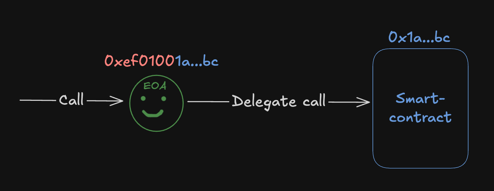

# Гайд по созданию кошелька для использования в EIP-7702

**Автор:** [Павел Найданов](https://github.com/PavelNaydanov) 🕵️‍♂️

[EIP-7702: Set Code for EOAs](https://eips.ethereum.org/EIPS/eip-7702) - это стандарт, который предлагает добавить **новый тип** транзакции, который позволяет прикрепить код смарт-контракта к Externally Owned Accounts (EOAs).

В этом гайде мы реализуем смарт-контракт [Wallet.sol](./contracts/src/Wallet.sol), который можно использовать для прикрепления к EOA аккаунту.

Смарт-контракт `Wallet.sol` должен удовлетворять следующим требованиям:
- поддерживать батч операции (например апрув + вызов другого смарт-контракта в одной транзакции)
- возможность управлять любыми активами, хранящимися на EOA
- взаимодействовать с другими смарт-контрактами
- поддерживать безгазовые операции. То есть операцию может выполнить третье доверенное лицо

>_Важно!_ Смарт-контракт **Wallet** реализован для образовательных целей и не предназначен для использования в проде.

## Как работает EIP-7702?

Традиционно, в Ethereum блокчейне существует два типа аккаунтов:
- **EOA** (Externally Owned Accounts). Может инициировать транзакции, но не хранит код.
- **Смарт-контракт**. Хранит код, как набор инструкций, но не может быть инициатором транзакции.

Оба типа аккаунта имеют собственный адрес в сети.

Согласно EIP-7702, новый тип транзакции, отправленный в блокчейн, прикрепит смарт-контракт к EOA.

После прикрепления смарт-контракта, EOA меняет свое поведение. Любые вызовы к EOA будут делегироваться для выполнения на прикрепленном смарт-контракте. Таким образом, EOA получает поведение очень похожее на аккаунт, который является смарт-контрактом.



Технически, у сущности EOA обновляется поле **code** в блокчейне. В него записывается адрес прикрепляемого смарт-контракта со специальным префиксом (**0xef0100** || address). Префикс - это некоторое магическое значение, которое позволяет определить, что это адрес для делегирования, а не байт-код смарт-контракта.

## Первые шаги для создания Wallet.sol

**Требования**

1. Необходимы базовые знания в области блокчейн разработки.
2. Навыки работы с Solidity (языком написания смарт-контрактов под EVM совместимые блокчейны).
3. Базовые знания про EIP-7702 на уровне концепта.

> Если ранее вы не писали смарт-контракты, то я настоятельно рекомендую попробовать свои силы на более простых примерах, прежде чем пытаться повторить данный гайд.

 Для создания смарт-контракта `Wallet.sol` я буду использую [Foundry](https://getfoundry.sh/). На момент написания гайда [Hardhat](https://hardhat.org/) не поддерживает работу с EIP-7702.

Для начала работы:
1. [Установить Foundry](https://getfoundry.sh/introduction/installation)
2. [Развернуть базовый проект](https://getfoundry.sh/introduction/getting-started)
3. Создать простой смарт-контракт `Wallet.sol`
    ```solidity
    // SPDX-License-Identifier: MIT
    pragma solidity 0.8.30;

    contract Wallet {
      // Здесь будем писать код
      ...
    }
    ```

Теперь мы готовы творить! 😎

## Прикрепление кода к EOA для тестирования

Уже на этом этапе мы можем прикрепить смарт-контракт `Wallet.sol` к EOA и все вызовы к EOA будут выполняться на EOA.

Мы сделаем это в тестах. Тесты в Foundry пишутся на solidity, а для симуляции прикрепления к EOA используются специальные чит-коды.

```solidity
function signDelegation(address implementation, uint256 privateKey)
    external
    returns (SignedDelegation memory signedDelegation);

function attachDelegation(SignedDelegation calldata signedDelegation) external;

function signAndAttachDelegation(address implementation, uint256 privateKey)
    external
    returns (SignedDelegation memory signedDelegation);
```

Для того, чтобы EIP-7702 работал, необходимо убедиться, что код компилируется для evm версии не ниже **"prague"**. Это может быть определено в `foundry.toml`. Это необходимо, так как EIP-7702 появился c обновлением Pectra (prague + electra).

```solidity
// foundry.toml
evm_version = "prague"
```

Таким образом, самый простой пример теста, который прикрепит код к EOA будет выглядеть следующим образом:

```solidity
function test_attachCode() external {
    // Проверяем наличие кода у EOA user (user создан через чит-код vm.addr)
    console.logBytes(user.addr.code); // 0x

    // Симулируем подписание транзакции на прикрепление кода пользователем
    Vm.SignedDelegation memory signedDelegation = vm.signDelegation(address(delegation), user.key);

    vm.startBroadcast(operator.key);

    // Отправляем транзакцию на прикрепление кода к user. Обратить внимание, что это делает operator, а не user. Оператор создан через встроенную функцию makeAccount()
    vm.attachDelegation(signedDelegation);

    vm.stopBroadcast();

    console.logBytes(user.addr.code); //0xef0100...
}
```

Больше подробностей про тестирование можно найти в [официальной документации](https://getfoundry.sh/reference/cheatcodes/sign-delegation#signdelegation) Foundry.


## Поддержка получения различных активов смарт-контрактом Wallet

EOA меняет свое поведение после того, как прикрепляет к себе смарт-контракт. Теперь при отправке на адрес EOA любого актива он будет вести себя, как смарт-контракт.

Соответственно для того, чтобы уметь принимать нативную валюту на смарт-контракте необходимо реализовать функцию `receive()`, которая позволит принимать EOA условный эфир.

```solidity
contract Wallet {
    receive() external payable {}
}
```

Аналогичная история, для токенов ERC-721 и ERC-1155, которые требуют реализацию *callback функций* на смарт-контрактах для получения токена.

```solidity
function onERC721Received(address, address, uint256, bytes memory) public virtual returns (bytes4) {
    return this.onERC721Received.selector;
}

function onERC1155Received(
    address,
    address,
    uint256,
    uint256,
    bytes memory
) public virtual override returns (bytes4) {
    return this.onERC1155Received.selector;
}
```

Для этого мы установим библиотеку OpenZeppelin и наследуем Wallet от двух смарт-контрактов: [ERC1155Holder](https://github.com/OpenZeppelin/openzeppelin-contracts/blob/master/contracts/token/ERC1155/utils/ERC1155Holder.sol) и [ERC721Holder.sol](https://github.com/OpenZeppelin/openzeppelin-contracts/blob/master/contracts/token/ERC721/utils/ERC721Holder.sol)

Выполни команду: `forge install https://github.com/OpenZeppelin/openzeppelin-contracts` для установки OpenZeppelin, затем настрой *remappings* и обнови код смарт-контракта `Wallet.sol` следующим образом.

```solidity
import {ERC1155Holder} from "@openzeppelin/contracts/token/ERC1155/utils/ERC1155Holder.sol";
import {ERC721Holder} from "@openzeppelin/contracts/token/ERC721/utils/ERC721Holder.sol";

contract Wallet is ERC1155Holder, ERC721Holder {
    receive() external payable {}
}
```

Теперь смарт-контракт умеет принимать ERC-721, ERC-1155 и нативную валюту. Реализуй тесты для того, чтобы это проверить. У тебя есть все знания для этого. В качестве эксперимента можешь добавить поддержку [ERC-777](https://eips.ethereum.org/EIPS/eip-777) токена.

Пример моих тестов находится в файле [Wallet.t.sol](./contracts/test/wallet/Wallet.t.sol).

## Выполнение batch операций

Это типовая задача и многие провайдеры Abstract Account уже решали это для своих смарт-контрактов. Поэтому здесь можно ориентироваться на смарт-контракты из [delegation framework](https://github.com/MetaMask/delegation-framework/blob/main/src/EIP7702/EIP7702DeleGatorCore.sol) от Metamask или [референсной имплементации](https://github.com/erc7579/erc7579-implementation/tree/main) стандарта [ERC-7579: Minimal Modular Smart Accounts](https://eips.ethereum.org/EIPS/eip-7579).

ERC-7579 был разработан, как альтернативный, для имплементации [ERC-6900](https://eips.ethereum.org/EIPS/eip-6900) от Alchemy целым рядом компаний OKX, Biconomy, ZeroDev и Rhinestone и другими.

В истории развития абстракции можно утонуть, но здесь ключевое то, что для батч операции все эти ребята используют другой стандарт под названием [ERC-7821: Minimal Batch Executor Interface](https://eips.ethereum.org/EIPS/eip-7821).

Стандарт предлагает реализовать функции `execute()`:

```solidity
function execute(bytes32 mode, bytes calldata executionData)
    external
    payable;
```

Имплементация ERC-7579 реализует параметры функции `execute()` в библиотеке [ModeLib.sol](https://github.com/erc7579/erc7579-implementation/blob/main/src/lib/ModeLib.sol). Мы тоже будем ее использовать, чтобы не изобретать велосипед.

**Параметры функции `execute()`**

`bytes32 mode` описывает следующие параметры операции:
| CALLTYPE  | EXECTYPE  |   UNUSED   | ModeSelector  |  ModePayload  |
|-----------|-----------|------------|---------------|---------------|
| 1 byte    | 1 byte    |   4 bytes  | 4 bytes       |   22 bytes    |

- **CALLTYPE** определяет тип вызова: single, batch static или delegatecall
- **EXECTYPE** определяет поведение при выполнение. По дефолту транзакция ревертнется, если в данных вызова произойдет revert. Также есть режим try, который позволит обернуть вызов в конструкцию `try/catch`. Это означает, что в случае реверта внутри вызова транзакция останется успешной.
- **UNUSED** зарезервированные байты на будущее.
- **ModeSelector** опциональный и определяет особенное поведение аккаунта
- **ModePayload** содержит данные необходимые для выполнения `executionData`.

`executionData` - это набор байт, в которых закодирован вызов к адресу согласно структуре:

```solidity
struct Call {
    address to;
    uint256 value;
    bytes data;
}
```

В зависимости от CALLTYPE в `executionData` может быть закодирован набор операций или одна операция.

**Добавляем функцию `execute()` на `Wallet.sol`**

Теперь пришло время добавить функцию `execute()` на смарт-контракт Wallet.sol.

```solidity
import {ModeLib} from "@erc7579/lib/ModeLib.sol";

contract Wallet is ERC1155Holder, ERC721Holder {
    using ModeLib for ModeCode;

    /**
     * @notice Выполнение операции на аккаунте
     * @param mode Режим выполнения закодированных данных
     * @param executionCalldata Закодированные данные для выполнения
     */
    function execute(ModeCode mode, bytes calldata executionCalldata) external payable {
        _execute(mode, executionCalldata);
    }
}
```

Основная логика выполнения будет реализована в приватной функции `_execute()`.

По сути, мы могли бы реализовать здесь низкоуровневый вызов **call** данных, и придумать свою логику того, как мы будем выполнять батч операции.

Но мы выполним это согласно аналогично ERC-7579:

```solidity
import {
    CallType,
    ExecType,
    ModeLib,
    ModeCode,
    CALLTYPE_BATCH,
    EXECTYPE_DEFAULT,
    EXECTYPE_TRY,
    CALLTYPE_SINGLE
} from "@erc7579/lib/ModeLib.sol";

contract Wallet is ERC1155Holder, ERC721Holder {
    using ModeLib for ModeCode;

    error UnsupportedCallType(CallType callType);
    error UnsupportedExecType(ExecType execType);
    event Executed(address indexed sender, ModeCode indexed mode, bytes executionCalldata);
    event TryExecuteUnsuccessful(uint256 batchExecutionindex, bytes result);

    /**
     * @notice Выполнение операции на аккаунте
     * @param mode Режим выполнения закодированных данных
     * @param executionCalldata Закодированные данные для выполнения
     */
    function execute(ModeCode mode, bytes calldata executionCalldata) external payable {
        _execute(mode, executionCalldata);
    }

    // Активно используем библиотеку ModeLib
    function _execute(ModeCode mode, bytes calldata executionCalldata) private {
        (CallType callType, ExecType execType,,) = mode.decode();

        // Если закодирован батч операций
        if (callType == CALLTYPE_BATCH) {
            Execution[] calldata executions_ = executionCalldata.decodeBatch();
            if (execType == EXECTYPE_DEFAULT) {
                _execute(executions_);
            } else if (execType == EXECTYPE_TRY) {
                _tryExecute(executions_);
            } else {
                revert UnsupportedExecType(execType);
            }
        // Если одна операция
        } else if (callType == CALLTYPE_SINGLE) {
            (address target, uint256 value, bytes calldata callData) = executionCalldata.decodeSingle();
            if (execType == EXECTYPE_DEFAULT) {
                _execute(target, value, callData);
            } else if (execType == EXECTYPE_TRY) {
                bytes[] memory returnData_ = new bytes[](1);
                bool success_;
                (success_, returnData_[0]) = _tryExecute(target, value, callData);
                if (!success_) emit TryExecuteUnsuccessful(0, returnData_[0]);
            } else {
                revert UnsupportedExecType(execType);
            }
        } else {
            revert UnsupportedCallType(callType);
        }

        emit Executed(msg.sender, mode, executionCalldata);
    }
}
```

Функции `_execute(executions_)`, `_tryExecute(executions_)`, `_execute(target, value, callData)`, `_tryExecute(target, value, callData)` мы подсмотрим в имплементации ERC-7579. Ребята их реализуют во вспомогательном смарт-контракте [ExecutionHelper.sol](https://github.com/erc7579/erc7579-implementation/blob/main/src/core/ExecutionHelper.sol).

Все, что нам нужно, это наследоваться от `ExecutionHelper.sol`. Плюс мы используем еще одну их библиотеку [ExecutionLib.sol](https://github.com/erc7579/erc7579-implementation/blob/main/src/lib/ExecutionLib.sol) для декодирования **executionCalldata** параметра.

```solidity
import {ExecutionHelper} from "@erc7579/core/ExecutionHelper.sol";
import {ExecutionLib} from "@erc7579/lib/ExecutionLib.sol";
import {ModeLib} from "@erc7579/lib/ModeLib.sol";

contract Wallet is ExecutionHelper, ERC1155Holder, ERC721Holder {
    using ModeLib for ModeCode;
    using ExecutionLib for bytes;

    function execute(ModeCode mode, bytes calldata executionCalldata) external payable {
        _execute(mode, executionCalldata);
    }

    function _execute(ModeCode mode, bytes calldata executionCalldata) private {
        ...
    }
}
```

На этом этапе у нас есть возможность выполнять батч операции и обычные операции. Стоит пояснить, что под операцией можно понимать: управление активами (трансфер токена), которые хранятся на EOA, или вызовы к другим смарт-контрактам.

Уже сейчас мы можем закодировать апрув + вызов смарт-контракт через `execute()` для их исполнения в рамках одной транзакции.

## Модификатор onlySelf

**Но!** Сейчас есть прямая угроза активам пользователя, который прикрепит себе смарт-контракт `Wallet.sol`. Функция `execute()` публичная и вызвать ее может кто угодно, а соответственно увести активы пользователя.

Добавим модификатор `onlySelf`, который будет проверять, что вызов делает сам EOA.

```solidity
...

contract Wallet is ExecutionHelper, ERC1155Holder, ERC721Holder {
    error OnlySelf();

    ...

    modifier onlySelf() {
        if (msg.sender != address(this)) {
            revert OnlySelf();
        }

        _;
    }

    function execute(ModeCode mode, bytes calldata executionCalldata) external payable onlySelf {
        _execute(mode, executionCalldata);
    }

    ...
}
```

Проверка ```msg.sender != address(this)``` может показаться странной разработчику, который не знаком с EIP-7702. Но именно она позволяет проверить, что вызов делает EOA на самого себя, так как `address(this)` при делегированном вызове будет указывать на аккаунт, к которому он прикреплен. Получается, что `msg.sender` должен быть самим EOA аккаунтом.

## Безгазовое выполнение

В этом разделе мы реализуем функцию `execute()`, которая будет принимать подпись EOA аккаунта, прикрепившего смарт-контракт `Wallet.sol`. Тогда любой у кого будет подпись от EOA сможет выполнять операции на его аккаунте.

> Здесь стоит сделать отступление. На практике безгазовое выполнение на много сложнее. Ведь часто исполняющий транзакцию за пользователя хочет получать компенсацию за свою работу, например, в ERC-20 токене. Поэтому у провайдеров АА сейчас по-прежнему безгазовость реализована через проверенный и испытанный ERC-4337.
>
> Мы же предположим, что у нас абстрактная задача случайного протокола, который делает транзакции за пользователя безвозмездно. При этом без ведома пользователя он ничего не может сделать с его аккаунтом.

Добавим еще `execute()`, как перегрузку в `Wallet.sol`. Функция будет принимать подпись.

```solidity
...

contract Wallet is ExecutionHelper, ERC1155Holder, ERC721Holder {
    struct ExecutionRequest {
      ModeCode mode;
      bytes executionCalldata;
      bytes32 salt;
      uint64 deadline;
    }

    mapping(bytes32 salt => bool isUsed) _isSaltUsed;
    mapping(bytes32 salt => bool isCancelled) _isSaltCancelled;

    ...

    function execute(ExecutionRequest calldata request, bytes calldata signature) external payable {
        WalletValidator.checkRequest(request, signature, _isSaltUsed, _isSaltCancelled);

        _isSaltUsed[request.salt] = true; // отмечаем, что подпись использована для защиты от Replay атаки
        _execute(request.mode, request.executionCalldata);
    }
}
```

В структуру `ExecutionRequest` мы завернули параметры, которые необходимы для выполнения операции пользователя, плюс добавили `salt` (как уникальный идентификатор подписи) и `deadline` (время действия подписи, по истечении которого выполнить ее больше невозможно).

Я намеренно использовал `salt`, а не `nonce`, потому что хотел, чтобы пользователь мог выдавать несколько подписей одновременно и при использование одной из них, другие тоже были валидны.

В идеале, можно было бы использовать дополнительный hash структуры `ExecutionRequest` для идентификации подписи, но в рамках образовательного смарт-контракта это излишне.

Вся магия заключается в проверке подписи, которая вынесена в отдельную библиотеку [WalletValidator.sol](./contracts/src/libraries/WalletValidator.sol) и может быть реализована на ваш вкус.

Мой вариант концептуально выглядит следующим образом:
```solidity
// SPDX-License-Identifier: MIT
pragma solidity 0.8.30;

import {ECDSA} from "@openzeppelin/contracts/utils/cryptography/ECDSA.sol";
import {ModeCode} from "@erc7579/lib/ModeLib.sol";

struct ExecutionRequest {
    ModeCode mode;
    bytes executionCalldata;
    bytes32 salt;
    uint64 deadline;
}

library WalletValidator {
    bytes32 public constant WALLET_OPERATION_TYPEHASH = keccak256(
        abi.encodePacked(
            "WalletSignature(bytes32 mode,bytes executionCalldata,bytes32 salt,uint64 deadline,address sender)"
        )
    );

    // Точка входа
    function checkRequest(
        ExecutionRequest memory request,
        bytes calldata signature,
        mapping(bytes32 salt => bool isUsed) storage isSaltUsed
    ) internal view {
        // Проверяем, что подпись не устарела
        if (block.timestamp > request.deadline) {
            revert RequestExpired();
        }

        // Проверяем, что подпись не использовалась
        if (isSaltUsed[request.salt]) {
            revert SaltAlreadyUsed();
        }

        // Проверяем, что подпись дана владельцем EOA
        bool isValid = _isValidSignature(request, signature);
        if (!isValid) {
            revert InvalidSignature();
        }
    }

    function _isValidSignature(ExecutionRequest memory request, bytes calldata signature) private view returns (bool) {
        bytes32 digest = keccak256(abi.encodePacked("\x19\x01", _domainSeparator(), _getDigest(request)));
        return ECDSA.recover(digest, signature) == address(this);
    }

    function _domainSeparator() private view returns (bytes32) {
        uint256 chainId;

        assembly {
            chainId := chainid()
        }

        return keccak256(
            abi.encode(
                keccak256("EIP712Domain(string name,string version,uint256 chainId,address verifyingContract)"),
                keccak256("Wallet"),
                keccak256("1"),
                chainId,
                address(this)
            )
        );
    }

    function _getDigest(ExecutionRequest memory request) private view returns (bytes32) {
        return keccak256(
            abi.encode(
                WALLET_OPERATION_TYPEHASH,
                request.mode,
                keccak256(request.executionCalldata),
                request.salt,
                request.deadline,
                msg.sender
            )
        );
    }
}
```

## Коллизия хранилища

Пока мы не добавили функцию `execute()` для безгазового выполнения мы не использовали хранилище смарт-контракта `Wallet.sol`. Теперь же у нас есть маппинг `_isSaltUsed`.

Однако, нужно знать, что EIP-7702 работает в контексте EOA. Это означает, что прикрепив смарт-контракт для делегирования **мы будем работать со storage самого EOA**.

EOA может, как прикрепить себе смарт-контракт для делегирования вызова, так и открепить. После этого никто не мешает ему прикрепить другой смарт-контракт, но тут может оказаться, что в первом слоте уже есть данные от прошлого смарт-контракта.

Решить проблему с коллизией может помочь другой стандарт под названием [ERC-7201: Namespaced Storage Layout](https://eips.ethereum.org/EIPS/eip-7201). Этот стандарт предлагает особым способом организовать работу с хранилищем любого смарт-контракта, активно применяется в OpenZeppelin и прокси смарт-контрактах.

Для работы с хранилищем я создал отдельный смарт-контракт [StorageHelper.sol](./contracts/src/utils/StorageHelper.sol).

```solidity
abstract contract StorageHelper {
    // Кодируем слот в котором будет находится структура Storage. Все данные будем писать только в эту структуру
    bytes32 private constant _STORAGE_LOCATION = 0xa3c7fb5ee0843e27cf3d06e1a75ae4fe5241c2d945da24d804adf753e5643900;

    // Переносим наш маппинг в эту структуру
    struct Storage {
        mapping(bytes32 salt => bool isUsed) isSaltUsed;
        mapping(bytes32 salt => bool isCancelled) isSaltCancelled;
    }

    // Вспомогательная функция, которая будет предоставлять доступ к нашему хранилищу
    function _getStorage() internal pure virtual returns (Storage storage $) {
        assembly {
            $.slot := _STORAGE_LOCATION
        }
    }
}
```

Таким образом, наш смарт-контракт `Wallet.sol` наследуется от `StorageHelper` и видоизменяется в работе со storage.

```solidity
import {StorageHelper} from "./utils/StorageHelper.sol";
...

contract Wallet is ExecutionHelper, StorageHelper, ERC1155Holder, ERC721Holder {
    ...

    function execute(ExecutionRequest calldata request, bytes calldata signature) external payable {
        Storage storage $ = _getStorage();
        WalletValidator.checkRequest(request, signature, $.isSaltUsed, $.isSaltCancelled);

        $.isSaltUsed[request.salt] = true;
        _execute(request.mode, request.executionCalldata);
    }
}
```

Синтаксис с долларом я позаимствовал у OpenZeppelin.

## Практика

Думаю ты заметил, что у пользователя нет возможности "передумать" после того, как он выдал подпись третьему лицу. В нынешней реализации только `deadline` спасет пользователя: подпись устареет и операцию будет невозможно выполнить.

Однако этого недостаточно. Поэтому подумай и реализуй функцию `cancelSignature()` самостоятельно или найди ее в референсной реализации. Эта функция должна вызываться только EOA и никем другим.

_Подсказка!_ Функция `cancelSignature()` должна принимать `salt` ордера и записывать его в отдельный mapping. При валидации подписи нужно проверять, что подпись не отменена.

## ERC-165 и ERC-1271

Так как с нашим смарт-контрактом `Wallet.sol` скорее всего подразумевается, что будут взаимодействовать различные протоколы, необходимо подсветить для них интерфейсы, которые мы поддерживаем. Для этого используем [ERC-165: Standard Interface Detection](https://eips.ethereum.org/EIPS/eip-165).

Для того, чтобы другие протоколы могли проверить валидна ли подпись и действительно ли ее дал наш EOA с прикрепленным кодом `Wallet.sol` поддержим стандарт [ERC-1271: Standard Signature Validation Method for Contracts](https://eips.ethereum.org/EIPS/eip-1271).


```solidity
import {IERC165} from "@openzeppelin/contracts/utils/introspection/IERC165.sol";
import {IERC1271} from "@openzeppelin/contracts/interfaces/IERC1271.sol";
...

contract Wallet is IERC165, IERC1271, ExecutionHelper, StorageHelper, ERC1155Holder, ERC721Holder {
    ...

    // Описываем все интерфейсы, которые предоставляет смарт-контракт
    function supportsInterface(bytes4 interfaceId) public pure override(IERC165, ERC1155Holder) returns (bool) {
        return interfaceId == type(IERC721Receiver).interfaceId
            || interfaceId == type(IERC1155Receiver).interfaceId || interfaceId == type(IERC165).interfaceId
            || interfaceId == type(IERC1271).interfaceId || interfaceId == type(IERC7821).interfaceId;
    }

    // Позволяет проверить, действительно ли подпись выдана нашим EOA
    function isValidSignature(bytes32 hash, bytes calldata signature)
        public
        view
        override(IWallet, IERC1271)
        returns (bytes4 magicValue)
    {
        bool isValid = WalletValidator.isValidERC1271Signature(hash, signature);
        if (isValid) {
            return IERC1271.isValidSignature.selector;
        }
        return 0xffffffff;
    }
}
```

Нужно понимать, что если Wallet обновляется, то в функцию `supportsInterface()` должны быть добавлены новые интерфейсы.

## Вывод

> Еще раз хочу подчеркнуть, что `Wallet.sol` не production-ready, а образовательный пример. Код не проходил аудит.

Ну вот и все! Мы реализовали минимально рабочий пример смарт-контракта `Wallet.sol`, который может быть использован для прикрепления к EOA, согласно EIP-7702. Самое главное, что смарт-контракт полезен для батч операций и использует передовые практики. Добавить новую логику, например, что-то для социального восстановления, псевдомультисига и так далее, не составляет труда.

Полный пример смарт-контракта [Wallet.sol](./contracts/src/Wallet.sol).
Полный набор тестов [Wallet.t.sol](./contracts/test/wallet/Wallet.t.sol).

Сопутствующие смарт-контракты можно найти рядом в папке [/contracts](./contracts/). Ну а создать проект на Foundry придется самостоятельно. Дорогу осилит идущий!

## Links

1. [EIP-7702: Set Code for EOAs](https://eips.ethereum.org/EIPS/eip-7702)
2. [ERC-7579: Minimal Modular Smart Accounts](https://eips.ethereum.org/EIPS/eip-7579)
3. [ERC-7821: Minimal Batch Executor Interface](https://eips.ethereum.org/EIPS/eip-7821)
4. [ERC-7201: Namespaced Storage Layout](https://eips.ethereum.org/EIPS/eip-7201)
5. [EIP7702DeleGatorCore](https://github.com/MetaMask/delegation-framework/blob/main/src/EIP7702/EIP7702DeleGatorCore.sol) у MetaMask
6. EIP-7702. [Гайд](https://getfoundry.sh/reference/cheatcodes/sign-delegation#signdelegation) по тестированию в Foundry