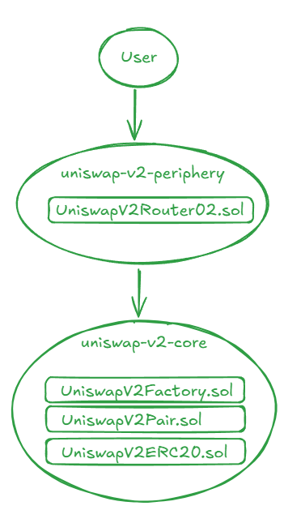
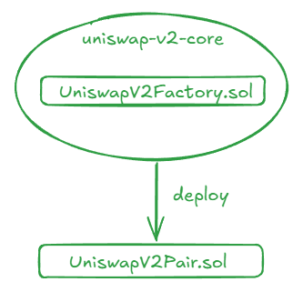
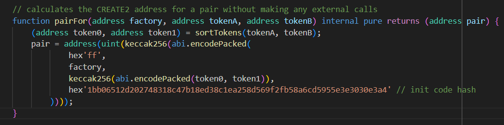
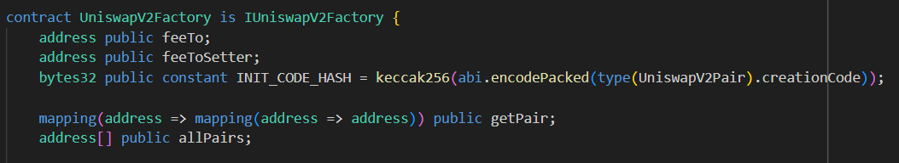
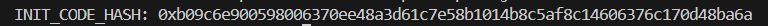
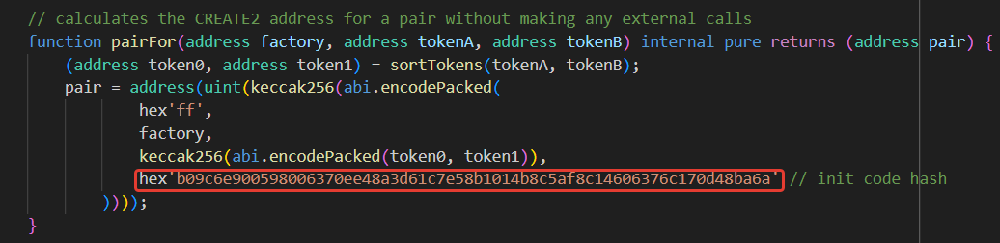

# Uniswap-v2 smart contracts fork

**Автор:** [Алексей Куценко](https://github.com/bimkon144) 👨‍💻

В этом гайде мы покажем, как мы смогли быстро и просто форкнуть Uniswap V2.

## Базовые знания

Есть два основных репозитория:

- [uniswap-v2-core](https://github.com/Uniswap/v2-core).
- [uniswap-v2-periphery](https://github.com/Uniswap/v2-periphery).

### uniswap-v2-core

Репозиторий uniswap-v2-core содержит ключевые смарт-контракты: `UniswapV2ERC20.sol`, `UniswapV2Factory.sol`, `UniswapV2Pair.sol`, которые реализуют основной функционал протокола Uniswap V2. Эти смарт-контракты обеспечивают децентрализованный обмен токенами.

Необходимо задеплоить:

- `UniswapV2Factory.sol`. Отвечает за создание и управление парами обмена (пулов ликвидности). Смарт-контракт фабрики также отслеживает все существующие пары и их адреса. Когда создается новая пара токенов, фабрика разворачивает новый смарт-контракт `UniswapV2Pair.sol`, который представляет собой пул ликвидности для этой пары.
Смарт-контракт `UniswapV2Factory.sol` в свою очередь импортирует `UniswapV2Pair.sol`, который наследуется от `UniswapV2ERC20.sol`.

### uniswap-v2-periphery

Репозиторий uniswap-v2-periphery содержит вспомогательные смарт-контракты: `UniswapV2Migrator.sol`, `UniswapV2Router01.sol`, `UniswapV2Router02.sol` и библиотеки: `SafeMath.sol`, `UniswapV2Library.sol`,`UniswapV2LiquidityMathLibrary.sol`, `UniswapV2OracleLibrary.sol`. Они взаимодействуют с основными смарт-контрактами из uniswap-v2-core. Эти смарт-контракты облегчают взаимодействие с протоколом для пользователей и разработчиков.

Необходимо задеплоить:

- `UniswapV2Router02.sol`. Предоставляет высокоуровневый интерфейс для взаимодействия с парами и пулами Uniswap. Основной функционал включает функции для свопа токенов, добавления и удаления ликвидности. Включает в себя необходимые библиотеки для работы протокола.

Таким образом обращение пользователя к смарт-контракту `UniswapV2Router02.sol` можно представить в виде схемы:




А создание нового смарт-контракта пары выглядит так:




Для решение нашей задачи потребуется три основных шага - подготовка кодовой базы, настройка смарт-конрактов и деплой смарт-контрактов.

## Подготовка кодовой базы

_Убедитесь что [Foundry](https://book.getfoundry.sh/getting-started/installation) установлен, проверить можно через  `forge --version`._

На данном этапе мы инициализируем наш проект и клонируем репозитории смарт-контрактов uniswap-v2.

1) Инициализируем проект: `forge init UNISWAP-V2-FORK-SC && cd ./UNISWAP-V2-FORK-SC`
2) Добавим v2-core и v2-periphery смарт-контракты: `git submodule add https://github.com/Uniswap/v2-core.git contracts/v2-core` и `git submodule add https://github.com/Uniswap/v2-periphery.git contracts/v2-periphery`
3) Добавим библиотеку `uniswap-lib`, которая используется в `v2-periphery` смарт-контрактах: `git submodule add https://github.com/Uniswap/uniswap-lib lib/uniswap-lib` и необходимую для работы скриптов/тестов foundry библиотеку `git submodule add https://github.com/foundry-rs/forge-std  lib/forge-std`
4) Поменяем путь к исходному коду в нашем файле `foundry.toml`:

  ```toml
  //foundry.toml
  [profile.default]
  src = "contracts"
  out = "out"
  libs = ["lib"]
  optimizer = true
  optimizer_runs = 999999
  ```

5) Добавим файл в корневой каталог:

```text
//remappings.txt
@uniswap/lib/=lib/uniswap-lib/
@uniswap/v2-core/=contracts/v2-core/
@uniswap/v2-periphery/=contracts/v2-periphery/
forge-std/=lib/forge-std/src/
```

## Настройка смарт-контрактов

Uniswap для работы смарт-контракта `UniswapV2Router02` использует метод `pairFor` на смарт-контракте - библиотеке [UniswapV2Library.sol](https://github.com/Uniswap/v2-periphery/blob/master/contracts/libraries/UniswapV2Library.sol).


С помощью данного метода адрес смарт-контракта пары вычисляется исходя из:

- `hex'ff'`
- адреса смарт-контракта `Factory.sol`
- адреса токенов erc-20 в пуле
- `init code hash`.

Таким образом uniswap не использует никаких внешних вызовов для получения адреса пары.

Что такое `init code hash` и где нам его найти?

`init code hash` представляет из себя keccak256 от байткода отвечающего за создание смарт-контракта UniswapV2Pair.sol.

Таким образом мы можем пойти по нескольким вариантам его получения:

a) Через добавление кода в смарт-контракт:

Добавим в смарт-контракт `Factory.sol` строку `bytes32 public constant INIT_CODE_HASH = keccak256(abi.encodePacked(type(UniswapV2Pair).creationCode));`

После деплоя смарт-контракта `Factory.sol` мы смогли бы получить `init code hash` через метод `INIT_CODE_HASH`.

b) Через js скрипт:

```solidity
const { ethers } = require('ethers');
const fs = require('fs');
const path = require('path');

const jsonFilePath = path.resolve(__dirname, '../out/UniswapV2Pair.sol/UniswapV2Pair.json');

async function computeInitCodeHash() {
  try {
    // Чтение ABI JSON файла
    const contractJson = JSON.parse(fs.readFileSync(jsonFilePath, 'utf8'));
    
    // Проверка наличия байткода в ABI JSON файле
    if (!contractJson.bytecode.object) {
      throw new Error('Байткод не найден в ABI JSON файле.');
    }

    // Вычисление INIT_CODE_HASH с использованием байткода смарт-контракта
    const computedInitCodeHash = ethers.keccak256(contractJson.bytecode.object);
    
    console.log('INIT_CODE_HASH:', computedInitCodeHash);
    return computedInitCodeHash;
  } catch (error) {
    console.error('Ошибка при вычислении INIT_CODE_HASH:', error);
  }
}

computeInitCodeHash();
```

Чтобы не добавлять код в смарт-контракт и не изменять изначальные смарт-контракты от uniswap, пойдем по пути получения хеша через javascript.

Как вы можете заметить, для расчета используется `ethers` библиотека, которую можно установить через `npm install --save ethers`

Далее, для получения байткода смарт-контракта нам нужно вызывать `forge build`

И наконец вызывать скрипт расчета `node ./script/compute.js`

Результат будет выведен в таком виде:


Полученный хеш нужно вставить в файл библиотеки uniswap -  `UniswapV2Library.sol` без `0x`.


## Деплой смарт-контрактов

Переходим к непосредственному деплою смарт-контрактов.

1) Смарт-контракт Factory. Основной функционал - это создание пар токенов.

```bash
forge create src/v2-core/UniswapV2Factory.sol:UniswapV2Factory --rpc-url https://polygonzkevm-mainnet.g.alchemy.com/v2/demo --private-key putYourPrivatekeyHere --constructor-args "putFeeToSetterAddressHere" --verify  --etherscan-api-key ACCESS_KEY 
```

`https://polygonzkevm-mainnet.g.alchemy.com/v2/demo` - RPC сеть куда будем деплоить.

`putYourPrivatekeyHere` - Приватный ключ с которого будет деплой.

`putFeeToSetterAddressHere` - Адрес который сможет устанавливать комиссию протокола.

`ACCESS_KEY` - API key для верификации смарт-контракта. Можно получить [тут](https://zkevm.polygonscan.com/). Для этого необходимо зарегистрироваться и создать API key.

_При деплое может появится ошибка если блокчейн не поддерживает EIP-1559. Для этого необходимо добавить флаг `--legacy`._

_Если у вы Windows пользователь, у вас может быть ошибка - "Failed to create wallet from private key. Private key is invalid hex: Odd number of digits". Для решения этой проблемы нужно удалить  \r symbol с private key. Для этого можете вызывать команду `PRIVATE_KEY=$(echo $PRIVATE_KEY | tr -d '\r')`_

2) Смарт-контракт `UniswapV2Router02`. Отвечает за удаление и добавление ликвидности в пулы, свапы токенов.

```bash
forge create src/v2-periphery/UniswapV2Router02.sol:UniswapV2Router02 --rpc-url https://polygonzkevm-mainnet.g.alchemy.com/v2/demo --private-key putYourPrivatekeyHere --constructor-args "factoryAddressPutHere" "WETHAddressPutHere" --verify  --etherscan-api-key ACCESS_KEY 
```

`https://polygonzkevm-mainnet.g.alchemy.com/v2/demo` - RPC сеть куда будем деплоить.

`putYourPrivatekeyHere` - Приватный ключ с которого будет деплой.

`factoryAddressPutHere` - Адрес смарт-контракта Factory.

`WETHAddressPutHere` - Адрес Wrapped Ether (WETH).

`ACCESS_KEY` - API key для верификации смарт-контракта.

Для тестнета, мы задеплоили код оригинального [WETH](https://etherscan.io/token/0xc02aaa39b223fe8d0a0e5c4f27ead9083c756cc2#code) смарт-контракта.

3) Смарт-контракт [multicall](https://github.com/mds1/multicall/blob/main/src/Multicall.sol).

Смарт-контракт предназначен для:

- Агрегирования результатов чтения с нескольких смарт-контрактов в один запрос JSON-RPC.
- Выполнение нескольких вызовов изменения состояния блокчейна в одной транзакции.
  
Более детально можно почитать [тут](https://github.com/mds1/multicall).

Хотя данный смарт-контракт не входит в группу смарт-контрактов необходимых для его работы, он все же потребуется для подключения frontend части.

На момент написания гайда, данный смарт-контракт уже [задеплоен](https://zkevm.polygonscan.com/address/0xca11bde05977b3631167028862be2a173976ca11) в сеть Polygon zkEVM testnet. Посмотреть полный перечень перечень сетей куда уже задеплоен смарт-контракт можно [тут](https://www.multicall3.com/deployments).

## Заключение

Форк и деплой Uniswap V2 смарт-контрактов может показаться сложной задачей, но с правильными инструментами и подходом это становится гораздо более доступным. В этом гайде мы рассмотрели шаги, необходимые для клонирования исходного кода, настройки и деплоя смарт-контрактов, а также рассмотрели способы вычисления init code hash без изменения оригинальных смарт-контрактов.

Использование библиотек и инструментов, таких как Foundry и ethers.js, значительно упрощает процесс разработки и деплоя смарт-контрактов, позволяя сосредоточиться на ключевых аспектах интеграции и кастомизации.

Данный гайд показывает, что с пониманием базовых концепций и доступными инструментами, разработчики могут эффективно форкать и адаптировать популярные протоколы для своих нужд. Эти знания открывают путь к созданию новых проектов и продуктов на основе проверенных временем решений, таких как Uniswap V2.

## Ссылки:

- [Обзор работы Uniswap V2](https://docs.uniswap.org/contracts/V2/concepts/protocol-overview/how-uniswap-works)
- [Uniswap V2 Book](https://www.rareskills.io/uniswap-v2-book)
- [Смарт-контракты Uniswap V2](https://docs.uniswap.org/contracts/v2/overview)
- [Документация Foundry](https://book.getfoundry.sh/getting-started/installation)
- [Github - Uniswap V2 Core](https://github.com/Uniswap/v2-core)
- [Github - Uniswap V2 Periphery](https://github.com/Uniswap/v2-periphery)
- [Github - Uniswap Lib](https://github.com/Uniswap/uniswap-lib)
- [Multicall смарт-контракт](https://github.com/mds1/multicall/blob/main/src/Multicall.sol)
- [API ключи для Polygon zkEVM](https://zkevm.polygonscan.com/)
- [Адрес Multicall смарт-контракта в Polygon zkEVM](https://zkevm.polygonscan.com/address/0xca11bde05977b3631167028862be2a173976ca11)
