# Uniswap v3/v4: как считать human-readable цену по tick и sqrtPriceX96

**Автор:** [Павел Найданов](https://github.com/PavelNaydanov) 🕵️‍♂️

## Теория

> Если не знаком с концепцией концентрированной ликвидности Uniswap v3, то необходимо сначала ознакомиться с ней. Найти информацию можно в нашем репозитории или в официальной документации.

**Tick** — это удобная дискретная форма цены. В Uniswap v3 весь ценовой диапазон разбит на равномерные участки, где `tick` — это точка, которая представляет определённую стоимость одного токена относительно другого.

**sqrtPriceX96** — это текущая точная цена в фиксированной точке. По сути, это квадратный корень из цены в нотации Q64.96.

Согласно нотации `sqrtPriceX96` хранится в `uint160`. `X96` означает то, что значение умножено на `2^96` (96 битов для отображения дробной части числа). Оставшиеся ≈64 бита — это резерв под целую часть числа (для отображения целой части небольших чисел может использоваться меньше бит).

Это необходимо, потому что Solidity не поддерживает числа с плавающей точкой, а любое целочисленное деление округляется вниз.

Получить число в q-нотации из десятичной системы счисления можно следующим образом.
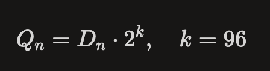

_Дополнительно!_ Для того, чтобы получить human-readable цену на базе `tick` и `sqrtPriceX96`, всегда нужны `decimals` токенов и направление токенов в паре.

## Где получить значения tick, sqrtPriceX96, decimals?

В третьей версии протокола все необходимые значения можно получить из смарт-контракта пула.

Находим адрес пула. Это можно сделать в [интерфейсе](https://app.uniswap.org/explore/pools/ethereum/0x4e68Ccd3E89f51C3074ca5072bbAC773960dFa36) Uniswap.

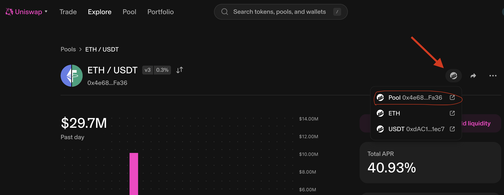

Открываем контракт в обозревателе блоков и вызываем `slot0()` функцию.

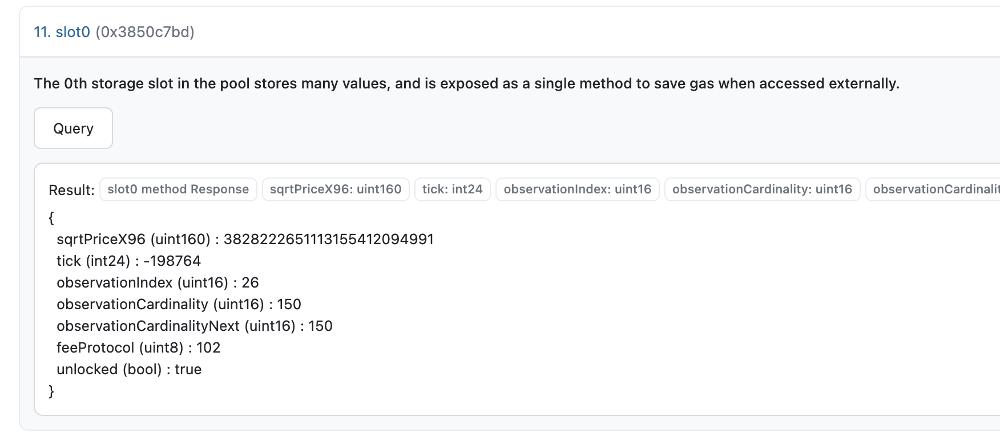

Также нам понадобится определить, кто в пуле обозначен как `token0`, а кто как `token1`. Для этого необходимо вызвать соответствующие функции на контракте пула.

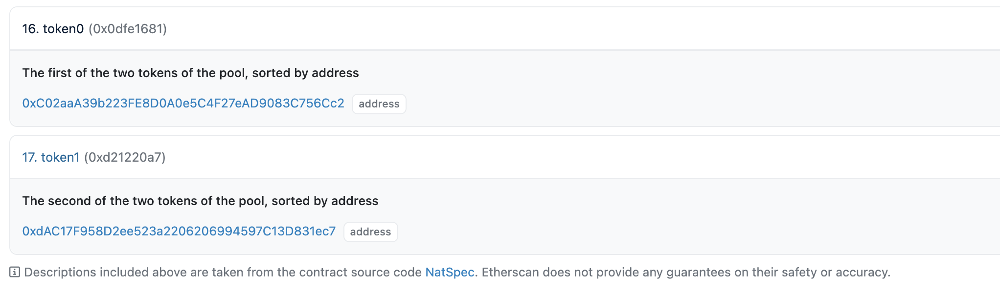

Открыв эти адреса в скане, мы увидим, что в нашем случае:

- token0: WETH (Decimals: 18)
- token1: USDT (Decimals: 6)

Теперь у нас есть вся необходимая информация для получения **human-readable цены**.

## Расчет цены по tick

В Uniswap v3 `tick` связан с ценой формулой:

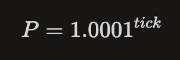

Цена в формуле — это `token1 / token0` в *raw units*, т.е. сколько необходимо `token1` за 1 `token0`. Например, `token0 = WETH, token1 = USDT` — это значит, что `P` показывает стоимость `1 WETH в USDT.`

**Как получить human-readable цену?**

Если ты хочешь цену `token0` в `token1`, то:

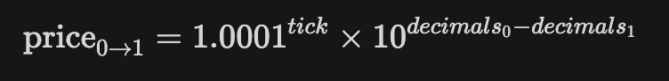

Если нужна обратная цена:

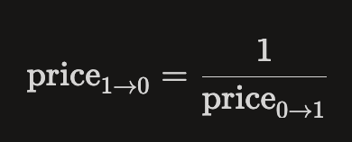

### Пример для пары WETH/USDT

Предположим:

- `token0` = WETH, `decimals` = 18
- `token1` = USDT, `decimals` = 6
- `tick` = −198764

Тогда:


То есть сначала получаешь сырую цену по `tick`, потом умножаешь на `10^12`, чтобы учесть `decimals` токенов.


## Расчет цены по sqrtPriceX96

В Uniswap v3 `sqrtPriceX96` связан с ценой так:

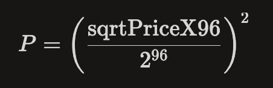

_Важно!_ Это снова *raw price*, то есть без учета `decimals`.

Мы делим на `2^96`, чтобы перейти от q-нотации к десятичной системе счисления, и возводим в квадрат, чтобы получить цену из значения квадратного корня.

Если ты хочешь цену `token0` в `token1`, используй:

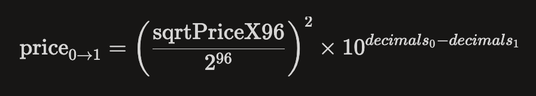

А обратная цена:


### Пример для пары WETH/USDT

Предположим:

- `token0` = WETH, `decimals` = 18
- `token1` = USDT, `decimals` = 6
- `sqrtPriceX96` = 3828222651113155412094991

Тогда цену с `decimals` можно рассчитать следующим образом:


Тогда обратную цену высчитать можно следующим образом:

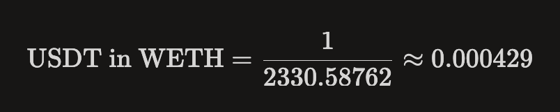

**Итого:**
> 1 WETH ≈ 2330 USDT
> 1 USDT ≈ 0.000429 WETH

## Короткая памятка

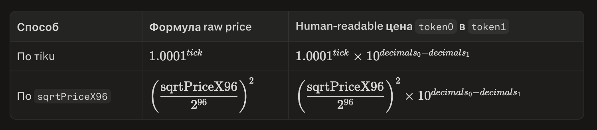

## Расчет цены в v4

В v4 нет отдельных смарт-контрактов пулов — всё в *singleton* `PoolManager.sol`, где `poolId = keccak256(abi.encode(PoolKey))`.

Получить `poolId` можно в интерфейсе Uniswap. Например, для пары [ETH/USDT](https://app.uniswap.org/explore/pools/ethereum/0x72331fcb696b0151904c03584b66dc8365bc63f8a144d89a773384e3a579ca73).

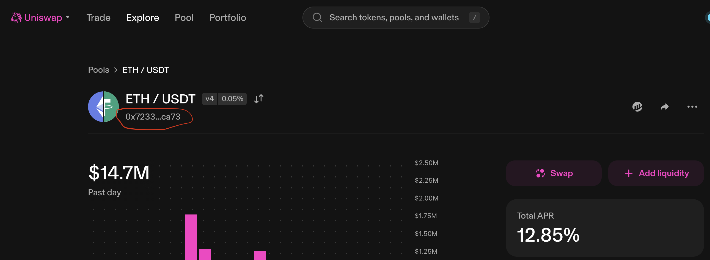

В `PoolManager` нет публичной функции `slot0()` для получения `tick` и `sqrtPriceX96`. Поэтому нам нужен [StateView](https://github.com/Uniswap/v4-periphery/blob/main/src/lens/StateView.sol) — это периферийный *read-only* смарт-контракт, который предназначен для получения различной информации о состоянии пулов. Искать адрес можно в официальной [документации](https://developers.uniswap.org/docs/protocols/v4/deployments).

Вызвать функцию `getSlot0(poolId)` и получить информацию по `tick` и `sqrtPriceX96`.

Далее выбираем любой из методов, описанных выше для v3, и получаем **human-readable цену**.

**Почему расчет human-readable Uniswap v3 подходит для v4?**

Потому что под капотом математика (концентрированная ликвидность) реализована одинаково.

## Вывод

_Важный нюанс!_ Цена, полученная из `tick`, будет отличаться от цены, полученной по `sqrtPriceX96`.

Цена по `tick` полезна для логики диапазонов — определить, находится ли текущая цена внутри `[tickLower, tickUpper]`.

Это включает в себя:
- Работу с позицией LP: при создании позиции в Uniswap v3 ты задаёшь tickLower и tickUpper.
- Проверку диапазона ликвидности: `tick` показывает, внутри какого ценового диапазона сейчас находится пул.
- Получение цены без высокой точности: `tick` удобен как дискретная и дешёвая в вычислении аппроксимация спотовой цены.
- Алгоритмы, которым нужен шаг цены: `tick` полезен, когда важно не точное значение, а движение по `ticks` с шагом 0.01%.

Цена по `sqrtPriceX96` более точная и соответствует текущему состоянию пула. Лучше подходит там, где важна точность:
- При обменах одного токена на другой.
- При начислении вознаграждений.
- И так далее.

**Итого**

**sqrtPriceX96** — для точного расчёта цены и свапов.
**tick** — для диапазонов, LP-логики, аппроксимации и навигации по ценовым диапазонам.

## Для JS/TS

Очень частая проблема, когда в коде на JS/TS для подсчета цены используется тип `Number`. Это большая ошибка, которая приведет к потере точности: `sqrtPriceX96` — это `uint160`, такие числа в `Number` не помещаются без обрезания значащих цифр.

_Важно!_ Использовать `BigInt`. Но его одного недостаточно — нужно правильно организовать порядок операций, потому что `BigInt` не умеет в дроби и делит с округлением вниз. Главный принцип: **умножай раньше, дели позже**.

### Расчёт по sqrtPriceX96

```ts
const sqrtPriceX96 = 3828222651113155412094991n;
const decimals0 = 18; // WETH (token0)
const decimals1 = 6;  // USDT (token1)

const Q192 = 2n ** 192n;

// 1. Возводим в квадрат в BigInt (остаёмся в целых, точность сохранена)
const numerator = sqrtPriceX96 * sqrtPriceX96;

// 2. Учитываем decimals и добавляем буфер точности PRECISION,
//    который потом "отрежем" при переводе в Number
const PRECISION = 18n;
const scale = 10n ** (BigInt(decimals0 - decimals1) + PRECISION);

// 3. Умножаем раньше, делим позже — иначе BigInt округлит результат до 0
const priceScaled = (numerator * scale) / Q192;

// 4. В Number переводим только финальный результат
const price0in1 = Number(priceScaled) / 10 ** Number(PRECISION);

console.log(price0in1);      // ≈ 2330      (USDT за 1 WETH)
console.log(1 / price0in1);  // ≈ 0.000429  (WETH за 1 USDT)
```

**Почему именно `2^192`, а не `2^96`?** Формула `(sqrtPriceX96 / 2^96)^2` эквивалентна `sqrtPriceX96² / 2^192`. Если сначала поделить на `2^96`, то для типичных цен (когда `sqrtPriceX96 < 2^96`) `BigInt` вернёт `0` — и все последующие шаги тоже обнулятся. Поэтому сначала возводим в квадрат, а делим только в самом конце.

### Расчёт по tick

BigInt здесь не поможет: число 1.0001 нецелое, результат тоже — а `BigInt` работает только с целыми числами. `Number` справляется без потери значимых цифр, потому что финальный результат в разумном диапазоне.

```ts
const tick = -198764;
const rawPrice = Math.pow(1.0001, tick);
const price0in1 = rawPrice * 10 ** (decimals0 - decimals1);
console.log(price0in1); // ≈ 2340
```
