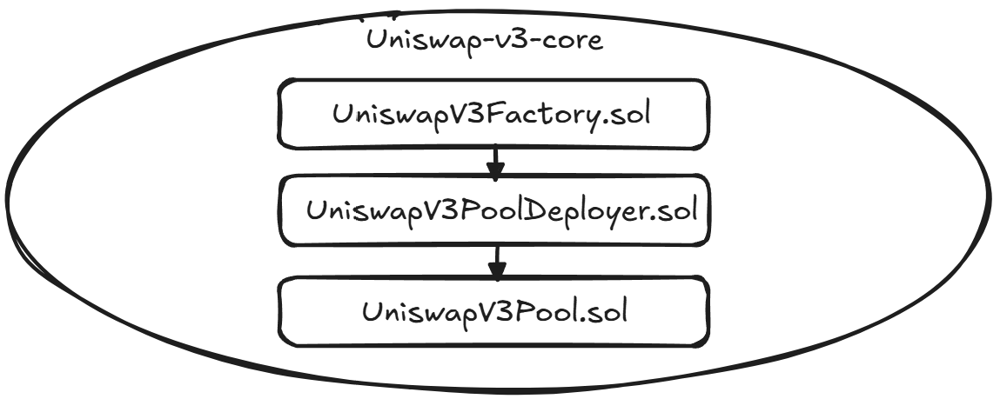

# Uniswap-v3 smart contracts fork

**Автор:** [Алексей Куценко](https://github.com/bimkon144) 👨‍💻

В этом гайде мы покажем, как быстро и просто форкнуть Uniswap V3.

## Базовые знания

Есть два основных репозитория:

- [uniswap-v3-core](https://github.com/Uniswap/v3-core).
- [uniswap-v3-periphery](https://github.com/Uniswap/v3-periphery).

### uniswap-v3-core

Репозиторий uniswap-v3-core содержит ключевые смарт-контракты: `UniswapV3Factory.sol`, `UniswapV3Pool.sol`, `UniswapV3PoolDeployer.sol`, которые реализуют основной функционал протокола Uniswap V3. Эти смарт-контракты реализуют механизм концентрированной ликвидности для обмена токенами.

Схема деплоя нового пула выглядит так:


`UniswapV3Factory.sol` отвечает за создание и управление пулами обмена с различными параметрами комиссий. Смарт-контракт фабрики отслеживает все существующие пулы и их адреса. Когда создается новый пул токенов, фабрика разворачивает новый смарт-контракт `UniswapV3Pool.sol` через вспомогательный контракт `UniswapV3PoolDeployer.sol`.

### uniswap-v3-periphery

Репозиторий uniswap-v3-periphery содержит вспомогательные смарт-контракты: `NonfungiblePositionManager.sol`, `NonfungibleTokenPositionDescriptor.sol`, `SwapRouter.sol`, и библиотеки: `PoolAddress.sol`, `LiquidityAmounts.sol`, и другие. Они взаимодействуют с основными смарт-контрактами из uniswap-v3-core. Эти смарт-контракты облегчают взаимодействие с протоколом для пользователей и разработчиков.

Необходимо задеплоить:

- `SwapRouter.sol`. Предоставляет интерфейс для обмена токенов через пулы Uniswap V3.
- `NonfungiblePositionManager.sol`. Управляет позициями ликвидности в виде NFT токенов.
- `NonfungibleTokenPositionDescriptor.sol`. Предоставляет метаданные для NFT токенов позиций.
- `QuoterV2.sol`. Позволяет получать предварительную информацию о свопах.
- `UniswapInterfaceMulticall.sol`. Обеспечивает агрегацию нескольких вызовов в одну транзакцию.

_Важно!_ `Multicall2.sol` контракт тоже нужно задеплоить. Он не относится к uniswap-v-3-periphery репозиторию. Он лежит в отдельном [репозитории](https://github.com/makerdao/multicall/blob/master/src/Multicall2.sol). Обеспечивает выполнение нескольких вызовов для чтения данных в одном запросе.

Для решения нашей задачи потребуется несколько шагов - подготовка кодовой базы, настройка смарт-контрактов и деплой смарт-контрактов.

## Подготовка кодовой базы

_Убедитесь что [Node.js](https://nodejs.org/en/download/) и [npm](https://www.npmjs.com/get-npm) установлены, проверить можно через `node --version` и `npm --version`._

Чуть позже мы также будем использовать Hardhat и его плагин для деплоя - Hardhat ignition.

На данном этапе мы инициализируем наш проект и настроим его для работы с Uniswap V3.

1) Создадим новый проект и инициализируем его: 
   ```bash
   mkdir UNISWAP-V3-FORK-SC && cd ./UNISWAP-V3-FORK-SC
   ```

2) Инициализируем Hardhat проект:
   ```bash
   # Инициализация проекта
   npx hardhat init
   ```
  
   Выберите "Create a TypeScript project".
   Соглашаемся на все вопросы.

3) Установим необходимые зависимости:
   ```bash
   # Устанавливаем плагины Hardhat
   npm install --save-dev @nomicfoundation/hardhat-ignition-ethers @nomicfoundation/hardhat-verify dotenv
   
   # Устанавливаем библиотеки Uniswap и зависимости
   npm install @uniswap/lib @uniswap/v2-core @uniswap/v3-core @uniswap/v3-periphery base64-sol
   ```

4) Создадим структуру каталогов и скопируем Uniswap контракты:
  
  _Копируем таким способом, потому что в папке аудита есть ошибки которые не позволяют контрактам скомпилироваться._
  
  _Таким образом, скопировать код можете любым удобным способом, отличным от нашего, даже вручную._
   ```bash
   # Создаем структуру директорий
   mkdir -p src/v3-core src/v3-periphery
   
   # Клонируем репозитории Uniswap V3 во временные директории
   git clone https://github.com/Uniswap/v3-core.git temp-v3-core
   git clone https://github.com/Uniswap/v3-periphery.git temp-v3-periphery
   
   # Копируем контракты из временных директорий в нашу структуру
   cp -r temp-v3-core/contracts/* src/v3-core/
   cp -r temp-v3-periphery/contracts/* src/v3-periphery/
   
   # Удаляем временные директории
   rm -rf temp-v3-core temp-v3-periphery
   
   # Создаем Multicall2 контракт
   curl -o src/Multicall2.sol https://raw.githubusercontent.com/makerdao/multicall/master/src/Multicall2.sol

   # Создаем WETH контракт для тестнета. Для Мейннета вам нужно будет указать этот адрес в .env.
   
   curl -o src/WETH9.sol https://raw.githubusercontent.com/gnosis/canonical-weth/master/contracts/WETH9.sol
   ```

5) Настроим файл `hardhat.config.ts`:
   ```typescript
   import { HardhatUserConfig } from "hardhat/config";
   import "@nomicfoundation/hardhat-toolbox";
   import "@nomicfoundation/hardhat-ignition-ethers";
   import "@nomicfoundation/hardhat-verify";
   import 'dotenv/config';

   const PRIVATE_KEY= process.env.PRIVATE_KEY as string;

   const AMOY_RPC_URL = process.env.AMOY_RPC_URL;

   const POLYGON_API_KEY = process.env.POLYGON_API_KEY || '';

   const config: HardhatUserConfig = {
     solidity: {
       compilers: [
         {
           version: "0.7.6",
           settings: {
             optimizer: {
               enabled: true,
               runs: 200,
               details: {
                 yul: true
               }
             },
             viaIR : false,
           },
         },
         {
           version: "0.4.22"
         }
       ]
     },
     paths: {
       sources: "./src"
     },
     networks: {
       amoy: {
         url: AMOY_RPC_URL,
         accounts: [PRIVATE_KEY],
       }
     },
     etherscan: {
       apiKey: {
         amoy: POLYGON_API_KEY
       },
       customChains: [{
         network: "amoy",
         chainId: 80002,
         urls: {
           apiURL: "https://api-amoy.polygonscan.com/api",
           browserURL: "https://amoy.polygonscan.com"
         }
       }]
     }
   };

   export default config;
   ```

6) Создадим файл .env - `cp .env.example .env` и заполним поля:

   ```
   PRIVATE_KEY="deployer_private_key"

   AMOY_RPC_URL="RPC_URL"

   POLYGON_API_KEY="API_KEY"
   WETH_ADDRESS=""
   ```

`WETH_ADDRESS` - адрес WETH токена для тестнета не указываем, т.к наш следующий скрипт  задеплоит его.

Для мейннета, вам нужно будет добавить требуемую сеть в `hardhat.config.ts` и `.env` а также указать `WETH_ADDRESS` в этой сети.

7) Создадим ignition modules для деплоя

Для этого в папке `ignition/modules/` создадим модуль который будет обеспечивать деплой контрактов в требуемой последовательности:

```typescript
//UniswapV3.ts файл

import { buildModule } from "@nomicfoundation/hardhat-ignition/modules";
import 'dotenv/config';

export default buildModule('UniswapV3', (m) => {
  // Получаем WETH адрес из переменной окружения или деплоим новый, если не указан
  const wethAddress = process.env.WETH_ADDRESS;
  const weth = wethAddress 
    ? m.contractAt("WETH9", wethAddress) 
    : m.contract("WETH9");
  
  // Деплоим фабрику
  const uniswapV3Factory = m.contract("UniswapV3Factory");

  // Деплоим свап роутер
  const swapRouter = m.contract("SwapRouter", [uniswapV3Factory, weth], {
    after: [weth, uniswapV3Factory],
  });

  // Деплоим библиотеку для NFT-дескриптора
  const NFTDescriptor = m.library("NFTDescriptor");
  const nativeCurrencyLabelBytes = '0x46554e4e594d4f4e455900000000000000000000000000000000000000000000'; // cast format-bytes32-string "FUNNYMONEY"
  // Эти байты представляют название нативной валюты сети в формате bytes32.
  // "FUNNYMONEY" - тестовое название, которое нужно заменить на имя реальной валюты вашей сети (например, "ETH" для Ethereum).
  
  // Деплоим дескриптор для NFT позиций
  const nonfungibleTokenPositionDescriptor = m.contract("NonfungibleTokenPositionDescriptor", [weth, nativeCurrencyLabelBytes], {
    after: [weth],
    libraries: {
      NFTDescriptor: NFTDescriptor,
    }
  });

  // Деплоим менеджер NFT позиций
  const nonfungibleTokenPositionManager = m.contract("NonfungiblePositionManager", [uniswapV3Factory, weth, nonfungibleTokenPositionDescriptor], {
    after: [uniswapV3Factory, weth, nonfungibleTokenPositionDescriptor]
  });

  // Деплоим QuoterV2 для получения расчетных цен
  const quoterV2 = m.contract("QuoterV2", [uniswapV3Factory, weth], {
    after: [uniswapV3Factory, weth],
  })

  // Деплоим интерфейс для мультивызовов
  const uniswapInterfaceMulticall = m.contract("UniswapInterfaceMulticall");
  
  // Деплоим стандартный Multicall2
  const multicall2 = m.contract("Multicall2");

  return {
    weth,
    uniswapV3Factory,
    swapRouter,
    nonfungibleTokenPositionDescriptor,
    nonfungibleTokenPositionManager,
    quoterV2,
    uniswapInterfaceMulticall,
    multicall2
  };
});
```

## Настройка смарт-контрактов

Для правильной работы Uniswap V3 необходимо рассчитать хеш байткода смарт-контракта UniswapV3Pool и заменить его в библиотеке PoolAddress.sol.

1) Создаем скрипт для расчета хеша:

```javascript
// computeInitCodeHash.js файл

const { ethers } = require('ethers');
const fs = require('fs');
const path = require('path');

const jsonFilePath = path.resolve(__dirname, './artifacts/src/v3-core/UniswapV3Pool.sol/UniswapV3Pool.json');

// Асинхронная функция для чтения ABI JSON файла и вычисления INIT_CODE_HASH
async function computeInitCodeHash() {
  try {
    // Чтение ABI JSON файла
    const contractJson = JSON.parse(fs.readFileSync(jsonFilePath, 'utf8'));

    // Проверка наличия байткода в ABI JSON файле
    if (!contractJson.bytecode) {
      throw new Error('Байткод не найден в ABI JSON файле.');
    }

    // Вычисление INIT_CODE_HASH с использованием байткода контракта
    const computedInitCodeHash = ethers.keccak256(contractJson.bytecode);

    // Вывод результата
    console.log('INIT_CODE_HASH:', computedInitCodeHash);
    return computedInitCodeHash;
  } catch (error) {
    console.error('Ошибка при вычислении INIT_CODE_HASH:', error);
  }
}

// Вызов функции
computeInitCodeHash();
```

2) Компилируем смарт-контракты:
   ```bash
   npx hardhat compile
   ```

3) Создайте файл .env заполняем его своими данными:
   ```
   PRIVATE_KEY="ваш_приватный_ключ"
   AMOY_RPC_URL="amouy_RPC_URL"
   POLYGON_API_KEY="ваш_api_ключ_polygonscan"
   WETH_ADDRESS="Адрес_Если_Мейн_нет"
   ```

4) Запускаем скрипт для расчета хеша:
   ```bash
   node computeInitCodeHash.js
   ```

5) Полученный хеш необходимо заменить в файле src/v3-periphery/libraries/PoolAddress.sol:
   ```solidity
   bytes32 internal constant POOL_INIT_CODE_HASH = ПолученныйХеш;
   ```

## Деплой смарт-контрактов

Теперь мы готовы к деплою смарт-контрактов.

1) Компилируем смарт-контракты:
   ```bash
   npx hardhat compile
   ```

3) Деплоим основные смарт-контракты Uniswap V3:
   ```bash
   npx hardhat ignition deploy ignition/modules/UniswapV3.ts --network amoy --deployment-id amoy --verify
   ```

После завершения деплоя, адреса смарт-контрактов будут доступны в директории `/ignition/deployments/[network_name]/deployed_addresses.json`.

_Важно!_ Ignitian плагин иногда сбоит, поэтому, если у вас вылезает проблема с nonces, просто запускайте его пока он на задеплоит все контракты. Умный плагин проверит, какие контракты не задеплоины и не верифицированы и все сделает.

## Заключение

Форк и деплой Uniswap V3 смарт-контрактов может показаться сложной задачей, но с правильными инструментами и подходом это становится гораздо более доступным. В этом гайде мы использовали Hardhat Ignition - современный инструмент, который значительно упрощает процесс деплоя взаимосвязанных смарт-контрактов.

Hardhat Ignition предоставляет следующие преимущества:
- Возможность описать всю цепочку зависимостей между контрактами в одном модуле
- Автоматизация развертывания комплексной системы контрактов одной командой
- Встроенная проверка состояния деплоя и возможность его возобновления после сбоев
- Интеграция с системой верификации контрактов на Etherscan

Важным аспектом работы с Uniswap V3 является правильное вычисление `POOL_INIT_CODE_HASH`, необходимого для корректного расчета адресов создаваемых пулов без изменения оригинальных смарт-контрактов. Мы рассмотрели, как это сделать с помощью JavaScript-скрипта.

Если вам интересно, то мы для вас подготовили [готовый](https://github.com/fullstack-development/Uniswap-v3-Fork-SC/tree/main) репозиторий для деплоя.

## Ссылки:

- [Официальная документация Uniswap V3](https://docs.uniswap.org/contracts/v3/overview)
- [Книга по Uniswap V3](https://uniswapv3book.com/)
- [Github - Uniswap V3 Core](https://github.com/Uniswap/v3-core)
- [Github - Uniswap V3 Periphery](https://github.com/Uniswap/v3-periphery)
- [Hardhat](https://hardhat.org/)
- [Hardhat Ignition](https://hardhat.org/ignition/docs/getting-started)
- [OpenZeppelin Contracts](https://github.com/OpenZeppelin/openzeppelin-contracts)
- [Multicall2 смарт-контракт](https://github.com/makerdao/multicall)
- [API ключи для Polygon Amoy](https://amoy.polygonscan.com/)
