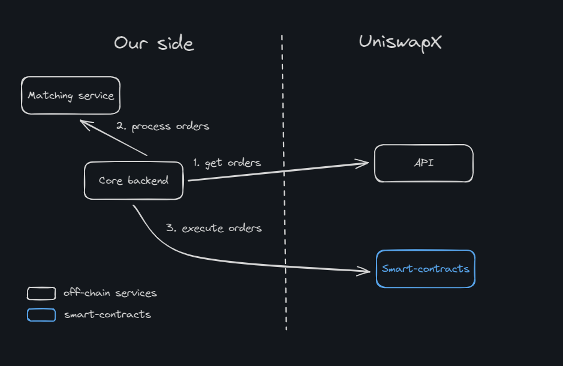
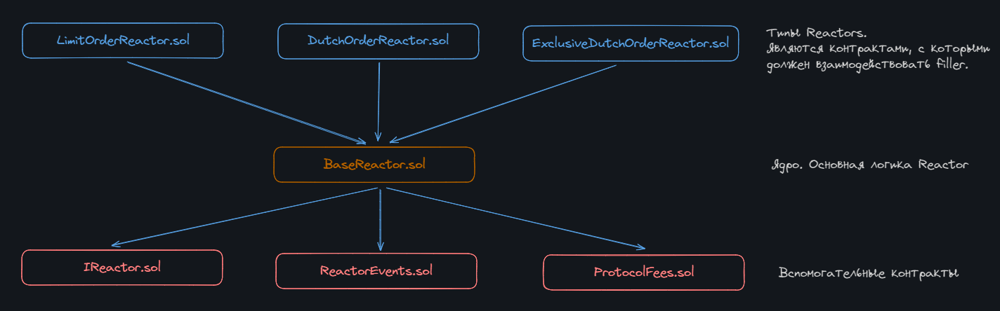
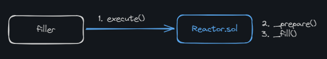
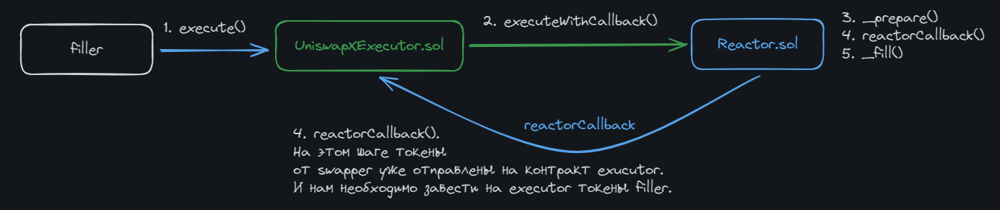

# Uniswap X

**Автор:** [Павел Найданов](https://github.com/PavelNaydanov) 🕵️‍♂️

_Опр!_ **UniswapX** - это протокол, который выполняет обмен токенов через сторонних поставщиков ликвидности с применением аукциона. В подходе есть сходство с классическим orderbook, который наполняется лимитными ордерами пользователей. Разница заключается в том, что к ордерам применяется аукцион, который с течением времени уменьшает стоимость исполнения ордера.

По сути, с ростом сложности маршрутизации обмена активами, UniswapX предлагает решение, в котором задача построения маршрута обмена может быть делегирована сторонним протоколам. Подразумевается, что сторонние протоколы, владеющие ликвидностью будут конкурировать за лучшую цену исполнения. При этом интерфейс для пользователя все еще остается на стороне основного приложения Uniswap.

Протоколом предусмотрено два вида участников:
- **swapper** - первоначальный инициатор обмена. Создает подписанный ордер, в котором хочет поменять один актив на другой.
- **filler** - исполняет ордер, который был создан **swapper**. Для исполнения ордера отдает актив, который нужен участнику **swapper**.

_Важно!_ В данном случае получается, что swapper - это maker, а filler - taker.

## Flow работы протокола

Для того, чтобы сделать обмен одного актива на другой, **swapper** создает специальный тип ордера "Exclusive Dutch Order" с указанием следующих параметров:
- **endAmount** - сумма в конце аукциона, по сути это минимальная сумма, которую swapper готов получить
- **startAmount** - сумма в начале аукциона, по сути это максимальная сумма, которую сможет получить swapper
- **timePeriod** - период времени для исполнения ордера, на протяжение этого периода стоимость обмена будет падать от startAmount, до endAmount

Это означает, что для ордера пользователя будет запущен голландский аукцион и стоимость его исполнения будет падать с течением времени. Фактически, чем больше времени пройдет до исполнения, тем меньше актива получит **swapper**, но и тем выгоднее исполнить ордер **filler**.

После создания ордера **swapper** подписывает ордер, используя [Permit2](https://github.com/Uniswap/permit2), который берет апрув для контрактов UniswapX на трансфер активов для исполнения ордера.

Информация о созданом ордере доступна всем, кто желает взять на себя роль **filler**.


Схема выше взята напрямую из документации протокола. Схема иллюстрирует описанный выше процесс:
1. **Swapper** отправляет ордер в UniswapX и дает approve() через сервис Permit2
2. **Filler** получает ордер пользователя и выполняет его на контрактах UniswapX. Называются эти контракты специальным термином **Reactors**. На них мы посмотрим чуть позже.
3. Запущенное исполнение ордера на контрактах **Reactors** валидирует ордер на предмет возможности исполнения и производит физический обмен активов между **filler** и **swapper**.

## Интеграция с протоколом Uniswap X

Для интеграции с протоколом UniswapX необходимо уметь делать следующие вещи:

1. Получать список всех доступных для исполнения ордеров
2. Выбирать ордера, которые могут быть исполнены подконтрольным filler
3. Исполнять ордера

На верхнем уровне можно представить это следующим образом:



Для получения ордеров UniswapX предоставляет API, для выбора ордера необходимо реализовывать собственную систему сопоставления, а для исполнения ордеров будет необходимо взаимодействовать со смарт-контрактами UniswapX.

### API

UniswapX предоставляет несколько endpoints для получения списка ордеров. Можно проверить [публичную swagger документацию](https://api.uniswap.org/v2/uniswapx/docs).

Пример curl запроса на получение ордера на базе голландского аукциона:

```js
GET https://api.uniswap.org/v2/orders?orderStatus=open&chainId=1&limit=1
```

Ответом будет приблизительно подобный json:

```json
{
    "orders": [
        {
            "outputs": [
                {
                    "recipient": "0x1453e532bd0e3425fec34c74b60feb58d3ced62e",
                    "startAmount": "19197120083527785617956515349",
                    "endAmount": "18920239513175289979421732778",
                    "token": "0x6982508145454Ce325dDbE47a25d4ec3d2311933"
                },
                {
                    "recipient": "0x000000fee13a103a10d593b9ae06b3e05f2e7e1c",
                    "startAmount": "48113082916109738390868459",
                    "endAmount": "47419146649562130274239931",
                    "token": "0x6982508145454Ce325dDbE47a25d4ec3d2311933"
                }
            ],
            "encodedOrder": "0x00000000000000000000000000000000000000000000000000000000000000200000000000000000000000000000000000000000000000000000000000000120000000000000000000000000000000000000000000000000000000006671858700000000000000000000000000000000000000000000000000000000667185ff000000000000000000000000bcc66fc7402daa98f5764057f95ac66b9391cd6b00000000000000000000000000000000000000000000000000000000000000640000000000000000000000006b175474e89094c44da98b954eedeac495271d0f000000000000000000000000000000000000000000002a5a058fc295ed000000000000000000000000000000000000000000000000002a5a058fc295ed00000000000000000000000000000000000000000000000000000000000000000002000000000000000000000000006000da47483062a0d734ba3dc7576ce6a0b645c40000000000000000000000001453e532bd0e3425fec34c74b60feb58d3ced62e046832ba303bf9169a9d46dd5a9d6d20483dd9cb0a9fc6a01957d06fcb8f5731000000000000000000000000000000000000000000000000000000006671860b000000000000000000000000000000000000000000000000000000000000000000000000000000000000000000000000000000000000000000000000000000c0000000000000000000000000000000000000000000000000000000000000000000000000000000000000000000000000000000000000000000000000000000020000000000000000000000006982508145454ce325ddbe47a25d4ec3d231193300000000000000000000000000000000000000003e077c4d0054fa9ae147ae1500000000000000000000000000000000000000003d22748f34df954eeae22faa0000000000000000000000001453e532bd0e3425fec34c74b60feb58d3ced62e0000000000000000000000006982508145454ce325ddbe47a25d4ec3d231193300000000000000000000000000000000000000000027cc57737d53651eb851eb000000000000000000000000000000000000000000273965173af2424872c5bb000000000000000000000000000000fee13a103a10d593b9ae06b3e05f2e7e1c",
            "signature": "0xa162dcbe5c514219b56cc076073c2f17f5e98884742140562a4c2cf1a874d31c125751581f9c8b8b77b1f386204a0fa3a0afddc2b463abea9d97090f3f52286d1b",
            "input": {
                "endAmount": "200000000000000000000000",
                "token": "0x6B175474E89094C44Da98b954EedeAC495271d0F",
                "startAmount": "200000000000000000000000"
            },
            "orderStatus": "open",
            "createdAt": 1718715742,
            "quoteId": "fa4abaa0-099c-4b80-910b-63ec29a34a44",
            "chainId": 1,
            "orderHash": "0xc9fda305699f447eb65c5fe013de773a8d3b31fbb22a5e0dfe9dfe607457486b",
            "nonce": "1993353596017098603749957683210189393906581838619635883099842642777929111345",
            "type": "Dutch"
        }
    ],
    "cursor": "eyJjaGFpbklkX29yZGVyU3RhdHVzIjoiMV9vcGVuIiwiY3JlYXRlZEF0IjoxNzE4NzE1NzQyLCJvcmRlckhhc2giOiIweGM5ZmRhMzA1Njk5ZjQ0N2ViNjVjNWZlMDEzZGU3NzNhOGQzYjMxZmJiMjJhNWUwZGZlOWRmZTYwNzQ1NzQ4NmIifQ=="
}
```

Чтобы декодировать поле `encodedOrder` придется воспользоваться [SDKs](https://github.com/Uniswap/sdks/tree/main/sdks/uniswapx-sdk).

Однако использование поллинга для постоянного получения списка ордеров не самый эффективный и быстрый способ. Поэтому UniswapX предоставляет возможность работы с webhooks. Это более закрытый способ получения ордеров и для реализации потребуется связаться с командой UniswapX, чтобы они подключили вас в свою систему оповещения. Подробнее можно почитать [тут](https://docs.uniswap.org/contracts/uniswapx/guides/webhooks).

### Matching system

Самый маленький раздел в статье, однако самый важный с точки зрения бизнеса. Вариаций по тому, каким образом отбирать ордера на исполнение именно вашим протоколом огромная масса. Конечный алгоритм будет зависеть от множества вещей, начиная от цели протокола и заканчивая суммой исполнения. Поэтому предлагаю оставить это в виде черного ящика и перейти к следующему разделу.

### Смарт-контракты UniswapX и исполнение ордера

Смарт-контракт, с которым необходимо взаимодействовать **filler**, называется специальным термином **reactor**. `Reactor.sol` обрабатывает и валидирует пользовательские ордера, определяет входные и выходные активы, делает обратный вызов на адрес вызывающего (если это необходимо).

Есть несколько вариантов реализации смарт-контракта `Reactor.sol` протоколом:
- [LimitOrderReactor.sol](https://github.com/Uniswap/UniswapX/blob/main/src/reactors/LimitOrderReactor.sol). Для исполнения простых лимитных ордеров
- [DutchOrderReactor.sol](https://github.com/Uniswap/UniswapX/blob/main/src/reactors/DutchOrderReactor.sol). Для исполнения ордеров, стоимость которых падает согласно голландскому аукциону
- [ExclusiveDutchOrderReactor.sol](https://github.com/Uniswap/UniswapX/blob/main/src/reactors/ExclusiveDutchOrderReactor.sol). Для исполнения ордеров, стоимость которых падает согласно голландскому аукциону, но добавляется понятие exclusiveFiller, который может в этом аукционе участвовать. Поле опциональное, которое расширяет возможности DutchOrderReactor.sol. Если его не указывать, то остается фактически функционал простого реактора с аукционом.

У всех вариантов реализаций есть большая часть общего кода, которая вынесена в абстрактный смарт-контракт [BaseReactor.sol](https://github.com/Uniswap/UniswapX/blob/main/src/reactors/BaseReactor.sol).



Посмотрим в интерфейс [IReactor.sol](https://github.com/Uniswap/UniswapX/blob/main/src/interfaces/IReactor.sol), который определяет набор функций смарт-контракта BaseReactor.sol.

```js
// SPDX-License-Identifier: GPL-2.0-or-later
pragma solidity ^0.8.0;

import {SignedOrder} from "../base/ReactorStructs.sol";

interface IReactor {
    /// @notice Исполнение ордера
    /// @param order Структура подписанного ордера
    function execute(SignedOrder calldata order) external payable;

    /// @notice Исполнение ордера с обратным вызовом
    /// @param order Структура подписанного ордера
    /// @param callbackData Данные, которые будут переданы в обратный вызов
    function executeWithCallback(SignedOrder calldata order, bytes calldata callbackData) external payable;

    /// @notice Исполнение массива ордеров
    /// @param orders Массив структур подписанных ордеров
    function executeBatch(SignedOrder[] calldata orders) external payable;

    /// @notice Исполнение массива ордеров с обратным вызовом для каждого ордера
    /// @param orders Массив структур подписанных ордеров
    /// @param callbackData Массив данных, которые будут переданы в обратный вызов
    function executeBatchWithCallback(SignedOrder[] calldata orders, bytes calldata callbackData) external payable;
}
```

Интерфейс описывает всего **четыре функции**, которые предоставлены filler для исполнения ордера. Две первых отвечают за разные стратегии исполнения ордера. Две последних позволяют исполнять несколько ордеров для каждой из стратегий.

## Стратегии исполнения ордеров

Для filler предоставляется две стратегии для исполнения ордеров на выбор:
 1. Direct Filler
 2. Fill Contracts

### Стратегия "Direct Filler"



Стратегия "Direct Filler" подразумевает, что на момент исполнения ордера **filler** уже имеет на балансе достаточно активов для swapper. Для работы этой стратегии filler может вызывать одну из двух функций [execute()](https://github.com/Uniswap/UniswapX/blob/main/src/reactors/BaseReactor.sol#L31) или [executeBatch()](https://github.com/Uniswap/UniswapX/blob/main/src/reactors/BaseReactor.sol#L55) непосредственно на контракте `Reactor.sol`.

Чтобы использовать эту стратегию, **filler** предварительно должен выдать апрув контракту Reactor и иметь в наличие достаточное количество актива, которым он будет исполнять ордер.

### Стратегия "Fill Contracts"



Стратегия "Fill Contracts" чуть более сложная, но при этом более гибкая. Главное отличие в том, что для взаимодействия с контрактом `Reactor.sol` **filler** использует собственный промежуточный смарт-контракт. Называется такой смарт-контракт на схеме `UniswapXExecutor.sol`. Абсолютно любой **filler** может использовать свой промежуточный смарт-контракт или даже несколько. Единственное требование к контракту заключается в том, что он должен реализовать интерфейс [IReactorCallback.sol](https://github.com/Uniswap/UniswapX/blob/v1.1.0/src/interfaces/IReactorCallback.sol).

И тогда процесс исполнения ордера выглядит следующим образом:
1. **filler** вызывает функцию `execute()` на контракте `UniswapXExecutor.sol`. Основное предназначение этой функции - это сделать вызов `executeWithFallback()` на контракте Reactor.sol.
2. `executeWithFallback()` будет валидировать ордер на предмет возможности исполнить (вызов приватной функции `_prepare()`) и если все ок, то спишет  токены со swapper и отправит вызывающему. В нашем случае это контракт filler `UniswapXExecutor.sol`. После этого сделает обратный вызов на контракт UniswapXExecutor.sol.
3. Этот вызов позволяет filler программно провести манипуляции с токенами swapper. Например, обменять на другом DEX в нужный актив и вывести с контракта на собственный адрес. После этого на контракт должны быть заведены активы, которые будут списаны в пользу swapper. Это может быть сделано любым удобным способом. Самый простой вариант списаны непосредственно с filler.
4. В конце вызов приватной функции `_fill()` спишет активы с контракта UniswapXExecutor.sol в пользу swapper. Если что-то пойдет не так, например не хватит количества токенов для исполнения ордера, то транзакция будет отменена.

_Важно!_ Плюс этого процесса в том, что все происходит в рамках одной транзакции. За газ платит только **filler**.

*Для чего эта стратегия может использоваться?* Для любой кастомной логики filler. Приведу в пример два кейса, которые на мой взгляд самые интересные:

1. filler под нашим управлением не один. То есть мы выступаем агрегаторами поставщиков ликвидности. Таким образом, мы можем реализовать единую точку входа в виде контракта `UniswapXExecutor.sol`, которому fillers будут выдавать апрув на распоряжение активами. Мы можем настроить whitelist собственных filler и исполнять ордера от имени протокола, используя ликвидность fillers.
2. filler не имеет в наличие актив для исполнения ордера, но имеет другой актив. Например, наш filler имеет только ETH. Но для исполнения ордера необходимо отдать USDT. Тогда под капотом нашего контракта `UniswapXExecutor.sol` можно проводить обмен ETH на любом DEX прямо в момент исполнения ордера в рамках одной транзакции.

Можешь попробовать придумать свой вариант использования стратегии "Fill Contracts".

UniswapX предлагает базовый пример контракта UniswapXExecutor.sol. Называется он [SwapRouter02Executor.sol](https://github.com/Uniswap/UniswapX/blob/main/src/sample-executors/SwapRouter02Executor.sol). Не обращай внимания на то, что называние не совпадает с нашим `UniswapXExecutor.sol`. Ты можешь использовать собственный нейминг, в этом ограничений нет.

Контракт предоставляет две функции для исполнения ордера:

```js
function execute(SignedOrder calldata order, bytes calldata callbackData) external onlyWhitelistedCaller {
    reactor.executeWithCallback(order, callbackData);
}

function executeBatch(SignedOrder[] calldata orders, bytes calldata callbackData) external onlyWhitelistedCaller {
    reactor.executeBatchWithCallback(orders, callbackData);
}
```

И одну функцию для реализации собственной логики предоставления активов для исполнения ордера:

```js
function reactorCallback(ResolvedOrder[] calldata, bytes calldata callbackData) external onlyReactor {
    /// Декодируется тот набор bytes callbackData,
    /// который был закодирован нами при вызове функции execute(, bytes calldata callbackData)
    (
        address[] memory tokensToApproveForSwapRouter02,
        address[] memory tokensToApproveForReactor,
        bytes[] memory multicallData
    ) = abi.decode(callbackData, (address[], address[], bytes[]));

    unchecked {
        /// Выдается апрув роутеру на токены, которые будут поменяны в вызове multicallData
        for (uint256 i = 0; i < tokensToApproveForSwapRouter02.length; i++) {
            ERC20(tokensToApproveForSwapRouter02[i]).safeApprove(address(swapRouter02), type(uint256).max);
        }

        /// Выдается апрув uniswapX реактору на токены, которые будут списаны в пользу swapper
        for (uint256 i = 0; i < tokensToApproveForReactor.length; i++) {
            ERC20(tokensToApproveForReactor[i]).safeApprove(address(reactor), type(uint256).max);
        }
    }

    /// Закодированный вызов на роутере dex. Необходимо для получения токенов, которые будут списаны в пользу swapper.
    /// То есть, например, контракт хранит ETH, а для исполнения ордера нужен USDT. Этот закодированный вызов поменяет
    /// на dex ETH на USDT, который позже будет списан от имени реактора
    swapRouter02.multicall(type(uint256).max, multicallData);

    /// Нативная валюта не может быть списана реактором, поэтому все, что есть в наличие принудительно отправляется на реактор.
    /// Переживать не нужно, весь излишек будет возвращен в конце исполнения
    if (address(this).balance > 0) {
        CurrencyLibrary.transferNative(address(reactor), address(this).balance);
    }
}
```

## Преимущества UniswapX

1. Лучшая стоимость обмена для **filler** в лице сторонних поставщиков ликвидности. Достигается за счет аукциона, который с течением времени снижает стоимость исполнения ордера
2. Безгазовый обмен для **swapper** в лице пользователя. Пользователь подписывает ордер, за газ будет платить **filler**, пользователю не нужен нативный токен сети. При этом **filler** тоже может снизить издержки по газу, объединяя несколько ордеров в одну транзакцию
3. Защита от различного рода MEV атак. Для пользователя гарантируется получение количества актива в рамках указанных заранее условий. Для **fillers** предлагается использовать приватные ноды для защиты MEV согласно [лучшим практикам](https://docs.flashbots.net/flashbots-protect/overview).

_Важно!_ Есть возможность расширения протокола до кроссчейн обменов и на момент написания статьи UniswapX обещает это реализовать, более того, половина [whitepaper](https://uniswap.org/whitepaper-uniswapx.pdf) UnsiwapX говорит на эту тему. И в довесок, UniswapX в процессе запуска пилотной версии для сети Arbitrum.

## Вывод

Ничего еще не было сказано про комиссию протокола. Как другие версии Uniswap, UniswapX содержит переключатель платы за протокол, который может быть активирован только Uniswap Governance (Uniswap Labs не участвует в этом процессе).

На мой взгляд решение UniswapX по делегированию маршрутизации исполнения ордеров достаточно элегантно и двольно несложно реализовано. Однако очень много здесь будет от качества и количества **fillers**, которые будут привлечены протоколом для исполнения ордеров.

## Links

1. [Репозиторий с кодом](https://github.com/Uniswap/UniswapX)
2. [Документация](https://docs.uniswap.org/contracts/uniswapx/overview)
3. [Whitepaper](https://uniswap.org/whitepaper-uniswapx.pdf) для UniswapX
4. [Материал по Permit2](https://github.com/dragonfly-xyz/useful-solidity-patterns/tree/main/patterns/permit2)