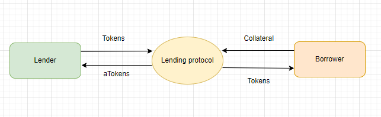
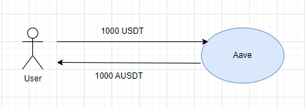
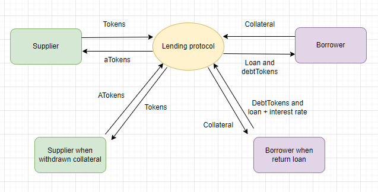
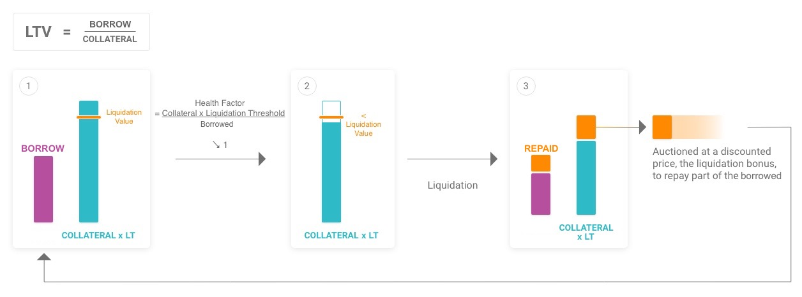
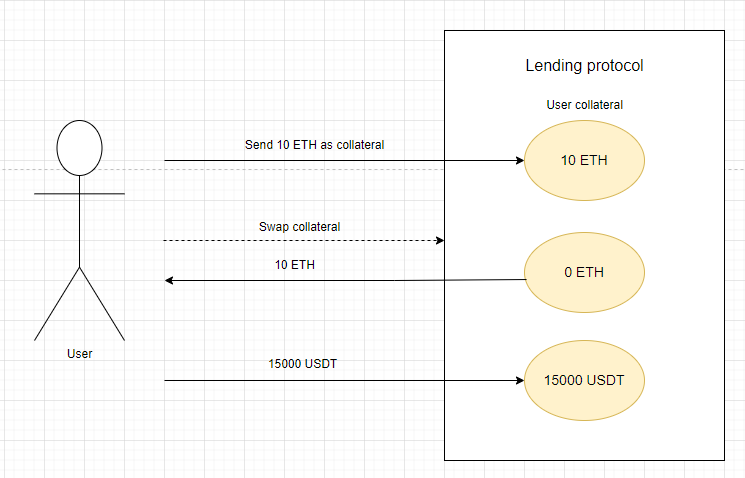

# The Aave DeFi Protocol

**Автор:** [Павел Найданов](https://github.com/PavelNaydanov) 🕵️‍♂️

"The secret of success is constancy to purpose.". Дизраэли, Бенджамин (1804-1881) - премьер-министр Великобритании в 1868 и 1874-80 гг., писатель.

Пришло время приключений вместе с **Aave**! В этой статье мы узнаем:
- Что такое протокол кредитования AAVE.
- Какие токены есть в Aave и для чего они используется протоколом.
- Как устроены interest rates.
- Как работает ликвидация в Aave.

_Важно!_ Дальше я буду говорить про **вторую версию** Aave!

## Обзор Aave

_Опр!_ **Aave** - один из самых популярных децентрализованных протоколов кредитования. Он предоставляет пользователю возможность одалживать или брать активы в займы. Имеет один из самых больших размеров рынка и кредитных пулов среди всех протоколов кредитования. Aave давно завоевал сердца своих пользователей и разработчиков в области криптовалют и блокчейн технологий.

Этот протокол делает процесс кредитования и расчет процентной ставки по вложенным или занятым активам простым и очень быстрым. При этом предоставляется возможность выбора типа процентных ставок. Помимо обычных займов, в Aave можно получить экспресс-займ или быстрый заём, который называется **flash loan**. Такой экспресс-заем не требует залога.

Создателем Aave считается финский программист Стани Кулечов. 1 мая 2017 года Кулечов основал компанию ETHLend и уже в ноябре 2017 года его компания запустила первую версию lending платформы под названием ETHLend.io. Позже протокол столкнулся со своей первой проблемой - нехватка ликвидности. Следствием чего состоялся ребрендинг в компанию **Aave**. В переводе с финского **Aave** означает «призрак».👻 Команда проекта объясняет это название тем, что они продолжают интриговать пользователей новыми криптотехнологиями, но при этом желают сохранить инфраструктуру сервиса открытой и прозрачной. 8 января 2020 года на блокчейне в главной сети Ethereum запустилась первая версия протокола Aave.

Примерно через полгода, в октябре 2020 года, компания Aave выпустила одноименный нативный токен платформы, называемый **AAVE**. Основное предназначение токена заключается в организации децентрализованной автономной организации или DAO. Для владельцев этого токена открывается возможность принимать участие в голосование. Предметом голосования являются изменение существующего протокола или внедрение новых функциональных возможностей. Это означает, что протокол делегирует часть полномочий в управление платформой пользователям, которые являются держателями(holders) токена AAVE. То есть прежде чем изменение протокола выходит в релиз, его должны поддержать больше 50% голосов. Тем самым реализуется полная децентрализация в принятии решений и дальнейшего развития протокола.

**Как работает механизм кредитования в Aave?** Пользователь отправляет залог на контракт, после этого он может моментально взять в займы некоторую сумму активов. В дальнейшем, ему будет необходимо выплатить проценты за использование заемных средств.

Для такого пользователя необходима ликвидность. Он должен иметь возможность в любой момент взять средства в займы. Взамен он должен предоставить достаточное количество залоговых средств. Поэтому доступные средства для займа уже должны быть в наличие у протокола. Для привлечения таких средств протокол предлагает годовое вознаграждение для пользователей, которые будут готовы предоставить свои активы протоколу. Эти активы будут предлагаться протоколом для займа.

Получается можно разделить пользователей протокола на две категории:
- Заемщики (Borrowers)
- Кредиторы (Lenders)

Механизм кредитования и разделение пользователей на две категории в протоколе Aave максимально похожи на протокол Compound. Но есть ряд некоторых отличий.

**Кредиторы.** Эта категория пользователей вносит свои активы с целью получения вознаграждения согласно процентной ставке. В обмен пользователи получают aToken в соотношение 1:1. AToken - это аналогия cToken в протоколе Compound. Сжигая aToken пользователи могут получить обратно свою ликвидность вместе с начисленным вознаграждением.

**Заемщики.** Эта категория пользователей вносит залог в протокол. Залог блокируется в качестве обеспечения или некой страховки для протокола. В обмен заемщики получают возможность взять в займы некую сумму другого актива. Это сумма будет обязательно меньше залога, так как стоимость обеспечения должна превышать стоимость заимствуемого актива. Это позволяет Aave не исчерпать свои запасы выдавая кредиты. Пользователи, которые желают погасить свою задолженность, должны вернуть заимствованный актив и выплатить проценты. Пока задолженность не погашена полностью, залог будет заблокирован в протоколе. Вместе с займом пользователю выдается DebtToken, который содержит информацию по его долговым обязательствам.

На схеме ниже продемонстрирован принцип работы протокола кредитования. Кредиторы вкладывают токены, взамен получают aTokens. Заемщики вкладывают залог (collateral), взамен получают токены.

Именно кредиторы организуют ликвидность на протоколе, которая в дальнейшем используется для выдачи займов. Кредиторов можно назвать полноценными поставщиками ликвидности для кредитного протокола.

## ATokens и DebtTokens

Что же такое aToken? Это специальный процентный токен, который выдается пользователям в качестве подтверждения при внесение средств в протокол. "A" в название обозначает Aave. Таким образом, если пользователь вносит в протокол токен USDT, взамен ему будет выдан токен AUSDT.

AToken выдается в соотношение 1:1 относительно внесенного количества токенов. И в этом Aave отличается от Compound. Потому что в Compound пользователю выдается cToken в количестве отношения внесенных токенов к текущему курсу обмена (current [Exchange Rate](https://docs.compound.finance/v2/ctokens/#exchange-rate)).

> **Aave.** Если мы вносим 1000 USDT, то мы получаем 1000 AUSDT.

> **Compound.** Exchange rate 0,02. Если мы вносим 1000 USDT, то мы получаем 1000 / 0,02 = 50000 cUSDT.

Пользователь, который владеет **aToken**, получает долю от общей суммы заработка в займах. Заемщики, которые будут брать эти средства в займ, будут выплачивать проценты за использование этих средств согласно процентной ставке протокола. Из этих процентов и будет начислено вознаграждение для держателя aToken. Вознаграждение будет соизмеримо его доле актива относительно всех вложенных средств в протокол.

Для **aToken** реализованы все стандартные методы ERC20: `balanceOf()`, `transfer()`, `transferFrom()`, `approve()`, `totalSupply()` и т.д.

> balanceOf() возвращает основной баланс + начисленное вознаграждение.

В протоколе Compound расчет процентов за займ происходит за каждый блок. Логика начисления процентов реализована внутри контракта cToken через вызов метода `accrueInterest()`.

В отличие от Compound, протокол Aave шагнул дальше и реализовал для заемщиков выдачу отдельного токена, который должен хранить информацию о долге. Этот долговой токен называется **debtToken**. По сути это процентный токен, как и aToken, только для хранения информации о долге держателя. Этот токен чеканится и сжигается, при вызове методов `borrow()` и `repay()`. Ниже представлена схема движения **aTokens** и **deptTokens** для тех кто просто кладет токены под проценты и для тех кто берет займы.

> Нужно отметить, что для того, чтобы взять займ, нужно сначала внести токены под залог на протокол, то есть быть supplier и получить aTokens. После этого на основание залога, можно стать borrower и брать токены в займ и получить debtTokens.

Существует два типа долгового токена:
1. Стабильный долговой токен (Stable debt token)
2. Токен переменного долга (Variable debt token)

Эти два типа предназначены для реализации разных видов начисления процентов по займу. Об этом мы поговорим чуть позже.

Несмотря на то, что эти токены, реализованны по стандарту ERC20, в них нет возможности передачи токенов через стандартные функции `transfer()` и `allowance()`.

> balanceOf() всегда будет возвращать накопленную задолженность пользователя.

> totalSupply() всегда будет возвращать общую задолженность, которая начислена всем пользователям протокола для конкретного типа (stable or variable) debtToken.

## Ликвидации

Процесс ликвидации в Aave происходит, когда **залоговая стоимость актива** перестает покрывать **стоимость заемных средств**. В этом плане Aave ничем не отличается от Compound. Такая ситуация может произойти, когда залог уменьшается в цене или наоборот, заемные средства вырастают в цене. Получается, что процесс ликвидации ориентируется на соотношение стоимости залога к стоимости заемных средств. А вот дальше начинаются отличия от Compound. Потому что в Aave такое соотношение называется **фактором здоровья (health factor)**.

В Compound пользователь ориентируется на специальный индикатор, который показывает процент использования залоговых средств. Когда индикатор достигает ста процентов, становится доступной ликвидация. Это говорит о том, что залог больше не обеспечивает страховку для протокола, так как фактически займ стоит дороже или почти дороже заблокированного залога. Для протокола недопустимо, чтобы заем становился дороже залога. Это может исчерпать средства протокола и баланс будет нарушен.

В Compound, за возможность ликвидировать позицию отвечает параметр `closeFactorMantissa()`, который описывает максимально возможную сумму для погашения займа от 0 до 100%. После этого ликвидатор получает вознаграждение.

В Aave, как я уже сказал, вводится понятие **health factor** (фактор здоровья). Это является основным ориентиром при ликвидации. Другими словами, фактор здоровья показывает безопасность залога по отношению к заимствованному активу и его базовой стоимости. Чем этот показатель выше, тем в большей безопасности залог. При падении фактора здоровья ниже 1, открывается возможность для ликвидации.

При ликвидации может быть погашено до 50% долга заемщика. Это установлено константой в контракте [LendingPoolCollateralManager](https://github.com/aave/protocol-v2/blob/master/contracts/protocol/lendingpool/LendingPoolCollateralManager.sol#L39C29-L39C61). И эта стоимость + комиссия за ликвидацию берется из доступного залогового обеспечения ликвидируемого. После ликвидации залога на эквивалентную сумму погашается долг.

> Пример!
> 1. Боб вносит 10 ETH и занимает 6 ETH в виде USDT.
> 2. Если фактор здоровья Боба упадет ниже 1, то для ликвидатора появится возможность ликвидировать займ Боба.
> 3. Ликвидатор может погасить до 50% суммы займа. Это будет равняться количеству USDT на сумму 3-х ETH.
> 4. Взамен ликвидатор вправе потребовать вознаграждение равное 5% от ликвидируемой суммы.
> 5. Ликвидатор требует 3 + 0.15 ETH за погашение USDT на сумму равную 3 ETH.

Как рассчитывается фактор здоровья? Фактор здоровья рассчитывается согласно формуле: суммарный залог пользователя (обязательно в ETH) умножается на текущий порог ликвидации и делится на суммарный займ пользователя (обязательно в ETH).

>HF = ∑collateral in ETH * Liquidation threshold / total borrows in ETH

При этом порог ликвидации (Liquidation threshold или LT) в данном случае - это процент, при котором займ считается недостаточно обеспеченным. Например, порог ликвидации равный 90% означает, что если стоимость заемных средств превысит 90% стоимости залога, займ будет недостаточно обеспечен и может быть подвергнут ликвидации.

Для фактора здоровья можно провести аналогию с термином maintenance margin в рамках маржинальной торговли. Так как этот термин обозначает общую сумму активов, которые должны оставаться на кошельке пользователя, чтобы ордер на покупку или продажу оставался открытым. Этот показатель помогает избежать **margin call**.

Фактор здоровья, как и maintenance margin является своего рода показателем безопасности заемных средств. Оба параметра являются сигналами для пересмотра позиции по займу. В случае с Aave - это сигнал к ликвидации. В случае с маржинальной торговлей - это сигнал к **margin call**.

Могу ли я сам стать ликвидатором? Да, механизм ликвидации открыт для всех желающих, но конкуренция в этом деле большая.

Для ликвидации необходимо вызвать функцию liquidationCall() на контракте [LendingPool](https://github.com/aave/protocol-v2/blob/master/contracts/protocol/lendingpool/LendingPool.sol#L425). Но обычно создают автоматизированного бота или даже целую систему ликвидации.

Для того, что бы работа ликвидатора была прибыльной необходимо принимать во внимание стоимость газа. Не стоит забывать, чтобы инициировать процесс ликвидации, нужно вызвать метод на контракте и заплатить газ. Если цена за газ будет слишком высокой, то ликвидация может оказаться не выгодной. С расчетом рентабельности ликвидации можно ознакомится в [официальной документации](https://docs.aave.com/developers/v/2.0/guides/liquidations#calculating-profitability-vs-gas-cost).

## Advanced Features

### Своп обеспечения (Collateral Swap)

Пользователи могут осуществлять свопы своих залогов из одного токена в другой. Например, из ETH в USDT, если они прогнозируют снижение цены эфира.

Для пользователя это выглядит как действие в одну транзакцию. Мы предполагаем, что пользователь уже отправил 10 ETH в качестве залога. После этого он делает запрос на смену токена в залоге. По сути ему возвращаются его 10 ETH. Взамен он должен в конце транзакции вернуть эквивалентную сумму в другом токене. На скриншоте ниже пользователь возвращает 15000 USDT. По курсу 1 ETH = 1500 USDT. Для безопасности стоимость берется из ценового оракула.

Это нужно в случае, если ты хочешь обменять свой залог на другой актив или актив с более высокой процентной ставкой, которая даст тебе большее вознаграждение. Для такого обмена нет необходимости выходить из протокола и погашать свой кредит. Поэтому такой обмен достаточно удобен и экономичен, так как пользователю нет необходимости проводить лишние транзакции. Это значит, что он сэкономит на газе.

> Например, может возникнуть следующая ситуация. Цена залога начинает падать. Тогда ты можешь просто обменять его на стейблкоин. Дальше можно не беспокоиться о колебаниях цены и потенциальной угрозе потери обеспечения. Так как стейблкоин менее волатильная валюта.

## Делегирование нативного кредита (Native Credit Delegation)

Благодаря тому что пользователи получают **debtToken**, которые по сути отображают долговые обязательства. Благодаря наличию такого токена, они могут делегировать свой кредит. В Aave это называется "Делегирование нативного кредита".

Эта опция позволяет поставщику ликвидности вложить средства в протокол. Затем можно делегировать право взять займ другому пользователю. То есть не самому брать средства в займы, а позволить "другу" или другому пользователю брать в займы за место себя. Это дает право другому пользователю брать средства взаймы, не внося залог для обеспечения.

Для предоставления возможности взять кредит другому пользователю, поставщик ликвидности должен вызвать метод `approveDelegation()`. Функция принимает два аргумента:
- **delegatee**. Аргумент функции типа адрес. Подразумевает под собой адрес, которому поставщик ликвидности делегирует возможность взять кредит.
- **amount**. Сумма, которую delegatee сможет взять.

Согласно этим двум аргументам, можно сделать вывод, что поставщик ликвидности может распределить свои кредитные возможности между несколькими пользователями на разные суммы. Получается, что Native Credit Delegation является достаточно гибкой функциональной возможностью.

## Flexible rates

Процентная ставка реализована в Aave достаточно гибко, отсюда и название flexible rates. Помнишь я говорил, что debtToken бывает двух видов? Это как раз необходимо для реализации двух разных моделей расчета процентных ставок. Пользователь может самостоятельно выбирать любую из двух категорий ставок при займе:

- Стабильная процентная ставка.
- Переменная процентная ставка.

**Стабильная процентная ставка** - это ставка, которая не меняется с течением времени. Отражает среднюю процентную ставку, которая взимается на рынке за данный актив. На самом деле стабильная процентная ставка не совсем стабильная. Правильнее сказать, что она меньше подвержена рыночным колебаниям и гораздо реже меняется.

**Переменная процентная ставка**, работает наоборот. Это ставка, которая постоянно меняется в зависимости от соотношения спроса и предложения на рынке. Определяется ставка алгоритмом, который отслеживает средства в пользовательских пулах. Чем больше сумма займов по активу, тем выше спрос, соответственно выше переменная процентная ставка.

Пользователи, которые берут займ, могут переходить от переменной к стабильной ставке, и обратно. Никаких ограничений со стороны Aave на этот счет нет. Обычно пользователи выбирают свою ставку на основе собственных целей и предпочтений. Если необходимо заработать здесь и сейчас лучше может подойти переменная процентная ставка. Она может помочь заработать на разнице курсов. Если необходимо брать кредит на долгий срок и нужно четко понимать сколько набежит процентов по займу, то лучше может подойти стабильная процентная ставка.

Для управления процентной ставкой при займе в функции borrow() контракта LendingPool существует аргумент interestRateMode, который представлен типом uint256. Пользователь может передать значение 1 или 2 на свое усмотрение.
> Stable - 1.
> Variable - 2.

Параметр по умолчанию может быть изменен через DAO протокола, путем голосования сообщества Aave.

Для того, чтобы изменить процентную ставку после займа, пользователю необходимо вызвать функцию `swapBorrowRateMode()` на контракте LendingPool. Эта функция принимает два аргумента. Address asset - адрес актива, который был взят в займы. Uint256 rateMode - категория процентной ставки. Принимает 1 для стабильной процентной ставки, 2 для переменной.

Математическая составляющая расчета процентных ставок в Aave также, как и в Compound строится вокруг понятия коэффициента использования (**utilization rate**). Этот коэффициент обозначает наличие количества актива доступного для займа. На основе этого коэффициента вычисляется процентная ставка:
- Когда активов для займа мало, процентная ставка для займа высокая.
- Когда активов для займа много, процентная ставка низкая.

Это стимулирует пользователей брать займы или скорее погашать долговые обязательства.

В Aave аналогом **kink**, который есть в Compound, выступает понятие optimal utilization rate. При достижение которого процентная ставка резко увеличивается по кривой. Это позволяет не исчерпать все 100% доступных активов для займа. Другими словами, как только utilization rate становится больше optimal utilization rate, процентная ставка начинает считаться по другой формуле.

- Когда U <= U_optimal_ процентная ставка по займу медленно увеличивается вместе с опустошением доступных средств.

- Когда U > U_optimal_ процентная ставка по займу резко увеличивается до уровня 50%.

Подробнее, со всеми математическими формулами можно ознакомиться в [официальной документации Aave](https://docs.aave.com/risk/liquidity-risk/borrow-interest-rate).

## Example

Пример "оооочень" простого взаимодействия с протоколом Aave можно посмотреть [тут](./contracts/src/AaveLendingAdapter.sol).

Контракт представляет собой простые вызовы контракта **LendingPool.sol** протокола Aave для предоставления/снятия ликвидности, займа/погашения долга и ликвидации.

_Важно!_ Будь внимательным, если захочется скомпилировать проект и запустить тесты необходимо установить переменную окружения. Смотри [readme](./contracts/readme.md).

## Вывод

На сегодняшний день Aave продолжает расширять свою экосистему в сфере DeFi. В июле 2020 года сообщество Aave одобрило предложение о старте собственного стейблкоина под названием GHO. Практически 100% держателей токена AAVE поддержало это предложение о выпуске GHO с избыточным обеспечением и привязкой к доллару США.

Выпуск стейблкоина должен сделать займы в протоколе Aave еще более конкурентноспособными. Дополнительно это должно принести доход всему сообществу Aave. Подробнее можно прочитать в замечательной статье André Beganski ["Aave DAO Approves Creating GHO Stablecoin"](https://decrypt.co/106325/aave-dao-approves-creating-gho-stablecoin).

Стейблкоин GHO будет работать согласно модели, в которую будут заложены принципы DAI от MakerDao. Нативная процентная ставка стабильной монеты будет определяться Aave DAO.

Aave - прекрасный децентрализованный протокол кредитования для опытных пользователей. Он предлагает несколько инновационных конкурентных преимуществ. Aave предоставляет более широкий выбор токенов, чем Compound и предлагает такие уникальные возможности, как **flexible rates**, **collateral swap**, **native credit delegation**.

Этот протокол вышел за пределы одной сети Ethereum благодаря собственному решению, называемому Portal. Это позволяет мгновенно сжигать токены в одной сети и чеканить их в нужной сети.

Однако при всем при этом, Aave достаточно не прост в освоение для новичков и считается инструментом для профессиональных пользователей. И это не спроста, потому что Aave содержит еще один замечательный инструмент, который требует технических знаний в области написания кода смарт контракта. Это **flash loans**. Это тема, которую стоит вынести в отдельную статью. Разберем, что это дает [тут](./flash-loans/README.md).