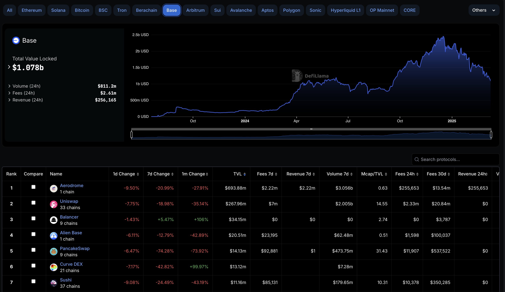
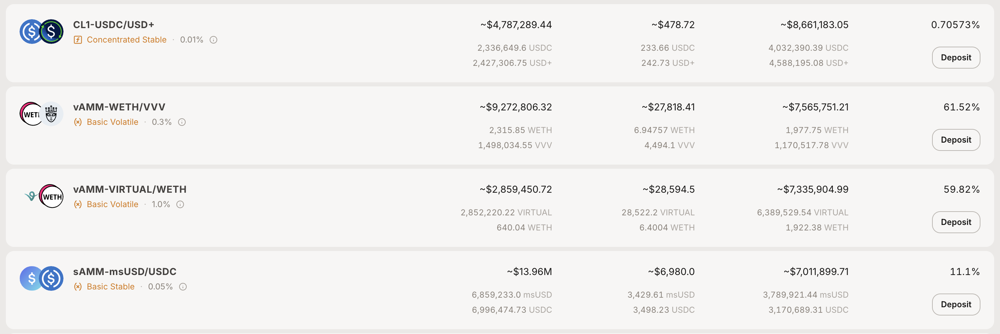
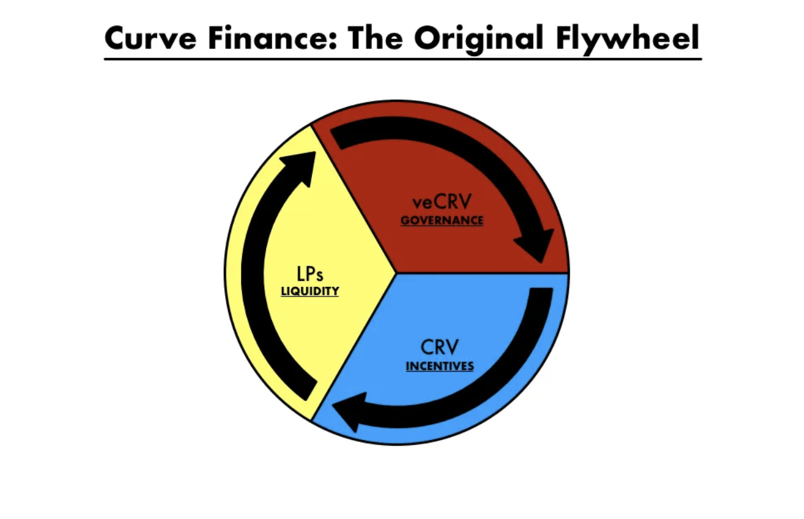
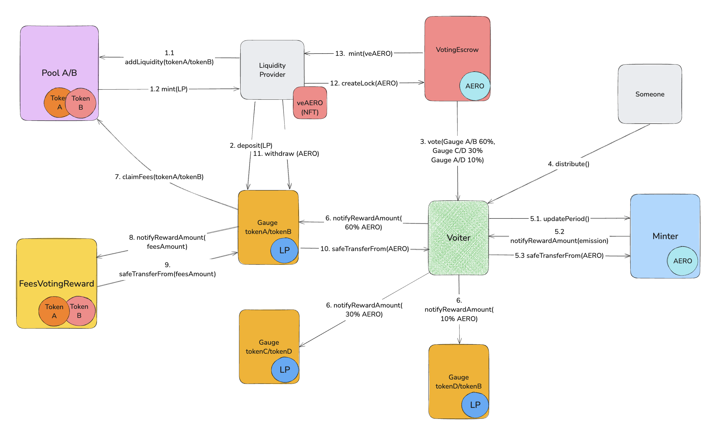

# Aerodrome

**Автор:** [Роман Ярлыков](https://github.com/rlkvrv) 🧐

Aerodrome — это децентрализованный обменник (DEX) в сети Base на базе AMM. Команда проекта попыталась объединить проверенные механики из трех известных протоколов DeFi: Uniswap, Curve и Convex, тем самым позиционируя Aerodrome как MetaDEX.

Кроме того, Aerodrome — это форк протокола Velodrome v2 (развернутый в Optimism), разработанный той же командой, но запущенный с новыми токенами и обновленной токеномикой. Ранее использовались токены VELO и veVELO, а теперь их заменили токены AERO и veAERO. При этом держатели токена veVELO получили 40% эмиссии токена AERO (200 млн токенов). Поэтому почти все, что касается протокола Aerodrome, также справедливо для Velodrome v2.

На момент написания статьи Aerodrome является "хабом ликвидности" в сети Base и значительно опережает своих конкурентов, таких как Uniswap, PancakeSwap, Curve и других.

  
*Скриншот DeFi Lama, раздел "Dexs TVL Rankings", вкладка "Base"*

Протокол изначально запускался в партнерстве с Coinbase сразу после выхода мейннета Base. Поэтому неудивительно, что конкурировать с ним в таких условиях оказалось значительно сложнее.

Сеть Base была запущена 9 августа 2024 года, а протокол Aerodrome — 28 августа 2023 года. Но в отличие от других популярных DEX, Aerodrome развернут только в сети Base.

## Основа — Uniswap v2

Несмотря на запуск в середине 2023 года (к тому времени Uniswap v3 с концентрированной ликвидностью существовал уже два года), за основу был взят Uniswap v2, адаптированный под современные реалии.

Только через год, в марте 2024 года, на базе Aerodrome был запущен Slipstream для работы с концентрированной ликвидностью, что добавило возможности Uniswap v3. Скорее всего это было запланировано заранее, подобный путь прошли многие DEX, включая PancakeSwap, SushiSwap, Camelot и другие. Это также говорит о том, что пулы по типу Uniswap v2 остаются актуальными.

### StableSwap

Основа в виде кода Uniswap v2 дает возможность создавать так называемые "волатильные" пулы, то есть пулы, в которых цена может меняться очень сильно, что совсем не подходило для стейблкоинов (токенов с привязкой к фиксированной цене). Это один из самых больших недостатков второй версии Uniswap. Поэтому первое изменение, которое можно увидеть в Aerodrome/Velodrome v2, — добавлена возможность создавать пулы со стабильными парами.

Такой функционал называется инвариантом `StableSwap` и позаимствован из протокола Curve. Ранее мы уже писали про Curve и `StableSwap`. Если коротко — вместо формулы постоянного произведения `x * y >= k` используется гибридная формула `x3y + y3x >= k`, которая включает в себя сразу два инварианта: постоянного произведения и постоянной суммы. Когда пул стабилен, то есть находится очень близко к целевой стоимости, работает инвариант постоянной суммы, а если пул нестабилен, включается инвариант постоянного произведения.

Стабильные пулы сразу создаются с флагом "stable", который влияет на все дальнейшие расчеты цены. Если этот флаг не указан, значит, это обычный волатильный пул, который использует старую добрую формулу AMM — `x * y >= k`. Таким образом, в протоколе появилась возможность создавать как "стабильные" пулы, так и классические "волатильные".

Отличить пулы можно по названию: волатильный пул будет иметь приставку "vAMM-", а полное название будет выглядеть так — "vAMM-{token0}/{token1}". Соответственно, стабильные пулы имеют приставку "sAMM-".

  
*Источник: https://aerodrome.finance/liquidity*

Приставка "CL" означает "concentrated liquidity" и обозначает пулы Slipstream, поэтому пулы V2 легко отсортировать по приставке "AMM".

### Комиссии

Работа с комиссиями изменилась существенно по сравнению с Uniswap v2:

1. Комиссии могут изменяться в диапазоне от минимального значения (больше 0) до 3%.
2. В отличие от Uniswap v2, комиссии отправляются на отдельный смарт-контракт [PoolFees](https://github.com/aerodrome-finance/contracts/blob/main/contracts/PoolFees.sol).
3. Из-за второго пункта изменена логика работы с комиссией.

По умолчанию для стабильных пар задана комиссия 0.05%, а для волатильных — 0.3%. Комиссии задаются специальной ролью `feeManager` на контракте [PoolFactory](https://github.com/aerodrome-finance/contracts/blob/main/contracts/factories/PoolFactory.sol). Напомню, что в Uniswap v2 комиссия фиксированная (0.3%).

Во втором Uniswap логика была следующая:

1. Вы, как поставщик ликвидности, отдаете свои средства в пул и становитесь владельцем доли этого пула.
2. В момент свопа берется комиссия, которая остается в пуле, увеличивая размер вашей доли.
3. В момент вывода ликвидности вы обмениваете свою долю на ликвидность + комиссии.

В Aerodrome модель изменилась: логика накопления и вывода комиссий отделена от основной ликвидности. Теперь все комиссии копятся на отдельном смарт-контракте, и для их востребования требуется отдельная транзакция. Однако расчет доли остается пропорциональным.

Таким образом, вложив `$1000` и заработав `$100` комиссии, можно вывести только комиссию, вызвав функцию [Pool::claimFees](https://github.com/aerodrome-finance/contracts/blob/a5fae2e87e490d6b10f133e28cc11bcc58c5346a/contracts/Pool.sol#L143), а ликвидность оставить. Если же вывести ликвидность, получишь только `$1000`, а для получения комиссии потребуется дополнительная транзакция.

Преимущество такого подхода в том, что ликвидность отделена от комиссий, что необходимо для механизмов стимуляции ликвидности (о них поговорим позже). Кроме того, на смарт-контракте всегда можно посмотреть, сколько пул "заработал" и сколько заработал каждый поставщик ликвидности, без необходимости использования фронтенда.

Минус — добавление дополнительной логики, которая требует больше газа и выполняется чаще, чем в Uniswap v2. Рассмотрим это подробнее далее.


#### Механизм расчета  

Чтобы понять разницу, быстро вспомним, как рассчитывались комиссии и как их можно было востребовать в контракте [UniswapV2Pair](https://github.com/Uniswap/v2-core/blob/master/contracts/UniswapV2Pair.sol).  

1. В функции [swap](https://github.com/Uniswap/v2-core/blob/ee547b17853e71ed4e0101ccfd52e70d5acded58/contracts/UniswapV2Pair.sol#L180-L181) учитывается комиссия:  
    ```solidity
    uint balance0Adjusted = balance0.mul(1000).sub(amount0In.mul(3));
    uint balance1Adjusted = balance1.mul(1000).sub(amount1In.mul(3));
    ```
2. В функции [burn](https://github.com/Uniswap/v2-core/blob/ee547b17853e71ed4e0101ccfd52e70d5acded58/contracts/UniswapV2Pair.sol#L134) можно получить свою ликвидность обратно в обмен на LP-токены с учетом начисленных комиссий.  

Вот так просто.  

Теперь разберем, как это реализовано в Aerodrome.  

1. В функции [swap](https://github.com/aerodrome-finance/contracts/blob/a5fae2e87e490d6b10f133e28cc11bcc58c5346a/contracts/Pool.sol#L377-L378) для расчета комиссий вызывается метод фабрики `IPoolFactory::getFee`, который возвращает текущий процент комиссии для конкретного токена.  
2. Для каждого токена (`token0` и `token1`) вызываются функции `_update0` и `_update1`, которым передается рассчитанная комиссия:  
    ```solidity
    if (amount0In > 0) _update0((amount0In * IPoolFactory(factory).getFee(address(this), stable)) / 10000); // accrue fees for token0 and move them out of pool
    if (amount1In > 0) _update1((amount1In * IPoolFactory(factory).getFee(address(this), stable)) / 10000); // accrue fees for token1 and move them out of pool
    ```
3. В функциях `_update0` и `_update1` комиссия сразу отправляется на смарт-контракт `PoolFees`:  
    ```solidity
    // update0 function
    IERC20(token0).safeTransfer(poolFees, amount);
    // update1 function
    IERC20(token1).safeTransfer(poolFees, amount);
    ```
4. Высчитывается `ratio` — соотношение текущей порции комиссии к общему количеству LP-токенов. Здесь `amount` — это количество токенов, списанных в качестве комиссии. Умножение на `1e18` масштабирует это значение до `decimals` LP-токенов:  
    ```solidity
    // update0 function
    uint256 _ratio = (amount * 1e18) / totalSupply(); // 1e18 adjustment is removed during claim
    // update1 function
    uint256 _ratio = (amount * 1e18) / totalSupply();
    ```
5. Увеличиваются общие счетчики комиссий — `index0` и `index1`, к которым прибавляется текущее значение `ratio`:  
    ```solidity
    // update0 function
    if (_ratio > 0) {
        index0 += _ratio;
    }
    // update1 function
    if (_ratio > 0) {
        index1 += _ratio;
    }
    ```
6. Чтобы все работало корректно, используется функция [_updateFor](https://github.com/aerodrome-finance/contracts/blob/a5fae2e87e490d6b10f133e28cc11bcc58c5346a/contracts/Pool.sol#L186C14-L186C24), которая вызывается перед клеймом токенов либо в `_beforeTokenTransfer` при любых операциях с LP-токенами. Она рассчитывает, сколько LP-токенов вам положено с момента последнего вызова:  
    - Определяется текущий баланс ваших LP-токенов (`_supplied`);  
    - Берутся последние зафиксированные значения счетчиков для вашего адреса (`_supplyIndex0`, `_supplyIndex1`), а также глобальные `index0` и `index1`;  
    - Вычисляется разница (`delta`) как `index - supplyIndex`;  
    - На основе этой разницы и текущего баланса LP-токенов рассчитывается сумма, которую можно начислить:  
    ```solidity
    if (_delta0 > 0) {
        uint256 _share = (_supplied * _delta0) / 1e18; // add accrued difference for each supplied token
        claimable0[recipient] += _share;
    }
    if (_delta1 > 0) {
        uint256 _share = (_supplied * _delta1) / 1e18;
        claimable1[recipient] += _share;
    }
    ```
7. Когда поставщик ликвидности хочет вывести комиссию, он вызывает функцию [claimFees](https://github.com/aerodrome-finance/contracts/blob/a5fae2e87e490d6b10f133e28cc11bcc58c5346a/contracts/Pool.sol#L143). Она делает внешний вызов в смарт-контракт `PoolFees` для выплаты комиссий, после чего обнуляет значения `claimable0` и `claimable1`.  

Логика работы стала сложнее, но стоит помнить, что протокол развернут в L2-сети Base, где комиссии за газ ниже, чем в Ethereum. Кроме того, такая архитектура оправдана с точки зрения бизнес-логики.  

Я подробно описал этот механизм с примерами кода, так как аналогичный подход используется в разных частях протокола, где происходит перерасчет долей. Изучая кодовую базу, вы встретите его не раз.

## Что взяли от Curve  

Секрет успеха протокола Curve (помимо возможности работы со стабильными парами) — это грамотная модель поощрения участников протокола, стимулирования ликвидности и удержание цены токена на приемлемых уровнях.  

Добиться этого удалось благодаря нескольким ключевым механизмам:  

1. **Заработок на комиссиях** — пользователи получают часть комиссий за предоставление ликвидности.  
2. **Фарминг** — вознаграждение в токене CRV за предоставление LP-токенов (получаемых в обмен на ликвидность).  
3. **Голосование и управление** — стейкинг CRV в обмен на veCRV, которые дают право голосовать за распределение ревардов между пулами, а также получать часть доходов протокола.  

Таким образом запускается и работает "маховик ликвидности":  
- ➡️ большая ликвидность привлекает больше трейдеров;  
- ➡️ больше трейдеров совершают больше сделок, увеличивая комиссионный доход;  
- ➡️ высокая доходность мотивирует голосующих поддерживать популярные пулы;  
- ➡️ это увеличивает награды в CRV и доходы с комиссий, привлекая еще больше ликвидности;  
- ➡️ большая ликвидность привлекает больше трейдеров...  

  
*Источник: статья The Flywheel: An exploration into the Curve Ecosystem*  

Статья [The Flywheel](https://kmets.substack.com/p/the-flywheel-an-exploration-into).

### Более детальный разбор модели Curve  

Чтобы понять отличия Aerodrome от Curve, разберем систему стимулирования Curve подробнее.  

**Предоставление ликвидности**  

Все начинается с добавления ликвидности в пул, за что пользователь получает LP-токены. Комиссия за свопы начисляется в LP-токенах и фактически остается в пуле, что постепенно увеличивает долю провайдера ликвидности. Если больше ничего не делать, доход будет формироваться только за счет комиссий.  

**Фарминг**  

Токен управления Curve — CRV — эмитируется постепенно, и большая его часть распределяется через вознаграждения (реварды). Это делает возможным фарминг в протоколе.  

> *Примечание:* Эмиссия CRV запланирована на ~300 лет.  

Пользователь может передать свои LP-токены в *Liquidity Gauge* (специальный смарт-контракт для каждого пула) и получать вознаграждение в CRV. Количество CRV, выделяемых пулу, зависит от количества голосов, отданных за его Liquidity Gauge. Но кто голосует?  

**Стейкинг и управление**  

Полученные CRV (или купленные на DEX) можно застейкать, получив взамен токены veCRV (*Vote-Escrowed CRV*). Эти токены нельзя передавать, но они позволяют голосовать каждую эпоху (7 дней) за *Liquidity Gauge* определенных пулов.  

Пулы, получившие больше голосов, получают большую долю еженедельной эмиссии CRV, а также **часть комиссионных доходов протокола**.  

> *Примечание:* Помимо комиссий, оседающих в пулах для LP-провайдеров, Curve взимает дополнительную *admin fee*, которая поступает в казну DAO. Часть этих средств распределяется между veCRV-держателями, проголосовавшими за пулы.  

**Вес голоса veCRV зависит от срока блокировки**:  
- Максимальный срок — 4 года, минимальный — 1 неделя.  
- Чем дольше блокировка, тем выше вес.  
- Вес уменьшается со временем, но можно продлевать блокировку.

### Стимулы Aerodrome  

Модель "маховика ликвидности" была почти полностью скопирована у Curve, но при этом модифицирована, чтобы устранить его недостатки — так же, как это было сделано с пулом Uniswap v2.  

Общая идея остается той же:  
1. Заработок на торговых комиссиях за предоставление ликвидности.  
2. Фарминг токена AERO через предоставление LP-токенов.  
3. Управление через vote-escrow токен veAERO по аналогии с veCRV.  

Но есть важные отличия:  
- Другой принцип распределения торговых комиссий.  
- Измененная токеномика и скорость эмиссии AERO.  
- Токен veAERO ведет себя как NFT (ERC-721) и обладает дополнительными возможностями по сравнению с veCRV.  
- Доработанные механизмы управления и развития протокола.  

**Предоставление ликвидности**  

LP-провайдеры получают **100% торговых комиссий**, что уже отличается от модели Curve. Если провайдер не делает ничего кроме предоставления ликвидности, он может просто периодически клеймить накопленные сборы в отдельной транзакции — в любое время.  

**Фарминг**  

Не использовать фарминг, будучи LP-провайдером, — настоящее расточительство. Однако здесь есть важный нюанс: как только вы отправляете LP-токены в *Liquidity Gauge*, **вы теряете право на торговые комиссии** и можете зарабатывать только на ревардах AERO. При этом количество ревардов зависит от того, какой вес получит ваш Gauge в результате еженедельного голосования.  

В чем хитрость? Вы все же можете получать торговые комиссии, но для этого нужно застейкать AERO и получить veAERO. Затем можно голосовать за определенные пулы, увеличивая их долю в эмиссии AERO. Кроме того, торговые комиссии распределяются между держателями veAERO пропорционально их весу. Таким образом, протокол Aerodrome утверждает, что **100% торговых комиссий действительно идут LP-провайдерам**, но в зависимости от их активности в управлении.  

**Стейкинг и управление**  

Токен veAERO похож на veCRV, но обладает значительно более широкими возможностями. Подробнее об этом можно прочитать в [спецификации](https://github.com/aerodrome-finance/contracts/blob/main/SPECIFICATION.md) и [документации по голосованию](https://github.com/aerodrome-finance/contracts/blob/main/VOTINGESCROW.md).  

Если коротко, veAERO — это "токен-франкенштейн". Хотя он ведет себя как ERC-721, фактически им не является. Это даже не токен, а смарт-контракт [VotingEscrow](https://github.com/aerodrome-finance/contracts/blob/main/contracts/VotingEscrow.sol), который включает в себя множество функций:  
- Поддержка `tokenId` для идентификации позиций.  
- `balanceOf` для AERO, определяющий вес голоса.  
- Функции governance-токена, включая делегирование и систему голосования похожую на OpenZeppelin governance.  
- Возможность **split** (разделение) и **merge** (объединение) `tokenId`.  
- Вся логика стейкинга AERO.  
- Возможность продать свою позицию, как обычную нфт на маркетплейсе ([пример](https://opensea.io/collection/venft-42)).
- Возможность передавать `tokenId` вместе с весом голоса в управление менеджеру.  

И это только основные возможности. У Curve была похожая система, но их **VotingEscrow** выполнял лишь базовую функцию учета балансов CRV. К тому же, в отличие от veCRV, **veAERO можно передавать**.  

Максимальный срок блокировки AERO — 4 года, как и у Curve. Вес голоса уменьшается по мере приближения к разлокy, но можно установить **"перманентную" блокировку**: в этом случае AERO будет оставаться заблокированным на 4 года **до тех пор, пока пользователь сам не решит вывести его**.

**Эмиссия AERO**  

Еженедельная эмиссия начинается с **10 млн AERO** (2% от начального предложения), а дальнейшее распределение проходит в три этапа:  

- **Take-off (взлет)** – первые 14 эпох (эпоха = неделя) эмиссия увеличивается на 3% в неделю для быстрого роста активности и привлечения ликвидности.  
- **Cruise (крейсерский режим)** – с 15-й эпохи эмиссия снижается на 1% каждую неделю, постепенно уменьшая инфляцию по мере взросления протокола.  
- **Aero Fed** – начиная примерно с 67-й эпохи, когда эмиссия опустится ниже 9 млн AERO в неделю, держатели **veAERO** смогут голосовать за изменение эмиссионной политики. Они могут выбрать:  
    - увеличение эмиссии на **0,01% от общего предложения** в неделю (**0,52% годовых**);  
    - уменьшение эмиссии на **0,01% от общего предложения** в неделю;  
    - сохранение текущего уровня эмиссии.  

Эмиссия ограничена:  
- **Максимальный уровень** – 1% от общего предложения в неделю (52% годовых).  
- **Минимальный уровень** – 0,01% от общего предложения в неделю (0,52% годовых).  

Держатели **veAERO** могут корректировать эмиссию в этих пределах, голосуя через **EpochGovernor**.  

**Rebase-механизм**  

Дополнительно предусмотрен механизм **Rebase**: держатели **veAERO** получают еженедельное перераспределение токенов, пропорциональное эмиссии и их доле **veAERO** относительно общего предложения **AERO**. Это компенсирует эффект "размывания" голосов и снижает инфляционное давление на долгосрочных стейкеров.

## Что взяли от Convex

Вишенкой на торте в функционале Aerodrome стали механики, благодаря которым **Convex Finance** одержал победу в [Curve Wars](https://every.to/almanack/curve-wars). Подробнее об этом можно почитать в статье про Curve.  

Команда Aerodrome решила внедрить эти механики "из коробки", устранив необходимость в посредниках вроде Convex. Для этого понадобились две ключевые фичи: управление консолидированными голосами** и **взятки (bribes).  

### **Управление токенами veAERO**  

Главная идея Convex — централизованный сбор **CRV**, их залочивание и использование накопленного веса голосов для бустинга наград и получения взяток, с последующей выплатой прибыли депозиторам.  

В Aerodrome эту роль выполняют управляемые veNFT (managed veNFT, mveAERO). Это встроенный аналог Convex-пула для **AERO**. Пользователи могут передавать свои **veAERO** в общий пул, которым управляет **менеджер**.  

Этот **менеджер** голосует консолидированной мощностью, аккумулирует взятки и торговые комиссии и автоматически **реинвестирует** их, конвертируя в **AERO** и увеличивая баланс своего **veAERO**. Таким образом, **вес голоса растет**, а протокол получает постоянно увеличивающуюся долю эмиссии – как это делает **Convex с cvxCRV**.  

Создавать **mveAERO** можно через **голосование** или через **контракт VotingEscrow**, если у пользователя есть права менеджера. Управляемые токены могут взимать комиссию за управление, а стратегии менеджмента могут отличаться.  

Когда вы передаете **veAERO** в управление, он физически остается у вас, это возможно за счет трех возможных состояний токена:  

- **`NORMAL`** – Обычное состояние NFT.  
- **`LOCKED`** – Токен передан менеджеру. Важно: если **veAERO** просто застейкан, это **`NORMAL`**. В состоянии **`LOCKED`** NFT становится перманентно застейканной на 4 года, но к ней можно добавлять AERO.  
- **`MANAGED`** – Специальный тип NFT, который управляет другими NFT.  

Одной из доминирующих стратегий считается [Relay](https://github.com/aerodrome-finance/relay), это автоматизированная стратегия протокола Aerodrome.

### Взятки (Bribes)  

Второй важный механизм это взятки (bribes). Это самые настоящие "взятки", но они вполне легальны.

Как это работает?  

Допустим, вы создали новый пул и хотите привлечь туда ликвидность. Самый простой способ — **дать взятку**.  

1. Выбираете токен, который будете использовать в качестве взятки.  
   - Чаще всего это **стейблкоины** (USDC, DAI, USDT),  
   - Собственные токены проекта,  
   - Токены других протоколов (если они **whitelisted** для взяток в Aerodrome).  
   - Если токена нет в **whitelist**, можно создать голосование за его добавление.  

2. Перечисляете взятку через функцию [BribeVotingReward::notifyRewardAmount](https://github.com/aerodrome-finance/contracts/blob/main/contracts/rewards/BribeVotingReward.sol).  

3. Контракт испускает событие, которое сигнализирует пользователям, что если они проголосуют за Gauge, привязанный к BribeVotingReward, то получат дополнительное вознаграждение после распределения голосов.  

📌 **Пример:**  
Вы создали пул **tokenA/tokenB** и хотите привлечь ликвидность. Вы добавляете взятку 100 000 USDT в текущей эпохе. Голосующие увидят это и направят свои голоса в ваш **Gauge**, чтобы получить доход с взяток.  

Если делать это регулярно, ваш пул:  
✅ Будет привлекать **все больше ликвидности**.  
✅ Обеспечит **повышенный доход** для LP.  
✅ Снизит проскальзывание для трейдеров.  

Таким образом, **взятка** работает как **"ключ зажигания"** для маховика ликвидности вашего пула.

## Поток токенов внутри протокола  

Еще одна интересная тема — это движение токенов через Aerodrome. В документации этот процесс не описан, а разбираться в коде — задача не из простых.  

В протоколе задействовано множество токенов: **токены пулов, LP, AERO, veAERO, токены взяток**. Они распределяются между различными контрактами в зависимости от назначения. Основные контракты:  

- [Pool](https://github.com/aerodrome-finance/contracts/blob/main/contracts/Pool.sol) — хранит токены пула, минтит LP-токены в обмен на ликвидность.  
- [Minter](https://github.com/aerodrome-finance/contracts/blob/main/contracts/Minter.sol) — выпускает AERO, запускает движение токенов.  
- [Voter](https://github.com/aerodrome-finance/contracts/blob/main/contracts/Voter.sol) — отвечает за голосования и распределение токенов, взаимодействует с Minter.  
- [Gauge](https://github.com/aerodrome-finance/contracts/blob/main/contracts/gauges/Gauge.sol) — хранит LP-токены и собирает торговые комиссии.  
- [VotingEscrow](https://github.com/aerodrome-finance/contracts/blob/main/contracts/VotingEscrow.sol) — veAERO, хранит застейканные AERO, учитывает "вес" голосов.  

Контракты для работы с комиссиями и взятками:  
- [FeesVotingReward](https://github.com/aerodrome-finance/contracts/blob/main/contracts/rewards/FeesVotingReward.sol) — распределяет комиссии, собранные Gauge.  
- [BribeVotingReward](https://github.com/aerodrome-finance/contracts/blob/main/contracts/rewards/BribeVotingReward.sol) — отвечает за внесение и распределение взяток.  
- [LockedManagedReward](https://github.com/aerodrome-finance/contracts/blob/main/contracts/rewards/LockedManagedReward.sol) — управляет ребейзами и реинвестированными AERO.  
- [FreeManagedReward](https://github.com/aerodrome-finance/contracts/blob/main/contracts/rewards/FreeManagedReward.sol) — распределяет комиссии под управлением менеджера.  

Пройдемся по ключевым этапам (см. схему ниже):  

1. Пользователь выбирает пул и добавляет ликвидность.  
   - Вносит два токена в пул.  
   - Получает LP-токены, отражающие его долю.  

2. Депозитит LP-токены в соответствующий `Gauge`.  

3. Ждет еженедельного голосования, после которого `Voter` фиксирует веса голосов для каждого пула.  

4. Кто-то вызывает `Voter::distribute`, запуская цепную реакцию.  

5. `Minter` выпускает новую партию токенов AERO.  
   - Первым идет вызов функции `Minter::updatePeriod` с `Voter`, которая пересчитывает текущую эмиссию и минтит токены.  
   - `Minter` вызывает `Voter::notifyRewardAmount`, предварительно выдав ему апрув на новую партию токенов.  
   - `Voter` списывает AERO с `Minter`.  

6. `Voter` выдает апрувы для гейджей и уведомляет их через `Gauge::notifyRewardAmount`.  Функция `distribute` на контракте `Voter` может быть вызвана как для конкретного гейджа, так и для массива гейджей, тут работает "ленивый" механизм распределения наград.  

7. `Gauge` списывает торговые комиссии с пула, потому что у него во владении LP-токены.

8. `Gauge` передает комиссии в `FeesVotingReward`.  

9. `FeesVotingReward` списывает комиссии и позволяет владельцам veAERO их клеймить.  

10. `Gauge` списывает AERO-реваpды с `Voter`, завершая цикл распределения.  

11. LP-провайдер может собрать AERO-реваpды.  

12. Если он хочет получать комиссии и участвовать в голосовании, он застейкает AERO.  

13. В обмен на AERO он получает veAERO с соответствующим весом голоса.  

  
*Схема распределения токенов в протоколе*  

Схема упрощена, но показывает основной поток токенов. Вот еще некоторые моменты: 

- На **5-м шаге** после `Minter::updatePeriod` часть эмиссии (**growth**) отправляется в [RewardsDistributor](https://github.com/aerodrome-finance/contracts/blob/main/contracts/RewardsDistributor.sol) для распределения среди veAERO-держателей (механизм **Rebase**).  
- **5% эмиссии** направляется на адрес команды для развития протокола.  
- В схеме не учтены **взятки и действия mveAERO**.  
- На **6-м шаге** опущены повторяющиеся действия для других гейджей.

## Заключение  

Главный вопрос — почему Aerodrome так успешен? Я думаю, этому есть ряд причин.  

Протокол адаптировал лучшие практики DeFi: комбинируя Curve (vote-escrow), Convex (усиленные стимулы) и Uniswap (гибкость пулов), Aerodrome предлагает сбалансированную модель, которая привлекает провайдеров ликвидности, трейдеров и тех, кто зарабатывает на фарминге.  

Мы видим, что маховик ликвидности, который когда-то запустил Curve, все еще работает и даже может стать лучше. Запуск Slipstream добавил еще одну важную часть — возможность работать с концентрированной ликвидностью, что еще больше усилило протокол.  

Возможность создавать автоматизированные стратегии решает проблему низкого вовлечения в голосования и участие в жизни протокола. Голоса всегда будут уходить туда, где больше возможностей заработать, а те, кто не хочет голосовать, могут просто отдать свою ликвидность в управление. Ну а те, кто принимает решения, больше всего заинтересованы в том, чтобы они были выгодны для всех участников.  

Также нужно понимать, что Aerodrome — это DEX, который первым запустился на Base, судя по всему, в партнерстве с Coinbase и [Optimism Collective](https://www.optimism.io/) в рамках создания [Superchain](https://medium.com/hyperlane/what-is-the-superchain-why-superlane-817bfb8b07a6). Кстати, протокол Velodrome является важной частью экосистемы Optimism. Все это говорит о том, что за проектом стоят большие игроки с большими возможностями.

## Ссылки

- [Docs: Protocol specification](https://github.com/aerodrome-finance/contracts/blob/main/SPECIFICATION.md)
- [Docs: Aerodrome finance](https://aerodrome.finance/docs)
- [Github: Aerodrome Finance](https://github.com/aerodrome-finance)
- [Article: The Flywheel: An exploration into the Curve Ecosystem](https://kmets.substack.com/p/the-flywheel-an-exploration-into)
- [Article: What is the Superchain + Why Superlane?](https://medium.com/hyperlane/what-is-the-superchain-why-superlane-817bfb8b07a6)