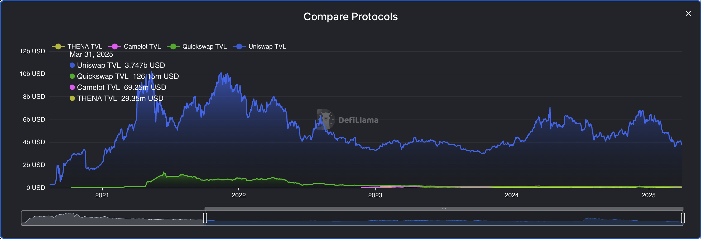
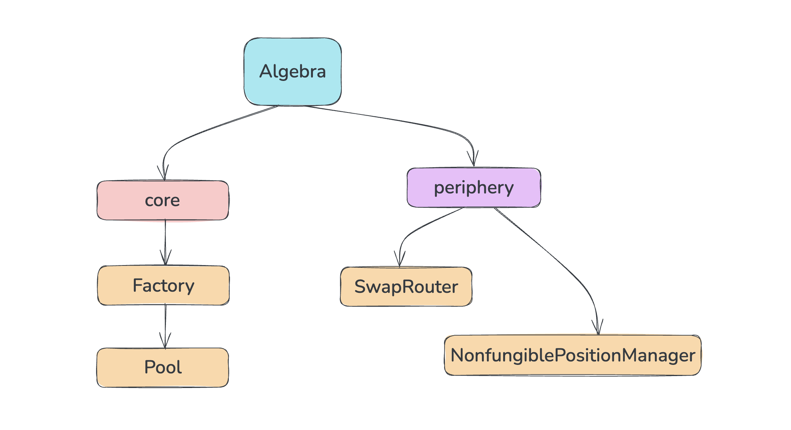
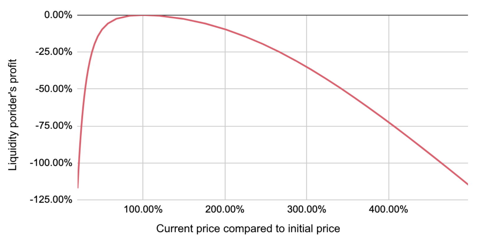
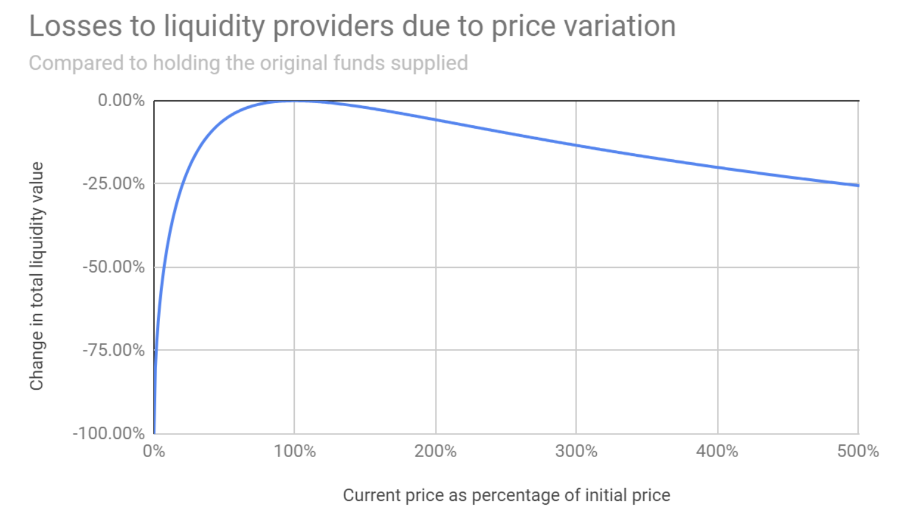
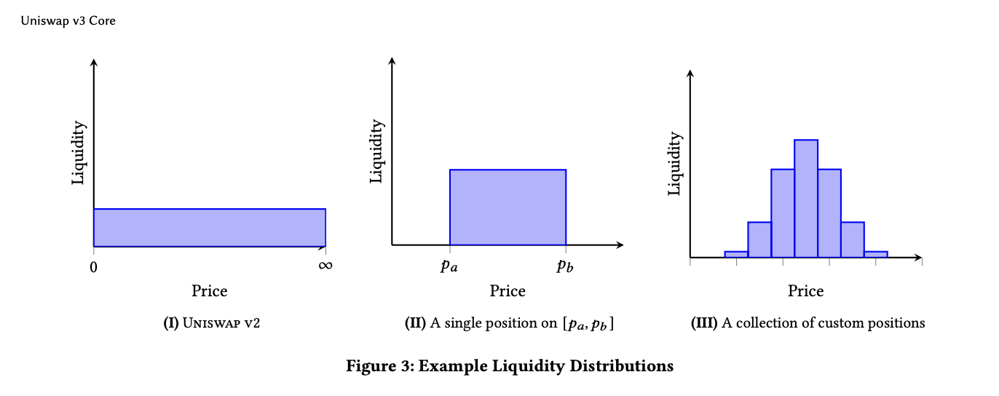
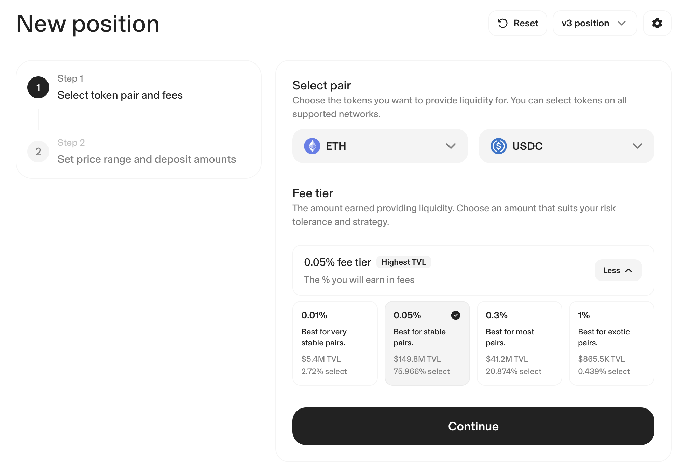
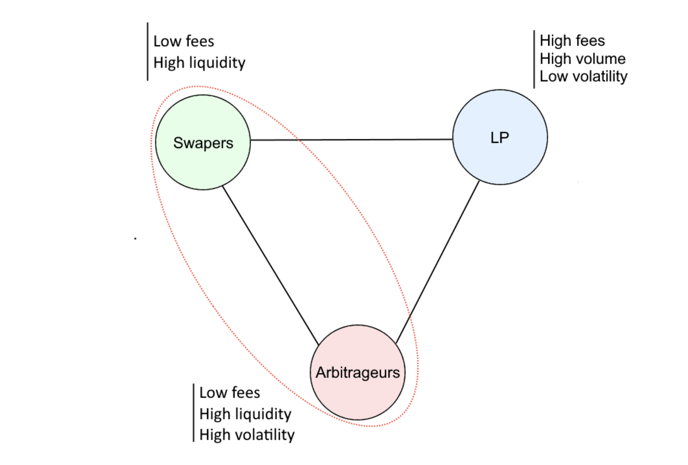
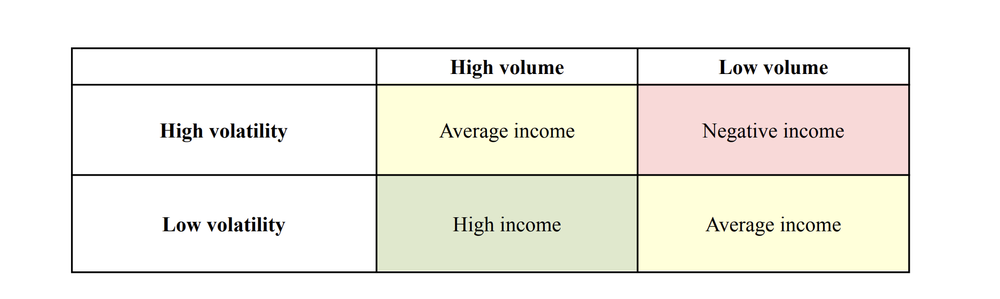
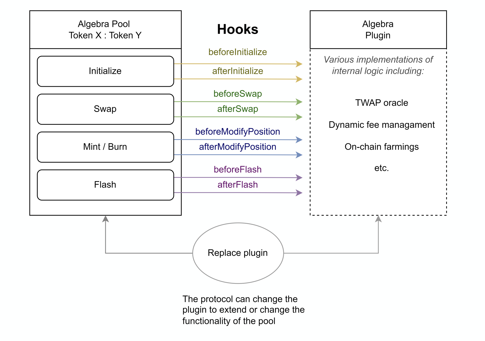

# Algebra Finance

**Автор:** [Роман Ярлыков](https://github.com/rlkvrv) 🧐

Algebra — это B2B-решение для DEX на базе AMM, которое позволяет развернуть обменник, core-функционал которого будет во многом схож с Uniswap v3. Сам протокол позиционирует себя как DEX-as-a-Service (DaaS). Основной упор сделан на концентрированную ликвидность и изменяемые комиссии (в Uniswap v3 комиссии фиксированы).

Протокол зарабатывает за счет так называемых _community fee_ - часть комиссий со всех обменов на DEX, использующих их код. БОльшую часть этих средств (около 70%) направляют на обратный выкуп токена ALGB для его сжигания и поддержки цены; остальное идет на развитие протокола. Токен ALGB можно стейкать, чтобы получать часть торговых сборов.

На данный момент решение интегрировали более 30 децентрализованных обменников. Но даже самые заметные из них - QuickSwap, Camelot и THENA - это скорее проекты уровня tier-2 с TVL в районе $100 млн. Они явно не дотягивают до лидеров рынка с миллиардными TVL и сотнями миллионов долларов оборота в день, но тем не менее заняли свою нишу.

Например, DEX’ы QuickSwap и Camelot входят в топ-30 среди всех децентрализованных бирж, которых на DeFi Lama насчитывается около 1400! Остальные DEX, интегрировавшие Algebra, показывают еще более скромные результаты.

  
_Сравнение первых трех (по успешности) DEX, интегрировавших Algebra, с Uniswap за период с 2021 по 2025 год. Источник: DeFi Lama_

## Контекст

Впервые я столкнулся с протоколом Algebra, когда мы с командой делали форк Camelot DEX. Первая версия Camelot - это форк Uni v2, а для следующей версии с поддержкой концентрированной ликвидности они интегрировали Algebra. Уже тогда мне стало интересно, в чем преимущество такого подхода.

Здесь есть две важные детали:

1. Каждая версия Uniswap защищена лицензией BUSL-1.1 - она запрещает коммерческое использование в производственной среде (production use) на определенный срок, если кто-то решит форкнуть протокол. Как правило, с выходом новой версии Uni лицензия на предыдущую уже истекает. При этом просмотр, модификация и использование кода в некоммерческих целях - например, для тестирования или разработки - разрешены.
2. Версия Uni v2 была чрезвычайно популярна для форков после окончания срока действия лицензии.

На этом фоне Algebra выбрали следующую стратегию: пока лицензия на Uniswap v3 оставалась в силе, они могли спокойно экспериментировать с кодом, выявлять его слабые места и думать, как их можно исправить.

Так появилась первая версия Algebra - фактически улучшенная версия Uniswap v3, с доработками и новыми фичами.

## Базовая архитектура

На базовом уровне устройство Algebra повторяет архитектуру Uniswap v3 - "DEX-движок" включает те же ключевые смарт-контракты.

  
_Базовая архитектура протокола Algebra_

- В ядро входят фабрика для создания пулов ликвидности и сам контракт пула.
- К периферии относятся роутер для добавления/удаления ликвидности и выполнения свопов, а также `NonfungiblePositionManager` - токен стандарта ERC721, отражающий позицию в пуле (о позициях расскажу позже).
- Контракты-хелперы и библиотеки (не отражены на схеме) также взяты из Uniswap.

С момента запуска протокол претерпел значительные изменения, но базовая структура остается актуальной - одной из ключевых задач по-прежнему остается сохранение совместимости с интерфейсами Uniswap v3.

Далее я постараюсь объяснить, за счет чего Algebra получила преимущество перед Uni v3. Придется довольно много говорить про сам Uniswap, но важно понимать одно: `Algebra == Uniswap + новые фичи`.

## Чем Uni v3 так хорош, чтобы его копировать?

Что входит в базовый функционал Uniswap v3? В чем заключается инновационность этого протокола, и почему его имело смысл использовать как "DEX-движок" для Algebra?

Пойдем по следующему пути: разберем, как Uni v3 переосмыслил саму идею децентрализованной биржи и собственные решения, реализованные в предыдущих версиях, а также как Algebra удалось пойти дальше и сделать еще лучше.

Какие недостатки были у Uniswap v2?

- **Impermanent loss (непостоянные потери)** - провайдеры ликвидности (Liquidity Providers) теряют потенциальную прибыль по сравнению со стратегией “hold”, если цена активов сильно колеблется.
- **Неэффективное использование капитала** - в Uniswap v2 ликвидность распределяется равномерно по всей ценовой кривой (от 0 до бесконечности), в то время как торговля обычно сосредоточена в узком диапазоне. Это означает, что большая часть капитала LP остается неактивной и не приносит доход.

Разберемся подробнее с феноменом непостоянных потерь - это важно для понимания основной проблематики.

**Почему происходят непостоянные потери?**

1. В AMM типа Uniswap провайдеры ликвидности (LP) вносят в пул пару активов (например, ETH и USDC). При этом их соотношение в пуле динамически меняется в зависимости от цен, чтобы поддерживать инвариант AMM - `x * y = k`.
2. Когда цена ETH растет, пул начинает автоматически продавать ETH (чтобы сохранить баланс), а когда падает - покупать. В итоге LP теряет потенциальную прибыль, которую мог бы получить, просто удерживая ETH на своем кошельке.

Таким образом, LP теряет прибыль как при росте цены ETH (у него остается меньше ETH), так и при ее падении (ETH становится больше, но его стоимость ниже). Во втором случае убытки даже сильнее.

**Роль комиссий**

Следующий важный фактор - комиссии пула, которые могут частично или полностью компенсировать impermanent loss. Рассмотрим это на двух графиках:

На первом - потери LP без учета комиссий:

  
_Сравнение убытков LP по отношению к стратегии "hold" при падении и росте цены актива без учета комиссий. Источник: Whitepaper Algebra_

Здесь видно, что если цена не изменяется (100% по оси X) LP ничего не теряет, но при значительном росте или падении цены убытки становятся ощутимыми.

Теперь график с учетом дохода от комиссий:

  
_Сравнение убытков LP по отношению к стратегии "hold" при падении и росте цены актива с учетом комиссий. Источник: статья ["What is Impermanent Loss?"](https://finematics.com/impermanent-loss-explained/)_

Как видно, потери при росте цены актива становятся гораздо менее значительными, потому что комиссии частично компенсируют недополученную прибыль. Но есть один важный момент: *в Uniswap v2 комиссия была фиксированной - 0.3% для всех пулов, вне зависимости от волатильности активов*.

**Как Uni v3 уменьшил влияние непостоянных потерь?**

В третьей версии протокола Uniswap снова совершил революцию - представил концепцию CLMM (Concentrated Liquidity Market Maker), или концентрированной ликвидности.

Вместо равномерного распределения ликвидности по всей ценовой шкале, как это было в Uniswap v2, LP в Uniswap v3 могут размещать свои активы в определенных ценовых диапазонах (называемых "позициями"). Например, если текущая цена ETH/USDC составляет 2000 USDC за 1 ETH, LP может предоставить ликвидность только в диапазоне от 1800 до 2200 USDC.

Ликвидность используется для свопов и взимает комиссии только тогда, когда текущая цена находится внутри заданного диапазона. Если цена выходит за пределы диапазона, позиция становится "неактивной" (не участвует в торгах), но активы по-прежнему остаются в безопасности. Позиции создаются в виде NFT и могут свободно продаваться на маркетплейсах, создавая вторичный рынок ликвидности.

Таким образом, LP может создать как одну позицию на узкий диапазон, так и несколько на разные участки ценовой кривой.

  
_Сравнение позиций в Uniswap v2 и v3. Источник: Whitepaper Uniswap v3_

Такие позиции помогают снизить влияние непостоянных потерь - у LP появляется возможность гибко выбирать стратегию в зависимости от уровня риска. Кроме того, новый подход позволяет значительно повысить эффективность использования капитала. Например, в Uniswap v2 `$10 000` могли приносить 1% дохода, а в v3 те же `$10 000`, сосредоточенные в активном диапазоне, могут приносить 10% и более.

**Пересмотр политики взимания комиссий**

Второе важное нововведение Uniswap v3 - это гибкая система комиссий. Для каждой пары активов Uniswap v3 предлагает несколько пулов с разными уровнями комиссий: 0.01%, 0.05%, 0.3% и 1%. Как правило, высокие комиссии (например, 1%) подходят для волатильных пар, где выше риски и impermanent loss, а низкие комиссии (например, 0.05%) - для стабильных пар.

На практике одна и та же пара может существовать сразу в нескольких пулах с разными комиссиями. Это создает баланс между интересами LP (выгодны высокие комиссии) и трейдеров (интересует низкое проскальзывание и комиссии).

Например, при добавлении ликвидности в пул ETH/USDC можно выбрать один из четырех уровней комиссии:

  
_Добавление ликвидности в пул ETH/USDC на Uniswap v3. Источник: приложение Uniswap_

В интерфейсе также отображаются доли ликвидности, распределенные между пулами с одинаковыми активами, но разными комиссиями. Несмотря на доминирование пула с комиссией 0.05%, около 20% ликвидности все еще находится в пуле с 0.3%.

**Подытожим: Uni v3 - это база, но есть нюансы**

Uni v3 сфокусировался на повышении эффективности использования капитала - то есть позволил зарабатывать больше при меньших вложениях. Но при этом все еще остались определенные недостатки:

- Да, комиссии стали гибче, но если нужно, чтобы у одной пары токенов были разные комиссии, придется "дробить" ликвидность на несколько пулов.

- Архитектура Uni v3 не поддерживает фарминг напрямую. Фарминг - это инструмент для привлечения дополнительной ликвидности, а у Uniswap с этим и так все неплохо. Поэтому одного форка Uni v3 недостаточно - нужно еще как-то стимулировать приток ликвидности.

- Нет поддержки fee-on-transfer токенов - это токены, которые взимают комиссию при каждом переводе, что влияет на итоговое количество средств, поступающих в пул ликвидности.

## С чего начиналась Algebra

Algebra в первой версии сфокусировалась на исправлении недостатков Uniswap, которые я описал выше. Больше всего работы было проделано над динамическими комиссиями - этой фиче в своем [whitepaper](https://algebra.finance/static/Algerbra%20Tech%20Paper-15411d15f8653a81d5f7f574bfe655ad.pdf) протокол уделяет особое внимание.

Итого, на рынок они вышли с тремя основными фичами:
1. Динамические комиссии  
2. Встроенный фарминг (работает "из коробки")  
3. Поддержка токенов с комиссией на перевод (fee-on-transfer)

### Динамические комиссии

Комиссии - краеугольный камень любого DEX. Чтобы угодить всем участникам рынка, они не должны быть слишком высокими или слишком низкими - в идеале они должны быть максимально гибкими. Для начала разберемся, кто эти участники и какие у них интересы:

1. Обычные трейдеры - просто обменивают токены и платят комиссии.  
2. Арбитражеры - зарабатывают на разнице цен между DEX или пулами.  
3. Провайдеры ликвидности (LP) - предоставляют капитал и рассчитывают на справедливое вознаграждение.

У каждой из этих групп свои интересы, и зачастую они противоречат друг другу:

- Трейдерам нужна высокая ликвидность и низкие комиссии
- Арбитражерам — высокая ликвидность + волатильность + низкие комиссии
- LP — высокие комиссии + высокая ликвидность + низкая волатильность

  
_Участники рынка и их интересы. Источник: Whitepaper Algebra_

Задача механизма комиссий - найти баланс между интересами всех сторон. Как мы обсуждали ранее в Uniswap v3 это реализовано через выбор фиксированных комиссий (0.05%, 0.3%, 1%). Проблема в том, что это ведет к фрагментации ликвидности между пулами.

Кроме того, поведение активов может со временем меняться. Например, актив, считавшийся стабильным, может быстро стать волатильным. В результате ликвидность может оказаться нерационально распределенной между пулами с разными комиссиями.

Algebra предлагает решение этой проблемы в виде **динамических комиссий**, которые адаптируются под поведение пула. Для этого анализируются три ключевых метрики:

1. Волатильность
2. Объем ликвидности
3. Объем торгов

Высокая доходность для LP достигается при высокой торговой активности и низкой волатильности:

  
_Зависимость доходности LP от поведения рынка. Источник: Whitepaper Algebra_

На практике это работает так:

- При высокой волатильности комиссия увеличивается, чтобы компенсировать риски LP
- При низкой торговой активности, но достаточной ликвидности, комиссия снижается, чтобы стимулировать больше обменов

Algebra использует гибкую формулу, учитывающую все эти параметры, и позволяет удерживать всю ликвидность в рамках одного пула, не распыляя ее по разным пулам. Таким образом в отличие от Uniswap v3 нет необходимости создавать к примеру два-три разных пула с разными комиссиями.

**Технические детали**

Реализация механизма динамических комиссий заслуживает отдельной статьи, но отметим ключевые моменты:

- Минимальная комиссия - 0.01%. Может быть изменена администратором фабрики после инициализации.
- Максимальная комиссия - 6.5535% (`type(uint16).max` при делителе `1e6`)
- Пересчет комиссии происходит при каждом взаимодействии с пулом (swap, добавление/удаление ликвидности), но фактический пересчет происходит только один раз за блок.
- За пересчет отвечает функция [DataStorageOperator::getFee](https://github.com/cryptoalgebra/AlgebraV1/blob/789384bc5084dd694f3d1e189250491086e44653/src/core/contracts/DataStorageOperator.sol#L150), использующая библиотеки `DataStorage` и `AdaptiveFee`.
- [Конфигурация](https://github.com/cryptoalgebra/AlgebraV1/blob/789384bc5084dd694f3d1e189250491086e44653/src/core/contracts/libraries/AdaptiveFee.sol#L10) позволяет задавать скорость изменения комиссии. Волатильность берется как среднее значение за 24 часа, что сглаживает колебания и повышает стабильность расчетов.

Подробности реализации формулы и математическое обоснование можно найти в [whitepaper](https://algebra.finance/static/Algerbra%20Tech%20Paper-15411d15f8653a81d5f7f574bfe655ad.pdf).

### Встроенный фарминг

В Algebra (как и в Uniswap v3) провайдеры ликвидности, добавляя ликвидность, получают NFT (ERC-721), которая отражает их позицию в пуле - диапазон цен, в котором работает их ликвидность. Однако в самом Uniswap нет возможности напрямую поощрять LP - для этого требуются внешние протоколы.

**В чем сложность фарминга в CLMM?**

Ликвидность работает только в определенном ценовом диапазоне. Соответственно, честное распределение наград должно учитывать:

- объем ликвидности;
- время, когда позиция была "в диапазоне" (in-range), то есть участвовала в свопах и зарабатывала комиссии;

Это делает традиционный механизм фарминга непригодным для CLMM-моделей. Algebra решила эту задачу, введя **виртуальный пул** (_Virtual Pool_), привязанный к основному пулу и отслеживающий его активность. Благодаря этому стало возможным справедливое распределение вознаграждений.

Виртуальный пул - это отдельный смарт-контракт (например такой - [LimitVirtualPool](https://github.com/cryptoalgebra/AlgebraV1/blob/main/src/tokenomics/contracts/farmings/limitFarming/LimitVirtualPool.sol)), который хранит и отслеживает только те параметры пула ликвидности, которые нужны для корректного расчета ревардов.

Работает Virtual Pool так:
1. В момент создания вируального пула происходит его привязка к основному пулу вызовом функции [FarmingCentre::connectVirtualPool](https://github.com/cryptoalgebra/AlgebraV1/blob/789384bc5084dd694f3d1e189250491086e44653/src/tokenomics/contracts/FarmingCenter.sol#L209);
2. После этого каждое обновление тика при свопах будет передаваться в виртульный пул через вызов [VirtualPool::cross](https://github.com/cryptoalgebra/AlgebraV1/blob/789384bc5084dd694f3d1e189250491086e44653/src/core/contracts/AlgebraPool.sol#L832-L834), чтобы он обновил необходимые для расчетов параметры;
3. Также виртуальный пул может получать данные от основного пула когда ему это необходимо, например [так](https://github.com/cryptoalgebra/AlgebraV1/blob/789384bc5084dd694f3d1e189250491086e44653/src/tokenomics/contracts/farmings/eternalFarming/AlgebraEternalFarming.sol#L176).

В результате, в протоколе появилась возможность запускать **фарминг-кампании** - временные программы поощрения, связанные с конкретными пулами ликвидности.

**Как работает фарминг-кампания?**

- Каждая кампания содержит определенное количество токенов наград.
- LP должны отправить свой ERC-721 токен в контракт фарминга.
- Токены остаются заблокированными до окончания кампании.
- После завершения кампании вознаграждения распределяются, и позиции возвращаются владельцам.

**Как рассчитываются реварды?**

Сначала определяется время активности ликвидности:

```bash
secondsPerLiquidity = rangeSecondsInside / rangeLiquidity
```

где:

- `rangeSecondsInside` - время, когда цена находилась внутри диапазона;
- `rangeLiquidity` - общая ликвидность в этом диапазоне.

Затем рассчитывается вклад конкретной позиции:

```bash
positionSecondsInside = secondsPerLiquidity * positionLiquidity
```

И, наконец, итоговое вознаграждение:

```bash
reward = (totalReward * positionSecondsInside) / campaignDuration
```

где:

- `totalReward` - общий объем наград в кампании;
- `campaignDuration` - длительность кампании.

Перерасчет происходит при каждом свопе в пуле или при подключении нового участника к кампании.

**Виды фарминга**

В версии Algebra v1 доступны два типа фарминга:

|                              | **Временный (лимитный)**                                                                                                                           | **Постоянный (вечный)**                                                                                                                                  |
| ---------------------------- | -------------------------------------------------------------------------------------------------------------------------------------------------- | -------------------------------------------------------------------------------------------------------------------------------------------------------- |
| **Смарт-контракт**                 | [AlgebraLimitFarming](https://github.com/cryptoalgebra/AlgebraV1/blob/main/src/tokenomics/contracts/farmings/limitFarming/AlgebraLimitFarming.sol) | [AlgebraEternalFarming](https://github.com/cryptoalgebra/AlgebraV1/blob/main/src/tokenomics/contracts/farmings/eternalFarming/AlgebraEternalFarming.sol) |
| **Срок проведения кампании** | Фиксированные даты начала и окончания                                                                                                              | Нет фиксированного срока                                                                                                                                 |
| **Блокировка позиции**       | LP должны заранее заблокировать позицию                                                                                                            | NFT не блокируется, можно входить и выходить в любой момент                                                                                              |
| **Условия выхода**           | Вывести позицию до окончания кампании нельзя                                                                                                       | LP могут отключиться в любой момент                                                                                                                      |
| **Условия работы**           | Кампания завершается по истечении срока                                                                                                            | Работает до тех пор, пока поступают реварды                                                                                                              |

### Поддержка токенов с комиссией на перевод (Fee-on-Transfer)

Algebra в первой версии добавила поддержку токенов с комиссией на перевод, включая дефляционные токены, у которых общее предложение может уменьшаться в процессе транзакций. 

Примеры таких токенов:
- Токены, где часть суммы сжигается при каждом переводе, сокращая общее предложение.
- Токены, где взимается комиссия при переводе, и эта комиссия сжигается.
- Токены с другими механизмами комиссии, которые могут не быть дефляционными, но влияют на количество получаемых токенов.

Для корректной работы с такими активами в Algebra реализована функция  
[swapSupportingFeeOnInputTokens](https://github.com/cryptoalgebra/AlgebraV1/blob/789384bc5084dd694f3d1e189250491086e44653/src/core/contracts/AlgebraPool.sol#L626C12-L626C42).  
Она определяет фактическое количество токенов, поступивших в пул после всех удержаний, включая сжигание, что позволяет корректно проводить свопы.

В отличие от Uniswap v3, где поддержка подобных токенов требует создания токенов-обёрток, Algebra обрабатывает такие активы нативно, упрощая взаимодействие.

### Новые фичи версии v1.9

Перед выпуском второй версии протокола Algebra представила промежуточное обновление - [Algebra v1.9](https://github.com/cryptoalgebra/AlgebraV1.9). Это минорный релиз, но его стоит упомянуть для понимания эволюции протокола. В этой версии разработчики сфокусировались на оптимизации контрактов, улучшении работы с тиками и добавлении новых возможностей. Рассмотрим ключевые изменения.

**Настраиваемый tickspacing**

**Tickspacing** — это интервал между ценовыми уровнями (тиками) в пуле, который определяет, насколько точно можно задать диапазон концентрированной ликвидности. Чем больше значение tickspacing, тем больше доступных ценовых интервалов и выше гибкость настройки диапазона, но это также увеличивает затраты на газ.

В предыдущих версиях значение tickspacing задавалось константой и было равно 60. В v1.9 разработчики разрешили настраивать этот параметр, ограничив максимальное количество интервалов до 500. Это дало возможность более точно управлять диапазонами, особенно это актуально для стабильных пар (например, USDC/USDT), где важно более точно задавать интервалы.

**Лимитные ордера**

В версии v1.9 появился новый функционал - лимитные ордера. Лимитные ордера позволяют автоматически закрывать позиции по заранее заданным ценам, снижая влияние на цену. Но здесь нужно понимать, что это отдельный продукт, просто он работает с кодовой базой (ядром) первой версии протокола.

## Новый этап эволюции Algebra

Недавно вышла четвертая версия Uniswap, код которой снова закрыт лицензией сроком на 2,5 года. В начале статьи я уже упоминал, что все версии Uniswap защищены от копирования с помощью лицензии. В случае с первой версией команда Algebra просто дождалась окончания ее действия.

На этот раз, чтобы не ждать окончания лицензии, Algebra поступили хитрее - новая версия протокола **Algebra Integral (v2)** будет по-прежнему основана на Uniswap v3, но с добавлением хуков, как в Uniswap v4. Это позволит перейти к модульной архитектуре и реализовать поддержку плагинов.

С таким подходом не получится сделать DEX, который превзойдет Uni v4, но реализовать схожие фичи и при этом не нарушить лицензию - вполне возможно.

**DEX из модулей вместо монолита**

Одна из ключевых фич четвертого Uniswap - модульная архитектура. Идея модульного DEX заключается в создании простого, надежного и безопасного ядра, которое можно расширять внешними модулями (плагинами). Не каждому пулу нужны, скажем, динамические комиссии или TWAP-оракул, а наличие такого функционала может серьезно увеличивать расходы на газ.

Прежний подход к построению DEX всегда предполагал монолитную структуру, которая не позволяла отказаться от ненужных функций. Но если вынести эти функции "наружу", тот, кто создает пул, получает возможность самостоятельно подключать дополнительные "фичи" при необходимости.

Algebra удалось внедрить модульность за счет плагинов. Такой подход, в теории, также позволяет добавлять новый функционал для DEX без необходимости миграции ликвидности.

### Плагины

Плагины в Algebra Integral — это смарт-контракты, которые можно подключить к пулу ликвидности для расширения его функционала. На данный момент к пулу может быть подключен только один плагин. Его можно отключить или заменить на другой.

Теоретически новая архитектура протокола позволяет реализовать прокси-плагин, который даст возможность подключать несколько плагинов одновременно (протокол планирует разработать такой плагин в будущем).

**Плагины могут:**

- выполнять произвольные действия в блокчейне (в том числе вызывать другие контракты),
- изменять комиссии в пуле,
- проводить дополнительные проверки или выполнять другую внешнюю логику.

**Плагины не могут:**

- напрямую работать с ликвидностью,
- изменять основные математические формулы работы пула.

**Хуки**

Каждый плагин взаимодействует с пулом через **хуки** — специальные callback-функции, которые вызываются до и после выполнения ключевых операций пула: инициализация, изменение позиции, своп, флэш-кредит и т.д. Это позволяет "встраиваться" в работу пула и выполнять необходимую внешнюю логику.

  
_Схема работы хуков в Algebra. Источник: документация Algebra Integral_

**Примеры существующих плагинов**

- **TWAP Oracle**. Предоставляет доступ к историческим данным о ценах и волатильности - полезно для торговых стратегий и управления рисками.

- **Adaptive Fee**. Рассчитывает динамическую комиссию, адаптируясь к изменению волатильности торговой пары. Это позволяет эффективнее настраивать ценообразование.

- **Farming**. Интегрирует механизмы фарминга, позволяя пользователям получать дополнительные вознаграждения за предоставление ликвидности.

Также ведется разработка новых плагинов. В будущем планируется создание маркетплейса, где сторонние разработчики смогут предлагать собственные решения.

Подробнее о плагинах можно прочитать [в документации](https://docs.algebra.finance/algebra-integral-documentation/algebra-integral-technical-reference/plugins).

### Другие небольшие улучшения v2

Помимо внедрения модульной архитектуры, в версии v2 были реализованы и [другие, более мелкие изменения](https://github.com/cryptoalgebra/algebra-integral-docs/blob/main/changes-after-v1.md):

- Контракты переписаны на актуальную версию Solidity (0.8.20), все `require` заменены на `custom errors`, а также проведены дополнительные оптимизации по расходу газа.
- Для работы с `tickspacing` теперь используется связный список, благодаря чему увеличение количества интервалов не ведет к росту затрат на газ.
- Изменения, связанные с фармингом:
  - логика фарминга вынесена в отдельный плагин;
  - из протокола удалена возможность создания временного (limit) фарминга, потому что подобные пулы практически не использовались;
  - больше не требуется отправлять NFT на адрес контракта фарминга — достаточно увеличить или уменьшить позицию, которая участвует в кампании.
- Добавлено более гибкое управление пулами с использованием `AccessControl`.
- Упрощена и переработана логика работы с `community fee`.
- Механизм динамических комиссий не только вынесен в отдельный плагин, но и упрощен, что дополнительно снизило издержки на газ.

## Заключение

Протокол Algebra Finance прочно занял свою нишу в мире DeFi. Проект продолжает развиваться и предлагать решения, соответствующие актуальным трендам децентрализованных обменников. В любом случае, конкуренция - это хорошо.

При этом команду протокола уже нельзя обвинить в слепом копировании: например, все "инновации" Uniswap v4 уже [были так или иначе реализованы в других протоколах](https://arc.net/l/quote/tjrlogva). В целом, DeFi - это высококонкурентная среда, где хорошие идеи быстро распространяются и внедряются повсеместно. Иначе - велик риск остаться за бортом.

## Ссылки

- [Docs: Algebra finance](https://docs.algebra.finance/algebra-integral-documentation)
- [Github: Algebra](https://github.com/cryptoalgebra/Algebra)
- [Whitepaper: ALGEBRA Ecosystem: Decentralized exchange](https://algebra.finance/static/Algerbra%20Tech%20Paper-15411d15f8653a81d5f7f574bfe655ad.pdf)
- [Article: What is impermanent loss?](https://finematics.com/impermanent-loss-explained/)
- [Article: The Ultimate Algebra Solution for DEXs vs. Uniswap V3](https://medium.com/%40crypto_algebra/the-ultimate-algebra-solution-for-dexs-vs-uniswap-v3-4832a39d8d82)
- [Article: Introducing Algebra V1.9: The Perfect Blend of Innovation & Efficiency](https://medium.com/@crypto_algebra/introducing-algebra-v1-9-the-perfect-blend-of-innovation-efficiency-eb7a419c21fe)
