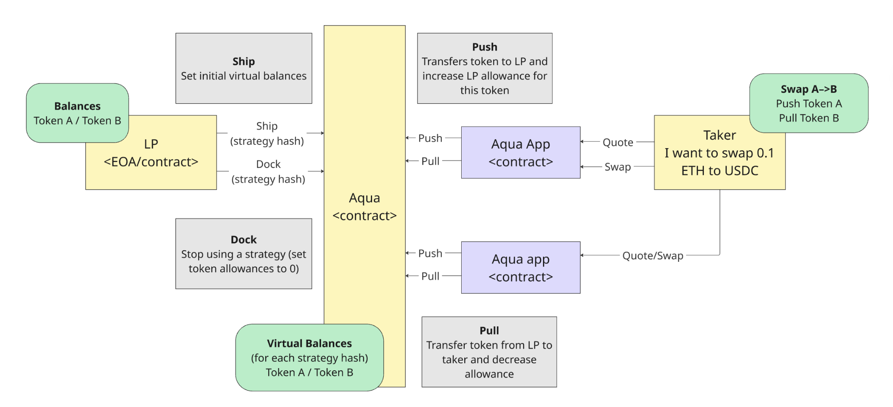
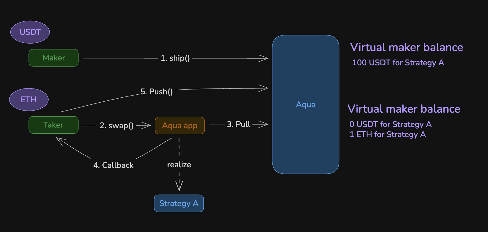
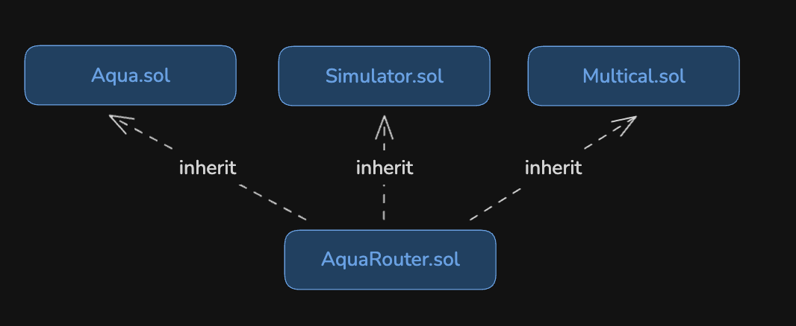

# Aqua protocol

**Автор:** [Павел Найданов](https://github.com/PavelNaydanov) 🕵️‍♂️

[Aqua](https://1inch.com/aqua) - это протокол для управления ликвидностью (shared liquidity layer), разработанный командой 1inch, который позволяет поставщикам ликвидности предоставлять активы сразу в несколько торговых стратегий без необходимости блокировать их в пулах ликвидности.

Вместо того, чтобы лочить ликвидность, поставщик или мейкер устанавливает виртуальные балансы на смарт-контракте Aqua и указывает стратегию в которой эти балансы будут доступны для использования.

Описывается функциональность протокола красивым слоганом *"Shared liquidity to unlock DeFi capital"*.

**Постановка проблемы**

Протокол призван решить три проблемы:
- **Неэффективность использования капитала:** Исследования 1inch показывают, что лишь малая часть ликвидности в пулах участвует на рынке. Большую часть времени эта ликвидность нужна для ценообразования при обмене.
- **Фрагментация ликвидности:** С точки зрения поставщика ликвидности, капитал должен распределяться между различными протоколами, каждый из которых имеет свои собственные пулы, уровни комиссий и механизмы. Это довольно трудозатратный процесс.
- **Заблокированность капитала:** Ликвидность, предоставленная в традиционный пул ликвидности, не может быть использована в сторонних протоколах, DAO, заимствовании и других стратегиях заработка. Что приводит к невозможности использования ликвидности одновременно с предоставлением в пулы. Это возвращает нас к неэффективному использованию капитала из пункта 1.

|Проблема|Традиционные AMM|Aqua|
|--------|----------------|----|
|Idle liquidity| 85-97% ликвидности простаивает|Один и тот же капитал работает в нескольких стратегиях|
|Fragmentation|Капитал делится по пулам/протоколам|Одна ликвидность участвует в нескольких стратегиях|
|Locked capital|Токены теряют composability|Средства остаются у мейкера|

## Как это работает на практике?

Работа протокола очень хорошо и понятно задокументирована в [whitepaper](https://github.com/1inch/aqua/blob/main/whitepaper/aqua-dev-preview.md).


// Схема взята из whitepaper

**Основной workflow:**

- `ship()` — Мейкер устанавливает виртуальные балансы для стратегии
- `dock()` — Мейкер обнуляет виртуальные балансы для стратегии
- `pull()` — Стратегия забирает токены у мейкера при свопе в пользу тейкера
- `push()` — Тейкер отправляет токены в пользу мейкера

**Пояснения к workflow:**

Мейкер устанавливает виртуальные балансы на Aqua через функции [ship()](https://github.com/1inch/aqua/blob/main/src/Aqua.sol#L40) и [dock()](https://github.com/1inch/aqua/blob/main/src/Aqua.sol#L54) для использования активов в конкретных приложений (на схеме Aqua App) и стратегий.

Стратегия - это способ использования ликвидности мейкера. По сути, это реализация через смарт-контракты, которая дополнительно регламентирует взаимодействие тейкера с ликвидностью мейкера.

> Почему дополнительно? Потому что частично это уже делает смарт-контракт Aqua, он обновляет балансы пользователя и делает физический трансфер активов. Однако ценообразование обмена, условия, процесс - все это реализуется внутри смарт-контракта Aqua App/стратегии.

Тейкер взаимодействует c приложением, которое вызывает функции в Aqua [push()](https://github.com/1inch/aqua/blob/main/src/Aqua.sol#L72) и [pull()](https://github.com/1inch/aqua/blob/main/src/Aqua.sol#L63). и это производит фактический обмен между тейкером и мейкером попутно обновляя виртуальные балансы на смарт-контракте Aqua.

Возьмем [пример](https://github.com/1inch/aqua/blob/main/examples/apps/XYCSwap.sol), предоставленный разработчиками, который выполняет свап между мейкером и тейкером через Aqua App, которое реализует стратегию A.

Внимание на схему ниже. Схема реализует процесс в котором тейкер обменивает ETH на USDT мейкера.



1. Сначала мейкер должен разрешить для стратегии A использовать свой USDT. Для этого вызывает функцию `ship(address app, bytes calldata strategy, [USDT], [100e6]))`. Это установит виртуальный баланс USDT мейкера для использования в стратегии А.
2. Теперь тейкер может вызвать функцию `swap()` на смарт-контракте `AquaApp.sol`. Это инициирует обмен ETH на USDT.
3. `AquaApp.sol` будет под капотом рассчитывать курс обмена и вызывать функцию `pull()`, которая переведет USDT тейкеру от мейкера.
4. `AquaApp.sol` сделает обратный вызов на тейкера (подразумевается, что тейкер - это смарт-контракт в этой схеме).
5. Внутри этого обратного вызова, тейкер проверит поступление USDT и вызовет функцию `push()` на Aqua, которая переведет ETH мейкеру от тейкера.

## Смарт-контракты Aqua

В этом разделе разберем смарт-контракты протокола Aqua. Для этого посмотрим код, который они реализуют.

Общий список смарт-контрактов:
- [AquaApp](https://github.com/1inch/aqua/blob/main/src/AquaApp.sol): Базовый смарт-контракт для создания приложений работающих с Aqua
- [Aqua](https://github.com/1inch/aqua/blob/main/src/Aqua.sol): Core смарт-контракт, который реализует протокол и регламентирует обмен между мейкером и тейкером
- [BalanceLib](https://github.com/1inch/aqua/blob/main/src/libs/Balance.sol): вспомогательная библиотека для работы с хранилищем в котором будут храниться виртуальные балансы мейкера
- [AquaRouter](https://github.com/1inch/aqua/blob/main/src/AquaRouter.sol): Точка входа для взаимодействия с протоколом

## Aqua app

Для того, чтобы мейкер смог предоставить ликвидность в стратегию необходимо эту стратегию создать. Здесь нужны "билдеры приложений", которые реализуют стратегию. Здесь предлагается использовать базовый смарт-контракт [AquaApp.sol](https://github.com/1inch/aqua/blob/main/src/AquaApp.sol), от которого ваш смарт-контракт должен наследоваться.

```solidity
import { TransientLock, TransientLockLib } from "@1inch/solidity-utils/contracts/libraries/TransientLock.sol";
import { IAqua } from "./interfaces/IAqua.sol";

// Базовый смарт-контракты для приложения
abstract contract AquaApp {
    using TransientLockLib for TransientLock;

    ...

    // Адрес смарт-контракта Aqua
    IAqua public immutable AQUA;

    // Хранилище состояния для защиты от реентранси
    mapping(address maker => mapping(bytes32 strategyHash => TransientLock)) internal _reentrancyLocks;

    // Модификатор для защиты стратегии от реентранси
    modifier nonReentrantStrategy(address maker, bytes32 strategyHash) {
        _reentrancyLocks[maker][strategyHash].lock();
        _;
        _reentrancyLocks[maker][strategyHash].unlock();
    }

    constructor(IAqua aqua) {
        AQUA = aqua;
    }

    // Внутренняя функция, которую ваш смарт-контракт должен использовать для того, чтобы сделать процесс передачи активов от тейкера мейкеру безопасным.
    function _safeCheckAquaPush(address maker, bytes32 strategyHash, address token, uint256 expectedBalance) internal view {

        require(_reentrancyLocks[maker][strategyHash].isLocked(), MissingNonReentrantModifier());

        (uint256 newBalance,) = AQUA.rawBalances(maker, address(this), strategyHash, token);
        require(newBalance >= expectedBalance, MissingTakerAquaPush(token, newBalance, expectedBalance));
    }
}
```

Как вы можете заметить, регламент создания вашего смарт-контракта для приложения совсем не строгий. Выглядеть приложение концептуально должно следующим образом.

```solidity
contract MyAquaApp is AquaApp {
    // Параметры стратегии
    struct Strategy {
        address maker;
        address token0;
        address token1;
        uint256 feeBps;
        bytes32 salt; // Соль, которая сделает стратегию уникальной
    }

    constructor(IAqua aqua) AquaApp(aqua) { }

    // Функция свапа
    function swapExactIn(
        Strategy calldata strategy,
        bool zeroForOne,
        uint256 amountIn,
        uint256 amountOutMin,
        address to,
        bytes calldata takerData
    )
        external
        // Защита от реентранси
        nonReentrantStrategy(strategy.maker, keccak256(abi.encode(strategy)))
        returns (uint256 amountOut)
    {
        bytes32 strategyHash = keccak256(abi.encode(strategy));

        // Логика расчета amountOut
        require(amountOut >= amountOutMin, InsufficientOutputAmount(amountOut, amountOutMin));

        // Передача активов тейкеру от мейкера
        AQUA.pull(strategy.maker, strategyHash, tokenOut, amountOut, to);

        // Обратный вызов на тейкера где он может выполнить дополнительные действия или проверить поступление активов от мейкера
        ISwapCallback(msg.sender).swapCallback(tokenIn, tokenOut, amountIn, amountOut, strategy.maker, address(this), strategyHash, takerData);

        // Проверка безопасной передачи активов мейкеру от тейкера
        _safeCheckAquaPush(strategy.maker, strategyHash, tokenIn, balanceIn + amountIn);
    }
}
```

Нужно отметить, что "билдеры приложений" - это сущность абстрагированная, которая обозначает создателей стратегий. При этом любой может создавать приложения/стратегии. То есть нет ограничений мейкеру в создании своей стратегии под свою ликвидность, работающую через Aqua.

## Aqua

В этом разделе посмотрим на центральный смарт-контракт [Aqua.sol](https://github.com/1inch/aqua/blob/main/src/Aqua.sol) ради которого мы здесь и собрались. Код очень простой и его совсем немного. Буквально 81 строчка.

Ключевое здесь - это хранение виртуальных балансов, которое представляет собой mapping всех возможных ключей для идентификации кто, кому, сколько и как предоставил ликвидность для использования.

```solidity
struct Balance {
    uint248 amount;
    uint8 tokensCount;
}

mapping(address maker =>
    mapping(address app =>
        mapping(bytes32 strategyHash =>
            mapping(address token => Balance)))) private _balances;
```

Стоит обратить внимание, что в `Balance` хранится не только `amount` (сумма токена, разрешенная для стратегии), но и `tokensCount` - количество всех токенов в стратегии.

Это позволяет экономить газ на чтении их хранилища. В библиотеке [Balance.sol](https://github.com/1inch/aqua/blob/main/src/libs/Balance.sol#L39) `amount` и `tokensCount` упаковываются в один слот.

Лексически можно было бы для хранения `tokensCount` реализовать отдельный mapping, но это добавило бы лишнее чтение из storage.

### Роутер

Смарт-контракт [AquaRouter.sol](https://github.com/1inch/aqua/blob/main/src/AquaRouter.sol) является точкой входа для взаимодействия с протоколом.



Код роутера пустой и просто наследует функционал:
1. [Aqua.sol](https://github.com/1inch/aqua/blob/main/src/Aqua.sol): основной функционал учета виртуальных балансов.
2. [Simulator.sol](https://github.com/1inch/solidity-utils/blob/master/contracts/mixins/Simulator.sol): для безопасной симуляции вызовов через delegatecall без изменения состояния блокчейна.
3. [Multicall.sol](https://github.com/1inch/solidity-utils/blob/master/contracts/mixins/Multicall.sol): позволяет выполнить несколько вызовов роутера в его контексте и в одной транзакции

Смарт-контракты `Simulator.sol` и `Multicall.sol` используют опкод `delegatecall` для делегирования вызова и выполнения операции в контексте `Aqua.sol`.

```solidity
contract Simulator {
    error Simulated(address delegatee, bytes data, bool success, bytes result);

    function simulate(address delegatee, bytes calldata data) external payable {
        (bool success, bytes memory result) = delegatee.delegatecall(data);
        // Прерывает выполнение транзакции и возвращает данные о вызове
        revert Simulated(delegatee, data, success, result);
    }
}
```

```solidity
contract Multicall {
    function multicall(bytes[] calldata data) external {
        for (uint256 i = 0; i < data.length; i++) {
            // Вызов операций на самом себе
            (bool success,) = address(this).delegatecall(data[i]);
            if (!success) {
               // Обработка неуспешного вызова
               ...
            }
        }
    }
}
```

### Функция ship

Чтобы мейкеру предоставить ликвидность необходимо на смарт-контракте Aqua вызвать функцию [ship()](https://github.com/1inch/aqua/blob/main/src/Aqua.sol#L40). Эта функция установит виртуальные балансы на Aqua.

При этом, физически, активы остаются у мейкера или на контракте или EOA в зависимости от того, как мейкер интегрируется с Aqua.

Посмотрим на код функции `ship()`.

```solidity
function ship(address app, bytes calldata strategy, address[] calldata tokens, uint256[] calldata amounts) external returns(bytes32 strategyHash) {
    // Хешируем данные стратегии
    strategyHash = keccak256(strategy);
    uint8 tokensCount = tokens.length.toUint8();

    // Проверяем, что не превышено максимальное количество токенов, для которых мейкер может добавить виртуальные балансы
    require(tokensCount != _DOCKED, MaxNumberOfTokensExceeded(tokensCount, _DOCKED));

    emit Shipped(msg.sender, app, strategyHash, strategy);
    for (uint256 i = 0; i < tokens.length; i++) {
        Balance storage balance = _balances[msg.sender][app][strategyHash][tokens[i]];

        // Проверяем, что по токену балансы нулевые
        require(balance.tokensCount == 0, StrategiesMustBeImmutable(app, strategyHash));

        // Записываем виртуальные балансы
        balance.store(amounts[i].toUint248(), tokensCount);
        emit Pushed(msg.sender, app, strategyHash, tokens[i], amounts[i]);
    }
}
```

### Функция dock

Чтобы мейкеру снять ликвидность необходимо вызвать функцию [dock()](https://github.com/1inch/aqua/blob/main/src/Aqua.sol#L54). Вызов этой функция обнулит виртуальные балансы на смарт-контракте Aqua.

Посмотрим на код функции `dock()`.

```solidity
function dock(address app, bytes32 strategyHash, address[] calldata tokens) external {
    for (uint256 i = 0; i < tokens.length; i++) {
        // Получаем виртуальные балансы из хранилища
        Balance storage balance = _balances[msg.sender][app][strategyHash][tokens[i]];

        // Проверяем, что количество токенов совпадает с установленными
        require(balance.tokensCount == tokens.length, DockingShouldCloseAllTokens(app, strategyHash));

        // Обнуляем виртуальные балансы по токену
        balance.store(0, _DOCKED);
    }
    emit Docked(msg.sender, app, strategyHash);
}
```

### Функция pull

Для того, чтобы тейкер мог использовать ликвидность мейкера необходимо вызвать функцию [pull()](https://github.com/1inch/aqua/blob/main/src/Aqua.sol#L63) на смарт-контракте Aqua. Вызов этой функции обновит балансы мейкера и переведет активы от мейкера тейкеру.

```solidity
function pull(address maker, bytes32 strategyHash, address token, uint256 amount, address to) external {
    Balance storage balance = _balances[maker][msg.sender][strategyHash][token];
    (uint248 prevBalance, uint8 tokensCount) = balance.load();

    // Обновление баланса
    balance.store(prevBalance - amount.toUint248(), tokensCount);

    // Трансфер от мейкера к тейкеру
    IERC20(token).safeTransferFrom(maker, to, amount);
    emit Pulled(maker, msg.sender, strategyHash, token, amount);
}
```

### Функция push

Для того, чтобы тейкер мог передать свою часть актива мейкеру необходимо вызвать функцию [push()](https://github.com/1inch/aqua/blob/main/src/Aqua.sol#L63) на смарт-контракте Aqua. Вызов этой функции обновит балансы тейкера и переведет активы от тейкера к мейкеру.

```solidity
function push(address maker, address app, bytes32 strategyHash, address token, uint256 amount) external {
    Balance storage balance = _balances[maker][app][strategyHash][token];
    (uint248 prevBalance, uint8 tokensCount) = balance.load();
    require(tokensCount > 0 && tokensCount != _DOCKED, PushToNonActiveStrategyPrevented(maker, app, strategyHash, token));

    // Обновление баланса мейкера
    balance.store(prevBalance + amount.toUint248(), tokensCount);

    // Трансфер от тейкера к мейкеру
    IERC20(token).safeTransferFrom(msg.sender, maker, amount);
    emit Pushed(maker, app, strategyHash, token, amount);
}
```

## Риски или что нужно знать

Протокол не панацея, он не решает все существующие проблемы, которые есть в уже классических AMM с их пулами. Например, нужно понимать, что защита от фронтран атак в Aqua ровно такая же, как и в Uniswap. Никакая! В каком-то понимании в Uniswap есть защита от проскальзывания, тогда как в Aqua это остается на стороне "билдеров приложений".

В моменте мейкеры будут также подвержены непостоянным потерям. Хотя тут это будет сильно зависеть от стратегии.

**Защита от скама**

Мейкер, который установил виртуальные балансы для стратегии злоумышленника потеряет свои активы. В этом плане мейкеры должны по-прежнему осознано предоставлять свою ликвидность в различные стратегии.

**Надежность мейкера**

Тейкер реализующий интеграцию с мейкером должен понимать, что виртуальные балансы в Aqua не гарантируют фактическое наличие активов. Поэтому выбор мейкера и маршрутизация обмена между разными мейкерами через Aqua по-прежнему остается задачей тейкера.

Aqua в этом плане не должна гарантировать реальный баланс мейкера, она всего лишь промежуточный слой.

**Экономические потери мейкера**

Выбранная стратегия не всегда может оказаться выгодной. Поэтому нужно помнить про золотые правила:
- Диверсифицируйте стратегии по различным типам
- Отслеживайте соотношение виртуального и реального баланса
- Устанавливайте балансы в соответствии с потребностями стратегии

**Взлом смарт-контракта**

От взлома можно защититься только проходя через множественные аудиты. В этом плане сама Aqua проста и я не думаю, что в ней останутся возможности для хакеров. Однако их поле битвы будет в стратегиях. Поэтому стратегии должны создаваться с максимально возможными и современными способами защиты.

## Вывод

Протокол не является новым типом DEX, не является полноценно продуктом. Это инструмент, который должен позволить мейкерам предоставлять свою ликвидность без необходимости лочить ее.

Архитектура Aqua основана на системе виртуальных балансов, которая управляет ликвидностью без необходимости ее хранения. Это позволяет нескольким стратегиям совместно использовать одну и ту же ликвидность, сохраняя при этом средства под контролем мейкера.

Безусловно то, что мейкерам должно стать сильно проще и выгоднее предоставлять свой капитал через Aqua протокол. Затраты тейкеров могут увеличиться за счет поиска нужного мейкера, поиска стратегии, увеличения затрат газа, если стратегия сложная. Но при этом расходы могут быть нивелированы эффективностью стратегии.

При этом, при всем, для "билдеров приложений" открывается новое конкурентное пространство, где они могут попробовать свои силы в создании успешных стратегий.

На мой взгляд, Aqua - это переосмысление процесса управления ликвидностью. И пожалуй это одно из самых интересных новинок в DeFi конца 2025-го, начала 2026-го. Ждем появление новых стратегий на базе Aqua.

P.S. Интерес 1inch в создании Aqua находится в их собственной стратегии под названием [SwapVm](https://github.com/1inch/swap-vm). Но это совсем другая история!

## Links

1. [Whitepaper](https://github.com/1inch/aqua/blob/main/whitepaper/aqua-dev-preview.md)
2. [Репозиторий с кодом](https://github.com/1inch/aqua/blob/main/README.md)
3. Аналитический [дашборд](https://dune.com/1inch/idle) 1inch. Показывает неэффективность использования капитала внутри пулов ликвидности