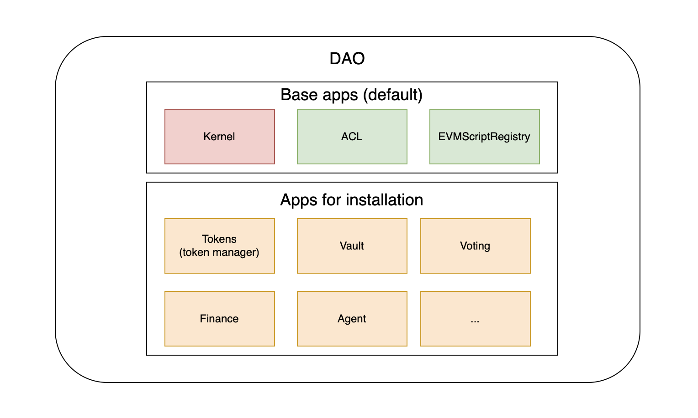
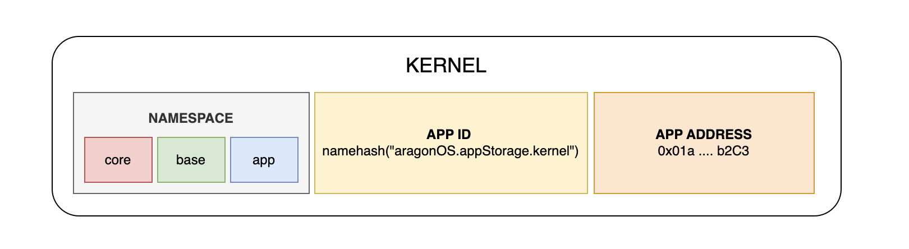
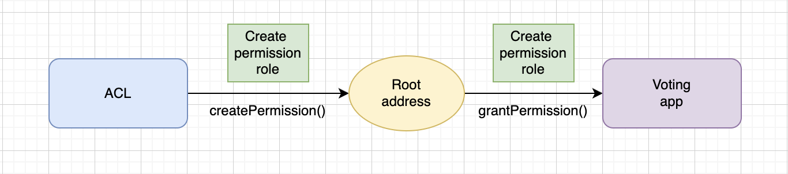
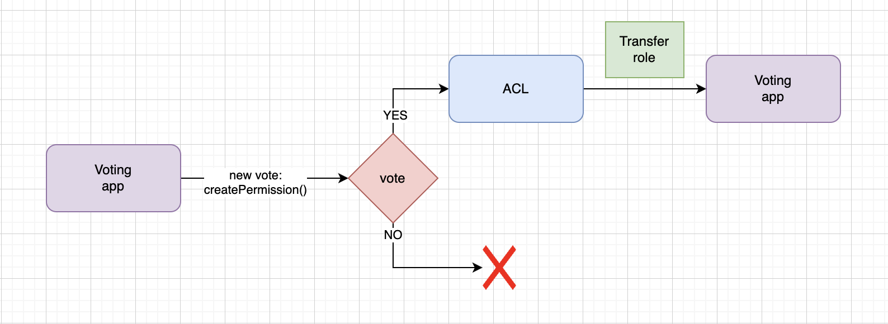
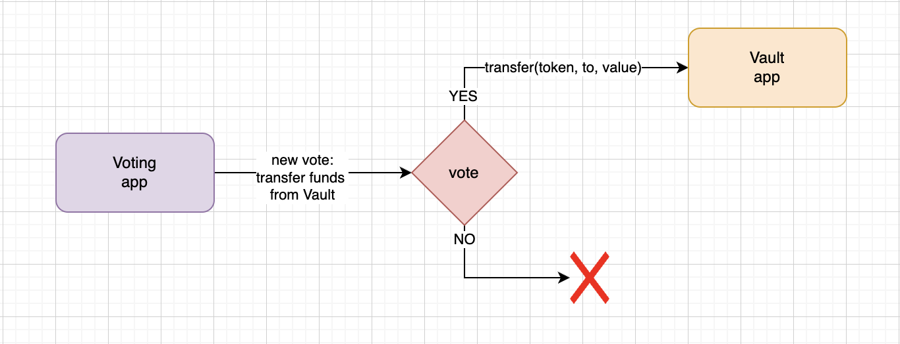
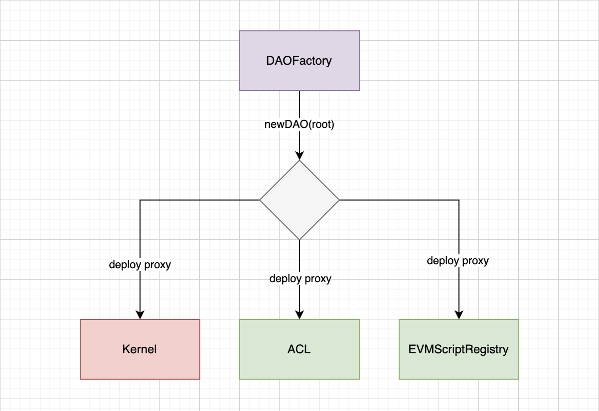
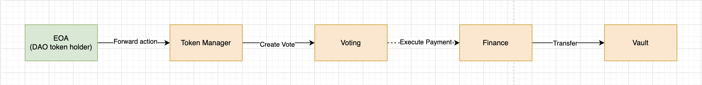

# Aragon DAO V1 (Legacy)

**Автор:** [Роман Ярлыков](https://github.com/rlkvrv) 🧐

Децентрализованная автономная организация (DAO) — это организация, управляемая с помощью смарт-контрактов на публичном блокчейне. "Децентрализованная" означает, что она построена на основе технологии без доверия и разрешений. "Автономная" указывает на самоуправление, в основе которого лежат смарт-контракты. "Организация" подразумевает, что участники координируют свои действия для достижения общих целей.

Aragon (Aragon Network) — это платформа для создания таких DAO, при этом сама организация Aragon также управляется с помощью Main DAO и Sub-DAOs держателями токена ANT. Основной компонент Aragon — это фреймворк для построения DAO, включающий собственную операционную систему (aragonOS), построенную на базе смарт-контрактов и предоставляющую широкие возможности для создания и настройки DAO.

Aragon был основан в 2016 году для борьбы с возникающими общественными кризисами и неудачами демократии (по словам основателей Луиса Куэнде и Хорхе Искьердо). В 2017 году была опубликована первая версия [whitepaper](https://github.com/aragon/whitepaper), проведено ICO и запущена первая версия aragonOS. В 2018 году был опубликован [Aragon Manifesto](https://medium.com/aragondec/the-aragon-manifesto-4a21212eac03), в котором организация обещает бороться за свободу и предоставлять для этого все необходимые инструменты. В 2020 году был запущен экспериментальный продукт под названием Aragon Court — децентрализованная цифровая судебная система, а также Aragon Client — пользовательский интерфейс для создания и управления DAO.

## Обзор фреймворка

Aragon предоставляет набор приложений и сервисов с открытым исходным кодом, которые позволяют создавать новые формы глобальных сообществ (или DAO). Организация в Aragon — это центральная система, вокруг которой все выстраивается. Она состоит из ядра, ряда приложений и набора разрешений, определяющих протокол организации: что можно делать и каким образом.

Приложения можно устанавливать, удалять или обновлять, что можно сравнить с управлением приложениями в операционной системе компьютера или смартфона. Кто и как может выполнять эти задачи, полностью зависит от разрешений, установленных в организации. В организациях Aragon одно и то же приложение может быть установлено несколько раз (за отслеживание версий приложений отвечает aragonPM). Поэтому их называют экземплярами приложений. Это полезная особенность, поскольку конкретный экземпляр приложения содержит свою собственную конфигурацию и набор разрешений, которые не передаются другим экземплярам.

Можно использовать готовое приложение Aragon или написать свое собственное. Существует даже "магазин" приложений App Center. Код готовых приложений Aragon доступен в [этом](https://github.com/aragon/aragon-apps) репозитории.

Каждая организация также содержит набор из трех системных приложений, которые обычно не удаляются. Это смарт-контракты, обеспечивающие основные функции организаций:
- Ядро организации и список установленных приложений (Kernel);
- Модуль разрешений организации (ACL);
- Возможность перенаправления действий другим приложениям (EVM Script Registry).



Чтобы понять, как вся эта система работает, нужно сначала немного погрузиться в архитектуру фреймворка, а точнее его главный модуль — aragonOS.

## Архитектура aragonOS

aragonOS - это система смарт-контрактов, представляющая совокупность множества компонентов (называемых приложениями) и основы, которая является ядром (Kernel) и определяет, как эти приложения могут взаимодействовать друг с другом и как другие объекты могут взаимодействовать с ними.

> Философия дизайна, которую мы используем при разработке приложений Aragon, очень похожа на философию UNIX: мы стараемся создавать их так, чтобы они делали что-то одно и хорошо, а также реализовывать несколько интерфейсов aragonOS так, чтобы они хорошо сочетались с остальной экосистемой. Это дает чисто технические преимущества, такие как тестируемость, но это также очень эффективно, когда приложения объединяются и выход одного приложения становится входом другого (Forwarders чем-то напоминают UNIX pipes).
> > Из документации Aragon.

### The Kernel

Kernel — это основа любой организации. Ядро действует как координатор всех компонентов организации. Это довольно простой смарт-контракт, предоставляющий две основные функции: возможность обновления и авторизацию.

Ядро реализуется паттерном [DelegateProxy (ERC-897)](https://eips.ethereum.org/EIPS/eip-897) с использованием [неструктурированного хранилища](https://blog.openzeppelin.com/upgradeability-using-unstructured-storage). Этот паттерн разделяет контракт на два экземпляра: базовый логический контракт (имплементация) и прокси-контракт (ссылается на имплементацию). Прокси делегирует всю свою логику базовому контракту и может изменять свой указатель на базовый контракт, чтобы обновить свою логику. К слову, ERC-897 был разработан Aragon вместе с OpenZeppelin. Сейчас появились другие прокси-паттерны, но концептуально он реализует базовые механизмы любого прокси.

Возможность обновления относится не только к самому ядру, но и к приложениям, которые устанавливаются с помощью ядра и также могут обновляться через него.

Две главные функции ядра, которые связывают приложения, это:
```solidity
function setApp(bytes32 namespace, bytes32 appId, address app) public;
function getApp(bytes32 namespace, bytes32 appId) public view returns (address);
```

- **namespace**: Указывает, какой тип приложения устанавливается. Ядро реализует три пространства имён, в которых могут быть зарегистрированы установленные приложения:
  - **Core namespace** (`keccak256('core')`): единственный контракт, установленный в core, должен быть ссылкой на имплементацию Kernel.
  - **Base namespace** (`keccak256('base')`): адреса имплементаций контрактов (кроме kernel).
  - **App namespace** (`keccak256('app')`): адрес прокси-контракта для установленного приложения (устанавливается, когда этот экземпляр прокси будет адресом "по умолчанию" для имплементации из base).
- **appId**: идентификатор устанавливаемого приложения. Это хэш имени в формате ENS, например, namehash('aragonOS.appStorage.kernel') или namehash('voting.aragonpm.eth').
- **app**: Адрес прокси-контракта для экземпляра приложения.



Таким образом, хранилище Kernel очень минималистичное. Главный элемент здесь — это маппинг `apps`:

```solidity
contract KernelStorage {
    // namespace => app id => address
    mapping (bytes32 => mapping (bytes32 => address)) public apps;
}
```

Смарт-контракт Kernel можно найти [здесь](https://github.com/aragon/aragonOS/blob/next/contracts/kernel/Kernel.sol).

#### Установка приложений

Kernel хранит информацию об имплементациях приложений, но не хранит ссылку на каждый прокси, который может быть создан. В ядре можно установить только один "default" адрес прокси-контракта, при этом может быть несколько экземпляров прокси.

Приложение считается "установленным" только тогда, когда ему выдано первое разрешение через ACL (об ACL поговорим позже). Правильно разработанное приложение не должно функционировать без разрешений. Если оно может функционировать без разрешений от ACL — это плохой знак.

Экземпляры прокси позволяют создавать две функции kernel:
```js
function newAppInstance(bytes32 appId, address appBase);
function newPinnedAppInstance(bytes32 appId, address appBase);
```

Согласно ERC-897, на который я уже ссылался выше, может быть два типа прокси:
- Forwarding proxy (id = 1): в качестве имплементации будет использоваться только один адрес, изменить его нельзя.
- Upgradeable proxy (id = 2): обычный прокси, когда имплементацию сменить можно.

Таким образом, функция `newAppInstance` создает Upgradeable proxy, а `newPinnedAppInstance` создает Forwarding proxy.

У этих функций есть перегрузки, которые позволяют передать полезную нагрузку для немедленной инициализации создаваемого прокси и флаг `setDefault`. Если флаг установлен, то под капотом будет вызвана функция ядра `setApp`, которая добавит адрес этого прокси в пространство имен `app`, сделав его экземпляром прокси "по умолчанию".

```solidity
function newAppInstance(bytes32 appId, address appBase, bytes initializePayload, bool setDefault);
function newPinnedAppInstance(bytes32 appId, address appBase, bytes initializePayload, bool setDefault);
```

#### Разрешения приложений

Для удобства Kernel также содержит две функции для работы с разрешениями:

```solidity
function acl() public view returns (IACL);
function hasPermission(address who, address where, bytes32 what, bytes how) public view returns (bool);
```

Функция `acl` возвращает адрес экземпляра прокси ACL, а `hasPermission` позволяет проверить разрешение без прямого обращения к ACL.

### ACL

Вторая очень важная функция ядра — отслеживание списка контроля доступа (Access Control List, ACL) приложений, который используется для управления правами доступа на уровне всего DAO. Разрешениями управляет системное приложение ACL. По сути, оно определяет, кто может выполнять те или иные действия в приложении Aragon, а также кто может предоставлять или отзывать разрешения.

> Разрешение (permission) необходимо для выполнения действий (сгруппированных по ролям) в определенном экземпляре приложения (идентифицируемом по его адресу).

Смарт-контракт [ACL](https://github.com/aragon/aragonOS/blob/next/contracts/acl/ACL.sol) устроен как обычный AragonApp, поэтому также может быть обновлен. В отличие от других приложений, его экземпляр создается при инициализации ядра, поскольку это приложение, без которого другие приложения не смогут функционировать.

Экземпляр ACL всегда можно получить через ядро (в свою очередь каждое приложение знает адрес ядра):
```solidity
ACL acl = ACL(kernel.acl());
```

После этого можно выполнить три основных действия:
- Create Permission: создание разрешения с назначением менеджера этой роли;
- Grant Permission: выдача разрешения для определенной роли;
- Revoke Permission: отзыв разрешения у роли.

Создание разрешения выполняется через соответствующую функцию:

```solidity
acl.createPermission(address entity, address app, bytes32 role, address manager);
```
- **entity**: сущность, которой выдается разрешение;
- **app**: приложение, с которым сможет взаимодействовать сущность после получения роли;
- **role**: роль в приложении;
- **manager**: менеджер, который сможет выдавать разрешение для этой роли и отзывать его.

После этого менеджер может вызывать `grantPermission` и `revokePermission`. Эти функции принимают параметры entity, app и role.

#### Пример работы ACL

Рассмотрим пример, когда "Root" пользователь создает новое DAO с установленными базовыми разрешениями, чтобы приложение Voting могло управлять средствами, хранящимися в приложении Vault:

1. Деплой прокси-контрактов Kernel и ACL.
2. В процессе деплоя вызовется функция `kernel.initialize(acl, rootAddress)`, которая в свою очередь вызывает `acl.initialize(rootAddress)` и под капотом создает разрешение для "permissions creator":
   ```solidity
   createPermission(rootAddress, aclAddress, CREATE_PERMISSIONS_ROLE, rootAddress)
   ```
3. Деплой приложения Voting.
4. Далее необходимо предоставить приложению Voting возможность вызывать `createPermission()`:
   ```solidity
   grantPermission(votingAppAddress, aclAddress, CREATE_PERMISSIONS_ROLE)
   ```
   В этом случае разрешение выдает rootAddress.
   
5. Деплой приложения Vault, у которого есть функция `transfer()`.
6. Теперь нужно создать новое голосование через приложение Voting для выдачи разрешения `TRANSFER_ROLE`:
   ```solidity
   createPermission(votingAppAddress, vaultAppAddress, TRANSFER_ROLE, votingAppAddress)
   ```
7. Если голосование проходит, приложение Voting теперь имеет доступ ко всем действиям в Vault, защищенным ролью `TRANSFER_ROLE`, в данном случае это действие `transfer()`.
   
8. Переводы средств из Vault теперь могут контролироваться через голосование в приложении Voting. Каждый раз, когда пользователь хочет перевести средства, он может создать новое голосование через приложение Voting для предложения выполнения действия `transfer()` в Vault. Действие `transfer()` будет выполнено только если голосование пройдет.
   

_Важно!_ Только приложение Voting теперь может отозвать или переназначить разрешение `TRANSFER_ROLE`, так как оно является менеджером разрешения `TRANSFER_ROLE` на `vaultAppAddress`.

#### Настройка параметров для разрешений

Когда менеджер назначает на роль какую-то сущность, он также может передать массив параметров через `grantPermissionP`. Параметры позволяют ACL выполнять определенные вычисления с аргументами разрешения, чтобы решить, разрешить ли действие или нет. Это делает ACL более сложной системой, позволяющей точнее контролировать доступ.

Установка условий и их проверка задается разными массивами данных. В момент выдачи разрешения для роли передается массив с параметрами (условиями), то есть каждый индекс массива — отдельное условие. В дальнейшем при проверке будет передан массив аргументов, который и будет обрабатываться заданными условиями.

```solidity
function grantPermissionP(address _entity, address _app, bytes32 _role, uint256[] _params)
```

Параметры позволяют выполнять определенные вычисления с аргументами, которые будут переданы в момент авторизации. Они передаются массивом `uint256`. Фактически процесс завязан на сравнении двух значений, только условия для сравнения могут быть разные, как и количество сравниваемых значений.

В каждый такой параметр (`uint256`) зашита структура из трех значений:

```solidity
    struct Param {
        uint8 id;
        uint8 op;
        uint240 value;
    }
```

- **Argument Value (`uint240`)**: Помещается в `uint240` и может быть числом, адресом и даже хешем из 30 байт. Значение теряет два наиболее значимых байта точности (MSB), это необходимо чтобы вся структура помещалась в `uint256`, таким образом экономится место в хранилище смарт-контракта.
- **Argument ID (uint8)**: Определяет, какой аргумент, переданный роли, будет взят для сравнения с Argument value. ID от 0 до 200 ссылаются на индекс аргумента, переданный роли. Специальные ID после 200 включают:
  - `BLOCK_NUMBER_PARAM_ID (id = 200)`: Устанавливает значение сравнения как номер блока во время выполнения;
  - `TIMESTAMP_PARAM_ID (id = 201)`: Устанавливает значение сравнения как метку времени текущего блока;
  - `ORACLE_PARAM_ID (id = 203)`: Аргумент передается оракулу. Это может быть любой внешний смарт-контракт, который также вернет `true` или `false`;
  - `LOGIC_OP_PARAM_ID (id = 204)`: Оценивает логические операции, а не argument value, позволяет программировать сложную логику за счет возможности рекурсивного вызова.
  - `PARAM_VALUE_PARAM_ID (id = 205)`: Берет для сравнения Argument value. По логике такое сравнение бессмысленно, но это используется для Operation type = RET. Если value больше 1 — вернется `true`.
- **Operation type (uint8)**: Операция, которую нужно выполнить для сравнения значений, извлеченных с помощью argument ID, или argument value. Сравнение всегда идет в следующем порядке `args[param.id] <param.op> param.value`. Реализованы следующие типы операций:
  - **None (Op.NONE)**: Всегда оценивается как false;
  - **Equals (Op.EQ)**: true, если все байты между `args[param.id]` и `param.value` равны;
  - **Not equals (Op.NEQ)**: true, если какой-то байт не совпадает;
  - **Greater than (Op.GT)**: true, если `args[param.id] > param.value`;
  - **Less than (Op.LT)**: true, если `args[param.id] < param.value`;
  - **Greater than or equal (Op.GTE)**: true, если `args[param.id] >= param.value`;
  - **Less than or equal (Op.LTE)**: true, если `args[param.id] <= param.value`;
  - **Return (Op.RET)**: true, если `args[param.id]` больше единицы. Используется с `PARAM_VALUE_PARAM_ID`, делает `args[param.id] = param.value`, поэтому возвращает связанное значение параметра.

Для обработки нескольких аргументов используется `LOGIC_OP_PARAM_ID`, а также следующие логические операции:
- **Not (Op.NOT)**: Принимает 1 параметр и вычисляет противоположное значение;
- **And (Op.AND)**: Принимает 2 параметра, проверяет, что оба параметра истинны;
- **Or (Op.OR)**: Принимает 2 параметра, проверяет, что хотя бы один параметр истинный;
- **Exclusive or (Op.XOR)**: Принимает 2 параметра, проверяет, что только один из параметров истинный;
- **If else (Op.IF_ELSE)**: Принимает 2 параметра, проверяет первый параметр и, если истинный, использует значение второго параметра, иначе — третьего.

Таким образом, правила ACL всегда оценивают результат первого параметра, но первый параметр может быть операцией, которая связана с другими параметрами. Выполняется оценка рекурсивно, поэтому набор правил может быть большим.

Код, который отвечает за проверку параметров находится в смарт-контракте ACL, в функции [_evalParam](https://github.com/aragon/aragonOS/blob/4bbe3e96fc5a3aa6340b11ec67e6550029da7af9/contracts/acl/ACL.sol#L320). Лучше всего работу этой функции отражает [набор тестов](https://github.com/aragon/aragonOS/blob/63c4722b8629f78350586bcea7c0837ab5882a20/test/TestACLInterpreter.sol#L112-L126), некоторые из них я приведу ниже. Но чтобы эти тесты понять необходимо сначала разобраться как работает сама функция `_evalParam`.

Например в этом тесте можно увидеть как кодируются и проверяются простые условия. На проверку подаются два аргумента - числа 10 и 11. Далее выполняется три проверки:

- Проверяется равен ли первый аргумент 10
- Проверяется равен ли второй аргумент 10
- Проверяется равен ли второй аргумент 11
 
```solidity
function testEqualityUint() public {
    // Проверяем, что аргумент с индексом 0 равен 10 | arr[0] == 10
    assertEval(arr(uint256(10), 11), 0, Op.EQ, 10, true);
    // Проверяем, что аргумент с индексом 1 равен 10 | arr[1] == 10
    assertEval(arr(uint256(10), 11), 1, Op.EQ, 10, false);
    // Проверяем, что аргумент с индексом 1 равен 11 | arr[1] == 10
    assertEval(arr(uint256(10), 11), 1, Op.EQ, 11, true);
}
```

Если используются заранее определенные Argument ID, то передается пустой массив аргументов:

```solidity
function testTimestamp() public {
    assertEval(arr(), TIMESTAMP_PARAM_ID, Op.EQ, uint256(block.timestamp), true);
    assertEval(arr(), TIMESTAMP_PARAM_ID, Op.EQ, uint256(1), false);
    assertEval(arr(), TIMESTAMP_PARAM_ID, Op.GT, uint256(1), true);
}
```

Более сложная логика, которую можно запрограммировать в условиях:

```solidity
function testComplexCombination() {
    // if (oracle and block number > block number - 1) then arg[0] < 10 or oracle else false

    Param[] memory params = new Param[](7);

    params[0] = Param(LOGIC_OP_PARAM_ID, uint8(Op.IF_ELSE), encodeIfElse(1, 4, 6));
    params[1] = Param(LOGIC_OP_PARAM_ID, uint8(Op.AND), encodeOperator(2, 3));
    params[2] = Param(ORACLE_PARAM_ID, uint8(Op.EQ), uint240(new AcceptOracle()));
    params[3] = Param(BLOCK_NUMBER_PARAM_ID, uint8(Op.GT), uint240(block.number - 1));
    params[4] = Param(LOGIC_OP_PARAM_ID, uint8(Op.OR), encodeOperator(5, 2));
    params[5] = Param(0, uint8(Op.LT), uint240(10));
    params[6] = Param(PARAM_VALUE_PARAM_ID, uint8(Op.RET), 0);

    assertEval(params, arr(uint256(10)), true);

    params[4] = Param(LOGIC_OP_PARAM_ID, uint8(Op.AND), encodeOperator(5, 2));
    assertEval(params, arr(uint256(10)), false);
}
```

Объяснение:
1. Нулевым параметром идет `LOGIC_OP_PARAM_ID` и операция `Op.IF_ELSE` с argument IDs 1, 4, 6. Это значит, что дальше мы сразу переходим к первому параметру, и если он вернет true, следующий переход будет на 4 иначе на 6.
2. Во втором параметре снова логическая операция, но теперь это `Op.AND`, которая должна сравнить параметры 2 и 3.
3. Переходим ко второму параметру, это вызов оракула и операция `Op.EQ`. Предполагается, что вызов `AcceptOracle` вернет true.
4. Так как операция была AND, то проверяется и третий параметр, где `block.number` должен быть равен (`block.number - 1`).
5. Если оракул и операция с `block.number` вернули true, то далее мы переходим к параметру 4, как это было запрограммировано в параметре 0.
6. В параметре 4 мы снова видим логическую операцию `Op.OR` параметров 5 и 2, значит следующим шагом будет выполнение этих сравнений.
7. В пятом параметре идет проверка, что нулевой аргумент массива, переданный снаружи, меньше 10, а также снова вызывается оракул. Если хотя бы одно условие сработало, то здесь сравнения заканчиваются, и доступ к функции разрешен.
8. Если последнее условие не сработало, мы переходим к параметру 6, который просто возвращает false, потому что задана операция `Op.RET` и значение 0, которое меньше 1.

Таким образом, логика проверки разрешения может программироваться очень гибко, и для этого не нужно дополнительно писать смарт-контракт на Solidity.

#### Управление разрешениями (Permission management)

Теперь, зная, как устроена система, можно подробнее разобрать работу с разрешениями, за которую отвечает ACL. Работа с разрешениями описывается следующим образом:

> Сущность E (Entity) может вызвать функцию F (Function) (защищенную ролью R (Role) и параметризованную параметрами P (Params)) на приложении A (App), только если сущность E (Entity) обладает разрешением на роль R (Role) в приложении A (App), и их аргументы к функции F (Function) удовлетворяют правилам R (Rules). Менеджер разрешений M (Permission Manager) может отозвать или переназначить это разрешение.

Может звучать сложно, но на самом деле это не так. Рассмотрим подробнее:
1. **Entity E**: Это сущность, которая хочет вызвать функцию. Сущностью может быть пользователь или другой смарт-контракт.
2. **Function F**: Это функция, которую хочет вызвать Entity E. Функция защищена Role R и может иметь параметры защиты Params P.
3. **Role R**: Это роль, которая защищает функцию Function F. Роль определяет набор действий, которые могут быть выполнены в рамках приложения.
4. **Params P**: Это параметры, передаваемые функции Function F. Они могут быть использованы для дополнительного контроля доступа.
5. **App A**: Это приложение, в котором находится функция Function F. Приложение представляет собой отдельный компонент в экосистеме Aragon.
6. **Rules R**: Это правила, которые должны быть удовлетворены аргументами, переданными в Function F, чтобы разрешение было действительно.

Таким образом, Entity E может вызвать Function F в App A только если:
- Entity E имеет разрешение для Role R в App A.
- Аргументы, передаваемые в Function F, удовлетворяют Rules R.

В то же время, Permission Manager может отозвать или переназначить разрешение для какой-либо роли.

### Aragon App

AragonApp — это базовый класс для всех приложений aragonOS. Он настраивает хранилище приложения для подключения к Kernel, а также добавляет некоторую базовую бизнес-логику и расширения. Например, позволяет перевести в Vault все случайно отправленные в приложение токены. Также базовый класс позволяет выполнять произвольные EVM-скрипты, имеет расширение для защиты от повторного вызова (Reentrancy) и расширение для отключения инициализации имплементации приложения. Код можно посмотреть [тут](https://github.com/aragon/aragonOS/blob/next/contracts/apps/AragonApp.sol).

#### Authentication

Важнейшей базовой составляющей приложения является аутентификация. Аутентификация завязана на ролях и двух модификаторах `auth()` и `authP`.

Роли обычно объявляются в начале смарт-контракта как `bytes32`, это всегда хеш от названия роли, например так:

```solidity
bytes32 public CUSTOM_ACTION_ROLE = keccak256("CUSTOM_ACTION_ROLE");
```

Через модификаторы `auth()` и `authP()` ACL определяет, обладает ли сущность, вызвавшая функцию, доступом к той или иной функции.

```solidity
function customAction() auth(CUSTOM_ACTION_ROLE) {}
```

Второй модификатор `authP(bytes32 role, uint256[] params)` позволяет также передать параметры для проверки условий в ACL. О параметрах я подробно рассказал в предыдущем разделе.

```solidity
bytes32 public TRANSFER_ROLE = keccak256("TRANSFER_ROLE");

function transfer(uint256 amount) authP(TRANSFER_ROLE, arr(amount)) {}
```

Вспомогательная функция `arr()` для формирования массива параметров также доступна из коробки. Оба модификатора проверяют, что приложение было инициализировано перед вызовом какого-либо действия.

Есть также публичный геттер `canPerform()`, который позволяет проверить, может ли сущность вызвать функцию от имени конкретной роли.

```solidity
function canPerform(address who, bytes32 what, uint256[] how) public view returns (bool) {
    return acl().hasPermission(who, address(this), what, how);
}
```

Таким образом, базовый класс AragonApp предоставляет фундаментальные функции для управления доступом и аутентификацией в приложениях aragonOS.

### Forwarder и EVMScript

Форвардеры и EVM-скрипты нужны для того, чтобы не реализовывать механизм голосования в каждом приложении, а также чтобы скрипт, который должен быть выполнен после голосования, мог пересылаться между различными приложениями.

Например, вы хотите выполнить перевод средств из приложения Vault, но у вас нет доступа на это действие. Если вы используете aragonUI, он не позволит вызвать транзакцию напрямую в приложении Vault, так как она не выполнится. Вместо этого интерфейс рассчитает нужный путь: допустим, если у вас есть разрешение на создание голосования, скрипт будет передан приложению Voting. Технически это происходит через вызов `Voting::forward(evmScript)`. Функция `forward()` проверяет, может ли вызывающая сторона выполнить такую пересылку, и, если все хорошо, создается голосование. В случае успешного голосования будет вызвана функция `runScript()`.

На схеме ниже пример из документации: тех. лид Aragon хочет отправить 100 ETH из приложения Vault приложению Payroll:


Приложение, которое принимает переданный скрипт, обязательно должно реализовывать интерфейс IForwarder.

```solidity
interface IForwarder {
    function isForwarder() external pure returns (bool);
    function canForward(address sender, bytes evmCallScript) public view returns (bool);
    function forward(bytes evmCallScript) public;
}
```

В теории, в момент выполнения скрипта может снова произойти его передача другому приложению, которое также должно реализовывать IForwarder.

#### EVMScripts

EVM-скрипты являются очень важным элементом системы. В такой скрипт может быть закодирована любая логика, которую нужно выполнить через DAO, например не просто перевести средства из Vault, а вложить их в какой-то протокол или даже в несколько. Но для того, чтобы сделать это безопасно скрипт регистрируется, а также может пересылаться между приложениями, что позволяет помимо голосования выполнить любые проверки перед выполнением.

Базовое приложение AragonApp имеет расширение EVMScriptRunner — это значит, что любое приложение "из коробки" может настроить логику выполнения скрипта.

Приложение, которое хочет выполнять скрипты, должно быть зарегистрировано в смарт-контракте платформы EVMScriptRegistry. После этого приложение может быть исполнителем скриптов (EVMScript executor), и ему присваивается идентификатор — executorId.

Сам скрипт кодируется особым образом и записывается в массив `bytes`. Структура большинства вызовов будет иметь следующий вид:

```solidity
[specId (uint32)][to (address: 20 bytes)][calldataLength (uint32: 4 bytes)][calldata (calldataLength bytes)]
```

Первые 4 байта всегда будут содержать executorId, по которому можно получить зарегистрированный смарт-контракт executor.

В одной организации может быть несколько контрактов-исполнителей. Важно, что такой подход позволяет передавать скрипты на исполнение другой организации, что открывает дополнительные возможности.

Смарт-контракт executor должен реализовывать следующий интерфейс:

```solidity
interface IEVMScriptExecutor {
    function execScript(bytes script, bytes input, address[] blacklist) external returns (bytes);
    function executorType() external pure returns (bytes32);
}
```

Примером такого смарт-контракта исполнителя является [CallScript](https://github.com/aragon/aragonOS/blob/v4.0.0/contracts/evmscript/executors/CallsScript.sol#L25), это смарт-контракт, предоставляемый aragonOS, который может выполнять множественные вызовы других смарт-контрактов.

## Использование фреймворка Aragon

Взаимодействие с организациями может осуществляться с помощью таких инструментов, таких как Aragon Client для браузера, aragonCLI для командной строки или программно через Aragon Connect. К сожалению, на данный момент Aragon v1 безнадежно устарел, а вместе с ним и все доступные инструменты. Остается только взаимодействовать напрямую со смарт-контрактами.

### Создание DAO

Все начинается со смарт-контракта [DAOFactory](https://github.com/aragon/aragonOS/blob/next/contracts/factory/DAOFactory.sol) и создания организации. Для этого понадобится так называемый root-адрес. В момент создания DAO ему присваивается главная роль в организации — `CREATE_PERMISSIONS_ROLE`.

В процессе создания организации под капотом создаются и настраиваются базовые приложения организации:
- **Kernel:** Фактически это и есть прокси смарт-контракт, инстанс которого — это DAO. В пространстве имен "core" фиксируется адрес имплементации Kernel;
- **ACL:** В пространстве имен "base" фиксируется адрес имплементации ACL. Создается прокси ACL для этого DAO и адрес этого прокси также фиксируется в пространстве имен, но уже "app". В процессе инициализации ACL на роль `CREATE_PERMISSIONS_ROLE` назначается root-адрес, переданный DAO. Также адрес root назначается менеджером этой роли;
- **EVMScriptRegistry:** Создается прокси-контракт для этой организации. В пространстве имен "base" фиксируется адрес имплементации EVMScriptRegistry, а в "app" — его прокси-адрес. Помимо этого, регистрируется скрипт с id = 1 — это [CallScript](https://github.com/aragon/aragonOS/blob/next/contracts/evmscript/executors/CallsScript.sol), который позволяет делать множественные вызовы смарт-контрактов.



В процессе развертывания ACL выдает соответствующие разрешения системным смарт-контрактам, но после настройки все разрешения отзываются, и остается только разрешение для root-адреса.

### Настройка DAO

Настройка DAO — это добавление необходимых приложений и установка разрешений на определенные действия.

#### TokenManager

DAO управляется через токены, поэтому первым делом нужно создать такой токен. Для этого понадобится [MiniMeTokenFactory](https://github.com/aragon/deployments/blob/master/environments/mainnet/contracts/minime/MiniMeTokenFactory.sol) и приложение (смарт-контракт) [TokenManager](https://github.com/aragon/aragon-apps/blob/master/apps/token-manager/contracts/TokenManager.sol).

В Aragon можно создать 3 вида токенов:
- **Membership**: non-transferable (непередаваемый) токен, один аккаунт может владеть 1 токеном;
- **Reputation**: non-transferable (непередаваемый) токен без ограничения баланса;
- **Equity**: transferable токен, который можно передавать, не имеет ограничения баланса.

После создания токена через MiniMeTokenFactory понадобится контроллер — сущность, которая будет иметь доступ ко всем самым важным функциям токена. В момент развертывания контроллером назначается деплойер, но после этого нужно изменить контроллер на TokenManager.

Для этого понадобится развернуть смарт-контракт TokenManager и "установить" его в Kernel. Затем через ACL назначить этому контракту `CREATE_PERMISSIONS_ROLE`.

Инициализировать TokenManager получится только если токен DAO, который передается в управление контракту TokenManager, передал ему права контроллера. В момент инициализации TokenManager можно задать два параметра — это флаг `transferable` (по умолчанию токен передаваемый, но можно это изменить) и `maxAccountTokens` — параметр, который отвечает за количество токенов, которым может владеть один аккаунт (если передать 0, то ограничения не будет). Через эти два параметра в момент инициализации TokenManager можно сделать токен DAO — Membership, Reputation или Equity.

Далее нужно через ACL назначить `MINT_ROLE` для приложения TokenManager, чтобы можно было минтить токены для новых участников DAO.

#### Voting

Теперь у организации есть токены и TokenManager. Следующий шаг — установка приложения [Voting](https://github.com/aragon/aragon-apps/blob/master/apps/voting/contracts/Voting.sol), чтобы все важные решения принимались путем голосования.

Приложению Voting требуются следующие параметры инициализации:
- **minime token**: адрес токена DAO, который мы получили на предыдущем шаге;
- **support required percentage**: процент голосов "за" от общего числа голосов для успешного голосования (выражается в процентах от `10^18`; например, `10^16` = 1%, `10^18` = 100%). Например, если support required percentage установлен на 60%, и всего подано 100 голосов, то для успеха голосования нужно, чтобы 60 из этих 100 голосов были "за".
- **min accept quorum**: процент голосов "за" от общего возможного числа голосов для успешного голосования (также выражается в процентах от `10^18`). Например, если min accept quorum установлен на 20%, и всего существует 1000 голосующих токенов, то для успеха голосования нужно, чтобы 200 из этих 1000 возможных голосов были "за".
- **vote time**: количество секунд, в течение которых голосование будет открыто для держателей токенов (если не будет достигнуто достаточное количество голосов "за" или "против" для досрочного принятия решения).

Далее нужно назначить разрешение на создание голосований. Если вы хотите, чтобы все держатели токенов могли создавать голосования, можно назначить `CREATE_VOTES_ROLE` адресу TokenManager. После этого любой держатель токенов сможет создавать голосование.

#### Vault и Finance

Следующий шаг — управление финансами организации. Понадобится установить приложение [Vault](https://github.com/aragon/aragon-apps/blob/master/apps/vault/contracts/Vault.sol) и приложение [Finance](https://github.com/aragon/aragon-apps/blob/master/apps/finance/contracts/Finance.sol). Приложение Vault не принимает никаких аргументов. Для развертывания Finance понадобится адрес Vault и `budgeting period`, который указывается в секундах. После деплоя есть возможность для каждого актива назначать собственный бюджет.

Таким образом будет работать следующая схема: Для заданного бюджетного периода P можно установить бюджет B для актива A. Общий объем переводов актива A не может превышать его бюджет в течение периода P. Например, если мы установим P как 1 месяц, можем задать бюджет для DAI в размере 1000. Даже если в хранилище содержится более 1000 DAI, не будет возможно потратить более 1000 DAI в месяц.

Осталось самое важное — выдать разрешение приложению Finance на перевод токенов из Vault. Для этого его нужно назначить на `TRANSFER_ROLE` в приложении Vault. Как и в любом другом случае, это делается через ACL.

Помимо этого, основной функционал приложения Finance передается в управление приложению Voting. Выдаются разрешения на следующие роли:
- `CREATE_PAYMENTS_ROLE`
- `EXECUTE_PAYMENTS_ROLE`
- `MANAGE_PAYMENTS_ROLE`

Теперь бюджет организации управляется только через голосование в приложении Voting.

#### Завершающая настройка разрешений

Для завершения настройки DAO необходимо сделать ревью всех выданных разрешений. Например, небезопасно оставлять EOA-адрес в качестве менеджера ACL. Необходимо передать его более защищенной сущности, например, приложению Voting.

_Важно!_ При передаче разрешения сначала на роль назначается новая сущность, затем проверяется, что эта сущность верная, и только потом выполняется отзыв (revoke) разрешения с EOA-адреса. В случае ошибки в адресе изменить что-то после отзыва разрешения уже не получится.

В конечном итоге, соединяя контракты вместе через разрешения, можно определить сложные критерии, которые ограничивают выполнение действий в организации. Если взять распространенный сценарий, в котором DAO хочет разрешить какой-либо платеж, то платеж будет исполнен при следующих условиях:

1. Предложение выдвинуто членом организации.
2. Предложение одобрено большинством членов организации.
3. Платеж не выходит за рамки определенного бюджета.

Цепочка разрешений будет следующая:


Vault, в котором хранятся активы организации, предоставляет роль "Transfer" только приложению "Finance", которое внутри реализует логику бюджетирования. Роль "Create payment" приложения "Finance" назначается исключительно приложению "Voting", так что единственным способом создания платежа является успешное проведение голосования. Роль "Create Votes" приложения Voting предоставляется исключительно приложению TokenManager, которое управляет собственным токеном организации. TokenManager будет перенаправлять действия от держателей токенов.

#### Дополнительные приложения

Aragon обладает целой библиотекой различных приложений, к тому же приложения могут создаваться сторонними разработчиками. Поэтому после базовой настройки можно установить приложения, которые будут выполнять конкретные потребности DAO либо написать свое.

Например, интересным приложением от Aragon является [Agent](https://github.com/aragon/aragon-apps/blob/master/apps/agent/contracts/Agent.sol), это приложение может заменить Vault, при этом добавив возможность взаимодействовать со смарт-контрактами напрямую. Agent поддерживает [ERC-1271](https://eips.ethereum.org/EIPS/eip-1271). Добавив к нему Voting, можно получить мультисиг. Для того чтобы им пользоваться как обычным EOA-аккаунтом, понадобится приложение [Frame](https://frame.sh/). Если использовать Agent через aragonUI, то в процессе вызова внешнего смарт-контракта с этого адреса будет создаваться голосование. Это упростит взаимодействие DAO с различными DeFi-протоколами.

## Заключение

Протокол Aragon заложил хороший фундамент для создания DAO. С такой архитектурой организации могут гибко настраивать внутренние процессы благодаря очень широким возможностям по кастомизации внутренней логики и проработанной системе разрешений. Можно даже разработать множество своих приложений и объединить их на базе ядра и ACL. Из коробки предлагается достаточно инструментов, чтобы запустить DAO.

Протокол развивается, версия aragonOS, описанная в этой статье, уже устарела, но статья все еще может быть полезна для работы с DAO, созданными давно, либо для переезда на новые версии Aragon.

## Ссылки

- [Whitepaper](https://github.com/aragon/whitepaper)
- [Aragon Manifesto](https://medium.com/aragondec/the-aragon-manifesto-4a21212eac03)
- [Legacy documentation](https://legacy-docs.aragon.org/)
- [Repo: aragonOS](https://github.com/aragon/aragonOS)
- [Repo: aragon-apps](https://github.com/aragon/aragon-apps)
- [Repo: aragon deployments](https://github.com/aragon/deployments/blob/master/environments/mainnet/readme.md)

