# Aragon DAO v2

**Автор:** [Роман Ярлыков](https://github.com/rlkvrv) 🧐

DAO — это децентрализованные автономные организации, представляющие собой группу людей, управляющих активами ончейн с помощью набора смарт-контрактов.

Aragon — это хорошо зарекомендовавший себя фреймворк для построения DAO, основанный в 2016 году и значительно трансформировавшийся с тех пор. Протокол не боится экспериментов с разными подходами и концепциями: некоторые из них приживаются, от других приходится отказываться, но в целом это позволяет фреймворку улучшаться и эволюционировать.

На уровне идеи многие вещи остались прежними, но реализация претерпела значительные изменения, поэтому есть смысл погрузиться глубже в архитектуру обновленного фреймворка.
  
## Архитектура

_Дисклеймер!_ В этой статье разбирается версия протокола Aragon OSx 1.3.0. В последующих версиях могут быть небольшие изменения в реализации каких-то конкретных фич, но на уровне базовой архитектуры всё должно работать так же.

Aragon v2, или "новый технологический стек" Aragon, был представлен в марте 2023 года. Это полностью обновленный и переработанный фреймворк, в основе которого лежит операционная система Aragon OSx. Новый стек также позволяет создавать, настраивать и управлять DAO, но делает это по-другому. Основная концепция похожа на предыдущую версию протокола, где также выделяются три главных примитива, только изменилась их ответственность и способы взаимодействия. Про предыдущую версию я уже писал ранее, напомню, что она базировалась на Kernel (ядро, отвечающее за установку и удаление приложений), ACL (списки доступа) и AragonApps (приложения, которые содержали всю логику).

Основные примитивы Aragon OSx ([core](https://github.com/aragon/osx/tree/v1.3.0/packages/contracts/src/core)-контракты) это:
- **DAO contract**: Содержит всю базовую логику организации, хранит активы и управляет доступами;
- **Permissions (разрешения)**: Определяет отношения между плагинами, DAO и другими адресами;
- **Plugins**: Содержат пользовательскую функциональность организации, управляются через ончейн-репозитории (контроль версий).

Как и раньше, с помощью разрешений и плагинов можно очень гибко создавать и настраивать DAO. Также можно написать свой плагин и опубликовать его в ончейн-репозитории плагинов. Чтобы облегчить эту задачу, Aragon OSx использует набор смарт-контрактов [фреймворка](https://github.com/aragon/osx/tree/v1.3.0/packages/contracts/src/framework):
- **DAOFactory и DAORegistry:** Используются для создания и курирования DAO;
- **PluginRepoFactory и PluginRepoRegistry:** Используются для создания и версионирования репозиториев плагинов;
- **PluginSetupProcessor:** Устанавливает плагины из репозитория плагинов в DAO (установка, обновление, удаление).

В качестве внешних зависимостей протокола используются смарт-контракты библиотеки OpenZeppelin и ENS Domains.

Ниже представлена схема из документации Aragon, на которой отражена иерархия сущностей и их ответственность:

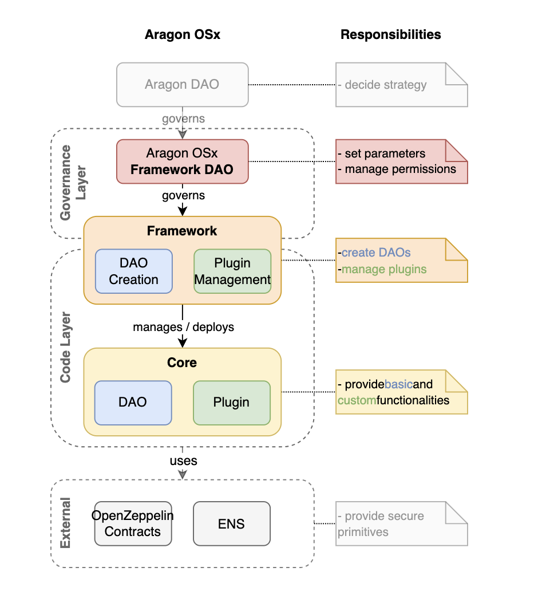

Помимо слоя кода на схеме также отражены Aragon DAO и его "подразделение" — Framework DAO. Aragon OSx является операционной системой на базе смарт-контрактов, и, как любая операционная система, протокол постоянно улучшается и обновляется — за это отвечает Framework DAO, в то время как главное DAO принимает стратегические решения по всем продуктам протокола.

### Основные смарт-контракты

Каждый DAO состоит из трех взаимосвязанных компонентов: DAO, Permissions, Plugins.

#### Смарт-контракт DAO

[DAO](https://github.com/aragon/osx/blob/v1.3.0/packages/contracts/src/core/dao/DAO.sol) — это ядро организации, которое содержит все жизненно важные функции.

**Ответственность смарт-контракта DAO**:
- Хранит основную информацию о DAO (название в ENS, логотип, описание и другие метаданные — [ERC-4824](https://eips.ethereum.org/EIPS/eip-4824)).
- Хранит и управляет активами организации (нативная валюта, ERC20, ERC721, ERC1155).
- Может выполнять произвольные действия:
  - Переводить активы.
  - Взаимодействовать с внешними смарт-контрактами и выполнять произвольные действия. Как правило, эти действия сначала одобряются голосованием. Есть возможность передавать на выполнение пакет действий, собрав их в массив `Action[]` и передав в функцию `execute`.
- Имеет возможность обновления до новых версий Aragon OSx.
- Умеет обрабатывать обратные вызовы типа onERC721Received или onERC1155Received. Кроме того, обратные вызовы можно добавлять к DAO без обновления, за это отвечает функция `registerStandardCallback`.
- Поддерживает стандарт ERC-1271 (может подписывать транзакции).
- Управляет разрешениями.

На схеме ниже показаны основные методы DAO (сеттеры и геттеры):

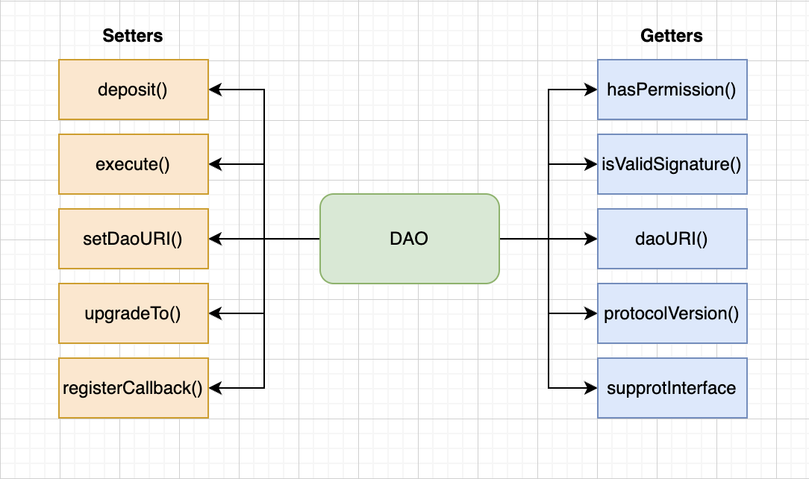

DAO — это прокси смарт-контракт, который использует прокси-паттерн UUPS (Universal Upgradeable Proxy Standard) из библиотеки OpenZeppelin. Это означает, что логика обновления находится в смарт-контракте имплементации. В целом все обновляемые смарт-контракты протокола поддерживают этот паттерн.

Также все обновляемые смарт-контракты протокола наследуются от смарт-контракта [ProtocolVersion](https://github.com/aragon/osx/blob/v1.3.0/packages/contracts/src/utils/protocol/ProtocolVersion.sol), единственная задача которого — отображать текущую версию протокола:

```solidity
abstract contract ProtocolVersion is IProtocolVersion {
    function protocolVersion() public pure returns (uint8[3] memory) {
        return [1, 4, 0];
    }
}
```

### Permission Manager

Смарт-контракт DAO наследуется от смарт-контракта [PermissionManager](https://github.com/aragon/osx/blob/v1.3.0/packages/contracts/src/core/permission/PermissionManager.sol), который отвечает за логику управления разрешениями и доступом к функционалу.

Это ключевой связующий механизм протокола, который работает с разрешениями. Настройки разрешений определяют, каким кошелькам или смарт-контрактам (where) разрешено вызывать какие авторизованные функции на целевом смарт-контракте (who). У каждого разрешения есть свой идентификатор, а за авторизацию этого идентификатора отвечает модификатор auth. Если вы знакомы с Aragon v1, то Permission Manager — это улучшенный смарт-контракт ACL (Access Control List).

Основные методы смарт-контракта PermissionManager показаны на схеме ниже:

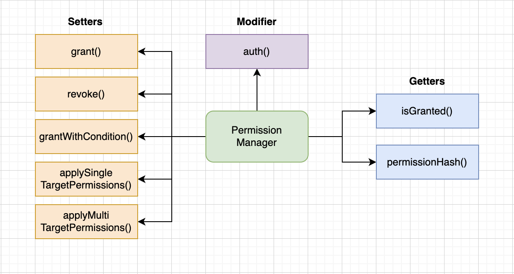

##### Permission ID

Идентификатор (permissionId) представляет из себя хеш названия конкретного разрешения. Такой же подход использует AccessControl от OpenZeppelin для идентификации ролей на смарт-контракте.

```solidity
bytes32 public constant EXECUTE_PERMISSION_ID = keccak256("EXECUTE_PERMISSION");
```

Разрешения хранятся в виде хешей, которые включают в себя приставку `PERMISSION`, адрес `where`, адрес `who` и `permissionId`.

```solidity
function permissionHash(
  address _where,
  address _who,
  bytes32 _permissionId
) internal pure returns (bytes32) {
  return keccak256(abi.encodePacked('PERMISSION', _who, _where, _permissionId));
}
```

Эти хеши являются ключами для маппинга `permissionsHashed`, который хранит адрес. Этот адрес может быть служебным (`ALLOW_FLAG`, `UNSET_FLAG`), либо адресом смарт-контракта:
- `ALLOW_FLAG = address(2)` — разрешение установлено, вернет `true`;
- `UNSET_FLAG = address(0)` — разрешение не установлено, вернет `false`;
- `PermissionCondition contract` — установлен адрес смарт-контракта, который реализует интерфейс `IPermissionCondition` и может выполнять любую логику проверки с данными из `msg.data` (подробнее об этом позже).

Функция для проверки разрешения — это `isGranted`:

```solidity
function isGranted(
    address _where,
    address _who,
    bytes32 _permissionId,
    bytes memory _data
) public view virtual returns (bool) {
    // ...

    // Получаем специальный флаг либо адрес смарт-контракта
    address specificCallerTargetPermission = permissionsHashed[
        permissionHash({_where: _where, _who: _who, _permissionId: _permissionId})
    ];

    // Если разрешение выдано напрямую, вернуть `true`
    if (specificCallerTargetPermission == ALLOW_FLAG) return true;

    // Если разрешение было выдано с условием, то проверить условие и вернуть результат
    if (specificCallerTargetPermission != UNSET_FLAG) {
        return
            _checkCondition({
                _condition: specificCallerTargetPermission,
                _where: _where,
                _who: _who,
                _permissionId: _permissionId,
                _data: _data
            });
    }

    // ...

    return false;
}
```

##### Управление разрешениями

Модификатор `auth` теперь выглядит минималистично:

```solidity
function foo() external auth(EXECUTE_PERMISSION_ID);
```

Этот модификатор вызывает функцию `_auth`, которая, в свою очередь, вызывает `isGranted`.

Таким образом, для работы с разрешениями смарт-контракт DAO имеет три публичные функции: `grant`, `revoke` и `grantWithCondition`.

Функции `grant` и `revoke` имеют одинаковый набор параметров (`where`, `who`, `permissionId`).

```solidity
function grant(
  address _where,
  address _who,
  bytes32 _permissionId
) external auth(_where, ROOT_PERMISSION_ID);
```

_Важно!_ Как правило `ROOT_PERMISSION_ID` выдается только смарт-контракту DAO, а `EXECUTE_PERMISSION_ID` предоставляется смарт-контрактом управления, например voting или multisig.

##### Permission Conditions

Как правило, дополнительные условия авторизации (PermissionCondition) пишутся специально для плагинов (о плагинах чуть больше, сейчас это не так важно), хотя любой смарт-контракт может содержать логику проверки.

Это очень удобно: чтобы добавить дополнительную логику проверки можно написать небольшой отдельный смарт-контракт, вместо того, чтобы обновлять основной. Для этого нужно будет реализовать интерфейс [IPermissionCondition](https://github.com/aragon/osx/blob/v1.3.0/packages/contracts/src/core/permission/IPermissionCondition.sol), а именно функцию `isGranted`, которая будет принимать те же аргументы, что и основная функция [isGranted](https://github.com/aragon/osx/blob/e90ea8f5cd6b98cbba16db07ab7bc0cdbf517f3e/packages/contracts/src/core/permission/PermissionManager.sol#L213) в смарт-контракте [PermissionManager](https://github.com/aragon/osx/blob/v1.3.0/packages/contracts/src/core/permission/PermissionManager.sol).

Пошагово это будет выглядеть следующим образом:

1. Возьмем для примера простой смарт-контракт, в котором есть авторизация через auth. Допустим мы хотим, чтобы помимо проверки разрешения SEND_COINS_PERMISSION_ID у `msg.sender` также проверялись аргументы функции - `_to` и `amount`.

```solidity
contract Example is Plugin {
  constructor(IDAO _dao) Plugin(_dao) {}

  function sendCoins(address _to, uint256 _amount) external auth(SEND_COINS_PERMISSION_ID) {
    // logic to send `_amount` coins to the address `_to`...
  }
}
```

2. Для этого напишем отдельный смарт-контракт, который реализует эту логику проверки. Он может выглядеть так:

```solidity
contract ParameterConstraintCondition is PermissionCondition {
    uint256 internal maxValue;

    constructor(uint256 _maxValue) {
      	maxValue = _maxValue;
    }

    function isGranted(
        address _where,
        address _who,
        bytes32 _permissionId,
        bytes calldata _data
    ) external view returns (bool) {
        (_where, _who, _permissionId); // Предотвращает предупреждения компилятора про неиспользуемые переменные

        // Извлекаем значения переданные в изначальную функцию для проверки
        (address _to, uint256 _amount) = abi.decode(_data, (address, uint256));

        return _amount <= _maxValue;
    }
}
```

3. Когда у нас есть смарт-контракт который будет проверять аргументы функции при вызове функции `sendCoins` необходимо выдать разрешение используя функцию [grantWithCondition](https://github.com/aragon/osx/blob/e90ea8f5cd6b98cbba16db07ab7bc0cdbf517f3e/packages/contracts/src/core/permission/PermissionManager.sol#L133) на нашем DAO.

```solidity
function grantWithCondition(
    address _where,
    address _who,
    bytes32 _permissionId,
    IPermissionCondition _condition
) external virtual auth(ROOT_PERMISSION_ID) {
    _grantWithCondition(_where, _who, _permissionId, _condition);
}
```

Где `_condition` будет адресом дополнительного смарт-контракта проверки `ParameterConstraintCondition`.

Таким образом, можно реализовать абсолютно любую логику проверки для любого разрешения без изменения кода смарт-контракта. При этом также легко можно будет переделать это разрешение на самое обычное без дополнительных проверок - для этого понадобится отозвать предыдущее разрешение через `revoke` и снова выдать его с использованием обычной функции `grant`.

###### Выдача разрешений на ANY_ADDR

В сочетании с установкой условий адреса `where` и `who` могут быть установлены в `ANY_ADDR = address(type(uint160).max)`. Если установить его для адреса `who`, то это будет равнозначно отсутствию модификатора `auth`, то есть такую функцию сможет вызвать кто угодно. С другой стороны, если установить `ANY_ADDR` для `where`, пользователь `who` сможет вызвать любой смарт-контракт в организации.

_Важно!_ Нельзя установить `ANY_ADDR` одновременно для `who` и `where`, а также это не сработает для разрешения `ROOT_PERMISSION_ID`.

#### Плагины

После создания DAO уже обладает хорошим набором базовой функциональности, но на этом этапе представляет собой "голую" операционную систему. Чтобы добавить дополнительный функционал  понадобятся плагины. В целом, для функционирования организации достаточно одного плагина, который будет отвечать за управление (например, Voting или Multisig). Остальные плагины могут быть связаны с какими-то специфичными потребностями организации, такими как стратегия управления активами или контроль членства.

При этом DAO будет хранить все разрешения для взаимодействия плагинов, также DAO может выполнять код, если в этом есть необходимость.

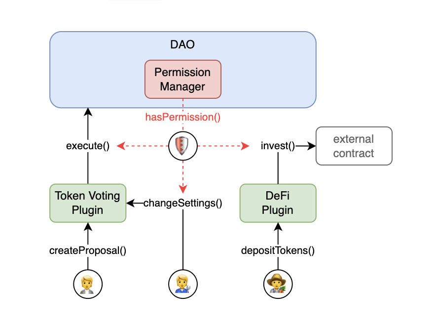

В такой схеме любое действие будет требовать соответствующего разрешения.

Команда Aragon предоставляет некоторые плагины. Их список небольшой, но они покрывают большую часть кейсов для организаций. Рекомендуется использовать именно их, поскольку они безопасны и максимально эффективны. С другой стороны, для написания своей логики предоставлены все необходимые условия — нужно только разобраться, как правильно устанавливать, обновлять и удалять плагины.

Абстрактный смарт-контракт [Plugin](https://github.com/aragon/osx/blob/v1.3.0/packages/contracts/src/core/plugin/Plugin.sol), который нужно наследовать для реализации своей логики, обладает минимумом функционала. В нем должен быть функционал для авторизации в организации (`DAOAuthorizable`), а также указан тип плагина и версия протокола.

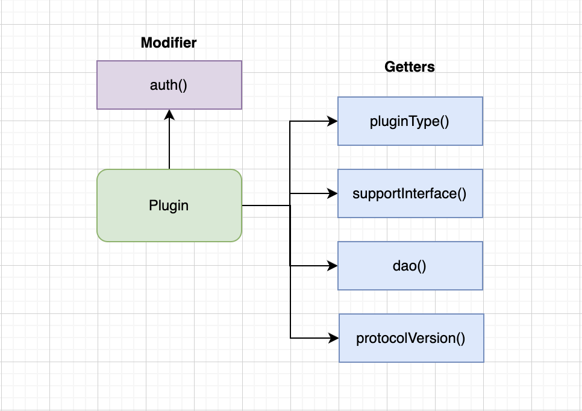

Существует три типа плагинов:
- **Constructable**: Для создания обычного (non-upgradeable) смарт-контракта.
- **Cloneable**: Для создания прокси с использованием паттерна Minimal Proxy Clones ([ERC-1167](https://eips.ethereum.org/EIPS/eip-1167), non-upgradeable).
- **UUPS**: Для создания прокси с использованием паттерна UUPS ([ERC-1822](https://eips.ethereum.org/EIPS/eip-1822), upgradeable).

### Смарт-контракты фреймворка

Для создания и управления core-контрактами необходимы смарт-контракты [фреймворка](https://github.com/aragon/osx/tree/v1.3.0/packages/contracts/src/framework). Чтобы создать DAO, понадобятся два смарт-контракта: [DAOFactory](https://github.com/aragon/osx/blob/v1.3.0/packages/contracts/src/framework/dao/DAOFactory.sol) и [DAORegistry](https://github.com/aragon/osx/blob/v1.3.0/packages/contracts/src/framework/dao/DAORegistry.sol). Во время создания DAO производится его полная настройка: установка метаданных, регистрация ENS-имени, установка плагинов и выдача необходимых разрешений.

Также, если во время создания DAO можно установить набор плагинов, за это будет отвечать [PluginSetupProcessor](https://github.com/aragon/osx/blob/v1.3.0/packages/contracts/src/framework/plugin/setup/PluginSetupProcessor.sol). Но есть важное условие: плагины уже должны быть созданы и связаны с соответствующими [PluginRepo](https://github.com/aragon/osx/blob/v1.3.0/packages/contracts/src/framework/plugin/repo/PluginRepo.sol), которые должны быть зарегистрированы в [PluginRepoRegistry](https://github.com/aragon/osx/blob/v1.3.0/packages/contracts/src/framework/plugin/repo/PluginRepoRegistry.sol). То есть `PluginSetupProcessor` — это установщик, как в настоящей операционной системе.

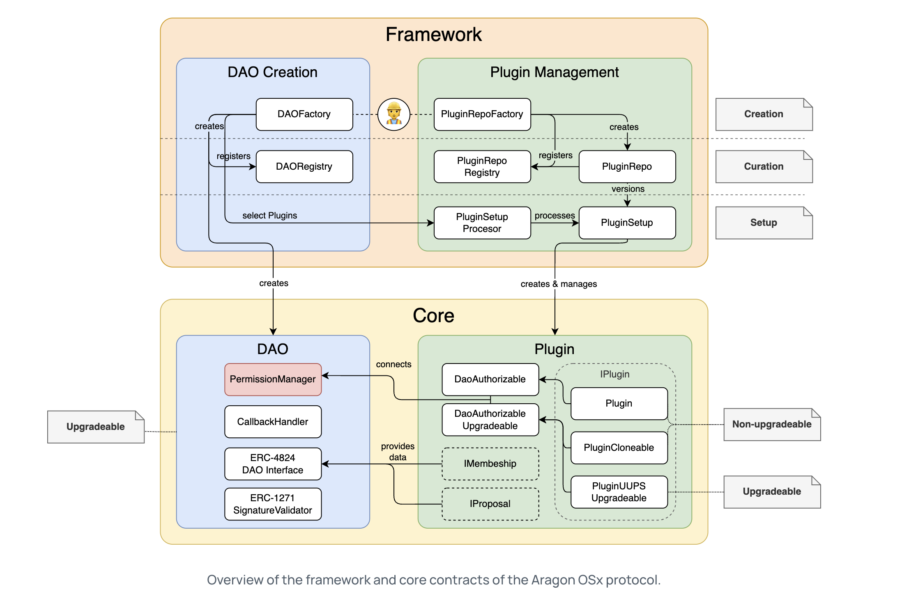

Может показаться сложновато, но достаточно понять, как создаются и устанавливаются плагины, чтобы схема выше не вызывала никаких затруднений.

#### Создание плагина

Первым делом создается "тело" плагина. Для этого, как уже было сказано выше, необходимо унаследовать базовую реализацию `Plugin` и добавить свою логику.

На этом этапе нужно определиться, будет ли возможность обновления плагина или, например, нужно ли будет разворачивать новые версии с похожей функциональностью. В зависимости от этого можно выбрать один из трех вариантов:

|                    | new Instantiation                    | Minimal Proxy (Clones)                    | UUPS Proxy                           |
| ------------------ | ------------------------------------ | ----------------------------------------- | ------------------------------------ |
| **upgradeability** | <span style="color:red">no</span>    | <span style="color:red">no</span>         | <span style="color:green">yes</span> |
| **gas costs**      | <span style="color:red">high</span>  | <span style="color:green">very low</span> | <span style="color:green">low</span> |
| **difficulty**     | <span style="color:green">low</span> | <span style="color:green">low</span>      | <span style="color:red">high</span>  |

В случае развертывания плагина через `new`, это будет обычный смарт-контракт с конструктором, а в случае с `MinimalProxy` или `UUPSProxy` необходимо добавить функцию `initialize`.

Самый же простой вариант non-upgradeable плагина будет выглядеть примерно так:

```solidity
// SPDX-License-Identifier: AGPL-3.0-or-later
pragma solidity 0.8.21;

import {Plugin, IDAO} from '@aragon/osx/core/plugin/Plugin.sol';

contract SimpleAdmin is Plugin {
  /// @notice ID разрешения для вызова функции на исполнение кода.
  bytes32 public constant ADMIN_EXECUTE_PERMISSION_ID = keccak256('ADMIN_EXECUTE_PERMISSION');
  address public immutable admin;

  /// @notice Инициализирует смарт-контракт.
  /// @param _dao Адрес связанного DAO.
  /// @param _admin Адрес администратора.
  constructor(IDAO _dao, address _admin) Plugin(_dao) {
    admin = _admin;
  }

  /// @notice Выполняет действия в связанном DAO.
  function execute(IDAO.Action[] calldata _actions) external auth(ADMIN_EXECUTE_PERMISSION_ID) {
    dao().execute({callId: 0x0, actions: _actions, allowFailureMap: 0});
  }
}
```

После того как готов код плагина, необходимо написать [PluginSetup](https://github.com/aragon/osx/blob/v1.3.0/packages/contracts/src/framework/plugin/setup/PluginSetup.sol) — смарт-контракт, содержащий инструкции по установке, настройке, удалению и обновлению плагина. В смарт-контракте `PluginSetup` должны быть функции `prepareInstallation()`, `prepareUninstallation()` и, если необходимо, `prepareUpdate()`. Эти функции как минимум отвечают за запрос назначения или отзыва разрешений для адресов `who` на смарт-контрактах `where` (а также явно декларируют, какие разрешения используются в плагине). Например, `prepareInstallation()` создает инстанс плагина и запрашивает все необходимые разрешения разом. Также `PluginSetup` может выполнять любые другие действия по настройке плагина. Подробнее об этом можно почитать [тут](https://devs.aragon.org/osx/how-to-guides/plugin-development/non-upgradeable-plugin/setup/). Все это также необходимо для совместимости с `PluginSetupProcessor`. 

Пример из практической части можно посмотреть [здесь](./contracts/src/WETHPluginSetup.sol).

##### Репозиторий для плагина

Для созданных ранее плагина и установщика необходимо создать ончейн-репозиторий (`PluginRepo`) через смарт-контракт фреймворка [PluginRepoFactory](https://github.com/aragon/osx/blob/v1.3.0/packages/contracts/src/framework/plugin/repo/PluginRepoFactory.sol). Репозиторий необходим для отслеживания версий плагина.

Все версии регистрируются в [PluginRepoRegistry](https://github.com/aragon/osx/blob/v1.3.0/packages/contracts/src/framework/plugin/repo/PluginRepoRegistry.sol), каждая версия плагина имеет соответствующий тег, который состоит из номера релиза (Release) и сборки (Build). Разные версии могут содержать исправления багов, новые функции или "breaking changes" — изменения, которые не имеют обратной совместимости с предыдущими версиями плагина.

Первая версия плагина будет под тегом `1.1`. Все дальнейшие обновления, содержащие серьезные изменения, будут менять номер релиза (первая цифра), исправления багов или добавление новых функций поменяют номер сборки конкретного релиза (вторая цифра).

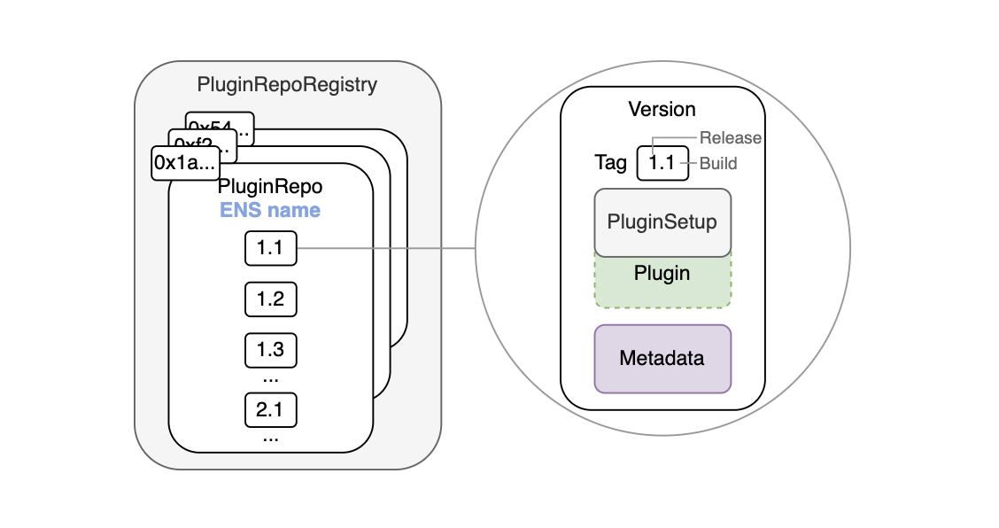

Первая версия будет создаваться вызовом функции `PluginRepoFactory::createPluginRepoWithFirstVersion()`:

```solidity
/// @notice Создает и регистрирует `PluginRepo` с поддоменом ENS и публикует начальную версию `1.1`.
/// @param _subdomain ENS поддомен репозитория плагина.
/// @param _pluginSetup Контракт настройки плагина, связанный с данной версией плагина.
/// @param _maintainer Адрес, который отвечает за поддержку плагина, ему передаются все права на управление и обновление плагина.
/// @param _releaseMetadata URI - метаданные, содержащие информацию о конкретном релизе.
/// @param _buildMetadata URI - метаданные, содержащие информацию о конкретной сборке.
/// @dev После создания `PluginRepo` и выпуска фабрикой первой версии право собственности передается адресу `_maintainer`.
function createPluginRepoWithFirstVersion(
  string calldata _subdomain,
  address _pluginSetup,
  address _maintainer,
  bytes memory _releaseMetadata,
  bytes memory _buildMetadata
) external returns (PluginRepo pluginRepo);
```

Адрес `_maintainer` после создания репозитория получает разрешения `ROOT_PERMISSION_ID`, `MAINTAINER_PERMISSION_ID` и `UPGRADE_REPO_PERMISSION_ID`. Эти разрешения позволяют `_maintainer` вызывать функции `PermissionManager::createVersion()` и `updateReleaseMetadata()`, а также обновлять смарт-контракт плагина.

Фабрика сразу выполняет регистрацию плагина через `PluginRepoRegistry::registerPluginRepo(string calldata subdomain, address pluginRepo)`.

Теперь плагин готов к установке (во время создания нового DAO). Это означает, что фактически он "опубликован" в Aragon.

#### Установка плагина

Создание и регистрация репозитория, а также написание установщика необходимы, если вы собираетесь опубликовать плагин для использования в фреймворке Aragon. В случае, если вам необходимо добавить в свою организацию какой-то кастомный функционал или расширить существующий плагин, достаточно унаследовать базовую функциональность. Также для своего удобства можно будет написать `PluginSetup`, но при этом создавать репозиторий не обязательно, если вы не планируете версионировать свой плагин.

Если плагин пишется для Aragon, необходимо выполнить все требования по его подготовке, описанные выше. После этого в функцию `DAOFactory::createDao()` можно будет передавать структуру `PluginSettings`, которая будет содержать адрес репозитория и дополнительные данные по установке, если они необходимы.

Установку плагина в существующий DAO нужно будет выполнить в два этапа через `PluginSetupProcessor`:
- Подготовка плагина к установке (`PluginSetupProcessor::prepareInstallation()`).
- Одобрение установки после подготовки (`PluginSetupProcessor::applyInstallation()`).

Одобрение установки плагина может выполнить только сущность, имеющая разрешение `APPLY_INSTALLATION_PERMISSION_ID`. Таким образом, установка нового плагина должна происходить через выдвижение предложения и одобряться DAO, чтобы можно было проверить, какие разрешения предоставляются этому плагину и какие действия он будет выполнять.

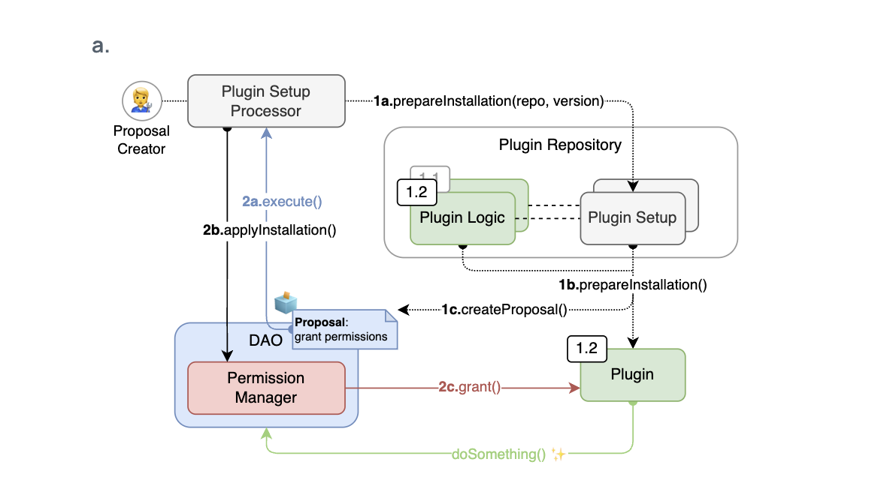

Хорошим примером смарт-контракта `PluginSetup` является [TokenVotingSetup](https://github.com/aragon/osx/blob/v1.3.0/packages/contracts/src/plugins/governance/majority-voting/token/TokenVotingSetup.sol). Плагин [TokenVoting](https://github.com/aragon/osx/blob/v1.3.0/packages/contracts/src/plugins/governance/majority-voting/token/TokenVoting.sol) необходим для функционала Governance. В процессе настройки плагина перед установкой у вас есть возможность создать новый токен для голосования либо добавить свой. Если существующий токен уже поддерживает `IVotesUpgradeable` от OpenZeppelin, можно использовать его напрямую. Если нет, `TokenVotingSetup` создаст токен-обертку, которая будет обладать необходимым функционалом для голосования.

#### Обновление и удаление плагина

Также в `PluginSetupProcessor` есть методы для обновления и деинсталляции плагина (`applyUpdate`, `applyUninstallation`), которые, по аналогии с установкой, выполняются в два этапа. В процессе установки/обновления/удаления плагина смарт-контракту [PluginSetupProcessor](https://github.com/aragon/osx/blob/v1.3.0/packages/contracts/src/framework/plugin/setup/PluginSetupProcessor.sol) на время передаются права `ROOT_PERMISSION_ID`, но они сразу же отзываются после выполнения операций.

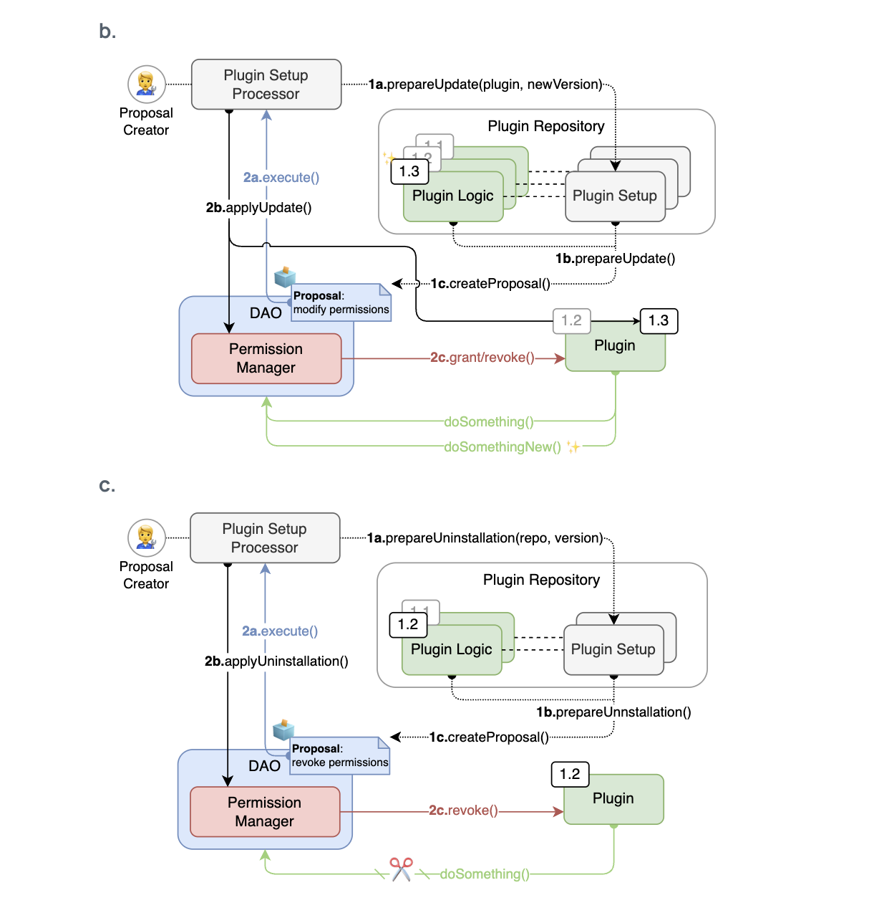

Так как функция `DAO::execute()` может принимать массив `Actions[]`, это позволяет в одном предложении одобрить сразу несколько действий с разными плагинами. К примеру, в случае замены одного плагина на другой, можно одновременно выполнить установку нового и удаление старого.

Обновление плагина до новой версии релиза или новой сборки должно сопровождаться вызовом `PluginRepo::createVersion()`.

_Важно!_ `PluginRepo` отвечает только за версионирование плагина, но не выполняет непосредственную установку, обновление либо деинсталляцию.

## Использование

Для создания и взаимодействия с DAO существует три основных способа:
- [Aragon App](https://app.aragon.org/) — простой и интуитивно понятный интерфейс от Aragon, который позволяет создать и настроить DAO, а также создавать предложения;
- [Aragon SDK](https://github.com/aragon/sdk) — позволяет создавать собственные интерфейсы для управления DAO;
- [Aragon OSx](https://github.com/aragon/osx) — используется под капотом в Aragon App и Aragon SDK, но также есть возможность напрямую взаимодействовать со смарт-контрактами (только для опытных пользователей).

### Aragon App

Для большинства пользователей Aragon App будет более чем достаточно. Протокол значительно упростил свой интерфейс. С помощью Aragon App можно быстро создать DAO, в котором устанавливается всего один плагин — [TokenVoting](https://github.com/aragon/osx/blob/v1.3.0/packages/contracts/src/plugins/governance/majority-voting/token/TokenVoting.sol). В связке с функцией `DAO::execute()` это уже очень мощный инструмент. В процессе настройки можно создать или добавить свой токен, выбрать способ голосования и установить нужные параметры. В дальнейшем любое действие будет выполняться только через создание предложения (proposal), включая изменение параметров голосования.

Основные настройки голосования за proposal в случае, если голосование будет выполняться токенами:
- **Support threshold (порог поддержки)**: Процент токенов, проголосовавших "Да" в поддержку предложения. Считается от всех токенов, принявших участие в голосовании;
- **Minimum participation (минимальное участие)**: Необходимый процент токенов от общего предложения (totalSupply);
- **Minimum duration (минимальный период)**: Наименьший период времени, в течение которого предложение открыто для голосования (не менее одного дня);
- **Early execution (досрочное исполнение)**: Позволяет выполнить предложение до окончания периода голосования в случае, если превышен порог поддержки, соблюдено минимальное количество участников и результат не может быть изменен за счет участия большего количества избирателей;
- **Vote change (изменение параметров)**: Позволяет избирателям изменять свой голос в течение периода голосования. Эта настройка не может быть включена, если включено досрочное исполнение;
- **Proposal creation (кто может создавать предложения)**: Предложения могут создавать либо владельцы токенов голосования, либо любой пользователь. Также можно настраивать минимальный порог токенов для создания предложения.

_Примечание:_ В случае выбора модели multisig достаточно добавить адреса, которые будут участвовать в голосованиях, и минимальное количество адресов, необходимое для выполнения proposal.

В процессе создания proposal можно выбрать, какое действие необходимо выполнить, если предложение будет принято. Здесь можно выбрать взаимодействие с любым смарт-контрактом (это опционально, можно просто описать предложение текстом).

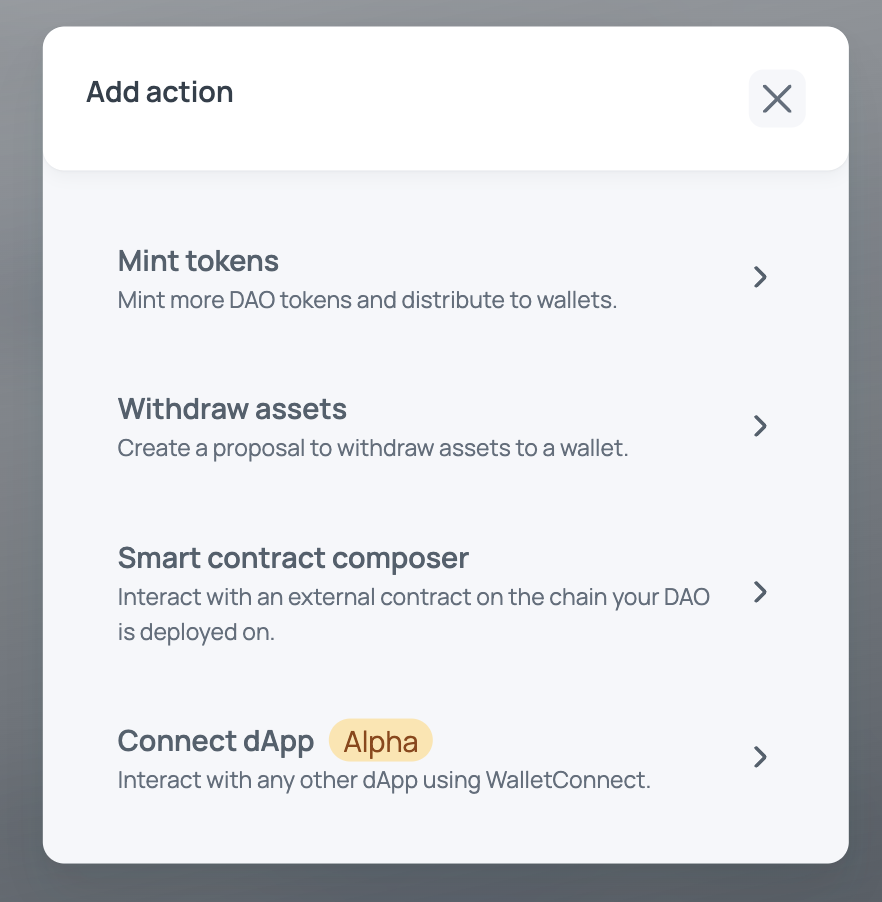

Например, вот так будет выглядеть оборачивание ETH в WETH с помощью смарт-контракта WETH.

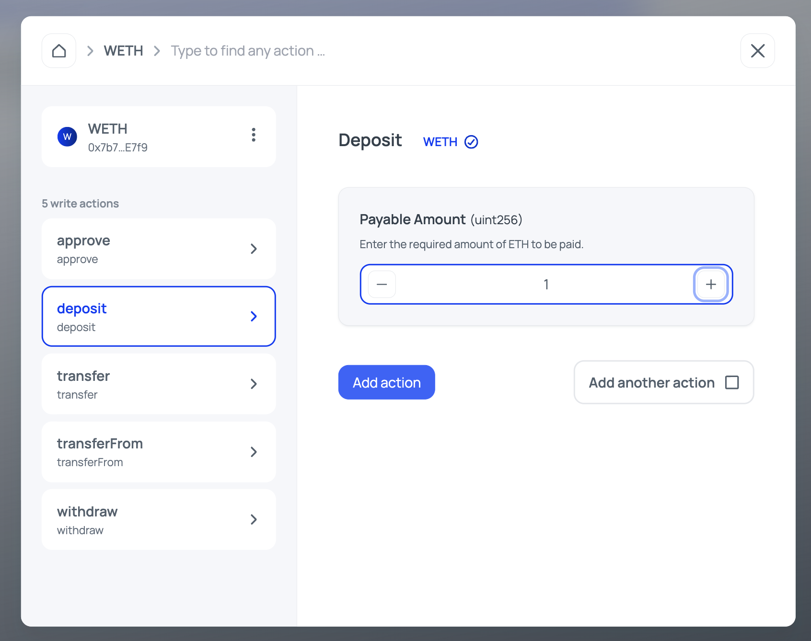

После одобрения предложения можно будет вызвать `DAO::execute()`.

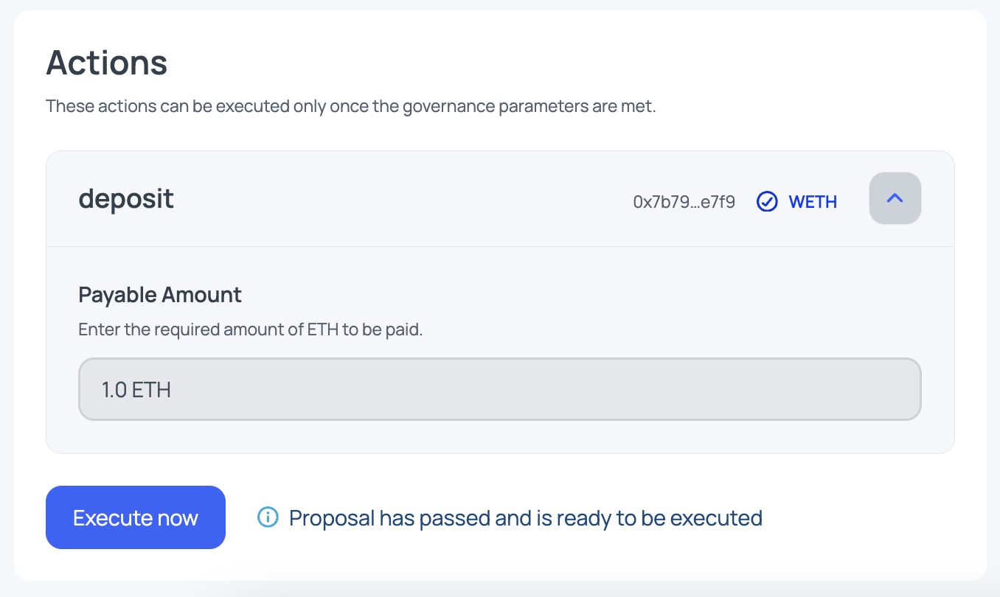

### Aragon OSx

Для того чтобы нагляднее показать, что происходит "под капотом", напишем foundry-скрипты для взаимодействия с протоколом. В данном примере будем использовать версию протокола Aragon OSx v1.3.0. Посмотреть смарт-контракты этой версии можно [тут](https://github.com/aragon/osx/tree/v1.3.0/packages/contracts).

#### Создание DAO

_Примечание:_ Для запуска проекта потребуется небольшая настройка, подробнее [здесь](./contracts/README.md).

Первый скрипт будет создавать DAO в сети Sepolia. Все, что нужно — это поменять адрес `DEPLOYER_ADDRESS` и при желании изменить некоторые параметры настройки DAO. Адреса служебных смарт-контрактов Aragon для Sepolia (`DAOFactory`) можно найти [здесь](https://github.com/aragon/osx-commons/blob/develop/configs/src/deployments/json/sepolia.json).

Деплой выполняется в три этапа:

1. Формируются параметры настройки самого DAO. Это в основном различные метаданные, соответствующие [ERC-4824](https://eips.ethereum.org/EIPS/eip-4824).
2. Формируются параметры для плагина TokenVoting. Напомню, что нельзя создать DAO без хотя бы одного плагина. В эти параметры входят настройки голосования, а также параметры токена голосования, если его нужно создать, и параметры первоначальной эмиссии токена. Помимо этого понадобится информация о `PluginRepo` для данного плагина и его версии.
3. Деплой DAO с установкой плагина и настройкой всех параметров.

```solidity
contract CreateDao is Script {
    /// Здесь необходимо изменить только DEPLOYER_ADDRESS
    address constant DEPLOYER_ADDRESS = 0x32bb35Fc246CB3979c4Df996F18366C6c753c29c;

    address constant DAO_FACTORY_ADDRESS = 0x7a62da7B56fB3bfCdF70E900787010Bc4c9Ca42e;
    address constant TOKEN_VOTING_PLUGIN_REPO_ADDRESS = 0x424F4cA6FA9c24C03f2396DF0E96057eD11CF7dF;

    /// Используем DAOFactory в сети Sepolia
    IDAOFactory daoFactory = IDAOFactory(DAO_FACTORY_ADDRESS);

    function run() external {
        /// Шаг 1 - Подготовка настроек для создания DAO

        /// 1.1 Для простоты не будем передавать развернутую информацию о DAO
        DAOSettings memory daoSettings =
            DAOSettings({trustedForwarder: address(0), daoURI: "", subdomain: "", metadata: new bytes(0)});

        /// Шаг 2 - Подготовка настроек для установки плагина TokenVoting

        /// 2.1 Указываем версию плагина TokenVoting и адрес PluginRepo для этого плагина (Sepolia)
        PluginSetupRef memory pluginSetupRef = PluginSetupRef(
            PluginRepo.Tag({release: uint8(1), build: uint16(2)}), PluginRepo(TOKEN_VOTING_PLUGIN_REPO_ADDRESS)
        );

        /// 2.2 Параметры голосования для установки плагина TokenVoting
        MajorityVotingBase.VotingSettings memory votingSettings = MajorityVotingBase.VotingSettings({
            votingMode: MajorityVotingBase.VotingMode.EarlyExecution, // Разрешено досрочное выполнение
            supportThreshold: uint32(500000), // 50%
            minParticipation: uint32(150000), // 15%
            minDuration: uint64(86400), // 1 day
            minProposerVotingPower: 1e18 // Минимальное кол-во токенов для голосования = 1
        });

        /// 2.3 Параметры для создания токена голосования
        TokenVotingSetup.TokenSettings memory tokenSettings = TokenVotingSetup.TokenSettings({
            addr: address(0), // create new token
            name: "Test",
            symbol: "T"
        });

        /// 2.4 Получатель токенов — адрес деплоера
        address[] memory receivers = new address[](1);
        receivers[0] = DEPLOYER_ADDRESS;

        /// 2.5 Для примера сминтим 10 токенов на адрес деплоера
        uint256[] memory amounts = new uint256[](1);
        amounts[0] = 10e18;

        /// 2.6 Параметры для первоначальной эмиссии токена голосования
        GovernanceERC20.MintSettings memory mintSettings = GovernanceERC20.MintSettings(receivers, amounts);

        /// 2.7 Наконец, собираем вместе все настройки плагина
        bytes memory data = abi.encode(votingSettings, tokenSettings, mintSettings);
        PluginSettings[] memory pluginSettings = new PluginSettings[](1);
        pluginSettings[0] = PluginSettings(pluginSetupRef, data);

        uint256 deployerPrivateKey = vm.envUint("PRIVATE_KEY");

        vm.startBroadcast(deployerPrivateKey);

        /// Шаг 3 - Создаем DAO
        IDAO dao = daoFactory.createDao(daoSettings, pluginSettings);

        vm.stopBroadcast();

        console.log("------------------ Deployed contracts --------------------");
        console.log("DAO               : ", address(dao));
        console.log("------------------ Deployment info -----------------------");
        console.log("Chain id          : ", block.chainid);
        console.log("Deployer          : ", vm.addr(deployerPrivateKey));
    }
}
```

Полный код скрипта `CreateDao` можно посмотреть [здесь](./contracts/script/CreateDao.s.sol).

Теперь достаточно запустить данный скрипт. Флаг `-vvvv` отобразит подробную информацию о развертывании и настройке DAO. Если вы не планируете деплоить смарт-контракт, а хотите только посмотреть, что происходит во время развертывания, уберите флаг `--broadcast`:

```shell
$ forge script script/CreateDao.s.sol \
--rpc-url sepolia\
--broadcast \
-vvvv
```

#### Создание и установка плагина

Создадим простой плагин для задачи, аналогичной той, которую мы выполняли через интерфейс — оборачивание ETH в WETH.

_Примечание:_ На самом деле, такой простой плагин не имеет смысла, потому что это действие можно выполнить напрямую через `DAO::execute()`. Поэтому плагин используется исключительно в демонстрационных целях.

В плагине будет всего одна функция, которая делает депозит, а обернутые токены отправляет на адрес DAO. Для вызова этой функции вызывающая сущность должна иметь разрешение `DEPOSIT_PERMISSION` на этом плагине. Также плагин является upgradeable.

```solidity
contract WETHPlugin is PluginUUPSUpgradeable {
    /// @notice Разрешение для вызова функции deposit()
    bytes32 public constant DEPOSIT_PERMISSION = keccak256("DEPOSIT_PERMISSION");

    IWETH internal _weth;
    IDAO internal _dao;

    /// @notice Выполняет инициализацию плагина
    function initialize(IDAO dao, IWETH weth) external initializer {
        __PluginUUPSUpgradeable_init(dao);

        _weth = weth;
        _dao = dao;
    }

    /// @notice Оборачивает ETH в WETH
    function depositToWeth() external payable auth(DEPOSIT_PERMISSION) {
        _weth.deposit{value: msg.value}();
        IERC20(address(_weth)).transfer(address(_dao), msg.value);
    }
}
```

Допустим, мы хотим опубликовать наш плагин. Для этого понадобится смарт-контракт [WETHPluginSetup](./contracts/src/WETHPluginSetup.sol). Этот смарт-контракт будет развертываться только один раз для нашего плагина, поэтому имплементация плагина будет развертываться в конструкторе.

```solidity
contract WETHPluginSetup is PluginSetup {
    /// @notice Адрес плагина
    address private immutable wethPlugin;

    /// @dev Контракт PluginSetup развертывается только один раз для плагина
    constructor() {
        wethPlugin = address(new WETHPlugin());
    }
}
```

Самое важное — это функции `prepareInstallation` и `prepareUninstallation`. Добавим функцию `prepareInstallation` для установки плагина в наш WETHPluginSetup. Она будет получать необходимые параметры для инициализации, создавать прокси плагина, а также выдавать разрешение для DAO на взаимодействие с основной функцией.

```solidity
contract WETHPluginSetup is PluginSetup {
    /// ...

    function prepareInstallation(address _dao, bytes calldata _data)
        external
        returns (address plugin, PreparedSetupData memory preparedSetupData)
    {
        /// Получаем адрес WETH из данных, переданных во время установки
        IWETH weth = abi.decode(_data, (IWETH));

        /// Проверяем, что адрес валидный
        if (address(weth) == address(0)) {
            revert WethAddressInvalid();
        }

        /// Создаем прокси для плагина WETHPlugin
        plugin = createERC1967Proxy(wethPlugin, abi.encodeCall(WETHPlugin.initialize, (IDAO(_dao), weth)));

        /// Выдаем разрешение на вызов функции deposit() для DAO
        PermissionLib.MultiTargetPermission[] memory permissions = new PermissionLib.MultiTargetPermission[](1);

        permissions[0] = PermissionLib.MultiTargetPermission({
            operation: PermissionLib.Operation.Grant,
            where: plugin,
            who: _dao,
            condition: PermissionLib.NO_CONDITION,
            permissionId: WETHPlugin(this.implementation()).DEPOSIT_PERMISSION()
        });

        preparedSetupData.permissions = permissions;
    }
}
```

Полный код смарт-контракта с функцией деинсталляции можно посмотреть [здесь](./contracts/src/WETHPluginSetup.sol).

#### Скрипт для установки плагина

Для того чтобы установить плагин в наше DAO, понадобится создать и зарегистрировать для него репозиторий, а также создать голосование в `TokenVoting`, поскольку только этот смарт-контракт может вызывать `DAO::execute()`, а установить плагин может только смарт-контракт DAO.

Пошагово это будет выглядеть следующим образом:

1. Развертывается смарт-контракт `WETHPluginSetup`.
2. Создается и регистрируется в ENS `PluginRepo` для `WETHPlugin`. Эти действия выполняются через смарт-контракт фреймворка `PluginRepoFactory`.
3. Далее выполняется так называемая предустановка: на смарт-контракте фреймворка `PluginSetupProcessor` вызывается функция `prepareInstallation`, куда передаются все параметры будущей установки.
4. Далее нужно сформировать параметры для окончательной установки через `PluginSetupProcessor::applyInstallation`.
5. Затем нужно создать предложение в `TokenVoting`. Это предложение будет содержать вызов `PluginSetupProcessor::applyInstallation` и выдаст разрешение `ROOT_PERMISSION_ID` для `PluginSetupProcessor`. После установки плагина это разрешение сразу отзывается в этой же транзакции.
6. После создания предложения за него нужно проголосовать.
7. Наконец, после успешного голосования можно выполнить предложение, тем самым завершив установку плагина в DAO.

```solidity
contract InstallWethPlugin is Script {
    /// Здесь необходимо изменить: DEPLOYER_ADDRESS, DAO_ADDRESS
    address constant DEPLOYER_ADDRESS = 0x32bb35Fc246CB3979c4Df996F18366C6c753c29c;
    address constant DAO_ADDRESS = 0x201836b4AEE703f29913c4b5CEb7E1c16C5eAb7b;

    address constant PLUGIN_REPO_FACTORY = 0x07f49c49Ce2A99CF7C28F66673d406386BDD8Ff4;
    address constant PLUGIN_SETUP_PROCESSOR = 0xC24188a73dc09aA7C721f96Ad8857B469C01dC9f;
    address constant WETH = 0x7b79995e5f793A07Bc00c21412e50Ecae098E7f9;
    address constant TOKEN_VOTING = 0xAABcB955DC1Ab7fDE229944DD329b4efc10c4ca7;

    /// Используем pluginRepoFactory и pluginSetupProcessor в сети Sepolia
    PluginRepoFactory pluginRepoFactory = PluginRepoFactory(PLUGIN_REPO_FACTORY);
    PluginSetupProcessor pluginSetupProcessor = PluginSetupProcessor(PLUGIN_SETUP_PROCESSOR);

    function run() external {
        uint256 deployerPrivateKey = vm.envUint("PRIVATE_KEY");

        vm.startBroadcast(deployerPrivateKey);

        /// Шаг 1 - Деплоим смарт-контракт с настройками для установки плагина
        WETHPluginSetup pluginSetupAddress = new WETHPluginSetup();

        /// Шаг 2 - Создаем и регистрируем PluginRepo
        /// 2.1 Поддомен для регистрации плагина в ENS
        string memory subdomain = "weth-plugin";
        /// 2.2 Метаданные (нельзя передавать bytes(0))
        bytes memory releaseMetadata = new bytes(1);
        bytes memory buildMetadata = new bytes(1);
        /// 2.3 Деплой и регистрация PluginRepo
        PluginRepo pluginRepo = pluginRepoFactory.createPluginRepoWithFirstVersion(
            subdomain, address(pluginSetupAddress), DEPLOYER_ADDRESS, releaseMetadata, buildMetadata
        );

        /// Шаг 3 - Делаем запрос на установку плагина в наше DAO
        /// Для этого нужно подготовить параметры
        /// 3.1 Версия плагина и адрес PluginRepo
        PluginSetupRef memory pluginSetupRef =
            PluginSetupRef(PluginRepo.Tag({release: uint8(1), build: uint16(1)}), pluginRepo);

        /// 3.2 Данные, необходимые для установки плагина
        bytes memory payload = abi.encode(WETH);

        /// 3.3 Формируем окончательные параметры
        PluginSetupProcessor.PrepareInstallationParams memory prepareInstallationParams =
            PluginSetupProcessor.PrepareInstallationParams(pluginSetupRef, payload);

        /// 3.4 Делаем предустановку (это только первый этап установки)
        (address plugin, IPluginSetup.PreparedSetupData memory preparedSetupData) =
            pluginSetupProcessor.prepareInstallation(DAO_ADDRESS, prepareInstallationParams);

        /// Шаг 4 - Подготовка к окончательной установке плагина
        /// 4.1 Хелперы не понадобятся, поэтому создаем пустой массив
        address[] memory helpers = new address[](0);

        /// 4.2 Выставляем параметры установки
        /// Адрес плагина получили на предустановке, т.к. он был развернут через prepareInstallation
        /// pluginSetupRef уже сформированы ранее
        /// permissions используются из WETHPluginSetup
        PluginSetupProcessor.ApplyInstallationParams memory applyInstallationParams = PluginSetupProcessor
            .ApplyInstallationParams({
            pluginSetupRef: pluginSetupRef,
            plugin: plugin,
            permissions: preparedSetupData.permissions,
            helpersHash: hashHelpers(helpers)
        });

        /// Шаг 5 - Т.к. установку может выполнить только DAO, а функцию DAO::execute() можно вызывать
        /// только через приложение TokenVoting, необходимо создать голосование на эти действия

        /// 5.1 Получаем инстанс приложения TokenVoting
        TokenVoting tokenVoting = TokenVoting(TOKEN_VOTING);

        /// 5.2 Формируем массив Action, который будет передан на исполнение DAO
        /// Помимо непосредственной установки плагина WETHPlugin
        /// Понадобится выдать разрешение ROOT_PERMISSION_ID контракту PluginSetupProcessor
        /// Чтобы он мог выдать разрешения из WETHPluginSetup
        /// После чего это разрешение нужно отозвать 
        IDAO.Action[] memory actions = new IDAO.Action[](3);
        
        /// Действие на выдачу разрешения ROOT_PERMISSION_ID для PluginSetupProcessor
        actions[0] = IDAO.Action({
            to: address(DAO_ADDRESS),
            value: 0,
            data: abi.encodeCall(
                PermissionManager.grant,
                (DAO_ADDRESS, address(pluginSetupProcessor), DAO(payable(DAO_ADDRESS)).ROOT_PERMISSION_ID())
            )
        });
        /// Действие на установку плагина
        actions[1] = IDAO.Action({
            to: address(pluginSetupProcessor),
            value: 0,
            data: abi.encodeCall(PluginSetupProcessor.applyInstallation, (DAO_ADDRESS, applyInstallationParams))
        });
        /// Действие на отзыв разрешения ROOT_PERMISSION_ID для PluginSetupProcessor
        actions[2] = IDAO.Action({
            to: address(DAO_ADDRESS),
            value: 0,
            data: abi.encodeCall(
                PermissionManager.revoke,
                (DAO_ADDRESS, address(pluginSetupProcessor), DAO(payable(DAO_ADDRESS)).ROOT_PERMISSION_ID())
            )
        });
        
        /// 5.3 Создаем предложение для голосования
        bytes memory metadata = new bytes(0);
        uint256 proposalId =
            tokenVoting.createProposal(metadata, actions, 0, 0, 0, IMajorityVoting.VoteOption.None, false);

        /// Шаг 6 - Голосуем за предложение (т.к. мы единственные держатели токенов голосования)
        tokenVoting.vote(proposalId, IMajorityVoting.VoteOption.Yes, false);

        /// Шаг 7 - Выполняем предложение (только на этом шаге плагин будет установлен)
        tokenVoting.execute(proposalId);

        vm.stopBroadcast();

        console.log("------------------ Deployed contracts --------------------");
        console.log("WethPlugin        : ", plugin);
        console.log("WETHPluginSetup   : ", address(pluginSetupAddress));
        console.log("WethPluginRepo    : ", address(pluginRepo));
        console.log("------------------ Deployment info -----------------------");
        console.log("Chain id           : ", block.chainid);
        console.log("Deployer          : ", vm.addr(deployerPrivateKey));
    }
}
```

Полный код скрипта [здесь](./contracts/script/InstallWethPlugin.s.sol). Для его запуска потребуется флаг `--via-ir`:

```shell
forge script script/InstallWethPlugin.s.sol --rpc-url sepolia --via-ir -vvvv --broadcast
```

Теперь плагин установлен и готов к использованию.

#### Использование плагина

Напишем последний скрипт для использования плагина. Права на вызов основной функции есть у DAO, поэтому снова нужно создать предложение и проголосовать за него. Последовательность действий следующая:

1. Отправляем на адрес DAO немного эфира, именно этот эфир будет обернут нашим плагином.
2. Создаем голосование, на этот раз достаточно одного действия — вызов функции `WETHPlugin::depositToWeth`.
3. Создаем соответствующее предложение для голосования.
4. Голосуем за это предложение.
5. Выполняем предложение после успешного голосования.
6. Проверяем, что токены действительно были обернуты и отправлены на адрес DAO.

```solidity
contract DepositToWeth is Script {
    /// Здесь необходимо изменить: DEPLOYER_ADDRESS, DAO_ADDRESS, WETH_PLUGIN
    address constant DEPLOYER_ADDRESS = 0x32bb35Fc246CB3979c4Df996F18366C6c753c29c;
    address constant DAO_ADDRESS = 0x201836b4AEE703f29913c4b5CEb7E1c16C5eAb7b;
    address constant WETH_PLUGIN = 0x6602440aB337addc708cfa10077eabAEda6Cc882;

    address constant WETH = 0x7b79995e5f793A07Bc00c21412e50Ecae098E7f9;
    address constant TOKEN_VOTING = 0xAABcB955DC1Ab7fDE229944DD329b4efc10c4ca7;

    function run() external {
        uint256 deployerPrivateKey = vm.envUint("PRIVATE_KEY");

        vm.startBroadcast(deployerPrivateKey);

        /// Шаг 1 - Отправляем DAO немного эфира (0.000000000000001 ETH)
        IDAO(DAO_ADDRESS).deposit{value: 1000}(address(0), 1000, "");

        /// Шаг 2 - Создаем голосование
        TokenVoting tokenVoting = TokenVoting(TOKEN_VOTING);

        /// 2.2 Добавляем действие WETHPlugin::depositToWeth()
        IDAO.Action[] memory actions = new IDAO.Action[](1);

        /// Депозит 1000 wei (0.000000000000001 ETH)
        actions[0] =
            IDAO.Action({to: WETH_PLUGIN, value: 1000, data: abi.encodeCall(IWETHPlugin.depositToWeth, ())});

        /// 2.3 Создаем предложение для голосования
        bytes memory metadata = new bytes(0);
        uint256 proposalId =
            tokenVoting.createProposal(metadata, actions, 0, 0, 0, IMajorityVoting.VoteOption.None, false);

        /// Шаг 3 - Голосуем за предложение 
        tokenVoting.vote(proposalId, IMajorityVoting.VoteOption.Yes, false);

        /// Шаг 4 - Выполняем предложение (т.к. мы единственные держатели токенов голосования)
        tokenVoting.execute(proposalId);

        /// Шаг 5 - Проверяем выполнение депозита, средства должны поступить на адрес DAO
        uint256 wethPluginBalance = IWETH(WETH).balanceOf(DAO_ADDRESS);

        vm.stopBroadcast();

        console.log("------------------ Scrypt info --------------------");
        console.log("ProposalID        : ", proposalId);
        console.log("wethPluginBalance : ", wethPluginBalance);
        console.log("------------------ Chain info -----------------------");
        console.log("Chain id           : ", block.chainid);
    }
}
```

Полный код скрипта доступен по [этой ссылке](./contracts/script/DepositToWeth.s.sol).

Команда для выполнения скрипта:
```shell
forge script script/DepositToWeth.s.sol --rpc-url sepolia -vvvv --broadcast
```

## Заключение

Протокол Aragon значительно эволюционировал с момента первой версии до Aragon OSx. Несмотря на сохранение базовой концепции, реализация стала гораздо проще и интуитивно понятнее. Более того, протокол отошел от идеи создания множества плагинов (в первой версии они назывались приложениями). В Aragon OSx огромное количество кейсов может покрыть всего один плагин — TokenVoting. Также стало значительно проще взаимодействовать с внешними смарт-контрактами, позволяя в одном предложении закодировать множество вызовов смарт-контрактов.

Как видно из последнего раздела, с протоколом гораздо проще взаимодействовать через интерфейс или SDK. Прямое взаимодействие через смарт-контракты AragonOSx возможно, но довольно затруднительно и требует хороших знаний Solidity. При этом всегда можно разработать свой или доработать существующий плагин, что позволяет выполнять любую логику необходимую для функционирования организации.

Подход к работе с плагинами довольно серьезный, что необходимо для их безопасной установки, обновления и удаления. Примечательно, что Aragon OSx, в работе с плагинами, с точки зрения подходов представляет собой децентрализованную мини-операционную систему.

В целом протокол оставляет очень хорошее впечатление и вселяет надежду на появление все большего количества децентрализованных организаций.

## Ссылки

- [Docs: Aragon](https://devs.aragon.org/)
- [Repo: Aragon OSx (v1.3.0)](https://github.com/aragon/osx/tree/v1.3.0)
- [Repo: Aragon OSx (latest)](https://github.com/aragon/osx)
- [Адреса развернутых смарт-контрактов в разных сетях](https://github.com/aragon/osx-commons/tree/develop/configs/src/deployments/json)