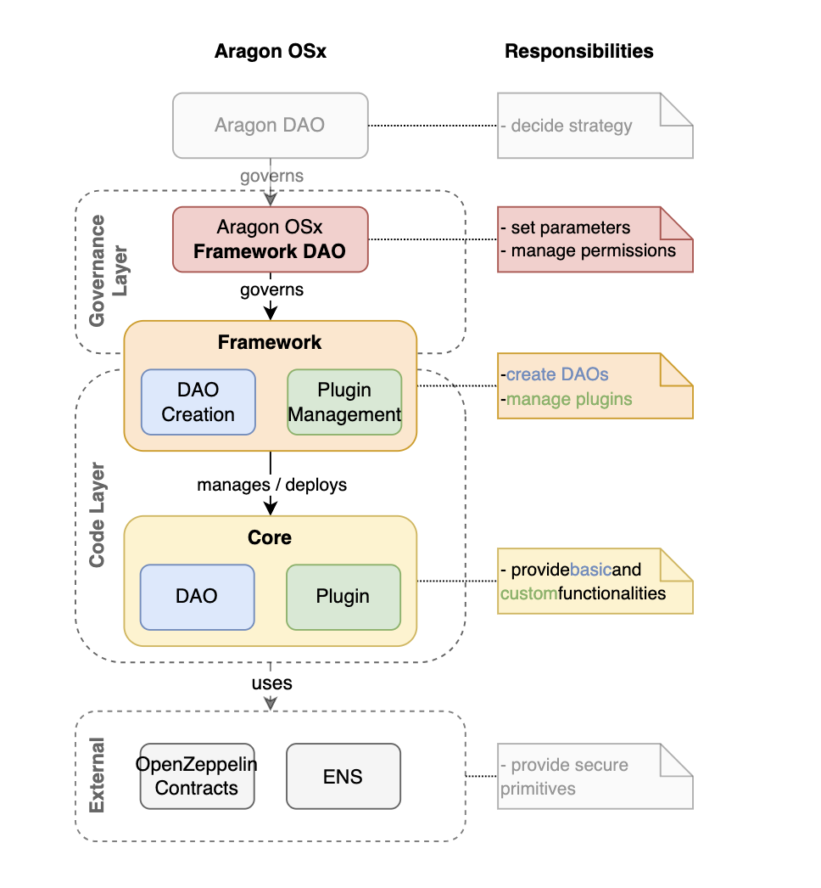
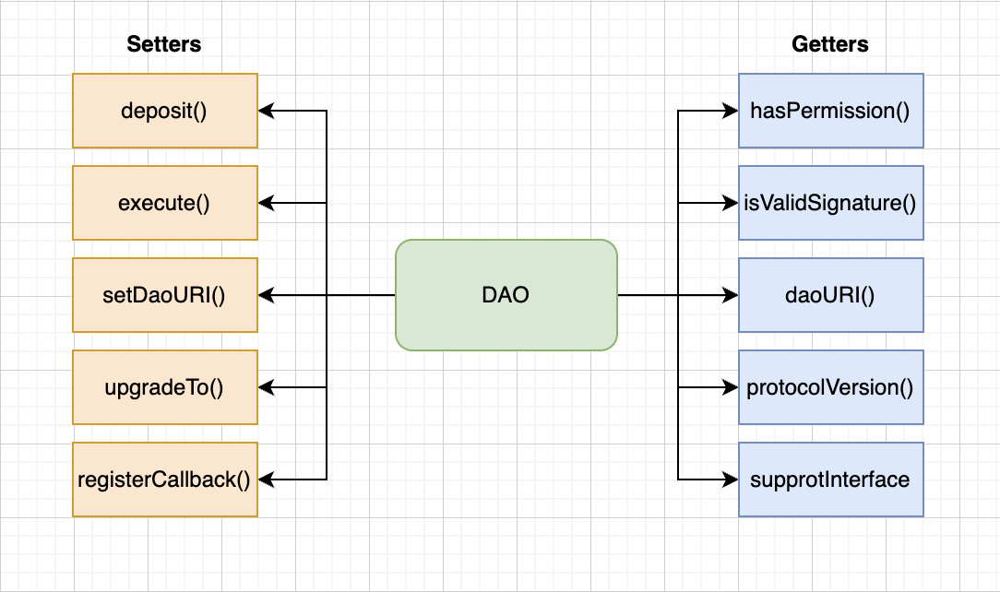
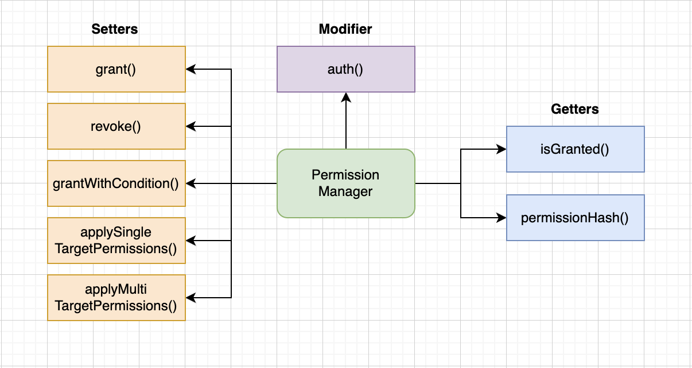
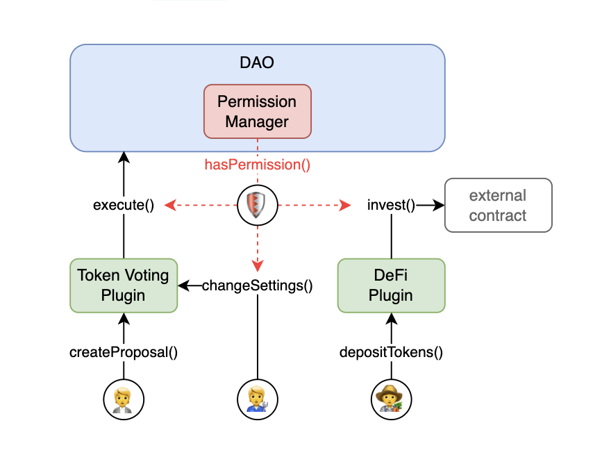
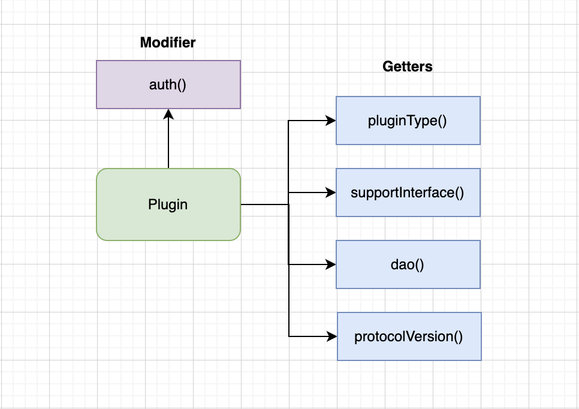
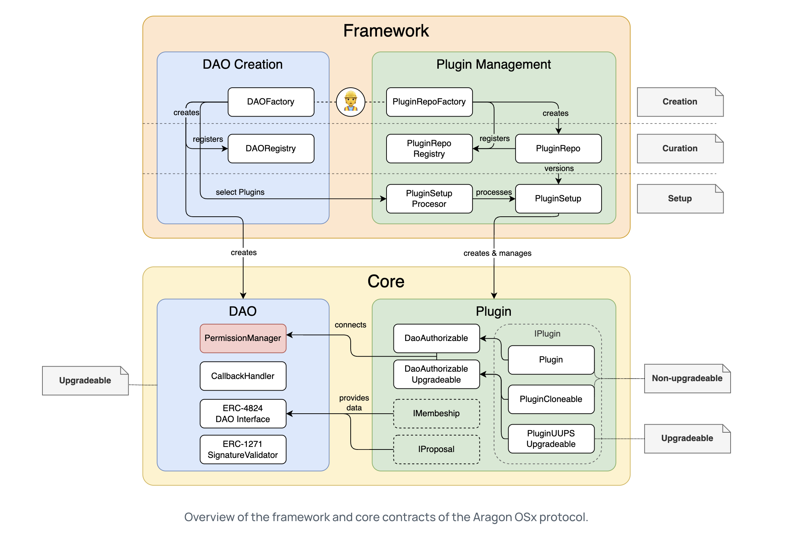

# Aragon DAO v2

**Автор:** [Роман Ярлыков](https://github.com/rlkvrv) 🧐

DAO - это децентрализованные автономные организации. Они представляют собой группу людей, управляющих активами ончейн с помощью набора смарт-контрактов.

Aragon - это хорошо зарекомендовавший себя фреймворк для построения DAO, который был основан в 2016 году и сильно трансформировался с тех пор. Протокол не боится проводить эксперименты с разными подходами и концепциями - некоторые из них приживаются, от других приходится отказываться, но в целом это позволяет фреймворку улучшаться и эволюционировать.

На уровне идеи многие вещи остались прежними, но реализация претерпела значительные изменения, поэтому есть смысл погрузится глубже в архитектуру обновленного фреймворка.
  
## Архитектура

_Дисклеймер!_ В этой статье разбирается версия протокола Aragon OSx 1.3.0. В последующих версиях могут быть небольшие изменения в реализации каких-то конкретных фич, но на уровне базовой архитектуры все должно работать также.

Aragon v2 или "новый технологический стек" Aragon был представлен в Марте 2023 года, это полностью обновленный и переработанный фреймворк в основе которого лежит операционная система Aragon OSx. Новый стек также позволяет создавать, настраивать и управлять DAO, но делает это по-другому. Основная концепция похожа на предыдущую версию протокола где также выделяется три главных примитива, только изменилась ответственность этих примитивов и способы взаимодействия. Про предыдущую версию я уже писал ранее, напомню, что она базировалась на Kernel (ядро, отвечало за установку и удаление приложений), ACL (списки доступа) и AragonApps (приложения, которые содержали всю логику).

Основные примитивы Aragon OSx (core-контракты) это:
- **DAO contract**: Содержит всю базовую логику организации, хранит активы и управляет доступами;
- **Permissions (разрешения)**: Определяет отношения между плагинами, DAO и другими адресами;
- **Plugins**: Содержат пользовательскую функциональность организации, управляются через ончейн репозитории (контроль версий).

Как и раньше с помощью разрешений и плагинов можно создавать и настраивать DAO очень гибко. Также можно написать свой плагин и опубликовать его в репозитории плагинов (ончейн). Чтобы облегчить эту задачу, Aragon OSx использует набор смарт-контрактов фреймворка:
- **DAOFactory и DAORegistry:** Используются для создания и курирования DAO;
- **PluginRepoFactory и PluginRepoRegistry:** Используются для создания и версионирования репозиториев плагинов;
- **PluginSetupProcessor:**: Устанавливает плагины из репозитория плагинов в DAO (установка, обновление, удаление).

В качестве внешних зависимостей протокола используются смарт-контракты библиотеки OpenZeppelin и ENS Domains.

Ниже схема из документации Aragon в которой отражена иерархия сущностей и их ответственность:



Помимо слоя кода на схеме также отражены Aragon DAO и его "подразделение" - Framework DAO. Aragon OSx является операционной системой на базе смарт-контрактов, как и любая операционная система протокол постоянно улучшается и обновляется, за это и отвечает Framework DAO, в то время как главное DAO принимает стратегические решения по всем продуктам протокола.

### Основные смарт-контракты

Каждый DAO состоит из трех взаимосвязанных компонентов: DAO, Permissions, Plugins. 

#### Смарт-контракт DAO

DAO - это ядро организации, которое содержит все жизненноважные функции.

**Ответственность смарт-контракта DAO**:
- Хранит основную информацию о DAO (название в ENS, логотип, описание и другие метаданные - [ERC-4824](https://eips.ethereum.org/EIPS/eip-4824))
- Хранит и управляет активами организации (нативная, ERC20, ERC721, ERC1155)
- Может выполнять произвольные действия:
  - Переводить активы
  - Взаимодеиствовать с внешними смарт-контрактами и выполнять произовльные действия. Как правило эти действия сначала одобряются голосованием. Есть возможность передавать на выполнение пакет действий собрав их в массив `Action[]` и передав в функцию `execute`.
- Имеет возможность обновления до новых версий Aragon OSx
- Умеет обрабатывать обратные вызовы по типу onERC721Received или onERC1155Received. Кроме того, обратные вызовы можно добавлять к DAO без обновления, за это отвечает функция `registerStandardCallback`.
- Поддерживает стандарт ERC-1271 (может подписывать транзакции)
- Управляет разрешениями.

На схеме ниже показаны основные методы DAO (сеттеры и геттеры):



DAO - это прокси смарт-контракт, который используется прокси-паттерн UUPS (Universal Upgradeable Proxy Standard) из библиотеки OpenZeppelin. Это значит, что логика обновления находится в контракте имплементации. В целом все обновляемые смарт-контракты протокола поддерживают этот паттерн.

Также все обновляемые смарт-контракты протокола наследуется от смарт-контракта ProtocolVersion, единственная задача которого отображать текущую версию протокола:

```solidity
abstract contract ProtocolVersion is IProtocolVersion {
    function protocolVersion() public pure returns (uint8[3] memory) {
        return [1, 4, 0];
    }
}
```

#### Permission Manager

Смарт-контракт DAO наследуется от смарт-контракта PermissionManager, который отвечает за логику управления разрешениями и доступом к функционалу.

Это ключевой связующий механизм протокола, который работает с разрешениями. Настройки разрешений определяют, каким кошелькам или смарт-контрактам (where) разрешено вызывать какие авторизованные функции на целевом контракте (who). У каждого разрешения есть свой идентификатор, а за авторизацию этого идентификатора отвечает модификатор `auth`. Если вы знакомы с Aragon v1, то Permission Manager - это улучшенный смарт-контракт ACL (Access Control List).

Основные методы смарт-контракта PermissionManager показаны на схеме ниже:



##### Permission ID

Идентификатор (permissionId) представляет из себя хеш названия конкретного разрешения. Такой же подход использует AccessControl от OpenZeppelin для идентификации ролей на смарт-контракте.

```solidity
bytes32 public constant EXECUTE_PERMISSION_ID = keccak256("EXECUTE_PERMISSION");
```

Разрешения хранятся в виде хешей, которые включают в себя приставку `PERMISSION`, адрес where, адрес who и permissionId.

```solidity
function permissionHash(
  address _where,
  address _who,
  bytes32 _permissionId
) internal pure returns (bytes32) {
  return keccak256(abi.encodePacked('PERMISSION', _who, _where, _permissionId));
}
```

Эти хеши являются ключами для маппинга permissionsHashed, который хранит адрес. Этот адрес может быть служебным (ALLOW_FLAG, UNSET_FLAG), либо адресом смарт-контракта:
- ALLOW_FLAG = address(2) - разрешение установлено, вернет `true`;
- UNSET_FLAG = address(0) - разрешение не установлено, вернет `false`;
- PermissionCondition contract - установлен адрес смарт-контракта который реализует интерфейс IPermissionCondition и может выполнять любую логику проверки с данными из `msg.data` (подробнее об этом позже).

Функция для проверки разрешения - это `isGranted`:

```solidity
function isGranted(
    address _where,
    address _who,
    bytes32 _permissionId,
    bytes memory _data
) public view virtual returns (bool) {
    // ...

    // Получаем специальный флаг либо адрес смарт-контракта
    address specificCallerTargetPermission = permissionsHashed[
        permissionHash({_where: _where, _who: _who, _permissionId: _permissionId})
    ];

    // Если разрешение выдано напрямую, вернуть `true`
    if (specificCallerTargetPermission == ALLOW_FLAG) return true;

    // Если разрешение было выдано с условием, то проверить условие и вернуть результат
    if (specificCallerTargetPermission != UNSET_FLAG) {
        return
            _checkCondition({
                _condition: specificCallerTargetPermission,
                _where: _where,
                _who: _who,
                _permissionId: _permissionId,
                _data: _data
            });
    }

    // Проверка других условий с ANY_ADDR

    return false;
}
```

##### Управление разрешениями

Модификатор `auth` теперь выглядит минималистично:

```solidity
function foo() external auth(where, EXECUTE_PERMISSION_ID);
```

Этот модификатор вызывает функцию `_auth`, которая в свою очередь вызывает `isGranted`.

Таким образом для работы с разрешениями смарт-контракт DAO имеет три публичные функции, это `grant`, `revoke` и `grantWithCondition`.

Функции `grant` и `revoke` имеют одинаковый набор параметров (where, who, permissionId).

```solidity
function grant(
  address _where,
  address _who,
  bytes32 _permissionId
) external auth(_where, ROOT_PERMISSION_ID);
```

_Важно!_ Как правило `ROOT_PERMISSION_ID` выдается только смарт-контракту DAO, а `EXECUTE_PERMISSION_ID` предоставляется контрактом управления, например voting или multisig.

##### Permission Conditions

Как правило дополнительные условия авторизации (PermissionCondition) пишутся специально для плагинов, хотя любой смарт-контракт может содержать логику проверки, что очень удобно, чтобы добавить дополнительную логику проверки можно написать небольшой отдельный смарт-контракт, вместо того, чтобы обновлять основной. Для этого нужно будет реализовать интерфейс IPermissionCondition, а именно функцию `isGranted`, которая будет принимать те же аргументы, что и основная функция в смарт-контракте Permissions.

Вот простой пример, как это будет работать. Возьмем функцию которая отправляет средства:

```solidity
contract Example is Plugin {
  constructor(IDAO _dao) Plugin(_dao) {}

  function sendCoins(address _to, uint256 _amount) external auth(SEND_COINS_PERMISSION_ID) {
    // logic to send `_amount` coins to the address `_to`...
  }
}
```

Теперь необходим смарт-контракт, который реализует дополнительную логику проверки, он может выглядеть так:

```solidity
contract ParameterConstraintCondition is PermissionCondition {
    uint256 internal maxValue;

    constructor(uint256 _maxValue) {
      	maxValue = _maxValue;
    }

    function isGranted(
        address _where,
        address _who,
        bytes32 _permissionId,
        bytes calldata _data
    ) external view returns (bool) {
        (_where, _who, _permissionId); // Предотвращает предупреждения компилятора про неиспользуемые переменные

        // Извлекаем значения переданные в изначальную функцию для проверки
        (address _to, uint256 _amount) = abi.decode(_data, (address, uint256));

        return _amount <= _maxValue;
    }
}
```

Таким образом можно реализовать абсолютно любую логику проверки для любого разрешения без изменения кода смарт-контракта. После этого останется только вызвать функцию `grantWithCondition`, где `_condition` будет адрес смарт-контракта выполняющего проверку.

###### Выдача разрешений на ANY_ADDR

В сочетании с установкой условий адреса `where` и `who` могут быть установлены в `ANY_ADDR = address(type(uint160).max)`. Если установить его для адреса `who`, то это будет равнозначно отсутствию модификатора `auth`, то есть такую функцию сможет вызвать кто угодно. С другой стороны если установить `ANY_ADDR` для `where`, пользователь `who` сможет вызвать любой смарт-контракт в организации.

_Важно!_ Нельзя установить `ANY_ADDR` одновременно для `who` и `where`, а также это не сработает для разрешения `ROOT_PERMISSION_ID`.

#### Плагины

После создания DAO уже обладает хорошим набором базовой функциональности, но на этом этапе представляет из себя "голую" операционную систему. Чтобы добавить дополнительный функционал понадобятся плагины, хотя в целом для функционирования организации достаточно одного плагина, который будет отвечать за управление (Voting, Multisig). Остальные плагины могут быть связаны с какими-то специфичными потребностями организации (например стратегия управления активами или контроль членства).

При этом DAO будет хранить все разрешения для взаимодействия плагинов, также DAO может выполнять код если в этом есть необходимость.



В такой схеме любое действие будет требовать соответствующего разрешения.

Команда Aragon предоставляет некоторые плагины, их список небольшой, но они покрывают большую часть кейсов для организаций. Рекомендуется использовать именно их, потому что они безопасны и максимально эффективны. С другой стороны для написания свой логики предоставлены все необходимые условия, нужно только разобраться как правильно устанавливать, обновлять и удалять плагины.

Абстрактный смарт-контракт Plugin, который нужно отнаследовать для реализации своей логики обладает минимумом функционала. В нем должен быть функционал для авторизации в организации (DAOAuthorizable), а также указан тип плагина и версия протокола.



Существует три типа плагинов:
- **Constructable**: Для создания обычного (non-upgradeable) смарт-контракта;
- **Cloneable**: Для создания прокси с использованием паттерна Minimal Proxy Clones ([ERC-1167](https://eips.ethereum.org/EIPS/eip-1167), non-upgradeable);
- **UUPS**: Для создания прокси с использованием паттерна UUPS ([ERC-1822](https://eips.ethereum.org/EIPS/eip-1822), upgradeable).

## Смарт-контракты фреймворка

Для создания и управления core-контрактами необходимы смарт-контракты фреймворка. Чтобы создать DAO понадобятся два смарт-контракта: DAOFactory, DAORegistry. Во время создания DAO производится его полная настройка: установка метаданных, регистрация ENS-имени, установка плагинов и выдача необходимых разрешений.

Также если во время создания DAO можно установить набор плагинов, за это будет отвечать PluginSetupProcessor. Но есть важное условие, плагины уже должны быть созданы и связаны с соответствующими PluginRepo, которые должны быть зарегистрированы в PluginRepoRegistry. Звучит сложновато, но достаточно понять как создаются и устанавливаются плагины, чтобы схема ниже не вызывала никаких затруднений.



### Создание и установка плагинов

Первым делом создается "тело" плагина, для этого, как уже было сказано выше, необходимо унаследовать от базовую реализацию Plugin и добавить свою логику.

На этом этапе нужно определится будет ли возможность обновления плагина или например нужно ли будет разворачивать новые версии с похожей функциональностью. В зависимости от этого можно выбрать один из трех вариантов:

|                    | new Instantiation                    | Minimal Proxy (Clones)                    | UUPS Proxy                           |
| ------------------ | ------------------------------------ | ----------------------------------------- | ------------------------------------ |
| **upgradeability** | <span style="color:red">no</span>    | <span style="color:red">no</span>         | <span style="color:green">yes</span> |
| **gas costs**      | <span style="color:red">high</span>  | <span style="color:green">very low</span> | <span style="color:green">low</span> |
| **difficulty**     | <span style="color:green">low</span> | <span style="color:green">low</span>      | <span style="color:red">high</span>  |

В случае развертывания плагина через `new` это будет обычный смарт-контракт с конструктором, а в случае с MinimalProxy или UUPSProxy необходимо добавить функцию `initialize`.

Самый же простой вариант non-upgradeable плагина будет выглядеть примерно так:

```solidity
// SPDX-License-Identifier: AGPL-3.0-or-later
pragma solidity 0.8.21;

import {Plugin, IDAO} from '@aragon/osx/core/plugin/Plugin.sol';

contract SimpleAdmin is Plugin {
  /// @notice ID разрешения для вызова функции на исполнение кода.
  bytes32 public constant ADMIN_EXECUTE_PERMISSION_ID = keccak256('ADMIN_EXECUTE_PERMISSION');
  address public immutable admin;

  /// @notice Инициализирует смарт-контракт.
  /// @param _dao Адрес связанного DAO.
  /// @param _admin Адрес администратора.
  constructor(IDAO _dao, address _admin) Plugin(_dao) {
    admin = _admin;
  }

  /// @notice Выполняет действия в связанном DAO.
  function execute(IDAO.Action[] calldata _actions) external auth(ADMIN_EXECUTE_PERMISSION_ID) {
    dao().execute({callId: 0x0, actions: _actions, allowFailureMap: 0});
  }
}
```

Теперь, когда у нас есть код плагина, осталось написать PluginSetup - смарт-контракт, содержащий инструкции по установке, удалению и обновлению плагина. В смарт-контракте PluginSetup должно быть  функции: `prepareInstallation()`,  `prepareUninstallation()` и `prepareUpdate()`. Они отвечают за запрос назначения или отзыва разрешений для адресов `who` на контрактах `where`. Например `prepareInstallation()` создает инстанс плагина и запрашивает все необходимые разрешения разом. Подробнее об этом можно почитать [тут](https://devs.aragon.org/osx/how-to-guides/plugin-development/non-upgradeable-plugin/setup/), а посмотреть пример реализации можно здесь. // TODO добавить ссылку на свой пример.


## Использование
## Заключение


## Ссылки

- [Docs](https://devs.aragon.org/)
- [Repo: Aragon OSx](https://github.com/aragon/osx)

