# The Compound DeFi Protocol

**Автор:** [Павел Найданов](https://github.com/PavelNaydanov) 🕵️‍♂️

> "Compound interest is the eighth wonder of the world. He who understands it, earns it … he who doesn’t … pays it." — Albert Einstein

_Опр!_ **Compound** - один из самых первых lending протоколов в DeFi. Используется для кредитования и заимствования без посредника в виде центрального органа (например, банк).
Compound связывает кредиторов и заемщиков, используя группу смарт-контрактов в EVM совместимых сетях. Вознаграждения выплачиваются в криптовалюте.

В протоколе существует два основных вида пользователя:
- **Кредиторы (Lenders)** — поставляют активы на Compound. Отправляют активы на адрес смарт-контракта, который контролируется Compound. Стимулом является получение вознаграждения за предоставления средств.
- **Заемщики (Borrowers)** — берут в займы активы, предоставленные для Compound кредиторами. Необходимо внести залог в качестве обеспечения для получения возможности взять займ. В момент возврата займа удерживается процент за использование заемных средств.

_Важно!_ Дальше я буду говорить про **вторую версию** Compound!

## Контракты

Протокол предоставляет два основных контракта:
  - [СToken.sol](https://github.com/compound-finance/compound-protocol/blob/master/contracts/CToken.sol). Олицетворяет каждый отдельный актив с которым работает протокол Compound. Такой актив в рамках cToken называется **underlying** (базовым).
  - [Comptroller.sol](https://github.com/compound-finance/compound-protocol/blob/master/contracts/Comptroller.sol). Выступает в роли главного контракта, осуществляет управление рисками, определяет количество обеспечения, которое пользователь должен поддерживать для своего займа, контролирует процесс ликвидации.

В большинстве случаев пользователь взаимодействует с протоколом через контракт **CToken**.

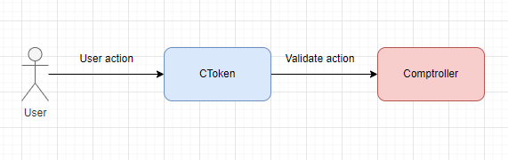

### Подробнее про cToken

В настоящее время существует два типа cToken:
1. **CErc20**. Является оберткой для базового актива ERC-20.
2. **CEther**. Является оберткой для нативной валюты ETH.

Контракты [CErc20](https://github.com/compound-finance/compound-protocol/blob/master/contracts/CErc20.sol) и [CEther](https://github.com/compound-finance/compound-protocol/blob/master/contracts/CEther.sol) расширяют функционал **CToken** для работы с ERC-20 стандартом и с нативной валютой блокчейна соответственно. Для нативной валюты CToken будет называться **сETH**, для USDT - **cUSDT** и так далее.

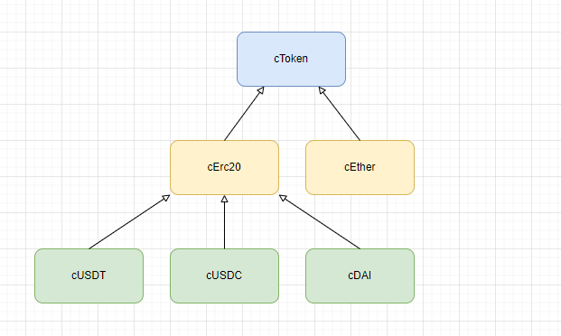

С точки зрения пользователя **cToken** — это основной путь взаимодействия с Compound протоколом. Для осуществления операций (предоставление ликвидности или займ актива) пользователю необходимо взаимодействовать с этим контрактом. В ответ пользователю выдается эквивалент самого **cToken** в качестве подтверждения операции. Каждый **cToken** можно передавать или продавать без ограничений. В любой момент времени **cToken** можно обменять только на базовый актив, который изначально заблокирован в протоколе.


Для учета количества активов, протокол вводит следующие переменные:
  - totalBorrows (общее количество средств в займе),
  - totalReserves (общее количество доступных средств для займа),
  - initialExchangeRate (первоначальный курс обмена cToken на базовый актив и обратно) и другие.

Подробнее ознакомиться с переменными, которые описывают Storage контракта cToken можно в официальном [репозитории](https://github.com/compound-finance/compound-protocol/blob/master/contracts/CTokenInterfaces.sol). Смотреть необходимо контракты: [CTokenStorage](https://github.com/compound-finance/compound-protocol/blob/master/contracts/CTokenInterfaces.sol#L9C10-L9C23), [CErc20Storage](https://github.com/compound-finance/compound-protocol/blob/master/contracts/CTokenInterfaces.sol#L233).

Детально разберем функции смарт-контракта [cToken](https://github.com/compound-finance/compound-protocol/blob/master/contracts/CToken.sol). Некоторые функции представлены в контрактах [CErc20](https://github.com/compound-finance/compound-protocol/blob/master/contracts/CErc20.sol) и [CEther](https://github.com/compound-finance/compound-protocol/blob/master/contracts/CEther.sol), которые расширяют функционал cToken или объявлены публичными переменными в интерфейсах [CTokenInterfaces](https://github.com/compound-finance/compound-protocol/blob/master/contracts/CTokenInterfaces.sol).

- `mint()` - позволяет передать актив в протокол. В обмен пользователь получит количество **cToken** равное базовому токену деленному на exchangeRate (текущий обменный курс). На вложенный актив может накапливаться процент.

- `redeem()` - функция погашения. Конвертирует указанное количество **cToken** в базовый актив и возвращает его пользователю.

- `redeemUnderlying()` - функция погашения. Конвертирует **cToken** в указанное количество базового актива и возвращает его пользователю.

- `borrow()` - функция займа актива. Передает актив из протокола пользователю и начинает накапливать проценты долга на основе процентной ставки актива. Требует предоставление залога, через вызов функции `mint()`.

- `repayBorrow()` - функция погашения займа. Передает актив в протокол, уменьшая долг пользователя.

- `repayBorrowBehalf()` - функция погашения займа. Передает актив в протокол, уменьшая долг указанного пользователя. Это функция позволяет погасить долг за место другого заемщика.

- `liquidateBorrow()` - функция ликвидации необеспеченного займа. Не может быть вызвана самим заемщикам, а только другими участниками (ликвидаторами) протокола.

- `getCashPrior()` - функция получения баланса базового актива **cToken**.

- `totalBorrows()` - функция получения суммы непогашенных базовых активов, предоставленных рынком в займы в настоящее время.

- `borrowBalanceCurrent()` - функция получения суммы непогашенных базовых активов для указанного пользователя.

- `balanceOf()` - функция получения баланса **cToken** пользователя, вложившего активы в протокол.

- `balanceOfUnderlying()` - функция получения баланса базового актива пользователя, который был вложен в протокол. Равен балансу **cToken** пользователя, умноженному на обменный курс.

- `supplyRatePerBlock()` - функция получения текущей процентной ставки для вложения базового актива в протокол за текущий блок.

- `borrowRatePerBlock()` - функция получения текущей процентной ставки для займа базового актива у протокола за текущий блок.

- `totalReserves()` - функция получения резервов базового актива. Небольшая часть процентов заемщика накапливается в протоколе, определяемом резервным коэффициентом (reserve factor).

- `reserveFactorMantissa()` - функция получения доли процентов, в настоящее время отложенных на резервы.

### Подробнее про comptroller

В Compound работает несколько **сToken**, которые представляют собой независимые друг от друга контракты. При этом Compound позволяет положить в залог один актив и взять в заем другой.

Это звучит логично, потому что залог и займ в одном и том же активе не имеет смысла. А значит над всеми контрактами **cToken** должно осуществляться управление.

**Comptroller** выступает в роли связующего звена для различных **cToken**. Он оперирует такими понятиями, как: "operation allowed", *collateral factor*, *close factor*, *liquidation incentive*.

Каждый раз, когда пользователь взаимодействует с **cToken**, под капотом **cToken** обращается к **comptroller** за валидацией транзакции. **Comptroller** имеет полное право отклонить транзакцию при невыполнение условий.

> Пример!
> * Когда пользователь хочет взять заем в Compound, сначала он обращается к соответствующему **cToken** контракту, чтобы предоставить залог. Например, для вложения ETH в качестве залога нужно обращаться на контракт cETH.
> * **cToken** контракт (в нашем случае cETH) взаимодействует с **comptroller** контрактом для проверки соответствия залога условиям. Например, достаточен ли размер залога.
> Если условия соблюдены, **comptroller** разрешает транзакцию, и пользователь может занять другие активы в соответствии с его залогом.
> * **Comptroller** также обновляет состояние аккаунта пользователя, отслеживая, сколько он занял и какой у него текущий залог.


> Эта схема является упрощенной и краткой. В процессе взаимодействия **comptroller** и **cToken** вызывается множество дополнительных функций. Например, **comptroller** может распределять **COMP** токены пользователям.

В своем смарт-контракте **comptroller** имеет параметры:
- [borrowCaps](https://github.com/compound-finance/compound-protocol/blob/master/contracts/ComptrollerStorage.sol#L135). Параметр отвечает за ограничение займа для каждого пользователя. По умолчанию он равен 0, что говорит об отсутствии ограничения.
- [collateralFactorMantissa](https://github.com/compound-finance/compound-protocol/blob/master/contracts/ComptrollerStorage.sol#L66). Показатель, который представляет максимальную сумму для займа относительно суммарного залога. Например, значение 0.9 говорит о том, что можно занимать 90% от залоговой стоимости. Залог равен 100 DAI. Заем может быть эквивалентным стоимости не больше 90 DAI.
- [liquidationIncentiveMantissa](https://github.com/compound-finance/compound-protocol/blob/master/contracts/ComptrollerStorage.sol#L66). Параметр, который обозначает бонус, который получит ликвидатор.

Эти параметры находятся в контракте [ComptrollerStorage.sol](https://github.com/compound-finance/compound-protocol/blob/master/contracts/ComptrollerStorage.sol) от которого наследуется контракт [Comptroller.sol](https://github.com/compound-finance/compound-protocol/blob/master/contracts/Comptroller.sol) и используются при займах и выплатах.

Рабочая связка **сToken** и **Comptroller** организует процесс кредитования и займа для пользователей в рамках протокола. Для взаимодействия пользователя с конкретным активом вводится понятие **market**.

## Market

_Опр!_ **Market** или рынок - это полноценная мини экосистема для отдельного актива протокола. Каждый такой **market** обслуживается через свой собственный контракт **cToken**, который представляет право пользователя на базовый актив. **Comptroller** выступает в качестве вспомогательного контракта для **cToken** и регулирует доступные типы активов, в которых можно предоставлять залог, а также занимается подсчетом всей залоговой суммы пользователя, которую он внес через другие контракты **cToken**.

Основные характеристики **market** в Compound:

1. **cToken**. Каждый рынок имеет свой собственный cToken (например, cDAI для DAI, cETH для ETH). Пользователи получают **cToken**, когда предоставляют ликвидность или залог на платформе.
2. **Процентные ставки**. Каждый рынок имеет свою ставку для займа и ставку для предоставления активов. Ставки динамически адаптируются в зависимости от спроса и предложения на этом рынке.
3. **Показатели**. Отображает количество актива, доступного для заимствования, общее количество заработка и другие данные.
4. **Уровень обеспеченности**. Определяет, какой процент от займа должен быть обеспечен залогом, чтобы участвовать в данном рынке.
5. **Ликвидация.** Регулирует процесс ликвидации и следит за процентом, который ликвидаторы могут получить в качестве вознаграждения.

Перенесемся ненадолго в приложение Compound и посмотрим, как выглядят различные [markets](https://app.compound.finance/markets).

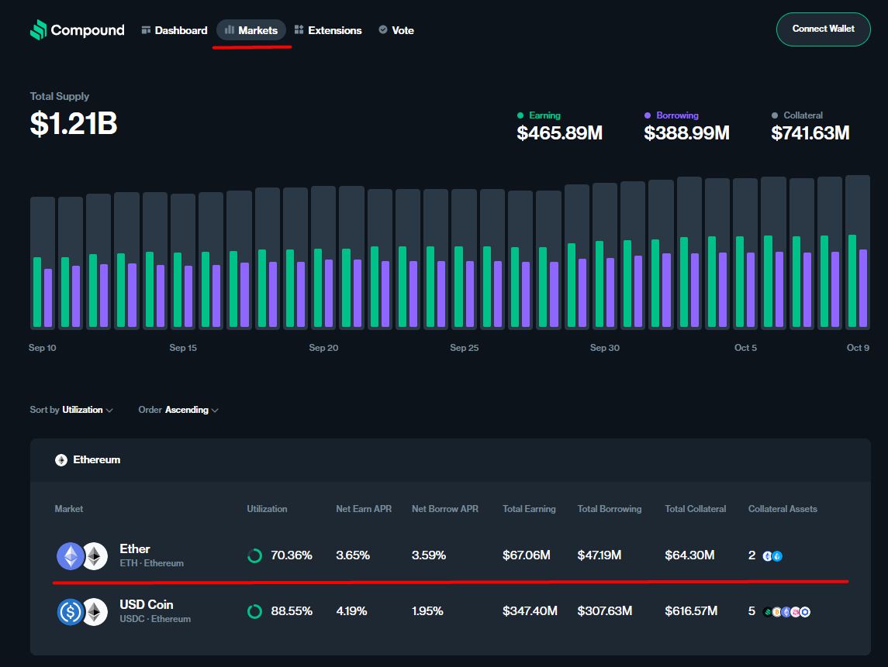

Внизу скриншота представлена таблица, где за первый столбец отвечает название **market**. Рынок для актива "Ether" в сети Ethereum выделен красной линией. Список остальных столбцов таблицы:
1. **Utilization**. Коэффициент использования или процент взятых в займ активов относительно общего количества актива доступного для займа. Про него мы поговорим подробнее позже.
2. **Earn APR**. Earn Annual Percentage Rate. Годовой процент заработка для кредиторов.
3. **Borrow APR**. Borrow Annual Percentage Rate. Годовой процент для заемщиков.
4. **Total Earning**. Общий доход этого market.
5. **Total Borrowing**. Общая сумма займа.
6. **Total Collateral**. Общая сумма внесенного в протокол залога в этом активе.
7. **Collateral assets**. Доступные типы актива для предоставления в качестве залога.

Если зайти внутрь [market](https://app.compound.finance/markets/weth-mainnet) предназначенного для актива Ether, то можно увидеть полную информацию. Смотри скриншот ниже.

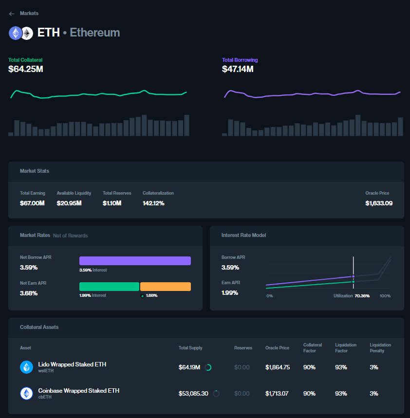

_Важно!_ Процентные ставки, доступные для залога, активы и другие важные параметры **market** настраиваются администратором протокола.

Получается, что множество **markets** - это список токенов которые доступных для кредитования или займа. Для того, чтобы **Comptroller** знал с какими **cToken** ассоциировать пользователя, необходимо ему об этом "сказать". Для этого, внутри контракта [Comptroller](https://github.com/compound-finance/compound-protocol/blob/master/contracts/Comptroller.sol#L121), реализована функция `enterMarkets()`, которая ассоциирует пользователя с несколькими **markets**. Вызвать функцию `enterMarkets()` или "выйти на рынок" необходимо в одном случае:
1. Для займа других активов. После "выхода на рынок" и предоставления залога можно занимать другие активы.

## Supplying

Поговорим о том, с чего начинается взаимодействие пользователя с протоколом. В первую очередь, пользователь должен передать собственный актив протоколу. Переданный актив будет выступать в качестве ликвидности или в качестве залога для займа. Взамен переданных активов, пользователь получает **cToken** соответствующего актива.

_Важно!_ Пользователи, не являющиеся техническими специалистами, могут взаимодействовать с протоколом при помощи [интерфейса](https://app.compound.finance/).

Предоставление ликвидности под капотом работает следующим образом:
1. Начинается предоставление ликвидности с вызова функции `mint()` на соответствующем контракте CToken. Вызов в нашем собственном контракте **Adapter** может выглядеть следующим образом:
    ```solidity
    contract CompoundAdapter {
        /// Добавление tokenA в качестве ликвидности в Compound
        function addCollateral(uint256 amount) external {
          /// Перевод средств с кошелька пользователя на контракт.
          /// Подразумеваем, что владелец кошелька заранее дал апрув на списание tokenA
          tokenA.transferFrom(msg.sender, address(this), amount);
          /// Старт взаимодействия с контрактом Compound
          cTokenA.mint(amount);
        }
    }
    ```
2. Под капотом функция mint() находится в [CErc20.sol](https://github.com/compound-finance/compound-protocol/blob/master/contracts/CErc20.sol#L49) или [CEther.sol](https://github.com/compound-finance/compound-protocol/blob/master/contracts/CEther.sol#L45). Дальше вызов уходит в контракт [СToken.sol](https://github.com/compound-finance/compound-protocol/blob/master/contracts/CToken.sol#L386C14-L386C26) через вызов `mintInternal()`.
    ```solidity
    function mint(uint mintAmount) override external returns (uint) {
        mintInternal(mintAmount);
        return NO_ERROR;
    }
    ```
3. В `mintInternal()` мы видим последовательный вызов двух функций `accrueInterest()` и `mintFresh()`. Первая производит начисление накопленных процентов за последний расчетный период, вторая производит непосредственный трансфер ликвидности внутрь протокола и выдачу CToken взамен.
    ```solidity
    function mintInternal(uint mintAmount) internal nonReentrant {
        accrueInterest();
        mintFresh(msg.sender, mintAmount);
    }
    ```
4. Разберем функцию `accrueInterest()`
    ```solidity
    function accrueInterest() virtual override public returns (uint) {
        /// Получаем текущий номер блока и последний номер блока в котором было начисление процентов
        uint currentBlockNumber = getBlockNumber();
        uint accrualBlockNumberPrior = accrualBlockNumber;

        /// Выходим из функции без ошибки, если в текущем блоке начисление процентов уже производилось
        if (accrualBlockNumberPrior == currentBlockNumber) {
            return NO_ERROR;
        }

        uint cashPrior = getCashPrior();
        uint borrowsPrior = totalBorrows;
        uint reservesPrior = totalReserves;
        uint borrowIndexPrior = borrowIndex;

        /// Расчет коэффициента текущего процента по займам
        uint borrowRateMantissa = interestRateModel.getBorrowRate(cashPrior, borrowsPrior, reservesPrior);
        require(borrowRateMantissa <= borrowRateMaxMantissa, "borrow rate is absurdly high");

        /// Высчитываем разницу между последним блоком, когда был произведен расчет и текущим
        uint blockDelta = currentBlockNumber - accrualBlockNumberPrior;

        /// Расчет процентов начисленных на займы, резервы
        Exp memory simpleInterestFactor = mul_(Exp({mantissa: borrowRateMantissa}), blockDelta);
        uint interestAccumulated = mul_ScalarTruncate(simpleInterestFactor, borrowsPrior);
        uint totalBorrowsNew = interestAccumulated + borrowsPrior;
        uint totalReservesNew = mul_ScalarTruncateAddUInt(Exp({mantissa: reserveFactorMantissa}), interestAccumulated, reservesPrior);
        uint borrowIndexNew = mul_ScalarTruncateAddUInt(simpleInterestFactor, borrowIndexPrior, borrowIndexPrior);

        /// Устанавливаем текущий блок, как блок в котором произведено начисление процентов
        accrualBlockNumber = currentBlockNumber;

        /// Обновляем коэффициент для займа
        borrowIndex = borrowIndexNew;
        /// Обновляем показатели общего количества займов и общего количества резервов
        totalBorrows = totalBorrowsNew;
        totalReserves = totalReservesNew;

        emit AccrueInterest(cashPrior, interestAccumulated, borrowIndexNew, totalBorrowsNew);

        return NO_ERROR;
    }
    ```
5. Разберем функцию `mintFresh()`.
    ```solidity
    function mintFresh(address minter, uint mintAmount) internal {
        /// Проверка в comptroller на возможность вызывать mint() функцию
        uint allowed = comptroller.mintAllowed(address(this), minter, mintAmount);
        if (allowed != 0) {
            revert MintComptrollerRejection(allowed);
        }

        /// Проверяем, что в этом блоке уже были начислены накопленные проценты
        if (accrualBlockNumber != getBlockNumber()) {
            revert MintFreshnessCheck();
        }

        /// Получаем текущую стоимость СToken относительно базового актива
        /// Внутри функции exchangeRateStoredInternal() происходит расчет стоимости на базе totalCash, totalBorrows, totalReserves, totalSupply
        Exp memory exchangeRate = Exp({mantissa: exchangeRateStoredInternal()});

        /// Трансфер ликвидности на контракт CToken.
        /// Функция отличается для CErc-20 и CEther, так как нативная валюта передается с вызовом функции mint()
        uint actualMintAmount = doTransferIn(minter, mintAmount);

        /// Расчет количества cToken на базе стоимости cToken
        uint mintTokens = div_(actualMintAmount, exchangeRate);

        totalSupply = totalSupply + mintTokens;
        /// Начисление сToken взамен предоставленной ликвидности
        accountTokens[minter] = accountTokens[minter] + mintTokens;

        emit Mint(minter, actualMintAmount, mintTokens);
        emit Transfer(address(this), minter, mintTokens);
    }
    ```
Схема ниже в помощь! 🧐
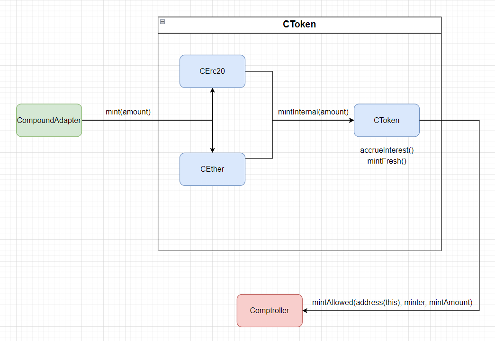

## Borrowing

Поговорим о том, что происходит внутри протокола Compound при займе. Предполагаем, что залог (ликвидность или обеспечение) в некотором активе уже внесен в протокол согласно описанному в разделе [supplying](#supplying).

_Важно!_ Здесь нужно отметить, что займ требует сверхобеспечения, поэтому заемщику необходимо первым делом оставить достаточно залога.

1. Начинается займ с "выхода на рынок". Для этого необходимо вызвать функцию `enterMarkets()` на контракте [comptroller](https://github.com/compound-finance/compound-protocol/blob/master/contracts/Comptroller.sol#L121) и передать в нее список адресов CToken, которые планируется использовать. Наш потенциальный контракт **Adapter** будет выглядеть следующим образом.
    ```solidity
    contract CompoundAdapter {
        constructor(Comptroller comptroller, address[] cTokens) {
            /// Совершаем "выход на рынок"
            uint256[] memory errors = comptroller.enterMarkets(cTokens);
            if (errors[0] != 0) {
                revert EnterMarketsFailed();
            }
        }

        function borrow(uint256 amount) {
            cTokenB.borrow(amount);
            tokenB.transfer(
                msg.sender,
                tokenB.balanceOf(address(this))
            );
        }
    }
    ```
    Вызов `enterMarkets()` обрабатывает список полученных cToken и вызывает функцию `addToMarketInternal()`
    ```solidity
    function addToMarketInternal(CToken cToken, address borrower) internal returns (Error) {
        Market storage marketToJoin = markets[address(cToken)];

        /// Возврат из функции, если токен не разрешен протоколом
        if (!marketToJoin.isListed) {
            return Error.MARKET_NOT_LISTED;
        }

        /// Преждевременный возврат, если пользователь уже присоединялся к рынку
        if (marketToJoin.accountMembership[borrower] == true) {
            return Error.NO_ERROR;
        }

        /// Записываем в state контракта, что пользователь присоединился к рынку
        marketToJoin.accountMembership[borrower] = true;
        accountAssets[borrower].push(cToken);

        emit MarketEntered(cToken, borrower);

        return Error.NO_ERROR;
    }
    ```
2. Дальше необходимо вызвать функцию `borrow()` на контракте cToken. После этого кредиторы получают процент за предоставленную ликвидность, а у заемщиков увеличивается количество средств. Под капотом borrow находится в контрактах CErc20 и CEther соответственно и вызывает функцию `borrowInternal()`.
    ```solidity
    function borrow(uint borrowAmount) override external returns (uint) {
        borrowInternal(borrowAmount);
        return NO_ERROR;
    }

    ```
3. В `borrowInternal()` на контракте [CToken](https://github.com/compound-finance/compound-protocol/blob/master/contracts/CToken.sol#L555C14-L555C28) по аналогии с `mintInternal()` вызывается две функции: `accrueInterest()` и `borrowFresh()`.
    ```solidity
    function borrowInternal(uint borrowAmount) internal nonReentrant {
        accrueInterest();
        borrowFresh(payable(msg.sender), borrowAmount);
    }
    ```
4. `accrueInterest()` мы уже частично рассмотрели в [supplying](#supplying). Посмотрим на `borrowFresh()`.
    ```solidity
    function borrowFresh(address payable borrower, uint borrowAmount) internal {
        /// Проверка возможности займа на контракте comptroller
        uint allowed = comptroller.borrowAllowed(address(this), borrower, borrowAmount);
        if (allowed != 0) {
            revert BorrowComptrollerRejection(allowed);
        }

        /// Отмена транзакции, если в текущем блоке не производилось начисление процентов
        if (accrualBlockNumber != getBlockNumber()) {
            revert BorrowFreshnessCheck();
        }

        /// Отмена транзакции, если в протоколе недостаточно свободных для займа средств
        if (getCashPrior() < borrowAmount) {
            revert BorrowCashNotAvailable();
        }

        /// Получаем уже существующую сумму долга заемщика
        uint accountBorrowsPrev = borrowBalanceStoredInternal(borrower);
        /// Получаем новую сумму с учетом нового займа
        uint accountBorrowsNew = accountBorrowsPrev + borrowAmount;
        /// Получаем общую сумму займа по протоколу
        uint totalBorrowsNew = totalBorrows + borrowAmount;

        /// Обновляем информацию по займам в state контракта
        accountBorrows[borrower].principal = accountBorrowsNew;
        accountBorrows[borrower].interestIndex = borrowIndex;
        totalBorrows = totalBorrowsNew;

        /// Трансфер занятых активов с протокола до заемщика.
        /// Функция отличается для CErc-20 и CEther контрактов
        doTransferOut(borrower, borrowAmount);

        emit Borrow(borrower, borrowAmount, accountBorrowsNew, totalBorrowsNew);
    }
    ```

## Interest rates

Процентные ставки обновляются в каждом блоке и зависят от изменения соотношение свободных активов к занятым активам. Есть три типа процентных ставок:
1. **Supply rate.** Это процентная ставка, которую зарабатывают поставщики ликвидности за предоставление своих активов протоколу.
2. **Exchange rate.** Это курс обмена внутри протокола cToken (cDAI, cETH и так далее) к базовому активу (DAI, ETH )
3. **Borrow rate.** Это процентная ставка, которую необходимо выплатить заемщику за использование заемных средств.

Значения ставок рассчитываются в отдельном смарт-контракте [InterestRateModel](https://github.com/compound-finance/compound-protocol/blob/master/contracts/InterestRateModel.sol).

_Важно!_ Для каждого контракта CToken можно установить собственную модель расчета процентных ставок. Для этого админам доступна для вызова функция `_setInterestRateModel()`. Она находится в контракте [cToken](https://github.com/compound-finance/compound-protocol/blob/master/contracts/CToken.sol#L1080).

Сам контракт `InterestRateModel.sol` является абстракцией, которая требует реализации двух функций `getBorrowRate()` и `getSupplyRate()`. Предназначение этих функций высчитывать процентные ставки на базе: общего количества свободных активов (cash), общего количества активов в займе (borrows), количества резервных средств.

Узнать, какая модель начисления процентов достаточно просто. Необходимо вызвать публичную функция чтения `interestRateModel()` на контракте cToken. Ниже на скриншоте я сделал это для [cDAI](https://etherscan.io/address/0x5d3a536E4D6DbD6114cc1Ead35777bAB948E3643) в сети Ethereum.

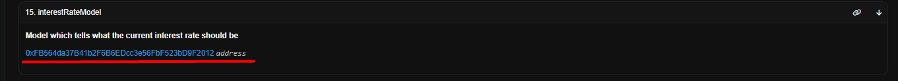

Результатом вызова функции стал адрес `0xFB564da37B41b2F6B6EDcc3e56FbF523bD9F2012`. Проверим его на etherscan.


Полный код контракта `JumpRateModelV2` можно посмотреть тут же в [etherscan](https://etherscan.io/address/0xFB564da37B41b2F6B6EDcc3e56FbF523bD9F2012#code) или найти в [репозитории](https://github.com/compound-finance/compound-protocol/blob/master/contracts/JumpRateModelV2.sol).

### Supply rate

В любой момент времени для каждого [cToken](https://github.com/compound-finance/compound-protocol/blob/master/contracts/CToken.sol#L215) можно запросить процентную ставку, начисляемую поставщикам ликвидности за блок, вызвав публичную функцию `supplyRatePerBlock()`.

```solidity
function supplyRatePerBlock() override external view returns (uint) {
    return interestRateModel.getSupplyRate(getCashPrior(), totalBorrows, totalReserves, reserveFactorMantissa);
}
```

Интересно, что вызов `interestRateModel.getSupplyRate()` используется только для получения информации снаружи контракта. Для расчетов в момент снятия ликвидности используется [exchangeRate](https://github.com/compound-finance/compound-protocol/blob/master/contracts/CToken.sol#L484).

В каждом блоке информация об процентная ставке может быть разной. При этом мы видели, что непосредственно начисление процентов происходит с вызовом функции `accrueInterest()`.

_Гениальное всегда работает просто!_ Поставщики ликвидности предоставляют активы, которые заемщики могут брать в займы. Заемщики выплачивают проценты (платятся в базовом активе) за использование активов. Таким образом количество базового актива постоянно растет. Все собранные проценты (выросшее количество базового актива) равномерно распределяются для всех поставщиков ликвидности в рамках market актива.

### Exchange rate

Эта процентная ставка служит для отображения курса обмена базового актива на cToken и обратно. Когда предоставляем ликвидность, получаем в обмен cToken согласно обменному курсу (exchange rate).

Обменный курс между cToken и базовым активом высчитывается следующи образом:

`exchangeRate = (getCash() + totalBorrows() - totalReserves()) / totalSupply()`

Получить значение текущего обменного курса можно вызвав функцию `exchangeRateCurrent()` на контракте [cToken](https://github.com/compound-finance/compound-protocol/blob/master/contracts/CToken.sol#L274).

### Borrow rate

В любой момент времени для каждого [cToken](https://github.com/compound-finance/compound-protocol/blob/master/contracts/CToken.sol#L207) можно запросить процентную ставку, начисляемую заемщикам за блок.

```solidity
function borrowRatePerBlock() override external view returns (uint) {
    return interestRateModel.getBorrowRate(getCashPrior(), totalBorrows, totalReserves);
}
```

Именно эту ставку заемщик должен заплатить за использование активов, взятых у протокола. В отличие от `supplyRatePerBlock()`, `borrowRatePerBlock()` реализует логику `interestRateModel.getBorrowRate()`, которая принимает участие в расчетах начисленных процентов в функции `accrueInterest()` контракта [cToken](https://github.com/compound-finance/compound-protocol/blob/master/contracts/CToken.sol#L344).

## Utilization rate

Теперь пора углубиться в контракт [InterestRateModel](https://github.com/compound-finance/compound-protocol/blob/master/contracts/InterestRateModel.sol). Он является абстракцией для реализации модели процентных ставок. Сама реализация находится в контракте [JumpRateModelV2](https://github.com/compound-finance/compound-protocol/blob/master/contracts/JumpRateModelV2.sol).

Если мы посмотрим на JumpRateModelV2, то увидим, что он еще в свою очередь наследуется не только от InterestRateModel, но и от [BaseJumpRateModelV2](https://github.com/compound-finance/compound-protocol/blob/master/contracts/BaseJumpRateModelV2.sol).

Здесь нужно остановится, так как для `getSupplyRate()` используется [вызов функции `utilizationRate()`](https://github.com/compound-finance/compound-protocol/blob/master/contracts/BaseJumpRateModelV2.sol#L116C1-L121C6).

```solidity
function getSupplyRate(uint cash, uint borrows, uint reserves, uint reserveFactorMantissa) virtual override public view returns (uint) {
    uint oneMinusReserveFactor = BASE - reserveFactorMantissa;
    uint borrowRate = getBorrowRateInternal(cash, borrows, reserves);
    uint rateToPool = borrowRate * oneMinusReserveFactor / BASE;
    return utilizationRate(cash, borrows, reserves) * rateToPool / BASE;
}
```

_Опр!_ **Utilization rate** - коэффициент использования или процент взятых в займ активов относительно общего количества актива доступного для займа.

Количество актива в протоколе ограничено, так как любой актив предоставляется кредиторами в качестве ликвидности. Поэтому, жизненно необходимо соблюдать баланс между количеством доступного актива для займа и уже выданными активами в качестве займа.

Если свободных активов будет много, то их может быть недостаточно для генерации прибыли кредиторам. И наоборот, если свободных активов мало, то заемщикам придется искать другие lending протоколы.

Представить вычисление коэффициента использования можно в следующем виде:

> **utilizationRate** = **totalBorrows** / **totalSupply**, где
>
> **totalBorrows** - Общее количество активов в займе
>
> **totalSupply** - Общее количество актива

Однако `totalSupply` состоит из следующих компонентов

> **totalSupply** = **cash** + **borrows** - **reserves**, где
>
> **cash** - количество актива доступное для займа. Сумма актива, предоставленная кредиторами.
>
> **borrow** - количество актива в займе.
>
> **reserves** - количество актива, удерживаемого протоколом в качестве прибыли

> Пример!
>
> Alice выступает кредитором и предоставляет для займа 750\$
>
> Bob выступает кредитором и предоставляет для займа 300\$
>
> Charlie взял в займ 150$
>
> Резерв протокола составляет 10\$
>
> Тогда **utilizationRate** будет вычисляться следующим образом:
>
> **cash** = 750 + 300 - 150 = 900 (отнимаем 150, так так Charlie уже занял эти средства и они больше недоступны для займа)
>
> **borrows** = 150
>
> **reserves** = 10
>
> Получаем **utilizationRate** = **totalBorrows** / **cash** + **borrows** - **reserves** = 150 / (900 + 150 - 10) ≈ 0.144 ≈ 14.4%

_Важно!_ UtilizationRate равный 14.4% означает, что только 14.4% активов протокола использовано в качестве займов. Это означает, что большая часть активов свободна, то есть протокол имеет свободную ликвидность. Заемщики могут использовать эти активы.

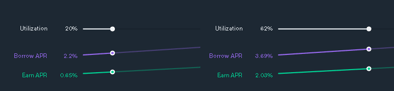

_Закономерность!_ При повышении коэффициента использования - ставки на предоставление ликвидности будут расти для мотивации поставщиков, чтобы увеличить количество свободных для займа активов. При понижении коэффициента использования - ставки на займ будут снижаться, чтобы займ был более привлекателен для заемщиков.

Язык Solidity, который используется для написания смарт-контрактов для Ethereum совместимых сетей не умеет работать с дробными числами. Поэтому на смарт-контрактах это решается путем добавления в формулу точности BASE.

> utilizationRate = borrows * BASE / (cash + borrows - reserves)

Для получения **utilizationRate** off-chain необходимо поделить utilizationRate на точность.

## Kink

**Что произойдет, если коэффициент использования станет слишком большим и будет приближаться к 100%?** Это означает, что соотношение баланса свободных активов для займа и заимствованных активов нарушено. То есть количество используемых активов в займах будет приближаться к общему количеству активов. Если коэффициент использования будет равен 100%, то это по сути остановит работу протокола. При таком состоянии, протокол не имеет свободной ликвидности для новых займов, а так как все активы уже находятся в займе, кредиторы не смогут вернуть ее обратно. В таком состоянии протокол будет пока не появятся новые поставщики ликвидности или не будет возвращена часть займов. И это ненормально. 🤢

Для предотвращения подобной ситуации используется специальный показатель **kink**. Он описывает значение **utilizationRate** после пересечения которого процентные ставки увеличиваются для кредиторов и заемщиков.

При `utilizationRate < kink` процентные ставки изменяются линейно.
При `utilizationRate > kink` процентные ставки изменяются экспоненциально. Кредиторы начинают получать значительно больший процент за предоставление активов. Заемщикам становится дороже брать кредиты.


Перегиб кривой процентных ставок регулирует ликвидность протокола, благодаря нему событие безостановочного роста коэффициента использования становится маловероятным, так как высокие процентные ставки для кредиторов быстро привлекают большое количество ликвидности, что понижает коэффициент использования.

_Важно!_ Уровень kink установленный в протоколе Compound равен 80%. Таким образом, после того, как utilizationRate > 80%, процентные ставки для поставщиков и заемщиков будут резко возрастать. Можно самостоятельно проверить вызвав функцию `kink()` в etherscan контракта [JumpRateModelV2](https://etherscan.io/address/0xFB564da37B41b2F6B6EDcc3e56FbF523bD9F2012#readContract)

### Borrow rate в InterestRateModelV2

Теперь можно посмотреть вычисление interest borrow rate. Я рассказал про kink и utilizationRate. Отсюда делаем вывод, что есть два варианта расчета:

> 1. При utilizationRate <= kink.
> Формула: **interest borrow rate** = (utilization rate * multiplierPerBlock / BASE) + baseRatePerBlock, где:
>    * **baseRatePerBlock** - Базовая процентная ставка, определяет ставку при utilizationRate = 0%.
>    * **multiplierPerBlock** - Коэффициент процентной ставки, который моделирует ее увеличение при увеличении utilizationRate. То есть определяет наклон графика роста процентных ставок пропорционально utilizationRate.
>     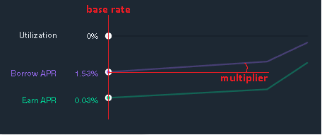
>    * **BASE** - точность вычисления, так как в Solidity не поддерживается работа с дробными числами.
>
>    Таким образом, мы получаем линейный рост процентной ставки вплоть до преодоления уровня kink.
> 2. При utilizationRate > kink.
> Формула: **interest borrow rate** = (excessUtil * jumpMultiplierPerBlock / BASE) + normalRate, где:
>    * **normalRate** = (kink * multiplierPerBlock / BASE) + baseRatePerBlock. Как при utilizationRate <= kink
>    * **excessUtil** = utilization rate - kink. Разница превышение utilizationRate уровня kink.
>    * **jumpMultiplierPerBlock**. Для вычисления процентных ставок после преодоления уровня kink

В коде [BaseJumpRateModelV2](https://github.com/compound-finance/compound-protocol/blob/master/contracts/BaseJumpRateModelV2.sol#L96) это выглядит гораздо лаконичнее:
```solidity
function getBorrowRateInternal(uint cash, uint borrows, uint reserves) internal view returns (uint) {
    uint util = utilizationRate(cash, borrows, reserves);

    if (util <= kink) {
        return ((util * multiplierPerBlock) / BASE) + baseRatePerBlock;
    } else {
        uint normalRate = ((kink * multiplierPerBlock) / BASE) + baseRatePerBlock;
        uint excessUtil = util - kink;
        return ((excessUtil * jumpMultiplierPerBlock) / BASE) + normalRate;
    }
}
```

## Redemption

Ты, как мой читатель должен был уже смекнуть, что для операций `supply()` - предоставление ликвидности и `borrow()` - займ активов, должны быть обратные операции. На примерах и описаниях выше ты можешь самостоятельно поковыряться в коде протокола Compound.

Я помогу тебе в этом и укажу точки входа:
1. Вывод ликвидности. Контракт [cToken](https://github.com/compound-finance/compound-protocol/blob/master/contracts/CToken.sol#L456C14-L456C28), функция `redeemInternal()`.
2. Погашение займа. Контракт [cToken](https://github.com/compound-finance/compound-protocol/blob/master/contracts/CToken.sol#L619C14-L619C33), функция `repayBorrowInternal()`.

## Liquidation

Со временем обеспечения займа может перестать хватать в силу волатильности криптовалют. Тогда займ пользователя попадает под механизм ликвидации.

### Возможность ликвидации займа

Для того, чтобы понять, выполняются ли условия неприкосновенности залога и позиции займа в Compound сравнивается общая стоимость залога и общая стоимость заемных активов. За это отвечает отдельная функция `getAccountLiquidity(address user)` в контракте [Comptroller](https://github.com/compound-finance/compound-protocol/blob/master/contracts/Comptroller.sol#L676).

В этот раз я предлагаю пропустить цепочку внутренних вызовов и сразу переместиться в функцию `getHypotheticalAccountLiquidityInternal()`, где заложена основная логика. Это все еще контракт [Comptroller](https://github.com/compound-finance/compound-protocol/blob/master/contracts/Comptroller.sol#L723).

```solidity
function getHypotheticalAccountLiquidityInternal(
    address account,
    CToken cTokenModify,
    uint redeemTokens,
    uint borrowAmount
) internal view returns (Error, uint, uint) {
    /// Сюда записываются промежуточные результаты и вычисления
    AccountLiquidityLocalVars memory vars;

    CToken[] memory assets = accountAssets[account];
    /// Организуем цикл для перебора всех вложенных активов пользователя с адресом account
    for (uint i = 0; i < assets.length; i++) {
        CToken asset = assets[i];

        /// Подгружаем информацию по каждому активу
        (oErr, vars.cTokenBalance, vars.borrowBalance, vars.exchangeRateMantissa) = asset.getAccountSnapshot(account);
        if (oErr != 0) {
            return (Error.SNAPSHOT_ERROR, 0, 0);
        }

        /// Добавляем точность согласно контракту "./ExponentialNoError.sol"
        vars.collateralFactor = Exp({mantissa: markets[address(asset)].collateralFactorMantissa});
        vars.exchangeRate = Exp({mantissa: vars.exchangeRateMantissa});

        /// Получаем прайс из оракула для базового актива
        vars.oraclePriceMantissa = oracle.getUnderlyingPrice(asset);
        if (vars.oraclePriceMantissa == 0) {
            return (Error.PRICE_ERROR, 0, 0);
        }
        vars.oraclePrice = Exp({mantissa: vars.oraclePriceMantissa});

        /// Рассчитываем стоимость одного cToken
        vars.tokensToDenom = mul_(mul_(vars.collateralFactor, vars.exchangeRate), vars.oraclePrice);

        /// sumCollateral += tokensToDenom(стоимость одно cToken) * cTokenBalance(количество cToken у аккаунта)
        vars.sumCollateral = mul_ScalarTruncateAddUInt(vars.tokensToDenom, vars.cTokenBalance, vars.sumCollateral);

        /// sumBorrowPlusEffects += oraclePrice(стоимость актива согласно оракулу) * borrowBalance(баланс заемных средств)
        vars.sumBorrowPlusEffects = mul_ScalarTruncateAddUInt(vars.oraclePrice, vars.borrowBalance, vars.sumBorrowPlusEffects);

        /// Для актива который пользователь брал в займ и позиция которого будет меняться
        if (asset == cTokenModify) {
            // sumBorrowPlusEffects += tokensToDenom(прайс одного cToken) * redeemTokens(количество cToken для закрытия позиции)
            vars.sumBorrowPlusEffects = mul_ScalarTruncateAddUInt(vars.tokensToDenom, redeemTokens, vars.sumBorrowPlusEffects);

            // sumBorrowPlusEffects += oraclePrice(стоимость актива) * borrowAmount (сумма средств в займе)
            vars.sumBorrowPlusEffects = mul_ScalarTruncateAddUInt(vars.oraclePrice, borrowAmount, vars.sumBorrowPlusEffects);
        }
    }

    /// Защита от переполнения
    if (vars.sumCollateral > vars.sumBorrowPlusEffects) {
        return (Error.NO_ERROR, vars.sumCollateral - vars.sumBorrowPlusEffects, 0);
    } else {
        return (Error.NO_ERROR, 0, vars.sumBorrowPlusEffects - vars.sumCollateral);
    }
}
```

На верхнем уровне это можно представить, как на схеме.


Внутри функции `getHypotheticalAccountLiquidityInternal()` протокол рассчитает в цикле залоговую стоимость каждого **market** в котором участвует пользователь. Для этого необходимо рассчитать сумму и получить данные пользователя: **cTokenBalance**, **borrowBalance**, **exchangeRate**. Это основная информация о borrow позиции пользователя. Для **collateralFactor** и стоимости collateral актива будет использован оракул.

На основании стоимости актива, курса обмена сTokens на актив и collateralFactor будет вычислена залоговая стоимость одного сToken:

> tokensToDenom = collateralFactor * exchangeRate * oraclePrice

Затем запишем полученное значение в переменную, которая будет хранить суммарную стоимость по всем market.

> sumCollateral += tokensToDenom * cTokenBalance

Так же вычисляется стоимость заемных средств в market с сохранением в переменную суммарного займа для всех market:

> sumBorrowPlusEffects += oraclePrice * borrowBalance

Схематично проверку каждого market можно изобразить следующим образом.

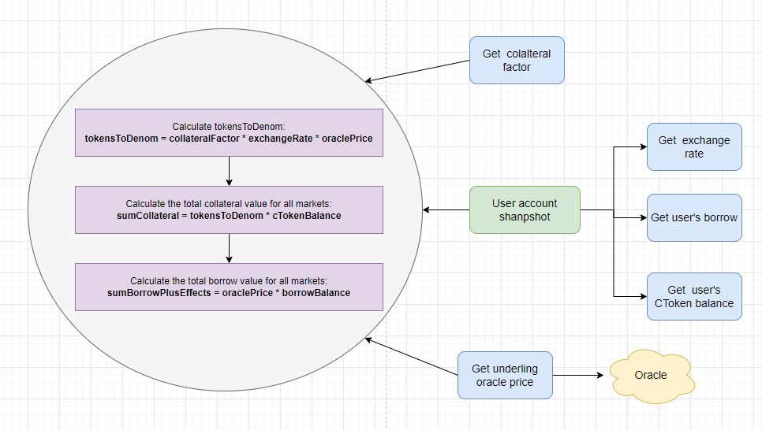

Отлично, на этом цикл вычислений для каждого отдельного маркета завершается. После циклического использования данного алгоритма для каждого маркета, в котором участвует пользователь мы получаем финальные значения суммирующих переменных sumCollateral и sumBorrowPlusEffects.

> В конце проверяется!
> Если `sumCollateral > sumBorrowPlusEffects`, то залога достаточно для дальнейшего обеспечения займа.
> Если `sumCollateral < sumBorrowPlusEffects`, то залога недостаточно для дальнейшего обеспечения займа. Это значит, что займ пользователя может подлежать ликвидации.

> Когда залога недостаточно, пользователи подлежат ликвидации другими участниками протокола (ликвидаторами). При этом они не могут снимать или брать активы, пока залога не хватает. Получается, пользователю нужно исправить нехватку обеспечения (т.е. чтобы somCollateral > sumBorrowPlusEffects).

**Почему может произойти ситуация с нехваткой обеспечения?**

- Проценты по заемным средствам накапливаются со временем, что приводит к понижению ликвидности пользователя.
- Стоимость залога резко падает вниз (залог дешевеет).
- Стоимость заемного актива резко взлетает вверх (займ дорожает и залога больше не хватает).

### Процесс ликвидации

Когда ликвидация становится возможна, ликвидатор может погасить часть или весь заем пользователя. Взамен он получает вознаграждение в виде части залоговых средств пользователя.

Возможный процент погашения ликвидатором определяется процентом в диапазоне от 0% до 100% займа, который может быть погашен за одну транзакцию. Однако в протоколе есть возможность установить минимально и максимально допустимую сумму погашения. За это отвечает переменная `closeFactorMinMantissa`, `closeFactorMaxMantissa` в контракте [Comptroller](https://github.com/compound-finance/compound-protocol/blob/master/contracts/Comptroller.sol#L81C28-L81C51).

1. Начинается процесс ликвидации с вызова функции `liquidateBorrow()` на контрактах [CErc20.sol](https://github.com/compound-finance/compound-protocol/blob/master/contracts/CErc20.sol#L115C14-L115C29) или [CEther.sol](https://github.com/compound-finance/compound-protocol/blob/master/contracts/CErc20.sol#L115C14-L115C29)

    ```solidity
        function liquidateBorrow(address borrower, CToken cTokenCollateral) external payable {
            liquidateBorrowInternal(borrower, msg.value, cTokenCollateral);
        }
    ```
2. Дальше вызов уходит внутрь функции `liquidateBorrowInternal()` контракта [CToken](https://github.com/compound-finance/compound-protocol/blob/master/contracts/CToken.sol#L700C5-L711C6).
    ``` solidity
    function liquidateBorrowInternal(address borrower, uint repayAmount, CTokenInterface cTokenCollateral) internal nonReentrant {
        /// Начисление накопленных процентов за последний расчетный период
        accrueInterest();

        /// Вызов ликвидации
        liquidateBorrowFresh(msg.sender, borrower, repayAmount, cTokenCollateral);
    }
    ```
    По сути уже знакомая нам схема и по процессу supplying и borrowing.
3. Дальше вызов уходит в функцию `liquidateBorrowFresh()` контракта [CToken](https://github.com/compound-finance/compound-protocol/blob/master/contracts/CToken.sol#L721).
    ```solidity
    function liquidateBorrowFresh(address liquidator, address borrower, uint repayAmount, CTokenInterface cTokenCollateral) internal {
        /// Проверяется разрешение на ликвидацию у контракта Comptroller
        uint allowed = comptroller.liquidateBorrowAllowed(address(this), address(cTokenCollateral), liquidator, borrower, repayAmount);
        if (allowed != 0) {
            revert LiquidateComptrollerRejection(allowed);
        }

        /// Проверяется, что начисление процентов было именно в текущем блоке
        if (accrualBlockNumber != getBlockNumber()) {
            revert LiquidateFreshnessCheck();
        }

        /// Дополнительно проверяется, что для нужного CToken начисление процентов было в текущем блоке
        if (cTokenCollateral.accrualBlockNumber() != getBlockNumber()) {
            revert LiquidateCollateralFreshnessCheck();
        }

        /// Запрещается заемщику ликвидировать собственный заем
        if (borrower == liquidator) {
            revert LiquidateLiquidatorIsBorrower();
        }

        /// Сумма погашения не должна быть нулевой
        if (repayAmount == 0) {
            revert LiquidateCloseAmountIsZero();
        }

        /// Сумма погашения не должна быть отрицательной, за пределами uint
        if (repayAmount == type(uint).max) {
            revert LiquidateCloseAmountIsUintMax();
        }

        /// Вызов функции погашения займа
        uint actualRepayAmount = repayBorrowFresh(liquidator, borrower, repayAmount);

        /// Рассчитывается количество cToken, которое должно списаться с ликвидатора для погашения займа
        (uint amountSeizeError, uint seizeTokens) = comptroller.liquidateCalculateSeizeTokens(address(this), address(cTokenCollateral), actualRepayAmount);
        require(amountSeizeError == NO_ERROR, "LIQUIDATE_COMPTROLLER_CALCULATE_AMOUNT_SEIZE_FAILED");

        /// Проверяется, что у ликвидатора достаточно cToken для списания в счет ликвидации займа пользователя
        require(cTokenCollateral.balanceOf(borrower) >= seizeTokens, "LIQUIDATE_SEIZE_TOO_MUCH");

        /// Если адрес контракта вызова и адрес указанного cToken совпадает, то
        /// уменьшить позицию заемщика и начислить вознаграждение ликвидатору
        if (address(cTokenCollateral) == address(this)) {
            seizeInternal(address(this), liquidator, borrower, seizeTokens);
        } else {
            require(cTokenCollateral.seize(liquidator, borrower, seizeTokens) == NO_ERROR, "token seizure failed");
        }

        emit LiquidateBorrow(liquidator, borrower, actualRepayAmount, address(cTokenCollateral), seizeTokens);
    }
    ```

Остается посмотреть 4 функции, которые вызываются по ходу исполнения:
1. Что происходит в функции проверки возможности ликвидации займа `liquidateBorrowAllowed()` на контракте [Comptroller](https://github.com/compound-finance/compound-protocol/blob/master/contracts/Comptroller.sol#L473).
    ```solidity
    function liquidateBorrowAllowed(
        address cTokenBorrowed,
        address cTokenCollateral,
        address liquidator,
        address borrower,
        uint repayAmount
    ) override external returns (uint) {
        liquidator;

        /// Проверка, что токены доступны в протоколе compound
        if (!markets[cTokenBorrowed].isListed || !markets[cTokenCollateral].isListed) {
            return uint(Error.MARKET_NOT_LISTED);
        }

        /// Получаем сумму займа для заемщика
        uint borrowBalance = CToken(cTokenBorrowed).borrowBalanceStored(borrower);

        /// Проверка, что market для cToken не был запрещен
        if (isDeprecated(CToken(cTokenBorrowed))) {
            require(borrowBalance >= repayAmount, "Can not repay more than the total borrow");
        } else {
            /// Проверяем, что позиция пользователя доступна для ликвидации
            (Error err, , uint shortfall) = getAccountLiquidityInternal(borrower);
            if (err != Error.NO_ERROR) {
                return uint(err);
            }

            if (shortfall == 0) {
                return uint(Error.INSUFFICIENT_SHORTFALL);
            }

            /// Проверка, что будет закрыта позиция на сумму не больше максимально разрешенной протоколом
            uint maxClose = mul_ScalarTruncate(Exp({mantissa: closeFactorMantissa}), borrowBalance);
            if (repayAmount > maxClose) {
                return uint(Error.TOO_MUCH_REPAY);
            }
        }
        return uint(Error.NO_ERROR);
    }
    ```
2. Что происходит при вызове функции `repayBorrowFresh()`. По сути отрабатывает погашение займа, только от имени ликвидатора. Ты уже должен был самостоятельно пройти процесс погашения займа, поэтому не буду приводить функцию целиком. Если ты этого еще не сделал или подзабыл, то можно посмотреть в контракт [cToken](https://github.com/compound-finance/compound-protocol/blob/master/contracts/CToken.sol#L643C14-L643C30).
3. Что происходит при вызове функции `liquidateCalculateSeizeTokens()` непосредственно для расчета количества залогового токена в контракте [cToken](https://github.com/compound-finance/compound-protocol/blob/master/contracts/Comptroller.sol#L789).
    ```solidity
    function liquidateCalculateSeizeTokens(address cTokenBorrowed, address cTokenCollateral, uint actualRepayAmount) override external view returns (uint, uint) {
        /// Получение стоимости залоговых и заемных средств из оракула
        uint priceBorrowedMantissa = oracle.getUnderlyingPrice(CToken(cTokenBorrowed));
        uint priceCollateralMantissa = oracle.getUnderlyingPrice(CToken(cTokenCollateral));
        if (priceBorrowedMantissa == 0 || priceCollateralMantissa == 0) {
            return (uint(Error.PRICE_ERROR), 0);
        }

        /// Получение exchangeRate для обмена CToken
        uint exchangeRateMantissa = CToken(cTokenCollateral).exchangeRateStored(); // Note: reverts on error
        uint seizeTokens;
        Exp memory numerator;
        Exp memory denominator;
        Exp memory ratio;

        /// Расчет количества залогового токена, которое будет ликвидировано
        numerator = mul_(Exp({mantissa: liquidationIncentiveMantissa}), Exp({mantissa: priceBorrowedMantissa}));
        denominator = mul_(Exp({mantissa: priceCollateralMantissa}), Exp({mantissa: exchangeRateMantissa}));
        ratio = div_(numerator, denominator);

        seizeTokens = mul_ScalarTruncate(ratio, actualRepayAmount);

        return (uint(Error.NO_ERROR), seizeTokens);
    }
    ```
4. Что происходит при вызове функции `seizeInternal()` для непосредственной ликвидации cToken пользователя и начисления вознаграждения для ликвидатора.
    ```solidity
    function seizeInternal(address seizerToken, address liquidator, address borrower, uint seizeTokens) internal {
        /// Проверяется возможность вызова функции на контракте Comptroller
        uint allowed = comptroller.seizeAllowed(address(this), seizerToken, liquidator, borrower, seizeTokens);
        if (allowed != 0) {
            revert LiquidateSeizeComptrollerRejection(allowed);
        }

        /// Запрещается заемщику ликвидировать собственный заем
        if (borrower == liquidator) {
            revert LiquidateSeizeLiquidatorIsBorrower();
        }

        /*
         * Рассчитываем новые балансы для заемщика и ликвидатора
         *  borrowerTokensNew = accountTokens[borrower] - seizeTokens
         *  liquidatorTokensNew = accountTokens[liquidator] + seizeTokens
         */
        uint protocolSeizeTokens = mul_(seizeTokens, Exp({mantissa: protocolSeizeShareMantissa}));
        uint liquidatorSeizeTokens = seizeTokens - protocolSeizeTokens;
        Exp memory exchangeRate = Exp({mantissa: exchangeRateStoredInternal()});
        uint protocolSeizeAmount = mul_ScalarTruncate(exchangeRate, protocolSeizeTokens);
        uint totalReservesNew = totalReserves + protocolSeizeAmount;

        /// Непосредственно обновляем значения балансов cToken для заемщика и ликвидатора
        totalReserves = totalReservesNew;
        totalSupply = totalSupply - protocolSeizeTokens;
        accountTokens[borrower] = accountTokens[borrower] - seizeTokens;
        accountTokens[liquidator] = accountTokens[liquidator] + liquidatorSeizeTokens;

        emit Transfer(borrower, liquidator, liquidatorSeizeTokens);
        emit Transfer(borrower, address(this), protocolSeizeTokens);
        emit ReservesAdded(address(this), protocolSeizeAmount, totalReservesNew);
    }
    ```

Схематично порядок вызова ликвидации, который я описал выше, можно представить следующим образом.

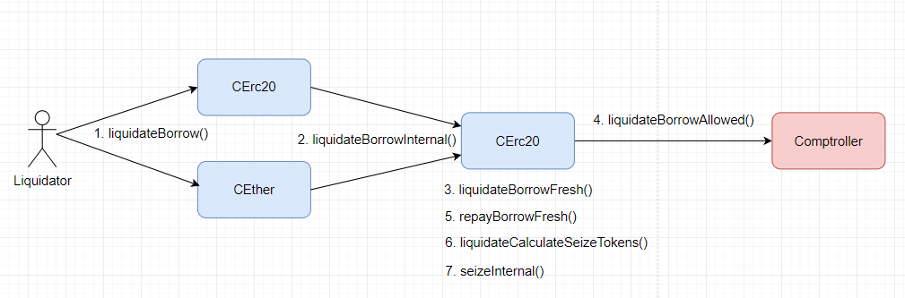

### Cascading liquidations

_Опр!_ Каскадные ликвидации - это последовательность ликвидаций, которые вызывают друг друга. Например, когда значение залога резко и системно падает, открывается возможность ликвидации по нескольким позициям. Ликвидаторы честно выполняют свою обязанность, но получая залоговый актив в качестве обеспечения стараются поскорее от него "избавиться" (например,продать, пока еще выгодно), что еще больше роняет стоимость актива и открывает возможность для новых ликвидаций вызывая цепную реакцию. Это происходит потому что для расчета стоимости залога используется оракул, который ориентируется на рыночную стоимость актива.

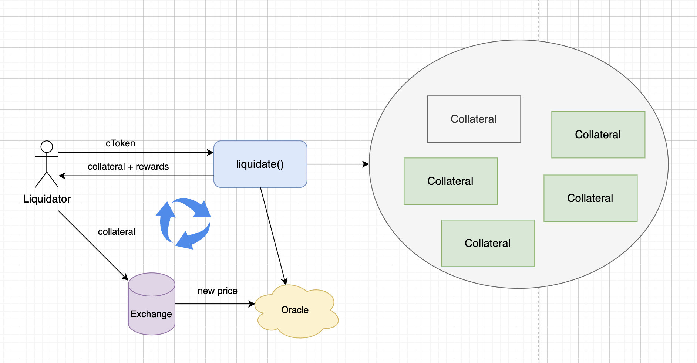

В протоколе Compound предусмотрены некоторые меры для снижения риска каскадных ликвидаций:

1. **Оценка обеспечения**. Compound использует надежные ценовые оракулы и проводит частые переоценки стоимости активов на рынке. Это помогает правильно оценить стоимость залога и предотвратить ненужные или преждевременные ликвидации.

2. **Требования к обеспечению**. Требуется сверх обеспечение займа. Это создает "буфер" для колебаний стоимости активов.

3. **Ограничения на максимальную сумму заимствования**. Протокол устанавливает лимиты для различных активов. Это помогает предотвратить чрезмерное заимствование и снижает вероятность массовых ликвидаций.

4. **Сглаживание цен**. Вместо того чтобы реагировать на краткосрочные колебания рыночных цен, Compound может использовать усредненные или сглаженные цены на протяжении определенного времени для определения стоимости залога.

5. **Администрирование**. В случае экстремальной ситуации на рынке у администраторов протокола есть возможность вмешаться в систему, чтобы предотвратить каскадные ликвидации или другие проблемы. Это может включать в себя изменение параметров системы или даже временную приостановку работы протокола.

6. **Коммуникация с сообществом**. Compound активно взаимодействует со своим сообществом через различные каналы, включая форумы и социальные сети. Это позволяет оперативно информировать пользователей о рыночных рисках, предоставляя рекомендации по управлению своими позициями.

Эти меры, в совокупности, помогают уменьшить риски каскадных ликвидаций, но не могут полностью исключать подобный исход. Поэтому в заемщикам все-таки необходимо быть осведомленными о рисках и управлять своими позициями в займах соответствующим образом.

## Вывод

На этой хорошей ноте стоит остановится. Я рассказал все самые основные моменты работы протокола. От предоставления ликвидности до займа и от расчетов начисления процентов до ликвидаций. На сегодняшний день протокол Compound выпустил третью версию. В этой версии вводится новое понятие "**Comet**" и обновленная архитектура, но это уже совсем другая история!
