# The Compound DeFi Protocol v3

**Автор:** [Павел Найданов](https://github.com/PavelNaydanov) 🕵️‍♂️

_Опр!_ **Compound v3** — это все еще ethereum протокол для займа активов под проценты. Активы предоставляются поставщиками ликвидности, которые получают часть процентов от заемщиков.

Протокол вдохновлен опытом [sushiSwap](https://www.rareskills.io/post/staking-algorithm) и их стейкинг алгоритмом. В этом алгоритме накопленные вознаграждения рассчитываются только в момент, когда пользователь взаимодействует с протоколом. Более того, вместо того, чтобы рассчитывать вознаграждение для каждого пользователя, запоминается сумма всех накопленных вознаграждений, в которой у каждого пользователя есть собственная доля. Долю пользователя в общем вознаграждении показывает баланс привязанного к вознаграждению токена. В compound используется подобный подход для расчета накопленных процентов по займу и для накопленного заработка у поставщиков ликвидности.

Там где необходимо знать стоимость активов для расчетов, реализован механизм на базе оракула от chainlink.

Первоначально третья версия была развернута только в сети Ethereum и для займа был доступен только один актив - USDC. В настоящий момент compound поддерживает несколько блокчейнов и три актива в сети Ethereum.

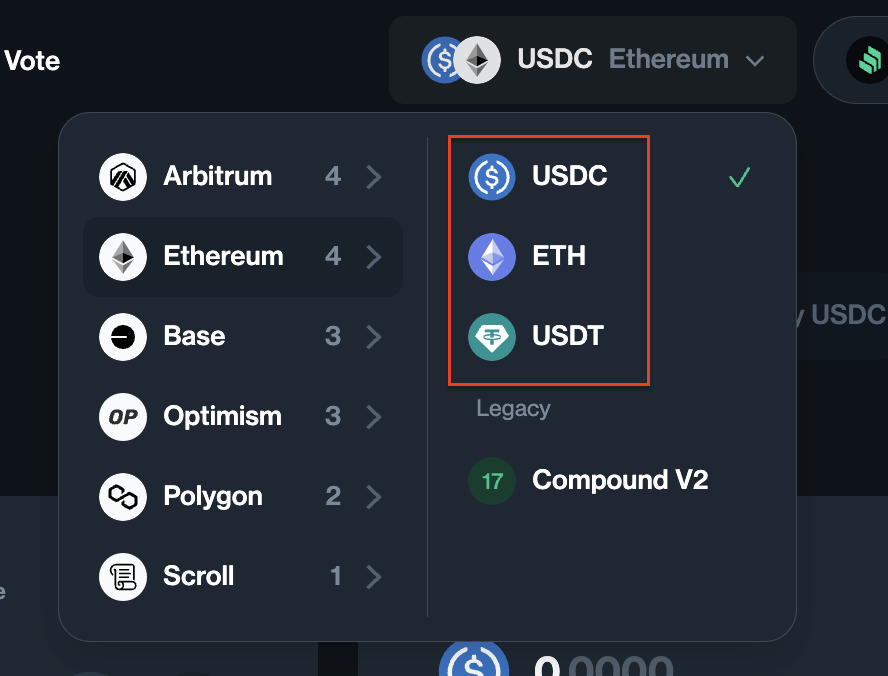

Проверить это можно прямо в [приложении](https://app.compound.finance/markets). Актив, который можно занимать называется **базовым**. А инфраструктура вокруг него все также **market** (рынок или маркет).

_Важно!_ Compound придумал кодовое название "**Comet**" для смарт-контрактов своей третьей версии.

## Отличия от compound-v2

Ниже разберем основные концептуальные отличия между третьей и второй версией.

**Изолированный рынок.** В рамках одного рынка можно занимать только один актив и этот заем будет изолированным.

Это пожалуй одно из самых главных отличий. Это означает, что вложенный залог для займа USDC согласно правилам маркета не будет обеспечением для займа другого актива, например для рынка ETH.

**Залог отделен от ликвидности**. Актив, предоставляемый в качестве залога для займа, не может быть занят другим пользователем. То есть "мухи отдельно, котлеты отдельно". Для займа используется только базовый актив, предоставленный поставщиком ликвидности (кредитором), залог в таком рынке не является ликвидностью протокола и не участвует в займе.

**Минимальная сумма займа и лимит на сумму залога**. Эти параметры называются `baseBorrowMin` и `supplyCap`. Настраиваются самим протоколом в момент деплоя.

Первый параметр `baseBorrowMin` не позволяет брать в заем маленькие суммы, накладные расходы по ликвидации которых обходятся дороже обеспечения.

Второй параметр `supplyCap` ограничивает максимальное количество общей суммы залога по конкретному активу, которое может быть на протоколе. Является собственной настройкой для каждого актива.

**BorrowRate и supplyRate больше не зависят друг от друга**. Процентная ставка предложения (supply rate) напрямую зависит от коэффициента использования (utilization rate) и больше не учитывает ставку заимствования (borrow rate). Ставка по займам (borrow rate) следует собственной кривой процентных ставок.

## Архитектура и смарт-контракты

Этот раздел будет основываться на смарт-контрактах протокола из [официального репозитория](https://github.com/compound-finance/comet).

Все смарт-контракты репозитория можно разделить на четыре группы:
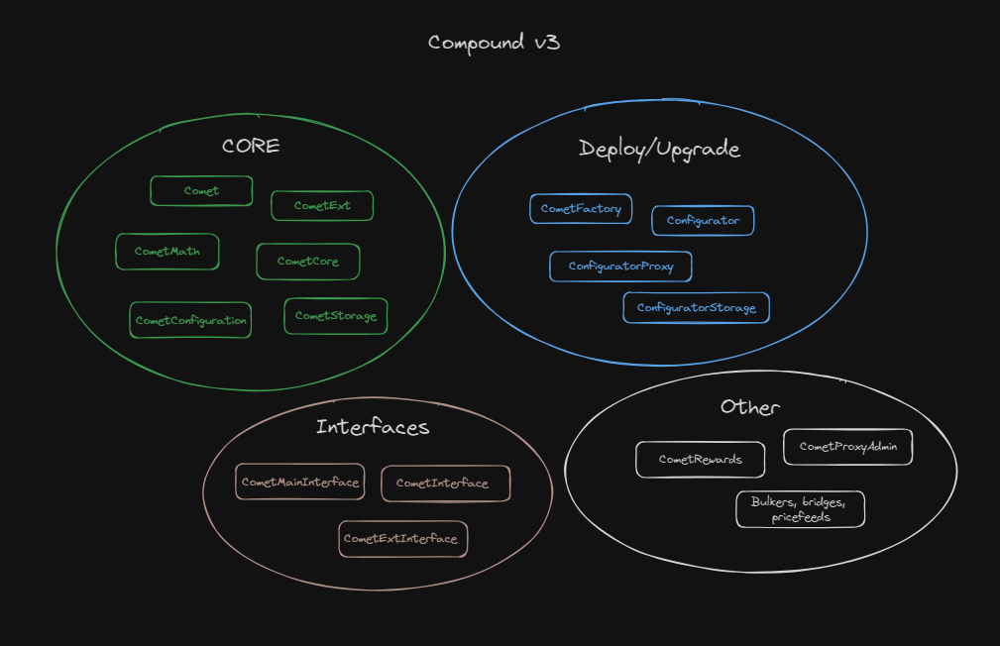

1. Первая группа - core контракты, которые реализуют базовую бизнес логику
2. Вторая группа - интерфейсы, которые реализуются на core контрактах из первой группы
3. Третья группа - контракты, обеспечивающие деплой, настройку и обновление логики
4. Четвертая группа - все оставшиеся смарт-контракты от примеров ликвидации до контракта вознаграждения

В каком-то роде архитектура протокола стала проще, благодаря изолированности каждого рынка друг от друга. Это способствовало реализации всего одного смарт-контракта [Comet.sol](https://github.com/compound-finance/comet/blob/main/contracts/Comet.sol) из core группы. Сам контракт закрывается под прокси для возможности обновления. Получается, что для взаимодействия пользователя с маркетом нужен всего один смарт-контракт в качестве точки входа. От этой точки входа и начнем разбираться. На схеме она обозначена красным кругом.

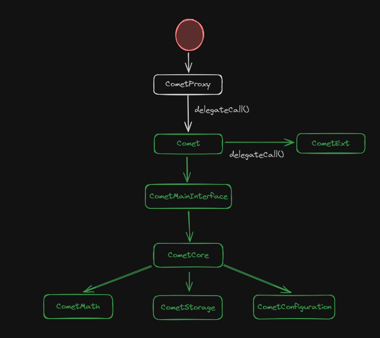

Таким образом, типичный вызов на смарт-контрактах выглядит так:
1. Прокси делегирует вызов на контракт [Comet.sol](https://github.com/compound-finance/comet/blob/main/contracts/Comet.sol)
2. Если необходимо, то вызов будет проксирован в [CometExt.sol](https://github.com/compound-finance/comet/blob/main/contracts/CometExt.sol). Часть наименее важного функционала вынесена туда, для обхода проблемы превышения максимально допустимого размера смарт-контракта (24 Kb).
3. Если нет необходимости, то вызов будет исполнен в рамках `Comet.sol`, функционал которого распределен по целому ряду смарт-контрактов: [CometMainInterface](https://github.com/compound-finance/comet/blob/main/contracts/CometMainInterface.sol), [ComentCore](https://github.com/compound-finance/comet/blob/main/contracts/CometCore.sol), [ComentMath.sol](https://github.com/compound-finance/comet/blob/main/contracts/CometMath.sol), [CometStorage](https://github.com/compound-finance/comet/blob/main/contracts/CometStorage.sol), [CometConfiguration](https://github.com/compound-finance/comet/blob/main/contracts/CometConfiguration.sol).

Кратко определим зону ответственности каждого смарт-контракта из core группы:
1. **Comet.sol**. Основной контракт c бизнес логикой, реализует займы, предоставление ликвидности, ликвидации.
2. **CometExt.sol**. Дополнительный контракт. Появился из-за того, что в основной контракт не поместилась вся бизнес-логика. Контракт отвечает за базовые функции связанные с функционалом ERC-20: name, symbol, approve и некоторые другие. Реализован в рамках "[The Fallback Extension Pattern](https://www.rareskills.io/post/fallback-extension-pattern)".
3. **CometCore.sol**. Небольшой контракт, который описывает логику начисления процентов для займов и предоставления ликвидности.
4. **CometStorage.sol**. Контракт для хранения переменных состояния. Ни в одном другом контракте переменные состояния больше не объявляются.
5. **CometMath.sol**. Вспомогательный контракт с реализацией несложных математических функций. Включает в себя защиту от переполнения.
6. **CometConfiguration.sol**. Содержит функционал для настройки `Comet.sol`.

### Обновление смарт-контрактов

Цель обновления заключается в изменении адреса контракта реализации для прокси `Comet.sol`. Необходимо, чтобы прокси начал ссылаться на новый вариант реализации.

Обратите внимание, смарт-контракт [Comet.sol](https://github.com/compound-finance/comet/blob/main/contracts/Comet.sol#L17) имеет очень много immutable переменных.

```solidity
contract Comet is CometMainInterface {
    /// @notice The admin of the protocol
    address public override immutable governor;

    /// @notice The account which may trigger pauses
    address public override immutable pauseGuardian;

    /// @notice The address of the base token contract
    address public override immutable baseToken;

    ...
}
```

Эти переменные достаточно разнородны. Это и адрес `governor`, и `supplyKink`, и `decimals`, и так далее. Все эти переменные являются настройками для `Comet.sol` и устанавливаются в constructor в момент деплоя смарт-контракта. Это означает что настройки являются частью кода смарт-контракта и для того, чтобы обновить их, необходимо обновить контракт реализации для контракта прокси целиком. В классическом варианте на контракте делают функцию `setter()`, которая может обновить любую настройку. Например

```solidity
contract Comet {
  function setGovernor(address governor) external onlyOwner {
    _governor = governor;
    ...
  }
}
```

В Compound v3 такого нет и для обновления адрес `governor` требуется полноценная смена имплементации для прокси. Выглядит подобный процесс следующим образом:

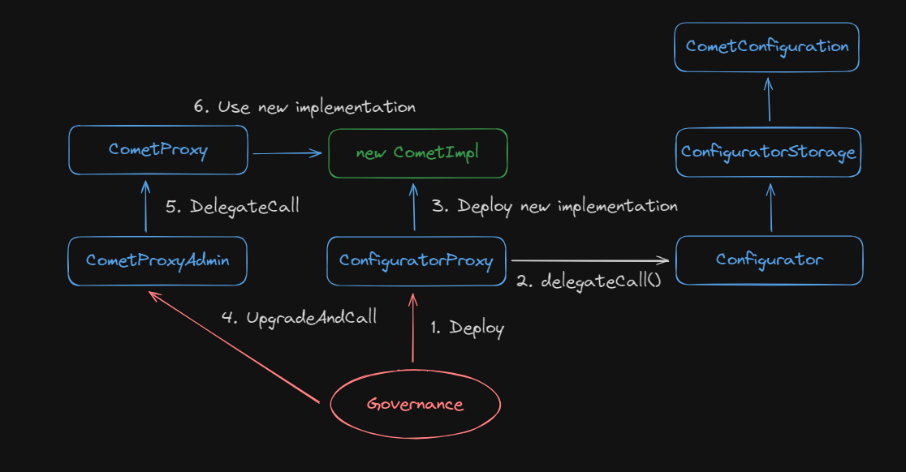

**Шаги 1 и 2.** Положительный результат голосования запускает процесс деплоя через вызов смарт-контракта [ConfiguratorProxy.sol](https://github.com/compound-finance/comet/blob/main/contracts/ConfiguratorProxy.sol). Прокси делегирует вызов к своей реализации и вызывает функцию [deploy()](https://github.com/compound-finance/comet/blob/main/contracts/Configurator.sol#L333) на контракте `Configurator.sol`.

**Шаг 3.** Не без участия [фабрики](https://github.com/compound-finance/comet/blob/main/contracts/CometFactory.sol#L8) будет создана новая имплементация контракта `Comet`. На схеме новая имплементация выделена зеленым цветом.

**Шаги 4, 5, 6.** После этого остается только на смарт-контракте [CometProxyAdmin.sol](https://github.com/compound-finance/comet/blob/main/contracts/CometProxyAdmin.sol#L16) вызвать функцию [upgradeAndCall()](https://github.com/OpenZeppelin/openzeppelin-contracts/blob/4764ea50750d8bda9096e833706beba86918b163/contracts/proxy/transparent/ProxyAdmin.sol#L38) и заменить адрес имплементации в CometProxy на новый.

_Важно!_ Можно самостоятельно изучить, какие настройки изменяется смарт-контракта Comet изменяются, в разделе [Governance](https://compound.finance/governance/proposals).

## Principal Value and Present Value

Чтобы двигаться дальше и смотреть код, походить по нему назад и вперед, сначала необходимо понять, как Compound хранит данные по заемщикам и поставщикам ликвидности.

За начисление прибыли для поставщиков отвечает переменная [baseSupplyIndex](https://github.com/compound-finance/comet/blob/main/contracts/CometStorage.sol#L50). Можно трактовать ее, как начисление какого-то количества токена за какое-то время. Каждый раз, когда происходит какая-нибудь операция (заем, депозит и так далее) эта переменная увеличивается согласно прошедшему времени и процентной ставке за этот период.

Единственно место, где происходит изменение переменной **baseSupplyIndex** это функция [accruedInterestIndices()](https://github.com/compound-finance/comet/blob/main/contracts/Comet.sol#L403).

```solidity
function accruedInterestIndices(uint timeElapsed) internal view returns (uint64, uint64) {
    uint64 baseSupplyIndex_ = baseSupplyIndex;
    uint64 baseBorrowIndex_ = baseBorrowIndex;
    if (timeElapsed > 0) {
        uint utilization = getUtilization();
        uint supplyRate = getSupplyRate(utilization);
        uint borrowRate = getBorrowRate(utilization);
        // Нас интересует сейчас вот это место
        baseSupplyIndex_ += safe64(mulFactor(baseSupplyIndex_, supplyRate * timeElapsed));
        baseBorrowIndex_ += safe64(mulFactor(baseBorrowIndex_, borrowRate * timeElapsed));
    }
    return (baseSupplyIndex_, baseBorrowIndex_);
}
```

Теперь, зная, что такое `baseSupplyIndex`, мы готовы посмотреть на структуру, которая отвечает за хранение информации о балансе базового актива пользователя и его процентах. Называется эта структура [UserBasic](https://github.com/compound-finance/comet/blob/main/contracts/CometStorage.sol#L29).

```solidity
struct UserBasic {
    int104 principal; // Информация о количестве базового актива на балансе пользователя
    uint64 baseTrackingIndex; // Используется для расчета накопленных вознаграждений в токене COMP
    uint64 baseTrackingAccrued; // используется для накопления вознаграждения в токене COMP
    uint16 assetsIn; // Набор бит, каждый из которых определяет актив, вложенный пользователем в качестве залога.
    uint8 _reserved; // В настоящее время не используется
}
```

Однако поле **principal** не такое простое, как может показаться. В случае с депозитом это поле будет делиться на **baseSupplyIndex**.

Например:
> baseSupplyIndex равен 5. Вноситься 500 USDC. **principal** будет равен 100.

Если выводить актив в этот же момент, то principal будет умножаться на baseSupplyIndex и мы получим те же самые 500 USDC. С течением времени baseSupplyIndex увеличивается, тем самым увеличивая сумму, которую сможет снять пользователь. Таким образом работает начисление процентов.

_Важно!_ Первоначальная сумма вложения называется **"present value"** (500), поделенный "present value" на baseSupplyIndex называется **"principal value"** (100).

За переход чисел от present до principal и обратно отвечает две функции: [presentValue()](https://github.com/compound-finance/comet/blob/main/contracts/CometCore.sol#L79C14-L79C26) и [principalValue()](https://github.com/compound-finance/comet/blob/main/contracts/CometCore.sol#L104).

Ситуация с расчетами для займа полностью соответствует предоставлению ликвидности. Только "principal value" становиться отрицательным и для расчета за место baseSupplyIndex используется **baseBorrowIndex**.

## Supply

Первое взаимодействие пользователя с любым лендинг протоколом подразумевает предоставление актива. В Compound v3 актив предоставляется для трех вещей: в качестве ликвидности, в качестве залога, в качестве погашения займа.

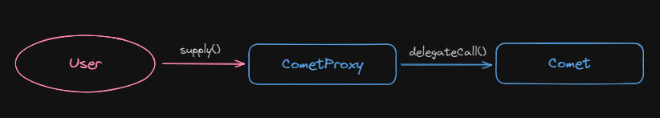

Есть три разных способа передать актив протоколу:
- **supply()**. Используется для предоставления актива напрямую от имени поставщика ликвидности.
- **supplyTo()**. Используется для предоставления актива от имени вызывающего на счет `to` адреса.
- **supplyFrom()**. Используется для предоставления актива со счета `from` от имени оператора, которому адрес `from` делегировал полномочия.

Под капотом процесс предоставления актива выглядит следующим образом:
1. Независимо от того, что вызывал пользователь ([supply()](https://github.com/compound-finance/comet/blob/main/contracts/Comet.sol#L835), [supplyTo()](https://github.com/compound-finance/comet/blob/main/contracts/Comet.sol#L845C14-L845C22), [supplyFrom()](https://github.com/compound-finance/comet/blob/main/contracts/Comet.sol#L856)) вызов уйдет в internal функцию [supplyInternal()](https://github.com/compound-finance/comet/blob/main/contracts/Comet.sol#L864).
    ```solidity
    // operator - это всегда msg.sender транзакции
    function supplyInternal(address operator, address from, address dst, address asset, uint amount) internal nonReentrant {
      // Проверит, что предоставление актива не приостановлено
      if (isSupplyPaused()) revert Paused();

      // Проверит, что вызов от адреса from или или от имени, кому адрес from делегировал
      if (!hasPermission(from, operator)) revert Unauthorized();

      // Если актив базовый, то учесть его в качестве предоставления ликвидности или погашения займа, иначе учесть в качестве залога для обеспечения займа
      if (asset == baseToken) {
          if (amount == type(uint256).max) {
              amount = borrowBalanceOf(dst);
          }
          return supplyBase(from, dst, amount);
      } else {
          return supplyCollateral(from, dst, asset, safe128(amount));
      }
    }
    ```
2. `supplyBase()` выглядит следующим образом:
    ```solidity
    function supplyBase(address from, address dst, uint256 amount) internal {
        // Трансфер базового актива на контракт
        amount = doTransferIn(baseToken, from, amount);

        // Начисление процентов
        accrueInternal();

        UserBasic memory dstUser = userBasic[dst];
        // Основная сумма базового актива у пользователя с адресом dst
        int104 dstPrincipal = dstUser.principal;
        // Рассчитываем новый баланс базового актива
        int256 dstBalance = presentValue(dstPrincipal) + signed256(amount);
        // Конвертируем баланс в новую сумму базового актива
        int104 dstPrincipalNew = principalValue(dstBalance);

        // Рассчитываем сумму, которая пойдет на погашение долга и на предоставление ликвидности
        (uint104 repayAmount, uint104 supplyAmount) = repayAndSupplyAmount(dstPrincipal, dstPrincipalNew);

        // Обновляем общую сумму ликвидности и общую сумму займа
        totalSupplyBase += supplyAmount;
        totalBorrowBase -= repayAmount;

        // Обновляем информацию пользователя по его позиции базового актива на контракте
        updateBasePrincipal(dst, dstUser, dstPrincipalNew);

        emit Supply(from, dst, amount);

        if (supplyAmount > 0) {
            emit Transfer(address(0), dst, presentValueSupply(baseSupplyIndex, supplyAmount));
        }
    }
    ```
3. `supplyCollateral()` выглядит следующим образом:
    ```solidity
    function supplyCollateral(address from, address dst, address asset, uint128 amount) internal {
        // Трансфер залогового актива на контракт
        amount = safe128(doTransferIn(asset, from, amount));

        AssetInfo memory assetInfo = getAssetInfoByAddress(asset);
        TotalsCollateral memory totals = totalsCollateral[asset];
        totals.totalSupplyAsset += amount;
        // Ограничение по максимальному количеству залогового актива, который может быть предоставлен на контракт
        if (totals.totalSupplyAsset > assetInfo.supplyCap) revert SupplyCapExceeded();

        uint128 dstCollateral = userCollateral[dst][asset].balance;
        uint128 dstCollateralNew = dstCollateral + amount;

        // Обновление общей суммы залогового актива и суммы пользователя предоставленных на контракт
        totalsCollateral[asset] = totals;
        userCollateral[dst][asset].balance = dstCollateralNew;

        // Устанавливает метку (бит), что этот актив используется в качестве залога пользователем
        updateAssetsIn(dst, assetInfo, dstCollateral, dstCollateralNew);

        emit SupplyCollateral(from, dst, asset, amount);
    }
    ```

    На схеме можно наглядно закрепить в голове процесс вызова для предоставления актива.

    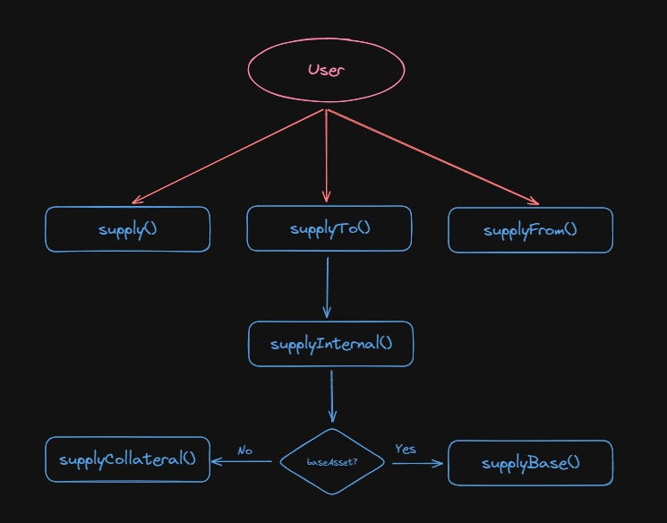

## Withdraw

Изъятие активов из протокола работает по подобной схеме, аналогично `supply()`.


Для извлечения актива из протокола, пользователи могут воспользоваться одной из трех функций:
- **withdraw()**. Используется для извлечения актива напрямую от имени вызывающего.
- **withdrawTo()**. Используется для извлечения актива от имени вызывающего на адрес `to`.
- **withdrawFrom()**. Используется для извлечения актива с адреса `from` от имени оператора, которому адрес `from` делегировал полномочия.

Под капотом процесс изъятия актива выглядит следующим образом:

1. Независимо от того, что вызывал пользователь ([withdraw()](https://github.com/compound-finance/comet/blob/main/contracts/Comet.sol#L1057), [withdrawTo()](https://github.com/compound-finance/comet/blob/main/contracts/Comet.sol#L1067), [withdrawFrom()](https://github.com/compound-finance/comet/blob/main/contracts/Comet.sol#L1078)) вызов уйдет в internal функцию[ withdrawInternal()](https://github.com/compound-finance/comet/blob/main/contracts/Comet.sol#L1086).

    ```solidity
    function withdrawInternal(address operator, address src, address to, address asset, uint amount) internal nonReentrant {
        // Проверит, что предоставление актива не приостановлено
        if (isWithdrawPaused()) revert Paused();

        // Проверит, что вызов от адреса src или или от имени, кому адрес src делегировал
        if (!hasPermission(src, operator)) revert Unauthorized();

        // Если актив базовый, то учесть его в качестве изъятия ликвидности, иначе учесть в качестве залога для обеспечения займа.
        if (asset == baseToken) {
            if (amount == type(uint256).max) {
                amount = balanceOf(src);
            }
            return withdrawBase(src, to, amount);
        } else {
            return withdrawCollateral(src, to, asset, safe128(amount));
        }
    }
    ```
2. Если актив базовый, то необходимо убедиться, что у нас положительный баланс и это значит, что мы предоставляли ликвидность, если отрицательный, то занимали.
    ```solidity
    function withdrawBase(address src, address to, uint256 amount) internal {
        // Начисление процентов
        accrueInternal();

        // Считываем информацию по адресу src, со счета которого мы снимаем актив
        UserBasic memory srcUser = userBasic[src];
        int104 srcPrincipal = srcUser.principal;
        int256 srcBalance = presentValue(srcPrincipal) - signed256(amount);
        int104 srcPrincipalNew = principalValue(srcBalance);

        // Рассчитываем суммы для снятия и суммы, которая будет в займе
        (uint104 withdrawAmount, uint104 borrowAmount) = withdrawAndBorrowAmount(srcPrincipal, srcPrincipalNew);

        // Записываем общую сумму базового актива после снятия и корректируем общую сумму занятых активов
        totalSupplyBase -= withdrawAmount;
        totalBorrowBase += borrowAmount;

        // Обновляем информацию пользователя по его позиции базового актива на контракте
        updateBasePrincipal(src, srcUser, srcPrincipalNew);

        if (srcBalance < 0) {
            if (uint256(-srcBalance) < baseBorrowMin) revert BorrowTooSmall();
            if (!isBorrowCollateralized(src)) revert NotCollateralized();
        }

        // Передаем базовый актив для указанного адреса
        doTransferOut(baseToken, to, amount);

        emit Withdraw(src, to, amount);

        if (withdrawAmount > 0) {
            emit Transfer(src, address(0), presentValueSupply(baseSupplyIndex, withdrawAmount));
        }
    }
    ```
3. Если снимаем актив, который был залоговым, то вызов уходит в `withdrawCollateral()`
    ```solidity
    function withdrawCollateral(address src, address to, address asset, uint128 amount) internal {
        uint128 srcCollateral = userCollateral[src][asset].balance;
        uint128 srcCollateralNew = srcCollateral - amount;

        // Обновление информации по общему количеству залогового токена на контракте и по количеству у пользователя
        totalsCollateral[asset].totalSupplyAsset -= amount;
        userCollateral[src][asset].balance = srcCollateralNew;

        AssetInfo memory assetInfo = getAssetInfoByAddress(asset);
        updateAssetsIn(src, assetInfo, srcCollateral, srcCollateralNew);

        // Запрещает снимать активы, которые не являются обеспечением
        if (!isBorrowCollateralized(src)) revert NotCollateralized();

        // Трансфер активов до пользователя
        doTransferOut(asset, to, amount);

        emit WithdrawCollateral(src, to, asset, amount);
    }
    ```

## Borrow

Займ актива - это одна из самых главных механик любого кредитного протокола. Ради нее мы тут с вами и собрались. Занять на смарт-контракте `Comet.sol` можно только один базовый актив в рамках одного рынка.

Перед займом, необходимо выполнить одно условие - внести достаточное количество залогового актива, чтобы заем был полностью и "чуть больше" обеспечен. Для этого, сначала вызывается функция `supply()`. Ее мы рассмотрели выше.

За сам заем отвечает функция снятия актива `withdraw()`. Мы уже разбирали порядок вызова этой функции выше. Занять можно только базовый актив, поэтому погрузимся чуть глубже в функцию `withdrawBase()`. Подсветим, только интересующие нас участки кода.

```solidity
function withdrawBase(address src, address to, uint256 amount) internal {
    ...

    UserBasic memory srcUser = userBasic[src];
    int104 srcPrincipal = srcUser.principal;
    int256 srcBalance = presentValue(srcPrincipal) - signed256(amount);
    // Рассчитываем новую сумму базового актива, после снятия
    int104 srcPrincipalNew = principalValue(srcBalance);

    // Здесь будем решать, сколько пользователь просто снимает, а сколько он занимает
    (uint104 withdrawAmount, uint104 borrowAmount) = withdrawAndBorrowAmount(srcPrincipal, srcPrincipalNew);

    ...
}
```

Нас здесь будет интересовать функция `withdrawAndBorrowAmount()`, которая определяет сумму займа. Посмотрим, что в ней внутри.

```solidity
// oldPrincipal - старый показатель количества базового актива
// newPrincipal - новый показатель количества базового актива
// Возвращается (Сумма для снятия базового актива с контракта, сумма для займа базового актива)
function withdrawAndBorrowAmount(int104 oldPrincipal, int104 newPrincipal) internal pure returns (uint104, uint104) {
    // Если новая сумма больше старой, это значит, что мы и не снимали активы и не занимали, что-то пошло нет так и такого быть не должно в нашем случае
    if (newPrincipal > oldPrincipal) return (0, 0);

    // Если новая сумма больше нуля или равно, то это значит, что мы снимаем актив
    if (newPrincipal >= 0) {
        return (uint104(oldPrincipal - newPrincipal), 0);
        // Если старая сумма меньше или равна нулю, то это значит, что мы уже занимали актив и мы не попали в первое условие, потому что новая сумма тоже меньше нуля, а это значит, что мы продолжаем занимать активы
    } else if (oldPrincipal <= 0) {
        return (0, uint104(oldPrincipal - newPrincipal));
        // Если мы не подошли под условия выше, то просто возвращаем переданные нам значения
    } else {
        return (uint104(oldPrincipal), uint104(-newPrincipal));
    }
}
```

Получается, что пользователь займет указанную им сумму активов при вызове `withdraw()`, но если у него был депозит базового актива, то долг ему запишется за вычетом депозита. Точнее он получит указанную им сумму, но больше у него не будет ликвидности в базовом активе.

## Repay

Погашение займа работает аналогично функции `withdraw()` через вызов функции `supply()`. Мы тоже видели там функцию [supplyBase()](https://github.com/compound-finance/comet/blob/main/contracts/Comet.sol#L872).

Практика - это один из лучших способов закрепления материала, поэтому предлагаю самостоятельно понять, каким образом происходит погашение займа.

## Liquidation

Ликвидация в Compound v3 простая за счет того, что все займы сделаны в рамках одного маркета, а технически в рамках одного смарт-контракта `Comet.sol`. Работать все также необходимо со смарт-контрактом прокси. Однако здесь появляется еще один смарт-контракт участник. Это контракт оракула, который отвечает за подсчет стоимости залоговых активов.

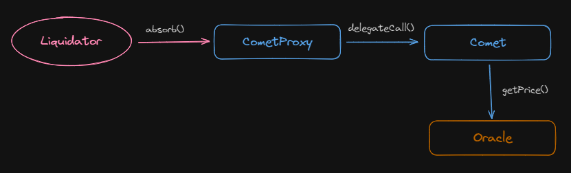

Для процесса ликвидации необходимо поработать всего с двумя функциями:
- **isLiqudatable()**. Проверяет все залоговые токены, которые были предоставлены пользователем, суммирует стоимость всего залога, для этого по каждому активу подгружает стоимость из оракула
- **absorb()**. Функция, которая непосредственно ликвидирует позицию заемщика

Функция [isLiquidatable()](https://github.com/compound-finance/comet/blob/main/contracts/Comet.sol#L566) суммирует предоставленное пользователем обеспечение в USD по каждому активу, умножая его на **liquidateCollateralFactor**, который показывает на какую часть залога можно ликвидировать.

```solidity
function isLiquidatable(address account) override public view returns (bool) {
    int104 principal = userBasic[account].principal;

    // Если баланс базового актива положительный, это означает, что у пользователя нет займа и он сразу не может подлежать ликвидации
    if (principal >= 0) {
        return false;
    }

    uint16 assetsIn = userBasic[account].assetsIn;
    // Пересчитываем количество базового актива в USD, если есть заем, то значение будет отрицательным
    int liquidity = signedMulPrice(
        presentValue(principal),
        getPrice(baseTokenPriceFeed),
        uint64(baseScale)
    );

    // Цикл по всем допустимым активам
    for (uint8 i = 0; i < numAssets; ) {
        if (isInAsset(assetsIn, i)) {
            // Если ликвидности достаточно с нескольких активов, то нет смысла проверять все активы
            // Такой пользователь уже не подлежит ликвидации
            if (liquidity >= 0) {
                return false;
            }

            AssetInfo memory asset = getAssetInfo(i);
            // Количество обеспечения пользователя по активу в USD
            uint newAmount = mulPrice(
                userCollateral[account][asset.asset].balance,
                getPrice(asset.priceFeed),
                asset.scale
            );
            // Применяем фактор ликвидации по активу и суммируем полученное значение с ликвидностью по другим активам
            liquidity += signed256(mulFactor(
                newAmount,
                asset.liquidateCollateralFactor
            ));
        }
        unchecked { i++; }
    }

    return liquidity < 0;
}
```

Функция `absorb(address absorber, address[] calldata accounts)` принимает два параметра:

- **absorber**. Адрес, который получит очки за ликвидацию
- **accounts**. Список пользователей, позиции которых подлежат ликвидации

Порядок вызова функции для ликвидации будет следующий:
1. Вызывается функция `absorb()`
    ```solidity
    function absorb(address absorber, address[] calldata accounts) override external {
        // Проверяется, чтобы процесс ликвидации не был приостановлен
        if (isAbsorbPaused()) revert Paused();

        uint startGas = gasleft();

        // Начисляются проценты
        accrueInternal();

        // Для каждого адреса из списка пользователей проводится ликвидация
        for (uint i = 0; i < accounts.length; ) {
            absorbInternal(absorber, accounts[i]);
            unchecked { i++; }
        }
        uint gasUsed = startGas - gasleft();

        // Начисляются очки за ликвидацию на базе количества пользователей и потраченного газа для из ликвидации
        LiquidatorPoints memory points = liquidatorPoints[absorber];
        points.numAbsorbs++;
        points.numAbsorbed += safe64(accounts.length);
        points.approxSpend += safe128(gasUsed * block.basefee);
        liquidatorPoints[absorber] = points;
    }
    ```
2. Дальше вызов уходит во внутреннюю функцию `absorbInternal()`.
    ```solidity
    function absorbInternal(address absorber, address account) internal {
        // Проверяется возможность ликвидации аккаунта
        if (!isLiquidatable(account)) revert NotLiquidatable();

        // Получаем информацию по займу пользователя
        UserBasic memory accountUser = userBasic[account];
        int104 oldPrincipal = accountUser.principal;
        int256 oldBalance = presentValue(oldPrincipal);
        uint16 assetsIn = accountUser.assetsIn;

        // Получаем стоимость базового актива
        uint256 basePrice = getPrice(baseTokenPriceFeed);

        // По сути deltaValue - сумма в USD, которая будет ликвидирована
        uint256 deltaValue = 0;
        for (uint8 i = 0; i < numAssets; ) {
            if (isInAsset(assetsIn, i)) {
                AssetInfo memory assetInfo = getAssetInfo(i);
                address asset = assetInfo.asset;
                uint128 seizeAmount = userCollateral[account][asset].balance;
                userCollateral[account][asset].balance = 0;
                totalsCollateral[asset].totalSupplyAsset -= seizeAmount;

                uint256 value = mulPrice(seizeAmount, getPrice(assetInfo.priceFeed), assetInfo.scale);
                // Применение фактора ликвидации к сумме обеспечения по активу
                deltaValue += mulFactor(value, assetInfo.liquidationFactor);

                emit AbsorbCollateral(absorber, account, asset, seizeAmount, value);
            }
            unchecked { i++; }
        }

        // Рассчитываем количество базового актива, который будет ликвидирован
        uint256 deltaBalance = divPrice(deltaValue, basePrice, uint64(baseScale));
        // oldBalance - число отрицательное, так как показывает какая сумма в займе
        // Поэтому прибавление deltaBalance ликвидирует позицию на эту сумму
        int256 newBalance = oldBalance + signed256(deltaBalance);
        if (newBalance < 0) {
            newBalance = 0;
        }

        // Записываем оставшуюся сумму базового актив в займе пользователя
        int104 newPrincipal = principalValue(newBalance);
        updateBasePrincipal(account, accountUser, newPrincipal);

        // Сбрасываем информацию по активам, которые были залогом у пользователя
        userBasic[account].assetsIn = 0;

        (uint104 repayAmount, uint104 supplyAmount) = repayAndSupplyAmount(oldPrincipal, newPrincipal);

        // Проставляем тоталы по займам и ликвидности
        totalSupplyBase += supplyAmount;
        totalBorrowBase -= repayAmount;

        uint256 basePaidOut = unsigned256(newBalance - oldBalance);
        uint256 valueOfBasePaidOut = mulPrice(basePaidOut, basePrice, uint64(baseScale));
        emit AbsorbDebt(absorber, account, basePaidOut, valueOfBasePaidOut);

        if (newPrincipal > 0) {
            emit Transfer(address(0), account, presentValueSupply(baseSupplyIndex, unsigned104(newPrincipal)));
        }
    }
    ```

Если хоть один адрес из списка пользователей для ликвидации на самом деле ликвидации не подлежит, то вся транзакция будет отменена.

Важная особенность заключается в том, что здесь нет частичной ликвидации, пользователь либо ликвидирован полностью, либо никак. Все что останется у пользователя от ликвидации превратиться в предоставленную ликвидность. Получается ликвидированный пользователь станет поставщиком ликвидности.

А еще более интересным кажется то, что ликвидатор **не получил** напрямую ничего кроме бонусов. Мы не видели ни одной функции `transfer()` на протяжение всего вызова функции `absorb()`.

**В чем же заключается стимул заниматься ликвидатору его деятельностью?** Ответ прост, протокол позволяет выкупать оставшиеся залоговые активы ликвидированных со скидкой. Для этого необходимо воспользоваться функцией [buyCollateral()](https://github.com/compound-finance/comet/blob/main/contracts/Comet.sol#L1247).

```solidity
function buyCollateral(address asset, uint minAmount, uint baseAmount, address recipient) override external nonReentrant {
    if (isBuyPaused()) revert Paused();

    // Резервы протокола, которые он накапливает, когда берет процент протокола
    int reserves = getReserves();
    // Протокол запрещает выкуп залога, если резервов накопиться больше, чем целевая отметка
    if (reserves >= 0 && uint(reserves) >= targetReserves) revert NotForSale();

    // Списывает с покупателя базовый актив
    baseAmount = doTransferIn(baseToken, msg.sender, baseAmount);

    // Рассчитывает количество актива, который получит покупатель
    uint collateralAmount = quoteCollateral(asset, baseAmount);
    if (collateralAmount < minAmount) revert TooMuchSlippage();
    if (collateralAmount > getCollateralReserves(asset)) revert InsufficientReserves();

    // Отправит купленный актив покупателю
    doTransferOut(asset, recipient, safe128(collateralAmount));

    emit BuyCollateral(msg.sender, asset, baseAmount, collateralAmount);
}
```

Скидка будет применена внутри функции [quoteCollateral()](https://github.com/compound-finance/comet/blob/main/contracts/Comet.sol#L1274).

Подытожить процесс ликвидации можно тем, что по итогу, ликвидатор должен реализовать бота, который в одной транзакции будет вызывать `absorb()` и `buyCollateral()`.

Compound v3 предлагает базовую реализацию ликвидационного [бота](https://github.com/compound-finance/comet/tree/main/contracts/liquidator).

## Interest Rates

Протокол начисляет два вида процентов:

- **За заем.** Заемщик платит проценты протоколу за использование займа.
- **За предоставление ликвидности.** Протокол выплачивает комиссию поставщикам ликвидности.
Проценты пересчитываются с течением времени. Интерфейс приложения отображает годовые процентные ставки (APR).

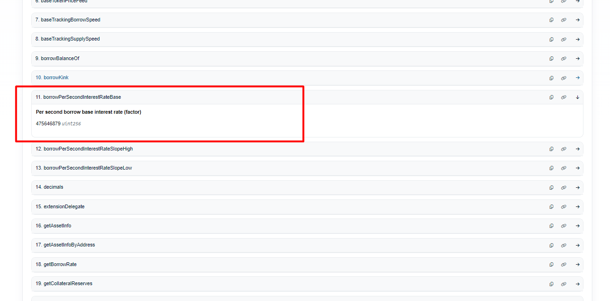

Например, получим `borrowPerSecondInterestRateBase()` с etherscan. Нам вернется значение `475646879`. Как это будет выглядеть на клиенте? В году, согласно Compound, содержится `31536000` секунд. Тогда за год накапает 475646879 * 31536000 = 1.5e+16. точность для этого параметра 1e18. И того, переводя это в проценты, мы получим 1.5% для borrowInterestRate.

Важным отличием от второй версии является то, что borrowRate формируется по отдельной формуле кривой и никак не связан с supplyRate. Результатом этого является то, что за место одного параметр kink, протокол имеет два отдельных [supplyKink](https://github.com/compound-finance/comet/blob/main/contracts/Comet.sol#L33C41-L33C42) и [borrowKink](https://github.com/compound-finance/comet/blob/main/contracts/Comet.sol#L49).

Для того, чтобы узнать сколько процентов предлагает протокол поставщикам ликвидности необходимо вызвать функцию [getSupplyRate()](https://github.com/compound-finance/comet/blob/main/contracts/Comet.sol#L449) на контракте `Comet.sol`.

```solidity
// Текущий utilization можно получить вызвав функцию getUtilization()
function getSupplyRate(uint utilization) override public view returns (uint64) {
    if (utilization <= supplyKink) {
        // interestRateBase + interestRateSlopeLow * utilization
        return safe64(supplyPerSecondInterestRateBase + mulFactor(supplyPerSecondInterestRateSlopeLow, utilization));
    } else {
        // interestRateBase + interestRateSlopeLow * kink + interestRateSlopeHigh * (utilization - kink)
        return safe64(supplyPerSecondInterestRateBase + mulFactor(supplyPerSecondInterestRateSlopeLow, supplyKink) + mulFactor(supplyPerSecondInterestRateSlopeHigh, (utilization - supplyKink)));
    }
}
```

Функция [getUtilization()](https://github.com/compound-finance/comet/blob/main/contracts/Comet.sol#L478) проста, она показывает отношение общего количества актива в займе к всему предоставленному активу в качестве ликвидности.

```solidity
function getUtilization() override public view returns (uint) {
    uint totalSupply_ = presentValueSupply(baseSupplyIndex, totalSupplyBase);
    uint totalBorrow_ = presentValueBorrow(baseBorrowIndex, totalBorrowBase);
    if (totalSupply_ == 0) {
        return 0;
    } else {
        return totalBorrow_ * FACTOR_SCALE / totalSupply_;
    }
}
```

Для того, чтобы узнать сколько процентов предлагает протокол для займа необходимо вызвать функцию [getBorrowRate()](https://github.com/compound-finance/comet/blob/main/contracts/Comet.sol#L464) на контракте `Comet.sol`.

```solidity
// Текущий utilization можно получить вызвав функцию getUtilization()
function getBorrowRate(uint utilization) override public view returns (uint64) {
    if (utilization <= borrowKink) {
        // interestRateBase + interestRateSlopeLow * utilization
        return safe64(borrowPerSecondInterestRateBase + mulFactor(borrowPerSecondInterestRateSlopeLow, utilization));
    } else {
        // interestRateBase + interestRateSlopeLow * kink + interestRateSlopeHigh * (utilization - kink)
        return safe64(borrowPerSecondInterestRateBase + mulFactor(borrowPerSecondInterestRateSlopeLow, borrowKink) + mulFactor(borrowPerSecondInterestRateSlopeHigh, (utilization - borrowKink)));
    }
}
```

## Rewards

Участники протокола вознаграждаются токенами COMP в экосистеме Compound.

Контракт `Comet.sol` отслеживает только участие пользователя в жизни протокола (предоставление ликвидности и займы), но не управляет процессом выдачи вознаграждений.

Для получения вознаграждений протокол реализовал смарт-контракт [CometRewards.sol](https://github.com/compound-finance/comet/blob/main/contracts/CometRewards.sol), который читает контракт `Comet.sol` и выпускает токены COMP.

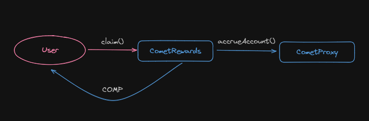

Скорость, с которой выдаются вознаграждения, объявляется параметрами внутри контракта `CometRewards.sol`, которые устанавливаются через [DAO](https://github.com/compound-finance/comet/blob/main/contracts/CometRewards.sol#L67).

Для того, чтобы проверить, есть ли накопленное вознаграждение можно вызвать функцию [getRewardOwed()](https://github.com/compound-finance/comet/blob/main/contracts/CometRewards.sol#L146). Это не view функция, потому что она обращается к контракту `Comet.sol`.

Для того, чтобы получить вознаграждение пользователю дается две функции:
- [claim()](https://github.com/compound-finance/comet/blob/main/contracts/CometRewards.sol#L165)
- [claimTo()](https://github.com/compound-finance/comet/blob/main/contracts/CometRewards.sol#L175C14-L175C21)

В целом внутреннее убранство полностью такое же как и в контракте `Comet.sol`.

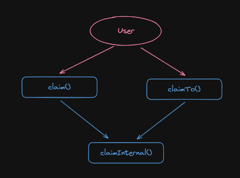

Пользователь может вызвать функцию [claim()](https://github.com/compound-finance/comet/blob/main/contracts/CometRewards.sol#L165C14-L165C19) или [claimTo()](https://github.com/compound-finance/comet/blob/main/contracts/CometRewards.sol#L175) на выбор, после чего вызов уходит во внутреннюю функцию [claimInternal()](https://github.com/compound-finance/comet/blob/main/contracts/CometRewards.sol#L184).

```solidity
function claimInternal(address comet, address src, address to, bool shouldAccrue) internal {
    // Проверяется поддержка совместимости с comet
    RewardConfig memory config = rewardConfig[comet];
    if (config.token == address(0)) revert NotSupported(comet);

    // Получение значения, которое показывает сколько вознаграждения заработал пользователь
    if (shouldAccrue) {
        CometInterface(comet).accrueAccount(src);
    }

    uint claimed = rewardsClaimed[comet][src];
    uint accrued = getRewardAccrued(comet, src, config);

    if (accrued > claimed) {
        uint owed = accrued - claimed;
        // Фиксируется значение, сколько вознаграждения уже выплачено
        rewardsClaimed[comet][src] = accrued;

        // Перевод вознаграждения пользователю
        doTransferOut(config.token, to, owed);

        emit RewardClaimed(src, to, config.token, owed);
    }
}
```

Контракт `CometRewards.sol` не создает токен COMP на вызов `claim()`, поэтому задача DAO поддерживать достаточное количество токена COMP на балансе смарт-контракта.

_Важно!_ Количество токена COMP ограничено, поэтому будет невозможно всегда раздавать вознаграждение за участие в жизни протокола.

## cToken

Мы изучили предоставление ликвидности и займ, но нигде не увидели такого понятного и лампового **cToken**, который хорошо знаком нам по второй версии compound. Но ведь этот термин  можно встретить в документации Compound. Мы видим cUSDC среди адресов задеплоенных контрактов.

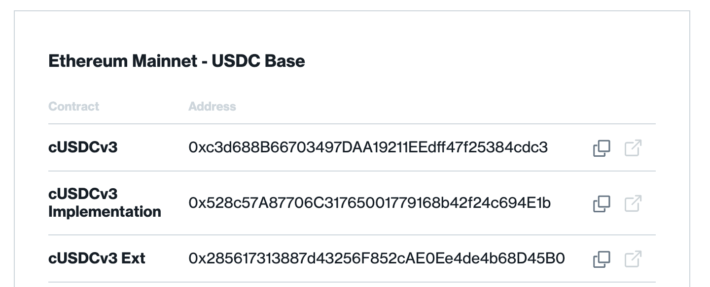

На самом деле cToken никуда не делся, он замаскировался под смарт-контракт `Comet.sol`. Если внимательно посмотреть на этот контракт, то можно обнаружить целый ряд функций присущих ERC-20 токену и отвечающих за трансфер:
- [transfer()](https://github.com/compound-finance/comet/blob/main/contracts/Comet.sol#L933)
- [transferFrom()](https://github.com/compound-finance/comet/blob/main/contracts/Comet.sol#L945)
- [transferAsset()](https://github.com/compound-finance/comet/blob/main/contracts/Comet.sol#L956C14-L956C27)
- [transferAssetFrom()](https://github.com/compound-finance/comet/blob/main/contracts/Comet.sol#L967)

Ну а все остальные функции необходимые ERC-20 по спецификации размещены в расширении контракта `Comet.sol` под названием [CometExt.sol](https://github.com/compound-finance/comet/blob/main/contracts/CometExt.sol). Это функции: name(), approve(), symbol() и так далее. Из-за того, что вызов в расширение попадает только через делегированный вызов (delegateCall), etherscan не может отображать эти функции для смарт-контракта `Comet.sol`.

## Вывод

На мой субъективный взгляд, Compound v3 - это самая простая, элегантная кодовая база среди lending протоколов которые я видел. Мне нравится читать и разбираться в коде Compound v3. Мне нравится, что вся логика находится практически в одном главном смарт-контракте с понятной цепочкой наследования, едиными точками входа для взаимодействия. Уникальный процесс обновления и первичной настройки смарт-контрактов вызывает отдельный вид эстетического удовольствия! Считаю, что compound v3 может претендовать на эталон среди подобных лендингов.

Однако не стоит забывать о реальных пользовательских преимуществах в виде изолированности рынков, разделение активов по-разным контрактам `Comet.sol`. Это значительно снижает риски и потенциальные потери в случае взлома протокола. Хоть смарт-контракты и проходили множественные аудиты, никто от этого не застрахован. Более того, такая архитектура позволяет эффективно масштабироваться и управлять протоколом.

## Links

1. Github [репозиторий](https://github.com/compound-finance/comet)
2. Официальная [документация](https://docs.compound.finance/)
3. [Принцип работы процентных ставок](https://www.rareskills.io/post/aave-interest-rate-model)
4. [Книга](https://www.rareskills.io/compound-v3-book) Compound V3 от RareSkills. Стала базой для написания этой статьи. Если нужно погрузиться больше, то обязательно сюда.