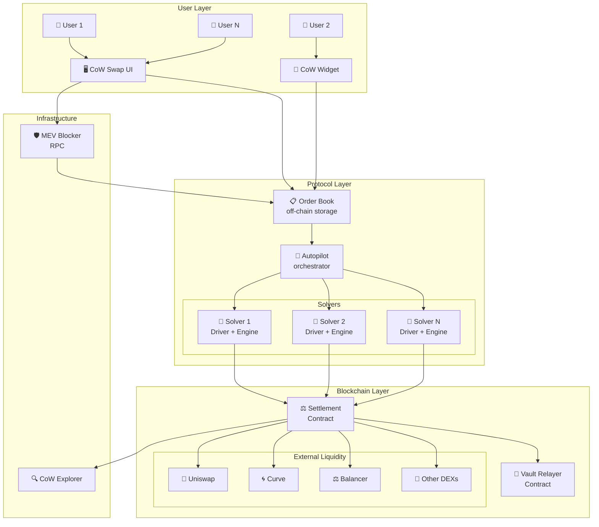
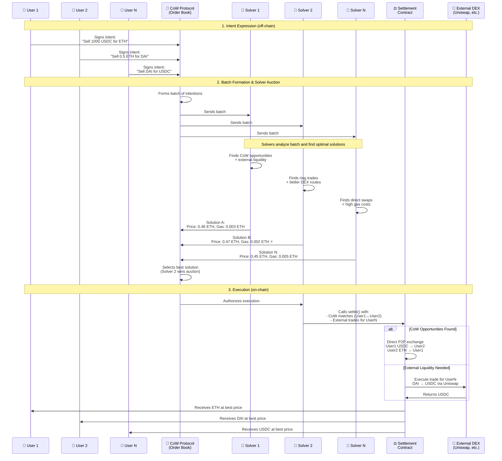
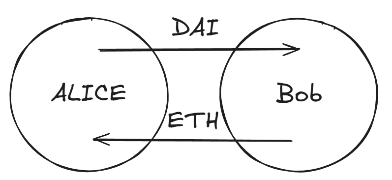
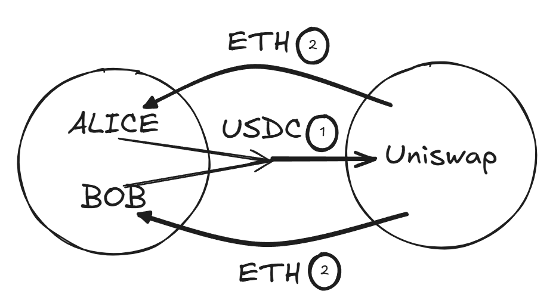
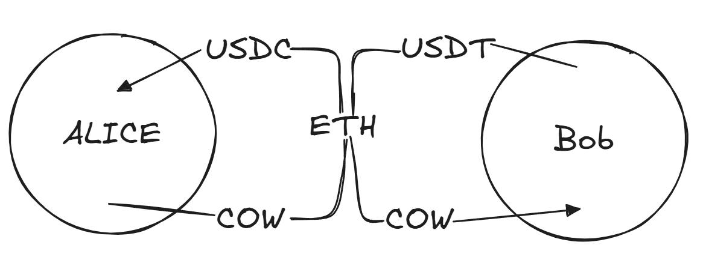
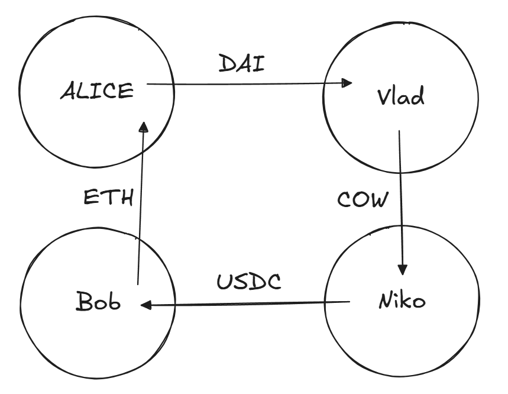
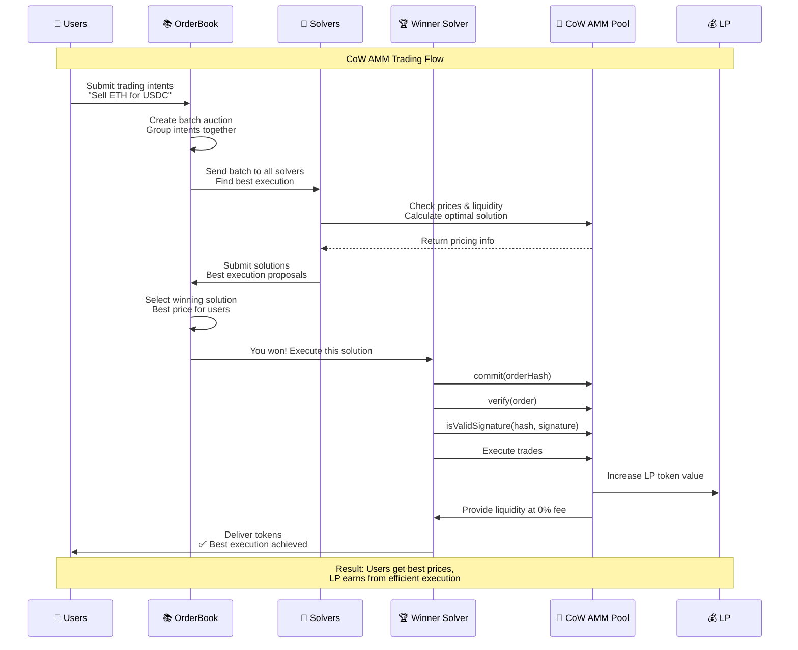
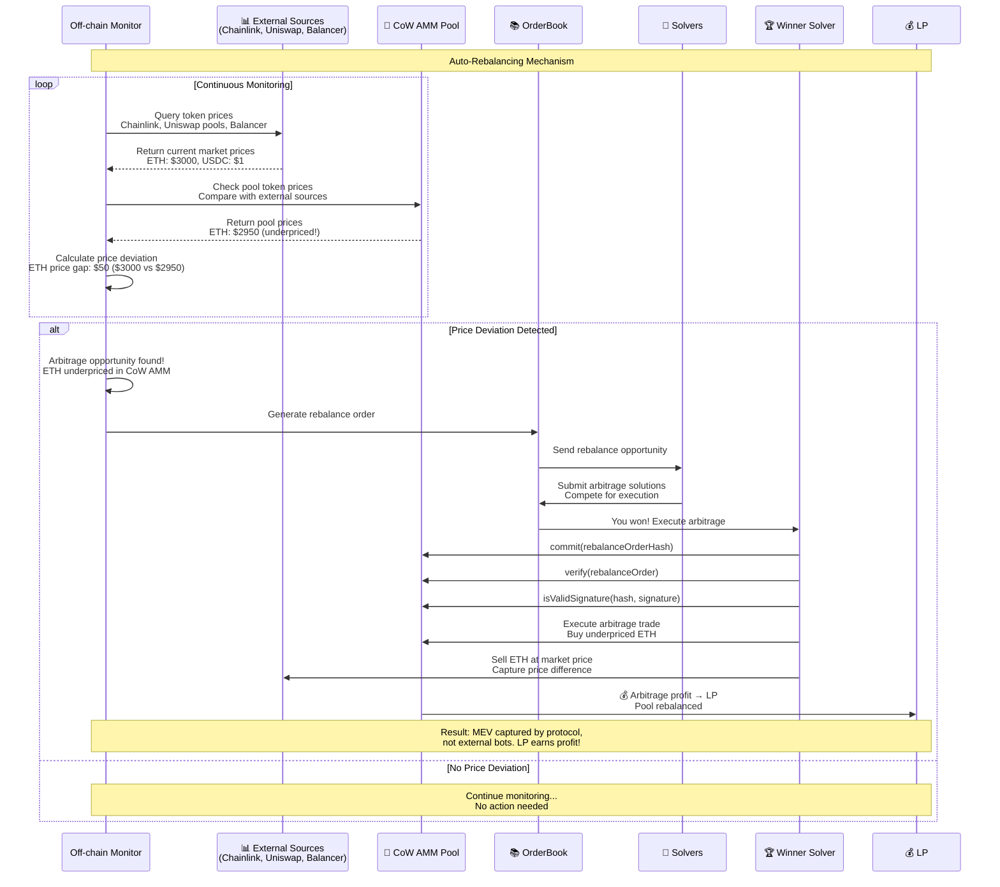
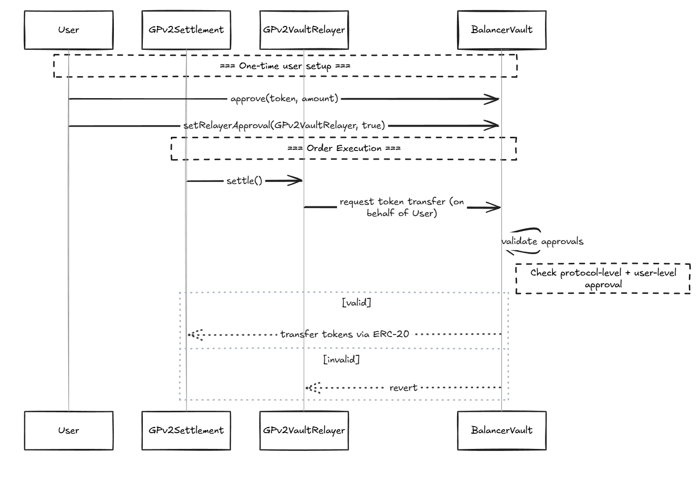
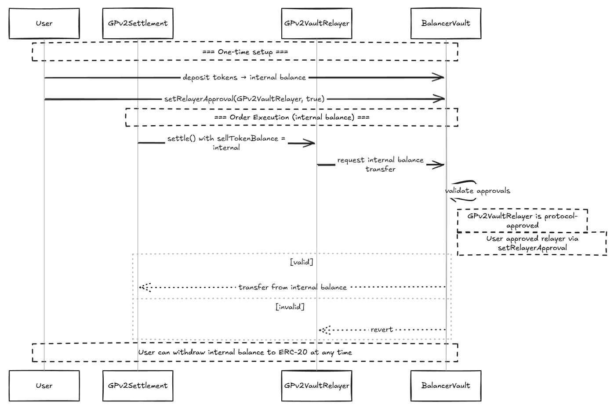

# CoW DAO

**Автор:** [Алексей Куценко](https://github.com/bimkon144) 👨‍💻

[CoW DAO](https://cow.fi/) - это целый набор продуктов под управлением собственного DAO.

Основным продуктом является cow protocol.

В основе продукта cow protocol лежит концепция CoW ([Coincidence of Wants](https://docs.cow.fi/cow-protocol/concepts/how-it-works/coincidence-of-wants)), которая позволяет трейдерам обмениваться токенами напрямую, без лишних посредников.

Представьте, что вы хотите продать ETH за USDC, а кто-то другой хочет продать USDC за ETH. В обычном DEX каждый из вас заплатил бы комиссию за свою сделку сторонним поставщикам ликвидности и конечно же за газ.
А в CoW Swap вы можете просто обменяться напрямую, заплатив только лишь часть продаваемых токенов исполнителю транзакции! Это как найти идеального торгового партнёра на рынке.

## Список продуктов

**CoW Protocol**
Сердце всей системы - полностью open source торговый протокол, который использует пакетные аукционы и Coincidence of Wants.

**CoW Swap**
[Веб-интерфейс](https://github.com/cowprotocol/cowswap), через который пользователи взаимодействуют с протоколом торговли.

**CoW AMM**
Специальный пул ликвидности, который решает главную проблему обычных AMM - LVR (Loss-versus-rebalancing) из-за арбитражников.

LVR - это когда поставщики ликвидности в классических AMM теряют деньги из-за того, что арбитражники забирают прибыль, покупая токены по старой (более выгодной) цене в пуле, пока она не успела подстроиться под рыночную.
По сути, это проблема временного лага между изменением цен на централизованных биржах и обновлением цен в децентрализованном пуле ликвидности.

**MEV Blocker**
Созданный RPC endpoint для защиты транзакций от MEV, таких как frontrunning и sandwitching. К тому же, пользователи могут получить прибыль от backrunning их транзакций.

**Cow Explorer**
Похожий на etherscan [обозреватель](https://explorer.cow.fi/), но созданный для визуализации выставленных и выполненных ордеров в протоколе.

**Widget**

C помощью [виджета](https://widget.cow.fi/) можно создавать кастомный интерфейс для взаимодействия с протоколом в своем приложении.

## Как всё начиналось: от Gnosis Protocol к CoW DAO

История CoW DAO началась в экосистеме [Gnosis](https://www.gnosis.io/) - одного из старейших проектов Ethereum.

**Gnosis Protocol v1 (2020)**

Первая версия была амбициозной попыткой создать децентрализованный обменник с ордербуком прямо в блокчейне. Идея была хорошей, но на практике возникли проблемы:

- Каждый ордер стоил дорого из-за высоких комиссий за газ
- Хранение ордеров в блокчейне ограничивало ликвидность

Таким образом, необходим был подход, который помог бы улучшить ситуацию вышеуказанных проблем.

**Gnosis Protocol v2 (2021)**

В 2021 году команда сделала серьёзный апгрейд:

- Убрали ордербук из блокчейна (сделали off-chain)
- Переход на систему intentions и solvers. Если коротко, то теперь пользователи просто подписывают свои торговые intentions off-chain, а solvers соревнуются за право их исполнить on-chain самым выгодным способом.

**CoW Protocol (2022)**

Успех Gnosis Protocol v2 привел к важному решению - команда предложила Gnosis DAO отделить протокол в самостоятельный проект. В январе 2022 года было подано [предложение GIP-13](https://forum.gnosis.io/t/gip-13-phase-2-cowdao-and-cow-token/2735) о создании независимого CoW Protocol с собственным токеном и DAO.

Процесс отделения был взаимовыгодным:
- **Gnosis DAO получила 10% токенов COW** как компенсацию за предыдущие инвестиции в развитие команды и протокола
- **Команда разработчиков получила 15% токенов** для привлечения новых разработчиков
- **Пользователи получили аирдроп** за использование протокола

Весной 2022 года был запущен токен COW и создана [CoW DAO](https://docs.cow.fi/governance) - полностью независимая децентрализованная организация. CoW Swap стал флагманским интерфейсом нового протокола.

Управление происходит через систему предложений [CIP](https://docs.cow.fi/governance/process) (CoW Improvement Proposals) - каждое важное решение обсуждается сообществом и проходит голосование.

Токен [COW](https://coinmarketcap.com/currencies/cow-protocol/) выполняет три ключевые функции в экосистеме:

- Участие в управлении протоколом через голосование в DAO
- Внесение залога solvers как гарантия добросовестности
- Стимулирование активных участников экосистемы: вознаграждение solvers за успешное исполнение пакетных аукционов и финансирование разработчиков через гранты CowDAO для улучшения протокола

Таким образом протокол CoW имеет свою собственную систему управления, свой токен и свою команду под новым брендом.

## CoW Protocol

Протокол CoW - это торговый протокол, который использует intent-based модель, solvers и аукционы для поиска оптимальных цен и защиты транзакций от MEV.

### Архитектура системы

Прежде чем погрузиться в детали, давайте посмотрим на общую архитектуру CoW Protocol:



**Основные компоненты:**

- **User Layer** - интерфейсы для взаимодействия пользователей с протоколом
- **Protocol Layer** - ядро системы с координацией аукционов и соревнованием solvers
- **Blockchain Layer** - смарт-контракты для исполнения сделок и доступ к внешней ликвидности
- **Infrastructure** - вспомогательные сервисы для защиты от MEV и мониторинга

CoW Protocol построен на **intent-based** модели - подходе к торговле, где пользователи просто выражают свои намерения ("хочу обменять 1000 USDC на ETH"), а специальные участники (solvers) соревнуются за право найти наилучший способ исполнения.

Это кардинально отличается от традиционных DEX, где пользователь сам выбирает маршрут и несет все риски MEV и проскальзывания.

Подробнее о концепции intent-based протоколов читайте в отдельной статье в нашем wiki.

### Как CoW protocol реализует модель intention?

CoW Protocol реализует intent-based модель через систему solvers, которые соревнуются за право исполнить пакеты (`batch`) intentions пользователей наилучшим способом участвуя в `batch auctions`.

**Ключевые элементы в CoW Protocol:**

- **Intentions** - off-chain ордера подписанные через EIP-712, ERC-1271, eth-sign или наличие Presign на контракте.

- **Solvers** - участники протокола, которые соревнуются за право обработать пакет из `intentions`. Под соревнованием понимается нахождение самого выгодного маршрута обмена всех ордеров пользователей.



Таким образом, порядок работы можно описать так:

1. Создание `intent` пользователями.
2. Формирование пакета `intentions` в `batch auction`.
3. Проведение `batch auction` среди solvers, где solvers ищет совпадение среди самих intentions - CoW ([Coincidence of Wants](https://docs.cow.fi/cow-protocol/concepts/how-it-works/coincidence-of-wants)), а затем уже внешние, приватные ликвидности, пулы uniswap, balancer и тд.
4. Исполнение `batch auction` в блокчейне.

Рассмотрим существующие типы Coincidence of Wants, которые являются одной из главных фишек протокола:

**Простой обмен (Direct CoW)**

Самый простой случай - когда два трейдера хотят обменяться напрямую.



*Полное исполнение двух ордеров:*
- Alice хочет продать 1000 DAI за ETH
- Bob хочет продать 0.5 ETH за DAI
- Система находит это совпадение, и вы обмениваетесь напрямую

Это позволяет обойти комиссию провайдеров ликвидности (LP) в обменниках.

*Частичное исполнение ордеров:*
- Alice хочет продать DAI за 0.5 ETH
- Bob хочет продать только 0.3 ETH за 600 DAI
- Система находит это совпадение, и вы обмениваетесь частично: 600 DAI на 0.3 ETH

Остаток вашего ордера (400 DAI) будет заполняться через внешние источники ликвидности, такие как Uniswap или 1inch.

**Пакетирование (Batching)**

Часто пакет аукциона содержит intentions от разных пользователей, желающих выполнить одинаковый тип обмена:

- Алиса хочет получить ETH и готова отдать USDC
- Боб также хочет получить ETH и готов отдать USDC
- Вместо выполнения двух отдельных сделок через Uniswap, solver объединяет эти intentions в одну транзакцию



Такой "батчинг" оптимизирует расходы на газ, поскольку взаимодействие со смарт-контрактами AMM происходит меньшее количество раз.

**Промежуточный обмен**

Промежуточный CoW происходит, когда в пакете есть "промежуточные" сделки, которые могут быть соединены:

- Alice хочет получить USDC и отдаёт за него токены COW
- Bob хочет получить COW и отдаёт за него токены USDT

Напрямую эти сделки не сопоставляются, но через промежуточный токен ETH solver создает цепочку обменов:

1. Alice отдаёт COW → получает ETH → получает USDC
2. Bob отдаёт USDT → получает ETH → получает COW



В этой схеме образуется общий сегмент: COW → ETH (Alice) и ETH → COW (для Bob).

Solver замыкает этот сегмент напрямую между пользователями.

**Важно:** ETH используется только как расчетная валюта, фактически токены COW от Alice напрямую поступают к Bob, минуя промежуточные преобразования.

*Преимущества такого подхода:*
1. **Меньше комиссий** - исключаются дублирующиеся шаги обмена
2. **Меньше проскальзывания** - прямой обмен не влияет на рыночную цену
3. **Экономия на газе** - меньше взаимодействий со смарт-контрактами
4. **Меньшее влияние на пулы ликвидности** - более стабильные цены для всех пользователей

**Кольцевой обмен (Ring Trade)**

Кольцевой CoW объединяет три или более пользователей, чьи intentions образуют замкнутую цепочку обменов:

- Alice хочет получить ETH, отдавая DAI
- Bob хочет получить USDC, отдавая ETH
- Niko хочет получить COW, отдавая USDC
- Vlad хочет получить DAI, отдавая COW

Вместо отдельных сделок solver создает кольцевую структуру, где каждый получает желаемый токен напрямую:

1. DAI от Alice → Vlad
2. COW от Vlad → Niko
3. USDC от Niko → Bob
4. ETH от Bob → Alice



Каждый токен перемещается только один раз, напрямую между участниками, без использования внешних пулов ликвидности.

*Преимущества кольцевого обмена:*
- Максимальная экономия на комиссиях и газу
- Полное отсутствие проскальзывания
- Справедливое ценообразование для всех участников
- Эффективное использование ликвидности без воздействия на рынок

Следует упомянять, что источников ликвидности у cow protocol множество.

Использование внешних источников ликвидности:
- AMM (Uniswap, Sushiswap, Balancer, CoW Amm, Curve и другие)
- Агрегаторы (1inch, Paraswap, Matcha и другие)
- Частные маркет-мейкеры (Ликвидность доступная самим solvers, либо даже CEX)

Эти типы p2p обмена совместно с использованием внешней ликвидности позволяют добиться существенной оптимизации по комиссиям и газу.

### Batch Auctions

Сердце CoW Protocol - это **batch auctions**, система, которая группирует множество пользовательских intentions в пакеты и проводит аукцион между solvers за право их исполнить.

**Ключевые компоненты:**
- **Order Book** - офф-чейн сервис для размещения и управления ордерами
- **Autopilot** - координатор аукционов, который формирует пакеты и выбирает лучшие решения
- **Solvers** - независимые участники, соревнующиеся за право исполнить пакеты ордеров

**Как это работает:**
1. Пользователи размещают intentions в Order Book
2. Autopilot формирует пакет и запускает аукцион (каждые ~15 секунд)
3. Solvers анализируют пакет и предлагают решения с оценкой качества (score)
4. Autopilot выбирает лучшее решение и авторизует его исполнение
5. Победитель исполняет все ордера в одной транзакции

**Преимущества batch auctions:**
- **Справедливые цены** - все ордера в пакете исполняются по единым clearing prices
- **Защита от MEV** - приватная обработка intentions до исполнения
- **Оптимизация газа** - множество ордеров в одной транзакции
- **Конкуренция solvers** - гарантирует лучшие результаты для пользователей

Детальное описание архитектуры и механизмов можно посмотреть в нашей статье wiki.

### Профит solvers

**Система вознаграждений solvers**

Протокол субсидирует solver competition на всех поддерживаемых сетях, выплачивая rewards еженедельно (каждый вторник) в токенах COW за период предыдущих 7 дней.

**Требования для участия:**
- Залог: $500,000 USD в cUSDC + 1,500,000 COW токенов
- Техническая инфраструктура для работы solver engine + driver

**Два типа вознаграждений:**

1. **Solver Competition Rewards** (основное соревнование)
   - Используется механизм [Vickrey–Clarke–Groves](https://en.wikipedia.org/wiki/Vickrey%E2%80%93Clarke%E2%80%93Groves_auction)
   - Вознаграждение рассчитывается по формуле: `payment = cap(totalScore - referenceScore - missingScore)`

     - `totalScore` - сумма scores всех winning solutions в аукционе
     - `referenceScore` - total score гипотетического аукциона, как если бы данного solver вообще не существовало (все его предложения удалены из рассмотрения)
     - `missingScore` - сумма scores тех winning solutions данного solver, которые провалились при исполнении on-chain (reverted)
     - `cap(x)` - функция ограничения выплат в зависимости от сети. 
   
     *Примечание: если расчет дает отрицательное значение, solver должен доплатить протоколу. Да такое бывает.*

2. **Price Estimation Competition** (конкуренция котировок)
   - Награды за предоставление котировок. т.е это результат работы solvers, которые показывают юзеру в веб интерфейсе, когда он хочет узнать за сколько ему обменяют его токены.
   - Выплаты за каждый исполненный ордер, для которого solver предоставил котировку:
     - **Ethereum**: min{0.0006 ETH, 6 COW}
     - **Arbitrum**: min{0.0002 ETH, 6 COW}
     - **Gnosis Chain**: min{0.15 xDAI, 6 COW}
     - **Base**: min{0.0002 ETH, 6 COW}

Таким образом, solver сам покрывает расходы на газ, и несет ответственность в виде штрафа за неудачные транзакции в блокчейн.
В целом по этой причине, такой значительный размер залога требуется от solvers.

### Комиссия протокола и партнеров

Важные понятия:

> **Излишек (Surplus)** - разница между фактической ценой исполнения и минимальной ценой исполнения **лимитного ордера**. Это то, насколько лучше вы получили по сравнению с вашим минимальным требованием. Например, если вы установили минимальную цену 0.45 ETH за 1000 USDC, а ордер исполнился по цене 0.47 ETH, то Surplus составит 0.02 ETH.

> **Улучшение цены (Quote improvement)** - разница между фактической ценой исполнения и предварительно рассчитанной котировочной ценой для **рыночного ордера**, если эта разница положительная. Это то, насколько лучше вы получили по сравнению с расчетом, показанным в интерфейсе. Например, если интерфейс показывает, что вы получите 0.45 ETH за 1000 USDC, но фактически вы получаете 0.46 ETH, улучшение цены составит 0.01 ETH.

*Ключевое отличие*: `Surplus` сравнивает с вашими собственными условиями при создании лимитного ордера, а `Quote improvement` - с предварительным расчетом системы для рыночного ордера.

**Текущая структура комиссий протокола**

Система использует следующие типы комиссий, которые поступают в казну протокола:

* **Комиссия с `Surplus` для лимитных ордеров**
  * *Определение*: 50% от `Surplus`, но не более 1% от общего объема ордера
  * *К каким ордерам применяется*: только к лимитным ордерам, которые не могут быть исполнены на момент создания (т.е если цена покупки или продажи не соответствует текущей цене по рынку)
  * *Формула расчета*: surplus × 0.5 ИЛИ volume × 0.01 (в зависимости от того, какое число меньше)

* **Комиссия с `Quote improvement` для рыночных ордеров**
  * *Определение*: 50% от положительного улучшения котировки для рыночных ордеров, но не более 1% от общего объема ордера
  * *К каким ордерам применяется*: все рыночные ордера, где пользователь получает лучшую цену, чем было указано в котировке
  * *Формула расчета*: quote_improvement × 0.5 ИЛИ volume × 0.01 (в зависимости от того, какое число меньше)

* **Комиссия с объема на Gnosis Chain**
  * *Определение*: 0.1% (10 базисных пунктов) от общего объема ордера
  * *К каким ордерам применяется*: все рыночные ордера, лимитные ордера и TWAP на Gnosis Chain, за исключением пар токенов с коррелирующими ценами (например пара USDC/USDT)
  * *Формула расчета*: volume × 0.001

**Пример расчета комиссии для лимитного ордера**:
Создаём лимитный ордер на продажу 1000 USDC за ETH, по курсу не менее 0.5 ETH за 1000 USDC.
Solver находит способ исполнить ордер, но потратит 4 USDC на газ.

* Расходы на газ: solver потратил эквивалент 4 USDC на исполнение ордера (удерживается из продаваемого токена)
* Вы отдаёте: 1000 USDC
* Удерживается: 4 USDC (компенсация за газ)
* Solver обменивает оставшиеся 996 USDC и получает 0.5279 ETH
* Фактический излишек: 0.5279 ETH - 0.5 ETH (минимальная цена) = 0.0279 ETH
* Комиссия с излишка (50%): 0.0279 ETH × 0.5 = 0.01395 ETH
* Максимальная комиссия (1% от объема): 0.5279 ETH × 0.01 = 0.00528 ETH
* Итоговая комиссия: min(0.01395 ETH, 0.00528 ETH) = 0.00528 ETH (используется меньшее значение)
* Вы получаете: 0.5279 ETH - 0.00528 ETH (комиссия) = 0.52262 ETH

>**Важно:** Комиссия с излишка удерживается в получаемом токене, а компенсация за газ - в продаваемом токене. Solver платит газ из своих средств, но компенсирует его за счёт вычета из суммы, которую пользователь отдаёт. Чем больше intentions в пакете, тем меньше комиссия за газ с каждого пользователя.

**Партнерские комиссии (Partner Fee)**

CoW Protocol позволяет интеграторам (виджеты, dApps, кошельки) взимать дополнительную комиссию до 1% с торгового объема. Эта комиссия вычитается первой с `buyAmount` при покупке, до расчета surplus и комиссий протокола.

Подробные примеры расчетов и механика работы описаны в [официальной документации](https://docs.cow.fi/governance/fees/partner-fee).

### Структура ордера

В CoW Protocol `intents` пользователей формируется в подписанный order со следующими полями:

```solidity
struct Data {
    IERC20 sellToken;        // Токен для продажи
    IERC20 buyToken;         // Токен для покупки  
    address receiver;        // Получатель купленных токенов
    uint256 sellAmount;      // Количество токенов для продажи
    uint256 buyAmount;       // Минимальное количество токенов для покупки
    uint32 validTo;          // Время истечения ордера (Unix timestamp)
    bytes32 appData;         // Метаданные (партнерские комиссии, hooks)
    uint256 feeAmount;       // Комиссия за исполнение (в sell токенах)
    bytes32 kind;            // Тип ордера (sell/buy)
    bool partiallyFillable;  // Можно ли исполнять частично
    bytes32 sellTokenBalance;// Источник баланса sell токена
    bytes32 buyTokenBalance; // Назначение баланса buy токена
}
```

#### Что такое appData?

`appData` - это поле типа `bytes32` в структуре ордера, которое содержит IPFS хеш (нужно дополнительно конвертировать в CID) JSON документа с дополнительной информацией. Согласно [официальной документации CoW Protocol](https://docs.cow.fi/cow-protocol/reference/core/intents/app-data), это поле позволяет прикреплять к ордеру различную метаинформацию:

**Основные случаи использования:**
- **Партнерские интеграции** - отслеживание объема, привлеченного партнерами
- **Referral адреса** - для реферальных программ  
- **CoW Hooks** - дополнительные действия до/после свапа

**Структура JSON документа:**

JSON файл следует определенной [JSON схеме](https://docs.cow.fi/cow-protocol/reference/core/intents/app-data#schema).

**Обязательные поля:**
- `version` - версия схемы (например, "1.3.0") 
- `metadata` - объект с дополнительными данными (hooks, referral адреса и т.д.)

**Опциональные поля:**
- `appCode` - идентификатор приложения/UI
- `environment` - информация об источнике ордера

Для облегчения составления appData существуют утилиты:

- [CoW Explorer appData utility](https://explorer.cow.fi/appdata?tab=encode) - веб-интерфейс для создания и парсинга appData
- [app-data SDK](https://docs.cow.fi/cow-protocol/reference/sdks/app-data) - библиотека для работы с appData в коде

> **Важно:** При самостоятельном создании appData обязательно следуйте JSON схеме и загрузите файл в IPFS перед размещением ордера.

### Order types

1. Рыночный ордер (Market Order):
    - Стандартный ордер, исполняемый по текущей рыночной цене
    - Используется для быстрого исполнения по лучшей доступной цене
    - Протокол ищет лучшую цену среди всех доступных источников ликвидности

2. Лимитный ордер (Limit Order):
    - Позволяет установить конкретную цену исполнения
    - Исполняется только когда цена достигает или превышает указанную

3. TWAP-ордер (Time-Weighted Average Price):
    - Разбивает большой ордер на несколько маленьких частей, исполняемых через равные промежутки времени
    - Позволяет минимизировать влияние на рынок и проскальзывание при крупных объемах
    - Хорошо подходит для крупных инвесторов и институциональных трейдеров

4. Программируемый ордер (Programmatic Order):
  Предназначен для смарт-контрактов, реализующих стандарт [ERC-1271](https://eips.ethereum.org/EIPS/eip-1271).

    **ERC-1271** - это стандарт, который позволяет смарт-контрактам валидировать подписи от своего имени. Смарт-контракты не могут создавать подписи (у них нет приватного ключа), но они могут проверить, является ли предоставленная подпись действительной для данного контракта. ERC-1271 решает эту проблему через функцию `isValidSignature()`, которая позволяет контракту самому определить логику валидации подписи.

    Пример реализации с owner:
    ```solidity
    contract SimpleWallet {
        address public owner;
        bytes4 constant MAGIC_VALUE = 0x1626ba7e; // ERC-1271 magic value
        
        function isValidSignature(bytes32 hash, bytes memory signature) 
            external view returns (bytes4) {
            
            // Восстанавливаем адрес подписанта из подписи
            address signer = recoverSigner(hash, signature);
            
            // Проверяем, что подписал именно owner контракта
            if (signer == owner) {
                return MAGIC_VALUE; // Подпись валидна
            } else {
                return 0xffffffff; // Подпись невалидна
            }
        }
    }
    ```
    
    В этом примере контракт считает подпись валидной только если её создал owner. Процесс работает так:
    1. Owner создает подпись off-chain своим приватным ключом
    2. CoW Protocol вызывает `isValidSignature()` на контракте
    3. Контракт восстанавливает адрес из подписи и сравнивает с owner
    4. Если совпадает - возвращает магическое значение (подпись валидна)

     - Позволяет реализовать сложную торговую логику
     - Может использоваться для автоматизированных стратегий и интеграций

5. Milkman-ордер:
    - Механизм размещения ордеров, разработанный [Yearn Finance](https://yearn.fi/) в сотрудничестве с CoW Protocol
    - Позволяет исполнять ордера на основе цен из оракулов
    - Полезен для сценариев с высокой волатильностью цен (например, для автоматического исполнения продажи активов по цене оракула на момент окончания голосования DAO. Если бы это был обычный лимитный ордер, заданный в начале голосования, то при изменении рыночных условий к моменту окончания голосования он мог бы не соответствовать актуальной цене оракула)

### CoW Hooks

CoW Hooks представляют собой функциональность CoW Protocol, которая позволяет пользователям привязывать любые Ethereum действия к их ордеру, используя solvers для выполнения всей последовательности операций в одной транзакции.

Разработчики и продвинутые трейдеры могут использовать код для выражения intentions, которые выполняют какие-либо действия до свапа (pre-hooks) и после свапа (post-hooks).

Возможные примеры использования `pre-hooks`:

- Разблокировка токенов из стейкинг-контрактов
- Клейм аирдропов перед продажей
- Approve токенов для использования в свапе
- Конвертация токенов 

Возможные примеры использования `post-hooks`:

- Бридж на L2 (Arbitrum, Optimism, Polygon)
- Стейкинг токенов в протоколы доходности
- Добавление ликвидности в DEX пулы
- Создание LP-позиций в Uniswap v3, Curve

#### Передача данных о hooks через appData

Структура данных хука выглядит так:

- `target` - адрес контракта для вызова
- `value` - количество ETH (в wei) для отправки вместе с вызовом функции
- `callData` - ABI-encoded данные функции
- `gasLimit` - лимит газа для выполнения hook'а

**Важные особенности:**
- Pre-hooks выполняются **только при первом заполнении** частично исполняемых ордеров
- Post-hooks выполняются **при каждом заполнении** ордера
- Hooks выполняются через `HooksTrampoline` контракт
- **Выполнение не гарантировано** - ордер может быть исполнен даже если hook провалился. Поэтому если вы неправильно выставили `gasLimit`, то хук просто не сработает. Можно прибегнуть к хитрости, и для обеспечения 100% выполнения хука вместе с ордером необходимо, чтобы успешность ордера зависела от самого хука, например давать `approve` на торгуемые токены.

#### Разработка Hook dApps

CoW Protocol предоставляет инфраструктуру для создания собственных Hook dApps - веб-приложений, которые интегрируются с CoW Swap через [iframe](https://developer.mozilla.org/en-US/docs/Web/HTML/Reference/Elements/iframe).

##### Инструменты для разработки

**[@cowprotocol/hook-dapp-lib](https://www.npmjs.com/package/@cowprotocol/hook-dapp-lib)** - основная JavaScript/TypeScript библиотека для создания Hook dApps, предоставляющая:
- EIP-1193 провайдер для взаимодействия с кошельком пользователя
- HookDappContext с параметрами окружения и текущими параметрами ордера
- Callback функции для добавления и редактирования hooks

**[CoW Shed](https://github.com/cowprotocol/cow-shed)** - продвинутая система для создания комплексных hooks с поддержкой сложных DeFi сценариев.

CoW Hooks значительно упрощают сложные DeFi операции, предоставляя обычным пользователям возможность выполнять простые действия, такие как "swap и stake", в один клик, разработчикам - создавать комплексные торговые стратегии, а протоколам - интегрироваться с CoW Swap для улучшения пользовательского опыта (UX).

### Flash loans

Flash loans - это возможность взять кредит и вернуть его в рамках одной транзакции без залога. Если кредит + комиссия не возвращается до завершения транзакции, вся операция откатывается.

**Как это работает в CoW Swap:**

**1. Pre-hook: Берем flash loan**
```javascript
// В pre-hook указываем вызов к провайдеру flash loan
const preHook = {
  target: "0x...FlashLoanProvider",
  value: 0,
  callData: "0x...flashLoan(token, amount)", // запрос займа
  gasLimit: "200000"
};
```

**2. Swap: Используем полученные токены**
- Flash loan провайдер передает токены в Settlement контракт
- CoW Swap выполняет обмен полученных токенов на нужные
- Результат swap остается в Settlement контракте

**3. Post-hook: Возвращаем займ + комиссию**
```javascript
// В post-hook возвращаем займ
const postHook = {
  target: "0x...FlashLoanProvider",
  value: 0,
  callData: "0x...repayFlashLoan(token, amount + fee)", // возврат с комиссией
  gasLimit: "200000"
};
```

**4. Кодирование в appData:**
```javascript
const appData = {
  metadata: {
    flashloan: {
      lender: "0x...FlashLoanProvider",
      token: "0x...TokenAddress",
      amount: "1000000000" // сумма займа
    },
    hooks: {
      pre: [preHook],
      post: [postHook]
    }
  }
};
```

**5. Создание ордера:**
Для упрощения создания ордеров с flash loans используется **[@cowprotocol/cow-sdk](https://www.npmjs.com/package/@cowprotocol/cow-sdk)** - позволяет легко создавать ордера, подписывать их, отслеживать статус и работать с appData метаданными.

**6. Установка pre-signature:**
После создания ордера необходимо установить pre-signature, вызвав функцию `setPreSignature(orderUid, true)` на Settlement контракте. Это делает ордер исполнимым для solvers. Без этого шага ордер останется неактивным.

**Практический пример - арбитраж без залога:**
- Заметили разницу цен: 1 ETH = 3000 USDC на CoW Swap, 1 ETH = 3050 USDC на Uniswap
- **Pre-hook**: берете flash loan 3000 USDC у провайдера
- **Swap**: покупаете 1 ETH за 3000 USDC на CoW Swap
- **Post-hook**: продаете 1 ETH за 3050 USDC на Uniswap, возвращаете 3000 USDC + комиссию
- **Прибыль**: ~50 USDC за операцию без собственных средств

**Техническая реализация для solvers:**
Solvers CoW Protocol используют [flash-loan-router](https://github.com/cowprotocol/flash-loan-router) - специализированный смарт-контракт, который позволяет выполнять функцию `settle` через контракт flash loan. Контракт поддерживает различных провайдеров (Aave, ERC-3156 совместимые).

Flash loans особенно полезны для арбитража, рефинансирования долгов и сложных DeFi стратегий.

Получается, что мы программируем appData а дальше solver сам будет вызывать через специальный контракт flash loan, который в свою очередь будет запускать `settle`.

## CoW AMM

Это продукт который solvers используют в качестве дополнительной ликвидности при своей работе.

AMM (Автоматизированный маркет-мейкер) - это тип децентрализованной биржи, который вместо книги ордеров использует формулу для расчёта цены. Торговля происходит через пулы ликвидности, куда пользователи вносят активы и зарабатывают на комиссиях.

**Проблема традиционных AMM:**

Самые базовые AMM - это так называемые CF-AMM (Constant Function AMM).
Они используют формулу x × y = k для расчёта цены между двумя токенами в пуле.

Когда одного токена становится меньше - его цена растёт, и наоборот.
Все сделки происходят вдоль этой кривой, и не выходят за её пределы.

Соответственно в таких AMM (Например, Uniswap) арбитражники эксплуатируют Liquidity Providers (LP) через **LVR (Loss-versus-Rebalancing)** - покупают активы по устаревшей цене до ребалансировки пула, получая прибыль за счет поставщиков ликвидности.

**Решение CoW AMM:**

FM-AMM (Function-Maximizing AMM) - это новая модель AMM, которая решает главные проблемы классических CF-AMM и устраняет LVR (Loss Versus Rebalancing).

В отличие от Uniswap-подобных AMM, где трейды исполняются по очереди,
FM-AMM собирает все заявки в batch и исполняет их одновременно по одной справедливой цене - clearing price.

Эта цена подбирается так, чтобы AMM переходил в новое состояние, которое максимизирует общую ценность пула - вместо того чтобы отдавать её арбитражёрам.

По сути, это означает, что ликвидити-провайдеры (LP) не теряют, а получают долю прибыли, что выражается в росте стоимости их LP токенов.

Подробная [математика](https://arxiv.org/pdf/2307.02074) и [пояснения](https://medium.com/taipei-ethereum-meetup/eli5-what-is-fm-amm-the-theory-behind-cow-amm-and-how-is-it-mev-resistant-53d1960324c0) можно посмотреть для большего понимания.

**Архитектура:**

Смарт-контракт пула [cow-amm](https://github.com/balancer/cow-amm/blob/main/src/contracts/BCoWPool.sol) построен на базе [Balancer pool](https://github.com/balancer/cow-amm/blob/main/src/contracts/BPool.sol).

Но, при деплое через [фабрику](https://github.com/balancer/cow-amm/blob/main/src/contracts/BCoWFactory.sol), по причине того, что контракт наследуется от balancer pool, для полной защиты от MEV требуется установить fee в размере 99,9%. Эта комиссия не даст возможности желающим напрямую трейдить через пул.

Это сделано для того, чтобы все трейды проходили строго через контракт `GPv2Settlement` в функции `settle`, которую могут вызывать только доверенные solvers.

Сам контракт пула cow amm содержит главные методы:

- `commit()` - фиксирует параметры order в виде hash на cow amm pool, с которым планирует сделку.
- `isValidSignature()` (ERC-1271 function) - проверяет подпись.
- `verify()` - проверяет возможность сделки: делает калькуляцию на обмен в зависимости от резервов пула и swapFee = 0 `calcOutGivenIn()` и рассчитывает, чтобы кол-во получаемого токена `tokenAmountOut` было не меньше чем заказано `order.sellAmount`.

Получается, что CoW AMM - это источник ликвидности с swapFee = 0 для solvers CoW Protocol. Он использует партнерство с `Balancer` для получения ликвидности.

Схему флоу такого трейдинга можно посмотреть ниже:



Помимо того, что solvers могут использовать эти пулы для своих решений, есть еще дополнительный механизм ребалансировки пулов, на случай если будет найдена возможность арбитража в cow amm пуле.

Off-chain инфраструктура регулярно мониторит цены на токены через oracle (chainlink, uniswap pools, balancer pools) и как только цена одного из токенов в cow amm pool будет отличаться от других источников ликвидности, то протокол сам создает order для ребалансировки пула, т. е. то что раньше делали арбитражеры, теперь будет делать solver, через книгу ордеров к которой они имеют доступ.

Схему примерной работы можно посмотреть ниже:



## Смарт-контракты

В Cow Protocol всего 3 контракта входят в core, т.е без которых он не может работать:

- **GPv2Settlement**
- **GPv2VaultRelayer**
- **GPv2AllowlistAuthentication**

Так же есть periphery контракты, которые не являются обязательными, но обеспечивают дополнительный функционал:
- **Eth-flow** ([GitHub](https://github.com/cowprotocol/ethflowcontract)) - контракт который обеспечивает поддержку торговли в нативном токене ETH. Он работает промежуточный контракт который оборачивает ETH в WETH и создает intent от имени юзера.
- **HooksTrampoline** ([GitHub](https://github.com/cowprotocol/hooks-trampoline)) - контракт для выполнения CoW Hooks. Выполняет произвольные внешние вызовы (pre-hooks и post-hooks) в контексте ордеров, обеспечивая дополнительную функциональность до и после свапов.
- **ComposableCoW** ([GitHub](https://github.com/cowprotocol/composable-cow)) - framework для создания программируемых смарт-ордеров с условной логикой. Позволяет создавать автономные торговые стратегии (например, TWAP ордера, лимитные ордера с условиями, ребалансировка портфеля).
- **CoWUidGenerator** - вспомогательный контракт для расчета того же хеша подписи EIP-712 для заданного заказа пользователя, который ожидает `GPv2SettlementContract` контракт.
- **Flash loans** ([GitHub](https://github.com/cowprotocol/flash-loan-router)) - специализированный роутер для выполнения flash loans в рамках CoW Protocol. Позволяет solvers брать flash loans от различных провайдеров (поддерживающих ERC-3156) для выполнения арбитража и сложных DeFi стратегий без залога.

Рассмотрим только core контракты:

**GPv2Settlement** ([Github](https://github.com/cowprotocol/contracts/blob/main/src/contracts/GPv2Settlement.sol)) - Самый главный контракт, который принимает от solver данные intentions и действий с ними для выполнения в транзакции.

**Главные функции контракта:**

- **`settle()`** - основная функция для исполнения пакета ордеров (только для авторизованных solvers)
  - Валидирует подписи пользователей и проверяет сроки действия ордеров
  - Контролирует лимитные цены и статус заполнения ордеров  
  - Выполняет взаимодействия с внешней ликвидностью через массив interactions
  - Переводит токены через GPv2VaultRelayer и отправляет результаты пользователям

- **`swap()`** - прямой обмен токенов через пулы Balancer
- **`setPreSignature()`** - активирует/деактивирует ордер on-chain
- **`invalidateOrder()`** - отменяет ордер on-chain


Для чего это нужно?

Все на самом деле очень просто:

- `setPreSignature` Необходима для смарт-контрактов, не реализующих интерфейс ERC-1271. Так как смарт-контракт не имеет приватного ключа, чтобы подписать ордер. Этот метод требует on-chain транзакции и оплаты газа, его можно использовать как для EOA, так и для смарт-контрактных кошельков.

- `invalidateOrder`: Помечает ордер как недействительный, т. к. off-chain отмена может не успеть сработать до его выполнения из-за задержек в off-chain архитектуре.

Пример использования `setPreSignature`:

1. EOA:

Возможен сценарий, когда трейдер захочет вначале внести ордер офф-чейн, а потом, имея торговую стратегию, которая была дала профит, активировал данный ордер on-chain через какого-то бота.

2. Смарт аккаунт:

Представим DAO с мультисиг-кошельком Gnosis Safe, которому необходимо обменять 100000 USDT на ETH.

Администратор DAO создает ордер через API CoW Protocol (получает взамен ID ордера) и размещает его в виде предложения к голосованию. После прохождения голосования, выполняется транзакция c `setPreSignature(orderId, true)`, которая активирует ордер. Таким образом ордер считается подписанным и попадает в пакет аукционов.

**GPv2VaultRelayer** ([Github](https://github.com/cowprotocol/contracts/blob/main/src/contracts/GPv2VaultRelayer.sol)) - Контракт-посредник для безопасного доступа к средствам пользователей и интеграции с Balancer Vaults. Обеспечивает три способа доступа к токенам: прямые ERC-20 переводы с внешних кошельков юзера, внешние балансы Balancer и внутренние балансы Balancer.

Через функцию `transferFromAccounts` происходит трансфер токенов в через один из способов: напрямую с кошелька, с внешнего баланса в balancer vault, с внутреннего баланса balancer vault.

Разберем эти способы:

- **Прямые ERC-20 одобрения**: Стандартные одобрения (approve) напрямую на адрес GPv2VaultRelayer
- **Внешние балансы Balancer**: Использует существующие ERC-20 одобрения пользователя для Balancer Vault
- **Внутренние балансы Balancer**: Использует внутренние балансы в Balancer для газово-эффективных переводов

С первым пунктом все понятно, как и в обычном DEX нужно дать апрув на токен который списывают, а вот два последних пункта разберем чуть позже.

**GPv2AllowlistAuthentication** ([Github](https://github.com/cowprotocol/contracts/blob/main/src/contracts/GPv2AllowListAuthentication.sol)) - контракт авторизации, который проверяет, является ли solver авторизованным при вызове метода `settle` на контракте **GPv2Settlement**.

Управляется через CoW DAO, что обеспечивает децентрализованный контроль.

Таким образом, процесс выполнения пакета intentions выглядит так:

**Процесс выполнения пакета intentions**:
1. Solver вызывает функцию `settle()` в GPv2Settlement, предоставляя:
   - Список токенов
   - Рассчитанные единые цены для каждого токена
   - Массив ордеров для исполнения
   - Набор взаимодействий с внешней ликвидностью
   
2. GPv2Settlement выполняет проверки:
   - GPv2AllowlistAuthentication подтверждает авторизацию solver
   - Проверяется каждый ордер (срок действия, подпись, статус заполнения)
   - Проверяется соблюдение лимитных цен для каждого ордера
   
3. Если все проверки прошли успешно:
   - Выполняются предварительные взаимодействия (pre-hooks)
   - GPv2VaultRelayer переводит токены от пользователей
   - Выполняются основные взаимодействия с внешней ликвидностью
   - Пользователи получают купленные токены
   - Выполняются завершающие взаимодействия (post-hooks)
   - Обновляется статус заполнения ордеров

Получается, что solver отвечает за нахождение оптимального решения, а смарт-контракты обеспечивают строгий контроль исполнения ордеров.

## Интеграции с другими протоколами

Важно понимать, что CoW Protocol может использоваться и другими приложениями.

Например, [Balancer](https://balancer.gitbook.io/balancer-v2/products/balancer-cow-protocol) в 2021 году интегрировал протокол в свой интерфейс, создав Balancer-CoW-Protocol (BCP).

**Интеграция с Balancer: архитектура безопасности**

CoW Protocol работает в сотрудничестве с [Balancer](https://balancer.fi/) для достижения максимальной прибыли для пользователей и обеспечения дополнительной безопасности.

Следует напомнить, что ключевой элемент этого партнерства - контракт **GPv2VaultRelayer**, который служит критическим компонентом безопасности. Его главная гарантия: **GPv2VaultRelayer может передавать токены ERC-20 ТОЛЬКО контракту GPv2Settlement**.

Это архитектурное решение защищает средства пользователей от потенциально злонамеренных solvers. Если бы пользователи давали разрешения напрямую контракту GPv2Settlement, злонамеренный solver мог бы через механизм "взаимодействий" получить доступ к средствам пользователей. В коде GPv2Settlement есть явный запрет на вызов VaultRelayer через interactions `(require(interaction.target != address(vaultRelayer), "GPv2: forbidden interaction"))`, который дополнительно гарантирует, что даже злонамеренный solver не сможет напрямую взаимодействовать с контрактом, хранящим разрешения пользователей.

Механизм "взаимодействий" (interactions) - это конкретный параметр функции `settle()` контракта GPv2Settlement, который позволяет solvers передавать произвольные вызовы к внешним смарт-контрактам. Технически это массив байт-кода (`bytes[] calldata interactions`), который solver может заполнить любыми вызовами к другим протоколам

Эти взаимодействия нужны для маршрутизации средств через различные DEX (Uniswap, Curve, Balancer) или агрегаторы (1inch, Paraswap) с целью получения лучших цен.

Критически важно понимать, что:

1. Взаимодействия **не являются частью** подписанных пользователем данных ордера
2. Они полностью контролируются solver в момент исполнения транзакции
3. В них могут содержаться любые вызовы к любым контрактам в блокчейне

Здесь и возникает уязвимость: если бы пользователь давал approve напрямую контракту GPv2Settlement, а solver был злонамеренным, он мог бы добавить в массив interactions вызовы, которые переводят токены куда угодно. Архитектура с GPv2VaultRelayer решает эту проблему, ограничивая поток средств:

1. Токены могут быть переведены **только** на контракт GPv2Settlement
2. GPv2Settlement может использовать токены только в рамках текущей транзакции
3. Даже при взломе GPv2Settlement, злоумышленник не сможет вывести средства за границы существующих контрактов

Таким образом система сохраняет гибкость маршрутизации, но исключает возможность кражи средств через вредоносные взаимодействия.

**Пример движения средств:**

Допустим, пользователь хочет продать 100 USDC за минимум 0.05 ETH:

1. **С архитектурой VaultRelayer (безопасно):**
   - Пользователь даёт approve на 1000 USDC контракту VaultRelayer
   - VaultRelayer переводит только 100 USDC на Settlement (только то, что указано в ордере)
   - Settlement обменивает 100 USDC на 0.053 ETH через взаимодействия с DEX
   - Пользователь получает 0.053 ETH минус комиссия
   - Оставшиеся 900 USDC остаются недоступными для Settlement и безопасными

2. **Без VaultRelayer (небезопасно):**
   - Если бы пользователь дал approve напрямую Settlement
   - Злонамеренный solver мог бы вообще не исполнять ордер через DEX, а вместо этого:
     - Добавить в массив interactions вызов `USDC.transferFrom(пользователь, злоумышленник, 100)` для кражи самой обменной суммы
     - Никогда не отправлять пользователю обещанные ETH
     - Плюс мог бы добавить `USDC.transferFrom(пользователь, злоумышленник, 900)` для кражи оставшихся средств
   - Все это возможно, потому что solver полностью контролирует содержимое массива interactions

Этот пример демонстрирует, почему архитектура с VaultRelayer является критически важным элементом безопасности в CoW Protocol. VaultRelayer не только ограничивает сумму, доступную для ордера, но и гарантирует, что даже эта сумма может быть переведена только на контракт Settlement, где действуют строгие проверки правильного исполнения ордера.

Давайте все же перейдем к вопросу выгоды интеграции с Balancer.

**Преимущества для Balancer**: Balancer получает дополнительный торговый интерфейс без необходимости разрабатывать собственный. Его пользователи получают защиту от MEV, доступ к улучшенным ценам и газово-эффективную торговлю без необходимости взаимодействовать с новым протоколом. Это увеличивает объем торгов в пулах Balancer и, соответственно, комиссии для поставщиков ликвидности, сохраняя при этом пользователей в экосистеме Balancer.

**Преимущества для CoW Protocol**: CoW Protocol получает привилегированный доступ к ликвидности Balancer, оптимизацию газа через внутренние балансы Vault, и возможность переиспользовать уже выданные пользователями апрувы на Balancer Vault. Это значительно снижает барьер входа для миллионов пользователей Balancer и расширяет пользовательскую базу протокола. Дополнительно, упрощается пользовательский путь и повышается безопасность, так как пользователи могут управлять всеми разрешениями через единый интерфейс Balancer.

Важно понимать принципы работы балансов в Balancer:

> **Внешние балансы Balancer** - это стандартные ERC-20 токены, которые находятся на адресах пользователей. Для работы с ними пользователь дает разрешение (approve) контракту Balancer Vault на использование этих токенов. Это классический способ управления токенами в большинстве DeFi протоколов.

>**Внутренние балансы Balancer** - это учетная система внутри контракта Balancer Vault, которая отслеживает количество токенов, принадлежащих каждому пользователю, без необходимости выполнять последующие реальные ERC-20 переводы. Пользователь должен заранее "депонировать" токены во внутренние балансы Vault, после чего их можно использовать с минимальными затратами газа.

**Доступ к средствам пользователей** осуществляется тремя способами:

- **Прямые ERC-20 одобрения**: Стандартные одобрения (approve) напрямую на адрес GPv2VaultRelayer (ранее о нем рассказывали)
- **Внешние балансы Balancer**: Использует существующие ERC-20 одобрения пользователя для Balancer Vault
- **Внутренние балансы Balancer**: Использует внутренние балансы в Balancer для газово-эффективных переводов

**Использование внешних балансов Balancer:**

Требуется две независимые формы авторизации:

1. **Протокольный уровень**: GPv2VaultRelayer авторизован в Balancer как официальный релейер через голосование Balancer DAO (уже реализовано на уровне протокола).


2. **Пользовательский уровень**: Для использования этого механизма требуется:
   - Пользователь уже имеет стандартное ERC-20 одобрение (approve) для контракта Balancer Vault
   - Пользователь дополнительно одобряет GPv2VaultRelayer как доверенный релейер через специальную функцию `setRelayerApproval` в Balancer Vault



При исполнении ордера с использованием внешних балансов Balancer процесс происходит так:
1. GPv2Settlement вызывает GPv2VaultRelayer
2. GPv2VaultRelayer запрашивает у Balancer Vault перевод токенов от пользователя
3. [Balancer Vault](https://github.com/balancer/balancer-v2-monorepo/blob/master/pkg/vault/contracts/Vault.sol) проверяет:
   - Что GPv2VaultRelayer авторизован на протокольном уровне
   - Что пользователь дал релейеру специальное разрешение через setRelayerApproval
4. После проверок Balancer Vault использует свое существующее ERC-20 одобрение для перевода токенов

**Использование внутренних балансов Balancer:**

Третий механизм доступа к средствам пользователя:

1. **Требования для использования:**
   - Пользователь должен иметь внутренние балансы токенов в Balancer Vault
   - Пользователь должен одобрить GPv2VaultRelayer как релейер так же, как и для внешних балансов
   - В ордере флаг `sellTokenBalance` должен быть установлен в значение `internal`



2. **Преимущества:**
   - Значительная экономия газа при исполнении ордеров
   - Возможность получить торговые результаты тоже во внутренних балансах, установив флаг `buyTokenBalance` в значение `internal`
   - Свободный обмен между внутренними балансами и стандартными ERC-20 токенами в любой момент

Пользователь может в любой момент вывести внутренние балансы из Balancer Vault в виде обычных ERC-20 токенов.

Это обеспечивает три ключевых преимущества:
- Переиспользование существующих ERC-20 одобрений Balancer Vault (не нужны новые одобрения специально для CoW Protocol)
- Вместо того чтобы раздавать approve каждому контракту на каждый токен, вы один раз даете разрешение GPv2VaultRelayer через `setRelayerApproval`, и если захотите - можете одной транзакцией его отозвать. Это удобнее, безопаснее и контролируемо
- Approve GPv2VaultRelayer можно отозвать одной транзакцией в Balancer Vault, вместо того чтобы отзывать approve отдельно у каждого ERC-20 токена

Получается, что даже при компрометации контракта Settlement, VaultRelayer не позволит выполнить произвольные действия со средствами благодаря архитектуре с двойной авторизацией и ограниченной функциональностью.

Если говорить простыми словами, партнерство между CoW Protocol и Balancer - это как дружба между двумя соседями, где каждый получает свою выгоду. Balancer не нужно создавать собственную торговую систему с нуля - он просто использует инфраструктуру CoW Protocol, предлагая своим пользователям защиту от фронтраннеров и лучшие цены. А CoW Protocol в свою очередь получает доступ к огромной базе пользователей Balancer и их ликвидности.

Главная фишка этой интеграции - безопасность. Представьте, что VaultRelayer - это надежный охранник, который стоит между вашими средствами и протоколом. Он проверяет все запросы дважды и переводит только те токены, которые вы реально хотите обменять. Даже если главный контракт будет взломан, ваши оставшиеся средства в безопасности - ведь охранник не позволит перевести больше, чем нужно для конкретной сделки.

Для пользователей это еще и удобно: вместо того чтобы давать десятки отдельных разрешений на каждый токен, вы даете одно общее разрешение через Balancer, и можете в любой момент отозвать его одной транзакцией. Это как иметь один мастер-ключ вместо связки из десятков ключей.

## Ограничения и вызовы протокола

CoW Protocol - хороший протокол, но у него есть свои ограничения:

**Задержки при исполнении**
В отличие от обычных DEX, где сделки проходят мгновенно, в CoW Swap процесс занимает от нескольких секунд до 30 секунд из-за формирования пакета, поиска оптимального решения и проведения аукциона между solvers.

**Зависимость от внешней инфраструктуры**
Система опирается на работу off-chain стороны, solvers и API-сервисов. Если какой-то из этих компонентов откажет, создать новые ордера будет невозможно.

**Высокий порог входа для solvers**
Хотя теоретически стать solver может любой, на практике для этого требуется внушительный залог и серьезные технические навыки. Это создает риск централизации - в системе может остаться всего несколько крупных solvers.

**Неравномерная эффективность**
Протокол наиболее эффективен при высокой активности и ликвидности. Для редких токенов или в периоды низкой торговой активности преимущества системы могут быть не так заметны.

## Инциденты безопасности

В феврале 2023 года был небольшой инцидент - хакер украл около $166K из контракта расчетов. Но есть две хорошие новости:

1. **Деньги пользователей были в полной безопасности.** CoW Swap устроен так, что ваши средства никогда не хранятся в протоколе - все сделки выполняются мгновенно и напрямую.

2. **Украденные деньги удалось вернуть** благодаря залогу, который вносят solvers.

Что случилось? Если коротко:
- Один из solvers создал контракт с уязвимостью
- Хакер нашел эту уязвимость и воспользовался ею для кражи токенов DAI
- Команда быстро отреагировала и закрыла уязвимость

Что сделали с проблемой:
- Отключили проблемный контракт
- Solver обновил свой код
- Solver был временно отключен от системы и оштрафован

Система сработала именно так, как и была задумана - залоги solvers выступили в роли страховки и позволили компенсировать потери.

Если вам интересны детали, их можно прочитать в [официальном разборе инцидента](https://cow.fi/learn/cow-swap-solver-exploit-post-mortem).

## Заключение

CoW Protocol представляет собой огромный вклад в децентрализованную торговлю, объединяя лучшее от централизованных и децентрализованных бирж через intentions, пакетные аукционы и solvers.

Протокол обеспечивает **экономическую эффективность** через прямые обмены между пользователями (CoW), которые экономят комиссии и газ, а конкуренция solvers с агрегацией ликвидности гарантирует лучшие цены. Пользователи могут оплачивать комиссию за газ в своих токенах продажи без необходимости держать нативный токен блокчейна в кошельке, а неудавшиеся транзакции не требуют оплаты газа.

**Безопасность** достигается через пакетные аукционы и единые цены, защищающие от фронтраннинга и сэндвич-атак. К тому же, многие solvers используют MEV Blocker, что дополнительно улучшает защиту а также добавляет surplus для пользователей.

**Удобство использования** включает гибкую архитектуру с поддержкой различных типов ордеров, возможность размещать несколько заказов одновременно и intent-based торговлю - достаточно указать желаемый результат, и solver найдет оптимальный путь.

CoW Protocol не просто решает проблемы существующих DEX, но создает принципиально новую парадигму торговли, где пользователи получают лучшие цены, полную защиту от MEV и максимальное удобство использования.

CoW Protocol показывает, что децентрализованная торговля может быть эффективной и безопасной. Система создаёт правильные стимулы - чем больше выгода для пользователя, тем больше для solver. А CoW Swap, в свою очередь, делает эту сложную технологию доступной через удобный и понятный интерфейс.

## Ссылки

- [CoW Protocol (официальный сайт)](https://cow.fi/)
- [CoW Swap (интерфейс протокола)](https://cow.fi/cow-swap)
- [Документация CoW Protocol](https://docs.cow.fi/)
- [GitHub: CoW Protocol](https://github.com/cowprotocol)
- [Форум CoW DAO](https://forum.cow.fi/)
- [Discord](https://discord.gg/cowprotocol)
- [Smart-contracts repo](https://github.com/cowprotocol/contracts/tree/main)
- [Cow AMM](https://medium.com/taipei-ethereum-meetup/understanding-cow-amm-a-zero-swap-fee-mev-mitigating-liquidity-source-for-cowswap-25f8cb1e8b78)
- [FM-AMM formula](https://medium.com/taipei-ethereum-meetup/eli5-what-is-fm-amm-the-theory-behind-cow-amm-and-how-is-it-mev-resistant-53d1960324c0)