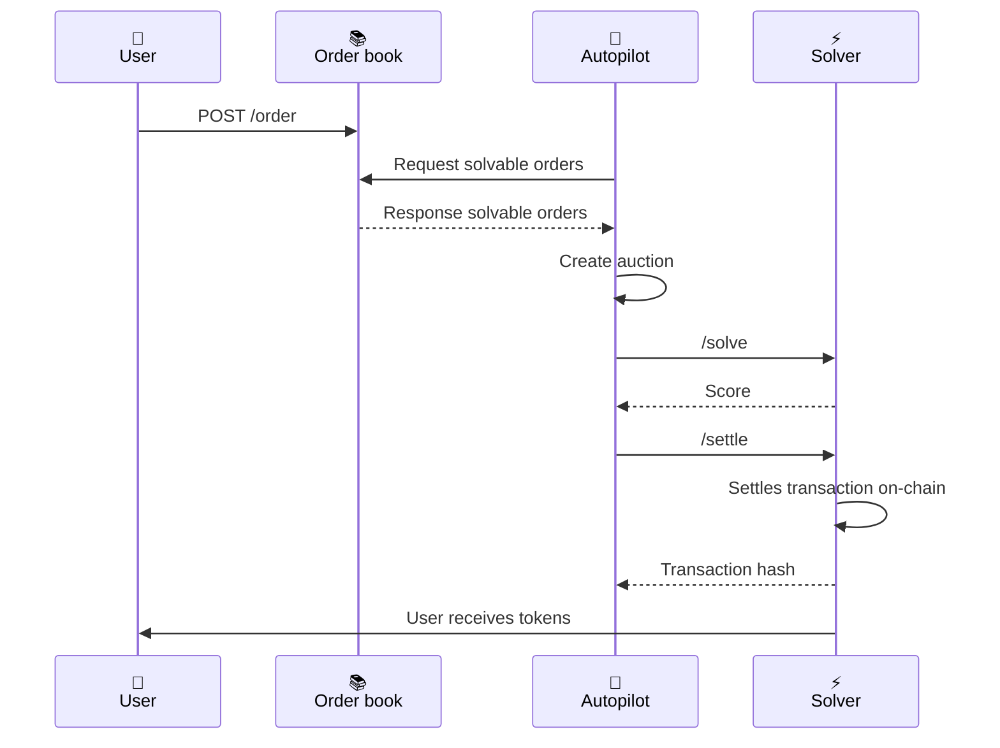
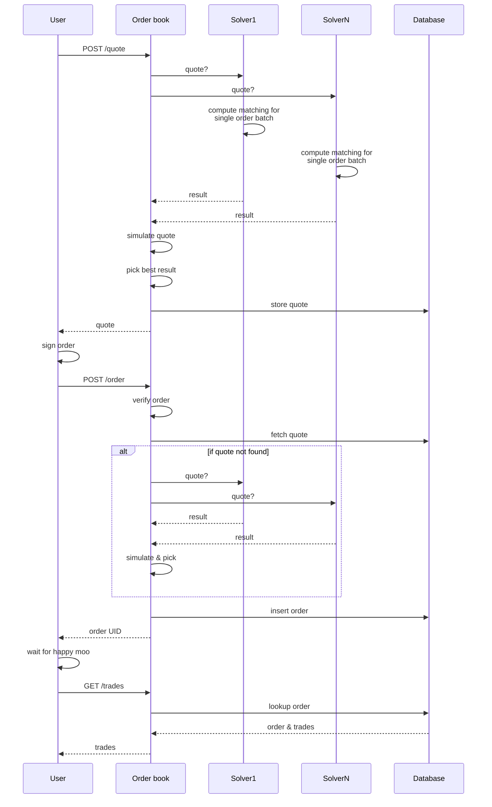
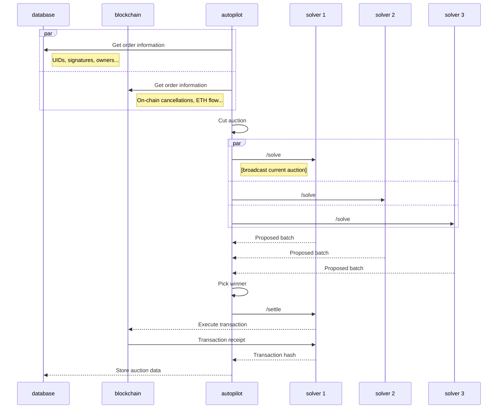
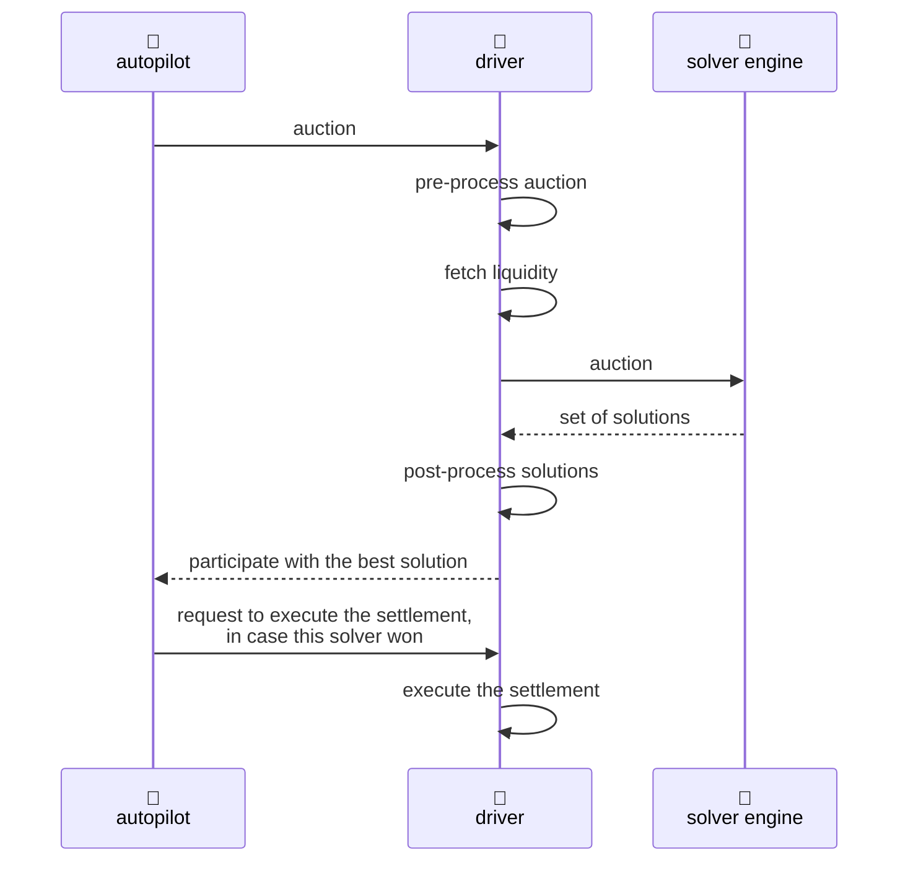

# CoW Protocol: Batch Auctions

**Автор:** [Алексей Куценко](https://github.com/bimkon144) 👨‍💻

Batch auctions (пакетные аукционы) - это ключевой механизм CoW Protocol, который обеспечивает справедливое ценообразование и защиту от MEV. В отличие от традиционных DEX, где каждая сделка обрабатывается отдельно, CoW Protocol группирует несколько intentions пользователей в пакеты и проводит аукцион между solvers за право их исполнить.

## Как работают Batch Auctions

Разберем верхнеуровнево архитектуру работы `batch auction`.



Эти три главные компонента требуются для функционирования аукциона.

**Order book** - это офф-чейн компонент с базой данных, через API которого размещают, отменяют и получают активные ордера. Он обеспечивает взаимодействие трейдеров, UI и других интерфейсов с CoW Protocol.

**Autopilot** - это офф-чейн сервис, который принимает ордера с `order book` и организует аукцион. Он отправляет всем solvers информацию об этом аукционе. Собирает оценки от solvers, и выбирает лучшего, которому поручает выполнить задачи. Если кто-то из solvers ведет себя нечестно, например, завышает оценку, система может наказать его через DAO.

**Solver** - независимые участники протокола, которые соревнуются за право исполнить пакет ордеров. Каждый solver анализирует полученный от Autopilot пакет intentions, ищет оптимальные пути исполнения и даёт оценку для Autopilot.

Для большего понимания рассмотрим каждого участника системы более детально.

## Orderbook

По сути это офф-чейн сервис [CRUD](https://en.wikipedia.org/wiki/Create,_read,_update_and_delete) стейта, который состоит из API и базы данных. Код можно посмотреть [тут](https://github.com/cowprotocol/services/tree/main/crates/orderbook).

Orderbook является **главной точкой входа** в протокол. Через его API пользователи, UI и другие интеграции могут:

- Получать котировки для ордеров (`post/quote`)
- Размещать ордера (`post/orders`)
- Отменять ордера (`delete/orders`)
- Получать информацию о текущем решенном аукционе
- Отслеживать статус своих ордеров

Полный список [API](https://docs.cow.fi/cow-protocol/reference/apis/orderbook).

Схему взаимодействия `orderBook` можно рассмотреть ниже:



Можно разбить на 3 этапа: Получение котировки (quote), размещение ордера и обработка и мониторинг ордера.

### Получение котировки

1. `User → Order book: POST /quote`
   Пользователь отправляет запрос котировки с параметрами сделки, чтобы понять, сколько токенов он получит при обмене.

2. `Order book → Solver1/SolverN: quote?`
   Orderbook запрашивает solvers для решения `batch` с одним ордером, и solvers возвращают свои предложения.

3. `Order book → Order book: simulate & pick best result`
   Orderbook симулирует котировки и выбирает лучшую, максимизирующую output для трейдера, затем сохраняет её в базе данных.

4. `Order book → User: quote`
   Возвращает котировку трейдеру для подписи.

### Размещение ордера

1. `User → Order book: sign & POST /order`
   Пользователь подписывает ордер офф-чейн и отправляет его в Order book для включения в следующий batch.

2. `Order book → Order book: verify order & fetch quote`
   Order book проверяет валидность ордера (формат, балансы, подпись, appData) и ищет соответствующую котировку для классификации. Если котировка не найдена, создается новая.

3. `Order book → Database → User: insert order & return UID`
   Order book сохраняет валидированный ордер в базе данных для autopilot и возвращает уникальный идентификатор пользователю.

### Обработка и мониторинг ордера

1. `User → User: wait for happy moo`
   Пользователь ждет исполнения ордера. Теперь очередь autopilot и solvers распределить и исполнить ордер ("happy moo" = успешное исполнение в стиле CoW).

2. `User → Order book: GET /trades`
   После исполнения пользователь запрашивает информацию о выполненной сделке.

3. `Order book → Database → User: lookup & return trades`
   Order book ищет информацию об ордере в базе данных и возвращает пользователю данные о выполненной сделке и результатах solver competition.

## Autopilot

Код офф-чейн сервиса можно посмотреть [тут](https://github.com/cowprotocol/services/tree/main/crates/autopilot)

### Когда создаются новые аукционы

Autopilot работает постоянно и запускает новый аукцион в трех случаях. Первый - когда пользователи создают, отменяют или меняют свои ордера. Второй - когда в блокчейне появляется новый блок и может поменяться состояние сети. Третий - если прошло больше 2 секунд с момента последнего блока и система решает проверить обновления.

Такая логика нужна, чтобы не создавать пустые аукционы без изменений. На каждый аукцион solvers получают 15 секунд.

После выбора победителя у solver есть ограниченное время отправить транзакцию в сеть. Если solver не отправляет транзакцию в течение этого времени, то ордера возвращаются в следующий аукцион.

### Детальная диаграмма работы Autopilot



Процесс работы можно разбить на 3 этапа: сбор данных, формирование аукциона, соревнование solvers и исполнение.

### Сбор данных об ордерах

1. `Autopilot → Database & Blockchain: Get order information`
   Autopilot запрашивает информацию из общей базы данных с Orderbook (UIDs, офф-чейн подписи, владельцы) и мониторит блокчейн:
   - **Pre-signatures**: отслеживает события `PreSignature` когда пользователи подписывают ордера on-chain через функцию `setPreSignature`
   - **Отмены ордеров**: мониторит события `OrderInvalidated` при вызове функции `invalidateOrder`
   - **ETH flow**: мониторит события ETH Flow контракта - когда пользователи создают новые ордера с использование нативного токена сети.

2. `Autopilot → Autopilot: Cut auction`
   Autopilot формирует пакет аукциона из всех торгуемых ордеров. Далее сервис получает цены на эти токены в ETH из множественных источников (solvers, Paraswap, 1inch, Uniswap pools). Эти цены включаются в пакет аукциона, чтобы solvers имели одинаковую цену токенов и также для упрощения перевода в `scores` по единым ценам в ETH. Если цену токена в ETH получить нельзя, ордер исключается. По сути это как ценовой оракул для всех solvers.
   Далее, фильтрует ордера которые не могут быть исполнены: просроченные, с недостаточным балансом для fill-or-kill, без approve на контракт через который будет происходить трейд, с неподдерживаемыми токенами, с невалидными ERC-1271 подписями.

### Соревнование solvers

1. `Autopilot → Solver1/2/3: /solve`
   Autopilot рассылает пакет аукциона всем зарегистрированным solvers. Solvers имеют ограниченное время (по умолчанию 15 секунд, настраивается через `solve_deadline` в конфигурации Autopilot) для анализа аукциона и возврата решения. Это ограничение для поддержания быстрых циклов аукционов.

2. `Solver1/2/3 → Autopilot: Proposed batch`
   Solvers анализируют аукцион и возвращают свои предложения с рассчитанными `scores`, которые представляют качество решения.

3. `Autopilot → Autopilot: Pick winner`
   При выборе победителя Autopilot делает дополнительные проверки и фильтрацию решений для обеспечения честности. Подробнее об этой системе фильтрации смотреть раздел "Расчет Score и алгоритм выбора победителей".

### Исполнение и завершение

1. `Autopilot → Winner: /settle`
   Autopilot уведомляет победителя о необходимости исполнить решение. Solver отвечает за исполнение транзакции on-chain.

2. `Winner → Blockchain → Autopilot: Execute & report`
   Solver исполняет транзакцию в блокчейне и сообщает hash транзакции Autopilot.
3. `Autopilot → Database: Store auction data`
   Autopilot сохраняет все данные аукциона: предложения от solvers, scores, surplus fees для limit ордеров, результаты on-chain исполнения. Эти данные используются для расчета solver payouts. Некорректное поведение solvers выявляется на этапе расчета выплат.
   
По сути, Autopilot играет роль судьи в соревновании между solvers. Он определяет правила игры для каждого раунда - какие ордера участвуют, по каким ценам считать результат. При этом система построена на умном балансе между скоростью и безопасностью: solvers могут быстро соревноваться и исполнять решения, а проверка честности происходит на этапе выбора победителя, а так же после завершения аукциона. Это похоже на спортивные соревнования, где судья фиксирует результаты в реальном времени, а детальный анализ и возможные санкции проводятся позже. Такой подход позволяет протоколу работать с высокой скоростью, не жертвуя при этом надежностью.

## Solvers

Solvers представляет из себя off-chain сервис из двух компонентов: driver и solver engine.



**Driver** - координирует работу solver: получает аукцион от Autopilot, подготавливает данные для Engine, обрабатывает решения, оценивает, отправляет решение в autopilot и исполняет их в блокчейне. Есть [открытый исходный код](https://github.com/cowprotocol/services/tree/main/crates/driver).

**Solver Engine** - реализует алгоритмы сопоставления ордеров для поиска оптимальных решений. Получает данные от Driver, находит лучшие пути исполнения и возвращает инструкции для достижения результата в блокчейне. Различные solvers с открытым исходным кодом доступны в [CoW Protocol solvers](https://github.com/cowprotocol/services/tree/main/crates/solvers). Но для того чтобы выиграть аукцион, команды разрабатывают свои собственные супер оптимизированные алгоритмы с приватной ликвидностью `solver engine`.

Работу solver можно разбить на 4 этапа: подготовительная фаза, фаза решения, финализация и участие, исполнение (если solver победил).

### Детальная схема работы Solver

#### Подготовительная фаза

1. `Autopilot → Driver: auction`
   Autopilot отправляет новый аукцион всем зарегистрированным solvers. Driver получает "сырой" аукцион с минимальным набором данных.

2. `Driver → Driver: pre-process auction`
   Driver обогащает аукцион дополнительной информацией: метаданные токенов (decimals, symbols), фильтрует невыполнимые ордера (недостаточные балансы, истекшие), делает базовую приоритизацию.

3. `Driver → Driver: fetch liquidity`
   Driver собирает актуальные данные о ликвидности из кешированных источников: AMM пулы (Uniswap, Balancer, Curve), агрегаторы, частные источники ликвидности команды.

#### Фаза решения

4. `Driver → Engine: auction`
   Driver передает полностью подготовленный аукцион в Solver Engine со всей необходимой информацией для принятия решений.

5. `Engine → Driver: set of solutions`
   Solver Engine анализирует аукцион своими алгоритмами и возвращает набор возможных решений с их оценками качества.

#### Финализация и участие

6. `Driver → Driver: post-process solutions`
   Driver проверяет корректность решений, симулирует их исполнение, объединяет совместимые решения для повышения эффективности, делает расчет score и выбирает лучшее решение для участия.

7. `Driver → Autopilot: submit solution`
   Driver отправляет лучшее решение с рассчитанным score:

   ```rust
   // https://github.com/cowprotocol/services/blob/main/crates/driver/src/infra/api/routes/solve/dto/solve_response.rs
   pub struct Solution {
      solution_id: u64,              // Уникальный ID решения
      score: eth::U256,             //  Оценка решения пакетного аукциона
      submission_address: eth::H160, // Адрес solver для исполнения
      orders: HashMap<OrderId, TradedOrder>, // Исполненные ордера с деталями
      clearing_prices: HashMap<eth::H160, eth::U256>, // Цены исполнения, предлагаемые solver
   }
   ```

8. `Autopilot → Driver: execute settlement (if winner)`
   При победе в аукционе Driver исполняет решение on-chain.

Архитектура разделяет ответственность: Driver обеспечивает интеграцию с протоколом, Engine реализует алгоритмы сопоставления.

## Расчет score и алгоритм выбора победителей

### Расчет score

Ключевой механизм конкуренции между solvers это расчет `score` (оценки качества) решений, который определяет победителя аукциона.

Формула расчета Score согласно [CIP-38](https://forum.cow.fi/t/cip-38-solver-computed-fees-rank-by-surplus/2061) и [CIP-65](https://forum.cow.fi/t/cip-65-updating-score-definition-for-buy-orders/2930)

```
Score = (User Surplus + Protocol Fees) в ETH
```

**Для sell ордера:**
```
score = (surplus + protocol_fees) × native_price_buy_token
# surplus для sell ордера уже в buy токене
```

**Для buy ордера:**
```
score = (surplus + protocol_fees) × p_limit × native_price_buy_token
где p_limit = limit_buy_amount / limit_sell_amount
```

> **Объяснение:** Для buy ордеров surplus находится в sell токене, поэтому сначала конвертируем его в buy токены через лимитное отношение p_limit, а затем в ETH через native_price_buy_token.

Где:
- `surplus` - дополнительная стоимость, которую получает пользователь сверх лимитной цены
- `protocol_fees` - комиссии протокола
- `native_price_buy_token` - цена покупаемого токена в ETH (цена из аукциона)

**Пример расчета для sell ордера:**
```
Sell ордер: продать 1 ETH за USDC
- Лимитная цена: 1 ETH = 2000 USDC
- Фактическое исполнение: 1 ETH = 2050 USDC
- User surplus: 2050 - 2000 = 50 USDC (surplus в buy токене)
- Protocol fees: 5 USDC
- Цена USDC: 0.0004 ETH

Score = (50 + 5) × 0.0004 = 0.022 ETH
# Используем цену USDC, так как surplus и fees в USDC (buy токен)
```

**Пример расчета для buy ордера:**
```
Buy ордер: купить 100 USDC за DAI
- limit_buy_amount: 100 USDC
- limit_sell_amount: 102 DAI (готов заплатить максимум)
- executed_sell_amount: 98 DAI (заплатил фактически)
- executed_buy_amount: 100 USDC (получил)

1. Surplus в sell токене: 102 - 98 = 4 DAI
2. Protocol fees: 0.5 DAI
3. p_limit = 100 USDC / 102 DAI = 0.98 USDC/DAI
4. Цена USDC: 0.0004 ETH

Score = (4 + 0.5) × 0.98 × 0.0004 = 0.001764 ETH
# Используем цену USDC, так как конвертируем итоговый surplus в USDC (buy токен)

Пошагово:
- 4.5 DAI surplus конвертируется в buy токены: 4.5 × 0.98 = 4.41 USDC
- 4.41 USDC конвертируется в ETH: 4.41 × 0.0004 = 0.001764 ETH
```

**Реализация функции расчета score:**

```rust
// https://github.com/cowprotocol/services/blob/main/crates/driver/src/domain/competition/solution/scoring.rs
fn score(&self, native_prices: &auction::Prices) -> Result<eth::Ether, Error> {
    let native_price_buy = native_prices
        .get(&self.signed_buy.token)
        .ok_or(Error::MissingPrice(self.signed_buy.token))?;

    let surplus_in_surplus_token = self
        .user_surplus()?
        .0
        .checked_add(self.fees()?.0)
        .ok_or(Error::Math(Math::Overflow))?;

    let score = match self.side {
        // surplus для sell ордеров уже в buy токенах, просто конвертируем в ETH
        Side::Sell => native_price_buy.in_eth(eth::TokenAmount(surplus_in_surplus_token)),
        
        Side::Buy => {
            // surplus для buy ордеров в sell токенах. Конвертируем в buy токены:
            // buy_amount = surplus * buy_price / sell_price
            let surplus_in_buy_tokens: eth::U256 = surplus_in_surplus_token
                .full_mul(self.signed_buy.amount.0)         // surplus * buy_price  
                .checked_div(self.signed_sell.amount.0.into())  // / sell_price
                .ok_or(Error::Math(Math::DivisionByZero))?
                .try_into()
                .map_err(|_| Error::Math(Math::Overflow))?;

            // Затем конвертируем buy токены в ETH
            native_price_buy.in_eth(surplus_in_buy_tokens.into())
        }
    };
    Ok(score)
}
```

### Алгоритм выбора победителей

После получения решений от всех solvers, Autopilot запускает многоэтапный процесс отбора с независимой верификацией score:

**1. Пересчет Score для верификации**
Autopilot независимо пересчитывает score для каждого решения, используя те же цены токенов из аукциона (а не текущие рыночные цены). Решения, для которых не удается пересчитать score, автоматически отбрасываются.

**2. EBBO проверка честности (Equal or Better than Best Offer)**
Проверяется, что цены в решении не хуже лучших предложений на источниках ликвидности (Uniswap, Sushiswap, Balancer и др.). Решения, нарушающие EBBO, отбрасываются как "unfair".

**3. Сортировка и выбор победителя**
Выбирается решение с наивысшим пересчитанным score.

**Реализация логики выбора победителей:**

```rust
// https://github.com/cowprotocol/services/blob/main/crates/autopilot/src/domain/competition/winner_selection/combinatorial.rs
fn partition_unfair_solutions(&self, mut participants: Vec<Participant<Unranked>>, 
                             auction: &domain::Auction) -> PartitionedSolutions {
    // ПЕРЕСЧЕТ SCORE в autopilot для верификации!
    let scores_by_solution = compute_scores_by_solution(&mut participants, auction);
    
    // Сортировка по ПЕРЕСЧИТАННОМУ score
    participants.sort_by_key(|participant| {
        std::cmp::Reverse(participant.solution().computed_score().expect("computed").get().0)
    });
    
    // Fairness check с baseline scores (EBBO)
    let baseline_scores = compute_baseline_scores(&scores_by_solution);
    let (fair, unfair) = participants.into_iter().partition_map(|p| {
        if aggregated_scores.iter().all(|(pair, score)| {
            baseline_scores.get(pair).is_none_or(|baseline| score >= baseline)  // EBBO check
        }) {
            Either::Left(p)   // Fair solution
        } else {
            Either::Right(p)  // Unfair solution - отбрасывается
        }
    });
    
    PartitionedSolutions { kept: fair, discarded: unfair }
}
```

Система обеспечивает честность через три уровня правил: smart contract, off-chain протокол (Autopilot) и social consensus (governance со штрафами).

## Заключение

Batch auctions в CoW Protocol представляют собой сложную, но эффективную систему для справедливого исполнения торговых намерений. Трехуровневая архитектура (Orderbook, Autopilot, Solvers) обеспечивает оптимальное сочетание скорости, безопасности и эффективности.

Ключевые преимущества системы:
- **Справедливое ценообразование** через единые clearing prices
- **Защита от MEV** благодаря пакетной обработке
- **Конкуренция между solvers** за лучшие результаты для пользователей
- **Прозрачность** через независимую верификацию и EBBO проверки

Эта архитектура делает CoW Protocol уникальным решением в мире децентрализованной торговли, где интересы пользователей защищены на каждом уровне системы.

## Ссылки

- [CoW Protocol Documentation](https://docs.cow.fi/)
- [Orderbook API Reference](https://docs.cow.fi/cow-protocol/reference/apis/orderbook)
- [Autopilot Source Code](https://github.com/cowprotocol/services/tree/main/crates/autopilot)
- [Driver Source Code](https://github.com/cowprotocol/services/tree/main/crates/driver)
- [CIP-38: Solver Computed Fees](https://forum.cow.fi/t/cip-38-solver-computed-fees-rank-by-surplus/2061)
- [CIP-65: Score Definition Update](https://forum.cow.fi/t/cip-65-updating-score-definition-for-buy-orders/2930)