# MEV Blocker

**Автор:** [Алексей Куценко](https://github.com/bimkon144) 👨‍💻

[MEV Blocker](https://cow.fi/mev-blocker) совместный продукт [CoW DAO](https://forum.cow.fi/?utm_source=cow.fi&utm_medium=web&utm_content=link), [Beaver Builder](https://beaverbuild.org/) and [Gnosis DAO](https://www.gnosis.io/) который обеспечивает не только защиту транзакций от вредных MEV и но и привносит полезный MEV в виде `back-running`, который позволяет юзеру получить дополнительный доход в сети Ethereum.

Что такое MEV?

**MEV (Maximal Extractable Value)** - это механизм, на котором строиться процесс выбора транзакций и добавления их в блок. И принцип заключается в том, что валидаторы или блок-билдеры в стремление заработать максимальную прибыль за построение блока, добавляют в первую очередь транзакции, в которых предлагается больше газа за работу. Так как газ для валидаторов это параметр в транзакции и подписывающий транзакцию может управлять этим параметром, то возникает возможность управлять порядком исполнения своей транзакции. Именно отсюда возникают четыре основных типа MEV-манипуляций, описанных ниже.

Для того, чтобы понять как работает `Mev Blocker`, узнаем какие бывают MEV и посмотрим какой путь проходят транзакции от пользователей в блокчейне Ethereum.

Можно выделить четыре основных типа MEV:

**Front-running:**

Бот видит транзакцию жертвы в `mempool` (до того как она попадет в блок), и проводит свою транзакцию раньше транзакции жертвы.
Например: Вы хотите купить токен по определенной цене, закидываете транзакцию. В этот момент бот видит, что ваша покупка сдвигает цену токена и опережает вас. Таким образом вы покупаете токен дороже.

**Back-running**

Бот видит, что какая-то сделка сейчас произойдёт (например, большая покупка токена), и сразу после неё делает свою транзакцию, чтобы извлечь выгоду от изменений на рынке.
Например: бот видит, что сейчас начнет торговаться токен, его цена линейно растет, и бот хочет купить максимально первым этот токен после старта продаж.

**Sandwich attack**

Бот вставляет две свои транзакции - одну до твоей и одну после. Первая толкает цену вверх, ты покупаешь по завышенной цене, а затем бот сливает обратно по более высокой цене.
Пример: ты хочешь купить токен, бот сначала покупает сам, потом даёт тебе купить дороже, потом сразу же продаёт.

**Бандит-атака**

Валидатор видит прибыльную пользовательскую транзакцию и вместо её включения в блок выполняет аналогичную транзакцию от своего имени, получая всю прибыль себе.
Например: валидатор видит арбитражную возможность в твоей транзакции и копирует её, но выполняет от себя, получая весь профит. Риск такой стратегии — возможное наказание (слэшинг) за нечестное поведение, если это будет обнаружено.

Все эти атаки возможны только потому, что мемпул открыт, и боты могут шпионить за твоими транзакциями.
MEV это не гипотетическая угроза, а регулярная эксплуатация пользователей: ежедневно тысячи транзакций теряют деньги из-за того, что информация о них заранее известна ботам в открытом мемпуле. Пользователи теряют огромное количество денег.

Для понимания величины проблемы, следует взглянуть на статистику за 7 дней sandwich атак на момент написания статьи.

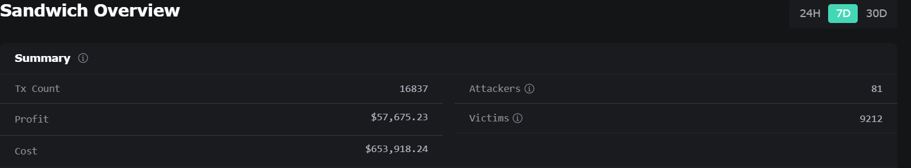

- **16,837 транзакций** подверглись атакам
- **$653,918** общих потерь пользователей (например, переплата из-за завышенных цен)
- **$57,675** прибыли атакующих ботов
- **81 бот** атаковал **9212 пользователей**
- Пользователи теряют в **11 раз больше**, чем зарабатывают боты

Актуальную подробную статистику можно посмотреть [тут](https://eigenphi.io/mev/ethereum/sandwich).

### Как работает сборка блоков в Ethereum

После перехода Ethereum на Proof-of-Stake и внедрения модели [Proposer-Builder Separation](https://ethereum.org/en/roadmap/pbs/) (PBS)
сборка блоков выглядит так:

1. **User** подписывает транзакцию своим приватным ключом и отравляет через JSON-RPC к ноде.
2. В первую очередь, транзакция попадает в так называемый `mempool`. Кто угодно может видеть детали этих транзакций.
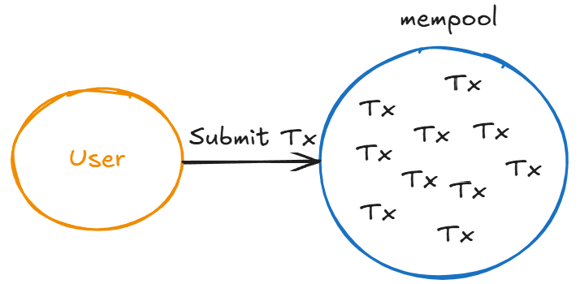
3. **Searchers** - боты которые сканируют публичный `mempool`, находят возможности для `MEV` и упаковывают свои сделки в `Bundles` (Это пакет из транзакций который позволит получить профит). `Searchers` так же могут добавить последней транзакцией в `Bundle` взятку, чтобы  `Builder` включил этот `Bundle` в блок.
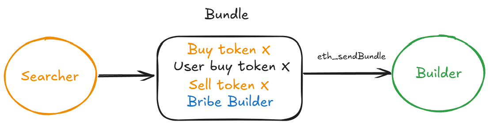
4. **Builders** - сущности, которые собирают блок. Они включают в него `Bundles`, полученные от `Searchers`, а также добавляют обычные транзакции из публичного мемпула. Их цель — собрать блок с максимальной block value — то есть с максимальной суммарной выгодой от MEV, priority fees (чаевых от пользователей), арбитража и других источников.
Они также устанавливают поле `feeRecipient` на свой адрес — это означает, что они получат и `bribes` от `Searchers`, и все priority fees (чаевые), указанные пользователями в транзакциях. В конце блока Builder добавляет специальную транзакцию, выступающую в роли взятки для `Proposer` — по аналогии с тем, как `Searcher` платит `Builder`.
_Важно! Builders — это внешние сущности, они не взаимодействуют с блокчейном напрямую._
5. **Relay** - промежуточные сущности между `Builders` и `Proposers`. Поскольку рынок `Builders` конкурентный (каждый хочет, чтобы его блок попал в цепочку и принёс доход), `Relays` помогают `Proposers` выбрать лучший блок. Они принимают блоки (payloads) от разных `Builders`, валидируют их, и передают `Proposer` только тот, в котором наибольшая выплата (максимальный bid).
Чтобы Proposer не смог увидеть полезную информацию из блока и украсть её, используется механизм, похожий на `Commit-Reveal`. `Relay` сначала показывает только заголовок блока и обещанную выплату, а сам блок раскрывает уже после согласия `Proposer`. Таким образом, если `Proposer` попытается схитрить и не использовать согласованный блок, а создать свой, подпись, которую он отдал в `Relay`, станет доказательством нарушения и соответственно поводом наказания или отключение `Proposer` от работы.

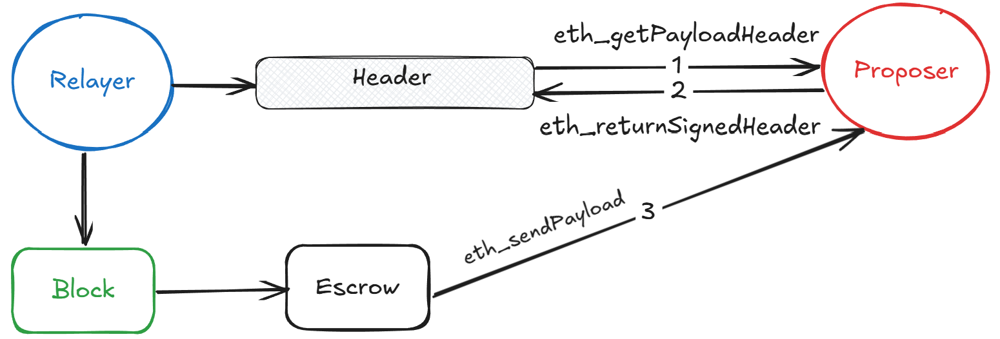

Хотя Builders строят много блоков, в реальности почти все финализированные блоки собираются несколькими крупными игроками, вроде BeaverBuild, BuilderNet и Titan Builder.
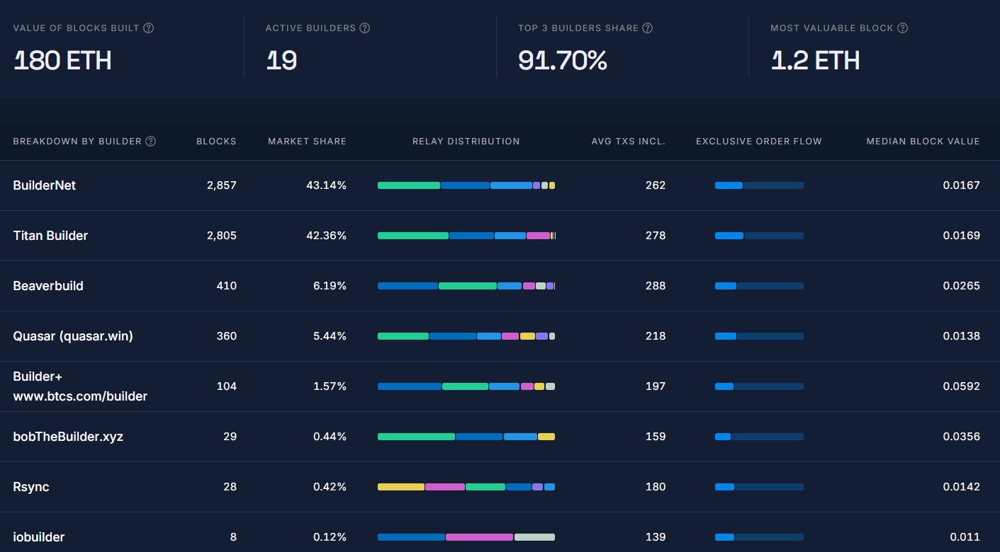

Детально можно посмотреть статистику [тут](https://explorer.rated.network/builders?network=mainnet&timeWindow=1d&page=1).

Получается, что `Relays` берут на себя роль "доверенного посредника", чтобы упростить выбор блока и защитить интересы всех участников. Статистику по `Relays` можно глянуть [тут](https://explorer.rated.network/relays?network=mainnet&timeWindow=30d).

И если собрать все вместе:
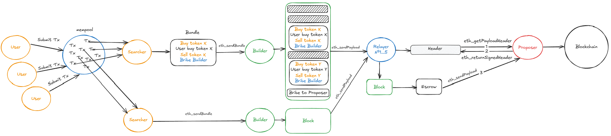

### Как работает Mev Blocker

Разобрав, как транзакция попадает в блок, мы можем посмотреть, куда в этой истории встраивается Mev Blocker.

Главная фишка `Mev Blocker`, помимо того, что он защищает от mev атак, это то, что он распределяет потенциальную прибыль от mev(back-running) между `User`(90%) и `Builder` (10%). Таким образом пользователь получает выгоду которую за него мог получить какой-то бот.

1. **Users** отправляют транзакции через подключенный кошелек к [RPC](https://cow.fi/mev-blocker#rpc) от `Mev Blocker`.
2. `Mev Blocker RPC` принимает транзакции. Таким образом, вместо того чтобы попадать в публичный `mempool`, они попадают в данный сервис.
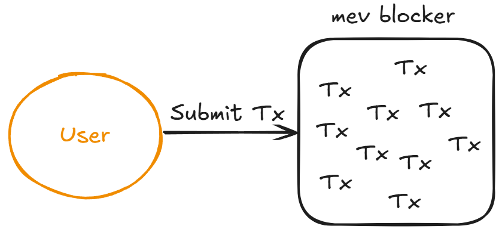
3. `Mev Blocker` отделяет подписи юзеров от транзакции и генерирует через AI феиковую информацию о транзакциях (`Tx info`).
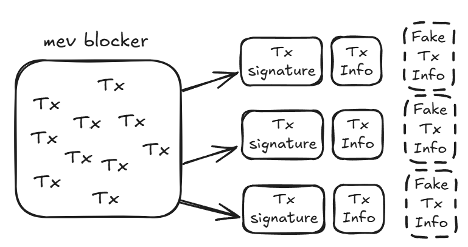
    Для чего добавляеются феиковые данные о транзакциях? Все просто, чтобы `Searchers`, которые имеют информацию о транзакциях, не пытались обмануть систему. Имея доступ к данным, они могли бы совершать `probabilistic MEV`, это когда ты зарабатываешь, просто угадывая, что произойдет.

    Например: Берем инфу из `Tx info` которая всем доступна, пытаемся обогнать юзера напрямую в публичном мемпуле. То есть использовать знания о реальных сделках и не играть по правилам `mev blocker`.

    Также, помимо того, что делает `Mev Blocker`, существует дополнительная механика защиты пользователей:
    - Например, в случае свопов MEV Blocker удаляет некоторые данные slippage, чтобы предотвратить `Sandwich attack`.
    - Если транзакция слабо подходит для back-running (т.е. на ней вряд ли можно заработать), MEV Blocker вообще не передаёт ее `Searchers`.
4. `Mev Blocker` делится `Tx info` со всеми `Searchers` через [websocket](https://docs.cow.fi/mevblocker/searchers/listening-for-transactions).
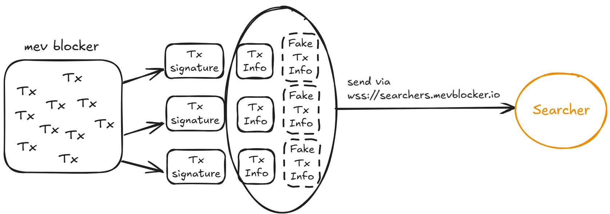

5. `Searchers` собирают `Tx info` в `Bundle`, включая туда свои транзакции чтобы получить максимальную выгоду для юзера через `back-running` и отдают обратно в `Mev Blocker`.
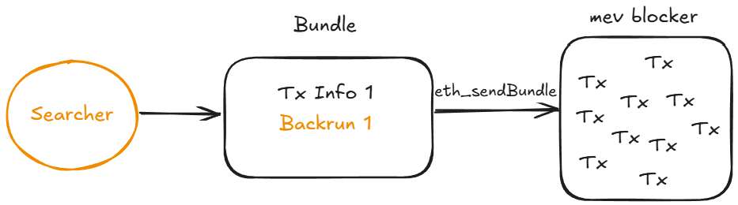
Отправка `Bundle` происходит через тот же вебсокет `wss://searchers.mevblocker.io` через метод `eth_sendBundle`.

Данные отправки выглядят так:
```json
{ 
    "jsonrpc": "2.0", 
    "id": 1, 
    "method": "eth_sendBundle", 
    "params": 
        [ 
            { "txs": [ // this is the 32-byte transaction hash of the target transaction "0xfec1700ef24c9ff6fd2e07584a16bbb2fec1700ef24c9ff6fd2e07584a16bbb2", // this is your signed encoded transaction "0xabc123.." ], 
            "blockNumber": "0xb63dcd", 
            "minTimestamp": 0,
            "maxTimestamp": 1615920932 
            } 
        ] 
}
```

  Есть определенный правила, как нужно собирать `Bundle`:
    - Первой элементом в массиве `txs` всегда должен идти хеш транзакции пользователя. Это нужно чтобы `mev blocker` смог потом понять, какую транзакцию мы обрабатываем. А вторым уже идёт транзакция с учетом `back-running`.
    - `Back-run` транзакция обязательно должна включать `bid` — ставку в виде ETH, которую ты платишь за включение бандла (Чем выше ставка среди других `Searchers`, тем больше шансов что именно твой `Bundle` включат в блок). Это по сути и есть MEV-прибыль, которая делится между `User` и `Builder/Proposer/Validator`.
    - Может быть только один хеш транзакции пользователя на один `Bundle`.

6. `Mev Blocker` получают через вебсокет все `Bundles` от `Searchers`, выбрасывает все феиковые `Tx info` и добавляет сигнатуры юзеров к их `Tx info`. После этого, `Builders` отбирает `Bundles` с наибольшими `bids` (профитом для юзеров) и собирает в блок. `Builder` обязан вернуть на `tx.origin` 90% от суммы `bids` в том же блоке.
Таким образом, происходит аукцион по ставкам, где победителем выбирается тот, кто предоставит `Bundle` с наибольшей прибылью для пользователей (bid) (А не тот, кто заплатит высокую взятку `Builder`, как это работает в Ethereum).
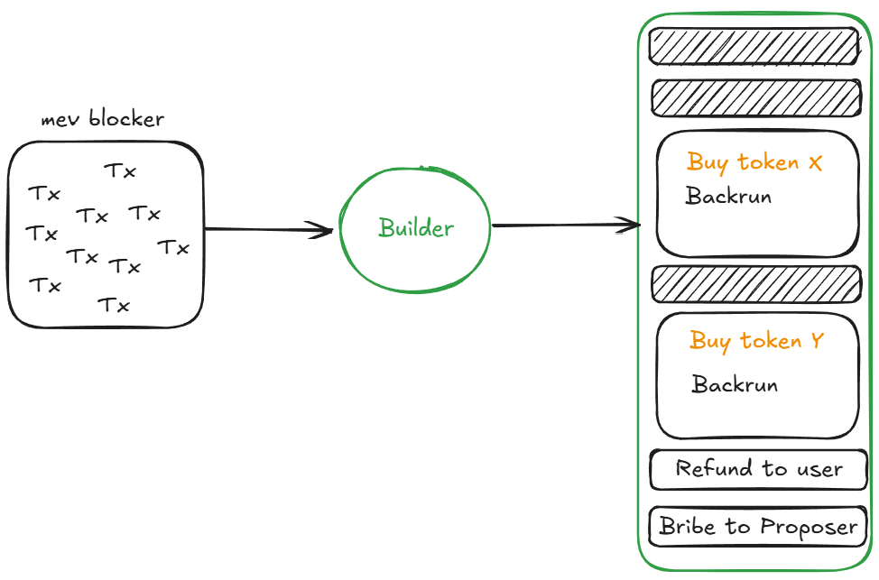
_Если симуляция самого прибыльного `Bundle` не проходит, то `Builder` может выбрать `Bundle` второй по списку прибыльности (bid). Таким образом `User` всегда получает максимально возможную прибыль, а транзакция не задерживается._
7. `Block Builders` отправляют собранные блоки через `Relayer` на `Proposers/Validators`.
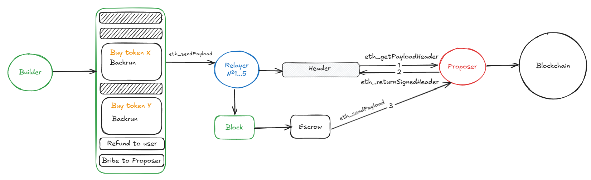

Общая схема работы выглядит так:
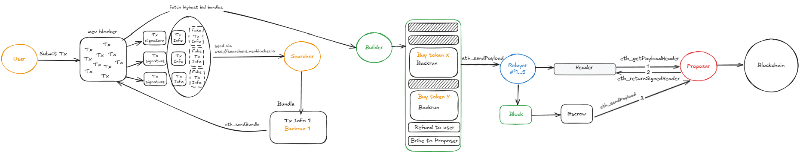

В стандартной архитектуре Ethereum, как только пользователь отправляет транзакцию через RPC, она сразу попадает в публичный `mempool`, где становится видна всем — в первую очередь ботам (`Searchers`). Это открывает дверь для вредного MEV. `Searchers` формируют бандлы, которые часто направлены против пользователя, максимизируя их собственную выгоду, а не выгоду отправителя транзакции.

С `MEV Blocker` всё наоборот. Транзакции не попадают в публичный `mempool`, а обрабатываются через приватный RPC. Информация о них  анонимизируется. А так же добавляются дополнительные феиковые данные о транзакциях, чтобы исключить возможность эксплойтов. Searchers получают только частичные данные (Tx info) и соревнуются за то, чтобы найти наиболее выгодный back-running сценарий - при этом прибыль возвращается пользователю (90%), а не оседает у ботов. Выигрывает тот, кто приносит больше пользы пользователю.

### Как стать участником

**User**: Просто подключи RPC-endpoint MEV Blocker в свой кошелек (например, MetaMask) и ты автоматически получаешь защиту от MEV и профит от back-running возможностей. Некоторые Dapps просят подключиться к `Mev Blocker` RPC.

**Searcher**: Подключись к [WebSocket](https://docs.cow.fi/mevblocker/searchers/listening-for-transactions) потоку MEV Blocker. Собирай `bundles` по своей стратегии с back-running возможностями и отправляй обратно на `Mev Blocker` согласно [правилам](https://docs.cow.fi/mevblocker/searchers/bidding-on-transactions).

**Builder**: Внести депозит 10 ETH через [смарт-контракт](https://etherscan.io/address/0x08cd77feb3fb28cc1606a91e0ea2f5e3eaba1a9a#writeContract) 10 ETH (они будут как залог, который могут использовать в случае нарушения работы или правил).

Соблюдайте [правила](https://docs.cow.fi/mevblocker/builders/rules), такие как:
- Собирать 1% блоков каждую неделю, либо могут отключить от системы.
- Не использовать приватные данные для фронтрана или сэндвича. Абсолютный запрет на вредоносные MEV-стратегии.
- Регулярно платить комиссии через смарт-контракт в течение 24 часов после счета, иначе отключение (переподключение стоит 2 ETH)
- Не создавать `shadow builders`. Нельзя маскироваться под другого `Builder`, чтобы обойти комиссию.

Детали о том как подключаться, платить, или выходить из участиков `Builders` через [контракт](https://github.com/cowprotocol/mev-blocker-till), можно почитать [тут](https://docs.cow.fi/mevblocker/builders/fees/fee-management-smart-contract).

### Экономика

Система `MEV Blocker` строится на прозрачной и сбалансированной модели стимулов, где каждый участник получает свою долю от выявленного MEV (back-running). Стоит детальнее рассмотреть чтобы понимать что поддерживает работу всех компонентов.

**Users**:
Получают 90% от прибыли back-running операций, в которых участвует их транзакция. Возрат средств идет в том же блоке на адрес `tx.origin`.
_При отправке через мануальный запрос, например через какой-то backend RPC запрос, возможно выставить получателя профита другой адрес._

**Searchers**:
Получают разницу между фактической прибылью от `back-running` и суммой, которую они заявили как back-running profit (bid).
Например:  Фактическая прибыль может быть к примеру 1 ETH, а свое предложение (bid) в `Mev Blocker` они отправляют 0.9 ETH, что попытаться заработать 0.1 ETH.
Если неудачно посчитают или переоценят прибыль — могут потерять на `gas` или уступить другим `Searchers` на аукционе, которые дадут намного больше профита. Таким образом, они соревнуются между собой чтобы заработать максимульный профит юзеру.

**Block Builders**:  От общей суммы `bid` идут оставшися 10% идут `Builder`, где основная часть идет для спонсирования `Validator`, чтобы блоки были вставлены в блокчейн своевременно.

Тут следует упомянуть, что использование `Mev Blocker` для `Builders` не является бесплатным.

Как рассчитывается комиссия за "подписку" на `Mev Blocker`:

Каждую неделю система считает, сколько билдер собрал блоков и сколько MEV-транзакций включил через `Mev Blocker`.

На основе этого считается средняя ценность одного блока (M) по формуле:

**M** = (общая ценность приватных транзакций − публичные) / число собранных блоков.

Комиссия билдера = 50% * **M** * количество его блоков за неделю.

_Если билдер собрал меньше 1% всех блоков — он всё равно платит как будто собрал ровно 1%._
_Таким образом билдеру невыгодно собирать меньше 1% блоков, потому что в этом случае он всё равно платит комиссию как за полноценное участие._

_Публичные данные для расчета комиссии и выставления счета, берут из [Duna](https://dune.com/cowprotocol/mev-blocker). Они в свою очередь идут за счет использования [сервиса](https://github.com/cowprotocol/mevblocker-dune) через который принимаются `Bundles` от `Searchers`._

## Где используется

**Intent-Based DEXs (например, CoW Protocol)**
В таких протоколах пользователь не отправляет готовую транзакцию, а лишь формулирует намерение — например, обменять токен A на токен B.
С помощью MEV Blocker такие транзакции не попадают в публичный `mempool`, не поддаются вредной манипуляциям со стороны ботов, и при этом 90% возможной прибыли от backrun возвращается обратно пользователю. Если вспомнить, что такие протоколы работают на `solvers`, т.е участниках которые соревнуются, чтобы исполнить транзакции юзеров, то они могут дополнительно зарабатывать в роли `Searchers`, за счет разницы `bid` и фактической прибыли.

**Oracle Extractable Value (OEV)**
Оракулы, обновляющие ценовые фиды в публичном `mempool`, создают возможности для арбитража, которые моментально подбирают MEV-боты. При этом сам оракул не получает ничего.

Используя MEV Blocker, оракулы отправляют апдейты через приватный канал. `Searchers` конкурируют за возможность арбитража, но 90% полученной прибыли возвращается обратно самому оракулу.

**NFT minting**

Когда проект запускает новую NFT с публичным mint, начинается типичная история: газовые войны, `frontrunning`, `snipers`. Обычные пользователи оказываются в проигрыше.

MEV Blocker позволяет избежать всего этого. Минт проходит через приватный mempool, без гонки за gas, и без шансов для ботов пролезть вперёд.

## Заключение

Раньше вы просто отправляли транзакции — и даже не догадывались, что с каждой из них кто-то зарабатывает на вас: боты подглядывали за вашими действиями в `mempool`, запускали MEV-атаки, и в лучшем случае вы теряли немного на проскальзывании, в худшем — становились жертвой сэндвича.

Теперь всё иначе.

С MEV Blocker система не ворует, а делится:
вы получаете до 90% от прибыли, которую раньше забирали анонимные searcher-боты.

Каждая ваша транзакция - это не потенциальная потеря, а возможность получить прозрачный, автоматический "кэшбэк" от `back-running`.

Это инфраструктурный механизм, в котором back-running-доходы перераспределяются в пользу инициатора транзакции.

Вы продолжаете отправлять транзакции как раньше,
но теперь — благодаря `MEV Blocker` - 90% извлечённой MEV профита возвращается вам, а не остаётся у ботов.

Раньше: приватные `searchers` зарабатывали на вас.
Теперь: они зарабатывают для вас.

И да, чтобы участвовать — не нужно ничего, кроме подключения к RPC. Всё остальное делает инфраструктура. Добро пожаловать в честный MEV.

## Ссылки

- [MEV Blocker](https://cow.fi/mev-blocker)
- [Docs MEV Blocker](https://docs.cow.fi/mevblocker)
- [RPC-endpoints](https://docs.cow.fi/mevblocker/users-and-integrators/users/available-endpoints)
- [Connection by Searchers (WebSocket)](https://docs.cow.fi/mevblocker/searchers/listening-for-transactions)
- [Rules for Builders](https://docs.cow.fi/mevblocker/builders/rules)
- [Contract for Builders](https://etherscan.io/address/0x08cd77feb3fb28cc1606a91e0ea2f5e3eaba1a9a#writeContract)
- [MEV Blocker: Dune](https://dune.com/cowprotocol/mev-blocker)