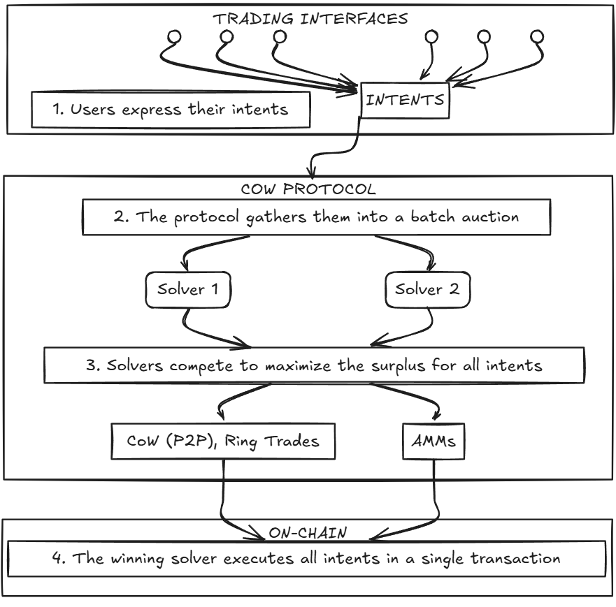
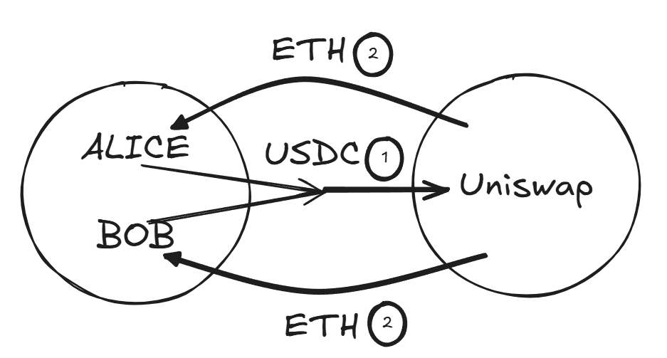
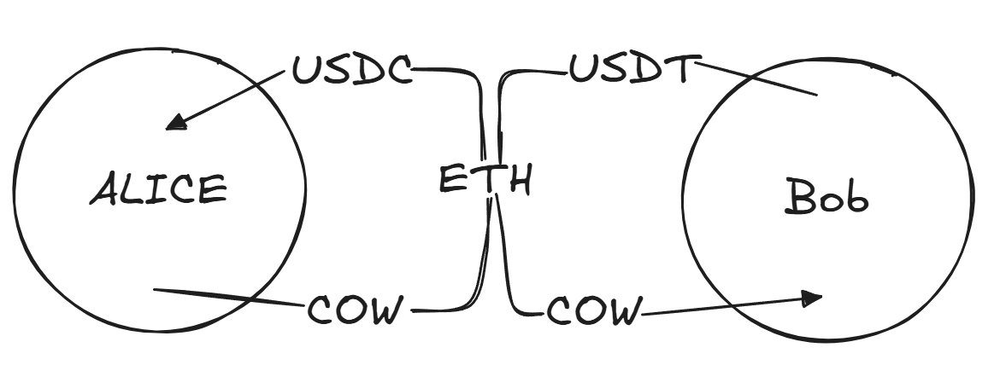

# CoW Swap

**Автор:** [Алексей Куценко](https://github.com/bimkon144) 👨‍💻

[CoW Protocol](https://cow.fi/cow-protocol) и его основной интерфейс [CoW Swap](https://swap.cow.fi/) - одна из самых интересных meta-DEX систем в экосистеме EVM. В данный момент протокол доступен на Ethereum, Gnosis Chain, Base и Arbitrum One.

В основе протокола лежит концепция CoW ([Coincidence of Wants](https://docs.cow.fi/cow-protocol/concepts/how-it-works/coincidence-of-wants), или "Совпадение Желаний"), которая позволяет трейдерам обмениваться токенами напрямую, без лишних посредников.

Представьте, что вы хотите продать ETH за USDC, а кто-то другой хочет продать USDC за ETH. В обычном DEX каждый из вас заплатил бы комиссию за свою сделку. А в CoW Swap вы можете просто обменяться напрямую! Это как найти идеального торгового партнёра на рынке.

CoW Swap не просто помогает находить прямые обмены — он объединяет в себе лучшие черты агрегаторов DEX. Это позволяет получать лучшие цены и защищаться от [MEV](https://coinmarketcap.com/academy/glossary/miner-extractable-value-mev) (Miner Extractable Value) — ботов, которые пытаются заработать на ваших транзакциях.

## Как всё начиналось: от Gnosis Protocol к CoW Swap

История CoW Swap началась в экосистеме [Gnosis](https://www.gnosis.io/) — одного из старейших проектов Ethereum.

**Gnosis Protocol v1 (2020)**

Первая версия была амбициозной попыткой создать децентрализованный обменник с ордербуком прямо в блокчейне. Идея была хорошей, но на практике возникли проблемы:

- Каждый ордер стоил дорого из-за высоких комиссий за газ
- Хранение ордеров в блокчейне ограничивало ликвидность

**Gnosis Protocol v2 (2021)**

В 2021 году команда сделала серьёзный апгрейд:

- Убрали ордербук из блокчейна (сделали off-chain)
- Переход на систему "_намерений_" (intents) и _решателей_ (solvers). Теперь пользователи просто подписывают свои торговые намеренья, а _решатели_ соревнуются за право их исполнить самым выгодным способом.

**Рождение CoW Protocol**

В какой-то момент стало ясно, что протокол перерос рамки Gnosis. Так появился [CoW Protocol](https://cow.fi/cow-protocol) — самостоятельный проект, основанный на идее Coincidence of Wants.

CoW Swap стал его лицом — удобным интерфейсом для трейдеров.

В апреле 2022 года появился токен COW, который дал протоколу независимость и позволил создать систему децентрализованного управления через [CoW DAO](https://docs.cow.fi/governance).

**CoW DAO** — это сообщество, которое управляет протоколом. Основные функции DAO:
- Управление списком решателей
- Распределение наград
- Установка параметров протокола

Все важные решения в CoW DAO принимаются через систему предложений (CIP, CoW Improvement Proposals), похожую на EIP в Ethereum.

**Токен COW** служит нескольким ключевым целям:
- Участие в управлении протоколом через голосование в DAO
- Внесение залога решателями как гарантия добросовестности
- Стимулирование различных участников экосистемы

## CoW Protocol vs CoW Swap: важные различия

**CoW Protocol** — это торговый протокол, который использует намерения (intents) и пакетные аукционы для поиска оптимальных цен и защиты ордеров от MEV.

Основные элементы протокола:
- Группирует ордера в пакеты (батчи)
- Использует конкуренцию между решателями для поиска лучшей цены 
- Решатели исследуют всю доступную ликвидность:
  - _AMM_: Uniswap, Sushiswap, Balancer, Curve и другие
  - _Агрегаторы_: 1inch, Paraswap, Matcha и другие
  - Частные маркет-мейкеры
- При совпадении противоположных активов в ордерах, решатели сопоставляют их в p2p-обмен

**CoW Swap** — это первый и самый популярный торговый интерфейс, построенный поверх CoW Protocol.

Важно отметить, что и другие dApps (например, [Balancer](https://balancer.gitbook.io/balancer-v2/products/balancer-cow-protocol)) также интегрировали CoW Protocol в свои интерфейсы.

## Как это работает: архитектура протокола

Главное отличие от традиционных DEX — система работает на основе намерений, а не прямых on-chain транзакций.

Архитектура протокола состоит из четырех ключевых этапов:

**1. Пользователи выражают свои намерения**

Пользователи создают и подписывают сообщения, указывающие, какие токены они хотят продать и купить, а также другие параметры сделки (минимальная цена, срок действия и т.д.).

**2. Протокол собирает намерения в пакетный аукцион**

Система аккумулирует подписанные намерения в книгу ордеров и формирует пакетный аукцион. Этот процесс происходит вне блокчейна (off-chain), что исключает затраты на газ на данном этапе.

**3. Решатели соревнуются за максимизацию выгоды**

Решатели анализируют пакет намерений и предлагают оптимальные пути исполнения, используя:
- Прямые P2P-обмены между пользователями (CoW)
- Кольцевые обмены, объединяющие несколько ордеров
- AMM и другие DEX для дополнительной ликвидности

Решатель, способный генерировать максимальную выгоду для всего пакета, объявляется победителем аукциона.

**4. Победивший решатель исполняет все намерения в одной транзакции**

Победитель получает право исполнить весь пакет в блокчейне от имени всех пользователей.

Далее можно рассмотреть какие контракты использует решатель и что он предварительно делает.

## Разделение ответственности между смарт-контрактами и решателями

**Что делает решатель (solver) перед отправкой транзакции**:
  - Собирает подписанные ордера от пользователей и группирует их в пакет
  - Проверяет первоначальную валидность ордеров (сроки действия, сигнатуры)
  - Рассчитывает оптимальные цены для каждого токена в пакете
  - Формирует набор взаимодействий с внешними протоколами (AMM, агрегаторы), если необходимо
  - Строит оптимальный маршрут исполнения всего пакета

В Cow Protocol всего 3 контракта входят в core, т.е без которых он не может работать:

**GPv2Settlement** ([0x9008D19f58AAbD9eD0D60971565AA8510560ab41](https://etherscan.io/address/0x9008D19f58AAbD9eD0D60971565AA8510560ab41/#code)) - центральный контракт, выполняющий критические проверки безопасности.

- Проверяет каждый ордер в пакете:
  - Валидирует подписи пользователей для аутентификации ордеров
  - Проверяет, что ордер еще не истек
  - Проверяет, что ордер не был исполнен ранее
  - Гарантирует, что ордер исполняется по цене равной или лучше указанной
- Рассчитывает итоговые суммы исполнения для каждого ордера
- Отслеживает заполненные объемы частичных ордеров
- Выпускает события для отслеживания сделок

**Основные функции**:
- `settle`: Основная функция для исполнения пакета ордеров (может вызываться только авторизованными решателями)
- `setPreSignature`: Позволяет пользователям предварительно подписывать ордера без подписи сообщения (альтернативный способ авторизации ордеров)
- `invalidateOrder`: Отмена ордера пользователем (помечает ордер как недействительный, т.к off-chain отмена может не успеть сработать до его выполнения)
- `filledAmount`: Показывает, какая часть ордера уже была исполнена (для частичного исполнения)

**GPv2VaultRelayer** ([0xC92E8bdf79f0507f65a392b0ab4667716BFE0110](https://etherscan.io/address/0xC92E8bdf79f0507f65a392b0ab4667716BFE0110/#code)) - контракт безопасного доступа к средствам.

Этот контракт работает как "огражденный сад" для средств пользователей и является ключевым элементом безопасности протокола. Может вызываться только контрактом **GPv2Settlement**, что исключает произвольные действия со средствами пользователей.

Cow protocol работает в сотрудничестве с [Balancer](https://balancer.fi/) для достижение максимальной прибыли для юзеров.

**Основные функции**:
- `transferFromAccounts`: Переводит токены пользователей для исполнения ордеров
- `batchSwapWithFee`: Выполняет пакетные обмены через пулы Balancer

Важно понимать принципы работы балансов в Balancer:

> **Внешние балансы Balancer** — это стандартные ERC-20 токены, которые находятся на адресах пользователей. Для работы с ними пользователь дает разрешение (approve) контракту Balancer Vault на использование этих токенов. Это классический способ управления токенами в большинстве DeFi протоколов.

>**Внутренние балансы Balancer** — это учетная система внутри контракта Balancer Vault, которая отслеживает количество токенов, принадлежащих каждому пользователю, без необходимости выполнять реальные ERC-20 переводы. Пользователь должен заранее "депонировать" токены во внутренние балансы Vault, после чего их можно использовать с минимальными затратами газа.

**Доступ к средствам пользователей** осуществляется тремя способами:
- **Прямые ERC-20 одобрения**: Стандартные одобрения (approve) напрямую на адрес GPv2VaultRelayer
- **Внешние балансы Balancer**: Использует существующие ERC-20 одобрения пользователя для Balancer Vault
- **Внутренние балансы Balancer**: Использует внутренние балансы в Balancer для газово-эффективных переводов

**Использование внешних балансов Balancer:**

Требуется две независимые формы авторизации:

1. **Протокольный уровень**: GPv2VaultRelayer авторизован в Balancer как официальный релейер через голосование Balancer DAO (уже реализовано на уровне протокола).

2. **Пользовательский уровень**: Для использования этого механизма требуется:
   - Пользователь уже имеет стандартное ERC-20 одобрение (approve) для контракта Balancer Vault
   - Пользователь дополнительно одобряет GPv2VaultRelayer как доверенный релейер через специальную функцию `setRelayerApproval` в Balancer Vault

При исполнении ордера с использованием внешних балансов Balancer процесс происходит так:
1. GPv2Settlement вызывает GPv2VaultRelayer
2. GPv2VaultRelayer запрашивает у Balancer Vault перевод токенов от пользователя
3. Balancer Vault проверяет:
   - Что GPv2VaultRelayer авторизован на протокольном уровне
   - Что пользователь дал релейеру специальное разрешение через [setRelayerApproval](https://etherscan.io/address/0xba12222222228d8ba445958a75a0704d566bf2c8#writeContract#F13)
4. После проверок Balancer Vault использует свое существующее ERC-20 одобрение для перевода токенов

**Использование внутренних балансов Balancer:**

Третий механизм доступа к средствам пользователя:

1. **Требования для использования:**
   - Пользователь должен иметь внутренние балансы токенов в Balancer Vault
   - Пользователь должен одобрить GPv2VaultRelayer как релейер так же, как и для внешних балансов
   - В ордере флаг `sellTokenBalance` должен быть установлен в значение `internal`

2. **Преимущества:**
   - Значительная экономия газа при исполнении ордеров
   - Возможность получить торговые результаты тоже во внутренних балансах, установив флаг `buyTokenBalance` в значение `internal`
   - Свободный обмен между внутренними балансами и стандартными ERC-20 токенами в любой момент

Пользователь может в любой момент вывести внутренние балансы из Balancer Vault в виде обычных ERC-20 токенов.

Это обеспечивает три ключевых преимущества:
- Переиспользование существующих ERC-20 одобрений Balancer Vault (не нужны новые одобрения специально для CoW Protocol)
- Простота управления разрешениями (одобрения для всех релейеров можно отозвать одной транзакцией в Balancer Vault)
- Повышенная безопасность

Даже при компрометации контракта Settlement, VaultRelayer не позволит выполнить произвольные действия со средствами благодаря архитектуре с двойной авторизацией и ограниченной функциональности.

**GPv2AllowlistAuthentication** ([0x2c4c28DDBdAc9C5E7055b4C863b72eA0149D8aFE](https://etherscan.io/address/0x2c4c28DDBdAc9C5E7055b4C863b72eA0149D8aFE/#writeProxyContract)) - контракт авторизации.

- Содержит белый список разрешенных решателей
- Проверяет, имеет ли право конкретный решатель вызывать функцию settle()
- Управляется через CoW DAO, что обеспечивает децентрализованный контроль

**Основные функции**:
- `authenticate`: Проверяет, разрешено ли указанному решателю вызывать функции в GPv2Settlement
- `addSolver`: Добавляет нового решателя в белый список (только владелец)
- `removeSolver`: Удаляет решателя из белого списка (только владелец)
- `isSolver`: Проверяет, находится ли адрес в белом списке решателей

**Процесс выполнения пакета намерений**:
1. Решатель вызывает функцию `settle()` в GPv2Settlement, предоставляя:
   - Список токенов
   - Рассчитанные единые цены для каждого токена
   - Массив ордеров для исполнения
   - Набор взаимодействий с внешней ликвидностью
   
2. GPv2Settlement выполняет проверки:
   - GPv2AllowlistAuthentication подтверждает авторизацию решателя
   - Проверяется каждый ордер (срок действия, подпись, статус заполнения)
   - Проверяется соблюдение лимитных цен для каждого ордера
   
3. Если все проверки прошли успешно:
   - Выполняются предварительные взаимодействия (pre-hooks)
   - GPv2VaultRelayer переводит токены от пользователей
   - Выполняются основные взаимодействия с внешней ликвидностью
   - Пользователи получают купленные токены
   - Выполняются завершающие взаимодействия (post-hooks)
   - Обновляется статус заполнения ордеров

В этой архитектуре решатель отвечает за нахождение оптимального решения, а смарт-контракты обеспечивают **строгий набор гарантий**:
- Средства пользователей доступны только для исполнения авторизованных ордеров
- Сделка всегда исполняется по указанной пользователем лимитной цене или лучше
- После полного исполнения ордер не может быть использован повторно
- Решатели не имеют прямого доступа к средствам пользователей

## Что делает CoW Protocol особенным

### Намерения вместо транзакций и безгазовая модель**

В обычных DEX вы отправляете транзакцию напрямую в смарт-контракт. В CoW Swap вы просто подписываете намерение — сообщение о том, что хотите сделать. Это намерение собирается с другими в пакет и передаётся решателям.

Преимущества:
- Экономия газа
- Защита от MEV-атак
- Возможность отмены ордера без газа

>Примечание: Как мы рассказывали ранее, при первом использовании CoW Swap вам нужно дать одобрение (approve) на [vault relayer](https://docs.cow.fi/cow-protocol/reference/contracts/core/vault-relayer) контракт для токенов которые планируются к обмену. К частью для некоторых токенов (USDC, DAI, COW и других) доступно бесплатное одобрение без газа (gasless approval).

>Gasless approval работает через стандарт EIP-2612, который позволяет подписывать разрешения (permit) вне блокчейна. Вместо транзакции approve, вы подписываете сообщение с информацией о разрешении, которое затем передается в смарт-контракт токена через функцию permit().

### Множество типов ордеров

CoW Protocol поддерживает различные типы ордеров, подходящие для разных торговых стратегий:

1. Рыночный ордер (Market Order):
    - Стандартный ордер, исполняемый по текущей рыночной цене
    - Используется для быстрого исполнения по лучшей доступной цене
    - Протокол ищет лучшую цену среди всех доступных источников ликвидности

3. Лимитный ордер (Limit Order):
    - Позволяет установить конкретную цену исполнения
    - Исполняется только когда цена достигает или превышает указанную

1. TWAP-ордер (Time-Weighted Average Price):
    - Разбивает большой ордер на несколько маленьких частей, исполняемых через равные промежутки времени
    - Позволяет минимизировать влияние на рынок и проскальзывание при крупных объемах
    - Хорошо подходит для китов и институциональных трейдеров

1. Программируемый ордер (Programmatic Order):
    - Предназначен для смарт-контрактов, реализующих стандарт [ERC-1271](https://eips.ethereum.org/EIPS/eip-1271)
    - Позволяет реализовать сложную торговую логику
    - Может использоваться для автоматизированных стратегий и интеграций

1. Milkman-ордер:
    - Механизм размещения ордеров, разработанный [Yearn Finance](https://yearn.fi/) в сотрудничестве с CoW Protocol
    - Позволяет исполнять ордера на основе цен из оракулов
    - Полезен для сценариев с высокой волатильностью цен (например, для автоматического исполнения продажи активов по цене оракла путем голосования DAO)

1. CoW Hooks:
    - Позволяют присоединить любое действие (или набор действий) к ордеру в CoW Protocol
    - Используя решателей, можно выполнять действия в нужной последовательности
    - Делятся на:
      * Pre-hooks: выполняются до торговли
      * Post-hooks: выполняются после торговли
    - Позволяют реализовать сложные DeFi-взаимодействия в одной транзакции

### Особенность модели оплаты

В CoW Swap вы платите комиссию в том токене, который продаете, а не в ETH:

> **Излишек (Surplus)** — разница между фактической ценой исполнения и минимальной ценой исполнения лимитного ордера. Это то, насколько лучше вы получили по сравнению с вашим минимальным требованием. Например, если вы установили минимальную цену 0.45 ETH за 1000 USDC, а ордер исполнился по цене 0.47 ETH, то излишек составит 0.02 ETH.

> **Улучшение цены (Quote improvement)** — разница между фактической ценой исполнения и предварительно рассчитанной котировочной ценой для рыночного ордера, если эта разница положительная. Это то, насколько лучше вы получили по сравнению с расчетом, показанным в интерфейсе. Например, если интерфейс показывает, что вы получите 0.45 ETH за 1000 USDC, но фактически вы получаете 0.46 ETH, улучшение цены составит 0.01 ETH.

*Ключевое отличие*: излишек сравнивает с вашими собственными условиями при создании лимитного ордера, а улучшение цены — с предварительным расчетом системы для рыночного ордера.

**Текущая структура комиссий**

Система использует следующие типы комиссий:

* **Комиссия с излишка для лимитных ордеров**
  * *Определение*: 50% от излишка, но не более 1% от общего объема ордера
  * *К каким ордерам применяется*: только к лимитным ордерам, которые не могут быть исполнены на момент создания (т.е если цена покупки или продажи не соответствует текущей цене по рынку)
  * *Формула расчета*: surplus × 0.5 ИЛИ volume × 0.01 (в зависимости от того, какое число меньше)

* **Комиссия с улучшения цены для рыночных ордеров**
  * *Определение*: 50% от положительного улучшения котировки для рыночных ордеров, но не более 1% от общего объема ордера
  * *К каким ордерам применяется*: все рыночные ордера (включая лимитные ордера в рынке и TWAP), где пользователь получает лучшую цену, чем было указано в котировке
  * *Формула расчета*: quote_improvement × 0.5 ИЛИ volume × 0.01 (в зависимости от того, какое число меньше)

* **Комиссия с объема на Gnosis Chain**
  * *Определение*: 0.1% (10 базисных пунктов) от общего объема ордера
  * *К каким ордерам применяется*: все рыночные ордера, лимитные ордера и TWAP на Gnosis Chain, за исключением пар токенов с коррелирующими ценами (например пара USDC/USDT)
  * *Формула расчета*: volume × 0.001

**Пример расчета комиссии для лимитного ордера**:
Вы создаете лимитный ордер на продажу 1000 USDC с минимальной ценой исполнения 0.45 ETH. Решатель исполняет ордер по цене 0.47 ETH:
* Излишек: 0.02 ETH (разница между полученной ценой и минимальной ценой, которую вы установили)
* Комиссия при использовании формулы с излишком: 0.02 ETH × 0.5 = 0.01 ETH
* Максимальная комиссия по объему: 0.47 ETH × 0.01 = 0.0047 ETH
* Итоговая комиссия (меньшее из двух значений): 0.0047 ETH
* Расходы на газ: предположим, что решатель потратил эквивалент 0.002 ETH на исполнение ордера
* Вы получаете: 0.47 ETH - 0.0047 ETH - 0.002 ETH = 0.4633 ETH

>**Важно:** Газовые расходы решателя включаются в общую сумму комиссии, которую платит пользователь. Решатель оплачивает газ за транзакцию из своих средств, но возмещает эти затраты, вычитая их из суммы, которую получает пользователь. Чем больше _намерений_ в пакете тем меньше комиссия за газ будет удерживаться с каждого юзера.

**Пример расчета с партнерской комиссией (Partner Fee)**:

CoW Protocol позволяет интеграторам (например, виджетам или приложениям, встраивающим CoW Swap) взимать дополнительную комиссию (до 100 базисных пунктов или 1%).

*Пример : Пользователь продает 1 ETH за DAI через партнерский виджет (Partner Fee = 1%)*

Предположим, пользователь видит в виджете следующую информацию:
* Сумма продажи (с учетом комиссии за газ): 1 ETH
* Ожидаемая сумма покупки: 3,500 DAI
* Проскальзывание: 0%

После подписания ордера с минимальной суммой покупки 3,465 DAI (= 3,500 - 3,500 × 0.01):
* Решатель использовал 0.003 ETH на газ и продал 0.997 ETH за 3,525 DAI
* Партнерская комиссия: 35.25 DAI (3,525 × 0.01)
* Пользователь получает: 3,489.75 DAI (3,525 - 35.25)
* Излишек пользователя: 24.75 DAI (3,489.75 - 3,465)

### Решатели — ключевое звено системы

Решатели — это участники, которые соревнуются за право обработать пакет намерений.

Каждый решатель:
- Ищет возможности для прямых обменов
- Комбинирует ликвидность из разных источников
- Использует сложные алгоритмы для оптимизации

Чтобы стать решателем, нужно внести залог (около $500,000 USD и 1,500,000 COW токенов). Если решатель навредит системе, его могут оштрафовать.

Решатели получают вознаграждение в токенах COW и из излишков от исполнения ордеров. Когда решатель находит более выгодное решение, чем минимально запрошенное пользователем, он получает долю от разницы.

### Пакетные аукционы и защита от MEV

Все намерения собираются в пакеты и обрабатываются одной транзакцией, что обеспечивает:

1. **Защиту от MEV** — все сделки в пакете исполняются по единой цене
2. **Прямые обмены** — при совпадении намерений происходит прямой обмен
3. **Лучшие цены** — благодаря конкуренции решателей

## Типы обменов в CoW Swap

Ранее бы говорили про главный механизм Coincidence of Wants.
Такие обмены могут быть полными или частичными.

Рассмотрим основные типы:

**Простой обмен (Direct CoW)**

Самый простой случай — когда два трейдера хотят обменяться напрямую.

*Полное исполнение двух ордеров:*
- Alice хочет продать 1000 DAI за ETH
- Bob хочет продать 0.5 ETH за DAI
- Система находит это совпадение, и вы обмениваетесь напрямую

Это позволяет обойти комиссию провайдеров ликвидности (LP) в обменниках.

*Частичное исполнение ордеров:*
- Alice хочет продать DAI за 0.5 ETH
- Bob хочет продать только 0.3 ETH за 600 DAI
- Система находит это совпадение, и вы обмениваетесь частично: 600 DAI на 0.3 ETH

Остаток вашего ордера (400 DAI) будет заполняться через внешние источники ликвидности, такие как Uniswap или 1inch.

**Пакетирование (Batching)**

Часто пакет аукциона содержит намерения от разных пользователей, желающих выполнить одинаковый тип обмена:

- Алиса хочет получить ETH и готова отдать USDC
- Боб также хочет получить ETH и готов отдать USDC
- Вместо выполнения двух отдельных сделок через Uniswap, решатель объединяет эти намерения в одну транзакцию

Такой "батчинг" оптимизирует расходы на газ, поскольку взаимодействие со смарт-контрактами AMM происходит меньшее количество раз.

**Промежуточный обмен**

Промежуточный CoW происходит, когда в пакете есть "промежуточные" сделки, которые могут быть соединены:

- Эмили хочет получить USDC и отдаёт за него токены COW
- Чоу хочет получить COW и отдаёт за него токены USDT

Напрямую эти сделки не сопоставляются, но через промежуточный токен ETH решатель создает цепочку обменов:

1. Эмили отдаёт COW → получает ETH → получает USDC
2. Чоу отдаёт USDT → получает ETH → получает COW

В этой схеме образуется общий сегмент: COW → ETH (от Эмили) и ETH → COW (для Чоу).

Решатель замыкает этот сегмент напрямую между пользователями.

**Важно:** ETH используется только как расчетная валюта, фактически токены COW от Эмили напрямую поступают к Чоу, минуя промежуточные преобразования.

*Преимущества такого подхода:*
1. **Меньше комиссий** — исключаются дублирующиеся шаги обмена
2. **Меньше проскальзывания** — прямой обмен не влияет на рыночную цену
3. **Экономия на газе** — меньше взаимодействий со смарт-контрактами
4. **Меньшее влияние на пулы ликвидности** — более стабильные цены для всех пользователей

**Кольцевой обмен (Ring Trade)**

Кольцевой CoW объединяет три или более пользователей, чьи намерения образуют замкнутую цепочку обменов:

- Alice хочет получить ETH, отдавая DAI
- Bob хочет получить USDC, отдавая ETH
- Niko хочет получить COW, отдавая USDC
- Vlad хочет получить DAI, отдавая COW

Вместо отдельных сделок решатель создает кольцевую структуру, где каждый получает желаемый токен напрямую:

1. DAI от Alice → Vlad
2. COW от Vlad → Niko
3. USDC от Niko → Bob
4. ETH от Bob → Alice

Каждый токен перемещается только один раз, напрямую между участниками, без использования внешних пулов ликвидности.

*Преимущества кольцевого обмена:*
- Максимальная экономия на комиссиях и газе
- Полное отсутствие проскальзывания
- Справедливое ценообразование для всех участников
- Эффективное использование ликвидности без воздействия на рынок

## Ограничения и вызовы протокола

CoW Protocol — хороший протокол, но у неё есть свои ограничения:

**Задержки при исполнении**
В отличие от обычных DEX, где сделки проходят мгновенно, в CoW Swap процесс занимает от нескольких секунд до нескольких минут из-за формирования пакета, поиска оптимального решения и проведения аукциона между решателями.

**Зависимость от внешней инфраструктуры**
Система опирается на работу off-chain стороны, решателей и API-сервисов. Если какой-то из этих компонентов откажет, создать новые ордера будет невозможно.

**Высокий порог входа для решателей**
Хотя теоретически стать решателем может любой, на практике для этого требуется внушительный залог ($500 000 и 1,500,000 COW) и серьезные технические навыки. Это создает риск централизации — в системе может остаться всего несколько крупных решателей.

**Неравномерная эффективность**
Протокол наиболее эффективен при высокой активности и ликвидности. Для редких токенов или в периоды низкой торговой активности преимущества системы могут быть не так заметны.

## Инциденты безопасности

В феврале 2023 года был небольшой инцидент — хакер украл около $166K из контракта расчетов. Но есть две хорошие новости:

1. **Деньги пользователей были в полной безопасности.** CoW Swap устроен так, что ваши средства никогда не хранятся в протоколе — все сделки выполняются мгновенно и напрямую.

2. **Украденные деньги удалось вернуть** благодаря залогу, который вносят решатели.

Что случилось? Если коротко:
- Один из решателей создал контракт с уязвимостью
- Хакер нашел эту уязвимость и воспользовался ею для кражи токенов DAI
- Команда быстро отреагировала и закрыла уязвимость

Что сделали с проблемой:
- Отключили проблемный контракт
- Решатель обновил свой код
- Решатель был временно отключен от системы и оштрафован

Система сработала именно так, как и была задумана — залоги решателей выступили в роли страховки и позволили компенсировать потери.

Если вам интересны детали, их можно прочитать в [официальном разборе инцидента](https://cow.fi/learn/cow-swap-solver-exploit-post-mortem).

## Заключение

CoW Protocol и его основной интерфейс CoW Swap представляют собой прорыв в децентрализованной торговле. Протокол объединяет лучшее от централизованных и децентрализованных бирж, используя намерения, пакетные аукционы и решателей для создания эффективной, безопасной и выгодной системы.

Главные преимущества:
1. **Эффективность** — прямые обмены экономят комиссии и газ
2. **Безопасность** — защита от MEV через пакеты и единые цены
3. **Выгодные цены** — агрегация ликвидности и конкуренция решателей
4. **Гибкость** — поддержка разных типов ордеров и хуков

Важно отметить, что различные типы CoW (прямой обмен, промежуточный обмен, кольцевой обмен) могут комбинироваться в рамках одного пакета аукциона. Решатели могут создавать сложные комбинации этих механизмов для достижения максимальной эффективности:

- Часть пользователей может участвовать в прямых CoW
- Другие пользователи могут быть объединены в промежуточные или кольцевые схемы
- Оставшийся объем может быть исполнен через внешние источники ликвидности

Такая гибкость позволяет протоколу адаптироваться к любым рыночным условиям и обеспечивает максимальную эффективность для всех участников.

CoW Protocol показывает, что децентрализованная торговля может быть эффективной и безопасной. Система создаёт правильные стимулы — чем больше выгода для пользователя, тем больше для решателя. А CoW Swap, в свою очередь, делает эту сложную технологию доступной через удобный и понятный интерфейс.

## Ссылки

- [CoW Protocol (официальный сайт)](https://cow.fi/)
- [CoW Swap (интерфейс протокола)](https://cow.fi/cow-swap)
- [Документация CoW Protocol](https://docs.cow.fi/)
- [GitHub: CoW Protocol](https://github.com/cowprotocol)
- [Форум CoW DAO](https://forum.cow.fi/)
- [Discord](https://discord.gg/cowprotocol)
- [Smart-contracts repo](https://github.com/gnosis/gp-v2-contracts/tree/main/src/contracts)
