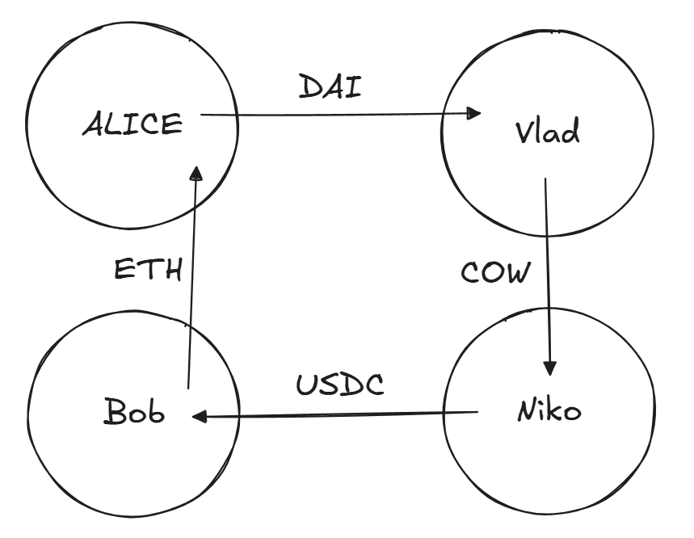
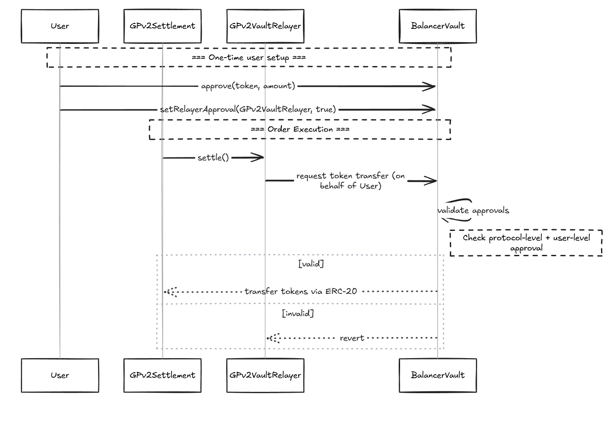
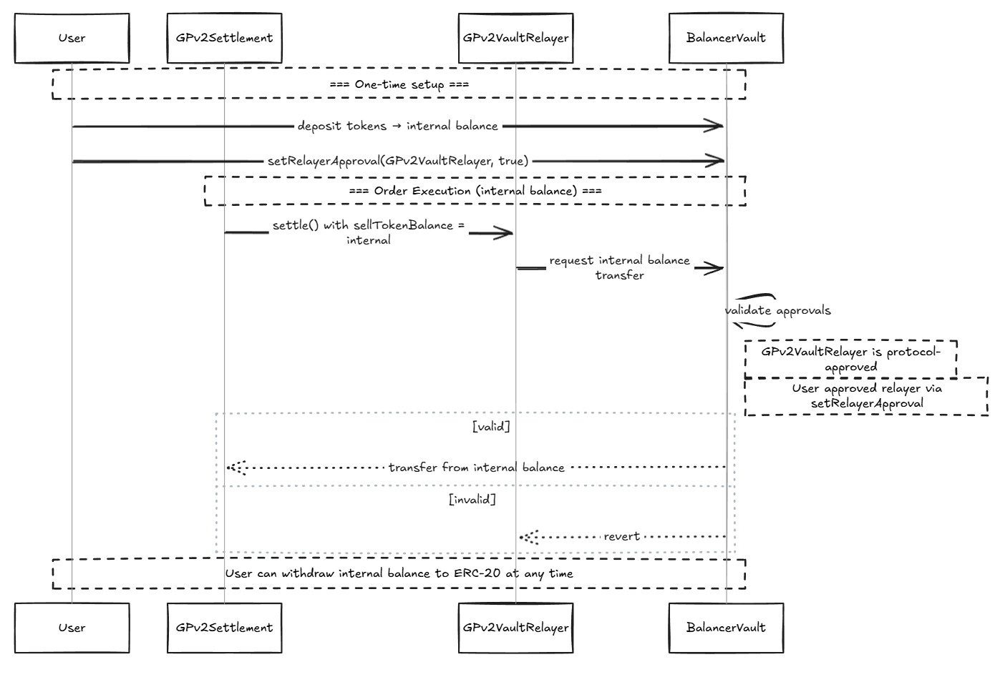

# CoW Swap

**Автор:** [Алексей Куценко](https://github.com/bimkon144) 👨‍💻

[CoW Protocol](https://cow.fi/cow-protocol) и его основной интерфейс [CoW Swap](https://swap.cow.fi/) - одна из самых интересных meta-DEX систем в экосистеме EVM. В данный момент протокол доступен на Ethereum, Gnosis Chain, Base и Arbitrum One.

В основе протокола лежит концепция CoW ([Coincidence of Wants](https://docs.cow.fi/cow-protocol/concepts/how-it-works/coincidence-of-wants), или "Совпадение Желаний"), которая позволяет трейдерам обмениваться токенами напрямую, без лишних посредников.

Представьте, что вы хотите продать ETH за USDC, а кто-то другой хочет продать USDC за ETH. В обычном DEX каждый из вас заплатил бы комиссию за свою сделку сторонним поставщикам ликвидности и конечно же за газ.
А в CoW Swap вы можете просто обменяться напрямую, заплатив только лишь часть продаваемых токенов исполнителю транзакции! Это как найти идеального торгового партнёра на рынке.

## Как всё начиналось: от Gnosis Protocol к CoW Swap

История CoW Swap началась в экосистеме [Gnosis](https://www.gnosis.io/) — одного из старейших проектов Ethereum.

**Gnosis Protocol v1 (2020)**

Первая версия была амбициозной попыткой создать децентрализованный обменник с ордербуком прямо в блокчейне. Идея была хорошей, но на практике возникли проблемы:

- Каждый ордер стоил дорого из-за высоких комиссий за газ
- Хранение ордеров в блокчейне ограничивало ликвидность

Таким образом, необходим был подход, который помог бы улучшить ситуацию вышеуказанных проблем.

**Gnosis Protocol v2 (2021)**

В 2021 году команда сделала серьёзный апгрейд:

- Убрали ордербук из блокчейна (сделали off-chain)
- Переход на систему "_намерений_" (intents) и _решателей_ (solvers). Если коротко, то теперь пользователи просто подписывают свои торговые намеренья off-chain, а _решатели_ соревнуются за право их исполнить on-chain самым выгодным способом. Детальнее чуть позже.

**Cow Protocol (2021)**

Впоследствии, команда экосистемы Gnosis решила трансформировать в отдельный протокол [CoW Protocol](https://cow.fi/cow-protocol) с собственным управлением и экономикой.

В свою очередь CoW Swap — это первый и самый популярный пользовательский интерфейс, построенный поверх CoW Protocol.

Это позволило в апреле 2022 года создать токен COW, который в свою очередь позволил создать систему децентрализованного управления через [CoW DAO](https://docs.cow.fi/governance).

Все важные решения в CoW DAO принимаются через систему предложений (CIP, [CoW Improvement Proposals](https://docs.cow.fi/governance/process)), похожую на EIP в Ethereum.

Таким образом, токен [COW](https://coinmarketcap.com/currencies/cow-protocol/) служит нескольким ключевым целям:

- Участие в управлении протоколом через голосование в DAO
- Внесение залога решателями как гарантия добросовестности
- Стимулирование активных участников экосистемы: вознаграждение решателей за успешное исполнение пакетных аукционов и финансирование разработчиков через гранты CowDAO для улучшения протокола

## Флоу ордера

Базовые понятия необходимые для понимания дальнейшего материала:

- **Намеренья (intents)** - off-chain ордера подписанные через EIP-712, ERC-1271, eth-sign или наличие Presign на контракте (про схему подписи на контракте поговорим позже).
- **Решатели (solvers)** - участники протокола, которые соревнуются за право обработать пакет намерений. Под соревнованием понимается нахождение самого выгодного маршрута обмена всех ордеров юзеров.
- **CoW Protocol** - сам протокол, который состоит из off-chain ордер бука, решателей (solvers).
- **Cow Swap** - интерфейс для взаимодействия юзеров с протоколом.

Рассмотрим флоу ордера на примере схемы ниже:


**1. Создание намерения торговли (ордера)**

В обычных DEX вы отправляете транзакцию напрямую в смарт-контракт. В CoW Swap вы просто подписываете намерение — сообщение о том, что хотите сделать.

Пользователь через интерфейс создает и подписывает одним методом указанными ранее намерение (ордер) обменять токены.

В этом намерении указывается:

- Какой токен вы хотите продать и в каком количестве
- Какой токен хотите получить и минимальное приемлемое количество
- Срок действия намерения
- Другие параметры (например, тип ордера)

Далее, юзер все же должен дать одобрение (approve) на контракт [vault relayer](https://docs.cow.fi/cow-protocol/reference/contracts/core/vault-relayer) для токенов которые планируются к обмену. Для чего давать разрешение на этот контракт расскажу позже в разделе контрактов.

К частью, для некоторых токенов (USDC, DAI, COW и других) доступно бесплатное одобрение без газа (gasless approval).

gasless approval работает через стандарт [EIP-2612](https://eips.ethereum.org/EIPS/eip-2612), который позволяет подписывать разрешения (permit) вне блокчейна. Вместо транзакции approve, вы подписываете сообщение с информацией о разрешении, которое затем передается в смарт-контракт токена через функцию permit().

Кстати, в связи с тем что система хранения ордеров off-chain, это создаёт способность поддерживать различные типы ордеров:

1. Рыночный ордер (Market Order):
    - Стандартный ордер, исполняемый по текущей рыночной цене
    - Используется для быстрого исполнения по лучшей доступной цене
    - Протокол ищет лучшую цену среди всех доступных источников ликвидности

3. Лимитный ордер (Limit Order):
    - Позволяет установить конкретную цену исполнения
    - Исполняется только когда цена достигает или превышает указанную

3. TWAP-ордер (Time-Weighted Average Price):
    - Разбивает большой ордер на несколько маленьких частей, исполняемых через равные промежутки времени
    - Позволяет минимизировать влияние на рынок и проскальзывание при крупных объемах
    - Хорошо подходит для китов и институциональных трейдеров

4. Программируемый ордер (Programmatic Order):
    - Предназначен для смарт-контрактов, реализующих стандарт [ERC-1271](https://eips.ethereum.org/EIPS/eip-1271)
    - Позволяет реализовать сложную торговую логику
    - Может использоваться для автоматизированных стратегий и интеграций

5. Milkman-ордер:
    - Механизм размещения ордеров, разработанный [Yearn Finance](https://yearn.fi/) в сотрудничестве с CoW Protocol
    - Позволяет исполнять ордера на основе цен из оракулов
    - Полезен для сценариев с высокой волатильностью цен (например, для автоматического исполнения продажи активов по цене оракула на момент окончания голосования DAO. Если бы это был обычный лимитный ордер, заданный в начале голосования, то при изменении рыночных условий к моменту окончания голосования он мог бы не соответствовать актуальной цене оракула)

6. CoW Hooks:
    - Позволяют присоединить любое действие (или набор действий) к ордеру в CoW Protocol
    - Используя решателей, можно выполнять действия в нужной последовательности
    * Pre-hooks: выполняются до торговли (например, разблокировка токенов из стейкинга, получение аирдропа перед его продажей, или approve на использование токенов)
    * Post-hooks: выполняются после торговли (например, отправка полученных токенов через бридж на L2, размещение токенов в стейкинг или LP-пулы)

**Подведем итоги по первому пункту:**

Мы создали и подписали ордер off-chain, подписали approve на токен, намеренье (ордер) отправился в протокол для дальнейшего батчинга.

Таким образом, после единоразово выданного апрува на токен, все новые намеренья (ордера) с этим токеном можно будет размещать/отменять бесплатным для пользователей.

**2. Формирование пакетного аукциона**

Система протокола собирает подписанные намерения в единый пакет и передает решателям. Этот процесс происходит off-chain.

**3. Соревнование решателей**

Решатели анализируют пакет намерений и используя свои собственные настроенные алгоритмы, предлагают оптимальные пути исполнения пакетов аукциона (ордеров).

Из чего состоит поиск оптимальных путей?

a) Определение возможности использования p2p обменов между пользователями, используя главный механизм [Coincidence of Wants](https://docs.cow.fi/cow-protocol/concepts/how-it-works/coincidence-of-wants).

b) Использование внешних источников ликвидности

- AMM (Uniswap, Sushiswap, Balancer, Curve и другие)
- Агрегаторы (1inch, Paraswap, Matcha и другие)
- Частные маркет-мейкеры (Ликвидность доступная самим решателям, либо даже CEX)

Если с использованием внешних источников ликвидности все понятно, то с типами p2p обменов стоит разобраться.

Рассмотрим существующие типы Coincidence of Wants, которые являются одной из главных фишек протокола:

**Простой обмен (Direct CoW)**

Самый простой случай — когда два трейдера хотят обменяться напрямую.


*Полное исполнение двух ордеров:*
- Alice хочет продать 1000 DAI за ETH
- Bob хочет продать 0.5 ETH за DAI
- Система находит это совпадение, и вы обмениваетесь напрямую

Это позволяет обойти комиссию провайдеров ликвидности (LP) в обменниках.

*Частичное исполнение ордеров:*
- Alice хочет продать DAI за 0.5 ETH
- Bob хочет продать только 0.3 ETH за 600 DAI
- Система находит это совпадение, и вы обмениваетесь частично: 600 DAI на 0.3 ETH

Остаток вашего ордера (400 DAI) будет заполняться через внешние источники ликвидности, такие как Uniswap или 1inch.

**Пакетирование (Batching)**

Часто пакет аукциона содержит намерения от разных пользователей, желающих выполнить одинаковый тип обмена:

- Алиса хочет получить ETH и готова отдать USDC
- Боб также хочет получить ETH и готов отдать USDC
- Вместо выполнения двух отдельных сделок через Uniswap, решатель объединяет эти намерения в одну транзакцию


Такой "батчинг" оптимизирует расходы на газ, поскольку взаимодействие со смарт-контрактами AMM происходит меньшее количество раз.

**Промежуточный обмен**

Промежуточный CoW происходит, когда в пакете есть "промежуточные" сделки, которые могут быть соединены:

- Alice хочет получить USDC и отдаёт за него токены COW
- Bob хочет получить COW и отдаёт за него токены USDT

Напрямую эти сделки не сопоставляются, но через промежуточный токен ETH решатель создает цепочку обменов:

1. Alice отдаёт COW → получает ETH → получает USDC
2. Bob отдаёт USDT → получает ETH → получает COW


В этой схеме образуется общий сегмент: COW → ETH (Alice) и ETH → COW (для Bob).

Решатель замыкает этот сегмент напрямую между пользователями.

**Важно:** ETH используется только как расчетная валюта, фактически токены COW от Alice напрямую поступают к Bob, минуя промежуточные преобразования.

*Преимущества такого подхода:*
1. **Меньше комиссий** — исключаются дублирующиеся шаги обмена
2. **Меньше проскальзывания** — прямой обмен не влияет на рыночную цену
3. **Экономия на газе** — меньше взаимодействий со смарт-контрактами
4. **Меньшее влияние на пулы ликвидности** — более стабильные цены для всех пользователей

**Кольцевой обмен (Ring Trade)**

Кольцевой CoW объединяет три или более пользователей, чьи намерения образуют замкнутую цепочку обменов:

- Alice хочет получить ETH, отдавая DAI
- Bob хочет получить USDC, отдавая ETH
- Niko хочет получить COW, отдавая USDC
- Vlad хочет получить DAI, отдавая COW

Вместо отдельных сделок решатель создает кольцевую структуру, где каждый получает желаемый токен напрямую:

1. DAI от Alice → Vlad
2. COW от Vlad → Niko
3. USDC от Niko → Bob
4. ETH от Bob → Alice



Каждый токен перемещается только один раз, напрямую между участниками, без использования внешних пулов ликвидности.

*Преимущества кольцевого обмена:*
- Максимальная экономия на комиссиях и газу
- Полное отсутствие проскальзывания
- Справедливое ценообразование для всех участников
- Эффективное использование ликвидности без воздействия на рынок

Эти типы p2p обмена совместно с использование внешней ликвидности позволяют добиться существенной оптимизации по комиссиям и газу.

Таким образом, побеждает тот решатель, кто предложит наилучшее решение для всего пакета намерений.

**4. Исполнение пакета в блокчейне**

Победивший решатель получает право исполнить весь пакет одной транзакцией в блокчейне.

Для этого делает подготовительный процесс:

- Проверяет первоначальную валидность ордеров (такие как: срок действия, фактор исполнения, баланс или апрув, подписи EIP-712, ERC-1271, и др)
- Рассчитывает оптимальные цены для каждого токена в пакете
- Формирует набор взаимодействий с внешними протоколами (AMM, агрегаторы), если необходимо
- Строит оптимальный маршрут исполнения всего пакета

После этого, он вызывает метод `settle` на смарт-контракте [GPv2Settlement](https://github.com/gnosis/gp-v2-contracts/blob/main/src/contracts/GPv2Settlement.sol)  в который передаёт все данные, такие как адреса токенов, цены токенов, действия с токенами (взаимодействия с другими протоколами), данные по хукам. Данный метод уже выполняет все необходимые действия, такие как p2p, трейды на dex, хуки.

Какие преимущества подхода группировки намерений в пакеты нам даёт?

- Экономия по газу (все ордера исполняются одной транзакцией за счет решателя)
- Защиту от MEV (цены фиксируются заранее, бот не может "вклиниться" в середину пакета или изменить исход сделки)

Что это даёт юзерам?

Пользователи получают свои токены по ценам равным или даже лучше запрошенных

- Система переводит токены от пользователей к их получателям
- Пользователи получают свои токены по ценам равным или лучше запрошенных
- Решатель получает вознаграждение из части сэкономленных пользователями средств

## Смарт-контракты

В Cow Protocol всего 3 контракта входят в core, т.е без которых он не может работать:

- **GPv2Settlement**
- **GPv2VaultRelayer**
- **GPv2AllowlistAuthentication**

**GPv2Settlement** ([0x9008D19f58AAbD9eD0D60971565AA8510560ab41](https://github.com/gnosis/gp-v2-contracts/blob/main/src/contracts/GPv2Settlement.sol)) - Самый главный контракт, который принимает от решателя данные намерений и действий с ними для выполнения в транзакции.

Как мы ранее писали, решатели вызывают метод `settle`. Данный метод может вызываться только авторизованными решателями.

Что он делает?

- Проверяет каждый ордер в пакете:
  - Валидирует подписи пользователей для аутентификации ордеров
  - Проверяет, что ордер еще не истек
  - Проверяет, что ордер не был исполнен ранее
  - Гарантирует, что ордер исполняется по цене равной или лучше указанной
- Рассчитывает итоговые суммы исполнения для каждого ордера
- Отслеживает заполненные объемы частичных ордеров
- Выпускает события для отслеживания сделок

Так же существуют несколько важных методов, которые позволяют on-chain подписать - `setPreSignature` или отменить ордер - `invalidateOrder`.

Для чего это нужно?

Все на самом деле очень просто:

- `setPreSignature` Необходима для смарт-контрактов не реализующих интерфейс ERC-1271. Так как смарт-контракт не имеет приватного ключа чтобы подписать ордер. Этот метод требует on-chain транзакции и оплаты газа, его можно использовать как для EOA, так и для смарт-контрактных кошельков.

- `invalidateOrder`: Помечает ордер как недействительный, т.к off-chain отмена может не успеть сработать до его выполнения из-за задержек в off-chain архитектуре.

Пример использования `setPreSignature`:

1. EOA:

Возможен сценарий, когда трейдер захочет вначале внести ордер офф-чейн, а потом, имея торговую стратегию, которая была дала профит, активировал данный ордер on-chain через какого-то бота.

2. Смарт аккаунт:

Представим DAO с мультисиг-кошельком Gnosis Safe, которому необходимо обменять 100000 USDT на ETH.

Администратор DAO создает ордер через API CoW Protocol (получает взамен ID ордера) и размещает его в виде предложения к голосованию. После прохождения голосования, выполняется транзакция c `setPreSignature(orderId, true)`, которая активирует ордер. Таким образом ордер считается подписанным и попадает в пакет аукционов.

**GPv2VaultRelayer** ([0xC92E8bdf79f0507f65a392b0ab4667716BFE0110](https://github.com/gnosis/gp-v2-contracts/blob/main/src/contracts/GPv2VaultRelayer.sol)) - Контракт отвечает за контроль доступа к токенам юзеров. Этот контракт работает как "огражденный сад" для средств пользователей и является ключевым элементом безопасности протокола. Может вызываться только контрактом **GPv2Settlement**, что исключает произвольные действия со средствами пользователей.

Какие способы доступа к токенам юзеров есть у **GPv2VaultRelayer**?

- **Прямые ERC-20 одобрения**: Стандартные одобрения (approve) напрямую на адрес GPv2VaultRelayer
- **Внешние балансы Balancer**: Использует существующие ERC-20 одобрения пользователя для Balancer Vault
- **Внутренние балансы Balancer**: Использует внутренние балансы в Balancer для газово-эффективных переводов

С первым пунктом все понятно, как и в обычном DEX нужно дать апрув на токен который списывают, а вот два последних пункта разберем чуть позже.

**GPv2AllowlistAuthentication** ([0x2c4c28DDBdAc9C5E7055b4C863b72eA0149D8aFE](https://github.com/gnosis/gp-v2-contracts/blob/main/src/contracts/GPv2AllowListAuthentication.sol)) - контракт авторизации, который проверяет, является ли решатель авторизованным при вызове метода `settle` на контракте **GPv2Settlement**.

Управляется через CoW DAO, что обеспечивает децентрализованный контроль.

Таким образом, процесс выполнения пакета намерений выглядит так:

**Процесс выполнения пакета намерений**:
1. Решатель вызывает функцию `settle()` в GPv2Settlement, предоставляя:
   - Список токенов
   - Рассчитанные единые цены для каждого токена
   - Массив ордеров для исполнения
   - Набор взаимодействий с внешней ликвидностью
   
2. GPv2Settlement выполняет проверки:
   - GPv2AllowlistAuthentication подтверждает авторизацию решателя
   - Проверяется каждый ордер (срок действия, подпись, статус заполнения)
   - Проверяется соблюдение лимитных цен для каждого ордера
   
3. Если все проверки прошли успешно:
   - Выполняются предварительные взаимодействия (pre-hooks)
   - GPv2VaultRelayer переводит токены от пользователей
   - Выполняются основные взаимодействия с внешней ликвидностью
   - Пользователи получают купленные токены
   - Выполняются завершающие взаимодействия (post-hooks)
   - Обновляется статус заполнения ордеров

Получается, что в решатель отвечает за нахождение оптимального решения, а смарт-контракты обеспечивают строгий контроль исполнения ордеров.

Наверное у вас возникает вопрос, если выставление ордеров не требует газ и транзакцию выполняет решатель, то где я плачу комиссию?

## Особенность модели оплаты

В CoW Swap вы платите комиссию в том токене, который продаете.

Важные понятия:

> **Излишек (Surplus)** — разница между фактической ценой исполнения и минимальной ценой исполнения лимитного ордера. Это то, насколько лучше вы получили по сравнению с вашим минимальным требованием. Например, если вы установили минимальную цену 0.45 ETH за 1000 USDC, а ордер исполнился по цене 0.47 ETH, то излишек составит 0.02 ETH.

> **Улучшение цены (Quote improvement)** — разница между фактической ценой исполнения и предварительно рассчитанной котировочной ценой для рыночного ордера, если эта разница положительная. Это то, насколько лучше вы получили по сравнению с расчетом, показанным в интерфейсе. Например, если интерфейс показывает, что вы получите 0.45 ETH за 1000 USDC, но фактически вы получаете 0.46 ETH, улучшение цены составит 0.01 ETH.

*Ключевое отличие*: излишек сравнивает с вашими собственными условиями при создании лимитного ордера, а улучшение цены — с предварительным расчетом системы для рыночного ордера.

**Текущая структура комиссий**

Система использует следующие типы комиссий:

* **Комиссия с излишка для лимитных ордеров**
  * *Определение*: 50% от излишка, но не более 1% от общего объема ордера
  * *К каким ордерам применяется*: только к лимитным ордерам, которые не могут быть исполнены на момент создания (т.е если цена покупки или продажи не соответствует текущей цене по рынку)
  * *Формула расчета*: surplus × 0.5 ИЛИ volume × 0.01 (в зависимости от того, какое число меньше)

* **Комиссия с улучшения цены для рыночных ордеров**
  * *Определение*: 50% от положительного улучшения котировки для рыночных ордеров, но не более 1% от общего объема ордера
  * *К каким ордерам применяется*: все рыночные ордера (включая лимитные ордера в рынке и TWAP), где пользователь получает лучшую цену, чем было указано в котировке
  * *Формула расчета*: quote_improvement × 0.5 ИЛИ volume × 0.01 (в зависимости от того, какое число меньше)

* **Комиссия с объема на Gnosis Chain**
  * *Определение*: 0.1% (10 базисных пунктов) от общего объема ордера
  * *К каким ордерам применяется*: все рыночные ордера, лимитные ордера и TWAP на Gnosis Chain, за исключением пар токенов с коррелирующими ценами (например пара USDC/USDT)
  * *Формула расчета*: volume × 0.001

**Пример расчета комиссии для лимитного ордера**:
Создаём лимитный ордер на продажу 1000 USDC по курсу не менее 0.5 ETH за 1000 USDC (минимальная цена).
Решатель находит покупателя, готового приобрести по курсу 0.53 ETH за 1000 USDC (цена лучше запрошенной). 

* Расходы на газ: предположим, что решатель потратил эквивалент 4 USDC на исполнение ордера (удерживается в USDC, то есть из продаваемого токена)
* Вы отдаёте: 1000 USDC
* Удерживается: 4 USDC (компенсация за газ)
* Решатель обменивает 996 USDC по курсу 0.53 ETH / 1000 USDC × 996 USDC = 0.5279 ETH
* Разница между фактической и минимальной ценой (излишек): 0.53 ETH - 0.5 ETH = 0.03 ETH
* Комиссия с излишка (50%): 0.03 ETH × 0.5 = 0.015 ETH
* Максимальная комиссия (1% от объема): 0.5279 ETH × 0.01 = 0.00528 ETH
* Итоговая комиссия: min(0.015 ETH, 0.00528 ETH) = 0.00528 ETH (используется меньшее значение)
* Вы получаете: 0.5279 ETH - 0.00528 ETH (комиссия) = 0.52262 ETH

>**Важно:** Комиссия с излишка удерживается в получаемом токене, а компенсация за газ — в продаваемом токене. Решатель платит газ из своих средств, но компенсирует его за счёт вычета из суммы, которую пользователь отдаёт. Чем больше намерений в пакете, тем меньше комиссия за газ с каждого пользователя.

**Пример расчета с партнерской комиссией (Partner Fee)**:

CoW Protocol позволяет интеграторам (например, виджетам или приложениям, встраивающим CoW Swap) взимать дополнительную комиссию (до 1%).

*Пример: Пользователь продает 1 ETH за DAI через партнерский виджет (Partner Fee = 1%)*

* Информация, которую может увидеть пользователь в виджете (зависит от реализации партнером):
  * Предполагаемая сумма обмена: 0.995 ETH
  * Комиссия за газ (оценка): 0.005 ETH
  * Общая сумма продажи: 1 ETH
  * Ожидаемая сумма покупки: 3,465 DAI (предварительная оценка того, сколько минимум пользователь получит по текущим рыночным ценам с учетом партнерской комиссии)

* Параметры подписанного ордера:
  * Сумма продажи: 1 ETH
  * Минимальная сумма покупки: 3,465 DAI (3,500 - 3,500 × 0.01 = 3,465) — уже включает вычет потенциальной партнерской комиссии

* Исполнение ордера:
  * Решатель использовал 0.003 ETH на газ
  * Продано: 0.997 ETH (1 ETH - 0.003 ETH)
  * Получено: 3,525 DAI (решатель смог получить лучшую цену, чем предварительная оценка)
  * Излишек до комиссий: 60 DAI (3,525 - 3,465)
  * Партнерская комиссия: 35.25 DAI (3,525 × 0.01)
  * Остаток после партнерской комиссии: 3,489.75 DAI (3,525 - 35.25)
  * Доступный излишек после партнерской комиссии: 24.75 DAI (3,489.75 - 3,465)
  * Комиссия решателя по правилу 50% от доступного излишка: 12.38 DAI (24.75 × 0.5)
  * Итоговая выплата пользователю: 3,465 DAI (минимальная гарантия) + 12.37 DAI (оставшаяся половина излишка) = 3,477.37 DAI

> **Важно:** Партнерская комиссия (1%) взимается с итоговой суммы сделки. Комиссия решателя составляет 50% от доступного излишка, который остается после вычета партнерской комиссии. То есть, сначала вычитается партнерская комиссия, затем обеспечивается минимальная сумма покупки для пользователя, и только из оставшегося излишка решатель получает свои 50%, но не более 1% от общей суммы обмена.

**Техническая реализация партнерских комиссий:**

Партнерские комиссии реализуются через поле `appData` в ордере:

1. Поле `appData` (тип `bytes32`) является частью структуры Data (order) в библиотеке [GPv2Order](https://github.com/gnosis/gp-v2-contracts/blob/main/src/contracts/libraries/GPv2Order.sol) смарт-контракте GPv2Settlement:
2. 
   ```solidity
   struct Data {
       IERC20 sellToken;
       IERC20 buyToken;
       address receiver;
       uint256 sellAmount;
       uint256 buyAmount;
       uint32 validTo;
       bytes32 appData;
       uint256 feeAmount;
       bytes32 kind;
       bool partiallyFillable;
       bytes32 sellTokenBalance;
       bytes32 buyTokenBalance;
   }
   ```
3. При создании ордера через партнерский виджет:
   * Виджет создает JSON-документ с метаданными о партнере (идентификатор, размер комиссии, адрес получателя)
   * Этот документ загружается в IPFS, а полученный IPFS-хеш преобразуется в тип `bytes32` и записывается в поле `appData`
   * **Важно:** Минимальная сумма покупки (`buyAmount`) уменьшается на размер партнерской комиссии уже на этапе создания ордера (off-chain), до подписи пользователем
   * Таким образом, после подписания ордера, смарт-контракт будет валидировать именно эту уменьшенную сумму
4. При исполнении ордера:
   * Смарт-контракт проверяет только то, что пользователь получит не меньше указанного в ордере `buyAmount`
   * Партнерская комиссия вычисляется и распределяется off-chain сервисами CoW Protocol, которые интерпретируют метаданные из `appData`

Такой off-chain подход делает работу с партнерскими комиссиями газово-эффективной и гибкой. Партнерская комиссия функционирует независимо от вознаграждения решателя, который получает свою долю излишка в любом случае. Честность системы обеспечивается значительным залогом решателей ($500,000 USD и 1,500,000 COW токенов) — при недобросовестном поведении решатель теряет залог и исключается из протокола.

## Интеграции с другими протоколами

Важно понимать, что CoW Protocol может использоваться и другими приложениями.

Например, [Balancer](https://balancer.gitbook.io/balancer-v2/products/balancer-cow-protocol) в 2021 году интегрировал протокол в свой интерфейс, создав Balancer-CoW-Protocol (BCP).

**Интеграция с Balancer: архитектура безопасности**

CoW Protocol работает в сотрудничестве с [Balancer](https://balancer.fi/) для достижения максимальной прибыли для пользователей и обеспечения дополнительной безопасности.

Следует напомнить, что ключевой элемент этого партнерства — контракт **GPv2VaultRelayer**, который служит критическим компонентом безопасности. Его главная гарантия: **GPv2VaultRelayer может передавать токены ERC-20 ТОЛЬКО контракту GPv2Settlement**.

Это архитектурное решение защищает средства пользователей от потенциально злонамеренных решателей. Если бы пользователи давали разрешения напрямую контракту GPv2Settlement, злонамеренный решатель мог бы через механизм "взаимодействий" получить доступ к средствам пользователей. В коде GPv2Settlement есть явный запрет на вызов VaultRelayer через interactions `(require(interaction.target != address(vaultRelayer), "GPv2: forbidden interaction"))`, который дополнительно гарантирует, что даже злонамеренный решатель не сможет напрямую взаимодействовать с контрактом, хранящим разрешения пользователей.

Механизм "взаимодействий" (interactions) — это конкретный параметр функции `settle()` контракта GPv2Settlement, который позволяет решателям передавать произвольные вызовы к внешним смарт-контрактам. Технически это массив байт-кода (`bytes[] calldata interactions`), который решатель может заполнить любыми вызовами к другим протоколам

Эти взаимодействия нужны для маршрутизации средств через различные DEX (Uniswap, Curve, Balancer) или агрегаторы (1inch, Paraswap) с целью получения лучших цен.

Критически важно понимать, что:

1. Взаимодействия **не являются частью** подписанных пользователем данных ордера
2. Они полностью контролируются решателем в момент исполнения транзакции
3. В них могут содержаться любые вызовы к любым контрактам в блокчейне

Здесь и возникает уязвимость: если бы пользователь давал approve напрямую контракту GPv2Settlement, а решатель был злонамеренным, он мог бы добавить в массив interactions вызовы, которые переводят токены куда угодно. Архитектура с GPv2VaultRelayer решает эту проблему, ограничивая поток средств:

1. Токены могут быть переведены **только** на контракт GPv2Settlement
2. GPv2Settlement может использовать токены только в рамках текущей транзакции
3. Даже при взломе GPv2Settlement, злоумышленник не сможет вывести средства за границы существующих контрактов

Таким образом система сохраняет гибкость маршрутизации, но исключает возможность кражи средств через вредоносные взаимодействия.

**Пример движения средств:**

Допустим, пользователь хочет продать 100 USDC за минимум 0.05 ETH:

1. **С архитектурой VaultRelayer (безопасно):**
   - Пользователь даёт approve на 1000 USDC контракту VaultRelayer
   - VaultRelayer переводит только 100 USDC на Settlement (только то, что указано в ордере)
   - Settlement обменивает 100 USDC на 0.053 ETH через взаимодействия с DEX
   - Пользователь получает 0.053 ETH минус комиссия
   - Оставшиеся 900 USDC остаются недоступными для Settlement и безопасными

2. **Без VaultRelayer (небезопасно):**
   - Если бы пользователь дал approve напрямую Settlement
   - Злонамеренный решатель мог бы вообще не исполнять ордер через DEX, а вместо этого:
     - Добавить в массив interactions вызов `USDC.transferFrom(пользователь, злоумышленник, 100)` для кражи самой обменной суммы
     - Никогда не отправлять пользователю обещанные ETH
     - Плюс мог бы добавить `USDC.transferFrom(пользователь, злоумышленник, 900)` для кражи оставшихся средств
   - Все это возможно, потому что решатель полностью контролирует содержимое массива interactions

Этот пример демонстрирует, почему архитектура с VaultRelayer является критически важным элементом безопасности в CoW Protocol. VaultRelayer не только ограничивает сумму, доступную для ордера, но и гарантирует, что даже эта сумма может быть переведена только на контракт Settlement, где действуют строгие проверки правильного исполнения ордера.

Давайте все же перейдем к вопросу выгоды интеграции с Balancer.

**Преимущества для Balancer**: Balancer получает дополнительный торговый интерфейс без необходимости разрабатывать собственный, его пользователи получают защиту от MEV, доступ к улучшенным ценам и газово-эффективную торговлю без необходимости взаимодействовать с новым протоколом. Это увеличивает объем торгов в пулах Balancer и, соответственно, комиссии для поставщиков ликвидности, сохраняя при этом пользователей в экосистеме Balancer.

**Преимущества для CoW Protocol**: CoW Protocol получает привилегированный доступ к ликвидности Balancer, оптимизацию газа через внутренние балансы Vault, и возможность переиспользовать уже выданные пользователями апрувы на Balancer Vault, что значительно снижает барьер входа для миллионов пользователей Balancer и расширяет пользовательскую базу протокола. Дополнительно, упрощается пользовательский путь и повышается безопасность, так как пользователи могут управлять всеми разрешениями через единый интерфейс Balancer.

Важно понимать принципы работы балансов в Balancer:

> **Внешние балансы Balancer** — это стандартные ERC-20 токены, которые находятся на адресах пользователей. Для работы с ними пользователь дает разрешение (approve) контракту Balancer Vault на использование этих токенов. Это классический способ управления токенами в большинстве DeFi протоколов.

>**Внутренние балансы Balancer** — это учетная система внутри контракта Balancer Vault, которая отслеживает количество токенов, принадлежащих каждому пользователю, без необходимости выполнять последующие реальные ERC-20 переводы. Пользователь должен заранее "депонировать" токены во внутренние балансы Vault, после чего их можно использовать с минимальными затратами газа.

**Доступ к средствам пользователей** осуществляется тремя способами:

- **Прямые ERC-20 одобрения**: Стандартные одобрения (approve) напрямую на адрес GPv2VaultRelayer (ранее о нем рассказывали)
- **Внешние балансы Balancer**: Использует существующие ERC-20 одобрения пользователя для Balancer Vault
- **Внутренние балансы Balancer**: Использует внутренние балансы в Balancer для газово-эффективных переводов

**Использование внешних балансов Balancer:**

Требуется две независимые формы авторизации:

1. **Протокольный уровень**: GPv2VaultRelayer авторизован в Balancer как официальный релейер через голосование Balancer DAO (уже реализовано на уровне протокола).


2. **Пользовательский уровень**: Для использования этого механизма требуется:
   - Пользователь уже имеет стандартное ERC-20 одобрение (approve) для контракта Balancer Vault
   - Пользователь дополнительно одобряет GPv2VaultRelayer как доверенный релейер через специальную функцию `setRelayerApproval` в Balancer Vault



При исполнении ордера с использованием внешних балансов Balancer процесс происходит так:
1. GPv2Settlement вызывает GPv2VaultRelayer
2. GPv2VaultRelayer запрашивает у Balancer Vault перевод токенов от пользователя
3. [Balancer Vault](https://github.com/balancer/balancer-v2-monorepo/blob/master/pkg/vault/contracts/Vault.sol) проверяет:
   - Что GPv2VaultRelayer авторизован на протокольном уровне
   - Что пользователь дал релейеру специальное разрешение через setRelayerApproval
4. После проверок Balancer Vault использует свое существующее ERC-20 одобрение для перевода токенов

**Использование внутренних балансов Balancer:**

Третий механизм доступа к средствам пользователя:

1. **Требования для использования:**
   - Пользователь должен иметь внутренние балансы токенов в Balancer Vault
   - Пользователь должен одобрить GPv2VaultRelayer как релейер так же, как и для внешних балансов
   - В ордере флаг `sellTokenBalance` должен быть установлен в значение `internal`



2. **Преимущества:**
   - Значительная экономия газа при исполнении ордеров
   - Возможность получить торговые результаты тоже во внутренних балансах, установив флаг `buyTokenBalance` в значение `internal`
   - Свободный обмен между внутренними балансами и стандартными ERC-20 токенами в любой момент

Пользователь может в любой момент вывести внутренние балансы из Balancer Vault в виде обычных ERC-20 токенов.

Это обеспечивает три ключевых преимущества:
- Переиспользование существующих ERC-20 одобрений Balancer Vault (не нужны новые одобрения специально для CoW Protocol)
- Вместо того чтобы раздавать approve каждому контракту на каждый токен, ты один раз дал разрешение GPv2VaultRelayer через `setRelayerApproval`, и если захочешь — можешь одной транзакцией его отозвать. Это удобнее, безопаснее и контролируемо
- Approve GPv2VaultRelayer можно отозвать одной транзакцией в Balancer Vault, вместо того чтобы отзывать approve отдельно у каждого ERC-20 токена

Получается, что даже при компрометации контракта Settlement, VaultRelayer не позволит выполнить произвольные действия со средствами благодаря архитектуре с двойной авторизацией и ограниченной функциональностью.

Если говорить простыми словами, партнерство между CoW Protocol и Balancer — это как дружба между двумя соседями, где каждый получает свою выгоду. Balancer не нужно создавать собственную торговую систему с нуля — он просто использует инфраструктуру CoW Protocol, предлагая своим пользователям защиту от фронтраннеров и лучшие цены. А CoW Protocol в свою очередь получает доступ к огромной базе пользователей Balancer и их ликвидности.

Главная фишка этой интеграции — безопасность. Представьте, что VaultRelayer — это надежный охранник, который стоит между вашими средствами и протоколом. Он проверяет все запросы дважды и переводит только те токены, которые вы реально хотите обменять. Даже если главный контракт будет взломан, ваши оставшиеся средства в безопасности — ведь охранник не позволит перевести больше, чем нужно для конкретной сделки.

Для пользователей это еще и удобно: вместо того чтобы давать десятки отдельных разрешений на каждый токен, вы даете одно общее разрешение через Balancer, и можете в любой момент отозвать его одной транзакцией. Это как иметь один мастер-ключ вместо связки из десятков ключей.

## Ограничения и вызовы протокола

CoW Protocol — хороший протокол, но у неё есть свои ограничения:

**Задержки при исполнении**
В отличие от обычных DEX, где сделки проходят мгновенно, в CoW Swap процесс занимает от нескольких секунд до нескольких минут из-за формирования пакета, поиска оптимального решения и проведения аукциона между решателями.

**Зависимость от внешней инфраструктуры**
Система опирается на работу off-chain стороны, решателей и API-сервисов. Если какой-то из этих компонентов откажет, создать новые ордера будет невозможно.

**Высокий порог входа для решателей**
Хотя теоретически стать решателем может любой, на практике для этого требуется внушительный залог ($500 000 и 1,500,000 COW) и серьезные технические навыки. Это создает риск централизации — в системе может остаться всего несколько крупных решателей.

**Неравномерная эффективность**
Протокол наиболее эффективен при высокой активности и ликвидности. Для редких токенов или в периоды низкой торговой активности преимущества системы могут быть не так заметны.

## Инциденты безопасности

В феврале 2023 года был небольшой инцидент — хакер украл около $166K из контракта расчетов. Но есть две хорошие новости:

1. **Деньги пользователей были в полной безопасности.** CoW Swap устроен так, что ваши средства никогда не хранятся в протоколе — все сделки выполняются мгновенно и напрямую.

2. **Украденные деньги удалось вернуть** благодаря залогу, который вносят решатели.

Что случилось? Если коротко:
- Один из решателей создал контракт с уязвимостью
- Хакер нашел эту уязвимость и воспользовался ею для кражи токенов DAI
- Команда быстро отреагировала и закрыла уязвимость

Что сделали с проблемой:
- Отключили проблемный контракт
- Решатель обновил свой код
- Решатель был временно отключен от системы и оштрафован

Система сработала именно так, как и была задумана — залоги решателей выступили в роли страховки и позволили компенсировать потери.

Если вам интересны детали, их можно прочитать в [официальном разборе инцидента](https://cow.fi/learn/cow-swap-solver-exploit-post-mortem).

## Заключение

CoW Protocol и его основной интерфейс CoW Swap представляют собой прорыв в децентрализованной торговле. Протокол объединяет лучшее от централизованных и децентрализованных бирж, используя намерения, пакетные аукционы и решателей для создания эффективной, безопасной и выгодной системы.

Главные преимущества:

1. **Эффективность** — прямые обмены экономят комиссии и газ
2. **Безопасность** — защита от MEV через пакеты и единые цены
3. **Выгодные цены** — агрегация ликвидности и конкуренция решателей
4. **Гибкость** — поддержка разных типов ордеров и хуков

Важно отметить, что различные типы CoW (прямой обмен, промежуточный обмен, кольцевой обмен) могут комбинироваться в рамках одного пакета аукциона. Решатели могут создавать сложные комбинации этих механизмов для достижения максимальной эффективности:

- Часть пользователей может участвовать в прямых CoW
- Другие пользователи могут быть объединены в промежуточные или кольцевые схемы
- Оставшийся объем может быть исполнен через внешние источники ликвидности

Такая гибкость позволяет протоколу адаптироваться к любым рыночным условиям и обеспечивает максимальную эффективность для всех участников.

CoW Protocol показывает, что децентрализованная торговля может быть эффективной и безопасной. Система создаёт правильные стимулы — чем больше выгода для пользователя, тем больше для решателя. А CoW Swap, в свою очередь, делает эту сложную технологию доступной через удобный и понятный интерфейс.

## Ссылки

- [CoW Protocol (официальный сайт)](https://cow.fi/)
- [CoW Swap (интерфейс протокола)](https://cow.fi/cow-swap)
- [Документация CoW Protocol](https://docs.cow.fi/)
- [GitHub: CoW Protocol](https://github.com/cowprotocol)
- [Форум CoW DAO](https://forum.cow.fi/)
- [Discord](https://discord.gg/cowprotocol)
- [Smart-contracts repo](https://github.com/gnosis/gp-v2-contracts/tree/main/src/contracts)
