# Curve

**Автор:** [Павел Найданов](https://github.com/PavelNaydanov) 🕵️‍♂️


**Curve** — это децентрализованный обменник (DEX) на базе автоматизированного маркет-мейкера (AMM) для Ethereum и EVM-совместимых блокчейнов. По большей части предназначен для эффективного обмена стейблкоинами, но и обычные волатильные активы тоже могут меняться.

## Предпосылки и мотивация

Предпосылкой появления Curve, как ни странно, стал недостаток [Uniswap](https://app.uniswap.org/) v2. На тот момент Uniswap уже внедрил формулу постоянного продукта `x * y = k`. Эта формула прекрасно работала для обменов, использующих небольшую часть пула, в противном случае, оказывала значительное влияние на ценообразование.

Допустим, в пуле Uniswap ETH/USDC ликвидности на \$1_000_000. Если попытаться обменять ETH на сумму \$750_000, то в результате будет получено намного меньше USDC, чем \$750_000, потому что это очень сильно изменит баланс ETH относительно USDC в пуле.

И это особо острая проблема при обмене одного стейблкоина на другой, так как их стоимость всегда должна равняться 1 доллару. Возьмем пул USDT/USDC, при обмене USDT на USDC, в пуле будет становится больше USDT и меньше USDC, и даже небольшая разница резервов в пуле будет уводить стейблкоины от привязки к 1 доллару согласно формуле постоянного продукта.

Поэтому появление решений этой проблемы было неизбежно. Протокол Curve предложил интересную математику, которая является промежуточной между моделью ценообразования Uniswap и фиксированной ценой. То есть отклонение от фиксированной цены позволяется, но незначительно по сравнению с Uniswap. Ниже представлен график проскальзывания цены Uniswap и Curve (StableSwap), взятый из [whitepaper](https://docs.curve.fi/assets/pdf/stableswap-paper.pdf).

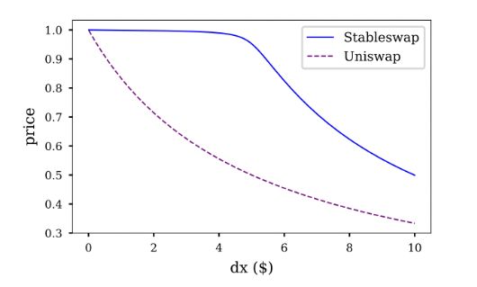

График показывает, что на увеличении количества ликвидности, задействованной для обмена (dx), цена у StableSwap практически не меняется в начале.

Убедиться в эффективности Curve можно сравнив результат обмена двух стейблкоинов в интерфейсе Uniswap v2 и Curve (Для Uniswap необходимо в настройках включить пулы только для v2). На `$100_000`, для обмена USDC на DAI, разница становится заметной. При дальнейшем увеличение разница будет только увеличиваться.

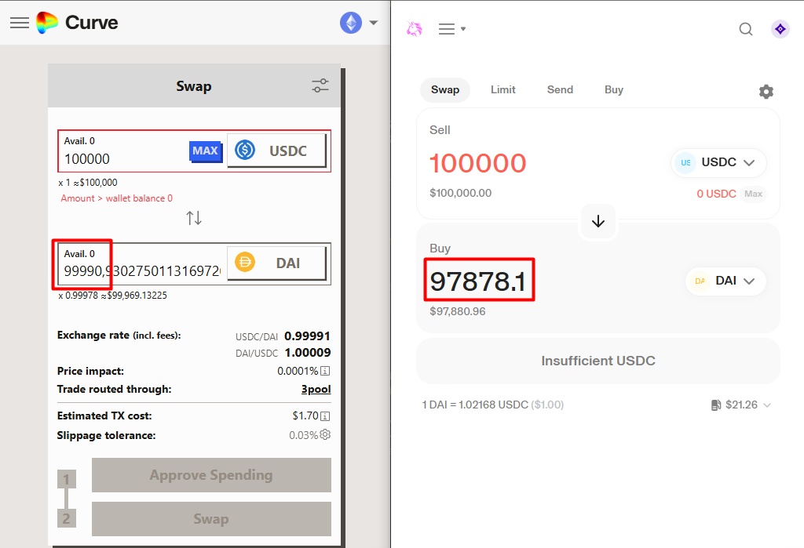

> В Uniswap V3 такой проблемы нет, потому что новый концепт "Концентрированной ликвидности" позволяет уменьшить проскальзывание цены. Это происходит за счет концентрации ликвидности в конкретном диапазоне цены.

## Математика Curve

Curve использует уникальную формулу автоматического маркет-мейкера, оптимизированную для обмена активов. Уникальность заключается в том, что формула позволяет лавировать между формулой постоянной суммы и постоянного произведения. Это позволяет управлять проскальзыванием для обмена стейблкоинов.

- Формула постоянной суммы `x + y = k`. Дает минимальное проскальзывание, но может исчерпать один из активов в пуле.
- Формула постоянного произведения `x * y = k`. Поддерживает бесконечную ликвидность всех активов, которую невозможно исчерпать, но имеет более высокое проскальзывание. Используется в Uniswap v2 и v3.

Curve вводит понятие инварианты и обозначает ее буквой `D`. Аналогично `k` в Uniswap. Так как в пулах может быть больше двух активов, то формулы постоянной суммы и произведения трансформируются.


На скриншоте:
- D - инварианта
- x - i-й актив
- n - количество активов в пуле
- Σ - сумма всех активов
- П - произведение всех активов

Дальше мы пропустим шаг получения итоговой формулы Curve из формул постоянной суммы и произведения. Кому интересно, то можно обратиться к [официальному описанию механизма StableSwap](https://docs.curve.fi/references/whitepapers/stableswap/). Мы же посмотрим сразу на финальную формулу StableSwap.

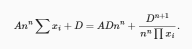

В формуле вводится понятие коэффициента усиления (amplification coefficient), который обозначается, как `A`. Коэффициент усиления `A` определяет форму кривой обмена между активами в пуле и является динамическим параметром.

Высокое значение `A` заставляет пул вести себя более похоже на пул с постоянной суммой, что обеспечивает минимальное проскальзывание при небольших обменах. Это достигается за счет увеличения ликвидности вблизи текущей цены обмена, что делает обмен более эффективным и дешевым для пользователей.

Низкое значение `A` заставляет пул вести себя больше как пул с постоянным произведением (как в Uniswap), что лучше подходит для активов с более высокой волатильностью и позволяет лучше справляться с большими объемами торгов или значительными отклонениями цен.

Проверить это достаточно легко, предположим, что в нашем пуле всего два актива `x` и `y`, а `А` равняется 0. Это должно привести нас к формуле постоянного произведения.

Подставим в итоговую формулу Curve за место:
- A -> 0
- x[i] -> `x` и `y`

Получим следующую формулу, так как умножение на 0, дает 0:

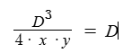

На графике наши формулы будут выглядеть следующим образом

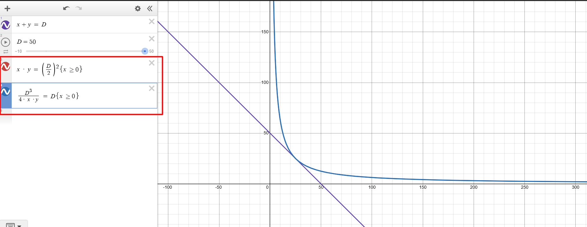

На графике видим, что наша функция гипербола и аналогичная для формулы постоянной произведения двух активов. Синий график перекрывает красный, что говорит об идентичности.

Теперь попробуем посмотреть на графике формулу для двух активов с A не равным нулю.

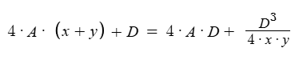

При маленьком значение `A` - это практически формула постоянного произведения.

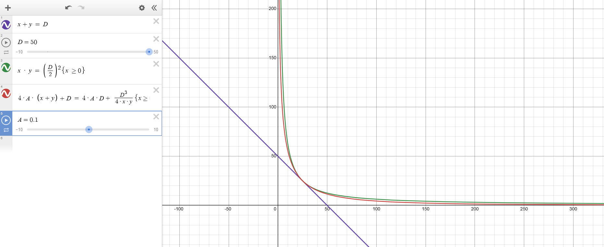

При большом значение `A` - заметно приближение к формуле постоянной суммы.

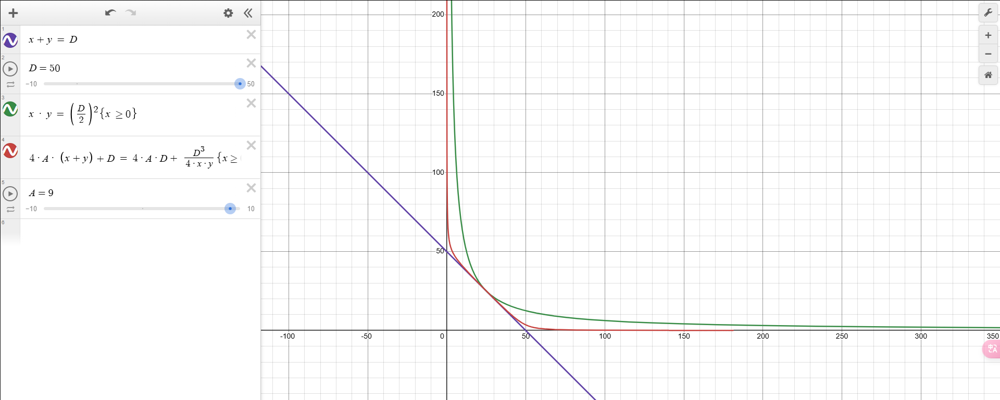

Таким образом мы наглядно посмотрели, каким образом Curve удается лавировать между формулами постоянной суммы и произведения для достижения эффективности обмена стейблкоинов.

## StableSwap exchange

Алгоритм StableSwap объединяет особенности формул постоянной суммы и постоянного произведения, подстраиваясь под эти модели на основе баланса активов в пуле. Мы убедились в этом в предыдущем разделе математики Curve.

Важно то, что протоколу непринципиален тип стейблкоина. Это может быть стейблкоин, привязанный, как к фиату, так и к другим крипто активам.

В зависимости от блокчейна, Curve предоставляет два варианта реализации:
- [StableSwap](https://github.com/curvefi/curve-contract/tree/master/contracts/pools): первоначальная версия смарт-контрактов для реализации пулов.
- [StableSwap-ng](https://github.com/curvefi/stableswap-ng): обновленная версия смарт-контрактов, которая считается следующим поколением.

> Если заглянуть в [deployments](https://github.com/curvefi/stableswap-ng/tree/main/deployments) StableSwap-ng репозитория, то можно увидеть список сетей, в которые была задеплоена эта реализация. На момент написания это: Mantle, XLayer, zkSync и другие.

Дальше посмотрим только на смарт-контракты StableSwap, так как они основные и поддерживаются в большем количестве сетей.

### StableSwap

Технически пул активов реализуется при помощи смарт-контракта, который написан на языке `vyper` и фреймворка [Brownie](https://github.com/eth-brownie/brownie).

Существует три типа пулов Curve:
- **Plain pool**. Это простой пул, который объединяет в себе два и более актива для обмена.
- **Lending pool**. Это пул, который работает с LP токенами различных лендинг протоколов.
- **Metapool**. Это пул, где актив объединяется с LP токеном **plain** пула.

В независимости от типа, пул описывает следующие пользовательские функциональные возможности:
- `exchange()` - обменять один актив на другой
- `add_liquidity()` - добавить ликвидность
- `remove_liquidity()` - забрать ликвидность
- `remove_liquidity_imbalance()` - забрать ликвидность непропорционально
- `remove_liquidity_one_coin()` - забрать ликвидность только в одном активе

Дополнительные функции:

- `_xp()` - преобразует балансы токенов внутри пула к единому decimals. Перед любыми расчетами балансы любых токенов приводится к decimals равному 18.
- `get_D()` - получение значение инварианты. Для вычисления используется [метод Ньютона](https://en.wikipedia.org/wiki/Newton%27s_method), от этого и такие непростые вычисления в формуле. Это можно понять, только вникая в оригинальный whitepaper.
- `get_virtual_price()` - Возвращает стоимость lp токена относительно базовых активов пула
- `calc_token_amount()` - Функция рассчитывает totalSupply при добавление или удаление ликвидности. Но она не определяет количество токена, который будет сминчен или сожжен, так как не учитывает комиссию при несбалансированном пуле.

### Обзор кода пула

У Curve много функционала, который атомарно разделен по множеству репозиториев. Все, что касается обмена стейблкоинами находится в репозитории [curve-contract](https://github.com/curvefi/curve-contract). Нетрудно догадаться, что сами контракты в папочке `./contracts`.

Структура папок выглядит следующим образом:

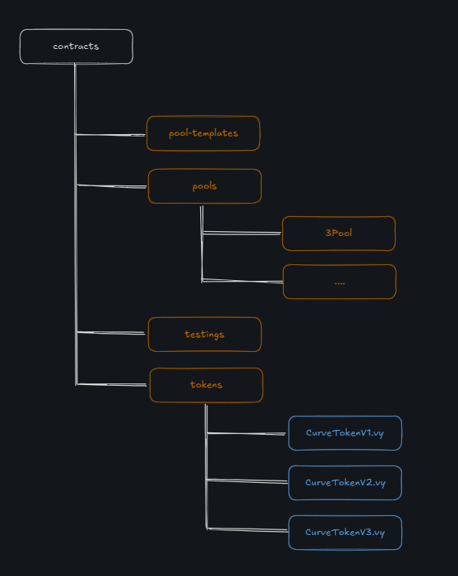

- **pool-templates**. Эталонные шаблоны для смарт-контрактов пулов. Нужны, чтобы быстро развернуть новый пул.
- **pools**. Содержит множество пулов. Для каждого пула соответствует отдельная папка.
- **testings**. Набор смарт-контрактов, которые будут использоваться только для тестирования. Различные моки для токенов и других смарт-контрактов протокола.
- **tokens**. Несколько версий смарт-контракта LP токена для пулов.

Заглянем внутрь папки `3Pool` - первого по списку и одного из самых популярных пулов. Стоит отметить, что пул работает с тремя токенами: DAI, USDC, USDT.

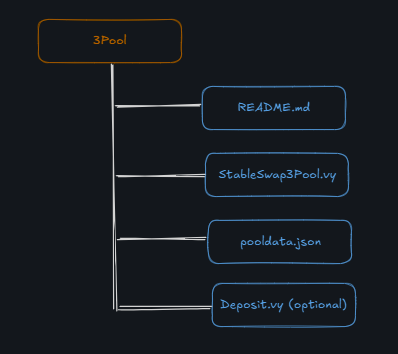

- **Readme.md**. Содержит текстовое описание пула, адреса задеплоенных контрактов.
- **StableSwap3Pool**. Основной смарт-контракт пула, который описывает бизнес логику.
- **pooldata.json**. Содержит техническое описание настроек для пула, которые использовались при деплое смарт-контракта.
- **Deposit.vy**. Дополнительный и необязательный смарт-контракт. Обычно в нем размещается логика по добавлению и удалению ликвидности из пула. Необходим для тех типов пулов, которые уже имеют много кода и необходимо обойти проблему максимального размера смарт-контракта.

Для того, чтобы понять, как работает какой-то конкретный пул, нужно смотреть реализацию внутри папки пула. Мы же пойдем другим путем и будем смотреть шаблоны, так как это актуальный код пула и максимально абстрактный.

Заглянем внутрь папки `pool-templates`:

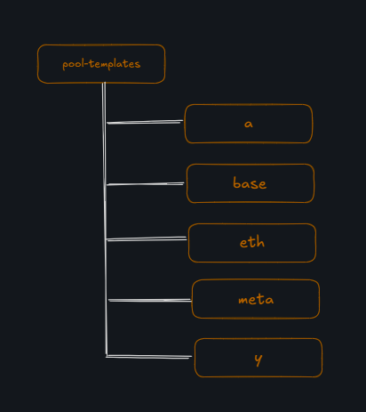

- **a**. Шаблон для реализации пула, содержащего lp токены lending протокола. По типу aTokens для Aave.
- **base**. Шаблон с минимальной реализацией пула.
- **eth**. Шаблон простого пула, поддерживающего ETH.
- **meta**. Шаблон метапула, который поддерживает LP токены обычных пулов Curve.
- **y**. Шаблон для реализации пула, содержащего lp токены lending протокола. По типу yearn.

**Базовый шаблон**

Посмотрим на реализацию базового шаблона пула [SwapTemplateBase.vy](https://github.com/curvefi/curve-contract/blob/master/contracts/pool-templates/base/SwapTemplateBase.vy).

Любой пул начинается с настроек, которые хранятся в виде констант в начале смарт-контракта:

```solidity
N_COINS: constant(int128) = ___N_COINS___ // Количество активов в пуле
PRECISION_MUL: constant(uint256[N_COINS]) = ___PRECISION_MUL___ // Точность для математических операций по каждому активу, чтобы привести все активы к одной точности
RATES: constant(uint256[N_COINS]) = ___RATES___ // Устанавливает обменный курс для каждого актива

FEE_DENOMINATOR: constant(uint256) = 10 ** 10 // Нормализация комиссии протокола
PRECISION: constant(uint256) = 10 ** 18 // Основная точность при вычислениях инварианты, баланса активов

MAX_ADMIN_FEE: constant(uint256) = 10 * 10 ** 9 // Максимальная комиссия протокола, которую сможет установить админ протокола
MAX_FEE: constant(uint256) = 5 * 10 ** 9 // Максимальная комиссия за транзакцию внутри пула
MAX_A: constant(uint256) = 10 ** 6 // Максимальное значение коэффициента усиления
MAX_A_CHANGE: constant(uint256) = 10 // Максимальное значение, обозначающие во сколько раз может увеличиться A

ADMIN_ACTIONS_DELAY: constant(uint256) = 3 * 86400 // Задержка по времени перед применением действия администратора
MIN_RAMP_TIME: constant(uint256) = 86400 // Минимальное время, которое должно пройти до следующего изменения коэффициента A
```

Важно отметить, что ___N_COINS___, ___PRECISION_MUL___, ___RATES___ задаются во время компиляции смарт-контракта. Например ___N_COINS___ будет взят из `pooldata.json` пула. Происходит это дело в [brownie_hooks.py](https://github.com/curvefi/curve-contract/blob/master/brownie_hooks.py#L37).

В vyper, как и в Solidity есть конструктор. Предлагаю на него тоже посмотреть:

```solidity
def __init__(
    _owner: address, // Администратор смарт-контракта, может управлять коэффициентом А, комиссией, уничтожить смарт-контракт
    _coins: address[N_COINS], // Список адресов активов пула
    _pool_token: address, // LP токен пула
    _A: uint256, // Коэффициент усиления
    _fee: uint256, // Комиссия для поставщиков ликвидности
    _admin_fee: uint256 // Комиссия протокола
):
```

Дальше предлагаю пройтись по основным функциям с которыми взаимодействует пользователь.

**Добавление ликвидности**

Для добавления ликвидности необходимо вызвать функцию [add_liquidity()](https://github.com/curvefi/curve-contract/blob/master/contracts/pool-templates/base/SwapTemplateBase.vy#L296). Посмотрим на основные моменты:

```solidity
@external
@nonreentrant('lock')
def add_liquidity(_amounts: uint256[N_COINS], _min_mint_amount: uint256) -> uint256:
    assert not self.is_killed // Проверяем, что смарт-контракт не уничтожен

    amp: uint256 = self._A()
    old_balances: uint256[N_COINS] = self.balances

    // Высчитываем значение инварианты
    D0: uint256 = self._get_D_mem(old_balances, amp)

    lp_token: address = self.lp_token
    token_supply: uint256 = CurveToken(lp_token).totalSupply()
    new_balances: uint256[N_COINS] = old_balances
    for i in range(N_COINS):
        if token_supply == 0:
            assert _amounts[i] > 0 // Обязательно в первый раз вложить все токены пула для инициализации его инварианты
        # balances store amounts of c-tokens
        new_balances[i] += _amounts[i]

    // Пересчитываем инварианту с новыми балансами пула
    D1: uint256 = self._get_D_mem(new_balances, amp)
    // После добавления ликвидности, новое значение инварианты должно быть больше
    assert D1 > D0

    // Теперь нужно пересчитать инварианту D с учетом комиссии
    D2: uint256 = D1
    fees: uint256[N_COINS] = empty(uint256[N_COINS])
    mint_amount: uint256 = 0
    // Если это не первое добавление ликвидности в пул
    if token_supply > 0:
        fee: uint256 = self.fee * N_COINS / (4 * (N_COINS - 1))
        admin_fee: uint256 = self.admin_fee

        for i in range(N_COINS):
            ideal_balance: uint256 = D1 * old_balances[i] / D0
            difference: uint256 = 0
            new_balance: uint256 = new_balances[i]
            if ideal_balance > new_balance:
                difference = ideal_balance - new_balance
            else:
                difference = new_balance - ideal_balance
            fees[i] = fee * difference / FEE_DENOMINATOR
            self.balances[i] = new_balance - (fees[i] * admin_fee / FEE_DENOMINATOR)
            // Записываем балансы активов за вычетом комиссии
            new_balances[i] -= fees[i]
        // Рассчитываем инварианту с учетом комиссии
        D2 = self._get_D_mem(new_balances, amp)
        // Рассчитываем количество lp токена
        mint_amount = token_supply * (D2 - D0) / D0
    // Если это первое добавление ликвидности
    else:
        // Сохраняем значения балансов
        self.balances = new_balances
        // Количество lp токена будет равняться значению инварианты
        mint_amount = D1
    assert mint_amount >= _min_mint_amount, "Slippage screwed you"

    // Аналог вызова safeTransferFrom для того, чтобы переместить активы от пользователя в пул ликвидности
    for i in range(N_COINS):
        if _amounts[i] > 0:
            _response: Bytes[32] = raw_call(
                self.coins[i],
                concat(
                    method_id("transferFrom(address,address,uint256)"),
                    convert(msg.sender, bytes32),
                    convert(self, bytes32),
                    convert(_amounts[i], bytes32),
                ),
                max_outsize=32,
            )
            if len(_response) > 0:
                assert convert(_response, bool)  # dev: failed transfer
            # end "safeTransferFrom"

    // Взамен ликвидности выдаем lp токен
    CurveToken(lp_token).mint(msg.sender, mint_amount)

    log AddLiquidity(msg.sender, _amounts, fees, D1, token_supply + mint_amount)

    return mint_amount
```

**Снятие ликвидности**

Для снятия ликвидности необходимо вызвать одну из трех функций:
- [remove_liquidity()](https://github.com/curvefi/curve-contract/blob/master/contracts/pool-templates/base/SwapTemplateBase.vy#L513C5-L513C21).
- [remove_liquidity_imbalance()](https://github.com/curvefi/curve-contract/blob/master/contracts/pool-templates/base/SwapTemplateBase.vy#L552C5-L552C31)
- [remove_liquidity_one_coin()](https://github.com/curvefi/curve-contract/blob/master/contracts/pool-templates/base/SwapTemplateBase.vy#L704)

Посмотрим на функцию `remove_liquidity()`:

```solidity
@external
@nonreentrant('lock')
// amount - количество lp токена для сжигания
def remove_liquidity(_amount: uint256, _min_amounts: uint256[N_COINS]) -> uint256[N_COINS]:
    lp_token: address = self.lp_token
    total_supply: uint256 = CurveToken(lp_token).totalSupply()
    amounts: uint256[N_COINS] = empty(uint256[N_COINS])

    // Аналог вызова функции transfer() по каждому активу пула для передачи его вызывающему
    for i in range(N_COINS):
        old_balance: uint256 = self.balances[i]
        // Рассчитывается значения для трансфера по каждому активу
        value: uint256 = old_balance * _amount / total_supply
        assert value >= _min_amounts[i], "Withdrawal resulted in fewer coins than expected"
        self.balances[i] = old_balance - value
        amounts[i] = value
        _response: Bytes[32] = raw_call(
            self.coins[i],
            concat(
                method_id("transfer(address,uint256)"),
                convert(msg.sender, bytes32),
                convert(value, bytes32),
            ),
            max_outsize=32,
        )
        if len(_response) > 0:
            assert convert(_response, bool)

    // Сжигаем lp токены поставщика ликвидности
    CurveToken(lp_token).burnFrom(msg.sender, _amount)

    log RemoveLiquidity(msg.sender, amounts, empty(uint256[N_COINS]), total_supply - _amount)

    return amounts
```

Стоит отметить, что два других варианта снятия будут требовать заплатить дополнительную комиссию, но принцип работы точно такой же: рассчитать количество актива для вывода, перевести вызывающему, сжечь lp токен. Дополнительным действием будет расчет нового значения инварианты D, так как пропорция балансов токенов (влияющих на значение D) в пуле будет нарушена.

**Обмен активов**

За обмен активов отвечает функция [exchange()](https://github.com/curvefi/curve-contract/blob/master/contracts/pool-templates/base/SwapTemplateBase.vy#L447). Посмотрим ее код:

```solidity
@external
@nonreentrant('lock')
// i - индекс актива в пуле, который пользователем отправляется на обмен
// j - индекс актива в пуле, который пользователь получит
// _dx - сумма отправляемого пользователем актива
// _min_dy - минимальная сумма получаемого актива на которую согласен пользователь. Для защиты от проскальзывания
def exchange(i: int128, j: int128, _dx: uint256, _min_dy: uint256) -> uint256:
    assert not self.is_killed // Проверяем, что контракт не уничтожен

    old_balances: uint256[N_COINS] = self.balances
    // Получаем список балансов по активам приведенным к единой точности
    xp: uint256[N_COINS] = self._xp_mem(old_balances)

    rates: uint256[N_COINS] = RATES
    // Рассчитываем количество актива в пуле после того, как пользователь добавит этот актив
    x: uint256 = xp[i] + _dx * rates[i] / PRECISION
    // Рассчитываем количество актива в пуле после того, как пользователь заберет его
    y: uint256 = self._get_y(i, j, x, xp)

    // Количество получаемого актива пользователем
    dy: uint256 = xp[j] - y - 1 // Для меня тут магия с округлением
    // Рассчитываем комиссию в выходном активе
    dy_fee: uint256 = dy * self.fee / FEE_DENOMINATOR

    // Рассчитываем реальное значение суммы получаемого пользователем актив с учетом точности актива и за вычетом комиссии.
    dy = (dy - dy_fee) * PRECISION / rates[j]
    assert dy >= _min_dy, "Exchange resulted in fewer coins than expected"

    // Рассчитываем комиссию протокола
    dy_admin_fee: uint256 = dy_fee * self.admin_fee / FEE_DENOMINATOR
    dy_admin_fee = dy_admin_fee * PRECISION / rates[j]

    // Изменяем балансы двух активов в storage смарт-контракта
    self.balances[i] = old_balances[i] + _dx
    self.balances[j] = old_balances[j] - dy - dy_admin_fee

    // Аналог transferFrom(). Переводим актив от пользователя в пул
    _response: Bytes[32] = raw_call(
        self.coins[i],
        concat(
            method_id("transferFrom(address,address,uint256)"),
            convert(msg.sender, bytes32),
            convert(self, bytes32),
            convert(_dx, bytes32),
        ),
        max_outsize=32,
    )
    if len(_response) > 0:
        assert convert(_response, bool)

    // Аналог transfer(). Переводим актив от пула к пользователю
    _response = raw_call(
        self.coins[j],
        concat(
            method_id("transfer(address,uint256)"),
            convert(msg.sender, bytes32),
            convert(dy, bytes32),
        ),
        max_outsize=32,
    )
    if len(_response) > 0:
        assert convert(_response, bool)

    log TokenExchange(msg.sender, i, _dx, j, dy)

    return dy
```

Для того, чтобы до вызова функции обмена можно было понять сколько токена будет получено в ходе обмена есть функция [get_dy()](https://github.com/curvefi/curve-contract/blob/master/contracts/pool-templates/base/SwapTemplateBase.vy#L434), которая возвращает сумму актива за вычетом комиссии.

Она не большая и частично повторяет логику, которая реализована внутри функции `exchange()`:

```solidity
@view // Говорит о том, что функция только для чтения
@external
def get_dy(i: int128, j: int128, _dx: uint256) -> uint256:
    ...

    x: uint256 = xp[i] + (_dx * rates[i] / PRECISION)
    // Аналогичное получение баланса выходного актива, который будет в пуле, после завершения обмена
    y: uint256 = self._get_y(i, j, x, xp)
    dy: uint256 = xp[j] - y - 1
    fee: uint256 = self.fee * dy / FEE_DENOMINATOR

    return (dy - fee) * PRECISION / rates[j]
```

**Изменение коэффициента усиления A**

Для изменения коэффициента предусмотрено две функции: [ramp_A()](https://github.com/curvefi/curve-contract/blob/master/contracts/pool-templates/base/SwapTemplateBase.vy#L742C5-L742C11) и [stop_ramp_A()](https://github.com/curvefi/curve-contract/blob/master/contracts/pool-templates/base/SwapTemplateBase.vy#L765).

Вызывать эти две функции может только администратор пула, что логично, так как этот коэффициент очень важный и влияет на формула обмена активами.

Интересно здесь не столько возможность изменения А, сколько способ. Обратим внимание на параметры, которые принимает функция `ramp_A()`. Их два: **_future_A** (uint256) и **_future_time** (uint256). Приставка future не спроста. Она говорит о том, что значение коэффициента A на смарт контракте должно равняться _future_A значению в момент наступления _future_time. Но это не отложенное изменение, это постепенное изменение коэффициента A во времени. Давайте посмотрим на внутреннюю функцию [_A()](https://github.com/curvefi/curve-contract/blob/master/contracts/pool-templates/base/SwapTemplateBase.vy#L154C5-L154C9), которая возвращает значение коэффициента усиления.

```solidity
@view
@internal
def _A() -> uint256:
    t1: uint256 = self.future_A_time // значение установленное вызовом ramp_A() функции
    A1: uint256 = self.future_A // значение установленное вызовом ramp_A() функции

    // Код ниже говорит о том, что для промежуточного времени между initial_A_time и future_A_time будет рассчитано промежуточное значение A (между initial_A и future_A)
    if block.timestamp < t1:
        A0: uint256 = self.initial_A
        t0: uint256 = self.initial_A_time
        # Expressions in uint256 cannot have negative numbers, thus "if"
        if A1 > A0:
            return A0 + (A1 - A0) * (block.timestamp - t0) / (t1 - t0)
        else:
            return A0 - (A0 - A1) * (block.timestamp - t0) / (t1 - t0)

    else:  # when t1 == 0 or block.timestamp >= t1
        return A1
```

Таким образом, коэффициент усиления A будет плавно изменяться к назначенной дате после вызова функции `ramp_A()`.

Функция `stop_ramp_A()` нужна для того, чтобы остановить заданное изменение коэффициента усиления А в любой момент.

В заключение обзора по шаблону простого пула хочется сказать, что для других типов пулов принцип организации кодовой базы похож, но с доработками. Например для работы lending пула добавляется работы с базовыми токенами. То есть пул содержит в себе lp токены кредитного протокола и для каждого такого токена пул знает его базовый токен. Таким образом пул может принимать ликвидность, как в lp токенах, так и в базовых.

### LP токены

Есть три версии LP токенов для пулов:
- [CurveTokenV1](https://github.com/curvefi/curve-contract/blob/master/contracts/tokens/CurveTokenV1.vy): для Vyper ^0.1.0-beta.16
- [CurveTokenV2](https://github.com/curvefi/curve-contract/blob/master/contracts/tokens/CurveTokenV2.vy): для Vyper ^0.2.0
- [CurveTokenV3](https://github.com/curvefi/curve-contract/blob/master/contracts/tokens/CurveTokenV3.vy): для Vyper ^0.2.0 модифицированная

LP токены минтятся, когда поставляется ликвидность в пул и сжигаются, когда ликвидность забирается. В этом плане ничего необычного.

Третья версия гораздо экономнее по потреблению газа. Плюс она получила две функции управления `allowance`: [increaseAllowance()](https://github.com/curvefi/curve-contract/blob/master/contracts/tokens/CurveTokenV3.vy#L115) и [decreaseAllowance()](https://github.com/curvefi/curve-contract/blob/master/contracts/tokens/CurveTokenV3.vy#L132).

В целом ничего интересного в коде токена нет, это простая реализация ERC-20 стандарта, если не считать, что реализация на `Vyper`. Однако я обратил внимание на забавный факт, точнее [функцию](https://github.com/curvefi/curve-contract/blob/master/contracts/tokens/CurveTokenV3.vy#L189):

```solidity
def set_name(_name: String[64], _symbol: String[32]):
    assert Curve(self.minter).owner() == msg.sender
    self.name = _name
    self.symbol = _symbol
```

Если вы вдруг потеряете в своем кошельке lp токены пула, то знайте, это админ протокола переименовал название и символ LP токена.

### Deposit contract

Пул может взаимодействовать с отдельным контрактом депозита. Этот контракт полезен для двух типов пулов:
- lending: шаблон [DepositTemplateY.vy](https://github.com/curvefi/curve-contract/blob/master/contracts/pool-templates/y/DepositTemplateY.vy)
- meta: шаблон [DepositTemplateMeta.vy](https://github.com/curvefi/curve-contract/blob/master/contracts/pool-templates/meta/DepositTemplateMeta.vy)

Основная причина по-которой появился этот контракт - это существующее ограничение размера смарт-контракта. Для более сложных пулов может потребоваться много логики, которая превышает существующее ограничение. Поэтому контракт депозита позволяет вынести из пула логику по добавлению и удалению ликвидности. А больше в нем ничего нет.

На сам процесс добавления и удаления ликвидности смотреть не будем, он во многом похож на то, что мы рассмотрели для простого пула. Посмотрим на то, как [связан](https://github.com/curvefi/curve-contract/blob/master/contracts/pool-templates/y/DepositTemplateY.vy#L48) смарт-контракт депозита и пула.

```solidity
def __init__(
    _coins: address[N_COINS], // LP токены пула lending протокола или meta пула для обмена
    _underlying_coins: address[N_COINS], // Базовые токены для списка LP токенов обмена
    _curve: address, // Адрес смарт-контракта пула
    _token: address // LP токен текущего пула
):
    ....
```

Таким образом, при деплое, смарт-контракт депозита получает адреса основного пула и всех нужных токенов.

## Обзор всего, что есть в curve

На данный момент мы рассмотрели только обмен стейблкоинов (StableSwap), однако протокол имеет целый ряд интересных вещей. Полный перечень всего, что есть в Curve:
- Curve DAO
- Curve Stablecoin
- Savings crbUSD
- Curve Lending
- CryptoSwap

**Curve DAO**

Для DAO Curve использует [AragonDAO](https://aragon.org/). Но не все-так просто, протокол модифицировал реализацию смарт-контракта [Voting.sol](https://github.com/curvefi/curve-aragon-voting) под себя.

Для того, чтобы принимать участие в голосовании, требуется наличие veCRV (voted-escrowed CRV) токена. veCRV можно получить, если застейкать основной токен протокола CRV. Главный смысл veCRV заключается в линейном уменьшении права голоса пользователя с течением времени.

**Curve Stablecoin**

Это настоящий стейблкоин crvUSD с различным криптовалютным залоговым обеспечением. Имеет уникальный механизм механизм стабилизации цены, называемый LLAMMA (Lending-Liquidating AMM Algorithm). Нужен для повышения децентрализации, увеличения ликвидности (используется в пулах), привлечения новых пользователей.

Любой пользователь может оставить залог и сминтить себе стейблкоин.

**Savings crvUSD или scrvUSD**

scrvUSD предоставляет дополнительную возможность получения процентов для crvUSD. Для получения необходимо застейкать crvUSD в Savings Vault. Помогает удерживать привязку crvUSD. Если бы его не было, то с ростом crvUSD может стать выгодно продать стейблкоин. Однако вместе с crvUSD растет и ставка для scrvUSD, что более привлекательно на большом сроке.

**Curve Lending**

Реализует механизм, который позволяет пользователям занимать crvUSD с мягкой ликвидацией под названием LLAMMA (Lending-Liquidating AMM Algorithm). Позволяет получать вознаграждение тем, кто предоставляет ликвидность. Мягкая ликвидация для заемщиков

**CryptoSwap**

Не только стейблкоины могут принимать участие в обмене. Для активов с динамической привязкой разработана отдельный алгоритм автоматического маркет-мейкера. Суть алгоритма в способности концентрировать ликвидность вокруг одной ценовой точки (Привет Uniswap v3 😅).

## Fees

В Curve реализованы два основных источника комиссии:
- Пулы ликвидности. Комиссия берется с обменов в обычных токенах пула, но иногда и в lp токенах.
- Рынки crvUSD. Проценты с займов.

Комиссия может накапливаться в любых типах токенов, будь то LP или «обычные» токены.

Архитектура сбора комиссии выглядит следующим образом:

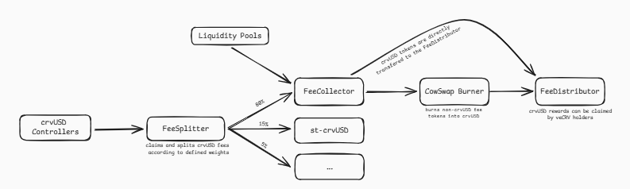

Согласно схеме, хорошо прослеживаются два источника комиссии. Для crvUSD сбор ведется через дополнительный смарт-контракт [FeeSplitter.vy](https://github.com/curvefi/fee-splitter/blob/main/contracts/FeeSplitter.vy). Для пулов ликвидности сбор осуществляется напрямую из пулов ликвидности. Однако на смарт-контракте пула есть только функция [withdraw_admin_fees()](https://github.com/curvefi/curve-contract/blob/master/contracts/pool-templates/base/SwapTemplateBase.vy#L854C5-L854C24) администратора, которая позволяет владельцу пула снять комиссию и как я понимаю до FeeCollector комиссия доставляется вручную.

Процесс сжигания - это по сути процесс конвертации разнородных активов в один `crvUSD` при помощи протокола CowSwap. Необходимо это для честного распределения комиссии между участниками экосистемы Curve. В тех сетях, где нет протокола CowSwap, работает другая схема (классическая), с четко определенными маршрутами обмена и чуть менее гибкой настройкой.

## Curve Wars

> Мы добрались до самой интересной главы. То что будет описано здесь, это действительно уникально и интересно! [Спасибо статье "Field Guide to the Curve Wars: DeFi’s Fight for Liquidity"](https://every.to/almanack/curve-wars). Обязательно прочтите эту статью, если вам понравится моя интерпретация ниже. Однако имейте ввиду, что статья написана в 2022 году и нужна скорее с исторической точки зрения.

Мы определили, что Curve представляет собой рынок ликвидности и стремится агрегировать различного рода ликвидность. Для привлечения ликвидности Curve реализовал несколько механизмов стимуляции и это по-настоящему перетекло в самые настоящие "войны".

Первопричиной войн можно считать систему стимулов вокруг токена управления **CRV**. Этот токен можно получить за предоставление ликвидности в пул наряду с получением LP токенов.

На момент написания статьи, если предоставить ликвидность в самый популярный пул 3Pool (TVL равняется $167.36M), то можно заработать 1.15% годовых.

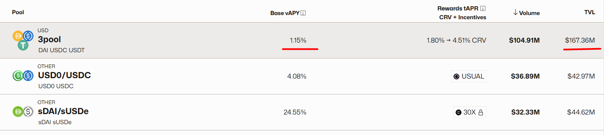

Но если посмотреть внимательнее на скриншот, то можно увидеть колонку **Rewards tAPR**, в которой указано дополнительное вознаграждение в диапазоне от 1.80% до 4.51% в токене CRV. И я хочу сказать, что это достаточно хорошая прибавка.

Однако здесь встает следующая проблема. Протоколу необходимо удерживать стоимость CRV стабильной, а пока выглядит так, что поставщикам ликвидности выгодно сразу сливать CRV, что привело бы к обесцениванию актива. Для того, чтобы этого не произошло существует veCRV.

**veCRV**

В каждом обмене активов в Curve взимается комиссия, часть идет напрямую поставщикам ликвидности, однако вторая часть достается владельца veCRV.

Расшифровывается veCRV, как [Vote Escrowed Curve](https://curve.readthedocs.io/dao-vecrv.html) и существует всего один способ его получить: застейкать CRV. Таким образом, у владельцев CRV появляется дополнительный путь приумножить свои активы, так как выгоднее [застейкать](https://dao.curve.fi/#/ethereum/vecrv/create) и получить veCRV, нежели чем сразу сливать CRV.

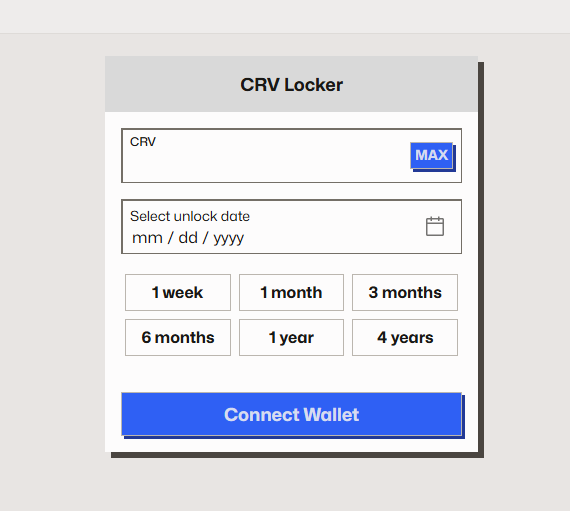

Заблокировать CRV можно с минимальным сроком на 1 неделю и с максимальным сроком на 4 года. Процентная ставка вознаграждения зависит от срока блокировки.

Таким образом veCRV дает хороший пассивный доход. Но это не все! Для владельцев veCRV открывается возможность принимать участие в жизни протокола. А именно голосовать за пулы, в которых будет распределяться CRV. Теоретически, чем больше пул получает голосов, тем больше будут получать стейкеры CRV, тем больше ликвидности будет добавляться в пул. Вот такой круговорот CRV в Curve.

Чтобы понять круговорот, посмотрите на схему ниже:

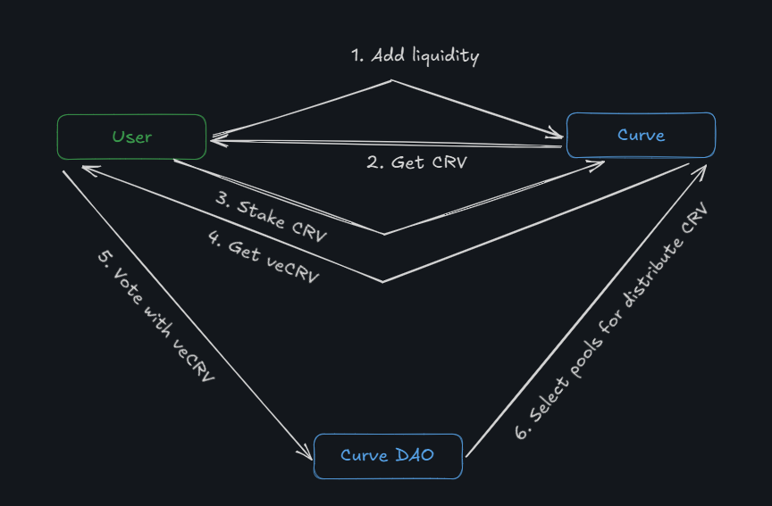

Для протокола, который имеет токен и хочет запустить его на Curve, описанная выше механика имеет огромное значение. Для стабильного и популярного пула, протоколу необходимо внести огромную сумму, чтобы сделать пул ликвидным. Это классический путь, но если у протокола будет достаточно veCRV, то можно проголосовать за свой пул и пул начнет раздавать CRV, что сделает его привлекательным для сторонних поставщиков ликвидности, так как они будут получать CRV и крутить его в Curve для получения дополнительного вознаграждения. И вот здесь и начинаются "войны"!

**Convex Finance**

Считается, что первая битва выиграна протоколом [Convex](https://www.convexfinance.com/). Протокол начинал, как агрегатор доходности на Curve.

Чем больше у нас в наличие veCRV, тем больше мы можем сделать размер вознаграждения CRV в пуле. Но для получения veCRV, нужно вкладывать ликвидность в другие пулы. Замкнутый круг! Convex решил эту проблему, объединив поставщиков ликвидности и их veCRV у себя. Таким образом для того, чтобы получить максимальное вознаграждение, нужно иметь veCRV в Curve или просто прийти в Convex с обычным CRV, вообще не владея veCRV.

Это работает так:

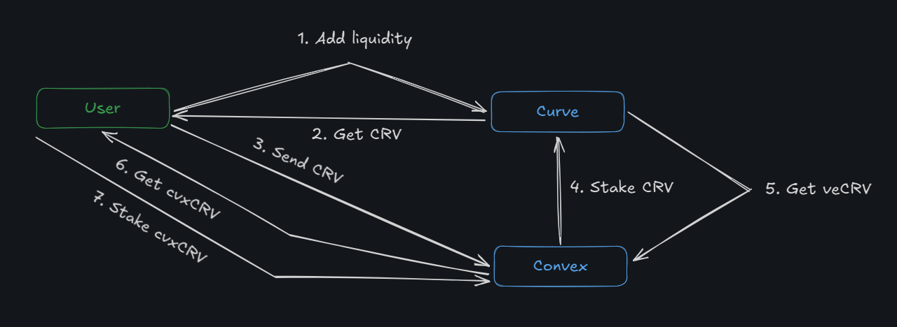

1. Добавляете ликвидность в Curve
2. Получаете CRV. Как альтернатива, можно просто купить CRV
3. Вносите CRV в Convex
4. Convex за вас стейкает CRV в Curve
5. Convex получает veCRV
6. Convex дает вам cvxCRV за место вашего CRV
7. cvxCRV может быть застейкан, чтобы получать долю от того, что Convex заработал на veCRV. Либо cvxCRV можно продать и получить CRV. И это обход 4-x летней блокировки CRV в Curve при сохранение максимального дохода!

Подобная схема позволила Convex объединить в себе большое количество предложения Curve. И чтобы добавить фактор децентрализации у протокола появился токен CVX для использования в голосовании. Как вы думаете за что можно голосовать? Право голоса позволяет принимать решение, как Convex будет использовать полученный veCRV, какие пулы будут получать вознаграждения.

**Взяточничество CVX**

Для протоколов, желающих повысить ликвидность своих токенов, теперь имеет смысл приобретать токены CVX вместо токенов CRV, чтобы использовать их для голосования за свои пулы, поскольку Convex и так уже контролирует большую часть голосов.

И здесь снова есть два пути: купить много CVX самому или заплатить тому у кого этот CVX есть. Поэтому получилось так, что протоколы для листинга своего токена на Curve платят держателям CVX. В плюсе получаются все, у держателей CVX дополнительный доход, протоколам нет необходимости самим покупать CVX, дешевле обратиться к тем у кого он есть.

И на этом можно резюмировать, что войны на Curve окончены. Convex победил! Но теперь получается, что тот кто контролирует veCVX, тот победит в войне Convex. Однако это немножко другая история и требует отдельного погружения и изучения.

## Вывод

Начать финальную главу я бы хотел со сравнительной таблицы:

| | Uniswap v2 | Uniswap v3| Curve |
|-|------------|-----------|----------|
| **Language** | Solidity | Solidity| Vyper |
| **Slippage** | High | Low| Low |
| **Pool** | 2 tokens | 2 tokens | 2 or more |
| **Liquidity** | Both tokens | Depends on position and price | 1 to all (можно забрать или в одном токене или в нескольких) |
| **Liquidity fee** | None | None | Fee on imbalance |
| **Swap fee** | Token in | Token in | Token out |

Я думаю, вы заметили, что Curve, в каком-то роде, диаметральный протоколу Uniswap. Язык смарт-контрактов - vyper, в пуле токенов больше двух, комиссию берет. Я ни на что не намекаю, но это интересно... Curve - это конкурент Uniswap!? Кажется для ответа на этот вопрос нужна отдельная статья.

Curve - это решение для стейблкоинов и не только, включает в себя сложные разновидности пулов с функциональностью lending протоколов, а также метапулы, которые представляют собой пулы, позволяющие обменивать lp токены простых пулов. Мне кажется это инструмент для построения бесконечного слоенного пирога, токены в пул, lp токены в следующий пул и так далее.

Но больше всего, на мой взгляд, Curve интересен своей магией вокруг своего CRV, который стимулирует привлечение ликвидности. И это мы еще не рассматривали глубоко стейблкоин crvUSD и Curve Lending с механизмом ликвидации, известный как LLAMMA (Lending Liquidating Automated Market Maker Algorithm).

С технической точки зрения, мне понравилась документация и whitepaper. Очень хорошо отделяется математика внутри пула и можно легко понять как взаимодействовать с пулом и что происходит после вызова различных функций смарт-контракта. Даже не смотря на то, что с vyper я не знаком и не использую его в своей повседневной жизни. Хорошо документированный протокол приятно изучать!

## Links

1. Официальная техническая [документация](https://docs.curve.fi/)
2. [Protocol Overview](https://curve.readthedocs.io/index.html)
3. Cyfrin courses. [Curve Stableswap](https://updraft.cyfrin.io/courses/curve-v1).
4. [Field Guide to the Curve Wars: DeFi’s Fight for Liquidity](https://every.to/almanack/curve-wars)

