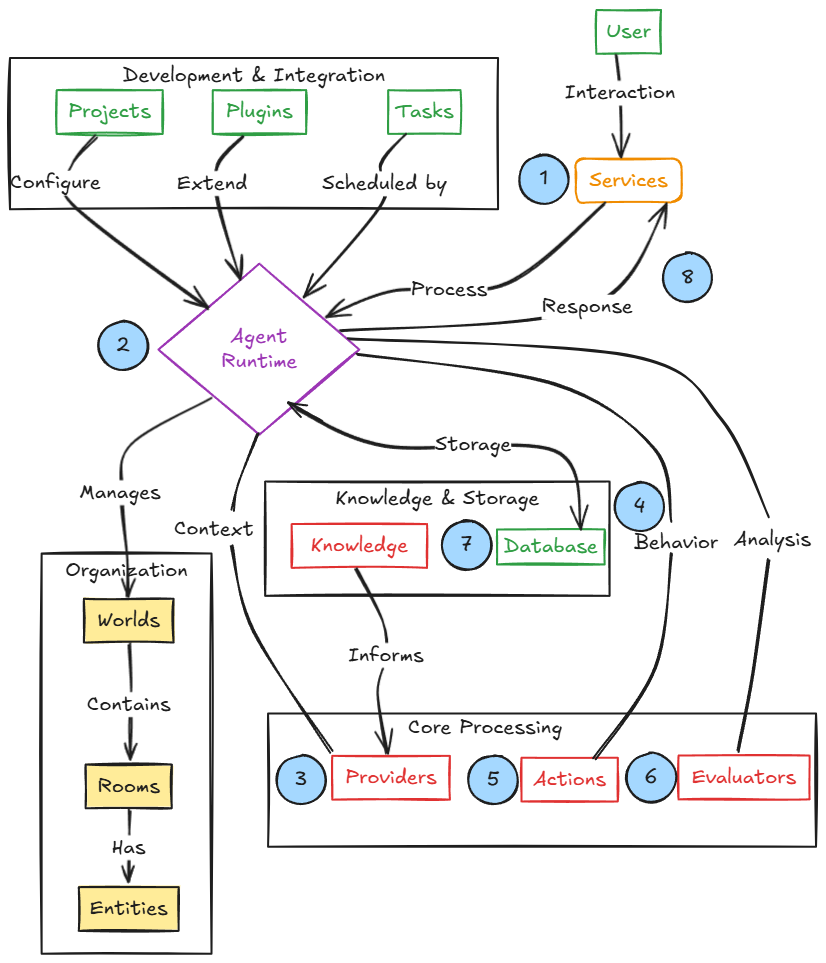
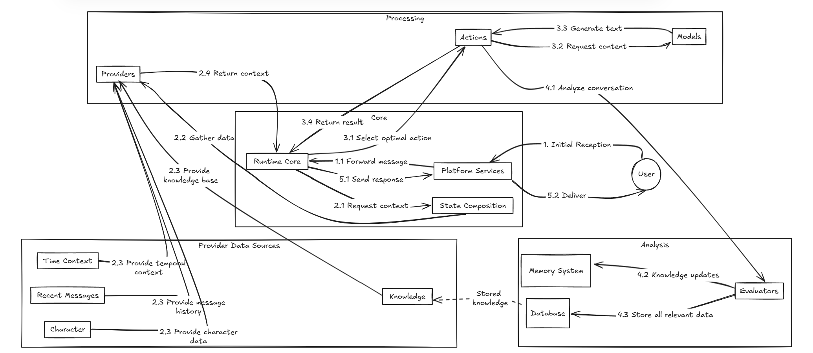

# ElizaOS v2

**Автор:** [Алексей Куценко](https://github.com/bimkon144) 👨‍💻

ElizaOS — это open-source фреймворк написанный полностью на TypeScript для создания автономных AI-агентов, которые умеют взаимодействовать с:

- **Социальными сетями**: Discord, Telegram, X, создавая персонализированные боты для общения с пользователями
- **Web3-инфраструктурой**: DeFi-протоколы, NFT-платформы для выполнения транзакций и управления активами
- **Внешними сервисами**: GitHub, API различных платформ

Каждый агент — это своего рода "живой" runtime-компаньон, у которого есть память, мозг (LLM) и расширяемые возможности через систему плагинов.

Большинство ончейн-автоматизаций — это stateless-боты и скрипты, которые просто реагируют на события. У них нет памяти, доступа к внешним данным или способности планировать — только жёсткая логика и прямые вызовы.

ElizaOS превращает простых ботов в полноценных автономных агентов с возможностью обучения и принятия решений.

Результат — полноценные digital-сущности, которые могут, например, в автоматическом режиме:

* анализировать блокчейн-данные,
* голосовать за DAO-предложения,
* управлять портфелем активов,
* общаться в X/Telegram от имени проекта,
* генерировать аудио/видео материалы

## История и эволюция

[ElizaOS](https://eliza.how/) зародилась как AI16z — первый в мире хедж-фонд, управляемый искусственным интеллектом. Проект стартовал в октябре 2024 года как отсылка к [a16z](https://a16z.com/), крупной американской венчурной компании, которая инвестирует в технологические стартапы. Проект быстро начал набирать обороты, выйдя за пределы шутки: AI-агенты не просто управляли токенами и аккаунтами, а начали демонстрировать реальные механизмы координации и принятия решений.

Уже в начале 2025 года стало очевидно, что проект выходит на новый уровень — как технически, так и репутационно. Чтобы избежать юридических и имиджевых конфликтов с настоящим a16z, команда приняла решение о переименовании в ElizaOS. Новый бренд стал отражением перехода от экспериментального MVP к целенаправленной разработке инфраструктуры для автономных AI-агентов.

С тех пор ElizaOS прошла быстрый цикл эволюции. Архитектура стала более модульной, улучшилось взаимодействие агентов с Web3-средами, управление ресурсами было унифицировано, и проект начал привлекать активное сообщество разработчиков. Переход ко второй версии системы сопровождался ростом экосистемы, запуском грантового фонда и появлением десятков новых AI-интеграций.

На сегодняшний день ElizaOS — это не просто фреимворк для создания агентов, а развивающаяся операционная система для децентрализованных, автономных и координируемых AI-сущностей в Web3-пространстве.

## Архитектура и компоненты

Рассмотрим архитектуру и флоу работы протокола.



На основании схемы можем выделить:

**Core Components**:

- Agent Runtime — Главный компонент агента. Он отвечает за работу с базой данных и координирует другие компоненты.
- Services — Компонент, который позволяет подключать агентов к внешним сервисам. По сути, является входным каналом для коммуникации с агентами. Например, Discord, X, Telegram.
- Database — это место, где агент хранит всё, что ему нужно помнить. Например, с кем он общался, что происходило, какие команды выполнял, как связаны разные участники, и настройки его работы.

**Intelligence & Behavior**:

- Actions —  Это то, что агент умеет делать: отправлять транзакции, отвечать на вопросы, генерировать контент и тд.
- Providers — Это компоненты, которые формируют контекст для LLM-модели агента. Они собирают и структурируют релевантную информацию (например, данные пользователя, предыдущие сообщения, состояние системы), чтобы агент мог принимать решения с учетом всего необходимого контекста.
- Evaluators — Это когнитивные компоненты, которые анализируют диалоги агента после их завершения, извлекают важные факты и закономерности, и обновляют базу знаний агента. Они помогают агенту самостоятельно учиться и совершенствоваться на основе прошлого опыта.
- Knowledge — Это система структурированного хранения информации и долговременной памяти агента. Она обеспечивает сохранение фактов, выводов и персонализированных данных, чтобы агент мог использовать их в будущих взаимодействиях.

**Structure & Organization**:

- Worlds — Как «отдельные миры» или проекты, внутри которых работает агент. Похоже на сервера в Discord или рабочие области.
- Rooms — Каналы внутри мира, где проходят конкретные обсуждения — как чаты, каналы или отдельные задачи.
- Entities — Все участники внутри комнат: пользователи, агенты, боты и любые другие сущности, с которыми можно взаимодействовать.

**Development & Integration**:

- Plugins —  Плагины, которые позволяют агенту делать определенные действия. Например, есть плагины, которые позволяют работать с блокчейном или отправлять сообщения в Telegram.
- Projects — Готовые сборки агентов, которые можно использовать. Они уже настроены, с плагинами, памятью, ролями и логикой.
- Tasks — Планировщик. С его помощью агент может запускать действия по расписанию или откладывать задачи на потом (Например задать агенту проверять цену на ETH каждый день и дать сигнал при наступлении нужной цены, или даже купить).

Флоу работы согласно схеме:

1. **Service Reception**: Пользователь отправляет сообщение через платформу (например, пишет в Discord чат, отправляет сообщение в Telegram) и агент получает сообщение
2. **Runtime Processing**: главный компонент координирует процесс генерации ответа
3. **Context Building**: Провайдеры предоставляют контекст
4. **Action Selection**: Агент оценивает и выбирает подходящие `actions`
5. **Response Generation**: Выбранные `actions` формируют ответ
6. **Learning & Reflection**: Оценщики изучают диалог, чтобы понять, что можно улучшить, и использовать это для дообучения модели
7. **Memory Storage**: Новая информация сохраняется в базе данных (история взаимодействий, результаты анализа, и др.)
8. **Response Delivery**: Ответ отправляется обратно к пользователю через сервис

Что это даёт? Таким образом, реализуется непрерывный цикл функционирования системы: взаимодействие → анализ → совершенствование. Этот механизм обеспечивает агентам возможность постоянно учиться и совершенствоваться в ходе взаимодействия.

Стало немного понятно, но остались вопросы. Для этого следует детальнее разобрать самые важные компоненты в работе.

### Service

Сервис выступает прослойкой между Eliza агентами и платформами, такими как Discord, Telegram.

Сервисы отвечают за интеграцию с конкретными платформами (например, обработку сообщений в Discord или постов в X).

Один агент может управлять сразу множеством сервисов и сохраняет контекст отдельно для каждой платформы.

Полный перечень действующих сервисов и их возможности можно посмотреть [здесь](https://eliza.how/docs/core/services).

### Agent Runtime

Как уже говорили, это главный компонент, который принимает сообщения от `service` и занимается управлением цикла обработки и ответа на сообщение или команду пользователя.

Рассмотрим детальную схему работы:


1. Начальный прием:
    Пользователь отправляет сообщение, которое принимается **Platform services**

2. Построение контекста:

    2.1. **Runtime Core** запрашивает контекст у системы **State Composition**

    2.2. **State Composition** собирает данные из различных провайдеров

    2.3. Провайдеры получают необходимые данные из источников (Пользователь, База знаний, Недавние сообщения и др.)

    2.4. Полный контекст возвращается в **Runtime Core**

3. Обработка действий:

    3.1. **Runtime Core** определяет применимые **Actions** и выбирает оптимальное

    3.2. Выбранное действие может запросить генерацию контента у Моделей (Таких как GPT)

    3.3. Модели генерируют ответ

    3.4. Результат действия возвращается в **Runtime Core**

4. Обучение и сохранение:

    4.1. Разговор анализируется **Evaluators** для выявления значимых выводов и фактов

    4.2. Обновления **Knowledge** отправляются в **Memory System**

    4.3. Все релевантные данные сохраняются в **Database**

5. Доставка ответа:

    5.1. Финальный ответ отправляется обратно в **Platform services**

    5.2. Ответ от **Platform services** отправляется пользователю

Возникает вопрос, а как агент понимает, какой подходящий Action использовать для запроса?

### Actions

Является одним из главных компонентов, который определяет, как агенты реагируют на сообщения и выполняют задачи. Это может быть как простой текстовый ответ, заранее заготовленный, ответ LLMs (например, GPT), либо выполнение команды (например, отправка транзакции в блокчейн). Каждый Action выполняет какое-то одно действие. Но возможно использовать связку из `action`.

Структура Action:

```javascript
name:  Уникальный идентификатор
similes: Альтернативные имена/триггеры
description: Объяснение назначения и использования
validate: Функция, которой проверяется, что action подходящий
handler:  Основная логика реализации, которая будет выполняться при выборе этого action
examples: Примеры использования
suppressInitialMessage: флаг, который показывает, нужно ли агенту сразу дать ответ до выполнения action или просто начать готовить ответ. Нужно, когда агент будет выполнять несколько actions вместе, и нет необходимости в промежуточных ответах.
```

Базовый шаблон который можно использовать:

```javascript
const customAction: Action = {
  name: 'CUSTOM_ACTION',
  similes: ['ALTERNATE_NAME', 'OTHER_TRIGGER'],
  description: 'Detailed description of when and how to use this action',

  validate: async (runtime: IAgentRuntime, message: Memory, state?: State) => {
    // Проверка, что можно выбрать этот action.
    return true;
  },

  handler: async (
    runtime: IAgentRuntime,
    message: Memory,
    state?: State,
    options?: any,
    callback?: HandlerCallback
  ) => {
    // Логика обработки действия
    const responseContent = {
      thought: 'Internal reasoning about what to do (not shown to users)',
      text: 'The actual message to send to the conversation',
      actions: ['CUSTOM_ACTION'],
    };

    if (callback) {
      await callback(responseContent);
    }

    return true;
  },

  examples: [
    [
      {
        name: '{{name1}}',
        content: { text: 'Trigger message' },
      },
      {
        name: '{{name2}}',
        content: {
          text: 'Response',
          thought: 'Internal reasoning',
          actions: ['CUSTOM_ACTION'],
        },
      },
    ],
  ],
  
  suppressInitialMessage: true,
};
```

Таким образом, флоу работы и исполнения actions:

1. Все доступные Actions проверяются на применимость к текущему сообщению через функцию `validate`
2. Валидные actions форматируются и включаются в контекст агента, который получен ранее от провайдеров
3. LLM принимает решение, какие actions выполнить на основе сообщения пользователя и контекста
4. Далее, выполняется последовательность из Actions через функцию `handler`

Ну и после завершения обработки ответа, **Evaluators** извлекает новые факты от общения с юзером и записывает **Memory System** и **Database**.

Таким образом создаётся эффективный цикл обучения и совершенствования агента.

Чтобы не писать свои actions, можно использовать уже готовые, их называют плагинами. Вы можете создать плагин или подключить уже существующие.

### Plugins

Изначально существует core плагин, называемый `Bootstrap`.

Он идёт как база в elizaOs, который состоит из известных уже нам компонентов, таких как Actions, Providers, Service, Evaluators. Его код не рекомендуют править.

```javascript
export const bootstrapPlugin: Plugin = {
  name: 'bootstrap',
  description: 'Agent bootstrap with basic actions and evaluators',
  actions: [...],
  events: {...},
  evaluators: [...],
  providers: [...],
  services: [TaskService, ScenarioService],
};
```

Данный плагин, по сути, инициализирует минимальный функционал для возможности работы агентов.

Таким образом, все остальные плагины просто добавляют дополнительные actions, events, evaluators  и тд.

ElizaOs поддерживает регистр из плагинов, которые вы легко можете добавить в свой проект.

Если же вы хотите создать свой и поделиться с сообществом, то можно создать [pull request](https://github.com/elizaos-plugins/registry?tab=readme-ov-file#pull-request-requirements).

Посмотреть доступные плагины можно [тут](https://eliza.how/docs/awesome-eliza#-plugins).

На данный момент мы выяснили, как проходит путь от сообщения до формирования ответа.

Рассмотрим каким образом следующий компонент проводит анализ и записывает данные для последующих запросов.

### Evaluators

Evaluators — это когнитивные компоненты ElizaOS, ответственные за анализ диалогов, извлечение знаний и построение понимания после обработки основного ответа агентом. В отличие от Actions, которые генерируют видимые пользователю ответы, Evaluators выполняют фоновые когнитивные задачи и формируют как раз тот самый `Knowledge` и `Memory System` агента.

Структура интерфейса:

```javascript
interface Evaluator {
  name: string;        // Уникальный идентификатор
  similes?: string[];  // Альтернативные названия
  description: string; // Описание назначения
  examples: EvaluationExample[]; // Примеры использования
  handler: Handler;    // Логика реализации
  validate: Validator; // Проверка критериев запуска
  alwaysRun?: boolean; // Запуск независимо от валидации
}
```
Ключевые типы Evaluators:

1.  Fact Evaluator:
    - Отвечает за формирование "эпизодической памяти" агента, извлекая из разговоров:
    - Facts: Неизменные истины ("Пользователь живет в Москве")
    - Status: Временные состояния ("Пользователь работает над проектом")
    - Opinions: Субъективные мнения ("Пользователь предпочитает TypeScript")
2. Reflection Evaluator:
    - Генерирует саморефлексивные мысли о качестве разговора
    - Извлекает факты
    - Идентифицирует и отслеживает отношения между сущностями (Общение одного юзера с другим)

Получается, что компонент обновляет базу знаний `Knowledge`, сохраняет результаты анализа для будущего использования в `Memory System`, а в свою очередь это позволяет агентам непрерывно обучаться на основе взаимодействий, аккумулируя знания и корректируя поведение, что создает эффект долговременной персонализации и адаптации к пользователям.

## Потенциальные сценарии использования

На основе существующей экосистемы плагинов и интеграций ElizaOS, можно реализовать множество практических сценариев:

**DeFi Портфельный Менеджер**

Агент, который на базе плагинов для работы с блокчейнами (EVM, Solana, Avalanche) и криптобиржами:
- Мониторит состояние портфеля в разных сетях
- Отслеживает возможности для арбитража между DEX
- Выполняет транзакций через 1inch
- Защищает от MEV-атак через приватные мемпулы
- Отправляет уведомления через Telegram о изменениях на рынке
- Анализирует безопасность новых токенов через GoPlus и Quick Intel плагины

**DAO Координатор**

Агент, который помогает управлять децентрализованными организациями:
- Мониторит предложения в Snapshot и выдаёт их анализ
- Создаёт резюме дискуссий из Discord и Telegram групп
- Взаимодействует с мультисигом через плагины кошельков
- Публикует отчёты о голосованиях в социальных сетях через Twitter плагин
- Проверяет безопасность смарт-контрактов через интеграции с аудитами
- Генерирует контент для комьюнити через медиа-плагины (изображения, видео)

**AI Маркетолог для Web3 проектов**

Агент для продвижения проектов в Web3 пространстве:
- Создаёт и публикует контент в социальных сетях (Twitter, Lens, Farcaster)
- Анализирует тренды через плагины новостей и Web Search
- Генерирует графический контент через плагины изображений и 3D Generation
- Взаимодействует с комьюнити в Discord и Telegram
- Отслеживает активность и метрики проекта в различных сетях
- Выдаёт аналитику и рекомендации по корректировке стратегии

**NFT Community Manager**

Агент для управления NFT-сообществами:
- Отвечает на вопросы в Discord через соответствующие интеграции
- Генерирует персонализированный контент для держателей NFT
- Отслеживает активность коллекции на маркетплейсах
- Организует автоматические выдачи наград и аирдропы
- Создаёт потоковый контент с помощью плагинов генерации музыки (Suno) и изображений
- Хранит данные коллекций через децентрализованные хранилища (IPFS)

**Исследовательский Ассистент**

Агент, помогающий в исследованиях криптопроектов:
- Собирает данные из множества источников через плагины Web Search и News
- Анализирует блокчейн-транзакции через EVM и другие плагины
- Готовит отчёты и выгружает их в различных форматах (PDF)
- Проводит сравнительный анализ токеномики разных проектов
- Преобразует YouTube-видео в текстовые конспекты

Способов применения огромное множество благодаря модульной архитектуре и обширной экосистеме плагинов, которая постоянно растёт и развивается.

## Заключение

После разбора архитектуры ElizaOS становится ясно, почему эта технология вызывает интерес. В первую очередь подкупает структура с четким разделением компонентов — это дает гибкость при настройке и масштабировании. Благодаря плагинам не нужно переписывать основной код, можно просто расширять функционал по мере необходимости.

Интеграция с разными LLM (GPT-4, Claude и другими) — еще один плюс системы. Агенты получают мощные инструменты для анализа и принятия решений. А если добавить сюда память и контекст, получаются действительно адаптивные помощники, а не просто наборы инструкций.

Механизмы обучения тоже заслуживают внимания. Система с Evaluators и Memory System позволяет агентам учиться на каждом взаимодействии, запоминая полезную информацию и улучшая качество ответов со временем. Такой подход сильно отличает ElizaOS от обычных ботов — агенты становятся лучше, чем больше с ними работаешь.

Способов применения огромное множество. Начиная от создания агента помощника который будет генерировать посты в соцсети, до агента который будет заниматься арбитражем либо взаимодействовать с комьюнити в Discord.

## Ссылки

- [GitHub](https://github.com/elizaOS/eliza)
- [Docs](https://eliza.how/docs/intro)
- [Plugins](https://eliza.how/docs/awesome-eliza#-plugins)
- [How to add plugin](https://eliza.how/blog/add-plugins)
- [Registy of plugins](https://github.com/elizaos-plugins/registry)
- [Services](https://eliza.how/docs/core/services)
- [Generate agent character](https://github.com/elizaOS/characterfile)
- [Guide on X agent](https://eliza.how/blog/twitter-agent-guide)
- [ElizaOs DAO](https://www.elizaos.ai/dao)