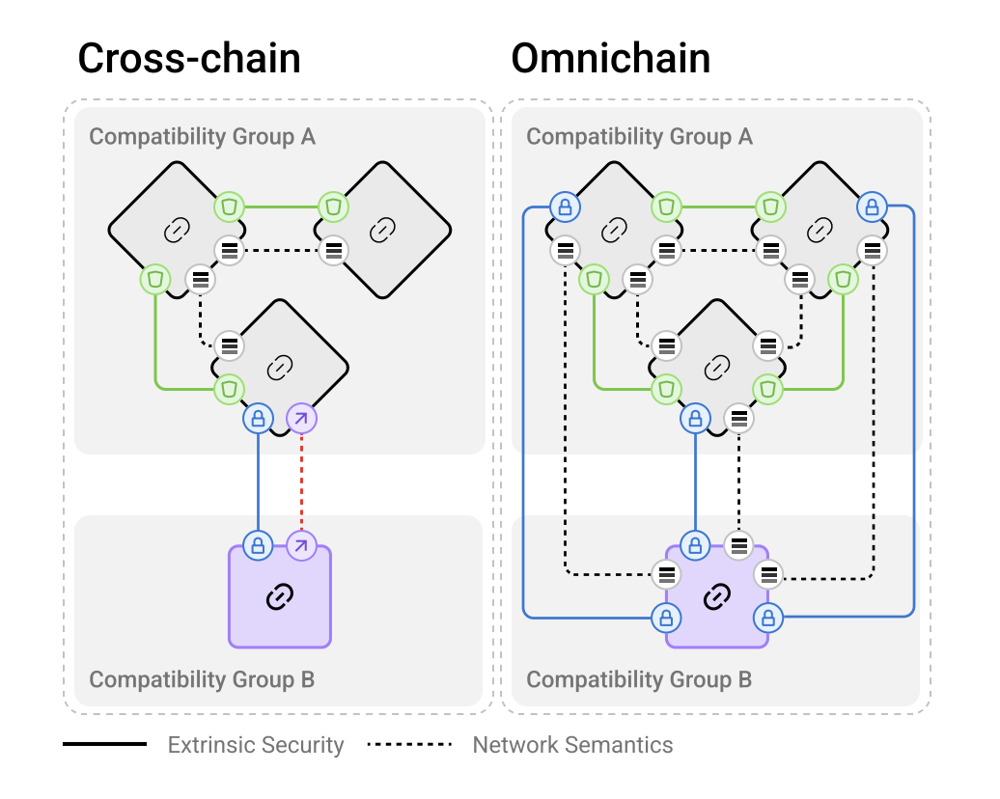
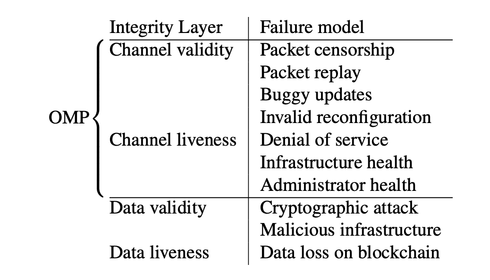
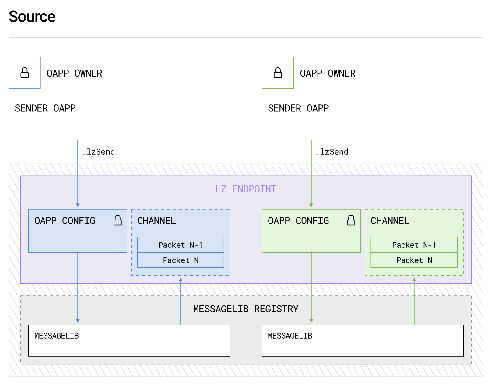
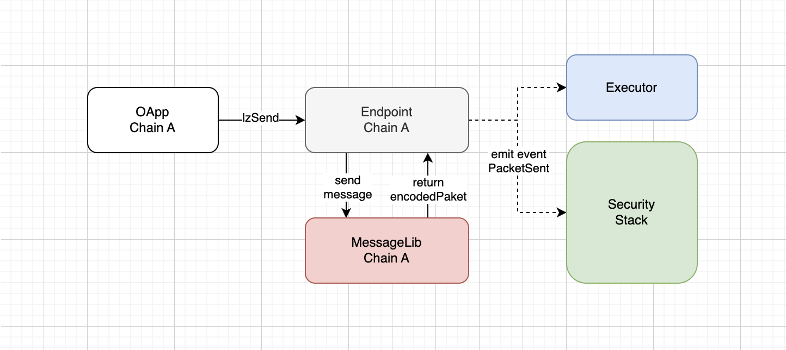
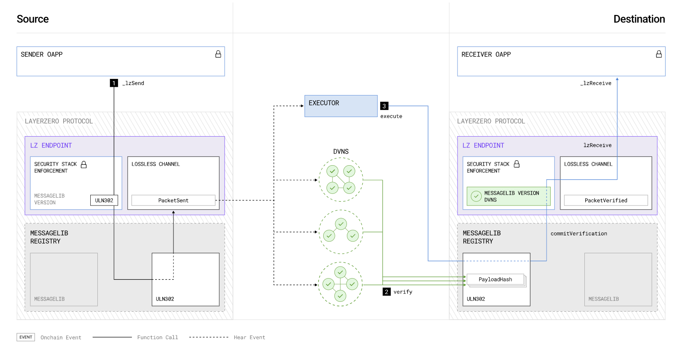
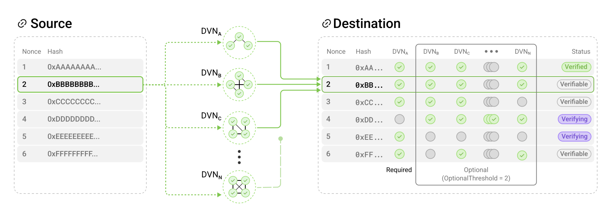
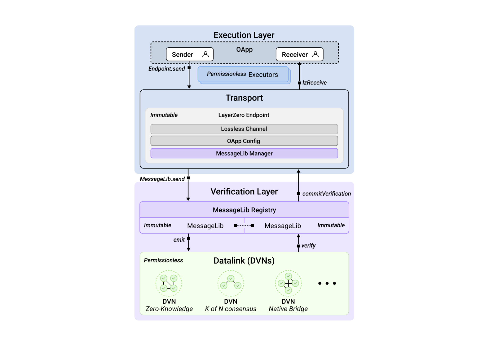
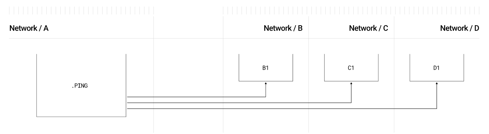
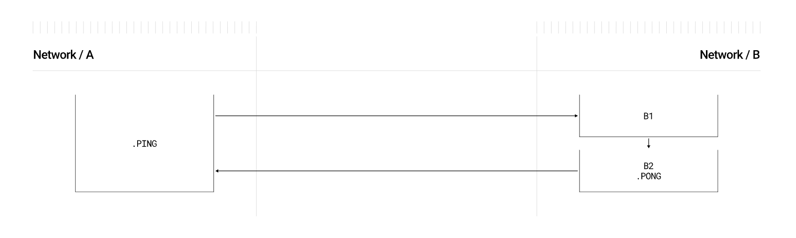

# LayerZero v2

**Автор:** [Роман Ярлыков](https://github.com/rlkvrv) 🧐

LayerZero — это неизменяемый, устойчивый к цензуре и не требующий разрешений протокол, который позволяет любому пользователю блокчейна отправлять, проверять и исполнять сообщения в поддерживаемой сети назначения.

Так написано в документации, но что это значит на самом деле, понять непросто. LayerZero НЕ является отдельным блокчейном или мостом между ними. Более того, как утверждает Брайан Пеллегрино (CEO LayerZero Labs), это не стандарт обмена сообщениями между блокчейнами, а протокол для передачи данных (которые передаются в виде сообщений). Помимо обмена данными, протокол также предоставляет инфраструктуру для выполнения и проверки этих данных в процессе транспортировки.

Глобально протокол предлагает своё видение децентрализованного решения проблемы интероперабельности блокчейнов с акцентом на расширяемость, гибкость в настройках безопасности и разделение функциональности проверки данных и их исполнения, что выгодно отличает его от других решений. Вторая версия протокола позиционирует себя как omnichain-решение (Omnichain Messaging Protocol — OMP).

> Интероперабельность (от англ. interoperability — способность к взаимодействию) — это способность продукта или системы с полностью открытыми интерфейсами взаимодействовать и функционировать с другими продуктами или системами без ограничений доступа и реализации.

_Примечание:_ Подробнее об интероперабельности, подходах к её решению, а также о разнице между cross-chain, multichain и omnichain можно почитать в [этой](https://hackernoon.com/omnichain-vs-multichain-vs-crosschain-what-are-they) статье.

Если коротко, **cross-chain** — это про взаимодействие двух различных блокчейнов через мосты; **multichain** подразумевает развертывание конкретного DApp в различных блокчейнах, сюда же относятся и модульные блокчейны; **omnichain** — это создание базового уровня (Layer 0), поверх которого могут быть расположены различные блокчейны и DApps. Преимуществом omnichain-решений является универсальная логика передачи сообщений и гибкая настройка безопасности для каждой отдельной сети.

    
*Отличия cross-chain и omnichain. Источник: LayerZero v2 whitepaper.*

На изображении показаны два подхода:

- **Cross-chain** (слева): Здесь сети соединяются через отдельные мосты между цепочками. Важный момент — каждая связь должна настраиваться индивидуально, а взаимодействие между разными группами совместимости (например, "Compatibility Group A" и "Compatibility Group B") требует дополнительных уровней безопасности и интеграций. По сути, это разрозненные соединения между цепочками, что увеличивает сложность управления связями и безопасностью.

- **Omnichain** (справа): В этом подходе каждая цепочка может напрямую взаимодействовать с любой другой в сети через единые сетевые семантики. В LayerZero это означает, что каждая связь между цепочками унифицирована, но безопасность для каждой связи настраивается может настраиваться индивидуально.

## Принципы LayerZero

Во главу OMP (Omnichain Messaging Protocol) поставлены два основных принципа: безопасность и универсальная семантика.

### Безопасность

Безопасность делится на внутреннюю (или встроенную) и внешнюю. Большинство протоколов реализуют только внешнюю безопасность, игнорируя внутреннюю. 

**Внутренняя безопасность** включает в себя несколько ключевых инвариантов:

1. **Lossless** (доставка "без потерь" или устойчивость к цензуре) — гарантия того, что сообщение сохранит целостность и будет доставлено без потери или изменения данных.
2. **Exactly-once** (невозможность повторного выполнения) — одно сообщение может быть обработано получателем только один раз.
3. **Eventual delivery** (живучесть) — сообщение будет доставлено в конечном итоге, даже если возникли временные сбои на каком-то из этапов.

**Внешняя безопасность** охватывает остальные аспекты, такие как алгоритмы подписей и верификации. Этот слой может настраиваться и изменяться в зависимости от потребностей конкретного приложения.

Целостность протокола делится на два уровня: целостность канала передачи данных и целостность самих данных. Каждый из этих уровней включает в себя два аспекта — корректность (validity) и живучесть (liveness). Внутренняя безопасность отвечает за корректность и живучесть канала, а внешняя безопасность — за корректность данных. В whitepaper приведена следующая таблица:



*Примечание:* Под пакетом (packet) подразумевается набор данных для передачи. Подробнее об этом позже.

Все это формирует модульный стек безопасности (Security Stack), который настраивается индивидуально для каждого OApp (omnichain application). Это сделано в противовес монолитным системам, где изменение одного фрагмента кода может поставить под угрозу весь протокол.

Преимуществом является и то, что изменения в стеке безопасности осуществляются только по решению владельца OApp. Такие обновления изолированы, что предотвращает сбои всей системы в случае ошибок и уязвимостей в обновлениях. LayerZero использует подход неизменяемости кода — обновления накатываются через новые версии модулей, которые внедряются безопасным способом, а старые версии остаются в рабочем состоянии и никогда не удаляются.

### Универсальная семантика

Протокол должен быть универсальным в своей структуре, чтобы поддерживать любой блокчейн и обеспечивать единое поведение для всех взаимодействий.

LayerZero стремится стандартизировать взаимодействие между блокчейнами. Приложения, работающие на LayerZero, не должны зависеть от особенностей отдельных блокчейнов, будь то EVM или не-EVM совместимые цепочки. Универсальная семантика включает два ключевых аспекта:

- **Execution semantics** (Семантика исполнения или логика функций OApp): Семантика выполнения должна быть не зависящей от цепочки и достаточно выразительной, чтобы позволить любую функциональность, требуемую OApp. Это делает протокол независимым от особенностей каждой цепочки.
- **Interface unification** (Унификация интерфейсов): Должен быть унифицированный интерфейс для передачи сообщений между блокчейнами, что устраняет необходимость в разработке уникальных решений для каждой новой цепочки и позволяет OApp быстрее масштабироваться.

Отсутствие унифицированных интерфейсов и семантики передачи сообщений усложняет разработку приложений, работающих на нескольких блокчейнах. LayerZero решает эту проблему, позволяя разработчикам не учитывать особенности каждой цепочки отдельно.

## Архитектура

Базовая идея и цель протокола LayerZero очень проста — доставить сообщение из одного блокчейна в другой, при этом сделать это максимально безопасно и надежно. Сообщение содержит данные (payload) и информацию по маршрутизации этих данных (routing information).

  
*Верхнеуровневое представление передачи сообщения. Источник: Документация LayerZero.*

### Endpoint

Все начинается с OApp в исходной сети и заканчивается в OApp сети назначения. Основным интерфейсом для OApp является смарт-контракт [Endpoint](https://github.com/LayerZero-Labs/LayerZero-v2/blob/main/packages/layerzero-v2/evm/protocol/contracts/EndpointV2.sol).

  
*Взаимодействие с Endpoint.*

Endpoint обрабатывает входящие и исходящие сообщения, все сообщения в процессе отправки оборачиваются в пакеты.

Пакет состоит из заголовка (header) и тела (body). Заголовок включает информацию по маршрутизации и служебные данные, а тело содержит передаваемые данные.

  
*Структура пакета. Источник: LayerZero v2 whitepaper.*

*Примечание:* Packet version добавляется на [другом этапе](https://github.com/LayerZero-Labs/LayerZero-v2/blob/7aebbd7c79b2dc818f7bb054aed2405ca076b9d6/packages/layerzero-v2/evm/messagelib/contracts/uln/LzExecutor.sol#L80) обработки, который будет рассмотрен позже. // TODO рассмотрен?

*Примечание:* GUID используется для отслеживания статуса сообщения и вызова действий как в офчейн, так и в ончейн-операциях.

**Endpoint** выполняет следующие задачи:
1. **Оплата транзакции**: Взимает с OApp оплату за транзакцию в нативной валюте сети или в токене ERC20 (`lzToken`).
2. **Подготовка пакета для отправки**: Состоит из нескольких этапов:
   - **Присвоение nonce и GUID**: Присваивает уникальный номер (nonce) каждому сообщению для его однократного исполнения и [генерирует](https://github.com/LayerZero-Labs/LayerZero-v2/blob/7aebbd7c79b2dc818f7bb054aed2405ca076b9d6/packages/layerzero-v2/evm/protocol/contracts/libs/GUID.sol#L10) GUID для отслеживания этого сообщения. GUID — это `keccak256(nonce, srcId, sender, dstId, receiver)`, где `srcId` и `dstId` — идентификаторы сети (их ввели, потому что не у всех блокчейнов есть chainId).
   - **Сериализация сообщения и формирование пакета**: Преобразует сообщение (payload и routing information) в сериализованный пакет для отправки через протокол LayerZero.
        ```solidity
        struct Packet {
            uint64 nonce; // уникальный номер транзакции, всегда увеличивается на один и идет по порядку
            uint32 srcEid; // идентификатор исходной сети
            address sender; // адрес отправителя
            uint32 dstEid; // идентификатор сети назначения
            bytes32 receiver; // адрес получателя
            bytes32 guid; // GUID
            bytes message; // тело сообщения
        }
        ```
3. **Оповещение об отправке**: Испускает событие `PacketSent` после отправки сообщения.
4. **Проверка входящих пакетов**: Проверяет валидность входящих пакетов.
5. **Исполнение**: В Endpoint есть функция [lzReceive](https://github.com/LayerZero-Labs/LayerZero-v2/blob/7aebbd7c79b2dc818f7bb054aed2405ca076b9d6/packages/layerzero-v2/evm/protocol/contracts/EndpointV2.sol#L172), которая гарантирует доставку пакетов в сеть назначения. // TODO доставку или выполнение?
6. **Правильная обработка пакетов**: Отвечает за "живучесть" канала и выступает гарантом внутренней безопасности. // TODO только Endpoint?

// [TODO](https://docs.layerzero.network/v2/home/protocol/layerzero-endpoint) перенести вниз следующий абзац если напишу тут про конфиг и каналы

Смарт-контракт *Endpoint* спроектирован так, чтобы в него не требовалось вносить изменения. Основная логика вынесена в отдельные модули. Например, расчетом стоимости транзакции и отправкой пакета занимается библиотека *MessageLib*, а за выполнение отвечает смарт-контракт *Executor*. Можно сказать, что Endpoint одновременно выполняет функцию *Entrypoint*.

#### Channel

// TODO Почему Endpoint отвечает за стабильность канала. В дополнение к операциям *clear* и *skip* существуют еще *nilify* и *burn*.

### MessageLib

Смарт-контракт [MessageLib](https://github.com/LayerZero-Labs/LayerZero-v2/blob/main/packages/layerzero-v2/evm/messagelib/contracts/SendLibBaseE2.sol) играет ключевую роль в обеспечении внешней безопасности. Каждое приложение OApp должно определить, с какой версией *MessageLib* оно будет работать. Если в конфигурации OApp библиотека не указана, будет использоваться библиотека по умолчанию. Существует реестр таких библиотек (MessageLib Registry), и их может быть много, однако для взаимодействия двух OApp должна использоваться одна и та же библиотека в обоих сетях в единственном экземпляре. Почти весь функционал *Endpoint* завязан на *MessageLib*.

// TODO Возможно перенести эту схему ниже
  
*Схема обработки сообщения через MessageLib. Источник: Документация LayerZero.*

Каждая библиотека *MessageLib* может реализовывать произвольные механизмы верификации, при условии, что она соответствует интерфейсу [ISendLib](https://github.com/LayerZero-Labs/LayerZero-v2/blob/main/packages/layerzero-v2/evm/protocol/contracts/interfaces/ISendLib.sol) протокола. Такой дизайн предотвращает привязку к одному механизму верификации, что часто случается в других системах передачи кросс-чейн сообщений.

Библиотека выполняет следующие задачи:
- **Формирование пакета**: Принимает сообщение от *Endpoint* и формирует пакет на основе конфигурации OApp.
- **Подготовка события**: После обработки пакет передается *Endpoint*, который создает событие, которое увидят верификаторы и исполнители. *MessageLib* определяет, какой стек безопасности будет использоваться и какие исполнители должны увидеть это событие.
- **Верификация**: В сети назначения *MessageLib* проверяет, что стек безопасности OApp правильно проверил пакет, прежде чем разрешить фиксировать хэш пакета в канале обмена сообщениями *Endpoint*.
- **Расчет комиссий**: Здесь происходит фактический расчет и оплата комиссий.

Остальные задачи выполняются исполнителями (executors), что минимизирует объем кода в *MessageLib* и упрощает добавление новых функций через разработку новых исполнителей.

// TODO [Executor](https://github.com/LayerZero-Labs/LayerZero-v2/blob/7aebbd7c79b2dc818f7bb054aed2405ca076b9d6/packages/layerzero-v2/evm/messagelib/contracts/Executor.sol) это смарт-контракт, почему ему отправляется событие?
  
*Взаимодействие с библиотекой в исходной сети.*

После обработки сообщения в *MessageLib* пакет передается обратно в *Endpoint*, чтобы он мог создать событие и уведомить всех участников.

*MessageLib* в сети назначения проверяет пакет и фиксирует это в *Endpoint*, после чего можно вызвать функцию `Endpoint::lzReceive()`. // TODO DVN вызывает MsgLib?

// TODO кто дергает Executor??
  
*Взаимодействие с библиотекой в сети назначения.*

Таким образом, *MessageLib* является связующим звеном между приложениями и стеком безопасности.

#### Версионирование библиотек и миграция

После добавления библиотеки в реестр *MessageLib*, никто, включая администратора LayerZero, не имеет права изменять или удалять её. Для того чтобы обеспечить расширяемость внешней безопасности и при этом защитить существующие OApps от обновлений "на месте", реестр *MessageLib* позволяет только добавлять новые библиотеки (append-only) или их версии. Новые библиотеки могут быть добавлены, но существующие остаются неизменными.

Каждая *MessageLib* в LayerZero идентифицируется с помощью уникального ID и версии в формате *major.minor* (например, 1.0). Сообщение может быть отправлено между двумя *Endpoints* только в том случае, если оба *Endpoints* используют *MessageLib* с одинаковой *major* версией.

- *Major* версия определяет совместимость сериализации и десериализации пакетов.
- *Minor* версия предназначена для исправления ошибок и других изменений, которые не ломают совместимость.

Каждая версия пакета LayerZero привязана к версии *MessageLib*, что помогает *DVNs* (децентрализованным верификаторам) определить, какую библиотеку использовать для верификации пакета в целевом блокчейне.

Библиотеки нумеруются тремя цифрами, где последняя цифра отображает версию *Endpoint*:
- **Первая цифра**: Мажорная версия библиотеки, такие версии несовместимы между собой. Если в исходной сети одна мажорная версия, а в сети назначения другая, они не смогут передать сообщение друг другу.
- **Вторая цифра**: Минорная версия, минорные версии совместимы между собой.
- **Третья цифра**: Версия *Endpoint* (например, для LayerZero v2 — это версия 2).

Актуальная на данный момент версия *ULN* (библиотека по умолчанию) выглядит следующим образом:

```solidity
function version() external pure override returns (uint64 major, uint8 minor, uint8 endpointVersion) {
    return (3, 0, 2);
}
```

Миграция между мажорными версиями происходит поэтапно для соблюдения безопасности и возможности выполнения асинхронных действий. Подробнее о миграции можно почитать в документации или whitepaper. // TODO Добавить про [receiveLibrary config](https://docs.layerzero.network/v2/developers/evm/create-lz-oapp/configuring-pathways#adding-receivelibrary)?

### Security Stack

Стек безопасности состоит из *DVNs* (Decentralized Verifier Networks), *MessageLib* и настроек *OApp config*, но ключевым компонентом являются именно *DVNs*. Поскольку LayerZero и аналогичные протоколы решают задачу интероперабельности блокчейнов, единственный способ обеспечить это — добавить между двумя сетями верификатора.

**Decentralized Verifier Networks (DVNs)** — это сети верификаторов, которые выполняют распределённый консенсус для безопасного и надёжного считывания хэшей пакетов с исходного блокчейна. Важной особенностью такого дизайна является поддержка разнообразных клиентов внутри одной *DVN*, что минимизирует риск сбоев или ошибок из-за проблем с одним верификатором.

  
*Схема отправки пакета с участием DVNs. Источник: Документация LayerZero.*

Каждое *OApp* может настроить стек безопасности, который включает несколько обязательных и дополнительных децентрализованных сетей верификаторов (*DVNs*) для проверки целостности `payloadHash`, указывая необязательный порог (threshold), при достижении которого пакет считается проверенным.

*DVN* может содержать ончейн и/или офчейн компоненты. Каждый стек безопасности может включать неограниченное количество *DVNs*. Структура *DVN* может использовать ZKP, сайдчейны или нативные блокчейны. Это позволяет гибко настраивать стек безопасности в зависимости от задач.

  
*Процесс верификации пакетов через DVNs. Источник: Документация LayerZero.*

Каждый *DVN* использует собственную схему проверки для определения целостности `payloadHash` перед его верификацией в *MessageLib* сети назначения.

Когда обязательный *DVN* подтверждает `payloadHash`, и достигается минимальный порог для дополнительных *DVNs*, `nonce` пакета и `payloadHash` фиксируются в *Endpoint* как проверенные. После этого *Executor* может выполнить сообщение.

Список доступных *DVNs* можно найти [здесь](https://docs.layerzero.network/v2/developers/evm/technical-reference/dvn-addresses).

Преимущество такого подхода в том, что даже если все существующие *DVNs* потеряют работоспособность из-за программных сбоев, угроз безопасности, природных катастроф или проблем с управлением, разработчики *OApp* могут самостоятельно запустить свои собственные *DVNs* и продолжить работу протокола.

#### OApp config

// TODO Как Endpoint работает с конфигом, откуда берётся конфиг. Возможно, будет понятнее после практической части.

#### Ultra Light Node

**Ultra Light Node (ULN)** — это базовая библиотека сообщений (*MessageLib*), включённая в каждое развертывание LayerZero. *ULN* позволяет использовать до 254 *DVNs* через настраиваемую двухуровневую систему кворума.

*ULN* реализует минимальный набор функций, необходимых для любого алгоритма верификации, что делает его совместимым с любыми блокчейнами. Каждый *Security Stack* OApp, использующий *ULN*, включает:

- Обязательные *DVNs* (набор X).
- Опциональные *DVNs* и порог для опциональных верификаторов (*OptionalThreshold*).

Для того чтобы пакет был доставлен, все обязательные *DVNs* и как минимум *OptionalThreshold* опциональных *DVNs* должны подписать хэш полезной нагрузки. Когда необходимые подписи *DVNs* собраны в *ULN*, пакет может быть зафиксирован на конечной точке (*Endpoint*).

  
*Пример работы DVNs в связке с ULN. Источник: whitepaper.*

В данном примере стек безопасности *OApp* включает:
- **Обязательный DVN (DVN_A)**, который обладает правом вето.
- **N-1 опциональных DVNs** (DVN_B, DVN_C и др.) с порогом опциональных верификаторов (*OptionalThreshold*) равным 2.

Это означает, что для подтверждения пакета:
- **DVN_A** должен обязательно подтвердить пакет (он имеет право вето).
- По крайней мере один из опциональных *DVNs* также должен подтвердить пакет.
- **Nonce 1** уже зафиксирован в канале сообщений (помечен как *Verified*).
- **Nonces 2, 3 и 6** могут быть зафиксированы, так как требования безопасности выполнены, но будут окончательно зафиксированы только после вызова *Executor* через функцию `commitVerification`.
- **Nonces 4 и 5** не могут быть зафиксированы, потому что nonce 4 не прошёл проверку обязательного набора верификаторов, а nonce 5 не достиг порогового значения для опциональных *DVNs*.

// TODO добавить примеры DVNs

### Executor

LayerZero решает проблему высокой ресурсоёмкости разработки и обновления кода с внешней безопасностью путём **разделения верификации и исполнения**. Любой код, не критичный для безопасности, выносится в отдельные компоненты — **executors** (исполнители), которые работают без разрешений и изолированы от процесса верификации пакетов.

  
*Разделение на слой исполнения и слой безопасности. Источник: whitepaper.*

Такое разделение между **безопасным кодом** (в *MessageLib*) и **функциональным кодом** (в *executors*) даёт два ключевых преимущества:
1. **Простота расширения**: Разработчики могут добавлять и реализовывать новые функциональные возможности, не беспокоясь о безопасности, так как *Endpoint* предотвращает исполнение непроверенных или неполных сообщений. Это изолирует процесс исполнения пакета от его верификации.
2. **Разделение безопасности и живучести (liveness)**: Даже если исполнитель работает с ошибками, он не может предотвратить доставку сообщения, что гарантирует устойчивость системы. Такая изоляция упрощает отладку, позволяя легко определить, на каком этапе возникла ошибка — в слое верификации или исполнения.

Когда *OApp* отправляет сообщение в LayerZero, оно указывает всех внешних исполнителей (например, **executors**, **DVNs**) и передаёт соответствующие аргументы через байтовый массив, называемый **Message Options**, который интерпретируется библиотекой *MessageLib*. Исполнители ожидают, пока *Security Stack* проверит пакет, прежде чем выполнить команды, закодированные в *Message Options*. // TODO Здесь рассказать про Message options?

Изоляция исполнения от верификации улучшает надёжность канала передачи данных. Такая модель гарантирует, что канал может быть восстановлен даже в случае сбоя *Executor*. После проверки сообщения *Security Stack*, любой желающий, кто готов оплатить газовые комиссии, может выполнить сообщение без дополнительных разрешений. Это позволяет конечным пользователям вручную запускать восстановление *OApp* после сбоя исполнителя.

// TODO НИЖЕ БЕЗ РЕДАКТУРЫ

// TODO добавить про смарт-контракты исполнители
Executor - это тоже смарт-контракт, но я пока не понимаю как это работает. Список доступных испольнтелей [тут](https://docs.layerzero.network/v2/developers/evm/technical-reference/deployed-contracts).

### ?? Полный флоу выполнения сообщения

// TODO Возможно добавлю после практического примера

1. Подготовка сообщения и отправка через OApp.
2. OApp вызывает Endpoint
3. Endpoint использует MessageLib для формирования пакета и передает обратно для испускания события
4. Событие видят заинтереснованные участники, которые указаны в OApp config (dvns, executors)
5. Далее в работу вступают DVNs, они должны выполнить проверку через вызов MessageLib на другой стороне и дать свою подпись в качестве апрува.
6. Executor должен отслеживать этот процесс и когда нужное количество подписей собрано, он может взять пакет в работу и вызывать Endpoint в сети назначения. // TODO Кто такие workers???
7. Если пакет содержит дополнительные вызовы через compose, то будут сформированы новые пакеты на исполнение.

## Расчет газа

### Gas Price // TODO

https://docs.layerzero.network/v2/developers/evm/technical-reference/tx-pricing

native cap настраивается на Executor - https://arc.net/l/quote/gqxjnvud

## Возможности протокола

LayerZero обладает широкими возможностями межцепочного взаимодействия. По умолчанию предлагается использовать три основных стандарта OApp и различные паттерны проектирования для их взаимодействия между различными блокчейнами.

1. **Omnichain Application** (OApp) - cтандарт [OApp](https://github.com/LayerZero-Labs/LayerZero-v2/blob/7aebbd7c79b2dc818f7bb054aed2405ca076b9d6/packages/layerzero-v2/evm/oapp/contracts/oapp/OApp.sol) предоставляет разработчикам общий интерфейс передачи сообщений для отправки и получения произвольных фрагментов данных между контрактами, существующими в разных сетях блокчейн. Это базовый стандарт на котором можно построить что угодно (финансовую логику в приложений DeFi, механизм голосования в DAO и т.д.).
2. **Omnichain Fungible Token** (OFT) - позволяет создавать единый токен ERC20 для всех блокчейнов которые поддерживают [OFT](https://github.com/LayerZero-Labs/LayerZero-v2/blob/7aebbd7c79b2dc818f7bb054aed2405ca076b9d6/packages/layerzero-v2/evm/oapp/contracts/oft/OFT.sol)-стандарт. Именно благодаря стандартизации и гарантиям доставки пакетов появляется возможность перемещать весь саплай токенов из одной сети в другую 🤯. 
Как можно догадаться, работает это по схеме `burn/mint` - при передаче активов в исходной сети они сжигаются, а в сети назначения минтятся. При этом для существующих токенов есть [OFTAdapter](https://github.com/LayerZero-Labs/LayerZero-v2/blob/7aebbd7c79b2dc818f7bb054aed2405ca076b9d6/packages/layerzero-v2/evm/oapp/contracts/oft/OFTAdapter.sol), который позволяет использовать преимущества OFT-стандарта и работает по классической схеме `lock/mint` и `burn/unlock`.
Чуть подробнее про этот стандарт в практических примерах ниже и в [документации](https://docs.layerzero.network/v2/developers/evm/oft/quickstart).
3. **Omnichain Non-Fungible Token** (ONFT) - похож на OFT по принципам работы, но для ERC721 стандарта токенов.

### Паттерны проектирования

Это [паттерны](https://docs.layerzero.network/v2/developers/evm/oapp/message-design-patterns), которые подразумевают что-то сложнее, чем простая передача сообщения из сети A в сеть B. Также они отлично отражают возможности протокола. Каждый паттерн проектирования функционирует как отдельный строительный блок omnichain, который можно использовать как самостоятельно, так и в сочетании с другими. 

**ABA**

Паттерн [ABA](https://docs.layerzero.network/v2/developers/evm/oapp/message-design-patterns#aba) - это вложенный вызов отправки из цепочки A в цепочку B, который снова отправляет сообщение в исходную цепочку (A -> B -> A). Он же пинг-понг. Можно использовать для:
  - **Условное выполнение контрактов**: Смарт-контракт на цепочке A выполнит функцию только в том случае, если будет выполнено условие на цепочке B. Он отправляет сообщение в цепочку B, чтобы проверить условие, и получает ответное подтверждение, прежде чем приступить к выполнению.
  - **Omnichain Data Feeds**: Контракт на цепочке A может получать данные из цепочки B для завершения процесса на цепочке A.
  - **Межцепочечная аутентификация**: Пользователь или контракт может пройти аутентификацию на цепочке A, связаться с цепочкой B, чтобы обработать что-то, требующее этой аутентификации, а затем получить обратно токен или подтверждение того, что процесс прошел успешно.

**Batch send**

[Batch send](https://docs.layerzero.network/v2/developers/evm/oapp/message-design-patterns#batch-send) подразумевает отправку одного сообщения сразу в несколько сетей.

  
*Процесс отправки одного пакета в несколько сетей. Источник: Документация LayerZero.*

Можно использовать для:
- **Одновременные обновления Omnichain**: Когда системе необходимо обновить одну и ту же информацию в нескольких цепочках (например, изменить параметры управления или обновить данные оракула).
- **Стратегии DeFi**: Для протоколов DeFi, работающих с несколькими цепочками, ребалансировка пулов ликвидности или реализация стратегий выращивания доходности может осуществляться в пакетном режиме для поддержания паритета между экосистемами.
- **Публикация агрегированных данных Omnichain**: Оракулы или поставщики данных, предоставляющие информацию смарт-контрактам в нескольких цепочках, могут использовать пакетную отправку для публикации таких данных, как цены токенов, результаты событий или другие обновления в рамках одной транзакции.

**Composed**

[Composed](https://docs.layerzero.network/v2/developers/evm/oapp/message-design-patterns#composed) - это не только паттерн проектирования, но и еще одна важная фича протокола. Помимо интерфейса `lzReceive` существует еще один - `lzCompose`, он нужен для возможности компоновать транзакции. В EVM можно в одной транзакции делать несколько вызовов других смарт-контрактов, однако блокчейны на основе MoveVM, как, например, Aptos или Sui, не поддерживают такие возможности нативно. Это делает невозможным использование семантики компоновки транзакций в стиле EVM на всех блокчейнах.

Как работает **lzCompose**:

- Получатель сначала сохраняет составленную полезную нагрузку в *Endpoint* через вызов `sendCompose`. Это происходит в `lzReceive` во время первого, основного вызова.
- Затем эта полезная нагрузка извлекается из реестра и передается в callback-функцию через вызов `lzCompose`. Тут важный момент, что это отдельная транзакция.

  
*Процесс последовательного вызова lzReceive и lzCompose. Источник: Документация LayerZero.*

*Примечание:* Можно комбинировать множество вызовов.

С точки зрения EVM это кажется не очень эффективно, но у этого подхода есть много плюсов:
- Это универсальный приметив, который масштабируется на разные блокчейны.
- Позволяет создавать замыкания, которые обеспечивают целостность данных. То есть вы можете изолировать вызовы смарт-контрактов, таким образом ошибки в одном смарт-контракте не повлияют на вызов другого смарт-контракта. Можно обеспечить больший уровень надежности и безопасности omnichain взаимодействий.
- На уровне отправки пакетов такими вызовами проще управлять, потому что вы можете выделять газ под каждый вызов отдельно. Соответственно легче и дебажить такие транзакции.

*Важно!* Первым всегда идет вызов `lzReceive`, который добавляет в очередь смарт-контракта *Executor* переданные данные для новых транзакций с `lzCompose`.

Получается следующая последовательность вызовов:

`_lzSend`(source chain) -> `_lzReceive`(dest chain) -> `sendCompose`(dest) -> `lzCompose`(dest)

Примеры использования паттерна:
- **Omnichain DeFi Strategies**: Смарт-контракт может инициировать передачу токенов в цепочке назначения, а затем автоматически взаимодействовать с протоколом DeFi для предоставления кредитов, займов, ликвидности, ставок и т.д., реализуя серию финансовых стратегий между цепочками.
- **Взаимодействие с НФТ**: NFT может быть передан в другую цепочку, и по прибытии он может запустить контракт на выдачу лицензии, регистрацию домена или инициировать услугу подписки, связанную с владением NFT.
- **Координация ДАО**: DAO может отправить средства на смарт-контракт другой цепочки и составить предложение для инвестирования в какой-то из проектов.

**Composed ABA**

[Composed ABA](https://docs.layerzero.network/v2/developers/evm/oapp/message-design-patterns#composed-aba) - комбинация двух паттернов которая позволяет сделать вызов по типу `A -> B1 -> B2 -> A` или `A -> B1 -> B2 -> C` в зависимости от задач.

Варианты использования:
- **Верификация данных Omnichain**: Цепочка A отправляет запрос цепочке B на проверку набора данных. После проверки смарт-контракт в цепочке B выполняет действие на основе этих данных и отправляет сигнал обратно в цепочку A, чтобы либо перейти к следующему шагу, либо записать результаты проверки.
- **Omnichain Collateral Management**: Когда залог в цепочке A блокируется или освобождается, соответствующий смарт-контракт в цепочке B может быть вызван для выдачи кредита или разблокирования дополнительных средств. Подтверждение действия затем отправляется обратно в цепочку А для завершения процесса.
- **Многоступенчатое взаимодействие смарт-контрактов для игр и коллекционных предметов**: В игровом сценарии актив (например, NFT) может быть отправлен из цепочки A в цепочку B, что приведет к запуску смарт-контракта на B, который может открыть новый уровень или функцию в игре, а затем подтверждение или вознаграждение будет отправлено обратно в цепочку A.

  
*Схема выполнения вызова с использованием паттерна Composed ABA. Источник: Документация LayerZero.*

**Message Ordering** и **Rate Limit**

На этих двух паттернах подробно останавливаться не будем, но для полноты картины о них следует упомянуть.

[Message Ordering](https://docs.layerzero.network/v2/developers/evm/oapp/message-design-patterns#message-ordering) - протокол разрешает асинхронное выполнение пакетов если не нарушен порядок проверки этих пакетов, но можно настроить передачу так, чтобы пакеты доставлялись и выполнялись строго по порядку, если этого требует бизнес-логика.

[Rate Limit](https://docs.layerzero.network/v2/developers/evm/oapp/message-design-patterns#rate-limiting) - также есть возможность ограничивать трафик по передаче данных или токенов.

### Token Bridging

Для [организации моста](https://docs.layerzero.network/v2/developers/evm/technical-reference/integration-checklist#token-bridging-guidelines) самым правильным решением будет использовать стандарты OFT или ONFT. Помимо этого их также можно использовать в связке с вышеупомянутыми паттернами проектирования, например можно сделать [Composed OFT](https://docs.layerzero.network/v2/developers/evm/oft/oft-patterns-extensions#composed-oft).


### ?? Расширения

// TODO Pre-Crime и lzCompose — это примеры возможностей, поддерживаемых LayerZero для расширения функциональности за счет гибкости Message Options и разделения верификации и исполнения.
Пока под вопросом.

### Доставка сообщений не по порядку

// TODO Это можно перенести в channels

Минимизируйте последствия потенциального сбоя сообщения, выполняя только одно действие для каждого сообщения.

## Практические примеры

Кодирование сообщений Для кодирования сообщений используйте безопасный для типов кодек bytes. Используйте пользовательские кодеки только в случае необходимости и если ваше приложение требует глубокой оптимизации. Например, смотрите OFTMsgCodec.sol:

### lzCompose

Поскольку каждый композитный вызов создается как отдельный пакет сообщений через lzCompose, этот паттерн может быть расширен на столько шагов, сколько нужно вашему приложению (B1 -> B2 -> B3 и т.д.).

### Options type
```solidity
    /**
     * @dev Adds an executor option to the existing options.
     * @param _options The existing options container.
     * @param _optionType The type of the executor option.
     * @param _option The encoded data for the executor option.
     * @return options The updated options container.
     */
    function addExecutorOption(
        bytes memory _options,
        uint8 _optionType,
        bytes memory _option
    ) internal pure onlyType3(_options) returns (bytes memory) {
        return
            abi.encodePacked(
                _options,
                ExecutorOptions.WORKER_ID,
                _option.length.toUint16() + 1, // +1 for optionType
                _optionType,
                _option
            );
    // opt.type | work.id | ex.opt.type.length | ex.opt.type | option 
    // uint16 | uint8 | uint16 | uint8 | uint128
    // 0x0003 | 01 | 0011 | 01 | 0000000000000000000000000000c350
    //      3 |  1 |   17 |  1 |                            50000
    }
```
   Опции сообщения - https://docs.layerzero.network/v2/developers/evm/protocol-gas-settings/options#options-builders


   При установке enforcedOptions старайтесь не передавать дублирующий аргумент _options в extraOptions. Передача одинаковых _опций в enforcedOptions и extraOptions приведет к тому, что протокол будет дважды взимать плату с вызывающей стороны в цепочке источника, поскольку LayerZero интерпретирует дублирование _опций как два отдельных запроса на газ.

// TODO

### Собственный простой пример

Можно попробовать отправить сообщение в [Remix](https://docs.layerzero.network/v2/developers/evm/getting-started)

1. Отправка сообщения
   1. деплой контрактов
   2. установка пиров
   3. Настройка опций сообщения (как понять сколько нужно газа)? Влияет ли это на стоимость? --> да, влияет, как считается? Короче мы сами считаем сколько газа потребуется и указываем в опциях, на основе этого значения layerzero считает сколько нативной валюты либо lzToken нужно отправить.
   Остатки газа не возвращаются?
   refundAddress?
   1. Мы измеряем количество газа через quote, если мы прислали больше, Endpoint сделает возврат. Но, все что мы расчитали через quote будет отправлено в целевую сеть. В целевой сети остатки газа останутся на Executor. Поэтому нужно точно профилировать количество потребляемого газа. Либо нужно писать своего Executor. 
    2. Fee рассчитывается с учетом того, сколько ты укажешь gasLimit. При этом для целевой цепочки существует лимит на gasLimit.


   // TODO как комбинируются транзакции?
   Все равно вызывается lzReceive.

ExecutorLzReceiveOption указывает цену, заранее оплаченную отправителем msg.sender на исходной цепочке за эквивалентное количество природного газа, которое будет использовано на цепочке назначения. Если фактическая стоимость выполнения сообщения меньше, чем заданная в _options, то по умолчанию не существует способа вернуть отправителю разницу. Разработчики приложений должны тщательно профилировать и тестировать количество газа, чтобы убедиться, что количество потребляемого газа корректно и не является чрезмерным.

   - Если газ переплачен, он не возвращается. Чтобы пользователи вашего OApp не переплачивали, вам следует подтянуть целевой газ к фактическому объему использования.
   Газ из исходной цепочки возвращается, но все, что запрашивается через _options, считается цитатой, за которую вы платите заранее.
   в целом, было принято решение, что разработчики должны просто профилировать стоимость единицы газа опкода, чтобы не переплачивать, так как в большинстве случаев эта стоимость статична/стабильна
   Я также должен упомянуть, что могут быть созданы и другие исполнители с механизмом возврата денег, и если рынок оценит это достаточно высоко, вы, вероятно, увидите, как OApps перейдут на такую реализацию, а не на исполнитель LayerZero Labs.
      1. Настройка типа сообщения
2. ABA (Сделать обычную отправку сообщения, а про ABA просто упомянуть.)
3. OFT
4. OFTAdapter?
5. Configurations

Посмотреть код DVN, вызывает ли он Executor? Кто вызывает Executor?

Native drop

Существует ценовой фид, который рассчитывает коэффициент конвертации между токеном источника газа и токеном назначения. 

Если вы отправляете 1 ETH, вы понесете более высокие расходы в зависимости от ценового фида назначения. Он не предназначен для передачи больших объемов активов.

// TODO

### ?? Stargate

// TODO Похоже не имеет отношения к LZ, но нужно проверить.

### Кейс с голосованием в арбитруме, а выполнением в эфире

// TODO Как Aragon использует LayerZero?
AAVE, PancakeSwap, Ethena и Balancer.
Ecosystem

### Настройка Security Stack

// TODO Может это уйдет в OApp config

## ?? Отличия от CCIP и Axelar

// TODO - Почему и как они используются в LZ?


## Ссылки

- [Whitepaper: LayerZero v2](https://layerzero.network/publications/LayerZero_Whitepaper_V2.1.0.pdf)
- [Docs: LayerZero v2](https://docs.layerzero.network/v2)
- [Github: LayerZero v2](https://github.com/LayerZero-Labs/LayerZero-v2)
- [Article: Omnichain vs Multichain vs CrossChain: What Are They?](https://hackernoon.com/omnichain-vs-multichain-vs-crosschain-what-are-they)
- [Video: Intro to LayerZero V2 & Omnichain Apps for Beginners](https://www.youtube.com/watch?v=W0J_Jz76apE)
