# Обзор и архитектура протокола LayerZero v2

**Автор:** [Роман Ярлыков](https://github.com/rlkvrv) 🧐

LayerZero — это неизменяемый, устойчивый к цензуре и не требующий разрешений протокол, который позволяет любому пользователю блокчейна отправлять, проверять и исполнять сообщения в поддерживаемой сети назначения.

Так написано в документации, но что это значит на самом деле, понять непросто. LayerZero НЕ является отдельным блокчейном или мостом между ними. Более того, как утверждает Брайан Пеллегрино (CEO LayerZero Labs), это не стандарт обмена сообщениями между блокчейнами, а протокол для передачи данных (которые передаются в виде сообщений). Помимо обмена данными, протокол также предоставляет инфраструктуру для выполнения и проверки этих данных в процессе транспортировки.

Глобально протокол предлагает свое видение децентрализованного решения проблемы интероперабельности блокчейнов с акцентом на расширяемость, гибкость в настройках безопасности и разделение функциональности проверки данных и их исполнения, что выгодно отличает его от других решений. Вторая версия протокола позиционирует себя как *omnichain*-решение (Omnichain Messaging Protocol — OMP).

> Интероперабельность (от англ. interoperability — способность к взаимодействию) — это способность продукта или системы с полностью открытыми интерфейсами взаимодействовать и функционировать с другими продуктами или системами без ограничений доступа и реализации.

_Примечание:_ Подробнее об интероперабельности, подходах к ее решению, а также о разнице между cross-chain, multichain и omnichain можно почитать в [этой](https://hackernoon.com/omnichain-vs-multichain-vs-crosschain-what-are-they) статье.

Если коротко, **cross-chain** — это про взаимодействие двух различных блокчейнов через мосты; **multichain** подразумевает развертывание конкретного DApp в различных блокчейнах, сюда же относятся и модульные блокчейны; **omnichain** — это создание базового уровня (Layer 0), поверх которого могут быть расположены различные блокчейны и DApps. Преимуществом omnichain-решений является универсальная логика передачи сообщений и гибкая настройка безопасности для каждой отдельной сети.

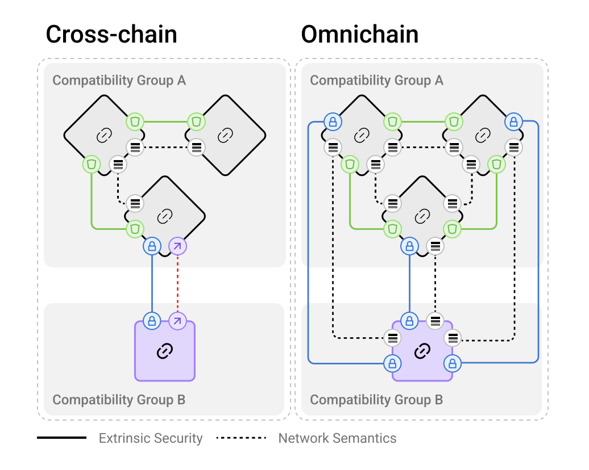    
*Отличия cross-chain и omnichain. Источник: LayerZero v2 whitepaper.*

На изображении показаны два подхода:

- **Cross-chain** (слева): Здесь сети соединяются через отдельные мосты между цепочками. Важный момент — каждая связь должна настраиваться индивидуально, а взаимодействие между разными группами совместимости (например, "Compatibility Group A" и "Compatibility Group B") требует дополнительных уровней безопасности и интеграций. По сути, это разрозненные соединения между цепочками, что увеличивает сложность управления связями и безопасностью.

- **Omnichain** (справа): В этом подходе каждая цепочка может напрямую взаимодействовать с любой другой в сети через единые сетевые семантики. В LayerZero это означает, что каждая связь между цепочками унифицирована, но безопасность для каждой связи может настраиваться индивидуально.

## Принципы LayerZero

Во главу OMP (Omnichain Messaging Protocol) поставлены два основных принципа: безопасность и универсальная семантика.

### Безопасность

Безопасность делится на внутреннюю (или встроенную) и внешнюю. Большинство протоколов реализуют только внешнюю безопасность, игнорируя внутреннюю. 

**Внутренняя безопасность** включает в себя несколько ключевых инвариантов:

1. **Lossless** (доставка "без потерь" или устойчивость к цензуре) — гарантия того, что сообщение сохранит целостность и будет доставлено без потери или изменения данных.
2. **Exactly-once** (невозможность повторного выполнения) — одно сообщение может быть обработано получателем только один раз.
3. **Eventual delivery** (живучесть) — сообщение будет доставлено в конечном итоге, даже если возникли временные сбои на каком-то из этапов.

**Внешняя безопасность** охватывает остальные аспекты, такие как алгоритмы подписей и верификации. Этот слой может настраиваться и изменяться в зависимости от потребностей конкретного приложения.

Целостность протокола делится на два уровня: целостность канала передачи данных и целостность самих данных. Каждый из этих уровней включает в себя два аспекта — корректность (validity) и живучесть (liveness). Внутренняя безопасность отвечает за корректность и живучесть канала, а внешняя безопасность — за корректность данных. В whitepaper приведена следующая таблица:

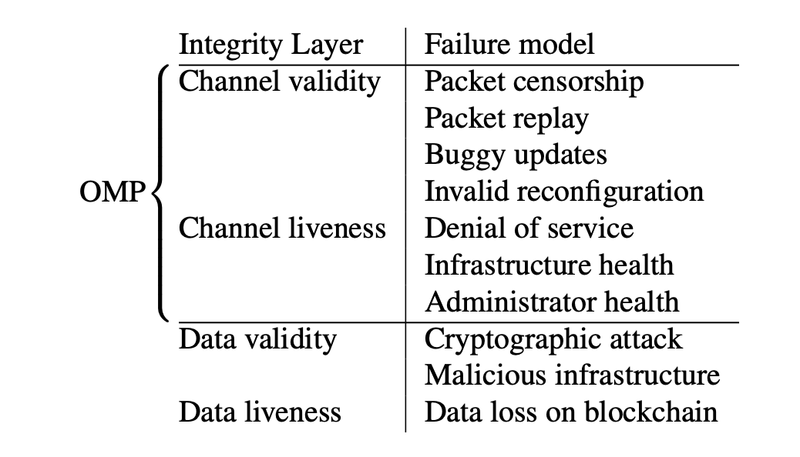

*Примечание:* Под пакетом (packet) подразумевается набор данных для передачи. Подробнее об этом позже.

Все это формирует модульный стек безопасности (Security Stack), который настраивается индивидуально для каждого OApp (omnichain application). Это сделано в противовес монолитным системам, где изменение одного фрагмента кода может поставить под угрозу весь протокол.

Преимуществом является и то, что изменения в стеке безопасности осуществляются только по решению владельца OApp. Такие обновления изолированы, что предотвращает сбои всей системы в случае ошибок и уязвимостей в обновлениях. LayerZero использует подход неизменяемости кода — обновления накатываются через новые версии модулей, которые внедряются безопасным способом, а старые версии остаются в рабочем состоянии и никогда не удаляются.

### Универсальная семантика

Протокол должен быть универсальным в своей структуре, чтобы поддерживать любой блокчейн и обеспечивать единое поведение для всех взаимодействий.

LayerZero стремится стандартизировать взаимодействие между блокчейнами. Приложения, работающие на LayerZero, не должны зависеть от особенностей отдельных блокчейнов, будь то EVM или не-EVM совместимые цепочки. Универсальная семантика включает два ключевых аспекта:

- **Execution semantics** (Семантика исполнения или логика функций OApp): Семантика выполнения должна быть не зависящей от цепочки и достаточно выразительной, чтобы позволить любую функциональность, требуемую OApp. Это делает протокол независимым от особенностей каждой цепочки.
- **Interface unification** (Унификация интерфейсов): Должен быть унифицированный интерфейс для передачи сообщений между блокчейнами, что устраняет необходимость в разработке уникальных решений для каждой новой цепочки и позволяет OApp быстрее масштабироваться.

Отсутствие унифицированных интерфейсов и семантики передачи сообщений усложняет разработку приложений, работающих на нескольких блокчейнах. LayerZero решает эту проблему, позволяя разработчикам не учитывать особенности каждой цепочки отдельно.

## Архитектура

Базовая идея и цель протокола LayerZero очень проста — доставить сообщение из одного блокчейна в другой, при этом сделать это максимально безопасно и надежно. Сообщение содержит данные (payload) и информацию по маршрутизации этих данных (routing information).

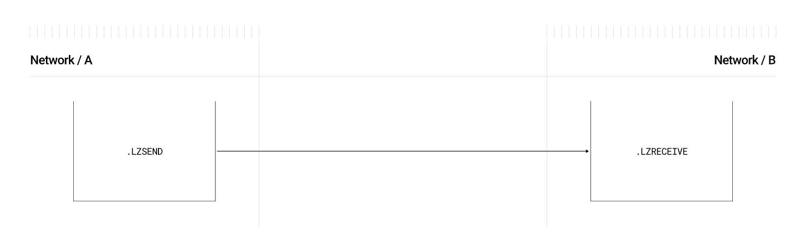  
*Верхнеуровневое представление передачи сообщения. Источник: Документация LayerZero.*

### Endpoint

Все начинается с OApp в исходной сети и заканчивается в OApp сети назначения. Основным интерфейсом для OApp является смарт-контракт [Endpoint](https://github.com/LayerZero-Labs/LayerZero-v2/blob/main/packages/layerzero-v2/evm/protocol/contracts/EndpointV2.sol).

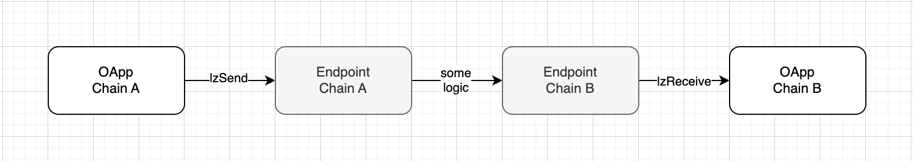  
*Взаимодействие с Endpoint.*

Endpoint обрабатывает входящие и исходящие сообщения, все сообщения в процессе отправки оборачиваются в пакеты.

Пакет состоит из заголовка (header) и тела (body). Заголовок включает информацию по маршрутизации и служебные данные, а тело содержит передаваемые данные.

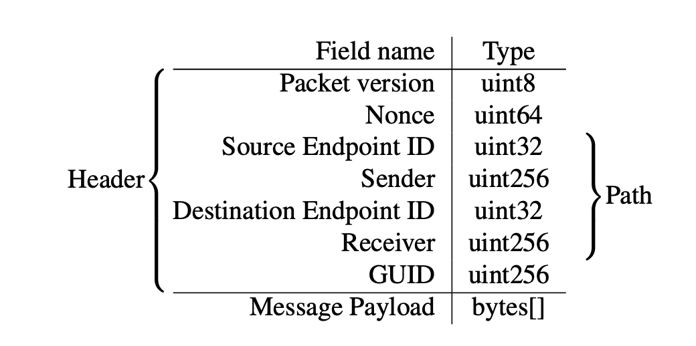  
*Структура пакета. Источник: LayerZero v2 whitepaper.*

**Endpoint** выполняет следующие задачи:
1. **Оплата транзакции**: Взимает с OApp оплату за транзакцию в нативной валюте сети или в токене ERC20 (`lzToken`).
2. **Подготовка пакета для отправки**: Состоит из нескольких этапов:
   - **Присвоение nonce и GUID**: Присваивает уникальный номер (nonce) каждому сообщению для его однократного исполнения и [генерирует](https://github.com/LayerZero-Labs/LayerZero-v2/blob/7aebbd7c79b2dc818f7bb054aed2405ca076b9d6/packages/layerzero-v2/evm/protocol/contracts/libs/GUID.sol#L10) GUID для отслеживания этого сообщения. GUID — это `keccak256(nonce, srcId, sender, dstId, receiver)`, где `srcId` и `dstId` — идентификаторы сети (их ввели, потому что не у всех блокчейнов есть chainId).
   - **Сериализация сообщения и формирование пакета**: Преобразует сообщение (payload и routing information) в сериализованный пакет для отправки через протокол LayerZero.
        ```solidity
        struct Packet {
            uint64 nonce; // уникальный номер транзакции, всегда увеличивается на один и идет по порядку
            uint32 srcEid; // идентификатор исходной сети
            address sender; // адрес отправителя
            uint32 dstEid; // идентификатор сети назначения
            bytes32 receiver; // адрес получателя
            bytes32 guid; // GUID
            bytes message; // тело сообщения
        }
        ```
3. **Оповещение об отправке**: Испускает событие `PacketSent` после отправки сообщения.
4. **Проверка входящих пакетов**: Проверяет валидность входящих пакетов.
5. **Исполнение**: В Endpoint есть функция [lzReceive](https://github.com/LayerZero-Labs/LayerZero-v2/blob/7aebbd7c79b2dc818f7bb054aed2405ca076b9d6/packages/layerzero-v2/evm/protocol/contracts/EndpointV2.sol#L172), которая гарантирует доставку пакетов в сеть назначения.
6. **Правильная обработка пакетов**: Отвечает за "живучесть" канала и выступает гарантом внутренней безопасности.

*Примечание:* GUID используется для отслеживания статуса сообщения и вызова действий как в офчейн, так и в ончейн-операциях.

#### Lossless Channel

Одна из основных задач смарт-контракта *Endpoint* — обеспечение надежного канала передачи данных. Для этого устанавливаются два ключевых требования к консистентности канала сообщений: **передача без потерь** (lossless) и **однократное выполнение** (exactly-once delivery). Чтобы соответствовать этим требованиям, *Endpoint* наследует смарт-контракт [*MessagingChannel*](https://github.com/LayerZero-Labs/LayerZero-v2/blob/7aebbd7c79b2dc818f7bb054aed2405ca076b9d6/packages/layerzero-v2/evm/protocol/contracts/MessagingChannel.sol).

Каждое сообщение получает уникальный последовательный номер (nonce). Хотя система допускает внепорядковую доставку сообщений, она гарантирует обработку всех предыдущих сообщений. Для этого используется концепция "ленивого" входящего *nonce* (lazy inbound nonce) — это наибольший *nonce*, до которого все предыдущие сообщения были обработаны или пропущены. *lazyInboundNonce* начинается с нуля, и пакеты могут быть выполнены только тогда, когда проверены все пакеты от *lazyInboundNonce* до *nonce* текущего пакета.

Например, если пакеты с *nonce* 1 и 2 не были проверены, то пакет с *nonce* 3 не может быть доставлен и выполнен до тех пор, пока не будут проверены предыдущие *nonce*.

После того как *nonce* 1, 2 и 3 будут проверены, если *nonce* 2 не удалось выполнить (например, из-за проблем с газом или логикой приложения), *nonce* 3 все равно может быть выполнен.

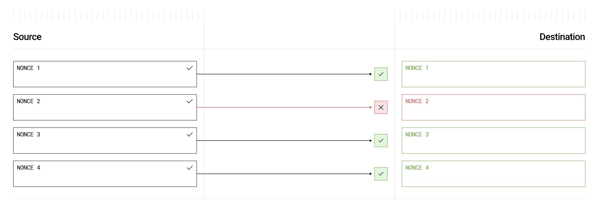  
*Доставка пакетов не по порядку. Источник: LayerZero v2 whitepaper.*

*Важно!* Проверенные пакеты могут быть выполнены не по порядку, но есть возможность выставить в настройках строгое последовательное выполнение.

Дополнительно доступны функции, которые добавляют логику управления *nonce*, такие как *skip*, *clear*, *nilify* и *burn*:

- В случае ошибочных или вредоносных сообщений OApp могут использовать функцию **clear**, чтобы пропустить доставку конкретного сообщения, или **skip**, чтобы пропустить как верификацию, так и доставку.
- Функция **nilify** аннулирует проверенный пакет, предотвращая его выполнение до тех пор, пока не будет получен новый пакет через *MessageLib*. Это полезно для аннулирования вредоносных пакетов, которые могли быть сгенерированы скомпрометированными *DVNs* (децентрализованными верификаторами).
- Функция **burn** позволяет приложениям (*OApps*) удалить пакет, не зная его содержимого. Это полезно, если неисправный стек безопасности зафиксировал некорректный хэш на *Endpoint*, или если *OApp* нужно очистить ранее аннулированный (*nilified*) *nonce*.

### MessageLib

Смарт-контракт [MessageLib](https://github.com/LayerZero-Labs/LayerZero-v2/blob/main/packages/layerzero-v2/evm/messagelib/contracts/SendLibBaseE2.sol) играет ключевую роль в обеспечении внешней безопасности. Каждое приложение OApp должно определить, с какой *MessageLib* оно будет работать. Если в конфигурации OApp библиотека не указана, будет использоваться библиотека по умолчанию (например ULN). Существует реестр таких библиотек (MessageLib Registry), и их может быть много, однако для взаимодействия двух OApp должна использоваться одна и та же библиотека в обоих сетях в единственном экземпляре.

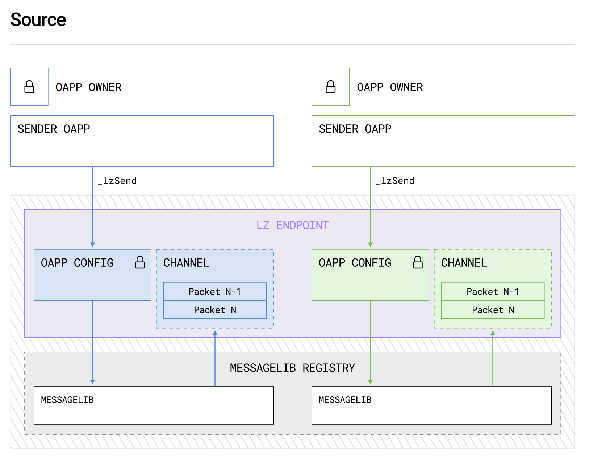  
*Схема обработки сообщения через MessageLib. Источник: Документация LayerZero.*

Каждая библиотека *MessageLib* может реализовывать произвольные механизмы верификации, при условии, что она соответствует интерфейсу [ISendLib](https://github.com/LayerZero-Labs/LayerZero-v2/blob/main/packages/layerzero-v2/evm/protocol/contracts/interfaces/ISendLib.sol) протокола. Такой дизайн предотвращает привязку к одному механизму верификации, что часто случается в других системах передачи кросс-чейн сообщений.

Главная задача библиотеки - обеспечить безопасную отправку и получение пакета, для этого она проверяет соблюдение всех требований внешней безопасности (которые могут быть сконфигурированы OApp).

Остальные задачи выполняются исполнителями (executors), что минимизирует объем кода в *MessageLib* и упрощает добавление новых функций через разработку новых исполнителей.

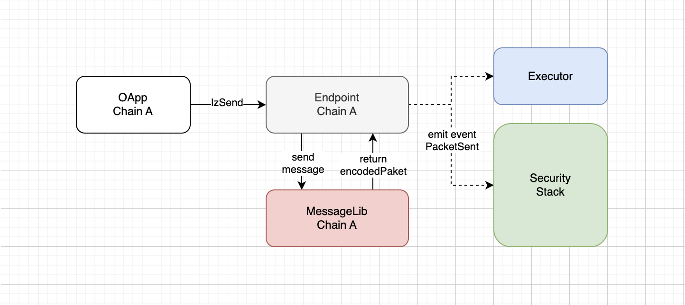  
*Взаимодействие с библиотекой в исходной сети.*

После обработки сообщения в *MessageLib* пакет передается обратно в *Endpoint*, чтобы он мог создать событие и уведомить всех участников.

*MessageLib* в сети назначения проверяет пакет и фиксирует это в *Endpoint*, после чего можно вызвать функцию `Endpoint::lzReceive()`.

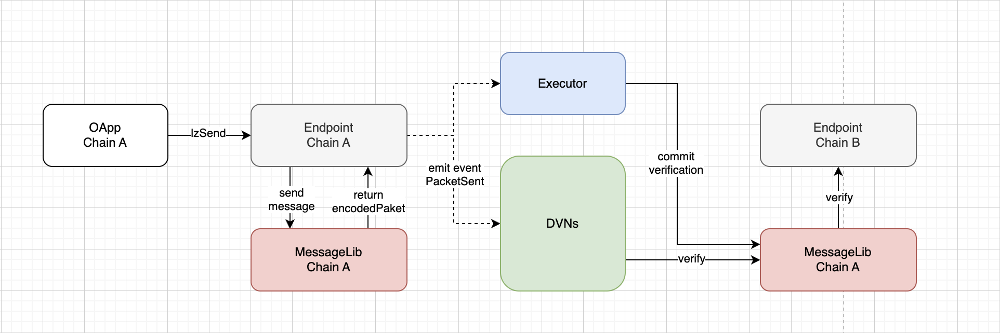  
*Взаимодействие с библиотекой в сети назначения.*

#### Версионирование библиотек и миграция

После добавления библиотеки в реестр *MessageLib*, никто, включая администратора LayerZero, не имеет права изменять или удалять ее. Для того чтобы обеспечить расширяемость внешней безопасности и при этом защитить существующие OApps от обновлений "на месте", реестр *MessageLib* позволяет только добавлять новые библиотеки (append-only) или их версии. Новые библиотеки могут быть добавлены, но существующие остаются неизменными.

Каждая *MessageLib* в LayerZero идентифицируется с помощью уникального ID и версии в формате *major.minor* (например, 1.0). Сообщение может быть отправлено между двумя *Endpoints* только в том случае, если оба *Endpoints* используют *MessageLib* с одинаковой *major* версией.

- *Major* версия определяет совместимость сериализации и десериализации пакетов.
- *Minor* версия предназначена для исправления ошибок и других изменений, которые не ломают совместимость.

Каждая версия пакета LayerZero привязана к версии *MessageLib*, что помогает *DVNs* (децентрализованным верификаторам) определить, какую библиотеку использовать для верификации пакета в целевом блокчейне.

Библиотеки нумеруются тремя цифрами, где последняя цифра отображает версию *Endpoint*:
- **Первая цифра**: Мажорная версия библиотеки, такие версии несовместимы между собой. Если в исходной сети одна мажорная версия, а в сети назначения другая, они не смогут передать сообщение друг другу.
- **Вторая цифра**: Минорная версия, минорные версии совместимы между собой.
- **Третья цифра**: Версия *Endpoint* (например, для LayerZero v2 — это версия 2).

Актуальная на данный момент версия *ULN* (библиотека по умолчанию) выглядит следующим образом:

```solidity
function version() external pure override returns (uint64 major, uint8 minor, uint8 endpointVersion) {
    return (3, 0, 2);
}
```

Миграция между мажорными версиями происходит поэтапно для соблюдения безопасности и возможности выполнения асинхронных действий.

### Security Stack

Стек безопасности состоит из *DVNs* (Decentralized Verifier Networks), *MessageLib* и настроек *OApp config*, но ключевым компонентом являются именно *DVNs*. Поскольку LayerZero и аналогичные протоколы решают задачу интероперабельности блокчейнов, единственный способ обеспечить это — добавить между двумя сетями верификатора.

**Decentralized Verifier Networks (DVNs)** — это сети верификаторов, которые выполняют распределенный консенсус для безопасного и надежного считывания хэшей пакетов с исходного блокчейна. Важной особенностью такого дизайна является поддержка разнообразных клиентов внутри одной *DVN*, что минимизирует риск сбоев или ошибок из-за проблем с одним верификатором.

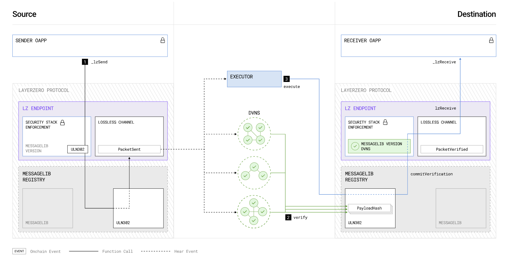  
*Схема отправки пакета с участием DVNs. Источник: Документация LayerZero.*

Каждое *OApp* может настроить стек безопасности, который включает несколько обязательных и дополнительных децентрализованных сетей верификаторов (*DVNs*) для проверки целостности `payloadHash`, указывая необязательный порог (threshold), при достижении которого пакет считается проверенным.

*DVN* может содержать ончейн и/или офчейн компоненты. Каждый стек безопасности может включать неограниченное количество *DVNs*. Структура *DVN* может использовать ZKP, сайдчейны или нативные блокчейны. Это позволяет гибко настраивать стек безопасности в зависимости от задач.

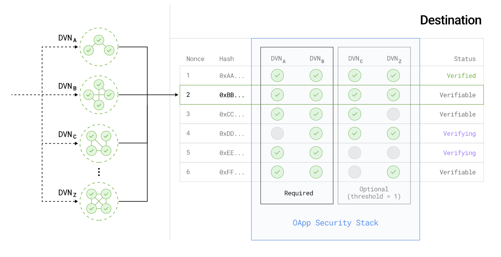  
*Процесс верификации пакетов через DVNs. Источник: Документация LayerZero.*

Каждый *DVN* использует собственную схему проверки для определения целостности `payloadHash` перед его верификацией в *MessageLib* сети назначения.

Когда обязательный *DVN* подтверждает `payloadHash`, и достигается минимальный порог для дополнительных *DVNs*, `nonce` пакета и `payloadHash` фиксируются в *Endpoint* как проверенные. После этого *Executor* может выполнить сообщение.

Список доступных *DVNs* можно найти [здесь](https://docs.layerzero.network/v2/developers/evm/technical-reference/dvn-addresses).

Преимущество такого подхода в том, что даже если все существующие *DVNs* потеряют работоспособность из-за программных сбоев, угроз безопасности, природных катастроф или проблем с управлением, разработчики *OApp* могут самостоятельно запустить свои собственные *DVNs* и продолжить работу протокола.

#### Ultra Light Node

**Ultra Light Node (ULN)** — это базовая библиотека сообщений (*MessageLib*), включенная в каждое развертывание LayerZero. *ULN* позволяет использовать до 254 *DVNs* через настраиваемую двухуровневую систему кворума.

*ULN* реализует минимальный набор функций, необходимых для любого алгоритма верификации, что делает его совместимым с любыми блокчейнами. Каждый *Security Stack* OApp, использующий *ULN*, включает:

- Обязательные *DVNs*.
- Опциональные *DVNs* и порог для опциональных верификаторов (*OptionalThreshold*).

Для того чтобы пакет был доставлен, все обязательные *DVNs* и как минимум *OptionalThreshold* опциональных *DVNs* должны подписать хэш полезной нагрузки. Когда необходимые подписи *DVNs* собраны в *ULN*, пакет может быть зафиксирован на конечной точке (*Endpoint*).

  
*Пример работы DVNs в связке с ULN. Источник: whitepaper.*

В данном примере стек безопасности *OApp* включает:
- **Обязательный DVN (DVN_A)**, который обладает правом вето.
- **N-1 опциональных DVNs** (DVN_B, DVN_C и др.) с порогом опциональных верификаторов (*OptionalThreshold*) равным 2.

Это означает, что для подтверждения пакета:
- **DVN_A** должен обязательно подтвердить пакет (он имеет право вето).
- По крайней мере один из опциональных *DVNs* также должен подтвердить пакет.
- **Nonce 1** уже зафиксирован в канале сообщений (помечен как *Verified*).
- **Nonces 2, 3 и 6** могут быть зафиксированы, так как требования безопасности выполнены, но будут окончательно зафиксированы только после вызова *Executor* через функцию `commitVerification`.
- **Nonces 4 и 5** не могут быть зафиксированы, потому что nonce 4 не прошел проверку обязательного набора верификаторов, а nonce 5 не достиг порогового значения для опциональных *DVNs*.

### Executor

LayerZero решает проблему высокой ресурсоемкости разработки и обновления кода с внешней безопасностью путем **разделения верификации и исполнения**. Любой код, не критичный для безопасности, выносится в отдельные компоненты — **executors** (исполнители), которые работают без разрешений и изолированы от процесса верификации пакетов.

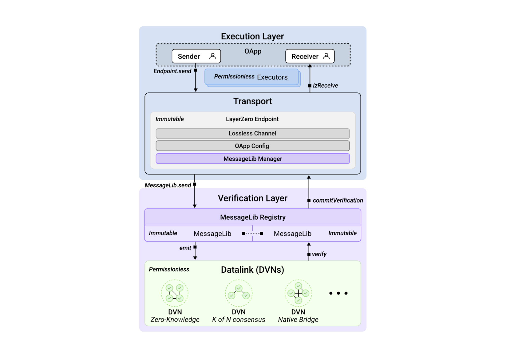  
*Разделение на слой исполнения и слой безопасности. Источник: whitepaper.*

Такое разделение между **безопасным кодом** (в *MessageLib*) и **функциональным кодом** (в *executors*) дает два ключевых преимущества:
1. **Простота расширения**: Разработчики могут добавлять и реализовывать новые функциональные возможности, не беспокоясь о безопасности, так как *Endpoint* предотвращает исполнение непроверенных или неполных сообщений. Это изолирует процесс исполнения пакета от его верификации.
2. **Разделение безопасности и живучести (liveness)**: Даже если исполнитель работает с ошибками, он не может предотвратить доставку сообщения, что гарантирует устойчивость системы. Такая изоляция упрощает отладку, позволяя легко определить, на каком этапе возникла ошибка — в слое верификации или исполнения.

Когда *OApp* отправляет сообщение в LayerZero, оно указывает всех внешних исполнителей (например, **executors**, **DVNs**) и передает соответствующие аргументы через байтовый массив, называемый **Message Options**, который интерпретируется библиотекой *MessageLib*. Исполнители ожидают, пока *Security Stack* проверит пакет, прежде чем выполнить команды, закодированные в *Message Options*.

Изоляция исполнения от верификации улучшает надежность канала передачи данных. Такая модель гарантирует, что канал может быть восстановлен даже в случае сбоя *Executor*. После проверки сообщения *Security Stack*, любой желающий, кто готов оплатить газовые комиссии, может выполнить сообщение без дополнительных разрешений. Это позволяет конечным пользователям вручную запускать восстановление *OApp* после сбоя исполнителя.

Список доступных исполнителей [тут](https://docs.layerzero.network/v2/developers/evm/technical-reference/deployed-contracts) (это исполнители развернутые LayerZero).

### Полный путь сообщения от отправителя к получателю

Теперь, когда мы знакомы с основными модулями LayerZero, рассмотрим полный путь сообщения и последовательность действий:

1. *OApp* в исходной сети вызывает функцию `lzSend` на *Endpoint*, передавая данные о маршруте пакета и информацию о количестве газа, необходимом для выполнения пакета в сети назначения.
   - *Endpoint* формирует пакет, присваивает ему `nonce` и `GUID`, после чего передает пакет в *MessageLib*, указанную в стеке безопасности этого *OApp*.
   - Библиотека (в данном примере *ULN*) знает, какие *DVNs* будут использоваться для верификации и какой *Executor* должен исполнить транзакцию. Она рассчитывает комиссии и передает эту информацию *Endpoint*.
   - *Endpoint* списывает необходимую сумму у пользователя и испускает событие `PacketSend`.
   ```solidity
   event PacketSent(bytes encodedPayload, bytes options, address sendLibrary);
   ```
2. Это событие отслеживается *DVNs* и *Executor*. *DVNs* проверяют пакет через библиотеку *MessageLib* (в данном примере — *ULN*) сети назначения и подтверждают его валидность своими подписями. Как только необходимое количество верификаторов подтвердит пакет, можно переходить к следующему шагу.
3. *Executor* отслеживает процесс подтверждения. В библиотеке есть функция `verifiable`, которая проверяет, прошел ли пакет полную верификацию. После этого *Executor* вызывает функцию `commitVerification`, на этой стадии проверку *nonce* выполняет *Endpoint* сети назначения.
4. В случае успешного прохождения всех проверок *Executor* вызывает функцию `lzReceive`, чтобы завершить доставку пакета в *OApp* сети назначения. Если в опциях пакета указана информация для `lzCompose`, то после выполняются все дополнительные транзакции.

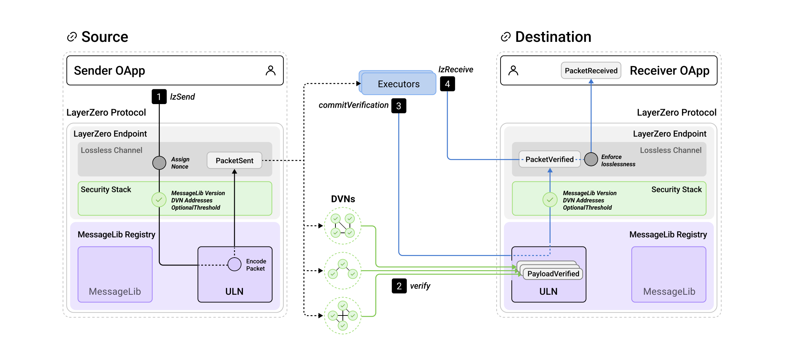  
*Схема доставки пакета из исходной сети в сеть назначения. Источник: whitepaper.*

## Расчет газа

Важный вопрос для всех мостов - расчет газовых затрат в исходной сети и сети назначения. Эти затраты в LayerZero делятся на 4 составляющих:
1. Затраты на первоначальную транзакцию в исходной сети.
2. Комиссия за работу стека безопасности (*DVNs*).
3. Комиссия за работу исполнителя (*Executor*).
4. Покрытие расходов на газ для исполнителя в сети назначения плюс, если необходимо, покупка нативных токенов для их передачи в сети назначения.

С последним пунктом есть сложности. Проблема в том, что исходный блокчейн ничего не знает о состоянии блокчейна в который будет выполняться доставка пакета, поэтому эмулировать транзакцию до отправки и посчитать сколько газа будет затрачено невозможно. Плюс у разных блокчейнов отличается нативный токен для оплаты газа и цены на газ.

Чтобы решить эту проблему перед отправкой сообщения разработчики должны посчитать сколько газа будет потреблять функция `_lzReceive` в сети назначения и указать это значение в опциях. Если в пакете скомбинированы несколько транзакций, расходы для `lzCompose` нужно будет указать отдельно. 

К примеру доставка простого сообщения в EVM-блокчейне будет потреблять около 50000 ед.газа., тогда опции будут формироваться следующим образом:

```solidity
// addExecutorLzReceiveOption(GAS_LIMIT, MSG_VALUE)
bytes memory options = OptionsBuilder.newOptions().addExecutorLzReceiveOption(50000, 0)
```

*Примечание:* Второе значение функции `addExecutorLzReceiveOption` принимает количество нативной валюты, которое мы хотим передать в сеть назначения, но это опциональный параметр, его можно не использовать. С передачей `msg.value` есть свои особенности, которые выходят за рамки этой статьи.

Смарт-контракт `Endpoint` имеет метод `quote` для оценки стоимости газа, который вы хотите отправить. Как правило все OApp этот метод дублируют.

```solidity
// LayerZero Endpoint's quote mechanism
function quote(MessagingParams calldata _params, address _sender) external view returns (MessagingFee memory);
```

Функция принимает структуру *MessagingParams* а возвращает *MessagingFee*:

```solidity
struct MessagingParams {
    uint32 dstEid; // идентификатор сети назначения
    bytes32 receiver; // адрес OApp который будет принимать пакеты
    bytes message; // данные для передачи
    bytes options; // опции в которых указано количество газа и msg.value
    bool payInLzToken; // флаг на случай если оплата газа будет в lzToken
}

struct MessagingFee {
    uint256 nativeFee; // стоимость газа который будет отправлен в wei
    uint256 lzTokenFee; // стоимость газа в lzToken если payInLzToken == true
}
```

Стоимость газа будет рассчитываться следующим образом:


Например мы хотим отправить сообщение из Ethereum в Polygon. Нам нужно посчитать сколько газа оправить в ETH.

Исходные данные:
1. Цена ETH - $2500
2. Цена POL - $0.5
3. Gas price Polygon 50 GWei
4. Количество газа, которое мы хотим отправить - 50000

```bash
gasPriceETH = 50000 * (50000000000 / 10**18) * $0.5 / $2500 = 0.0000005 ETH
```

В теории этого должно быть достаточно чтобы оплатить транзакцию в Polygon. На практике сюда плюсуется комиссия стека безопасности (а это зависит от того сколько DVN участвуют в верификации) и комиссия *Executor* в сети назначения. Комиссия *Executor* зависит от его реализации и тоже может отличатся. Примечательно, что весь неизрасходованный газ остается у *Executor*, но как вариант всегда можно запустить своего исполнителя, чтобы оптимизировать эти расходы.

Таким образом полная стоимость отправки сообщения будет складываться следующим образом:

```
выполнение логики в сети A + комиссии за верификацию и исполнение + расходы на выполнение логики в сети B
```

К примеру я отправил сообщение из Arbitrum в Polygon ([ссылка](https://layerzeroscan.com/tx/0x55615e9ee9be40614756fed61af5e5ad35b4e63cceefce4e3d49a6ccf0cf9f95) на layerzeroscan), получились примерно следующие цифры:
- Оплата транзакции Arbitrum - \$0.009
- Передача газа в Polygon на \$0.0555 (при этом расчет по формуле - ~\$0.0008)
  - Плата двум DNV - \$0.0025 (по \$0.00125 каждому)
  - Выполнение транзакции в Polygon - ~\$0.001
  - Все остальное работа *Executor* - ~\$0.053

Итого за отправку сообщения "Hello, Polygon!" я потратил:

\$0.009 в исходной сети + $0.0025 плата за верификацию + ~\$0.053 исполнителю. Всего вышло \$0.0645.

При этом сколько из этой суммы "чистый заработок" исполнителя понять довольно сложно, потому что он несет расходы не только за выполнение транзакции в сети назначения, но еще и за получение актуальных цен и конвертацию нативных токенов. В будущем разработчики обещают добавить в [layerzeroscan](https://layerzeroscan.com) отображение этих комиссий.

По подсчетам tenderly функции `_lzReceive` в Polygon потребовалось 50102 ед. газа (напомню, что я выделял только 50000), а на всю транзакцию ушло 85925 (при этом gasLimit был установлен аж на 295812).

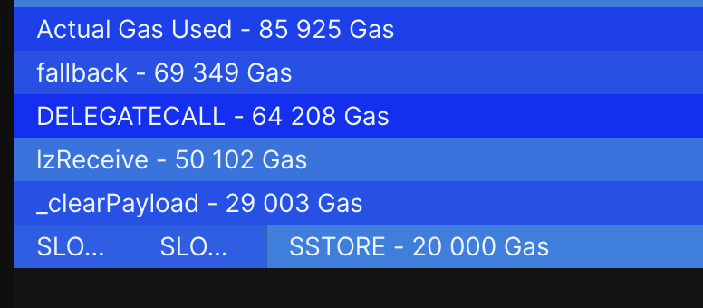  
*Источник: dashboard.tenderly.co*

В документации есть также [таблица](https://docs.layerzero.network/v2/developers/evm/technical-reference/tx-pricing#profiling) с примерными расчетами по количеству газа для различных действий в сети назначения.

## Возможности протокола

LayerZero обладает широкими возможностями межцепочного взаимодействия. По умолчанию предлагаются три основных стандарта *OApp* и различные паттерны проектирования для их взаимодействия между различными блокчейнами.

1. **Omnichain Application** (OApp) — стандарт [OApp](https://github.com/LayerZero-Labs/LayerZero-v2/blob/7aebbd7c79b2dc818f7bb054aed2405ca076b9d6/packages/layerzero-v2/evm/oapp/contracts/oapp/OApp.sol) предоставляет разработчикам общий интерфейс передачи сообщений для отправки и получения данных между контрактами, существующими в разных сетях блокчейна. Это базовый стандарт, на котором можно построить что угодно — финансовую логику для DeFi-приложений, механизм голосования для DAO и т.д.

2. **Omnichain Fungible Token** (OFT) — позволяет создавать единый токен ERC20 для всех блокчейнов, которые поддерживают стандарт [OFT](https://github.com/LayerZero-Labs/LayerZero-v2/blob/7aebbd7c79b2dc818f7bb054aed2405ca076b9d6/packages/layerzero-v2/evm/oapp/contracts/oft/OFT.sol). Благодаря стандартизации и гарантиям доставки пакетов появляется возможность перемещать весь объем токенов между сетями 🤯. Работает это по схеме `burn/mint`: при передаче активов в исходной сети они сжигаются, а в сети назначения создаются (mint). Для существующих токенов предусмотрен [OFTAdapter](https://github.com/LayerZero-Labs/LayerZero-v2/blob/7aebbd7c79b2dc818f7bb054aed2405ca076b9d6/packages/layerzero-v2/evm/oapp/contracts/oft/OFTAdapter.sol), который использует преимущества *OFT* и работает по классической схеме `lock/mint` и `burn/unlock`.

Подробнее о стандарте можно прочитать в [документации](https://docs.layerzero.network/v2/developers/evm/oft/quickstart) и практических примерах ниже.

3. **Omnichain Non-Fungible Token** (ONFT) — схож по принципу работы с *OFT*, но применяется для токенов стандарта ERC721.

### Паттерны проектирования

Паттерны проектирования LayerZero предлагают более сложные [сценарии]((https://docs.layerzero.network/v2/developers/evm/oapp/message-design-patterns)) взаимодействия, чем простая передача сообщения между двумя сетями. Они демонстрируют возможности протокола и функционируют как отдельные строительные блоки для создания *omnichain* приложений, которые можно использовать как по отдельности, так и в комбинации.

**ABA**

Паттерн [ABA](https://docs.layerzero.network/v2/developers/evm/oapp/message-design-patterns#aba) - это вложенный вызов отправки из цепочки A в цепочку B, который снова отправляет сообщение в исходную цепочку (A -> B -> A). Он же пинг-понг. Можно использовать для:
  - **Условное выполнение контрактов**: Смарт-контракт на цепочке A выполнит функцию только в том случае, если будет выполнено условие на цепочке B. Он отправляет сообщение в цепочку B, чтобы проверить условие, и получает ответное подтверждение, прежде чем приступить к выполнению.
  - **Omnichain Data Feeds**: Контракт на цепочке A может получать данные из цепочки B для завершения процесса на цепочке A.
  - **Межцепочечная аутентификация**: Пользователь или контракт может пройти аутентификацию на цепочке A, связаться с цепочкой B, чтобы обработать что-то, требующее этой аутентификации, а затем получить обратно токен или подтверждение того, что процесс прошел успешно.

**Batch send**

Паттерн [Batch Send](https://docs.layerzero.network/v2/developers/evm/oapp/message-design-patterns#batch-send) подразумевает отправку одного сообщения сразу в несколько сетей.

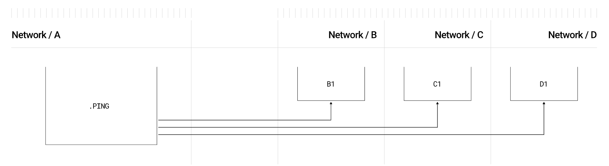  
*Процесс отправки одного пакета в несколько сетей. Источник: Документация LayerZero.*

Применение:
- **Одновременные обновления Omnichain**:  Может использоваться для обновления одной и той же информации в нескольких сетях, например, изменения параметров управления или обновления данных оракула.
- **DeFi-стратегии**: В DeFi-протоколах, работающих с несколькими сетями, пакетная отправка помогает ребалансировать пулы ликвидности или реализовывать стратегии доходности.
- **Публикация агрегированных данных**: Оракулы и поставщики данных могут использовать пакетную отправку для публикации информации, такой как цены токенов или результаты событий, в нескольких сетях одновременно.

**Composed**

Паттерн [Composed](https://docs.layerzero.network/v2/developers/evm/oapp/message-design-patterns#composed) не только паттерн проектирования, но и важная фича протокола. Помимо интерфейса `lzReceive`, существует интерфейс `lzCompose`, позволяющий компоновать транзакции. Например в блокчейнах на основе *MoveVM* (например, Aptos или Sui) не поддерживается семантика транзакций в стиле EVM, что делает невозможным несколько вызовов в одной транзакции.

Как работает **lzCompose**:
- Получатель сохраняет полученные данные в *Endpoint* через вызов `sendCompose`, который происходит при первом вызове `lzReceive`.
- Затем эти данные извлекается из реестра и передается в callback-функцию через вызов `lzCompose`, но уже в отдельной транзакции.

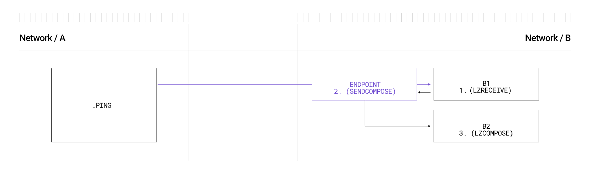  
*Процесс последовательного вызова lzReceive и lzCompose. Источник: Документация LayerZero.*

*Примечание:* Можно комбинировать множество вызовов.

Плюсы этого подхода:
- **Масштабируемость**: *lzCompose* это универсальный приметив, который может работать в разных блокчейнах.
- **Надежность и безопасность**: Изолированные вызовы смарт-контрактов позволяют избежать влияния ошибок одного смарт-контракта на другой.
- **Управление газом**: Позволяет выделять газ для каждого вызова отдельно, упрощая отладку транзакций.

*Важно!* Первым всегда идет вызов `lzReceive`, который добавляет в очередь смарт-контракта *Executor* переданные данные для новых транзакций с `lzCompose`.

Получается следующая последовательность вызовов:

`_lzSend`(source chain) -> `_lzReceive`(dest chain) -> `sendCompose`(dest) -> `lzCompose`(dest)

Примеры использования:
- **Omnichain DeFi стратегии**: Контракт может инициировать передачу токенов в цепочку назначения, а затем взаимодействовать с DeFi-протоколом для предоставления кредитов, займов или ликвидности.
- **NFT взаимодействие**: При передаче NFT в другую цепочку можно автоматически запускать контракт на выдачу лицензии или предоставление услуг.
- **Координация ДАО**: ДАО может отправить средства на смарт-контракт в другой цепочке и составить предложение для инвестиций или голосования.

**Composed ABA**

Паттерн [Composed ABA](https://docs.layerzero.network/v2/developers/evm/oapp/message-design-patterns#composed-aba) представляет собой комбинацию двух паттернов, которая позволяет осуществлять вызовы по типу `A -> B1 -> B2 -> A` или `A -> B1 -> B2 -> C` в зависимости от задач.

Варианты использования:
- **Верификация данных Omnichain**: Цепочка A отправляет запрос цепочке B для проверки данных. После проверки смарт-контракт в цепочке B выполняет действие на основе этих данных и отправляет сигнал обратно в цепочку A, чтобы продолжить процесс или записать результаты.
- **Omnichain Collateral Management**: Когда залог в цепочке A блокируется или освобождается, смарт-контракт в цепочке B может быть вызван для выдачи кредита или разблокировки средств. Подтверждение отправляется обратно в цепочку A для завершения.
- **Многоступенчатое взаимодействие смарт-контрактов для игр и коллекционных предметов**: В игровом сценарии актив (например, NFT) может быть отправлен из цепочки A в цепочку B, что запускает контракт на B для открытия нового уровня или функции в игре, после чего подтверждение или вознаграждение отправляется обратно в цепочку A.

  
*Схема выполнения вызова с использованием паттерна Composed ABA. Источник: Документация LayerZero.*

**Message Ordering** и **Rate Limit**

Эти два паттерна также полезны, хотя мы не будем подробно останавливаться на них:

- [Message Ordering](https://docs.layerzero.network/v2/developers/evm/oapp/message-design-patterns#message-ordering) позволяет асинхронное выполнение пакетов, если не нарушен порядок их проверки. Тем не менее, при необходимости можно настроить передачу так, чтобы пакеты доставлялись и выполнялись строго по порядку.
  
- [Rate Limit](https://docs.layerzero.network/v2/developers/evm/oapp/message-design-patterns#rate-limiting) предоставляет возможность ограничивать трафик по передаче данных или токенов.

### Token Bridging

Для [создания мостов](https://docs.layerzero.network/v2/developers/evm/technical-reference/integration-checklist#token-bridging-guidelines) в их классическом понимании (для перевода токенов) - правильным решением будет использование стандартов *OFT* или *ONFT*. Эти стандарты также можно применять в сочетании с вышеупомянутыми паттернами проектирования. Например, можно реализовать [Composed OFT](https://docs.layerzero.network/v2/developers/evm/oft/oft-patterns-extensions#composed-oft), комбинируя возможности *OFT* и других паттернов.

## Выводы

На мой взгляд, команда LayerZero очень близко подошла к решению [трилеммы](https://medium.com/connext/the-interoperability-trilemma-657c2cf69f17) интероперабельности. Разделение слоев безопасности и исполнения, а также двухуровневая система безопасности (внутренняя и внешняя) позволяют обеспечить надежный канал передачи данных. Более того, уровень безопасности можно гибко настраивать в зависимости от требований конкретного приложения. Протокол поддерживает передачу произвольных данных, а унифицированные интерфейсы открывают возможности для взаимодействия за пределами EVM-экосистемы (хотя сейчас она доминирует благодаря множеству L2 решений).

Особенно стоит отметить возможность создания *omnichain*-приложений, что теоретически может сократить фрагментацию ликвидности — вопрос, который все более актуален с ростом количества L2 решений. В *whitepaper* протокола описаны дополнительные меры для повышения безопасности таких приложений, в пример приводится расширение под названием *Pre-Crime* (раздел 4.3 Application-level security), которое позволяет проверять инварианты между всеми сетями, в которых развернуто приложение, и останавливать доставку пакета при нарушении инвариантов.

С учетом гибкости протокола LayerZero и множества параметров конфигурации, разработка крупного *omnichain*-приложения может стать сложной задачей. Тем не менее, простая интеграция с протоколом для отправки сообщений между сетями (с использованием стандартного стека безопасности) или передача токенов вполне доступна любому разработчику на Solidity. Протокол даже предлагает собственные стандарты для передачи токенов.

В итоге получилась очень гибкая система-конструктор для создания безопасных и децентрализованных протоколов. Все это выглядит как важный элемент в экосистеме DeFi наряду с оракулами, и, вероятно, LayerZero станет таким же важным игроком в мире мостов, как Chainlink — в мире оракулов.

## Ссылки

- [Whitepaper: LayerZero v2](https://layerzero.network/publications/LayerZero_Whitepaper_V2.1.0.pdf)
- [Docs: LayerZero v2](https://docs.layerzero.network/v2)
- [Github: LayerZero v2](https://github.com/LayerZero-Labs/LayerZero-v2)
- [Article: Omnichain vs Multichain vs CrossChain: What Are They?](https://hackernoon.com/omnichain-vs-multichain-vs-crosschain-what-are-they)
- [Video: Intro to LayerZero V2 & Omnichain Apps for Beginners](https://www.youtube.com/watch?v=W0J_Jz76apE)
