# Взаимодействие с протоколом LayerZero v2. Часть 4. Omnichain Queries (lzRead)

**Автор:** [Алексей Куценко](https://github.com/bimkon144) 👨‍💻

Если вы уже разобрались с классическими сообщениями LayerZero (push-модель: отправили сообщение из одной сети и получили в другой сети), следующий шаг — научиться читать состояние других сетей, не разворачивая там свои контракты и не гоняя туда-сюда два сообщения.
Для этого в LayerZero v2 есть lzRead — это request–response (pull) паттерн: контракт в исходной сети отправляет запрос (`lzSend`), а ответ возвращается обратно в исходную сеть и обрабатывается в `lzReceive`.

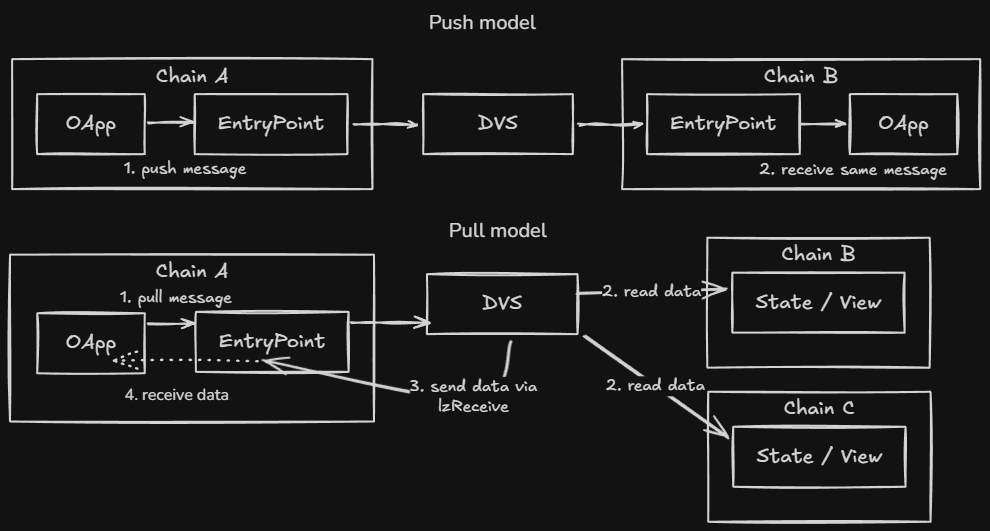

В статье рассмотрим, как устроен lzRead, из каких контрактов он состоит, как написать и настроить контракт для получения цен из пула Uniswap V3 — с разбором кода и деплоем в [Remix](https://remix.ethereum.org/).

**Терминология:**

- **Исходная сеть (origin chain)** — сеть, где развернут ваш контракт, который будет запрашивать данные из другой сети.
- **Сеть данных (data chain / target chain)** — сеть, из которой вы читаете данные.
- **Endpoint** — системный смарт-контракт в каждой сети от LayerZero, через который проходят входящие и исходящие сообщения.
- **EID (Endpoint ID)** — числовой идентификатор сети в протоколе LayerZero.
- **Read Channel** — отдельный канал сообщений именно для чтений; его ID и поддерживаемые пути приведены в [таблицах деплоев](https://docs.layerzero.network/v2/deployments/read-contracts).
- **DVN (Decentralized Verifier Network)** — сеть верификаторов, подтверждающих корректность ответа.
- **ReadLib1002** — message-library для чтений; для lzRead нужны совместимые библиотеки и DVN с доступом к архивным нодам.

---

## Как устроен lzRead

lzRead позволяет контракту запрашивать и получать состояние из других блокчейнов. В основе лежит идея **BQL (Blockchain Query Language)** — единый способ формулировать запросы (что читать, из какой сети, на каком блоке/времени), получать и при необходимости обрабатывать ответы.

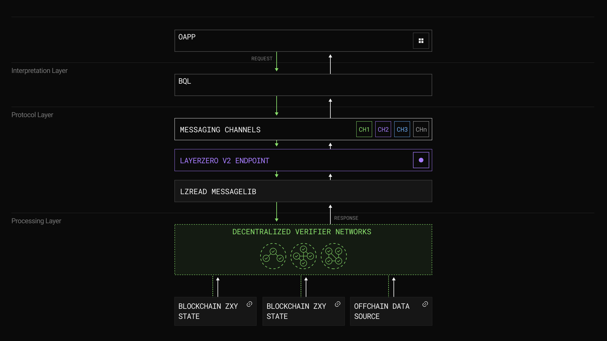

По шагам:

1. **Формирование запроса** — приложение собирает запрос: какие данные нужны, из какой целевой сети, на каком блоке или времени. Запрос кодируется в стандартную команду по схеме BQL.
2. **Отправка запроса** — команда отправляется через Endpoint LayerZero по отдельному read-каналу (не обычному messaging). По каналу явно передается, что это запрос с ожиданием ответа, а не просто смена состояния.
3. **Получение и верификация данных (DVN data fetch and verification)** — DVN принимают запрос, забирают данные с архивной ноды требуемой сети и при необходимости применяют off-chain compute: **lzMap** (преобразование ответов из одной или нескольких сетей) и **lzReduce** (агрегация нескольких ответов в один). Каждый DVN формирует криптографический хеш результата для проверки целостности. 
_В этой статье мы делаем один запрос в одну сеть, поэтому Compute не настраиваем; как задать lzMap/lzReduce для сценариев с несколькими сетями или агрегацией — можно посмотреть в [документации lzRead](https://docs.layerzero.network/v2/developers/evm/lzread/overview#lzmap)._
4. **Доставка ответа (Response handling)** — после верификации нужным числом DVN Endpoint доставляет итоговый ответ обратно в исходную сеть. Контракт-получатель обрабатывает его в `_lzReceive()`: декодирует payload и использует полученные данные.

---

## Архитектура контрактов

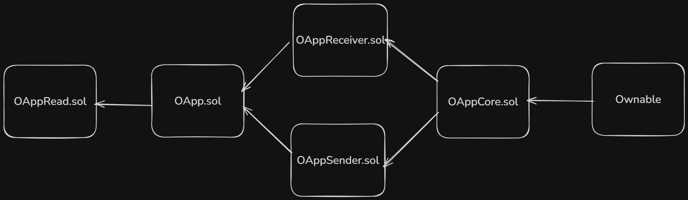

Чтобы контракт мог отправлять read-запросы и получать ответы, нужно наследоваться от [OAppRead.sol](https://github.com/LayerZero-Labs/LayerZero-v2/blob/ab9b083410b9359285a5756807e1b6145d4711a7/packages/layerzero-v2/evm/oapp/contracts/oapp/OAppRead.sol#L4). Цепочка наследования:

- [OAppRead.sol](https://github.com/LayerZero-Labs/LayerZero-v2/blob/ab9b083410b9359285a5756807e1b6145d4711a7/packages/layerzero-v2/evm/oapp/contracts/oapp/OAppRead.sol#L4) -> [OApp.sol](https://github.com/LayerZero-Labs/LayerZero-v2/blob/ab9b083410b9359285a5756807e1b6145d4711a7/packages/layerzero-v2/evm/oapp/contracts/oapp/OApp.sol)
- OApp -> [OAppReceiver.sol](https://github.com/LayerZero-Labs/LayerZero-v2/blob/ab9b083410b9359285a5756807e1b6145d4711a7/packages/layerzero-v2/evm/oapp/contracts/oapp/OAppReceiver.sol) и [OAppSender.sol](https://github.com/LayerZero-Labs/LayerZero-v2/blob/ab9b083410b9359285a5756807e1b6145d4711a7/packages/layerzero-v2/evm/oapp/contracts/oapp/OAppSender.sol)
- OAppReceiver, OAppSender -> [OAppCore.sol](https://github.com/LayerZero-Labs/LayerZero-v2/blob/ab9b083410b9359285a5756807e1b6145d4711a7/packages/layerzero-v2/evm/oapp/contracts/oapp/OAppCore.sol)
- OAppCore -> [Ownable](https://github.com/OpenZeppelin/openzeppelin-contracts/blob/master/contracts/access/Ownable.sol) (OpenZeppelin)

Контракты простые — имеет смысл просмотреть их перед следующим этапом.

Чтобы реализовать lzRead, нужен контракт, наследующий OAppRead и реализующий три части: формирование запроса, оценка комиссии, обработка ответа. В следующем разделе — пример такого контракта и его методы.

---

## Пример OApp контракта (UniswapV3ObserveRead.sol)

Мы уже написали готовый контракт [UniswapV3ObserveRead.sol](./UniswapV3ObserveRead.sol). Он запрашивает с другой сети (data chain) результат вызова `observe()` у пула Uniswap V3 — накопленные за указанный период значения тика и ликвидности; по ним можно вычислить **TWAP** (Time-Weighted Average Price) — среднюю цену актива за период без развертывания контракта в сети пула. Ответ доставляется обратно в наш контракт в origin. Контракт наследует **OAppRead** и **OAppOptionsType3**.

- **OAppRead** — отправка read-запроса и прием ответа в `_lzReceive`.
- **OAppOptionsType3** — [библиотека](https://github.com/LayerZero-Labs/LayerZero-v2/blob/main/packages/layerzero-v2/evm/oapp/contracts/oapp/libs/OAppOptionsType3.sol) для опций сообщений. Owner задает принудительные опции (enforced) через **`setEnforcedOptions(EnforcedOptionParam[])`** для пар `(eid, msgType)`; они хранятся в `enforcedOptions[eid][msgType]`. **`combineOptions(eid, msgType, _extraOptions)`** собирает итоговые опции: объединяет эти enforced с опциями вызывающего — параметром `_extraOptions` в `quoteObserve`/`readObserve` (на стороне executor значения складываются) и передает результат в `_lzSend` и `_quote`. Для lzRead опции в формате Type3: газ на доставку ответа, размер ответа в байтах (response size) и value для executor; сборка — `addExecutorLzReadOption(gas, responseSizeBytes, value)`. Если enforced уже заданы с достаточным газом и response size, можно вызывать с `_extraOptions = 0x`, иначе — передать закодированные опции.

При деплое передаем пять аргументов:

```solidity
constructor(
    address _endpoint,           
    uint32 _readChannel,         
    uint32 _targetEid,          
    address _targetPoolAddress,  
    address _config              // контракт LzReadConfig — деплоим первым
) OAppRead(_endpoint, _config) Ownable(_config) {
    READ_CHANNEL = _readChannel;
    targetEid = _targetEid;
    targetPoolAddress = _targetPoolAddress;
    _setPeer(READ_CHANNEL, AddressCast.toBytes32(address(this)));
}
```

- **_endpoint** — адрес Endpoint в сети деплоя (origin). Берется из [Chains](https://docs.layerzero.network/v2/developers/evm/technical-reference/deployed-contracts) для выбранной origin-сети.
- **_readChannel** — идентификатор read-канала. Берется из [таблицы](https://docs.layerzero.network/v2/deployments/read-contracts) по паре origin и data chain.
- **_targetEid** — EID целевой сети (откуда читаем пул). Берется из [Chains](https://docs.layerzero.network/v2/developers/evm/technical-reference/deployed-contracts) для выбранной data chain.
- **_targetPoolAddress** — адрес пула Uniswap V3 в data chain.
- **_config** — адрес контракта [LzReadConfig.sol](./LzReadConfig.sol) (деплоить первым). Передаётся в OAppRead и в Ownable: конфиг сразу становится владельцем OApp, адрес на OApp не хранится. После деплоя на OApp вызовите `setDelegate(_config)`. Позже (от владельца конфига): сменить делегата — `setOAppDelegate(oapp, delegate)`; задать/сменить read-канал — `setOAppReadChannel(oapp, channelId, active)` (active = false чтобы отключить приём); передать владение — `transferOAppOwnership(oapp, newOwner)`.

Внутри сохраняются `READ_CHANNEL`, `targetEid`, `targetPoolAddress` и вызывается `_setPeer(READ_CHANNEL, AddressCast.toBytes32(address(this)))` — так мы говорим протоколу, что ответы по этому read-каналу доставлять на этот контракт.

### Формирование запроса на чтение

Метод собирает read-команду с помощью библиотеки [ReadCodecV1](https://github.com/LayerZero-Labs/devtools/blob/39dc7f88a1627db4217144e50ee2f07b39935741/packages/oapp-evm/contracts/oapp/libs/ReadCodecV1.sol#L26) (кодирование и декодирование вызовов).

Цель — закодировать вызов `observe(secondsAgos)` на пуле Uniswap V3.

```solidity
function getCmd(uint32[] calldata secondsAgos) public view returns (bytes memory) {
    bytes memory callData =
        abi.encodeWithSelector(IUniswapV3PoolObserve.observe.selector, secondsAgos);

    EVMCallRequestV1[] memory req = new EVMCallRequestV1[](1);
    req[0] = EVMCallRequestV1({
        appRequestLabel: 1,                    // метка запроса
        targetEid: targetEid,                 // EID сети, откуда читать данные
        isBlockNum: false,                    // читать по времени (true = по номеру блока)
        blockNumOrTimestamp: uint64(block.timestamp),  // таймстамп, на котором будет считывание данных
        confirmations: 15,                     // сколько подтверждений блока нужно
        to: targetPoolAddress,                 // адрес контракта в data chain
        callData: callData                     // закодированный метод который будет вызван для получения информации
    });

    return ReadCodecV1.encode(0, req);        // версия 0, один запрос без Compute
}
```

- **secondsAgos** — массив «сколько секунд назад» для `observe`; например `[3600,0]` — данные за последний час и «сейчас».

В массив можно добавить несколько запросов (в т. ч. в разные сети).

### Оценка комиссии за запрос

Перед отправкой запроса вызываем view-функцию, чтобы узнать, сколько нативного токена (или LZ token) нужно отправить вместе с `readObserve`.

```solidity
function quoteObserve(
    uint32[] calldata secondsAgos,   // те же, что пойдут в readObserve
    bytes calldata _extraOptions,    // закодированные опции для executor
    bool _payInLzToken                // true = платить в LZ token, false = в нативном токене сети
) external view returns (MessagingFee memory fee);
```

**Зачем `_payInLzToken`:** вы заранее говорите, чем будете платить при вызове `readObserve` — нативным токеном сети или LZ token. В `fee` возвращаются оба значения (`nativeFee` и `lzTokenFee`); используйте то, что соответствует вашему выбору: при `false` смотрите `fee.nativeFee` и передаете эту сумму в `msg.value` в `readObserve`, при `true` — `fee.lzTokenFee`, а оплата LZ token идет через механизм протокола (approve + списание). В статье дальше предполагается оплата нативным токеном (`_payInLzToken = false`).

Возвращается структура `fee` (поля `nativeFee`, `lzTokenFee`).

### Отправка read-запроса: `readObserve`

Отправляет сформированную командой `getCmd(secondsAgos)` read-запрос в read-канал. Вызывать **payable**, с `msg.value >= fee.nativeFee` (значение из `quoteObserve`).

```solidity
function readObserve(
    uint32[] calldata secondsAgos,   // массив для observe, например [3600, 0]
    bytes calldata _extraOptions     // те же опции, что в quoteObserve (см. выше; при тесте 0x)
) external payable returns (MessagingReceipt memory receipt);
```

Возвращается `MessagingReceipt` (например, для отслеживания в сканере). Ответ придет асинхронно в `_lzReceive`.

### Получение ответа: `_lzReceive`

Вызывается протоколом, когда верифицированный ответ доставлен в origin. В `_message` приходят закодированные возвращаемые значения `observe()`: два массива `(int56[] tickCumulatives, uint160[] secondsPerLiquidityCumulativeX128s)`.

```solidity
function _lzReceive(
    Origin calldata,       // метаданные сообщения (srcEid, sender, nonce)
    bytes32,               // guid сообщения
    bytes calldata _message,  // ответ: abi-encoded (int56[], uint160[])
    address,                // executor
    bytes calldata
) internal override {
    (int56[] memory tickCumulatives, uint160[] memory secondsPerLiquidityCumulativeX128s) =
        abi.decode(_message, (int56[], uint160[]));
    emit ObserveResult(tickCumulatives, secondsPerLiquidityCumulativeX128s);
}
```

Декодируем payload и эмитим событие `ObserveResult` — по нему можно убедиться, что данные пришли.

## Конфигурация приложения

Настройка бывает двух видов: на **endpoint** (библиотеки send/receive, конфиг ReadLib с executor и требования к DVN) и на **OApp** (enforced options, при необходимости смена read-канала).

Вызывать настройку на endpoint может только сам OApp или его **делегат**; настройку на OApp (например `setEnforcedOptions`) — только **владелец** OApp. По этой причине, на `UniswapV3ObserveRead.sol` в конструкторе назначаем владельцем и делегатом наш контракт конфига.  

Контракт конфига помогает настроить эти параметры [LzReadConfig.sol](./LzReadConfig.sol).

Настраивать может деплоер, сам контракт (вызов от его адреса) или делегат — через `setDelegate(address _delegate)` из [OAppCore.sol](https://github.com/LayerZero-Labs/LayerZero-v2/blob/ab9b083410b9359285a5756807e1b6145d4711a7/packages/layerzero-v2/evm/oapp/contracts/oapp/OAppCore.sol).

**Порядок деплоя и настройки:**

1. Задеплоить [LzReadConfig.sol](./LzReadConfig.sol) с одним аргументом: `_endpoint` (адрес Endpoint для сети из [таблицы](https://docs.layerzero.network/v2/deployments/read-contracts)).
2. Задеплоить [UniswapV3ObserveRead.sol](./UniswapV3ObserveRead.sol), передав в аргументы тот же адрес endpoint и адрес только что задеплоенного контракта конфига.
3. **Одним вызовом настроить и endpoint, и OApp** — метод конфига `configureFull(_oapp, _readChannel, _readLib, _libConfig, _receiveGracePeriod, _enforced)` задаёт на endpoint библиотеки send/receive и конфиг ReadLib, а на OApp — enforced options (газ и размер ответа для lzRead).
Аргументы:
   - **\_oapp** — адрес задеплоенного OApp (UniswapV3ObserveRead). Берёте из Remix после деплоя.
   - **\_readChannel** — идентификатор read-канала для пары сетей (origin → data chain). Берётся из [таблицы Read Data Channels](https://docs.layerzero.network/v2/deployments/read-contracts) по вашей сети и целевой.
   - **\_readLib** — адрес библиотеки Read (например ReadLib1002). Тоже из [той же таблицы](https://docs.layerzero.network/v2/deployments/read-contracts) для вашей сети.
   - **\_libConfig** — конфиг ReadLib на endpoint: `(executor, requiredDVNCount, optionalDVNCount, optionalDVNThreshold, requiredDVNs[], optionalDVNs[])`. Адреса **executor**, **requiredDVNs** и **optionalDVNs** и массив требуемых DVNs вы можете выбрать из [таблицы](https://docs.layerzero.network/v2/deployments/read-contracts).
   - **\_receiveGracePeriod** — задержка активации receive-библиотеки в секундах; обычно **0** (сразу).
   - **\_enforced** — принудительные опции для lzRead: структура из трех полей. **eid** (uint32) = тот же readChannel; **msgType** (uint16) = 1 для lzRead; **options** (bytes) — закодированные опции (gas, размер ответа в байтах, value).
   - **Поле options:** К сожалению в библиотеках layerZero нет доступа к вспомогательному методу кодировки этих параметров, поэтому я создал для вас [тулзу]((./tools/options-encoder.html)) кодировки, которой вы можете воспользоваться для удобства. Скачиваем файл тулзы и открываем в браузере.

_В конструкторе OApp уже вызывается `_setPeer(READ_CHANNEL, ...)`. Менять read-канал или отключать приём ответов можно через конфиг: владелец конфига вызывает `LzReadConfig.setOAppReadChannel(адрес OApp, channelId, active)` (active = false чтобы отключить)._

_Альтернатива нашему мануальному способу деплою, конфигурации и способу чтению данных является уже репозиторием с уже готовым набором скриптов — [LayerZero CLI](https://docs.layerzero.network/v2/get-started/create-lz-oapp/start)._

## Практика

Представим: в нашей сети (origin) **Base Sepolia** нет цены на токен, которая нужна контракту. Через lzRead можно запросить данные о цене с другой сети — например, с контракта пула Uniswap V3 в сети **Ethereum Sepolia**, где этот токен уже торгуется.

Ниже — пошаговый порядок: деплой контракта в origin, оценка комиссии через `quoteObserve`, отправка read-запроса через `readObserve`, проверка транзакции в LayerZero Scan и проверка результата (событие `ObserveResult`).

_Можно повторить с указанными ниже адресами или подставить свои из [списка](https://docs.layerzero.network/v2/developers/evm/technical-reference/deployed-contracts), убедившись, что для пары сетей есть Read Path в [Read Data Channels](https://docs.layerzero.network/v2/deployments/read-contracts) и в data chain есть подходящий пул Uniswap V3 с ликвидностью._

_Совет:_ после деплоя сразу делайте **Pin contract for current workspace** (значок рядом с адресом контракта в Remix), а адреса копируйте — при смене сети развернутые контракты сбрасываются. Чтобы вызвать методы уже развернутого контракта, во вкладке **Contract** выберите контракт и вставьте его адрес в **At Address**.

В примере: **origin** = Base Sepolia, **data chain** = Ethereum Sepolia.

1. Откройте [Remix](https://remix.ethereum.org/) и добавьте контракты [LzReadConfig.sol](./LzReadConfig.sol) и [UniswapV3ObserveRead.sol](./UniswapV3ObserveRead.sol).
2. Собираем все данные для деплоя:
- Endpoint берем для сети origin с [этой](https://docs.layerzero.network/v2/deployments/deployed-contracts) таблицы;
- EID для data chain берем [тут](https://docs.layerzero.network/v2/deployments/deployed-contracts);
- targetPoolAddress для target сети можем найти через [Uniswap deployments](https://docs.uniswap.org/contracts/v3/reference/deployments/ethereum-deployments). Убедитесь, что вызов `observe` на пуле возвращает данные;
- readChannel находим в этой [таблице](https://docs.layerzero.network/v2/deployments/read-contracts), указывая сеть origin и сеть target data;
- readLib для origin сети находим [тут](https://docs.layerzero.network/v2/deployments/read-contracts);
- libConfigParams для origin сети тоже находим [тут](https://docs.layerzero.network/v2/deployments/read-contracts). Он включает в себя такие параметры как: executor, requiredDVNCount, optionalDVNCount, optionalDVNThreshold, requiredDVNs, optionalDVNs;
- enforced использует уже известный readChannel, msgType = 1, и options, который мы кодируем через специальную созданную тулзу;

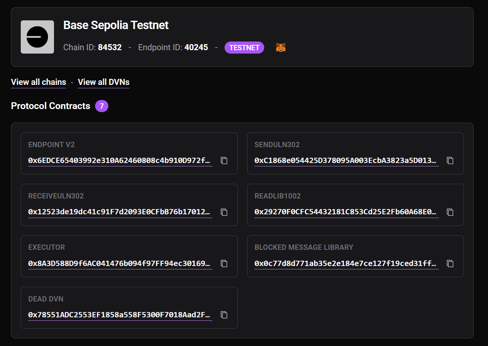
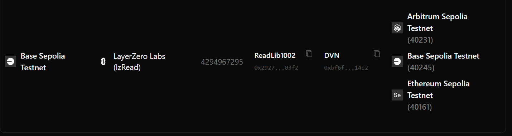
3. Задеплойте сначала [LzReadConfig.sol](./LzReadConfig.sol) (аргумент: endpoint), затем [UniswapV3ObserveRead.sol](./UniswapV3ObserveRead.sol) (endpoint, readChannel, targetEid, targetPoolAddress, адрес LzReadConfig).
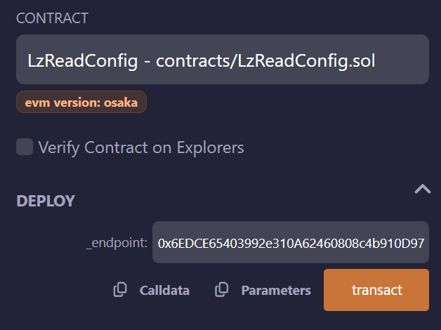
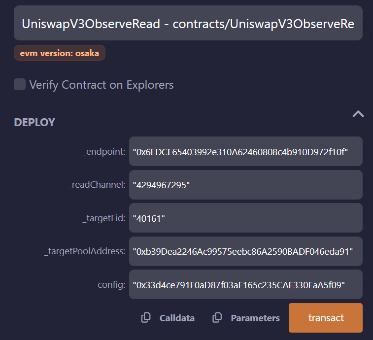
4. Далее, на LzReadConfig вызовите `configureFull(OApp, readChannel, readLib, libConfigParams, 0, enforcedParams)`.
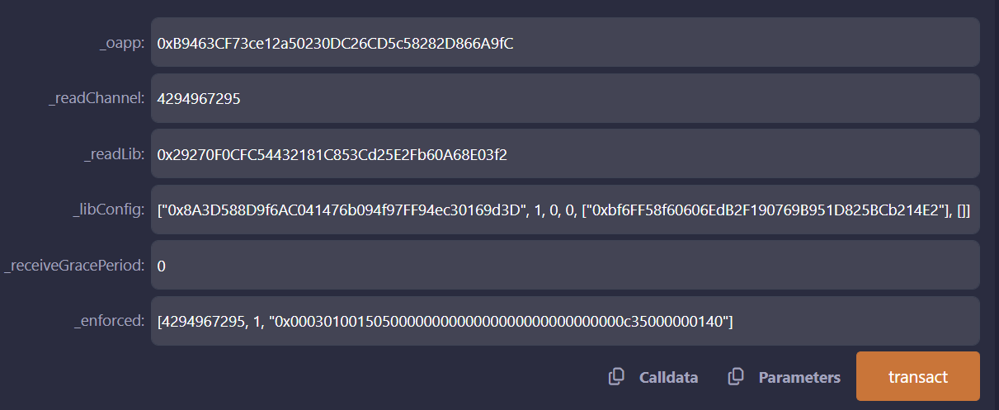
5. Оцените комиссию: `quoteObserve(secondsAgos, extraOptions, false)` на задеплоенном контракте `UniswapV3ObserveRead.sol`. Например, `secondsAgos = [3600,0]` для TWAP за последний час. `extraOptions` можно передать `0x` — enforced options уже заданы.
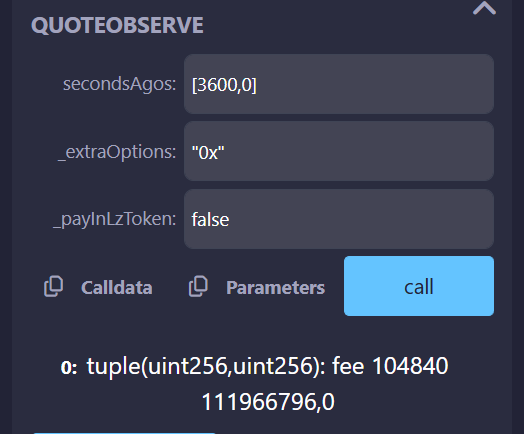
6. В Remix в поле **Value** укажите `fee.nativeFee` (в Wei) и вызовите `readObserve(secondsAgos, extraOptions)`.
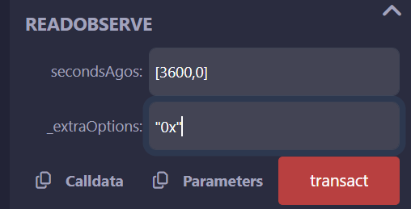
7. После подтверждения транзакции, в сканере по адресу `UniswapV3ObserveRead.sol` можно найти состояние вашего запроса [testnet.layerzeroscan.com](https://testnet.layerzeroscan.com/).
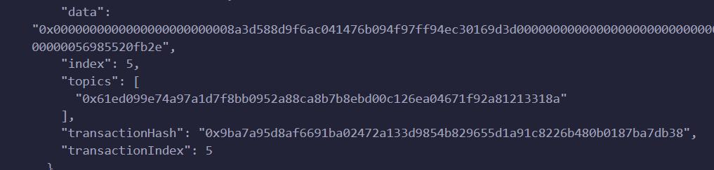.
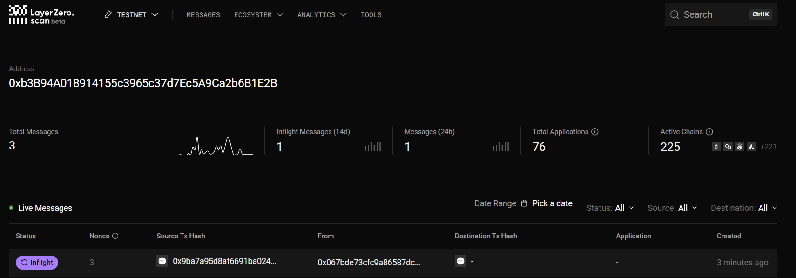
8. После статуса **Delivered** в origin будет вызван `_lzReceive` и эмитировано событие `ObserveResult`. Проверить можно по ссылке на Response transaction в разделе логов.
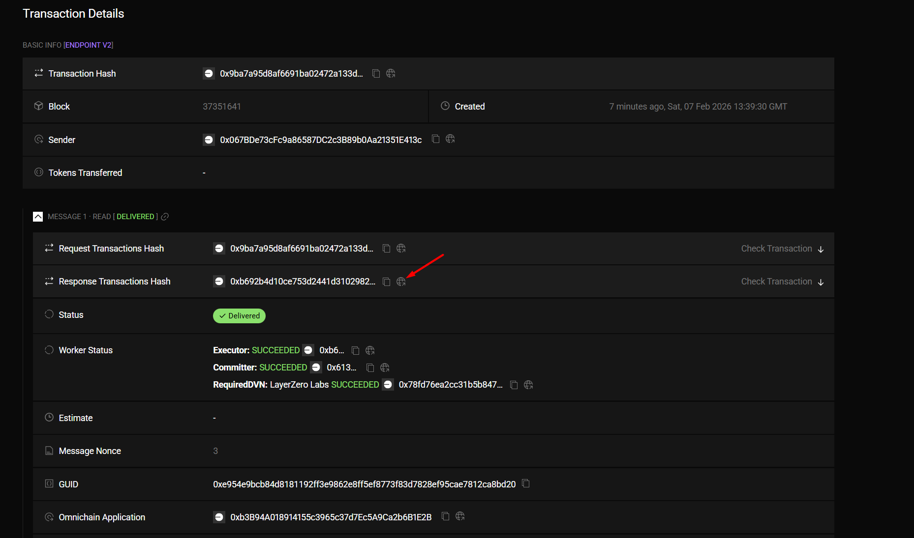

## Заключение

С lzRead ваш контракт в одной сети может запросить данные в другой и получить ответ обратно — без деплоя контрактов там и без двух отдельных сообщений туда-сюда. Вы формируете запрос, отправляете его по read-каналу и обрабатываете ответ в `_lzReceive`. Так же, как мы ранее говорили, есть дополнительный функционал — Compute ([lzMap](https://docs.layerzero.network/v2/developers/evm/lzread/overview#lzmap), [lzReduce](https://docs.layerzero.network/v2/developers/evm/lzread/overview#lzreduce)).

---

## Ссылки

- [Docs: Omnichain Queries (lzRead)](https://docs.layerzero.network/v2/developers/evm/lzread/overview)
- [Read Data Channels](https://docs.layerzero.network/v2/deployments/read-contracts)
- [EVM DVN and Executor Configuration](https://docs.layerzero.network/v2/developers/evm/configuration/dvn-executor-config)
- [The lzRead Deep Dive (MapReduce, BQL)](https://layerzero.network/blog/the-lzread-deep-dive)
- [GitHub: LayerZero v2](https://github.com/LayerZero-Labs/LayerZero-v2)
- [LayerZeroScan](https://layerzeroscan.com/) / [Testnet LayerZeroScan](https://testnet.layerzeroscan.com/)
