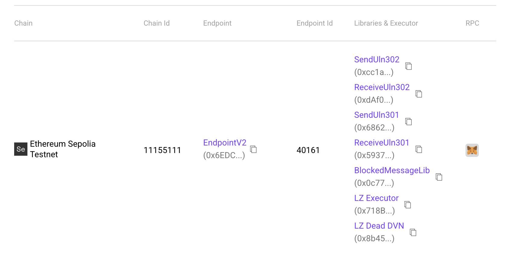
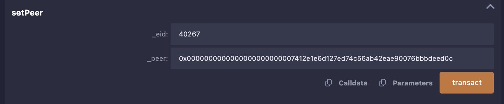
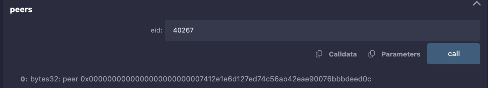
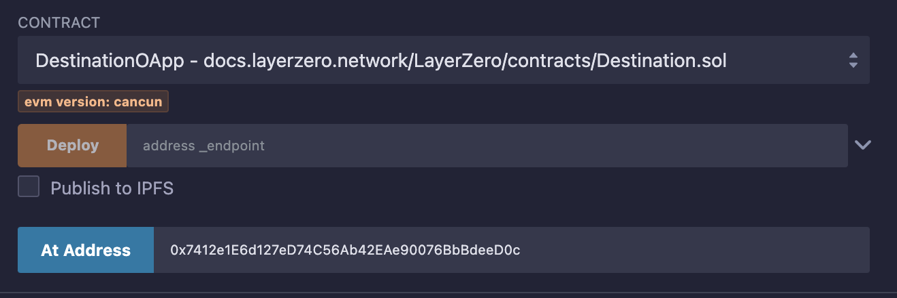
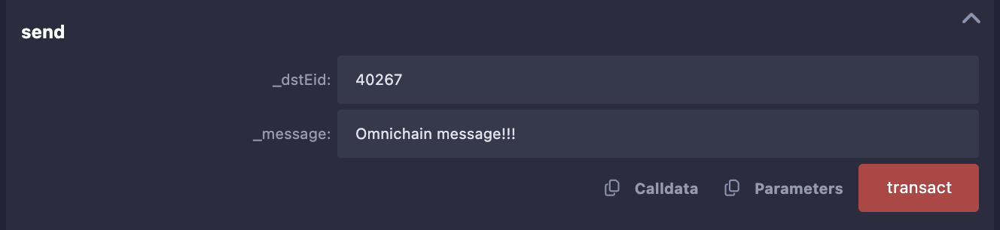
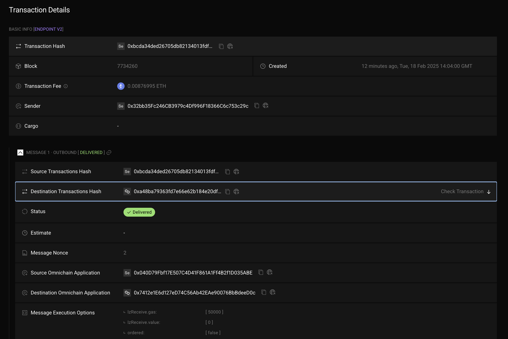
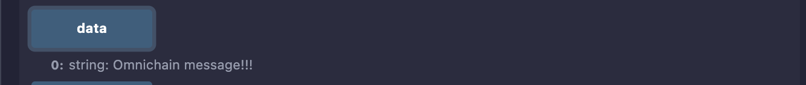

# Взаимодействие с протоколом LayerZero v2. Часть 1. Простой OApp в Remix

**Автор:** [Роман Ярлыков](https://github.com/rlkvrv) 🧐

Если вы уже прочитали статью по архитектуре протокола LayerZero - следующий шаг попробовать его в деле. Самый простой способ это сделать - развернуть смарт-контракты в [Remix IDE](https://remix-ide.readthedocs.io/en/latest/index.html), настроить их и отправить простое сообщение. Это поможет понять, что из себя представляет простой OApp, как он работает и зачем нужен.

Терминология:

- **Исходная сеть** - блокчейн, отправляющий данные в другую сеть.
- **Сеть назначения** - блокчейн, принимающий данные из исходной сети.
- **OApp** (Omnichain Application) - оминчейн приложение, имеющее все необходимые интерфейсы для отправки и получения сообщений.
- **EID** - Endpoint ID. Endpoint - это смарт-контракт, который обрабатывает все входящие и исходящие сообщения в любой сети.
- **ZRO** - utility-токен платформы LayerZero, а также токен голосования.
- **Executor** - он же исполнитель, смарт-контракт который исполняет транзакцию по доставке сообщения в сети назначения.

## Создание простого OApp

В [документации](https://docs.layerzero.network/v2/developers/evm/getting-started#example-omnichain-application) предлагается развернуть два смарт-контракта: `SourceOApp` и `DestinationOApp`, которые отправляют сообщения между блокчейнами, используя Remix (см. раздел _Example Omnichain Application_). Эти контракты уже написаны — остается только их задеплоить и настроить.

На всякий случай я продублирую ссылки на Remix сюда, т.к. документацию часто переписывают:

- [SourceOApp](https://remix.ethereum.org/#url=https://docs.layerzero.network/LayerZero/contracts/Source.sol&lang=en&optimize=false&runs=200&evmVersion=null&version=soljson-v0.8.26+commit.8a97fa7a.js)
- [DestinationOApp](https://remix.ethereum.org/#url=https://docs.layerzero.network/LayerZero/contracts/Destination.sol&lang=en&optimize=false&runs=200&evmVersion=null&version=soljson-v0.8.26+commit.8a97fa7a.js)

Это два очень простых смарт-контракта. `SourceOApp` наследуется от [OAppSender](https://github.com/LayerZero-Labs/devtools/blob/main/packages/oapp-evm/contracts/oapp/OAppSender.sol), а `DestinationOApp` от [OAppReceiver](https://github.com/LayerZero-Labs/devtools/blob/main/packages/oapp-evm/contracts/oapp/OAppReceiver.sol).

Наша задача — переслать простое сообщение (строку) из одного блокчейна в другой.

Что нам понадобится? На самом деле, не так много:

1. Два OApp-приложения, задеплоенные в разных блокчейнах (`SourceOApp` и `DestinationOApp`).
2. Адреса `Endpoint` в обеих сетях, а также их `EID` (Endpoint ID). Их можно найти в [этой таблице](https://docs.layerzero.network/v2/developers/evm/technical-reference/deployed-contracts).

  
_Таблица с адресами основных контрактов и `EID`. Источник: LayerZero Chains._

### Source OApp

Посмотрите на код `SourceOApp` (в Remix) — он довольно простой. Нас интересуют две функции:

- `SourceOApp::quote` — позволяет рассчитать, сколько нативных токенов нужно передать в сеть назначения, чтобы хватило на выполнение транзакции и проверок в стеке безопасности. Параметр `_payInLzToken` устанавливается, если оплата будет производиться _не_ в нативном токене сети (а например с помощью ERC20-токена протокола ZRO).

```solidity
function quote(
    uint32 _dstEid,
    string memory _message,
    bool _payInLzToken
) public view returns (MessagingFee memory fee) {
    bytes memory payload = abi.encode(_message);
    fee = _quote(_dstEid, payload, _options, _payInLzToken);
}
```

- `SourceOApp::send` — отправляет сообщение и передает нативные токены для оплаты газа в сети назначения.

```solidity
function send(
    uint32 _dstEid,
    string memory _message
) external payable {
    // Кодируем сообщение перед вызовом _lzSend.
    bytes memory _encodedMessage = abi.encode(_message);
    _lzSend(
        _dstEid,
        _encodedMessage,
        _options,
        // Комиссия в нативном токене (или токене ZRO).
        MessagingFee(msg.value, 0),
        // Адрес отправителя в исходной сети (на случай возврата комиссии).
        payable(msg.sender)
    );
    emit MessageSent(_message, _dstEid);
}
```

### Базовая настройка OApp

Адрес `Endpoint` задается при деплое контракта. После развертывания нужно также связать смарт-контракты между собой вызвав `SourceOApp::setPeer(uint32 eid, bytes32 peer)` в обоих контрактах (в исходной сети и в сети назначения).

_Примечание:_ Peer в данном случае это OApp. Два OApp могут обмениваться сообщениями только если у них есть связь **peer-to-peer** через `eid` и адрес контракта. Функция `setPeer` находится в смарт-контракте `OAppCore`.

_Важно!_ `SourceOApp::setPeer` принимает адрес в формате `bytes32`. Это сделано намеренно, так как форматы адресов в разных блокчейнах могут различаться (например, в EVM это 20 байт, а в Solana — 32 байта).



Чтобы перевести EVM-адрес в `bytes32`, можно воспользоваться следующей функцией:

```solidity
function addressToBytes32(address _addr) public pure returns (bytes32) {
    return bytes32(uint256(uint160(_addr)));
}
```

После выполнения транзакции можно проверить, что `peer` установлен верно.



_Примечание:_ `EID` необходим, потому что не у всех блокчейнов есть `chain ID`.

### Destination OApp

В OApp-сети назначения нас интересует одна ключевая функция — `_lzReceive`. Она переопределяется так, чтобы обрабатывать определенные типы сообщений. В нашем случае это обычная строка.

```solidity
function _lzReceive(
    Origin calldata _origin,
    bytes32 /*_guid*/,
    bytes calldata message,
    address /*executor*/,  // Адрес исполнителя, указанный для OApp.
    bytes calldata /*_extraData*/  // Любые дополнительные данные или опции.
) internal override {
    // Декодируем полезную нагрузку, чтобы получить сообщение.
    data = abi.decode(message, (string));
    emit MessageReceived(data, _origin.srcEid, _origin.sender, _origin.nonce);
}
```

### Практическая часть

Теперь выполним все шаги из документации по развертыванию приложений и отправке сообщения. Для большего погружения рекомендую использовать другие блокчейны из [этого списка](https://docs.layerzero.network/v2/developers/evm/technical-reference/deployed-contracts) вместо тех, что предложены в документации.

_Примечание:_ копируйте адреса контрактов сразу после деплоя, а также делайте "Pin contract for current workspace" - нажать соответствующий значок рядом с адресом контракта, потому что в Remix, если переключиться на другую сеть, развернутые контракты сбрасываются (даже если вкладка остается открытой).

Напомню: чтобы в Remix получить доступ к функциям уже развернутого контракта, выберите этот контракт во вкладке **Contract** и вставьте его адрес в **At Address**.



Порядок действий:

1. Выбираем два блокчейна. Проверяем, что у нас достаточно нативных токенов для оплаты газа.
2. Переходим в документацию LayerZero → [Chains](https://docs.layerzero.network/v2/developers/evm/technical-reference/deployed-contracts) и находим адреса `Endpoint` и соответствующие `EID`. Сохраняем их — они понадобятся дальше.
3. Деплоим контракт `SourceOApp` в **исходную сеть**. Для этого потребуется адрес `Endpoint` в этой сети.
4. Деплоим контракт `DestinationOApp` в **сеть назначения**, также используя соответствующий `Endpoint`. Сохраняем адрес.
5. Переключаемся обратно на исходную сеть, переводим адреса в формат `bytes32`. Для этого вызываем `Source::addressToBytes32` (как для OApp в исходной сети, так и для OApp в сети назначения).
6. Связываем OApps через `setPeer`, выполнив две транзакции:
   - `Source::setPeer(uint32 eid, bytes32 peer)`
   - `Destination::setPeer(uint32 eid, bytes32 peer)`
7. Рассчитываем, сколько нативных токенов потребуется для оплаты газа в сети назначения. Для этого используем `Source::quote(uint32 dstEid, string message, bool payLzToken)`. Параметр `payLzToken` можно указать `false`.

   

8. Вставляем рассчитанный `fee` (количество Wei) в поле **Value** в Remix и отправляем сообщение через `Source::send(uint32 dstEid, string message)`.

     
   

9. Проверяем транзакцию на [testnet.layerzeroscan.com](https://testnet.layerzeroscan.com/). Ищем по хешу транзакции (его можно взять в логах Remix).

     
   

10. Сразу после совершения транзакции статус в сканере будет **Inflight**. Через несколько минут, если все прошло успешно, статус изменится на **Delivered**. В сети назначения можно проверить полученное сообщение через `Destination::data`.

    

_Примечание:_ если у вас есть немного ETH в **Arbitrum** и POL в **Polygon**, можно воспользоваться развернутыми мной смарт-контрактами и проверить, как это работает в мейннете. Это обойдется всего в несколько центов, но иногда проще заплатить, чем искать тестовые токены.

Для этого:

- Откройте Remix.
- Подключитесь к контрактам по указанным ниже адресам (через **At Address**).
- Отправьте текстовое сообщение.

**Важно:** работает только в одном направлении - **Arbitrum → Polygon**.

Смарт-контракты:

- **Arbitrum:**
  - `SourceOApp`: `0x6b5ebc0bdb2572533f1cbe09026663a524421594`
  - `EID`: `30110`
- **Polygon:**
  - `DestinationOApp`: `0x0c02cb84eef5f3ea61be9dfec7f884dffc1fa6c0`
  - `EID`: `30109`

Примеры транзакций:

- [Пример 1](https://layerzeroscan.com/tx/0x55615e9ee9be40614756fed61af5e5ad35b4e63cceefce4e3d49a6ccf0cf9f95)
- [Пример 2](https://layerzeroscan.com/tx/0x9124aa03fefd50d7d2345c941e7e9e26c41d1b98023326548ce5346c0fa22257)

Когда работаешь в мейннете, волей-неволей начинаешь все делать внимательнее и глубже вникаешь в детали. Хотя даже это не спасает от ошибок 😁. Я, например, несколько раз накосячил — указывал неверный `EID` и забывал отправить нативные токены. Так что рекомендую попробовать!

## Заключение

Теперь можно задеплоить `DestinationOApp` в любой другой блокчейн (включая не-EVM сети), добавить новый `peer` в `SourceOApp` и отправлять туда сообщения.

Это была своего рода разминка. Возможно вам этого будет достаточно, но если есть желание разобраться в OApp глубже, я написал отдельную статью по созданию OFT (Omnichain Fungible Token). OFT - это тоже OApp, только с дополнительной логикой для пересылки токена между сетями. Об этом будет часть 2.

## Ссылки

- [GitHub: LayerZero v2](https://github.com/LayerZero-Labs/LayerZero-v2)
- [Docs: LayerZero v2](https://docs.layerzero.network/v2)
- [LayerZeroScan](https://layerzeroscan.com/)
