# Взаимодействие с протоколом LayerZero v2. OFT токен

**Автор:** [Роман Ярлыков](https://github.com/rlkvrv) 🧐

План статьи:
- ✅ Определите проблему или задачу.
- ✅ Показать пример создания простого OApp.
- ✅ Показать пример создания OFT токена:
   - ✅ Наследуемые контракты
   - ✅ Механизмы отправки сообщения
   - ✅ Local and Shared decimals
   - ✅ Как работать с msgInspector
   - ✅ Combine options
   - ✅ Механизмы получения сообщения
- ✅ Работа с газом.
   - ✅ Как посчитать
   - ✅ Как ограничить.
- ✅ Деплой OFT-токена
- ✅ Настройка OFT-токена
- ✅ Оценка газа через скрипт
- ✅ Транзакции c OFT-токеном
- ✅ Как работать с PreCrime
- ✅ Опции
- ✅ Заключение
- ✅ Ссылки

## Введение

В этой статье я постараюсь показать способы создания и настройки омничейн приложений на базе LayerZero v2. В частности мы напишем OFT (Omnichain Fungible Token) токен, поговорим о настройках для такого приложения и возможных проблемах.

Обзор верхнеуровневой архитектуры протокола и вайтпепера я сделал в [другой](../architecture/README.md) статье (там же объясняется концепция омничейн приложений), здесь сфокусируемся на коде.

*Примечание:* у LayerZero неплохая документация, поэтому чтобы не повторяться иногда я буду отправлять читателя именно туда, здесь же рассмотрим основные и не самые очевидные моменты.

Итак, задача этой статьи познакомиться с основными контрактами и написать свое приложение, чтобы прочувствовать все особенности и понять на что обращать внимание.

Статья подойдет для тех, кто хочет разобраться с OFT-токенами и возможно написать свой. Во втором случае желательно выполнять практические задания из статьи, в конце концов это просто весело.

**Терминология:**
- **сеть** - под этим словом подразумевается любой блокчейн, который участвует в межсетевом взаимодействии;
- **исходная сеть** - блокчейн, который отправляет какую-либо информацию в другой блокчейн;
- **сеть назначения** - блокчейн, который принимает отправленную информацию из исходной сети. 


## Создание простого OApp в двух блокчейнах

Чтобы не заскучать я предлагаю сразу перейти к практике и отправить сообщение между  OApps развернутых в двух блокчейнах (для простоты они будут EVM-совместимы). Это поможет понять самые базовые принципы работы омничейн приложений и пощупать все руками. После этого будет легче разбираться с более сложными вещами, а в голове сформируются правильные вопросы.

### Теория

В [документации](https://docs.layerzero.network/v2/developers/evm/getting-started#example-omnichain-application) предлагается развернуть два смарт-контракта: `SourceOApp` и `DestinationOApp` для отправки сообщения из одного чейна в другой используя Remix (раздел Example Omnichain Application), да, они уже написали эти контракты, необходимо только задеплоить и настроить. Это два очень простых смарт-контракта которые наследуются от [OAppSender](https://github.com/LayerZero-Labs/devtools/blob/main/packages/oapp-evm/contracts/oapp/OAppSender.sol) и [OAppReceiver](https://github.com/LayerZero-Labs/devtools/blob/main/packages/oapp-evm/contracts/oapp/OAppReceiver.sol).

Задача - переслать простое сообщение (строку) из одного блокчейна в другой. Весь процесс хорошо описан в документации, а ниже я дал некоторые подсказки в практической части.

Что нам понадобится чтобы переслать сообщение? На самом деле не так много:
1. Приложения OApp в двух блокчейнах (деплоим сами).
2. Адреса Endpoint в обоих сетях а также их EID (Endpoint ID). Все это можно взять в [таблице](https://docs.layerzero.network/v2/developers/evm/technical-reference/deployed-contracts).

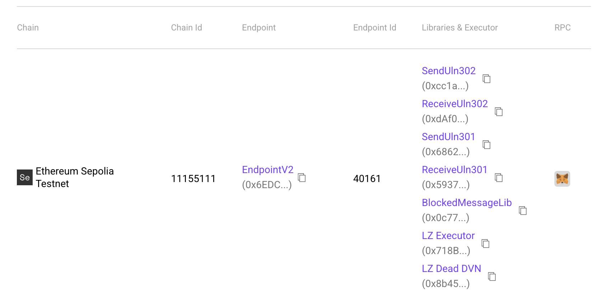  
*Таблица с адресами основных контрактов и EID. Источник: LayerZero Chains.*

#### Source OApp

Посмотрите на код `SourceOApp` (в Remix), он довольно простой, нас интересуют две функции:
- `SourceOApp::quote` - позволяет рассчитать, сколько нативных токенов нужно передать в сеть назначения, чтобы хватило на выполнение как самой транзакции, так и для проверок в стеке безопасности. `_payInLzToken` устанавливается, когда оплата будет производиться НЕ в нативном токене сети.
```solidity
function quote(
    uint32 _dstEid,
    string memory _message,
    bool _payInLzToken
) public view returns (MessagingFee memory fee) {
    bytes memory payload = abi.encode(_message);
    fee = _quote(_dstEid, payload, _options, _payInLzToken);
}
```

- `SourceOApp::send` - выполняет отправку сообщения и нативных токенов для оплаты газа в сети назначения.
```solidity
function send(
    uint32 _dstEid,
    string memory _message
) external payable {
    // Кодирование сообщения перед вызовом _lzSend.
    bytes memory _encodedMessage = abi.encode(_message);
    _lzSend(
        _dstEid,
        _encodedMessage,
        _options,
        // Комиссия в нативном токене (либо токене ZRO).
        MessagingFee(msg.value, 0),
        // Адрес в исходной сети, на случай несли нужно вернуть комиссию.
        payable(msg.sender) 
    );
    emit MessageSent(_message, _dstEid);
}
```

#### Особенности базовой настройки OApp

Адрес Endpoint устанавливается при развертывании контракта. После развертывания также необходимо вызвать `SourceOApp::setPeer(uint32 eid, bytes32 peer)` на обоих контрактах (в исходной сети и сети назначения). На самом деле это функция смарт-контракта `OAppCore`, которая позволяет связать приложения.

*Важно!* `SourceOApp::setPeer` принимает адрес в формате `bytes32`, это было сделано намеренно, потому что форматы адресов могут отличаться в разных блокчейнах (например в EVM это 20 байт, а в Solana - 32 байта).

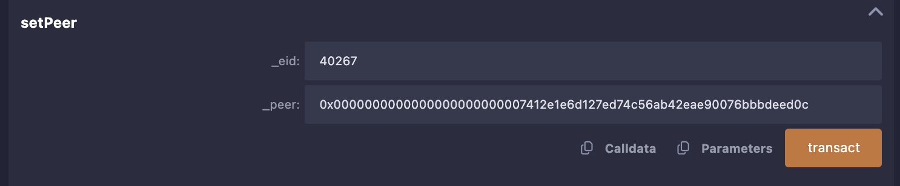

Чтобы перевести адрес из EVM формата в `bytes32` достаточно выполнить несложную конвертацию (для этого есть функция `Source::addressToBytes32`):

```solidity
function addressToBytes32(address _addr) public pure returns (bytes32) {
    return bytes32(uint256(uint160(_addr)));
}
```

После транзакции проверяем, что peer установлен верно.


*Примечание:* Что касается EID, они необходимы, потому что не у всех блокчейнов есть chain ID.

#### Destination OApp

В OApp сети назначения нас интересует только одна функция - `_lzReceive`. Она переопределена таким образом, чтобы получать конкретный тип сообщений. В нашем случае - это обычная строка.

```solidity
function _lzReceive(
    Origin calldata _origin,
    bytes32 /*_guid*/,
    bytes calldata message,
    address /*executor*/,  // Адрес исполнителя, указанный для OApp.
    bytes calldata /*_extraData*/  // Любые дополнительные данные или опции для запуска при получении.
) internal override {
    // Декодируем полезную нагрузку, чтобы получить сообщение
    data = abi.decode(message, (string));
    emit MessageReceived(data, _origin.srcEid, _origin.sender, _origin.nonce);
}
```

### Практическая часть

Теперь выполним все действия, описанные в документации для развертывания приложений и отправки сообщения. Для большего погружения советую использовать другие блокчейны из [этого списка](https://docs.layerzero.network/v2/developers/evm/technical-reference/deployed-contracts) (вместо тех, что предложены в документации).

*Примечание:* Советую копировать адреса контрактов после деплоя, в Remix когда вы переключаетесь на другую сеть задеплоеные контракты сбрасываются (даже если сделать это в другой вкладке).

Напомню, чтобы в Remix получить доступ к функциям уже задеплоеного контракта нужно выбрать этот контракт во вкладке "Contract" и вставить его адрес в "At Address".

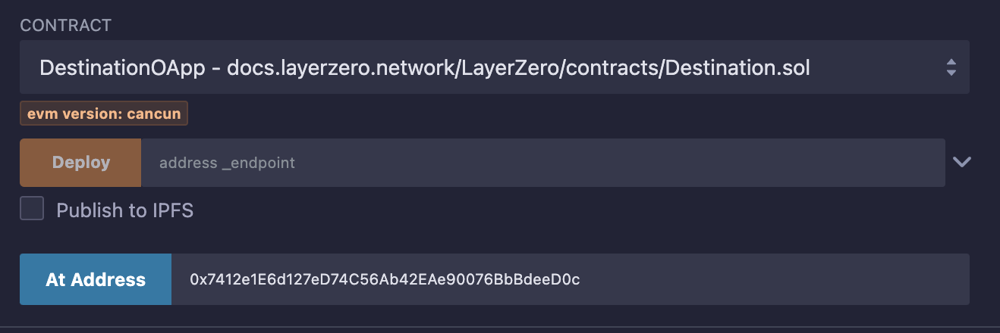

Получается следующий порядок действий:
1. Выбираем два блокчейна. Убеждаемся, что у нас достаточно нативных токенов для оплаты газа.
2. Идем в раздел документации LayerZero - [Chains](https://docs.layerzero.network/v2/developers/evm/technical-reference/deployed-contracts) и смотрим адреса Endpoint и соответствующие EID (Endpoint ID). Сохраняем, они пригодятся дальше.
3. Деплой контракта Source в исходную сеть. Для этого понадобится адрес Endpoint в этой сети.
4. Деплой контракта в Destination сеть назначения, также нужен адрес Endpoint. Снова сохраняем адрес.
5. Переключаемся обратно на исходную сеть, нужно перевести адреса в формат `bytes32`. Для этого вызывать `Source::addressToBytes32` (для OApp в исходной сети и OApp в сети назначения).
6. Связываем OApps через `setPeer`, для этого выполняем две транзакции: `Source::setPeer(uint32 eid, bytes32 peer)` и `Destination::setPeer(uint32 eid, bytes32 peer)`.
7. Для отправки сообщения осталось рассчитать, сколько передать нативных токенов для оплаты газа в сети назначения. В этом поможет функция `Source::quote(uint32 dstEid, string message, bool payLzToken)`. Параметр `payLzToken` можно указать `false`.
    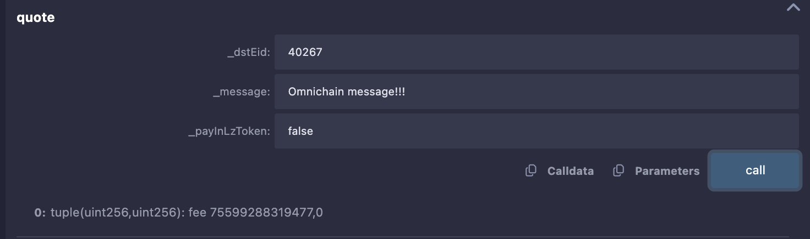
8. Вставить результат расчета fee (количество Wei) в инпут Remix - value и можно отправлять сообщение через `Source::send(uint32 dstEid, string message)`.
    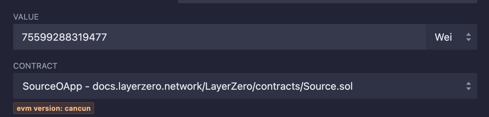
    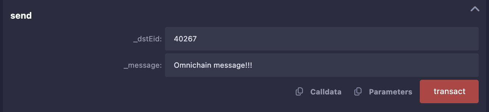
9. Смотрим результат транзакции в [testnet.layerzeroscan.com](https://testnet.layerzeroscan.com/). Ищем по хешу транзакции, его можно взять в логах Remix.
    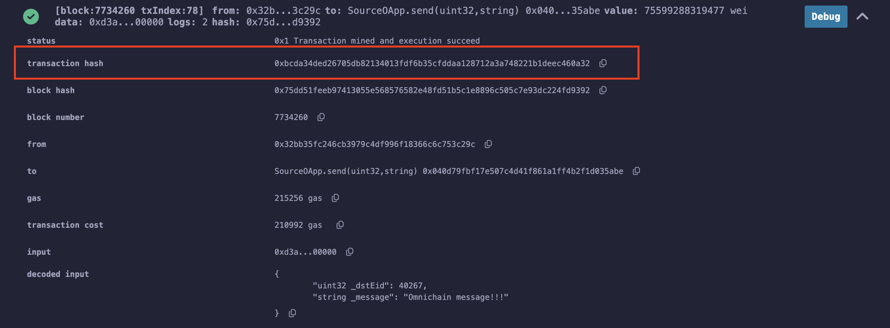
    
10.  Если все прошло успешно (статус Delivered), теперь в сети назначения можно посмотреть полученное сообщение через `Destination::data`.
    

*Примечание:* Если у вас есть немного ETH в Arbitrum и Pol в Polygon - можете использовать развернутые мной смарт-контракты, чтобы проверить как это работает в мейннете, это будет стоить какие-то центы, но иногда это проще, чем достать тестовые токены.

Понадобится открыть ссылки выше в Remix, подключиться к смарт-контрактам адреса которых я дам чуть ниже (через "At Address") и можно также отправить текстовое сообщение. Работает только в одну сторону Arbiturm -> Polygon.

Смарт-контракты:
- **Arbitrum**: 
  - SourceOApp: 0x6b5ebc0bdb2572533f1cbe09026663a524421594
  - eid: 30110
- **Polygon**:
  - DestinationOApp: 0x0c02cb84eef5f3ea61be9dfec7f884dffc1fa6c0
  - eid: 30109

- Пример транзакции 1 - [layerzeroscan](https://layerzeroscan.com/tx/0x55615e9ee9be40614756fed61af5e5ad35b4e63cceefce4e3d49a6ccf0cf9f95).
- Пример транзакции 2 - [layerzeroscan](https://layerzeroscan.com/tx/0x9124aa03fefd50d7d2345c941e7e9e26c41d1b98023326548ce5346c0fa22257).

К тому же, когда делаешь транзакции в мейннете стараешься все делать внимательнее и лучше разбираешь в деталях, но меня даже это не спасло, пару раз я накосячил (указал неверный eid и забыл отправить нативные токены), поэтому рекомендую 😁.

## OFT токен

В предыдущем разделе мы создали базовое омничейн приложение. Теперь можно заделоить `DestinationOApp` в любой другой блокчейн (включая не EVM), добавить новый `peer` в `SourceOApp` и отправлять туда сообщения.

Минус этого приложения в том, что оно работает в одну сторону, будет лучше делать такие приложения "универсальными", чтобы они могли работать и на отправку и на примем сообщений. Приложения OApp могут содержать совершенно любую логику и обмениваться произвольными данными.

Один из самых интересных кейсов использования - это OFT-токен (Omnichain Fungible Token). Протокол LayerZero уже подумал за нас, как создать такой токен с использованием их платформы и сделали стандарт OFT. Это ERC20-токен, который может существовать в любом количестве блокчейнов, при этом для поддержки нового достаточно развернуть там новое приложение и привязать его к остальным.

Возникает закономерный вопрос - чем это отличается от обычного моста? Я отвечал на этот вопрос в обзорной статье, но если коротко - главное отличие в универсальных интерфейсах и возможности обеспечить действительно хороший уровень безопасности передачи токенов.

### Пример USDT0

В качестве примера реального OFT-токена можно посмотреть на [USDT0](https://usdt0.to/). Это хорошо всем знакомый Tether USD (USDT), который переводит свой токен на OFT рельсы. Возможно когда вы читаете эту статью, токен USDT уже мигрирован на USDT0 во всех сетях, кроме Ethereum. Сейчас это только несколько блокчейнов.

В случае с USDT0 использовали так называемый OFTAdapter, который позволяет блокировать/разблокировать исходных токен в базовой сети, а во всех остальных минтить/сжигать. OFTAdapter необходим, когда у вас уже есть обычный ERC-токен, но вы хотите сделать из него OFT.

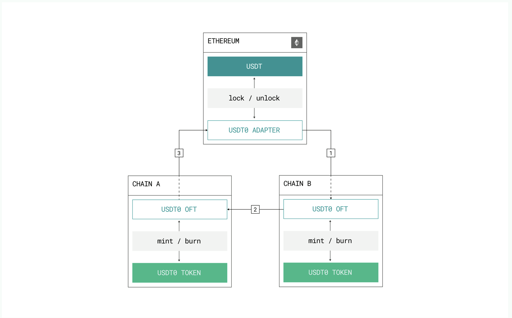  
*Источник: документация USDT0*

К сожалению у проекта нет публичного github-репозитория, но все смарт-контракты верефицированы и код можно посмотреть в эксплорерах (ссылки [тут](https://docs.usdt0.to/technical-documentation/developer#id-3.-deployments)). Также есть очень интересные отчеты по аудиту USDT0, очень рекомендую ознакомиться с ними [здесь](https://github.com/Everdawn-Labs/usdt0-audit-reports), там много интересного.

## Что нужно для создания OFT-токена?

Самый простой способ быстро развернуть проект OFT-токена для LayerZero - это [создать](https://docs.layerzero.network/v2/developers/evm/oft/quickstart) его на своей машине через npm. Нужно выполнить следующую команду:

```bash
npx create-lz-oapp@latest
```

Далее выбираем OFT.

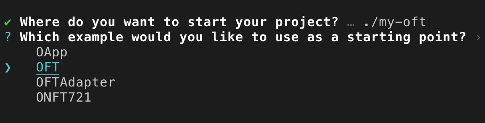

После выбора пакетного менеджера мы получим готовый проект с OFT-токеном. Более того, этот проект "из коробки" может работать как с Hardhat, так и с Foundry, что особенно круто. Останется только поменять нейминг, задеплоить контракты и настроить их взаимодействие в разных сетях. Плюс в проекте уже есть все необходимое для деплоя, тестирования и даже есть скрипты для оценки газа.

## Структура OFT-токена

Основная структура OFT выглядят так:

  
*Источник: документация LayerZero*

Но если посмотреть на OFT-токен более детально, он будет включать чуть больше зависимостей (для примера я написал токен [MetaLampOFTv1](./contracts/contracts/MetaLampOFTv1.sol)). Читать схему лучше снизу в верх.

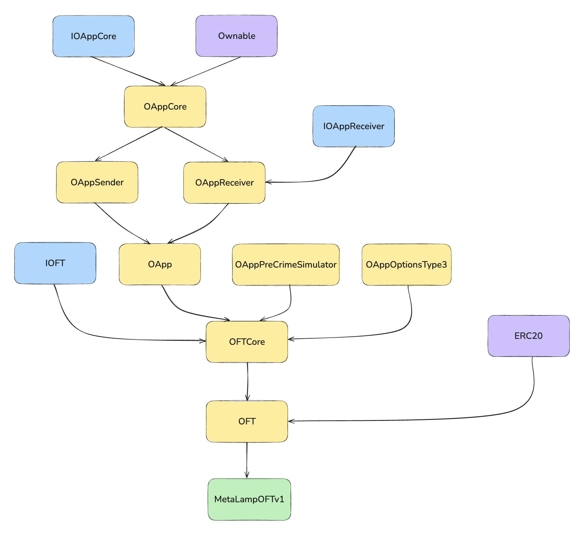  
*Схема наследований OFT-токена*

Здесь можно также увидеть два дополнительных смарт-контракта ([OAppPreCrimeSimulator](https://github.com/LayerZero-Labs/devtools/blob/main/packages/oapp-evm/contracts/precrime/OAppPreCrimeSimulator.sol) и [OAppOptionsType3](https://github.com/LayerZero-Labs/devtools/blob/main/packages/oapp-evm/contracts/oapp/libs/OAppOptionsType3.sol)), о которых мы поговорим чуть позже. Также видно, что [OApp](https://github.com/LayerZero-Labs/devtools/blob/main/packages/oapp-evm/contracts/oapp/OApp.sol) наследуется от [OAppCore](https://github.com/LayerZero-Labs/devtools/blob/main/packages/oapp-evm/contracts/oapp/OAppCore.sol) и может выполнять как отправку сообщений, так и их получение через [OAppSender](https://github.com/LayerZero-Labs/devtools/blob/main/packages/oapp-evm/contracts/oapp/OAppSender.sol) и [OAppReceiver](https://github.com/LayerZero-Labs/devtools/blob/main/packages/oapp-evm/contracts/oapp/OAppReceiver.sol). 

*Примечание:* Не все захотят разворачивать проект, поэтому готовый код можно посмотреть [тут](./contracts/contracts/MetaLampOFTv1.sol), для нужно установить зависимости через `pnpm install` в папке `protocols/layerzero-v2/smart-contracts/contracts`. Либо сходить в репозиторий [LayerZero-Labs/devtools](https://github.com/LayerZero-Labs/devtools/blob/main/packages/oft-evm/contracts), в нем также есть все примеры.

## Базовый функционал OFT

Так будет выглядеть самый простой ERC20 OFT-токен:

```solidity
// SPDX-License-Identifier: UNLICENSED

pragma solidity ^0.8.22;

import { Ownable } from "@openzeppelin/contracts/access/Ownable.sol";
import { OFT } from "@layerzerolabs/oft-evm/contracts/OFT.sol";

contract MetaLampOFTv1 is OFT {
    constructor(
        string memory _name,
        string memory _symbol,
        address _lzEndpoint,
        address _delegate
    ) OFT(_name, _symbol, _lzEndpoint, _delegate) Ownable(_delegate) {}
}
```

- Параметры `name` и `symbol` мы передаем во время деплоя, потому что для каждой новой сети будет необходим новый деплой токена (приложения OApp).
- С параметром `_lzEndpoint` мы уже знакомы. Приставка `lz` здесь и далее означает LayerZero.
- Адрес `_delegate` - это адрес который во-первых будет владельцем токена, а во вторых будет отвечать за смену настроек для этого OApp.

В "теле" токена можно добавить любую дополнительную логику, также можно добавить и другие зависимости (например Permit), но все что касается логики OFT логично располагается в контракте OFT.

В OFT нас интересуют функции `_debit` и `_credit`, которые реализуют самую простую механику `mint/burn`, но эти функции конечно же можно переопределить в основном контракте токена.

### Отправка токенов из исходной сети (send)

Основная функция для отправки токенов это [OFTCore::send](https://github.com/LayerZero-Labs/devtools/blob/05443835db976b7a528b883b19ddf02cb7f36d89/packages/oft-evm/contracts/OFTCore.sol#L175), если помните, в примере Remix также была подобная функция, но теперь она стала сложнее:

```solidity
function send(
    SendParam calldata _sendParam, // Основные параметры для отправки сообщения
    MessagingFee calldata _fee, // Комиссии на оплату газа и стека безопасности
    address _refundAddress // Адрес возврата комиссии в исходной сети
) external payable virtual returns (
    MessagingReceipt memory msgReceipt, // Основной чек по транзакции
    OFTReceipt memory oftReceipt // Доп информация специфичная для OFT
) { ... }
```

Основные параметры, которые указываются при отправке:
```solidity
struct SendParam {
    uint32 dstEid; // Endpoint ID сети назначения.
    bytes32 to; // Адрес OApp в сети назначения.
    uint256 amountLD; // Количество токенов в локальных decimals.
    uint256 minAmountLD; // Минимальное количество токенов в локальных decimals.
    bytes extraOptions; // Дополнительные опции, предоставленные вызывающей стороной для исп. вместе с сообщением
    bytes composeMsg; // Составленное сообщение для операции send().
    bytes oftCmd; // Команда OFT, которая должна быть выполнена, не используется в стандартных реализациях OFT.
}
```

Так выглядит MessagingReceipt:
```solidity
struct MessagingReceipt {
    bytes32 guid; // GUID для ончейн и офф-чейн отслеживания сообщения
    uint64 nonce; // Уникальный nonce для управлением сообщением в канале
    MessagingFee fee; // Комиссии на газ и оплату стека безопасности
}
```

Если не углубляться в детали, функция `send` выполнит 3 основных действия:
1. Вызовет `_debit`, чтобы сжечь токены либо выполнить другую логику заложенную в токене при отправке в сеть назначения (пока можно не обращать внимания на LD и SD amounts в коде);
2. Второй вызов идет в функцию `_buildMsgAndOptions`, она формирует сообщение со специфичными данными для OFT, а также опции для этого сообщения;
3. Когда все готово к отправке вызывается `_lzSend` и это первый вызов базовой функции OApp, все что было до нее - всего лишь подготовка сообщения. `_lzSend` отправляет сообщение через Endpoint и переводит ему средства для оплаты комиссий.

В процессе отправки выполняются и другие действия, но они носят вспомогательных характер. Также можно увидеть, что все `internal` функции, которые участвуют в транзакции, имеют модификатор `virtual` и при желании могут быть переопределены в токене.

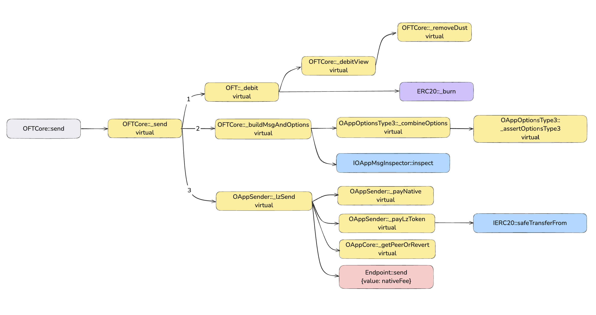  
*Граф всех вызовов функции OFTCore::send*

Я условно разделил поток выполнения на три основные ветки, так нам будет проще разобрать по шагам что делает эта функция.

#### Local Decimals и Shared Decimals

Теперь по порядку можно разобрать отдельные аспекты отправки и начать лучше всего со служебных функций `_debitView` и `_removeDust`, а также таких понятий, как Local Decimals (LD) и Shared Decimals (SD). То есть разберем что происходит в ветке 1.

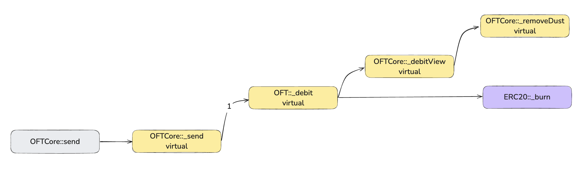   
*Сжигание токенов и доп. расчеты для корректного отображения amount*

Здесь все просто. Для того чтобы обеспечить максимальную совместимость между различными блокчейнами (не только EVM-совместимыми) и при этом не потерять в точности - для передачи токенов был выделен `unit64` и decimals 6.

Это значит, что максимальный `totalSupply` может быть равен 18,446,744,073,709.551615. Функцию `OFTCore::sharedDecimals` можно переопределить в меньшую сторону если нужен больший `totalSupply`, тогда максимальное число вырастет до 1,844,674,407,370,955.1615, но при этом после запятой останется только 4 знака. Увеличивать decimals в большую сторону протокол не рекомендует, они (команда LayerZero) проверили и такой точности должно быть достаточно для всех существующих блокчейнов.

Как это работает? Есть две составляющие:
1. Удаление "пыли" (чтобы можно было точно знать сколько токенов будет отправлено);
2. Конвертация из local decimals в shared decimals и обратно. Запомнить легко - shared decimals (SD) используется исключительно для пересылки, но в исходной сети и сети назначения токен будет иметь размерность local decimals (LD).

Для этих действий существует переменная `decimalConversionRate`. Она устанавливается в конструкторе следующим образом:
```solidity
decimalConversionRate = 10 ** (_localDecimals - sharedDecimals());
```

Например в EVM-блокчейнах чаще всего встречается decimals = 18, тогда decimalConversionRate = 10 ** (18 - 6) = 1,000,000,000,000. Допустим мы хотим перевести 1 токен с decimals 18, но он выглядит так 1,123,123,123,123,123,123. 

Тогда:
- amountLD = 1,123,123,123,123,123,123 (1.123123123123123123)
- decimalConversionRate = 1,000,000,000,000

1. Очищаем от пыли. Функция `_removeDust` сделает следующее:
```solidity
function _removeDust(uint256 _amountLD) internal view virtual returns (uint256 amountLD) {
    return (_amountLD / decimalConversionRate) * decimalConversionRate;
}
```
На выходе получаем 1,123,123,000,000,000,000 или 1.123123000000000000

2. Конвертация в SD для отправки:
```solidity
function _toSD(uint256 _amountLD) internal view virtual returns (uint64 amountSD) {
    return uint64(_amountLD / decimalConversionRate);
}
```
Теперь мы обрезали 12 знаков, и получаем число 1,123,123 (1.123123).

Обратная конвертация из SD в LD будет выполнена в сети назначения. Мы просто умножаем `amountSD` на `decimalConversionRate` сети назначения.
```solidity
function _toLD(uint64 _amountSD) internal view virtual returns (uint256 amountLD) {
    return _amountSD * decimalConversionRate;
}
```
Если в сети назначения decimals = 18, мы снова получим число 1.123123000000000000.

Можете для примера взять ETH по текущим ценам и посчитать какие могут быть потери из-за такой точности. Я посчитал и это действительно "пыль".

Что касается функции `_debitView`, помимо вызова `_removeDust` в нее также заложена проверка на "проскальзывание" если при отправке взимаются доп. комиссии.

Таким образом мы полностью разобрали **ветку 1**. С функцией `ERC20::_burn` думаю все и так понятно.

#### Формирование сообщения и опций для его отправки

Следующая на очереди **ветка 2** и функция `_buildMsgAndOptions`, ее тоже логически можно разделить на 3 блока:
1. Кодировка сообщения.
2. Формирование опций.
3. Проверка через инспектор (опционально).

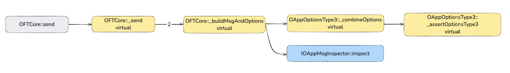  
*Формирование сообщения и опций для отправки сообщения*

**Шаг 1:** Кодировка сообщения выполняется с помощью библиотеки [OFTMsgCodec](https://github.com/LayerZero-Labs/devtools/blob/main/packages/oft-evm/contracts/libs/OFTMsgCodec.sol), содержимое которой вы можете посмотреть сами - ее главная задача правильно скомпоновать байты информации для передачи.

```solidity
function _buildMsgAndOptions(
    SendParam calldata _sendParam, // Параметры отправки (рассмотрены выше)
    uint256 _amountLD // Количество токенов с local decimals
) internal view virtual returns (bytes memory message, bytes memory options) {
    // 1. Кодировка сообщения
    bool hasCompose;
    (message, hasCompose) = OFTMsgCodec.encode(
        _sendParam.to,
        _toSD(_amountLD),
        _sendParam.composeMsg
    );

    // 2. Формирование опций
    uint16 msgType = hasCompose ? SEND_AND_CALL : SEND;
    options = combineOptions(_sendParam.dstEid, msgType, _sendParam.extraOptions);

    // 3. Опциональная проверка через инспектор
    address inspector = msgInspector;
    if (inspector != address(0)) IOAppMsgInspector(inspector).inspect(message, options);
}
```

**Шаг 2:** С опциями интереснее. Из чего состоят опции мы рассмотрим чуть позже. Здесь важно другое - какие типы опции существуют и как они объединяются функцией [combineOptions](https://github.com/LayerZero-Labs/devtools/blob/05443835db976b7a528b883b19ddf02cb7f36d89/packages/oapp-evm/contracts/oapp/libs/OAppOptionsType3.sol#L63).

По умолчанию есть 3 **типа** опций:
- 1 - SEND - простоя отправка сообщения (помним, что в сообщении может быть и передача токенов);
- 2 - SEND_AND_CALL - используется для compose сообщений (с передачей сообщения и последующим вызовом).
- 3 - OPTION_TYPE_3 - этот тип для того, чтобы правильно объединять опции типа 1, 2 и принудительные опции.

*Важно!* Принудительные опции (enforcedOptions) - это опции, которые можно задать через функцию `OAppOptionsType3::setEnforcedOptions`. Данный контракт-расширение позволяет задавать принудительный опции только для **типа 3** (это проверяется функцией `_assertOptionsType3`).

Задаются `enforcedOptions` овнером OApp, но что это значит? Объясню на примере. Допустим вы хотите отправить сообщение в другой блокчейн, как мы делали это в Remix, если вы вернетесь к контракту `Source` в нем заданы такие дефолтные опции:

```solidity
bytes _options = OptionsBuilder.newOptions().addExecutorLzReceiveOption(50000, 0);
```

Это значит что мы задаем: `{ gasLimit: 50000, value: 0 }`. Для функции `combineOptions` это `_extraOptions`.

При этом, может возникнуть ситуация, когда вы точно знаете, что в конкретном блокчейне необходимо x2 количества газа для выполнения операции плюс нужно дополнительно оплатить комиссию в нативном токене, поэтому вы задаете `enforcedOptions`, например `{ gasLimit: 100000, value: 0.5 ETH }`. В этом случае результирующие опции будут такие: `{ gasLimit: 150000, value 0.5 ETH }`, потому что опции объединятся.

Это также значит, что в случае с наличием `enforcedOptions` вы можете не задавать `extraOptions`.

```solidity
function combineOptions(
    uint32 _eid,
    uint16 _msgType,
    bytes calldata _extraOptions
) public view virtual returns (bytes memory) {
    bytes memory enforced = enforcedOptions[_eid][_msgType];
    // Если enforced не заданы, возвращаем те, что переданы с сообщением
    if (enforced.length == 0) return _extraOptions;

    // Если enforced заданы, но с сообщением ничего не передано - возвращаем enforced
    if (_extraOptions.length == 0) return enforced;

    // Если заданы и enforced и extraOptions, то extraOptions должны быть валидными
    // то есть как минимум должны содержать информацию о типе опций
    // для того, чтобы их можно было корректно объединить с enforced
    if (_extraOptions.length >= 2) {
        _assertOptionsType3(_extraOptions);
        return bytes.concat(enforced, _extraOptions[2:]);
    }
    // Выкинуть ошибку в случае если переданы невалидные extraOptions
    revert InvalidOptions(_extraOptions);
}
```

На схеме это будет выглядеть так:

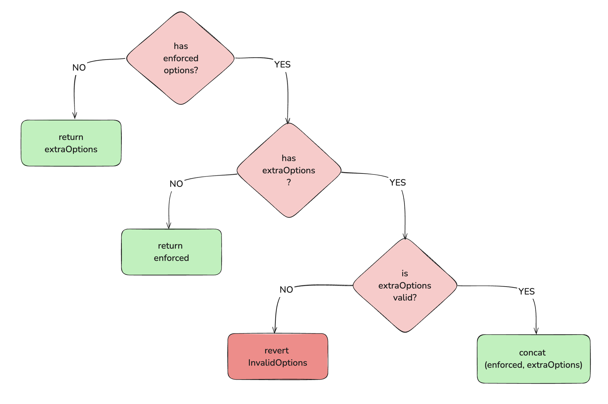  
*Схема выбора опций или их объединения*

**Шаг 3 (опциональный):** Если вы задали адрес контракта `msgInspector` в своем OApp, ему будут переданы на проверку параметры `message` и `options`. Это возможность выполнить дополнительную принудительную проверку перед отправкой сообщения. Также задается для конкретного OApp в конкретном блокчейне.

#### Отправка сообщения

Наконец мы добрались до **3 ветки** потока выполнения функции `send`, которая выполняет непосредственную отправку сообщения через Endpoint.

  
*Схема вызовов для отправки сообщения*

Вызывается внутренняя функция `OAppSender::_lzSend`, которая снова выполняет 3 действия:
1. Вызывает `_payNative` для проверки что передано достаточно `msg.value` чтобы оплатить `gasLimit` в сети назначения, либо переводит токены на Endpoint через `safeTransferFrom` если для оплаты газа была выбрана опция оплаты через `_lzPayToken`;
2. Проверяет, что `peer`, которому мы пытаемся отправить сообщение действительно существует (`getPeerOrRevert`);
3. Наконец вызывает `Endpoint.send{ value: nativeFee }()` для отправки сообщения на проверку в стек безопасности.

После этого "мяч на стороне" Endpoint, который передаст сообщение дальше и оплатит услуги DVNs и Executor.

### Получение сообщения в сети назначения

Получение сообщения будет выполнено через базовую функцию [OAppReceiver::lzReceive](https://github.com/LayerZero-Labs/devtools/blob/05443835db976b7a528b883b19ddf02cb7f36d89/packages/oapp-evm/contracts/oapp/OAppReceiver.sol#L95) - это стандартная точка входа для всех входящих сообщений, которая выполняет базовые проверки перед тем как вызвать `OAppReceiver::_lzReceive`, которая переопределена с учетом нашей логики в [OFTCore](https://github.com/LayerZero-Labs/devtools/blob/05443835db976b7a528b883b19ddf02cb7f36d89/packages/oft-evm/contracts/OFTCore.sol#L266).

Проверки всего две:
1. Кто вызвал функцию `lzReceive`? Вызывающим (msg.sender) может только Endpoint;
2. Отправитель сообщения совпадает с тем peer, который мы установили для исходной сети (через `setPeer`). То есть это валидный отправитель.

После этого управление передается `OFTCore::_lzReceive`.

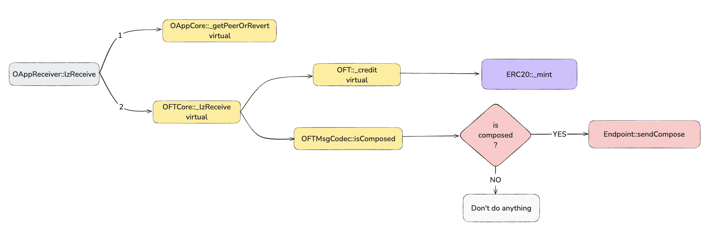  
*Граф вызовов для lzReceive*

Функцию `OFTCore::_lzReceive` не делает ничего сложного. Всего два шага:

- Шаг 1: Вызвать `_credit`, чтобы сминтить токены в сети назначения (либо выполнить другую логику добавленную в токене);
- Шаг 2: Проверить переданы ли доп. транзакции для выполнения `Endpoint::sendCompose`, если да, добавить их в очередь на выполнение в Endpoint.

```solidity
function _lzReceive(
    Origin calldata _origin,
    bytes32 _guid,
    bytes calldata _message,
    address /*_executor*/, // @dev не используется в дефолтной реализации.
    bytes calldata /*_extraData*/ // @dev не используется в дефолтной реализации.
) internal virtual override {
    // Приводим адрес к EVM формату
    address toAddress = _message.sendTo().bytes32ToAddress();

    // Вызываем OFT::_credit
    uint256 amountReceivedLD = _credit(toAddress, _toLD(_message.amountSD()), _origin.srcEid);

    // Если есть доп. транзакции, которые нужно выполнить после _credit
    // добавляем их в очередь Endpoint
    if (_message.isComposed()) {
        bytes memory composeMsg = OFTComposeMsgCodec.encode(
            _origin.nonce,
            _origin.srcEid,
            amountReceivedLD,
            _message.composeMsg()
        );
        endpoint.sendCompose(toAddress, _guid, 0 /* the index of the composed message*/, composeMsg);
    }

    emit OFTReceived(_guid, _origin.srcEid, toAddress, amountReceivedLD);
}
```

*Важно!* Для того, чтобы OApp мог работать с `composed` транзакциями, ему необходимо реализовать интерфейс [IOAppComposer](https://github.com/LayerZero-Labs/devtools/blob/05443835db976b7a528b883b19ddf02cb7f36d89/packages/oapp-evm/contracts/oapp/interfaces/IOAppComposer.sol). В базовой реализации эта функция не добавлена.

### Оценка gasLimit и комиссий стека безопасности перед отправкой сообщения

Для того, чтобы транзакция в сети назначения была успешно проверена и выполнена необходимо правильно рассчитать две вещи:
1. Количество газа, которое потребуется для выполнения этой транзакции в сети назначения (`gasLimit`);
2. Стоимость этого газа в сети назначения выраженная в токенах исходной сети (например вы отправляете сообщение в Polygon из эфира - фактическая оплата будет в POL, но отправить нужно в ETH).

С первым пунктом все не очень очевидно. Для каждого блокчейна нужно либо выставлять `gasLimit` с запасом, либо эмпирическим путем рассчитывать какое-то наиболее подходящее значение. Есть способы как проверить верность установленного значения перед отправкой, но об этом чуть позже.

Сейчас для примера возьмем усредненное значение для EVM-сетей в 80_000 единиц газа. Тогда опции будут выглядеть так:

```solidity
bytes memory options = OptionsBuilder.newOptions().addExecutorLzReceiveOption(80000, 0);
```

Далее необходимо сформировать структуру [SendParam](https://github.com/LayerZero-Labs/devtools/blob/05443835db976b7a528b883b19ddf02cb7f36d89/packages/oft-evm/contracts/interfaces/IOFT.sol#L10) заполнив все необходимые поля:

```solidity
SendParam memory sendParam = SendParam(
    40267, // EID
    addressToBytes32(0x32bb35Fc246CB3979c4Df996F18366C6c753c29c), // Адрес фактического получателя токенов в сети назначения
    1e18, // amountLD
    1e18, // minAmountLD
    options,
    "", // composeMsg
    ""  // oftCmd
);
```

Чтобы посчитать комиссию для стека безопасности и на газ, вызываем функцию [OFTCore::quoteSend](https://github.com/LayerZero-Labs/devtools/blob/05443835db976b7a528b883b19ddf02cb7f36d89/packages/oft-evm/contracts/OFTCore.sol#L145).

```solidity
MessagingFee memory fee = OFT.quoteSend(sendParam, false);
```

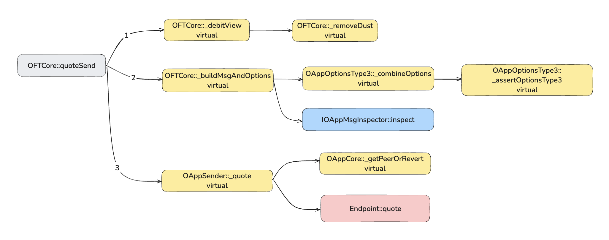  
*Граф вызовов quoteSend*

Если посмотреть на схему шаги 1 и 2 очень похожи на `OFTCore::send`, только в этом случае не вызывается `_debit`. На третьем шаге вызов идет в `Endpoint::quote`, где будет выполнен расчет на основе настроенного стека безопасности и установленного Executor, с учетом цен на газ в сети назначения. Расчеты выполняемые Endpoint выходят за рамки этой статьи, поэтому вы можете посмотреть логику расчета самостоятельно [здесь](https://github.com/LayerZero-Labs/LayerZero-v2/blob/a3637f851ab1b987bff9fb3db31bf40a59ac374b/packages/layerzero-v2/evm/protocol/contracts/EndpointV2.sol#L55).

Зная комиссию, мы знаем сколько токенов нужно передать на ее оплату и можем отправлять сообщение:

```solidity
OFT.send{ value: fee.nativeFee }(sendParam, fee, refundAddress);
```

Можете посмотреть как это делается в тестах - [test_send_oft](./contracts/test/foundry/MetaLampOFTv1.t.sol).

#### Лимит gasLimit

Выше мы обсуждали `enforcedOptions`, так вот если вы уже посчитали среднее значение по газу для конкретной сети, можно задать их через [OAppOptionsType3::setEnforcedOptions](https://github.com/LayerZero-Labs/devtools/blob/05443835db976b7a528b883b19ddf02cb7f36d89/packages/oapp-evm/contracts/oapp/libs/OAppOptionsType3.sol#L28).

### Оценка лимитов токена

Для OFT также существует дополнительная функция предварительной проверки [OFTCore::quoteOFT](https://github.com/LayerZero-Labs/devtools/blob/05443835db976b7a528b883b19ddf02cb7f36d89/packages/oft-evm/contracts/OFTCore.sol#L108). Эта функция может настраиваться в зависимости от нужд конкретного токена.

```solidity
function quoteOFT(
    SendParam calldata _sendParam
) external view virtual returns (
    OFTLimit memory oftLimit, // Опциональные настраиваемые лимиты. По умолчанию от 0 до totalSupply.
    OFTFeeDetail[] memory oftFeeDetails, // Комиссии токена, тоже опционально.
    OFTReceipt memory oftReceipt // amountSentLD и amountReceivedLD
) {}
```

## Как задеплоить и настроить OFT-токен

Если вы создали проект OFT токена через `npx create-lz-oapp@latest`, в нем уже есть необходимые скрипты деплоя. Достаточно создать файл `.env` и настроить необходимые сети в [hardhat.config.ts](./contracts/hardhat.config.ts) для деплоя и верификации в эксплорерах.

После этого достаточно запустить скрипт командой `npx hardhat lz:deploy` и следовать инструкциям, в качестве тега указываем название смарт-контракта. Более подробная инструкция есть [в документации](https://docs.layerzero.network/v2/developers/evm/create-lz-oapp/deploying) либо в [README](./contracts/README.md#layerzero-hardhat-helper-tasks) проекта.

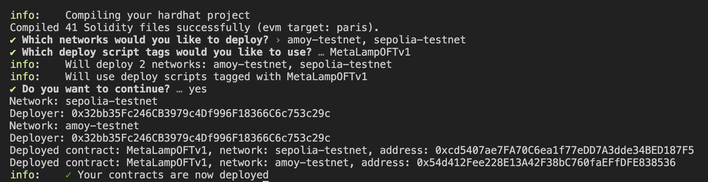  
*Деплой смарт-контрактов в тестовые блокчейны*

После этого ваши контракты развернуты, но они еще не готовы к работе друг с другом. Для этого понадобится их настроить и "связать" между собой.

Первым шагом нужно создать конфиг, для того также есть отдельный hardhat скрипт:

```bash
npx hardhat lz:oapp:config:init --contract-name MetaLampOFTv1 --oapp-config layerzero.config.ts
```

Получаем такой фаил конфигурации [layerzero.config.ts](./contracts/layerzero.config.ts). В нем будут выставлены дефолтные конфигурации стека безопасности, а также добавлен адрес Executor для выбранных сетей.

Дальше самое интересное - необходимо эти настройки применять на OApps, то есть на смарт-контрактах токенов в выбранных сетях и на контрактах Endpoint. Для этого есть отдельный скрипт, он выполнит нужные транзакции в каждой сети по отдельности и транзакций будет много, поэтому убедитесь, что хватить средств на оплату газа.

```bash
npx hardhat lz:oapp:wire --oapp-config layerzero.config.ts
```

В транзакциях будут вызваны следующие функции (для всех OApp во всех выбранных сетях):
- `OFTToken::setPeer`
- `OFTToken::setEnforcedOptions` (если указаны в конфигурации)
- `Endpoint::setConfig`
- `Endpoint::setSendLibrary`
- `Endpoint::setReceiveLibrary`

Для каждого блокчейна можно отдельно задать `setEnforcedOptions` который мы обсуждали выше.

Прелесть в том, что если вы измените какие-то опции, то при следующем запуске скрипта выполнятся только те транзакции, которые нужны для установки новых опций, все остальное будет пропущено.

Подробнее про конфигурации можно почитать [в документации](https://docs.layerzero.network/v2/developers/evm/protocol-gas-settings/default-config).

## Отправка транзакции

Отправка омничейн токенов не самое простое занятие. К сожалению без скриптов тут сложновато, поэтому я накидал foundry-скрипт [SendTokens](./contracts/scripts/SendTokens.s.sol) который позволяет пересылать токены между контрактами MetaLampOFTv1 в сетях Ethereum Sepolia и Polygon.

Для того, чтобы отправить токены, нужно иметь их на балансе, поэтому я добавил токену функцию `claim`, которая позволит вам получить 100 MLOFTv1 токенов. Сделать это лучше всего в эксплорерах, ссылки на контракт [тут](./contracts/README.md).

Команда для отправки токенов такая:

```bash
pnpm send \
--rpc-url <rpc_url> \
<sender_address> \
<src_oft_oapp_address> \
<dst_recipient_address> \
<amount_LD> \
<dst_eid> \
--broadcast
```

Например:
```bash
pnpm send \
--rpc-url sepolia \
0x32bb35Fc246CB3979c4Df996F18366C6c753c29c \
0xcd5407ae7FA70C6ea1f77eDD7A3dde34BED187F5 \
0x32bb35Fc246CB3979c4Df996F18366C6c753c29c \
1000000000000000000 \
40267 \
--broadcast
```

Результат:
```bash
== Logs ==
  GUID: 
  0x832318c92f1b0abe842f8ec5059d47aad92df8ca8de6a94b4bf8be301b689952
  MessagingReceipt: nonce: 4, fee: 75768729416500
  OFTReceipt: amountSentLD: 1000000000000000000, amountReceivedLD: 1000000000000000000

##### sepolia
✅  [Success] Hash: 0xb791c8aae098e5bfe449ddf58e012beebbf1ff2c3b81960adddd6abc67a7620e
```

После чего можно взять хэш транзакции и проверить статус омничейн транзакции в [layerzeorscan](https://testnet.layerzeroscan.com/). Если статус "Delivered", то можно проверить баланс в сети назначения, а также `totalSupply` токена в обоих сетях.

*Примечание:* Рекомендую сначала запустить команду без флага `--broadcast` и посмотреть сколько fee нужно заплатить. Например когда я попытался сделать транзакцию в обратную сторону мне посчитали очень большой `nativeFee` в Polygon Amoy. Видимо какая-то проблема с получением priceFeed.

### Что если транзакции не выполнилась?

У меня возникла ситуация, когда я отправил транзакцию с меньшим `gasLimit`, чем требовалось и транзакция упала в сети назначения. Это значит, что в исходной сети токены были сожжены, но в сети назначения не были выпущены в обращение и общий `totalSupply` был нарушен.

Решение оказалось очень простым. Я вызывал функцию `Endpoint::lzReceive` в сети назначения и передал аргументы застрявшей транзакции, после чего она была благополучно выполнена. То есть любой может выполнить такую транзакцию если оплатит газ, потому что она прошла все проверки и не важно кто будет исполнителем.

В целом протокол хорош тем, что некоторые вещи можно исправить в ручном режиме. Но это не значит, что он на 100% защитит вас от ошибок. Поэтому нужно очень внимательно проверять все кейсы использования вашего OFT токена.

## Средняя оценка gasLimit

В проекте, который вы разворачиваете через `npx create-lz-oapp@latest` есть скрипты оценки газа для `lzReceive` и `lzCompose`. Они запускают форк нужной сети и прогоняют эти транзакции столько раз, сколько вы укажите, а после выдадут средние значения. На момент написания статьи команда запуска скрипта `lzReceive` была неверной, я исправил ее в [этом](./contracts/README.md#estimating-lzreceive-and-lzcompose-gas-usage) репозитории.

Но есть еще несколько интересных моментов:

1. Для запуска скрипта понадобится сообщение в формате `bytes`;
2. Нужно иметь в виду, что если получатель в сети назначения с нулевым балансом, оценка по газу будет выше. Дело в том, что первая запись в слот смарт-контракта будет стоить дороже, чем последующие перезаписи этого слота;
3. Я сравнивал эти замеры с фактическии результатами в Gas Profiler от Tenderly и мне показалось, что значения ниже, чем должны быть.

Итак, чтобы решить первую проблему запускаем такую команду:

```bash
forge script scripts/SendTokens.s.sol \
--via-ir \
--sig "encode(address,uint256,bytes)" \
<recipient_address> \
<amount_LD> \
<compose_msg>
```

Например так:
```bash
forge script scripts/SendTokens.s.sol \
--via-ir \
--sig "encode(address,uint256,bytes)" \
0x4cD6778754ba04F069f8D96BCD7B37Ccae6A145d \
1000000000000000000 \
"0x"
```

Получаем закодированное сообщение:
```bash
== Return ==
_msg: bytes 0x0000000000000000000000004cd6778754ba04f069f8d96bcd7b37ccae6a145d00000000000f4240
```

Теперь можно воспользоваться скриптом по оценке газа запустив скрипт:
```bash
pnpm gas:lzReceive \
<rpcUrl> \
<endpointAddress> \
"(<srcEid>,<sender>,<dstEid>,<receiver>,[<message>],<msg.value>)<numOfRuns>"
```

Где:
- `rpcUrl`: RPC URL блокчейна для которого хотим посчитать средний gasLimit.
- `endpointAddress`: Адрес Endpoint этого блокчейна.
- `srcEid`: EID исходной сети.
- `sender`: Адрес приложения отправителя в исходной сети (OApp).
- `dstEid`: EID сети назначения.
- `receiver`: Адрес приложения в сети назначения (OApp).
- `message`: Массив сообщений в формате `bytes`.
- `msg.value`: Количество нативных токенов для отправки (в wei).
- `numOfRuns`: Количество запусков скрипта.

Например это может быть такая команда:

```bash
pnpm gas:lzReceive \
polygonAmoy \
0x6EDCE65403992e310A62460808c4b910D972f10f \
"(40161,0x000000000000000000000000cd5407ae7fa70c6ea1f77edd7a3dde34bed187f5,40267,0x54d412fee228e13a42f38bc760faeffdfe838536,[0x0000000000000000000000004cd6778754ba04f069f8d96bcd7b37ccae6a145d00000000000f4240],0,10)"
```

Получаем следующий результат:

```bash
== Logs ==
  Starting gas profiling for lzReceive on dstEid: 40267
  ---------------------------------------------------------
  Aggregated Gas Metrics Across All Payloads:
  Overall Average Gas Used: 19051
  Overall Minimum Gas Used: 19051
  Overall Maximum Gas Used: 19051
  Estimated options:
  0x00030100110100000000000000000000000000004e23
  ---------------------------------------------------------
  Finished gas profling for lzReceive on dstEid: 40267
  ---------------------------------------------------------
```

### OFTProfilerExample

Мне больше понравился другой скрипт - [OFTProfilerExample](./contracts/scripts/OFTProfilerExample.s.sol). Он запускается с предустановленными параметрами, но выдает значения очень приближенные к реальным. К тому же его конфигурации тоже можно изменить. Плюс он очень просто запускается:

```bash
pnpm gas:run 10
```

Где 10 это число прогонов. Если вы настраивали проект с 0 и скрипт не запускается, можно попробовать убрать флаг `--via-ir` в команде запуска (package.json).

## PreCrime

В сети назначения есть множество способов для проверки транзакции пред оправкой и доп. мер предосторожностей: механизм `quote`, `msgInspector`, `enforcedOptions`, с сетью назначения все несколько сложнее, потому что мы не знаем состояние другого блокчейна и как будет выполнена транзакция.

В базовой реализации OFT-токена осталась одна неизвестная - смарт-контракт [OAppPreCrimeSimulator](https://github.com/LayerZero-Labs/devtools/blob/05443835db976b7a528b883b19ddf02cb7f36d89/packages/oapp-evm/contracts/precrime/OAppPreCrimeSimulator.sol). Он позволяет добавить в систему смарт-контракт [PreCrime](https://github.com/LayerZero-Labs/devtools/blob/05443835db976b7a528b883b19ddf02cb7f36d89/packages/oapp-evm/contracts/precrime/PreCrime.sol). То есть здесь похожая история, как и с `msgInspector`, но если `msgInspector` вызывается ончейн, то PreCrime необходим для офчейн симуляции функции `_lzReceive`.

При этом вызов `OAppPreCrimeSimulator::lzReceiveAndRevert` всегда должна сваливаться в `revert`, а результаты симуляции читаются из ошибки `SimulationResult`. Туда они попадают после обработки через `PreCrime::buildSimulationResult`. Я думаю в этом случае `revert` это дополнительные меры предосторожности.

Но главная особенность в том, что по задумке PreCrime должен работать в связке со стеком безопасности и отменять транзакции через `skip` еще до того, как они попадут в Executor.

Например бекенд может отслеживать все транзакции и использовать контракты PreCrime для проверки некоторых инвариантов протокола - в случае обнаружения вредоносной транзакции она будет принудительно отменена еще в `MessagingChannel`.

## Какие бывают опции и как они устроены?

У протокола LayerZero много особенностей и мелких деталей, которые хорошо бы знать при разработке. Одна из таких деталей, с которой неизбежно придется столкнуться - это options.

Ранее мы уже неоднократно использовали `options`, точнее их самую простую форму, которая выглядит примерно так:

```solidity
uint128 GAS_LIMIT = 50000; // gasLimit для Executor
uint128 MSG_VALUE = 0; // msg.value для функции lzReceive() для дальнейшей доставки нативных токенов в сети назначения (в wei)

bytes memory options = OptionsBuilder.newOptions().addExecutorLzReceiveOption(GAS_LIMIT, MSG_VALUE);
```

За формирование опций на смарт-контрактах отвечает библиотека [OptionsBuilder](https://github.com/LayerZero-Labs/devtools/blob/main/packages/oapp-evm/contracts/oapp/libs/OptionsBuilder.sol). Мы видим, что первое, что делает `OptionsBuilder`, это вызов функции `newOptions`.

```solidity
function newOptions() internal pure returns (bytes memory) {
    return abi.encodePacked(TYPE_3);
}
```

Также `OFTCore` наследуется от смарт-контракта `OAppOptionsType3`, который проверяет, чтобы опции обязательно были `TYPE_3` через функцию `_assertOptionsType3`.

Наконец, функция `OptionsBuilder::addExecutorLzReceiveOption` имеет модификатор `onlyType3`.

За что отвечает `TYPE_3` и почему нельзя использовать другие два типа (`TYPE_1` и `TYPE_2`)? Ответ прост: `TYPE_N` - это версия контейнера, которая явно определяет как в каком порядке будут закодированы опции и как их декодировать в сети назначения.

`TYPE_1` и `TYPE_2` это наследие первой версии протокола (legacy types), в LayerZero v2 используется `TYPE_3`.

### Содержимое контейнера

Что должно быть определено в опциях?
- `TYPE_1` - определял только лимит газа;
- `TYPE_2` - к лимиту газа добавлял количество нативных токенов для передачи и получателя этих токенов;
- `TYPE_3` - устроен сложнее, но при этом более гибко. Подробнее ниже.
  
`TYPE_3` - это массив `bytes` который включает:
- тип контейнера;
- id воркера;
- размер опций;
- тип опций;
- непосредственно сами опции.

Первым добавляется тип, на данный момент - это всегда `TYPE_3`.

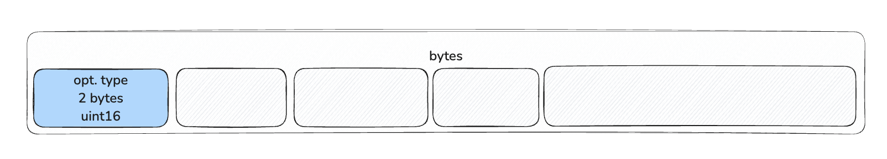

Далее мы немного нарушим порядок, потому что после добавления типа контейнера идет формирование самих опций. Если продолжить наш пример с `addExecutorLzReceiveOption`, то следующий вызов отправляется в библиотеку конкретного воркера (например `ExecutorOptions`).

```solidity
// OptionsBuilder library
function addExecutorLzReceiveOption(
    bytes memory _options,
    uint128 _gas,
    uint128 _value
) internal pure onlyType3(_options) returns (bytes memory) {
    bytes memory option = ExecutorOptions.encodeLzReceiveOption(_gas, _value);
    return addExecutorOption(_options, ExecutorOptions.OPTION_TYPE_LZRECEIVE, option);
}

// ---------------------------------------------------------

// ExecutorOptions library
function encodeLzReceiveOption(uint128 _gas, uint128 _value) internal pure returns (bytes memory) {
    return _value == 0 ? abi.encodePacked(_gas) : abi.encodePacked(_gas, _value);
}
```

В данном случае выполняется конкатинация `GAS_LIMIT` и `MSG_VALUE`.


После этого добавляются другие данные:

```solidity
function addExecutorOption(
    bytes memory _options,  // контейнер с типом
    uint8 _optionType, // тип опции
    bytes memory _option // сама опция
) internal pure onlyType3(_options) returns (bytes memory) {
    return
        abi.encodePacked(
            _options,
            ExecutorOptions.WORKER_ID, // ID Executor, потому что опции для lzReceive
            _option.length.toUint16() + 1, // размер опции, сформированной на предыдущем шаге + 1 для optionType
            _optionType,
            _option
        );
}
```

Теперь заполняем оставшиеся данные в которые входят id воркера, размер опции и тип опции.

- **Worker ID**. На данный момент существуют только два воркера:
  - Executor (id = 1), за обработку этих опций отвечает библиотека [ExecutorOptions](https://github.com/LayerZero-Labs/LayerZero-v2/blob/main/packages/layerzero-v2/evm/messagelib/contracts/libs/ExecutorOptions.sol);
  - DVN (id = 2), за обработку опций DVN отвечает библиотека [DVNOptions](https://github.com/LayerZero-Labs/LayerZero-v2/blob/main/packages/layerzero-v2/evm/messagelib/contracts/uln/libs/DVNOptions.sol).
- **Option Type**. Сейчас их 5 и последний тип добавили совсем недавно:
  - `OPTION_TYPE_LZRECEIVE` = 1;
  - `OPTION_TYPE_NATIVE_DROP` = 2;
  - `OPTION_TYPE_LZCOMPOSE` = 3;
  - `OPTION_TYPE_ORDERED_EXECUTION` = 4;
  - `OPTION_TYPE_LZREAD` = 5;

Итоговые параметры для `addExecutorLzReceiveOption` будут такие:
- worker id = 1 (Executor);
- option type = 1 (OPTION_TYPE_LZRECEIVE);
- option length = 17 (gasLimit занимает 16 байт + 1 байт на тип опции).

*Примечание:* Функция `addExecutorLzReceiveOption` также добавляет `value`, в нашем случае value = 0, поэтому ничего не добавлено. Если бы мы указали количество нативных токенов для передачи, то `type.length` был бы равен 33 байта (gasLimit 16 + value 16 + type 1).

В результате получаем такой набор байт `0003010011010000000000000000000000000000c350`:

```bash
0003 01 0011 01 0000000000000000000000000000c350

opt.type | work.id | ex.opt.type.length | ex.opt.type |         option          |
uint16   | uint8   | uint16             | uint8       | uint128         | 0     |
3        | 1       | 17                 | 1           | 50000 (gasLimit)| value |
```

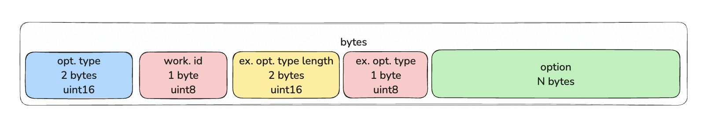  
*Расположение данных в контейнере TYPE_3*

### Особенности задания опций

Остальные опции можно посмотреть в [OptionsBuilder](https://github.com/LayerZero-Labs/devtools/blob/main/packages/oapp-evm/contracts/oapp/libs/OptionsBuilder.sol).

Также рекомендую попробовать сформировать разные виды опций в [remix](https://remix.ethereum.org/#url=https://docs.layerzero.network/LayerZero/contracts/OptionsGenerator.sol&lang=en&optimize=false&runs=200&evmVersion=null&version=soljson-v0.8.26+commit.8a97fa7a.js).

#### Работа с gasLimit

Параметр `gasLimit` высчитывается на основе профилирования расхода газа в сети назначения. Смысл в том, что "стоимость" опкодов может отличаться от блокчейна к блокчейну. 

Каждый блокчейн имеет лимиты на максимальное количество газа, которое можно передать в сеть назначения (`nativeCap`). Эту информацию можно получить вызвав `Executor::dstConfig(dstEid)`, функция отдает структуру `DstConfig`:

```solidity
struct DstConfig {
    uint64 baseGas;
    uint16 multiplierBps;
    uint128 floorMarginUSD;
    uint128 nativeCap;
}
```

- `baseGas`: Фиксированная стоимость газа для базовых операций, таких как верификация через стек безопасности и выполнение `lzReceive`. То есть минимальное количество газа для самого маленького сообщения;
- `multiplierBps`: Множитель в базисных пунктах (1 базисный пункт = 0,01%), который используется для расчёта дополнительного газа в зависимости от размера сообщения;
- `floorMarginUSD`: Минимальная плата в USD для предотвращения спама и покрытия затрат. Если рассчитанная стоимость в USD (на основе размера сообщения и `priceFeed` в сети назначения) меньше этого значения, она устанавливается на уровне `floorMarginUSD`, чтобы предотвратить спам и покрыть минимальные затраты;
- `nativeCap`: Максимальный лимит газа, который приложение (OApp) может указать для выполнения сообщения в сети назначения.

Эти данные также можно запросить выполнив в проекте OApp команду:

```bash
npx hardhat lz:oapp:config:get:executor
```

#### Native drop

Понятие `native drop` относится к передаче нативных токенов в сеть назначения. Например в опции `addExecutorLzReceiveOption` второй параметр служит для этих целей.
Но есть также отдельная опция `addExecutorNativeDropOption` которая принимает в качестве параметров `amount` и `receiver` и не принимает количество газа.

```solidity
function addExecutorNativeDropOption(
    bytes memory _options, // контейнер
    uint128 _amount, // количество нативных токенов
    bytes32 _receiver // получатель нативных токенов
) internal pure onlyType3(_options) returns (bytes memory) {
    bytes memory option = ExecutorOptions.encodeNativeDropOption(_amount, _receiver);
    return addExecutorOption(_options, ExecutorOptions.OPTION_TYPE_NATIVE_DROP, option);
}
```

*Примечание:* Ранее в протоколе было ограничение и на native drop, которое ровнялось 0.5 токена в эквиваленте нативного токена сети (например ETH, BNB и т.д.). Более того, было предостережение, что чем больше сумма, тем больше расходы на передачу. Сейчас об этом нет упоминаний, но нужно иметь в виду что такого рода ограничения тоже могут возникнуть.

## Заключение

Стандарт OFT оставил у меня хорошее впечатление, он довольно гибкий и дает много возможностей для настройки токена. При этом "из коробки" предоставляется достаточно функционала для создания простого ERC20 OFT-токена.

Также понравилась возможность быстро развернуть готовый проект, где есть готовые тесты плюс скрипты hardhat и foundry, которые позволяют легко задеплоить и настроить OApps в разных блокчейнах. Порадовали и скрипты для грубого профилирования расходов по газу, но с ними еще нужно подразобраться.

Несмотря на надежность канала передачи данных протокола, все же могут возникать пограничные кейсы, особенно если токен нетипичный и включает какие-то комиссии, доп. административные функции или сложные механики. Поэтому всегда нужно очень внимательно проверять работоспособность OFT токена. Более того, у меня есть ощущение что проверять токен лучше в мейннете, потому что львиная часть протокола в офчейне: стек безопасности, исполнители и оценка комиссий в тестовых сетях может работать некорректно. Лучшее решение - это проведение аудитов кода, потому что даже команды таких крупных компаний, как Tether не застрахованы от ошибок.

## Ссылки
  - [GitHub: LayerZero v2](https://github.com/LayerZero-Labs/LayerZero-v2)
  - [GitHub: LayerZero-Labs/devtools](https://github.com/LayerZero-Labs/devtools/blob/main/packages/oft-evm/contracts)
  - [Docs: LayerZero v2](https://docs.layerzero.network/v2)
  - [Docs: Solidity API](https://docs.layerzero.network/v2/developers/evm/technical-reference/api#endpointv2)
  - [Docs: LayerZero Glossary](https://docs.layerzero.network/v2/home/glossary#lzcompose)
  - [Docs: USDT0](https://docs.usdt0.to/)
  - [Audit: USDT0](https://github.com/Everdawn-Labs/usdt0-audit-reports)
  - [layerzeroscan](https://layerzeroscan.com/)
