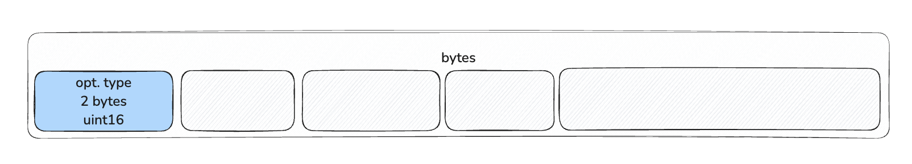
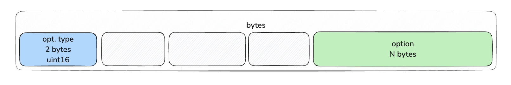
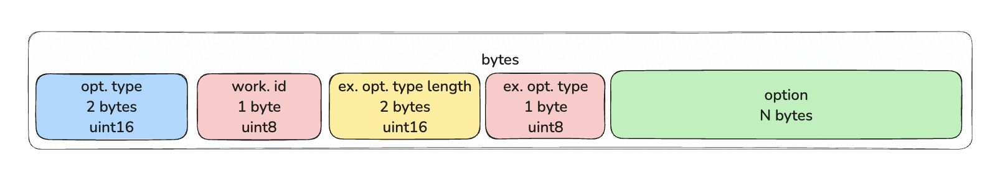

# Взаимодействие с протоколом LayerZero v2. Часть 3. Параметры (options), особенности, PreCrime

**Автор:** [Роман Ярлыков](https://github.com/rlkvrv) 🧐  

В заключительной части подробнее рассмотрим как формируются опции, какие они бывают и для чего нужны. Также рассмотрим дополнительный модуль PreCrime.

## Какие бывают опции и как они устроены?  

Протокол LayerZero содержит множество особенностей, которые важно понимать при разработке. Одна из таких деталей — **options**.  

Мы уже неоднократно использовали `options` в самой простой форме, например так:  

```solidity
uint128 GAS_LIMIT = 50000; // gasLimit для Executor
uint128 MSG_VALUE = 0; // msg.value для lzReceive() (wei)

bytes memory options = OptionsBuilder.newOptions().addExecutorLzReceiveOption(GAS_LIMIT, MSG_VALUE);
```

За формирование опций отвечает библиотека [`OptionsBuilder`](https://github.com/LayerZero-Labs/devtools/blob/main/packages/oapp-evm/contracts/oapp/libs/OptionsBuilder.sol).  Первое, что делает `OptionsBuilder`, это вызов функции `newOptions`.


```solidity
function newOptions() internal pure returns (bytes memory) {
    return abi.encodePacked(TYPE_3);
}
```

Контракт `OFTCore` наследуется от `OAppOptionsType3`, который проверяет, что **все опции должны быть типа `TYPE_3`** через `_assertOptionsType3`.  

Кроме того, `OptionsBuilder::addExecutorLzReceiveOption` имеет модификатор `onlyType3`.  

Почему нельзя использовать `TYPE_1` и `TYPE_2`? Это устаревшие контейнеры для упаковки опций из LayerZero v1. В LayerZero v2 используется только `TYPE_3`, так как он более гибкий и позволяет расширять функциональность.  

### Содержимое контейнера  

Опции разных типов:  
- `TYPE_1` — содержал только `gasLimit`.  
- `TYPE_2` — добавлял возможность передачи нативных токенов (`native drop`).  
- `TYPE_3` — включает дополнительные параметры и позволяет комбинировать опции.  

Контейнер `TYPE_3` состоит из:  
- типа контейнера,  
- ID воркера,  
- размера опций,  
- типа опций,  
- самих опций.  

Сначала добавляется тип контейнера (`TYPE_3`):  

  

После этого формируются сами опции. Например, в `addExecutorLzReceiveOption` данные кодируются через библиотеку `ExecutorOptions`:  

```solidity
// OptionsBuilder library
function addExecutorLzReceiveOption(
    bytes memory _options,
    uint128 _gas,
    uint128 _value
) internal pure onlyType3(_options) returns (bytes memory) {
    bytes memory option = ExecutorOptions.encodeLzReceiveOption(_gas, _value);
    return addExecutorOption(_options, ExecutorOptions.OPTION_TYPE_LZRECEIVE, option);
}

// ---------------------------------------------------------

// ExecutorOptions library
function encodeLzReceiveOption(uint128 _gas, uint128 _value) internal pure returns (bytes memory) {
    return _value == 0 ? abi.encodePacked(_gas) : abi.encodePacked(_gas, _value);
}
```

Здесь выполняется конкатенация `GAS_LIMIT` и `MSG_VALUE`:  

  

После этого добавляются ID воркера, размер и тип опции:  

```solidity
function addExecutorOption(
    bytes memory _options,
    uint8 _optionType,
    bytes memory _option
) internal pure onlyType3(_options) returns (bytes memory) {
    return abi.encodePacked(
        _options,
        ExecutorOptions.WORKER_ID,
        _option.length.toUint16() + 1, // размер опции + 1 байт для типа
        _optionType,
        _option
    );
}
```

Здесь используются:  
- **Worker ID** (на данный момент их всего два):
  - Executor (`id = 1`) — обрабатывает опции через [`ExecutorOptions`](https://github.com/LayerZero-Labs/LayerZero-v2/blob/main/packages/layerzero-v2/evm/messagelib/contracts/libs/ExecutorOptions.sol).  
  - DVN (`id = 2`) — используется [`DVNOptions`](https://github.com/LayerZero-Labs/LayerZero-v2/blob/main/packages/layerzero-v2/evm/messagelib/contracts/uln/libs/DVNOptions.sol).  
- **Option Type** (пока их 5):  
  - `OPTION_TYPE_LZRECEIVE` = 1  
  - `OPTION_TYPE_NATIVE_DROP` = 2  
  - `OPTION_TYPE_LZCOMPOSE` = 3  
  - `OPTION_TYPE_ORDERED_EXECUTION` = 4  
  - `OPTION_TYPE_LZREAD` = 5  

Финальная структура `addExecutorLzReceiveOption`:  
- `worker id = 1` (Executor)  
- `option type = 1` (`OPTION_TYPE_LZRECEIVE`)  
- `option length = 17` (gasLimit = 16 байт + 1 байт type)  

Если `value > 0`, длина `option` будет больше (`gasLimit 16 + value 16 + type 1 = 33 байта`). В нашем случае нулевой `value` отбрасывается.
В результате кодировка опций будет такой:  

```bash
0003 01 0011 01 0000000000000000000000000000c350

opt.type | work.id | ex.opt.type.length | ex.opt.type |         option          |
uint16   | uint8   | uint16             | uint8       | uint128         | 0     |
3        | 1       | 17                 | 1           | 50000 (gasLimit)| value |
```

  
*Расположение данных в контейнере TYPE_3*  

### Особенности задания опций  

Другие опции можно найти в [`OptionsBuilder`](https://github.com/LayerZero-Labs/devtools/blob/main/packages/oapp-evm/contracts/oapp/libs/OptionsBuilder.sol).  

Также можно попробовать сформировать разные виды опций в [Remix](https://remix.ethereum.org/#url=https://docs.layerzero.network/LayerZero/contracts/OptionsGenerator.sol&lang=en&optimize=false&runs=200&evmVersion=null&version=soljson-v0.8.26+commit.8a97fa7a.js).

#### Работа с gasLimit  

Параметр `gasLimit` рассчитывается на основе профилирования расхода газа в сети назначения. "Стоимость" выполнения опкодов может отличаться в разных блокчейнах, поэтому важно учитывать особенности каждой сети.  

У каждого блокчейна есть **максимальный лимит газа** (`nativeCap`), который можно передать в сеть назначения. Получить эту информацию можно через `Executor::dstConfig(dstEid)`, которая возвращает структуру `DstConfig`:  

```solidity
struct DstConfig {
    uint64 baseGas;
    uint16 multiplierBps;
    uint128 floorMarginUSD;
    uint128 nativeCap;
}
```

- **`baseGas`** — фиксированная стоимость газа для базовых операций (`lzReceive`, верификация через стек безопасности). Это минимальное количество газа для самого маленького сообщения.  
- **`multiplierBps`** — множитель в **базисных пунктах** (1 bps = 0,01%). Используется для расчёта дополнительного газа в зависимости от размера сообщения.  
- **`floorMarginUSD`** — минимальная плата в USD для предотвращения спама и покрытия затрат. Если рассчитанная стоимость транзакции в USD ниже этого значения, она **устанавливается на `floorMarginUSD`**.  
- **`nativeCap`** — максимальный лимит газа, который OApp может указать для выполнения сообщения в сети назначения.  

Эти данные можно получить в проекте, выполнив команду:  

```bash
npx hardhat lz:oapp:config:get:executor
```

#### Native drop  

`Native drop` — это передача **нативных токенов** в сеть назначения. Например, в `addExecutorLzReceiveOption` второй параметр (`MSG_VALUE`) используется именно для этого.  

Есть также отдельная опция `addExecutorNativeDropOption`, которая принимает `amount` (сумму) и `receiver` (адрес получателя) и не требует указания `gasLimit`:  

```solidity
function addExecutorNativeDropOption(
    bytes memory _options,
    uint128 _amount,
    bytes32 _receiver
) internal pure onlyType3(_options) returns (bytes memory) {
    bytes memory option = ExecutorOptions.encodeNativeDropOption(_amount, _receiver);
    return addExecutorOption(_options, ExecutorOptions.OPTION_TYPE_NATIVE_DROP, option);
}
```

*Примечание:* Ранее в протоколе было ограничение на native drop - 0.5 токена в эквиваленте нативного токена сети (например ETH, BNB и т.д.). Более того, было предостережение, что чем больше сумма, тем больше расходы на передачу. Сейчас об этом нет упоминаний, но нужно иметь в виду что такого рода ограничения тоже могут возникнуть.

## PreCrime  

В исходной сети есть несколько механизмов для проверки транзакции перед отправкой:  
- `quote`  
- `msgInspector`  
- `enforcedOptions`  

Но в **сети назначения** все сложнее, так как состояние другого блокчейна неизвестно.  

В базовой реализации OFT-токена остался один смарт-контракт который мы не рассматривали — [`OAppPreCrimeSimulator`](https://github.com/LayerZero-Labs/devtools/blob/05443835db976b7a528b883b19ddf02cb7f36d89/packages/oapp-evm/contracts/precrime/OAppPreCrimeSimulator.sol).  

Этот контракт позволяет подключить [`PreCrime`](https://github.com/LayerZero-Labs/devtools/blob/05443835db976b7a528b883b19ddf02cb7f36d89/packages/oapp-evm/contracts/precrime/PreCrime.sol). Модуль `PreCrime` используется для **офчейн-симуляции `_lzReceive`**, по задумке может работать сразу со всеми сетями где развернуто приложение. 

При этом вызов `OAppPreCrimeSimulator::lzReceiveAndRevert` **всегда** завершается `revert`, а результаты симуляции читаются из ошибки `SimulationResult`, куда они записываются через `PreCrime::buildSimulationResult`.  

Это дополнительный слой безопасности, но **главная особенность** PreCrime — его интеграция со стеком безопасности. То есть у него есть полномочия отменять трназакции еще на этапе проверок в канале передачи данных.

Бэкенд может отслеживать транзакции и использовать `PreCrime` для проверки основных инвариантов протокола. Если обнаружена вредоносная транзакция, она отменяется в `MessagingChannel`, прежде чем попадет в Executor.

## Заключение

По итогу трех статей у вас должна была сложиться более полная картина о разработке OApp в целом и OFT в частности, а также понимание того, как правильно оценить затраты на газ и какие выбрать опции для отправки сообщения.

В протоколе LayerZero есть еще много интересных аспектов, например работа с комиссиями внутри протокола, возможность развертывания своего Executor, отправка `compose` сообщений, lzRead для офчейн мониторинга транзакции и другое. Поэтому данная серия статей является только точкой старта, чтобы хотя бы немного снизить порог входа в работу с протоколом. 

## Ссылки  
- [GitHub: LayerZero v2](https://github.com/LayerZero-Labs/LayerZero-v2)  
- [GitHub: LayerZero-Labs/devtools](https://github.com/LayerZero-Labs/devtools/blob/main/packages/oft-evm/contracts)  
- [Docs: LayerZero v2](https://docs.layerzero.network/v2)  