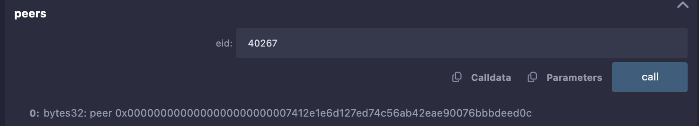
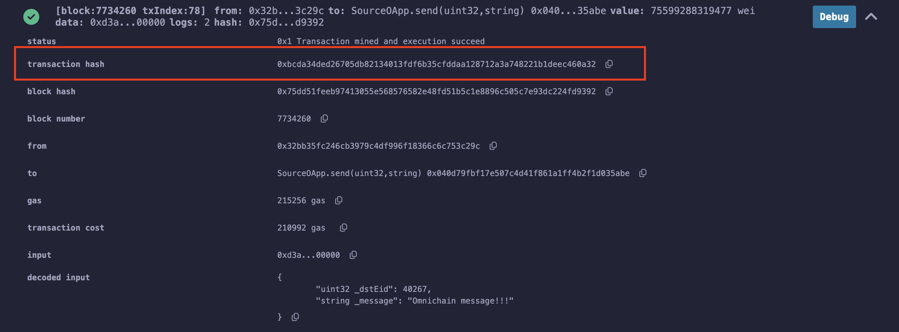
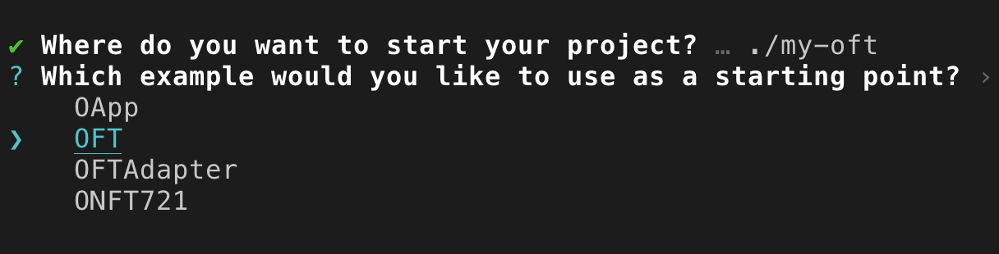
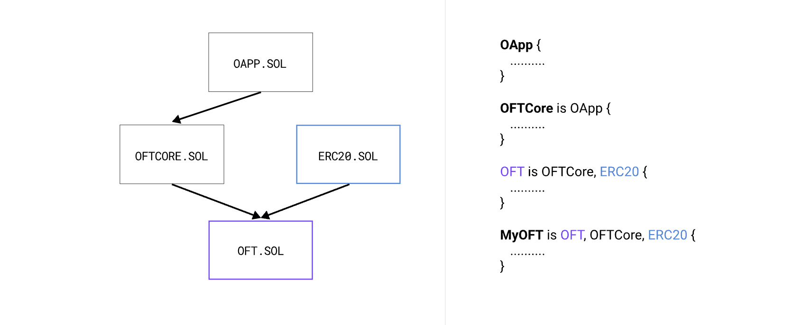
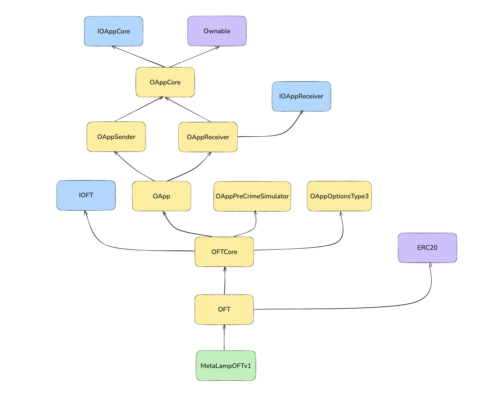
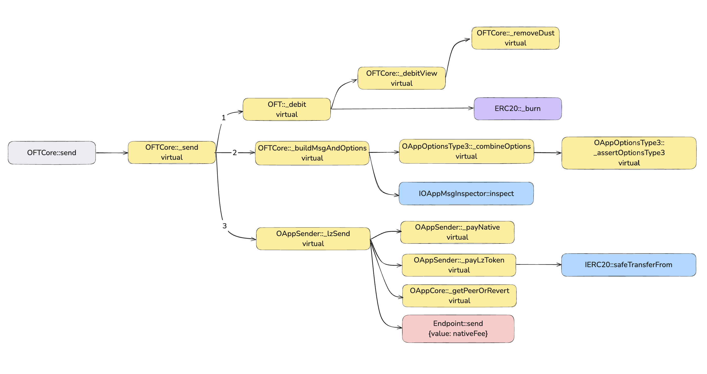

# Взаимодействие с протоколом LayerZero v2. OFT токен

**Автор:** [Роман Ярлыков](https://github.com/rlkvrv) 🧐

План статьи:
- ✅ Определите проблему или задачу.
-  Рассказать об используемых контрактах и подходах.
- ✅ Показать пример создания простого OApp.
-  Показать пример создания OFT токена:
   -  Наследуемые контракты
   -  Деплой
   -  Настройка
   -  Транзакции
-  Работа с газом.
   -  Как посчитать
   -  Как ограничить.
-  Как работать с PreCrime
-  Как работать с msgInspector
-  Коротко о других особенностях:
   -  Работа с нативными токенами
   -  Кодеки
   -  Refund address
-  Заключение
-  Ссылки

## Введение

В этой статье я постараюсь показать способы создания и настройки омничейн приложений на базе LayerZero v2. В частности мы напишем OFT (Omnichain Fungible Token) токен, поговорим о настройках для такого приложения и возможных проблемах.

Обзор верхнеуровневой архитектуры протокола и вайтпепера я сделал в [другой](../architecture/README.md) статье (там же объясняется концепция омничейн приложений), здесь сфокусируемся на коде.

*Примечание:* у LayerZero неплохая документация, поэтому чтобы не повторяться иногда я буду отправлять читателя именно туда, здесь же рассмотрим основные и не самые очевидные моменты.

Итак, задача этой статьи познакомиться с основными контрактами и написать свое приложение, чтобы прочувствовать все особенности и понять на что обращать внимание.

**Терминология:**
- **сеть** - под этим словом подразумевается любой блокчейн, который участвует в межсетевом взаимодействии;
- **исходная сеть** - блокчейн, который отправляет какую-либо информацию в другой блокчейн;
- **сеть назначения** - блокчейн, который принимает отправленную информацию из исходной сети. 


## Создание простого OApp в двух блокчейнах

Чтобы не заскучать разбираясь в теории я предлагаю быстро разобраться с простым примером OApp развернутого в двух блокчейнах (для простоты это будут EVM-блокчейны). Это поможет понять самые базовые принципы работы таких приложений и пощупать все руками. После этого будет легче разбираться с более сложными вещами, в голове сформируются правильные вопросы.

### Теория

В [документации](https://docs.layerzero.network/v2/developers/evm/getting-started#example-omnichain-application) предлагается развернуть два смарт-контракта: `SourceOApp` и `DestinationOApp` для отправки сообщения из одного чейна в другой используя Remix (раздел Example Omnichain Application). Это два очень простых смарт-контракта которые наследуются от _OAppSender_ и _OAppReceiver_.

Задача - переслать простое сообщение (строку) из одной сети в другую. Весь процесс хорошо описан в документации, поэтому отправка сообщения не должно составить труда, ниже я дал некоторые подсказки в практической части.

Что нам понадобится чтобы переслать сообщение? На самом деле не так много:
1. Приложения OApp в двух блокчейнах (деплоим сами).
2. Адреса Endpoint в обоих сетях а также их EID (Endpoint ID). Все это можно взять в [этой таблице](https://docs.layerzero.network/v2/developers/evm/technical-reference/deployed-contracts).

  
*Таблица с адресами основных контрактов и EID. Источник: LayerZero Chains.*

#### Source OApp

Посмотрите на код `SourceOApp`, он довольно простой, нас интересуют две функции:
- `SourceOApp::quote` - позволяет рассчитать, сколько нативных токенов нужно передать в сеть назначения, чтобы хватило на выполнение как самой транзакции, так и всех необходимых проверок. `_payInLzToken` устанавливается, когда оплата будет производиться НЕ в нативном токене сети.
```solidity
function quote(
    uint32 _dstEid,
    string memory _message,
    bool _payInLzToken
) public view returns (MessagingFee memory fee) {
    bytes memory payload = abi.encode(_message);
    fee = _quote(_dstEid, payload, _options, _payInLzToken);
}
```

- `SourceOApp::send` - выполняет отправку сообщения и нативных токенов для оплаты газа в сети назначения.
```solidity
function send(
    uint32 _dstEid,
    string memory _message
) external payable {
    // Кодирование сообщения перед вызовом _lzSend.
    bytes memory _encodedMessage = abi.encode(_message);
    _lzSend(
        _dstEid,
        _encodedMessage,
        _options,
        // Комиссия в нативном токене (либо токене ZRO).
        MessagingFee(msg.value, 0),
        // Адрес в исходной сети, на случай несли нужно вернуть комиссию.
        payable(msg.sender) 
    );
    emit MessageSent(_message, _dstEid);
}
```

#### Особенности базовой настройки OApp

Адрес Endpoint устанавливается при развертывании контракта. После развертывания также необходимо вызвать `SourceOApp::setPeer(uint32 eid, bytes32 peer)` на обоих контрактах (в исходной сети и сети назначения). На самом деле это функция смарт-контракта `OAppCore`, которая позволяет связать приложения.

*Важно!* `SourceOApp::setPeer` принимает адрес в формате bytes32, это было сделано намеренно, потому что форматы адресов могут отличаться в разных блокчейнах (например в EVM это 20 байт, а в Solana - 32 байта).


Чтобы перевести адрес из EVM формата в `bytes32` достаточно выполнить несложную конвертацию (для этого есть функция `Source::addressToBytes32`):

```solidity
function addressToBytes32(address _addr) public pure returns (bytes32) {
    return bytes32(uint256(uint160(_addr)));
}
```

После транзакции проверяем, что peer установлен верно.



*Примечание:* Что касается EID, они необходимы, потому что не у всех блокчейнов есть chain ID.

#### Destination OApp

В OApp сети назначения нас интересует только одна функция - `_lzReceive`. Она переопределена таким образом, чтобы получать конкретный тип сообщений. В нашем случае - это обычная строка.

```solidity
function _lzReceive(
    Origin calldata _origin,
    bytes32 /*_guid*/,
    bytes calldata message,
    address /*executor*/,  // Адрес исполнителя, указанный для OApp.
    bytes calldata /*_extraData*/  // Любые дополнительные данные или опции для запуска при получении.
) internal override {
    // Декодируем полезную нагрузку, чтобы получить сообщение
    data = abi.decode(message, (string));
    emit MessageReceived(data, _origin.srcEid, _origin.sender, _origin.nonce);
}
```

### Практическая часть

Теперь выполним все действия, описанные в документации для развертывания приложений и отправки сообщения. Для большего погружения советую использовать другие блокчейны из [этого списка](https://docs.layerzero.network/v2/developers/evm/technical-reference/deployed-contracts) (вместо тех, что предложены в документации).

*Примечание:* Советую копировать адреса контрактов после деплоя, в Remix когда вы переключаетесь на другую сеть задеплоеные контракты сбрасываются (даже если сделать это в другой вкладке).

Напомню, чтобы в Remix получить доступ к функциям уже задеплоеного контракта нужно выбрать этот контракт во вкладке "Contract" и вставить его адрес в "At Address".


Получается следующий порядок действий:
1. Выбираем два блокчейна. Убеждаемся, что у нас достаточно нативных токенов для оплаты газа.
2. Идем в раздел документации LayerZero - [Chains](https://docs.layerzero.network/v2/developers/evm/technical-reference/deployed-contracts) и смотрим адреса Endpoint и соответствующие EID (Endpoint ID). Сохраняем, они пригодятся дальше.
3. Деплой контракта Source в исходную сеть. Для этого понадобится адрес Endpoint в этой сети.
4. Деплой контракта Destination сеть назначения, также нужен адрес Endpoint. Снова сохраняем адрес.
5. Переключаемся обратно на исходную сеть, нужно перевести адреса в формат `bytes32`. Для этого вызывать `SourceOApp::addressToBytes32` (для OApp в исходной сети и OApp в сети назначения).
6. Связываем OApps через `setPeer`, для этого выполняем две транзакции: `Source::setPeer(uint32 eid, bytes32 peer)` и `Destination::setPeer(uint32 eid, bytes32 peer)`.
7. Для отправки сообщения осталось рассчитать, сколько передать нативных токенов для оплаты газа в сети назначения. В этом поможет функция `Source::quote(uint32 dstEid, string message, bool payLzToken)`. Параметр `payLzToken` можно указать `false`.
    
8. Вставить результат расчета fee (количество Wei) в инпут Remix - value и можно отправлять сообщение через `Source::send(uint32 dstEid, string message)`.
    
    
9. Смотрим результат транзакции в [testnet.layerzeroscan.com](https://testnet.layerzeroscan.com/). Ищем по хешу транзакции, его можно взять в логах Remix.
    
    
10.  Если все прошло успешно (статус Delivered), теперь в сети назначения можно посмотреть полученное сообщение через `Destination::data`.
    

*Примечание:* Если у вас есть немного ETH в Arbitrum и Pol в Polygon - можете использовать развернутые мной смарт-контракты, чтобы проверить как это работает в мейннете, это будет стоить какие-то центы, но иногда это проще, чем достать тестовые токены.

Понадобится открыть ссылки выше в Remix, подключиться к смарт-контрактам адреса которых я дам чуть ниже (через "At Address") и можно также отправить текстовое сообщение. Работает только в одну сторону Arbiturm -> Polygon.

Смарт-контракты:
- **Arbitrum**: 
  - SourceOApp: 0x6b5ebc0bdb2572533f1cbe09026663a524421594
  - eid: 30110
- **Polygon**:
  - DestinationOApp: 0x0c02cb84eef5f3ea61be9dfec7f884dffc1fa6c0
  - eid: 30109

- Пример транзакции 1 - [layerzeroscan](https://layerzeroscan.com/tx/0x55615e9ee9be40614756fed61af5e5ad35b4e63cceefce4e3d49a6ccf0cf9f95).
- Пример транзакции 2 - [layerzeroscan](https://layerzeroscan.com/tx/0x9124aa03fefd50d7d2345c941e7e9e26c41d1b98023326548ce5346c0fa22257).

К тому же, когда делаешь транзакции в мейннете стараешься все делать внимательнее и лучше разбираешь в деталях, но меня даже это не спасло, пару раз я накосячил (указал неверный eid и забыл отправить нативные токены), поэтому рекомендую 😁.

## OFT токен

В предыдущем разделе мы создали базовое омничейн приложение. Теперь можно заделоить `DestinationOApp` в любой другой блокчейн (включая не EVM), добавить новый `peer` в `SourceOApp` и отправлять туда сообщения.

Минус этого приложения в том, что оно работает в одну сторону, будет лучше делать такие приложения будут "универсальными", чтобы они могли работать и на отправку и на примем сообщений. Приложения OApp могут содержать совершенно любую логику и обмениваться произвольными данными.

Один из самых интересных кейсов использования - это OFT-токен (Omnichain Fungible Token). Протокол LayerZero уже подумал за нас, как такой токен с использованием их платформы и создали стандарт OFT. Это ERC20-токен, который может существовать в любом количестве блокчейнов, при этом для поддержки нового достаточно развернуть там новое приложение и привязать его к остальным.

Возникает закономерный вопрос - чем это отличается от обычного моста? Я отвечал на этот вопрос в обзорной статье, но если коротко - главное отличие в универсальных интерфейсах и возможности обеспечить действительно хороший уровень безопасности передачи токенов.

### Пример USDT0

В качестве примера реального OFT-токена можно посмотреть на [USDT0](https://usdt0.to/). Это хорошо всем знакомый Tether USD (USDT), который переводит свой токен на OFT рельсы. Возможно когда вы читаете эту статью, токен USDT уже мигрирован на USDT0 во всех сетях, кроме Ethereum. Сейчас это только несколько блокчейнов.

В случае с USDT0 использовали так называемый OFTAdapter, который позволяет блокировать/разблокировать исходных токен в базовой сети, а во всех остальных минтить/сжигать. OFTAdapter необходим, когда у вас уже есть обычный ERC-токен, но вы хотите сделать из него OFT.

  
*Источник: документация USDT0*

К сожалению у проекта нет публичного github-репозитория, но все смарт-контракты верефицированы и код можно посмотреть в эксплорерах (ссылки [тут](https://docs.usdt0.to/technical-documentation/developer#id-3.-deployments)). Также есть очень интересные отчеты по аудиту USDT0, очень рекомендую ознакомиться с ними [здесь](https://github.com/Everdawn-Labs/usdt0-audit-reports), там много интересного.

### Что нужно для создания OFT-токена?

Самый простой способ быстро развернуть проект OFT-токена для LayerZero - это [создать](https://docs.layerzero.network/v2/developers/evm/oft/quickstart) его на своей машине через npm. Нужно выполнить следующую команду:

```bash
npx create-lz-oapp@latest
```

Далее выбираем OFT.



После выбора пакетного менеджера мы получим готовый проект с OFT-токеном. Более того, этот проект "из коробки" может работать как с Hardhat, так и с Foundry, что особенно круто. Останется только поменять нейминг, задеплоить контракты и настроить их взаимодействие в разных сетях. Плюс в проекте уже есть все необходимое для деплоя, тестирования и даже есть скрипты для оценки газа.

#### Структура OFT-токена

Основная структура OFT выглядят так:

  
*Источник: документация LayerZero*

Но если посмотреть на OFT-токен который я написал для примера ([MetaLampOFTv1](./contracts/contracts/MetaLampOFTv1.sol)) более детально, он будет включать чуть больше наследований:

  
*Схема наследований OFT-токена*

Здесь можно также увидеть два дополнительных смарт-контракта (`OAppPreCrimeSimulator` и `OAppOptionsType3`), о которых мы поговорим чуть позже. Также видно, что `OApp` наследуется от `OAppCore` и может выполнять как отправку сообщений, так и их получение (`OAppSender`, `OAppReceiver`). 

*Примечание:* Не все захотят разворачивать проект, поэтому код можно посмотреть [тут](./contracts/contracts/MetaLampOFTv1.sol), нужно установить зависимости через `pnpm install` в папке `protocols/layerzero-v2/smart-contracts/contracts`. Либо сходить в репозиторий [LayerZero-Labs/devtools](https://github.com/LayerZero-Labs/devtools/blob/main/packages/oft-evm/contracts).

#### Базовая реализация OFT

Так будет выглядеть самый базовый ERC20 OFT-токен:

```solidity
// SPDX-License-Identifier: UNLICENSED

pragma solidity ^0.8.22;

import { Ownable } from "@openzeppelin/contracts/access/Ownable.sol";
import { OFT } from "@layerzerolabs/oft-evm/contracts/OFT.sol";

contract MetaLampOFTv1 is OFT {
    constructor(
        string memory _name,
        string memory _symbol,
        address _lzEndpoint,
        address _delegate
    ) OFT(_name, _symbol, _lzEndpoint, _delegate) Ownable(_delegate) {}
}
```

- Параметры `name` и `symbol` мы передаем во время деплоя, потому что для каждой новой сети будет необходим новый деплой токена (приложения OApp).
- С параметром `_lzEndpoint` мы уже знакомы. Приставка `lz` здесь и далее означает LayerZero.
- Адрес `_delegate` - это адрес который во-первых будет владельцем токена, а во вторых будет отвечать за смену настроек для этого OApp.

В "теле" токена можно добавить любую дополнительную логику, также можно добавить и другие зависимости (например Permit), но все что касается логики OFT логично располагается в контракте OFT.

В OFT нас интересуют функции `_debit` и `_credit`, которые реализуют самую простую механику `mint/burn`, но эти функции конечно же можно переопределить в основном контракте токена.

##### Отправка токенов из исходной сети

Основная функция для отправки токенов это `OFTCore::send`:
```solidity
function send(
    SendParam calldata _sendParam, // Основные параметры для отправки сообщения
    MessagingFee calldata _fee, // Комиссии на оплату газа и стека безопасности
    address _refundAddress // Адрес возврата комиссии в исходной сети
) external payable virtual returns (
    MessagingReceipt memory msgReceipt, // Основной чек по транзакции
    OFTReceipt memory oftReceipt // Доп информация специфичная для OFT
)
```

Основные параметры, которые указываются при отправке:
```solidity
struct SendParam {
    uint32 dstEid; // Endpoint ID сети назначения.
    bytes32 to; // Адрес OApp в сети назначения.
    uint256 amountLD; // Количество токенов в локальных decimals.
    uint256 minAmountLD; // Минимальное количество токенов в локальных decimals.
    bytes extraOptions; // Дополнительные опции, предоставленные вызывающей стороной для исп. вместе с сообщением
    bytes composeMsg; // Составленное сообщение для операции send().
    bytes oftCmd; // Команда OFT, которая должна быть выполнена, не используется в стандартных реализациях OFT.
}
```

Так выглядит MessagingReceipt:
```solidity
struct MessagingReceipt {
    bytes32 guid; // GUID для ончейн и офф-чейн отслеживания сообщения
    uint64 nonce; // Уникальный nonce для управлением сообщением в канале
    MessagingFee fee; // Комиссии на газ и оплату стека безопасности
}
```

Если не углубляться в детали, функция `send` выполнит 3 основных действия:
1. Вызовет `_debit`, чтобы сжечь токены либо выполнить другую логику заложенную в токене при отправке в сеть назначения (пока можно не обращать внимания на LD и SD amounts в коде);
2. Второй вызов идет в функцию `_buildMsgAndOptions`, которая формирует сообщение со специфичными данными для OFT, а также опции для этого сообщения;
3. Когда все готово к отправке вызывается `_lzSend` и это первый вызов базовой функции OApp, все что было до нее - всего лишь подготовка сообщения. `_lzSend` отправляет сообщение через Endpoint и переводит ему средства для оплаты комиссий.

В процессе отправки выполняются и другие действия, но они носят вспомогательных характер. Также можно увидеть, что все `internal` функции, которые участвуют в транзакции, имеют модификатор `virtual` и при желании могут быть переопределены в токене.

  
*Граф всех вызовов функции OFTCore::send*

##### Local Decimals и Shared Decimals

Теперь по порядку можно разобрать отдельные аспекты отправки и начать лучше всего со служебных функций `_debitView` и `_removeDust`, а также таких понятий, как Local Decimals (LD) и Shared Decimals (SD).


### Как задеплоить и настроить

## Основные смарт-контракты протокола

Быстро пройдем про основным смарт-контрактам на базе которых функционирует весь протокол, чтобы понять какой смарт-контракт за что отвечает.

> Важно! Протокол развивается, некоторый функционал может видоизмениться, поэтому я буду давать ссылки на гитхаб проекта, чтение кода - всегда лучший путь для понимания работы системы.

Смарт-контракты протокола разделены на три части:
- protocol
- messageLib
- oapp

### EndpointМ2

### MessageLibBase

### DVN

### Executor


## PreCrime

## msgInspector

## Настройки газа

## Особенности

### Native drop

### Кодеки

## Заключение

## Ссылки
  - [GitHub: LayerZero v2](https://github.com/LayerZero-Labs/LayerZero-v2)
  - [GitHub: LayerZero-Labs/devtools](https://github.com/LayerZero-Labs/devtools/blob/main/packages/oft-evm/contracts)
  - [Docs: LayerZero v2](https://docs.layerzero.network/v2)
  - [Docs: USDT0](https://docs.usdt0.to/)
  - [Audit: USDT0](https://github.com/Everdawn-Labs/usdt0-audit-reports)


