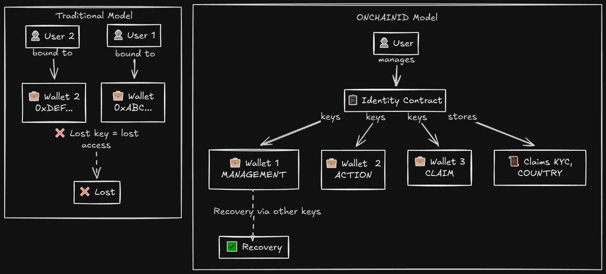
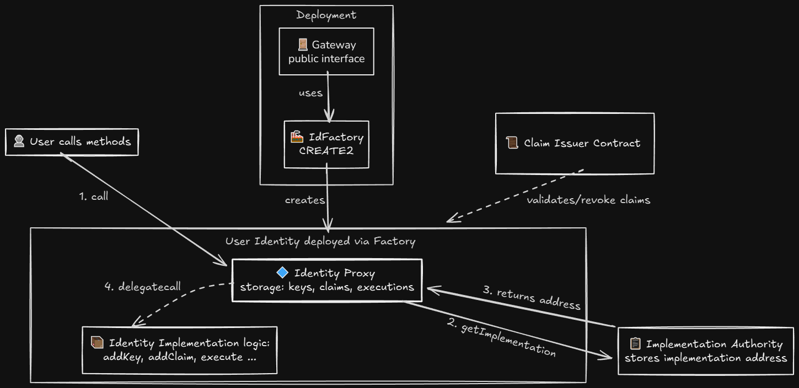
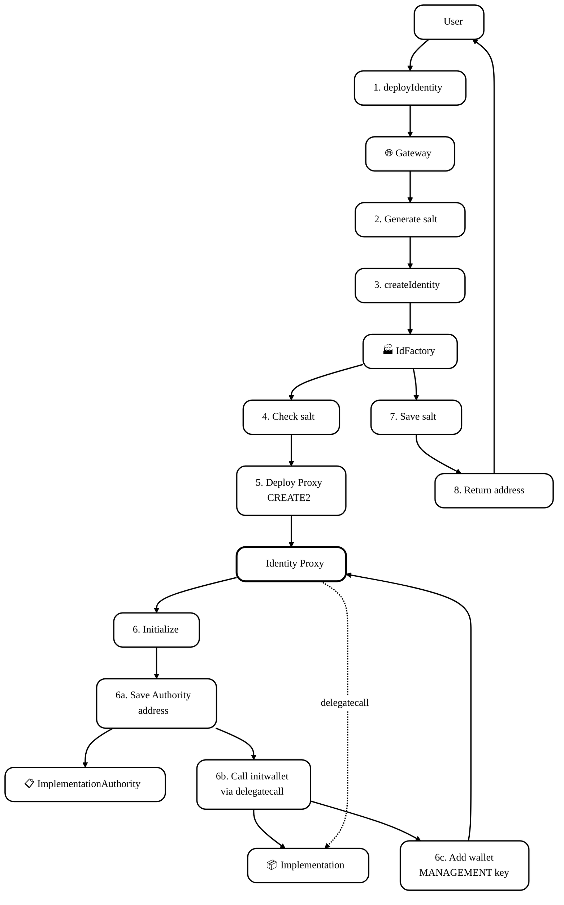
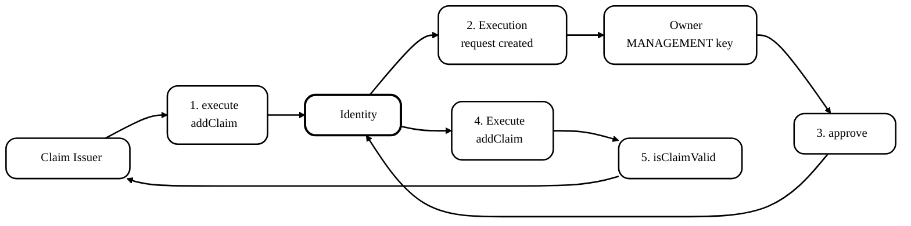
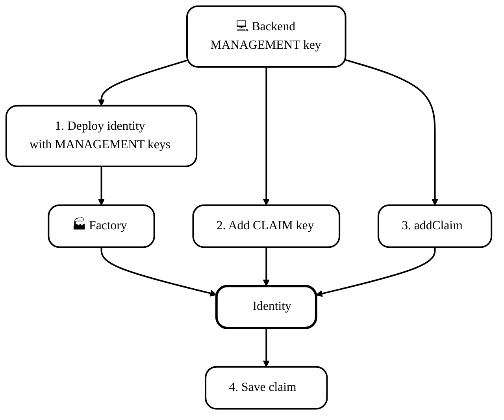
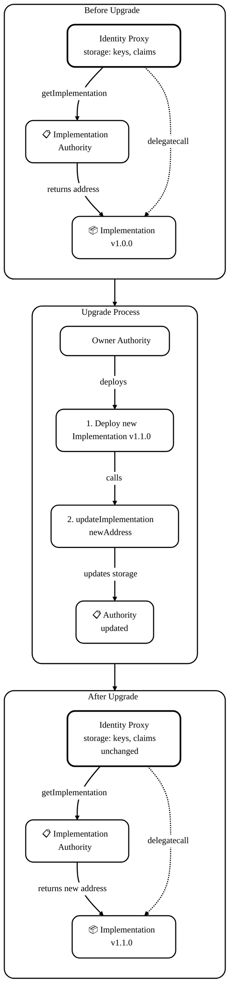
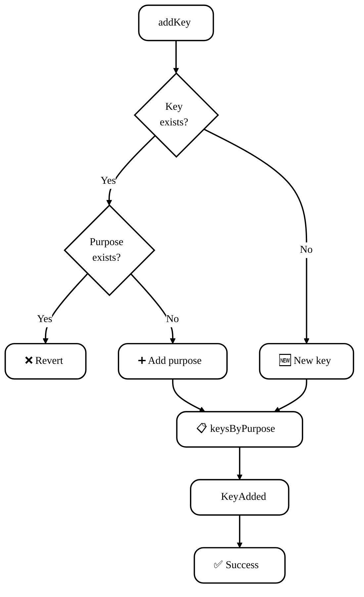
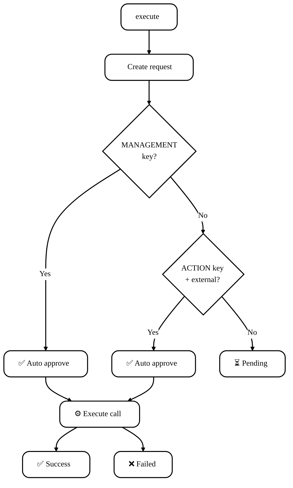

# ONCHAINID: протокол onchain-идентичностей (ERC-734 / ERC-735)

**Автор:** [Алексей Куценко](https://github.com/bimkon144) 👨‍💻

## 1. Введение

ONCHAINID - это референсная имплементация стандартов [ERC-734](https://github.com/ethereum/EIPs/issues/734) (Key Manager) и [ERC-735](https://github.com/ethereum/EIPs/issues/735) (Claim Manager) для управления цифровыми идентичностями на блокчейне. В отличие от традиционных систем идентификации, где пользователь привязан к одному кошельку, ONCHAINID позволяет создать идентичность, смарт-контракт, который:
- связывает множество кошельков с одной идентичностью,
- хранит проверяемые аттестации (claims) от доверенных провайдеров,
- поддерживает многоуровневое управление через ключи с разными правами (purposes),
- позволяет исполнять действия от имени identity через механизм execute/approve.


Мотивация протокола: в мире RWA, security tokens и permissioned DeFi недостаточно просто иметь кошелёк.

Регуляторы требуют:
- KYC/AML проверки,
- контроль юрисдикций и санкционных списков,
- возможность восстановления доступа к активам при потере ключей,
- отзыв прав доступа при изменении статуса пользователя.

ONCHAINID решает эти задачи через onchain аттестации, которые могут быть проверены и отозваны без участия самого держателя identity. При этом приватные данные (паспорт, адрес) остаются офчейн у KYC провайдеров - onchain хранятся только подписи и метаданные.

**Связь с ERC-3643 (T-REX):**

Протокол изначально был разработан как критический компонент [ERC-3643 (T-REX)](https://eips.ethereum.org/EIPS/eip-3643) для реализации подхода **permissioned**: когда инвестор физически не может приобрести security token без соблюдения всех регуляторных требований. Проверки встроены в смарт-контракт токена, и регуляторы могут аудировать compliance через публичный блокчейн.

ONCHAINID может использоваться независимо для любых сценариев, где требуется onchain identity с проверяемыми атрибутами: permissioned DeFi, DAO с требованиями к участникам.

В этой статье мы смотрим на ONCHAINID как на протокол:
- какие контракты в него входят и как они взаимодействуют,
- как устроено управление через ключи (ERC-734),
- как работают claims и их проверка (ERC-735),
- как реализованы апгрейды через ImplementationAuthority,
- как Factory и Gateway обеспечивают детерминированные адреса через CREATE2,

---

## 2. Термины

**Identity (ONCHAINID / Identity contract)** - смарт-контракт идентичности, который реализует стандарты ERC-734 (управление ключами) и ERC-735 (управление claims). Является "цифровым паспортом" пользователя/организации в блокчейне.

**ERC-734 (Key Manager)** - стандарт для управления ключами в identity контракте. Позволяет добавлять/удалять ключи с разными purposes и исполнять действия через механизм approve/execute.

**ERC-735 (Claim Manager)** - стандарт для управления claims в identity контракте. Определяет структуру claim и методы для их добавления, проверки и удаления.

**Key (ключ)** - идентификатор адреса в identity контракте. Обычно представляется как `keccak256(abi.encode(address))`. Каждый ключ имеет purpose (назначение) и keyType (тип подписи).

**Claim (аттестация)** - утверждение о владельце identity, подписанное Claim Issuer. Например: "KYC пройден", "страна резидентства: США", "аккредитованный инвестор". Хранится onchain как структура с topic, scheme, issuer, signature, data и uri.

**Claim Topic** - тип claim, представленный как `uint256` (например, 1 = KYC, 2 = AML, 3 = COUNTRY). Экосистема договаривается об интерпретации topic ID.

**Claim Issuer** - контракт-провайдер, который:
- подписывает claims для identity,
- проверяет валидность подписей,
- ведёт реестр отозванных claims (revocation registry).

Claim Issuer сам является Identity контрактом, но используется в роли "удостоверяющего центра".

**Execute / Approve** - механизм ERC-734 для исполнения действий от имени identity. Любой может создать execution request через `execute()`, но для выполнения требуется `approve()` от ключа с нужным purpose.

---

## 3. Общая архитектура ONCHAINID

ONCHAINID состоит из набора взаимосвязанных смарт-контрактов.



**Компоненты системы:**

**User Identity (Proxy + Implementation)** - основной контракт, состоит из двух частей:

**Identity Proxy** (деплоится через Factory):
- Хранит storage: keys (ключи с purposes), claims (аттестации), executions (запросы на выполнение функции внешнего или внуреннего контракта),
- Делегирует все вызовы в Implementation через delegatecall,
- При каждом вызове запрашивает адрес Implementation из ImplementationAuthority,

**Identity Implementation** (общая логика для всех Identity):
- Содержит логику: addKey, removeKey, addClaim, removeClaim, execute, approve,
- Stateless контракт - не хранит данные, работает со storage из Proxy через delegatecall,
- Может быть обновлён через ImplementationAuthority для всех Proxy одновременно.

**Claim Issuer** - обычный контракт (деплоится напрямую, без прокси):
- Выступает как удостоверяющий центр для выдачи claims,
- Имеет ключи для подписи claims,
- Предоставляет метод `isClaimValid()` для проверки валидности claims,
- Ведёт реестр отозванных подписей (`revokedClaims` mapping),
- Может отзывать claims через `revokeClaimBySignature()`.

**ImplementationAuthority** - централизованный контракт для управления логикой:
- Хранит адрес текущей Implementation для Identity контрактов,
- Метод `getImplementation()` возвращает адрес актуальной логики,
- Позволяет обновить Implementation одной транзакцией для всех Proxy,

**IdFactory** - фабрика для деплоя Identity Proxy:
- Создаёт Identity Proxy через CREATE2 (детерминированные адреса),
- При создании инициализирует Proxy: связывает с ImplementationAuthority, добавляет management key владельцу,
- Защищает от повторного использования salt (identity theft protection),
- Хранит mapping использованных salt.

**Gateway** - публичный интерфейс для деплоя:
- Позволяет пользователям деплоить identity самостоятельно (не только owner Factory),
- Автоматически генерирует salt = keccak256(wallet) для детерминированных адресов,
- Опционально поддерживает кастомные salt с подписанным разрешением от trusted deployer,
- Вызывает IdFactory для создания Proxy.

### 3.1. Участники и роли

ONCHAINID использует систему управления доступом на основе ключей (key-based) внутри Identity контрактов и Ownable для инфраструктурных контрактов.

---

**Роли в Identity**

Identity управляется через ключи с разными purposes.

**MANAGEMENT key (purpose 1)** - модификатор `onlyManager` проверяет `keyHasPurpose(keccak256(abi.encode(msg.sender)), 1)`:
- `addKey(key, purpose, keyType)` - добавление новых ключей (любых purposes)
- `removeKey(key, purpose)` - удаление ключей
- `approve(executionId, bool)` - одобрение execution requests на **саму identity** (когда `to == address(this)`)
- `execute()` механизм создания execution requests.
- Фактически имеет **полный контроль** над identity

**ACTION key (purpose 2)** - проверяется через `keyHasPurpose(keccak256(abi.encode(msg.sender)), 2)`:
- `approve(executionId, bool)` - одобрение execution requests на **внешние контракты** (когда `to != address(this)`)
- `execute()` автоматически одобряет execution для внешних контрактов, если sender имеет ACTION key
- Используется для повседневных операций (переводы, взаимодействие с DeFi)
- **Не может** управлять ключами или claims
- **Не может** одобрить execution на саму identity (защита от компрометации)

**CLAIM signer key (purpose 3)** - модификатор `onlyClaimKey` проверяет `keyHasPurpose(keccak256(abi.encode(msg.sender)), 3)`:
- `addClaim(...)` - добавление Claims
- `removeClaim(claimId)` - удаление claims
- Используется для операций с claims, но **не может** управлять ключами

**ENCRYPTION key (purpose 4)** - ключи для шифрования данных:
- Предназначен для хранения публичных ключей шифрования (например, RSA, ECIES)
- Используется для шифрования чувствительных данных, которые могут храниться в claims (персональные данные, документы, медицинские записи)
- Офчейн приложения могут использовать эти ключи для:
  - Шифрования данных перед сохранением в `claim.data` или `claim.uri`
  - Расшифровки данных при чтении claims
  - Обеспечения конфиденциальности при передаче данных между участниками
>**Важно:** ENCRYPTION key не даёт никаких прав в самом Identity контракте - это только метаданные для внешних систем

**Таблица прав:**

| Target контракт | MANAGEMENT key | ACTION key | CLAIM key | Любой адрес |
|----------------|----------------|------------|-----------|-------------|
| **Identity itself** (addKey, removeKey) | ✅ Может approve | ❌ Не может approve | ❌ Не может approve | ❌ Не может approve |
| **Внешний контракт** (transfer, swap) | ✅ Может approve | ✅ Может approve | ❌ Не может approve | ❌ Не может approve |
| **Execute (создание request)** | ✅ + автоматический approve | ✅ + автоматический approve для внешних | ❌ | ✅Только создание request |

---

**Роли в Claim Issuer**

Claim Issuer - это тот же Identity контракт (он наследуется от него, но с дополнительным функционалом), но в роли удостоверяющего центра. Управление через те же purposes:

**MANAGEMENT key (purpose 1)** в Claim Issuer:
- `revokeClaim(claimId, identity)` - отзыв claim по ID
- `revokeClaimBySignature(signature)` - отзыв claim по подписи
- Управление ключами Claim Issuer
- Управление claims самого Claim Issuer

**CLAIM signer key (purpose 3)** в Claim Issuer:
- Используется для **подписи claims офчейн**
- При проверке `isClaimValid()` Claim Issuer проверяет, что подпись сделана ключом с **purpose 3** (CLAIM signer)
- Если ключ удалён из Claim Issuer, все его подписи становятся невалидными

---

**Роли в ImplementationAuthority**

**Owner (Ownable)** - полный контроль:
- `updateImplementation(address)` - обновление implementation для всех прокси
- `transferOwnership(address)` - передача контроля

---

**Роли в IdFactory**

**Owner (Ownable)**:
- `setImplementationAuthority(address)` - изменение authority для новых identity
- `transferOwnership(address)` - передача контроля

---

**Роли в Gateway**

**Owner (Ownable)**:
- Управление trusted deployers (кто может деплоить с кастомными salt)
- Изменение Factory address
- Передача контроля

**Любой пользователь** (public):
- `deployIdentity(wallet)` - деплой с auto-generated salt = keccak256(wallet)
- `deployIdentityWithSalt(wallet, salt, signature)` - деплой с кастомным salt (требуется подпись trusted deployer)

### 3.2. Как компоненты взаимодействуют

**Вызов метода на Identity:**

Таким образом, если пойти по схеме, с учётом того, что контракты все задеплоены, то выглядит это так:

1. User вызывает метод на адресе Identity Proxy (например, `addKey()`)
2. Proxy вызывает `ImplementationAuthority.getImplementation()`
3. Authority возвращает адрес Identity Implementation
4. Proxy делает delegatecall в Implementation и Implementation выполняет логику, используя storage из Proxy

### 3.3. Деплой и его виды

**Два подхода к деплою Identity:**

Можно реализовать деплой как самостоятельный самими пользователями через Gateway, либо централизованно с backend через Factory. Каждый подход имеет свои преимущества:

**Деплой через Factory (backend/owner контролирует):**

Преимущества:
- **Полный контроль над salt**: Backend может обеспечить строгую детерминированность адресов (одинаковые адреса на всех сетях),
- **Централизованное управление**: Backend может контролировать, кто и когда получает identity,
- **UX для пользователей**: Пользователям не нужно платить газ и понимать процесс деплоя,
- **Batch операции**: Backend может деплоить множество identity в одной транзакции (экономия газа),
- **Интеграция с KYC**: Можно деплоить identity только после успешного прохождения KYC офчейн,
- **Предсказуемость**: Backend заранее знает адрес identity и может подготовить claims до деплоя.

Недостатки:
- **Централизация**: Только owner Factory может деплоить (single point of failure),
- **Зависимость от backend**: Если backend недоступен, пользователи не могут получить identity,
- **Затраты для эмитента**: Backend платит газ за все деплои.

**Деплой через Gateway (сами или через разрешения):**

Преимущества:
- **Децентрализация**: Любой может создать identity без разрешения owner
- **Независимость**: Пользователи не зависят от доступности backend,
- **Self-custody**: Пользователь сам платит газ и контролирует процесс создания,
- **Детерминированность для пользователя**: Salt генерируется из адреса кошелька - пользователь может пересоздать identity на другой сети с тем же адресом,
- **Публичный доступ**: Подходит для массового adoption (любой может начать использовать).

Недостатки:
- **Пользователь платит газ**: Барьер входа для новых пользователей,
- **Сложность для пользователей**: Нужно понимать процесс и иметь нативку для газа,
- **Меньше контроля**: Нельзя ограничить, кто может создать identity (если public mode)

**Создание identity происходит таким образом:**



1. Пользователь вызывает `Gateway.deployIdentity(wallet)`
2. Gateway генерирует `salt = keccak256(wallet)` (детерминированный)
3. Gateway вызывает `IdFactory.createIdentity(wallet, salt)`
4. Factory проверяет: salt не использован ранее
5. Factory деплоит Identity Proxy через CREATE2 с этим salt
6. Proxy инициализируется:
   - Сохраняет адрес ImplementationAuthority в storage,
   - Вызывает Implementation.init(wallet) через delegatecall,
   - Добавляет wallet как MANAGEMENT key (purpose 1)
7. Factory сохраняет `salt` в mapping
8. Возвращается адрес созданного Identity Proxy

После того как Identity контракт создан (через Factory или Gateway), следующим шагом является добавление claims - аттестаций от доверенных провайдеров. Claims позволяют доказать, что identity прошла KYC, имеет определённую юрисдикцию, статус инвестора и т.д.

### 3.4. Работа с Claim

Процесс добавления claim зависит от типа claim и политики Claim Issuer.

**Сценарий A: Инвестор добавляет claim самостоятельно**

Этот сценарий используется когда Claim Issuer подписывает claim офчейн и передаёт подпись инвестору (через email, API, UI и т.д.). Инвестор затем сам добавляет claim в свой Identity контракт.

**Кто может добавить:** Владелец Identity (через purpose 3 или 1)

**Процесс:**

1. **Офчейн этап:** Claim Issuer (например, KYC провайдер) проверяет документы инвестора и подписывает claim:
   ```solidity
   bytes32 dataHash = keccak256(abi.encode(identityAddress, topic, data));
   bytes memory signature = claimIssuerKey.sign(dataHash);
   ```
   Подпись передаётся инвестору офчейн.

2. **Onchain этап:** Инвестор (через кошелёк с CLAIM key, purpose 3) вызывает на [Identity](https://github.com/onchain-id/solidity/blob/a483cda6821e3883497972d36d0c4c1e1693e483/contracts/Identity.sol#L342):
   ```solidity
   identity.addClaim(topic, scheme, issuerAddress, signature, data, uri);
   ```

3. **Валидация:** Проверка claim на [ClaimIssuer](https://github.com/onchain-id/solidity/blob/a483cda6821e3883497972d36d0c4c1e1693e483/contracts/ClaimIssuer.sol#L46):
   - Вызывает `claimIssuer.isClaimValid(identity, topic, signature, data)`
   - Claim Issuer проверяет:
     - Подпись валидна и сделана ключом с purpose 3 (CLAIM signer) в Claim Issuer контракте
     - Подпись не отозвана: `!revokedClaims[signature]`
   - Если проверка прошла, сохраняет claim
   - Emit события `ClaimAdded`

```mermaid
%%{init: {
  "theme": "base",
  "themeVariables": {
    "background": "#ffffff",
    "primaryColor": "#ffffff",
    "secondaryColor": "#ffffff",
    "tertiaryColor": "#ffffff",
    "primaryBorderColor": "#000000",
    "lineColor": "#000000",
    "textColor": "#000000",
    "primaryTextColor": "#000000",
    "fontFamily": "Caveat, ui-sans-serif, system-ui"
  },
  "flowchart": { "curve": "basis" }
}}%%

flowchart LR

classDef card fill:transparent,stroke:#000000,color:#000000,stroke-width:2px,rx:14,ry:14;
classDef proxy fill:transparent,stroke:#000000,color:#000000,stroke-width:3px,rx:14,ry:14;
linkStyle default stroke:#000000,stroke-width:2px;

CI[📜 Claim Issuer]:::card
Investor[👤 Investor<br/>CLAIM key]:::card
ID[🔷 Identity]:::proxy

Step1[1. Offchain<br/>Sign claim]:::card
Step2[2. Send signature<br/>to investor]:::card
Step3[3. addClaim]:::card
Step4[4. isClaimValid]:::card

CI --> Step1
Step1 --> Step2
Step2 --> Investor
Investor --> Step3
Step3 --> ID
ID --> Step4
Step4 --> CI
```



**Сценарий B: Claim Issuer добавляет claim через execute/approve**

Этот сценарий используется когда Claim Issuer хочет автоматизировать процесс и сам инициирует добавление claim onchain. Финальное решение остаётся за владельцем Identity (через approve).

**Кто может добавить:** Claim Issuer инициирует, но владелец Identity должен одобрить (через MANAGEMENT key)

**Процесс:**

1. **Claim Issuer инициирует:** Claim Issuer [вызывает](https://github.com/onchain-id/solidity/blob/a483cda6821e3883497972d36d0c4c1e1693e483/contracts/Identity.sol#L79):
   ```solidity
   identity.execute(
       address(identity),  // target = сама identity
       0,                   // value = 0
       abi.encodeWithSignature(
           "addClaim(uint256,uint256,address,bytes,bytes,string)",
           topic, scheme, issuerAddress, signature, data, uri
       )
   );
   ```
   Это создаёт execution request в Identity контракте.

2. **Владелец Identity одобряет:** Владелец (через MANAGEMENT key) получает уведомление и [одобряет](https://github.com/onchain-id/solidity/blob/a483cda6821e3883497972d36d0c4c1e1693e483/contracts/Identity.sol#L220):
   ```solidity
   identity.approve(executionId, true);
   ```
   Identity выполняет `addClaim()` и сохраняет claim.



**Сценарий C: Backend управляет identity от имени инвестора**

Этот сценарий используется в корпоративных решениях и T-REX, где backend (эмитент токена, кастодиан, платформа) полностью управляет identity инвестора. Backend деплоит identity с MANAGEMENT keys для себя, и сам добавляет claims без участия инвестора.

**Кто может добавить:** Backend (через CLAIM key, который backend добавляет себе через MANAGEMENT key)

**Процесс:**

1. **Backend деплоит identity с MANAGEMENT keys:** Backend использует специальный [метод](https://github.com/onchain-id/solidity/blob/a483cda6821e3883497972d36d0c4c1e1693e483/contracts/factory/IdFactory.sol#L82) Factory, который позволяет сразу при создании добавить MANAGEMENT keys:
   ```solidity
   bytes32[] memory managementKeys = new bytes32[](2);
   managementKeys[0] = keccak256(abi.encode(backendWallet1));  // первый backend кошелёк
   managementKeys[1] = keccak256(abi.encode(backendWallet2));  // второй backend кошелёк (multisig)
   
   factory.createIdentityWithManagementKeys(
       investorWallet,        // адрес инвестора
       "investor-123-v1",     // custom salt
       managementKeys        // MANAGEMENT keys для backend
   );
   ```
   
   Этот метод:
   - Деплоит Identity Proxy через CREATE2
   - Сразу добавляет указанные MANAGEMENT keys (backend кошельки)
   - Не добавляет `investorWallet` как MANAGEMENT key (инвестор не может управлять)
   - Связывает `investorWallet` с identity

2. **Backend добавляет себе CLAIM key:** Backend (через MANAGEMENT key) [добавляет](https://github.com/onchain-id/solidity/blob/a483cda6821e3883497972d36d0c4c1e1693e483/contracts/Identity.sol#L181) CLAIM key для управления claims:
   ```solidity
   identity.addKey(
       keccak256(abi.encode(backendWallet)),
       3,  // CLAIM purpose
       1   // ECDSA
   );
   ```

3. **Backend добавляет claim:** Backend (через свой CLAIM key) [вызывает](https://github.com/onchain-id/solidity/blob/a483cda6821e3883497972d36d0c4c1e1693e483/contracts/Identity.sol#L342) напрямую:
   ```solidity
   identity.addClaim(topic, scheme, issuerAddress, signature, data, uri);
   ```
   Никакого approve не требуется - backend имеет полный контроль через CLAIM key.



**Инвестор не участвует:** Инвестор не знает о процессе, не платит газ, не управляет ключами. Backend полностью контролирует identity. Инвестор может использовать свой кошелёк для операций (transfer токенов), но не может управлять identity (добавлять/удалять ключи, claims).

**Преимущества этого подхода:**
- **UX для инвестора:** Инвестор ничего не делает, всё происходит автоматически
- **Централизованное управление:** Backend может batch добавлять claims для множества инвесторов
- **Интеграция с KYC:** Backend может автоматически добавлять claims после успешного KYC офчейн
- **Восстановление:** Backend может легко восстановить доступ при потере ключей инвестора

**Недостатки:**
- **Централизация:** Инвестор не контролирует свою identity
- **Доверие:** Инвестор должен доверять backend
- **Риск:** Если backend скомпрометирован, злоумышленник может управлять identity

**Когда какой сценарий использовать:**

- **Сценарий A (инвестор добавляет):** Для self-sovereign identity, когда инвестор хочет полный контроль. Claim Issuer не платит газ. Подходит для public DeFi, DAO, децентрализованных систем.

- **Сценарий B (Claim Issuer инициирует):** Для автоматизированных систем, когда Claim Issuer хочет "протолкнуть" claim, но финальное решение остаётся за инвестором. Требует механизм уведомлений для владельца Identity. Подходит для гибридных систем с частичной автоматизацией.

- **Сценарий C (backend управляет):** Для корпоративных решений, T-REX токенов, кастодиальных сервисов, где backend должен полностью контролировать процесс compliance. Инвестор не участвует в управлении identity. Подходит для security tokens, RWA, institutional investors.

### 3.5. Обновление логики (upgrade)

Одним из преимуществ архитектуры Proxy + ImplementationAuthority является возможность обновлять логику всех Identity контрактов одновременно (Beacon pattern по сути) без изменения их адресов и storage.



**Процесс обновления:**

1. Owner ImplementationAuthority деплоит новый Identity Implementation контракт с обновлённой логикой (исправления багов, новые features, оптимизации).

2. Owner вызывает `Authority.updateImplementation(newImplementationAddress)` для регистрации новой версии.

3. Authority обновляет адрес Implementation в своём storage.

4. При следующем вызове любого Identity Proxy:
   - Proxy.fallback() перехватывает вызов
   - Proxy запрашивает `getImplementation()` у Authority
   - Authority возвращает адрес новой Implementation
   - Proxy делает delegatecall в новую логику

5. Все Identity Proxy автоматически начинают использовать новую логику. Storage остаётся в Proxy (не меняется), поэтому все данные (keys, claims, executions) сохраняются.

Обновление Implementation влияет на все Identity Proxy одновременно. Это мощный инструмент, но требует осторожности - owner Authority должен быть защищён (multisig, DAO, timelock).

---

## 4. Детальный разбор механик ONCHAINID

### 4.1. Key management

Identity контракт [хранит](https://github.com/onchain-id/solidity/blob/a483cda6821e3883497972d36d0c4c1e1693e483/contracts/storage/Storage.sol#L10) [ключи](https://github.com/onchain-id/solidity/blob/a483cda6821e3883497972d36d0c4c1e1693e483/contracts/storage/Structs.sol#L16) таким образом:

```solidity
struct Key {
    uint256[] purposes;  // массив purposes: [1] = MANAGEMENT, [2] = ACTION, [3] = CLAIM, [4] = ENCRYPTION
    uint256 keyType;     // 1 = ECDSA, 2 = RSA
    bytes32 key;         // keccak256(abi.encode(address))
}

mapping(bytes32 => Key) public keys;
mapping(uint256 => bytes32[]) public keysByPurpose;  // массив ключей для каждого purpose
```

**Flow диаграмма добавления ключа:**



**Ключевая логика управления ключами:**

**`addKey(bytes32 _key, uint256 _purpose, uint256 _type)`** - только MANAGEMENT key:
- Ключ существует: проверяет конфликты и добавляет purpose в массив
- Новый ключ: создаёт Key структуру
- Обновляет `keysByPurpose[_purpose]`

**`removeKey(bytes32 _key, uint256 _purpose)`** - только MANAGEMENT key:
- Удаляет один purpose из массива
- Если последний purpose: удаляет весь ключ

**`keyHasPurpose(bytes32 _key, uint256 _purpose)`** - проверка прав:
- MANAGEMENT key (purpose 1) имеет все права
- Возвращает true если ключ имеет нужный purpose

**Важные моменты:**

1. **Один ключ = несколько purposes:** Ключ может иметь несколько purposes одновременно (например, MANAGEMENT + ACTION + CLAIM). Это позволяет одному адресу выполнять разные роли.

2. **keysByPurpose для оптимизации:** Mapping `keysByPurpose[purpose]` хранит массив всех ключей с данным purpose, что позволяет быстро находить ключи через `getKeysByPurpose(purpose)`.

3. **Формат ключа:** Ключи хранятся как `keccak256(abi.encode(address))`, а не просто `address`. Это соответствует ERC-734, где ключ может быть не только EOA адресом, но и произвольным публичным ключом.

### 4.2. Execute / Approve: Account Abstraction по ERC-734

ONCHAINID реализует механизм "proposal + approval" для исполнения действий от имени identity.

**Структура execution:**

```solidity
struct Execution {
    address to;          // target contract
    uint256 value;       // ETH value
    bytes data;          // calldata
    bool approved;       // одобрен ли execution
    bool executed;       // выполнен ли execution
}

mapping(uint256 => Execution) public executions;
uint256 public executionNonce;
```

**Flow диаграмма Execute/Approve:**



**Ключевая логика:**

**`execute(address _to, uint256 _value, bytes memory _data)`** - публичная функция (любой может вызвать):
- Создаёт execution request с уникальным ID
- MANAGEMENT key: автоматически одобряет любой execution
- ACTION key: автоматически одобряет только внешние контракты (target != identity)
- Остальные: execution остаётся в pending

**`approve(uint256 _id, bool _approve)`** - одобрение execution:
- Target = identity: требуется MANAGEMENT key
- Target = external: требуется ACTION key
- Выполняет call и emit события (Executed / ExecutionFailed)

**Примеры:**

```solidity
// MANAGEMENT key может одобрить любой execution
identity.execute(address(identity), 0, abi.encodeWithSignature("addKey(...)"));
// Автоматически одобрено и выполнено

// ACTION key может одобрить только внешние контракты
identity.execute(tokenAddress, 0, abi.encodeWithSignature("transfer(...)"));
// Автоматически одобрено и выполнено

// ACTION key НЕ может одобрить execution на identity
identity.execute(address(identity), 0, abi.encodeWithSignature("removeKey(...)"));
// Pending - требуется MANAGEMENT key для approve
```

Механизм execute/approve превращает Identity контракт в  смарт-контракт кошелёк с account abstraction: любой адрес может предложить действие, а владельцы ключей контролируют его выполнение. Это позволяет разделить инициативу (кто может создать request) и авторизацию (кто может одобрить), что критично для безопасности и удобства использования.

### 4.3. Claims: структура, добавление и проверка

Рассмотрим, как выглядит [Claim](https://github.com/onchain-id/solidity/blob/a483cda6821e3883497972d36d0c4c1e1693e483/contracts/storage/Structs.sol#L63) и где он [хранится](https://github.com/onchain-id/solidity/blob/a483cda6821e3883497972d36d0c4c1e1693e483/contracts/storage/Storage.sol#L22) на примере `identity.sol` контракта:

**Структура Claim:**

```solidity
struct Claim {
    uint256 topic;      // тип claim (KYC, AML, COUNTRY, etc.)
    uint256 scheme;     // схема верификации (как проверять signature и data)
    address issuer;     // адрес Claim Issuer контракта
    bytes signature;    // подпись claim
    bytes data;         // данные (hash, encoded data, encrypted data)
    string uri;         // URI на офчейн данные (IPFS, HTTPS, Swarm)
}

mapping(bytes32 => Claim) public claims;
mapping(uint256 => bytes32[]) public claimsByTopic;
```

Claim ID [генерируется](https://github.com/onchain-id/solidity/blob/a483cda6821e3883497972d36d0c4c1e1693e483/contracts/Identity.sol#L360) детерминированно:
```solidity
bytes32 claimId = keccak256(abi.encode(issuer, topic));
```
Один issuer может иметь ровно один claim на каждый topic. Повторный `addClaim` перезапишет существующий claim.

**Поле `topic` - тип claim:**

Topic определяет категорию claim. Это `uint256`, который интерпретируется экосистемой. Стандартные значения:

- **1**: KYC (Know Your Customer) - пройдена верификация личности
- **2**: AML (Anti-Money Laundering) - пройдена проверка на отмывание денег
- **3**: COUNTRY - страна резидентства
- **4**: ACCREDITED - статус аккредитованного инвестора
- **5**: INVESTOR_TYPE - тип инвестора (retail, professional, institutional)

Экосистема может определять свои topic ID.

**Поле `scheme` - схема верификации:**

Scheme определяет, как нужно интерпретировать и проверять поля `signature` и `data`. Согласно ERC-735:

- **1**: ECDSA подпись (стандартная) - подпись создана приватным ключом ECDSA
- **2**: RSA подпись - подпись создана приватным ключом RSA
- **3**: Self-attested claim (самоподписанный) - claim подписан самим identity owner
- **4**: Contract verification - валидация через вызов внешнего контракта

**Наиболее часто используется scheme = 1 (ECDSA):**
```solidity
// Claim Issuer подписывает claim ECDSA ключом
bytes32 dataHash = keccak256(abi.encode(identityAddress, topic, data));
bytes32 prefixedHash = keccak256(abi.encodePacked("\x19Ethereum Signed Message:\n32", dataHash));
bytes memory signature = sign(prefixedHash);  // ECDSA signature

// При верификации Claim Issuer.isClaimValid():
// - восстанавливает адрес подписанта из signature (ecrecover)
// - проверяет, что адрес имеет CLAIM key (purpose 3) в Claim Issuer
```

Scheme можно использовать для кастомных схем верификации, например:
- scheme = 10: off-chain верификация через API
- scheme = 20: zero-knowledge proof верификация
- scheme = 30: multi-sig верификация

**Формат подписи claim (signature):**
```solidity
bytes32 dataHash = keccak256(abi.encode(identityAddress, topic, data));
bytes32 prefixedHash = keccak256(abi.encodePacked("\x19Ethereum Signed Message:\n32", dataHash));
bytes memory signature = sign(prefixedHash);
```
Подпись привязана к конкретной identity, а не к кошельку.

**Использование полей `data` и `uri`:**
- `data`: хэш данных, закодированные данные, зашифрованные данные
- `uri`: IPFS хэш, HTTPS URL


**Ключевая логика:**

**`addClaim(...)`** - только CLAIM key (purpose 3):
- Генерирует claimId = keccak256(issuer, topic)
- Вызывает `issuer.isClaimValid()` для проверки
- Сохраняет claim в mapping
- Обновляет claimsByTopic

**`removeClaim(bytes32 claimId)`** - только CLAIM key:
- Удаляет claim из mapping
- Обновляет claimsByTopic

**`isClaimValid(identity, topic, signature, data)`** - в Identity контракте (базовая версия):
- Восстанавливает адрес подписанта из signature (ecrecover)
- Проверяет, что подписант имеет CLAIM key (purpose 3) в Identity контракте
- **Self-attested claims**: для claims, выданных самой Identity (issuer == address(this)), нет механизма отзыва
- Claim валиден пока подпись валидна и claim хранится в Identity контракте
- Не проверяет отзыв (нет `revokedClaims` mapping в базовом Identity)

**Методы, которые есть только в Claim Issuer контракте (дополняют базовый Identity):**

**`isClaimValid(identity, topic, signature, data)`** - переопределённая версия в Claim Issuer:
- Наследует логику из Identity (проверка подписи и CLAIM key)
- Дополнительно проверяет отзыв через `isClaimRevoked(signature)`
- Возвращает true только если подпись валидна и claim не отозвана

**`revokeClaimBySignature(signature)`** - только MANAGEMENT key:
- Добавляет signature в `revokedClaims` mapping
- После отзыва `isClaimValid()` возвращает false

**`revokeClaim(claimId, identity)`** - только MANAGEMENT key:
- Альтернативный способ отзыва: получает signature из claim через `identity.getClaim(claimId)`
- Добавляет signature в `revokedClaims` mapping
- Удобен когда известен claimId, а не signature напрямую

**`isClaimRevoked(signature)`**
- Проверяет, отозван ли claim по signature
- Возвращает true если signature в `revokedClaims` mapping

**Ключевой момент безопасности:**

Проверка валидности claim происходит через **Claim Issuer**, а не через саму Identity. Claim Issuer хранит собственный реестр отозванных подписей (`revokedClaims`), что означает, что инвестор не может предотвратить отзыв, удалив ключ из своего Identity. Даже если claim хранится в Identity, он становится невалидным, если отозван в Claim Issuer. Это критически важно для compliance: Claim Issuer контролирует валидность своих claims независимо от действий владельца identity, что позволяет регуляторам и KYC провайдерам мгновенно блокировать доступ к токенам при нарушении правил или истечении KYC.

## 5. Заключение

ONCHAINID - это onchain слой идентичности, который превращает блокчейн адреса в управляемые identity контракты с верифицируемыми claims. Протокол решает ключевую проблему permissioned систем: как связать реальную личность с onchain активностью, сохранив контроль пользователя над его идентичностью и обеспечив compliance с регуляторными требованиями.

Архитектурно ONCHAINID строится на ERC-734 (Key Manager) и ERC-735 (Claim Holder), при этом важно отметить, что оба предложения не были доведены до статуса Final, а в экосистеме их роль во многом перехвачена более актуальными спецификациями (в частности, [LSP6 KeyManager](https://github.com/lukso-network/LIPs/blob/main/LSPs/LSP-6-KeyManager.md)). Identity реализован как прокси-контракт с выносом логики в отдельную implementation. Identity действует через механизм execute/approve, что даёт разделение ролей (MANAGEMENT, ACTION, CLAIM keys) и возможность recovery при потере ключей. Claims подписываются офчейн trusted issuers, но валидность проверяется через onchain Claim Issuer с revocation registry, что позволяет мгновенно блокировать доступ независимо от действий владельца identity.

ONCHAINID изначально разрабатывался как критический компонент для T-REX (ERC-3643) - стандарта permissioned токенов. Он позволяет связать wallet и ONCHAINID. Более подробно про интеграцию описано в моей статье про T-REX.

На практике протокол используется для токенизации активов на сумму более $25 млрд в рамках ERC-3643 экосистемы. [ERC-3643 Association](https://www.erc3643.org/members) объединяет десятки участников, включая крупные банки, аудиторские компании и KYC провайдеров. [Tokeny](https://tokeny.com/) - компания-разработчик стандарта - предоставляет полноценную платформу с UI для деплоя и управления ERC-3643 токенами.

Ключевые ограничения схожи с T-REX: централизация вокруг ImplementationAuthority owner, зависимость от офчейн KYC провайдеров, риск спама execution requests, сложность для пользователей без UI абстракции. При этом архитектура через прокси даёт гибкость обновления, а CREATE2 деплой обеспечивает кросс-чейн портируемость identity.

В инженерном смысле ONCHAINID даёт зрелый стандарт для onchain идентичности в permissioned системах. Протокол чётко разделяет уровни: ключи, claims, issuer registry, верификация. Это позволяет строить compliance слои поверх публичных блокчейнов, сохраняя прозрачность логики и контроль над данными, но добавляя регуляторные проверки там, где они необходимы.

### Ссылки

- [ONCHAINID Documentation](https://docs.onchainid.com/)
- [onchain-id/solidity GitHub](https://github.com/onchain-id/solidity)
- [ERC-734: Key Manager](https://github.com/ethereum/EIPs/issues/734)
- [ERC-735: Claim Holder](https://github.com/ethereum/EIPs/issues/735)
- [ERC-3643 Association](https://www.erc3643.org/)
- [Tokeny Solutions](https://tokeny.com/)
