# Pendle - Liberating Yield

**Автор:** [Павел Найданов](https://github.com/PavelNaydanov) 🕵️‍♂️

[Pendle](https://www.pendle.finance/) - это протокол токенизации доходности c элементами трейдинга на вторичном рынке (yield-trading protocol). Поддерживает несколько EVM-совместимых сетей.

Основная идея Pendle заключается в разделении активов, которые приносят доход (yield-bearing token), на две части: **principal** (основная) and **yield** (доходная), где основная часть отождествляет эквивалент доходного токена, а доходная часть - прибыль.

В традиционных финансах подобный инструмент существует очень давно. [Strip bonds](https://www.investopedia.com/terms/s/stripbond.asp) или *stripped securities*. Разделение облигации на "тело" (principal) и купоны (coupons).

Ещё более наглядная аналогия – разделение прав на недвижимость:
- Право собственности – аналог "тела" актива.
- Право на арендные платежи – аналог "доходной части".

В Pendle возможно приобрести доходность базового актива отдельно от самого актива с расчетом, что доходность изменится в положительную сторону и покупатель получит доход. Например, стейкинг базового актива ETH дает плавающую доходность. Она меняется с течением времени. Поэтому в будущем доход может увеличиться.

Есть три ключевые функциональности, которые характеризуют протокол Pendle:

1. Создание обертки для токенов, которые приносят доходность.
2. AMM для торговли обернутыми токенами.
3. vePENDLE для создания безопасной экосистемы и дополнительных стимулов для пользователей.

**Обертка токенов**

Pendle оборачивает токены, приносящие доход. Примерами таких токенов могут быть любые токены генерирующие доходность: stETH, GLP, gDAI и так далее.

Протокол вводит аббревиатуру **SY** (Standardized Yield token) для обертки. Например, SY-stETH - это обертка для stETH.

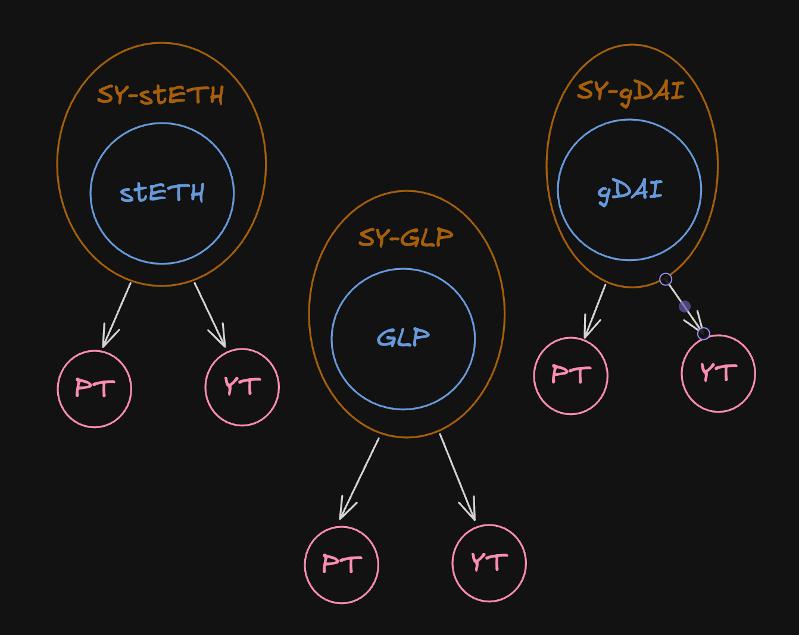

`SY` - это не просто токен, как WETH. Он разбивается на две части:
- **PT** (principal token). Представляет эквивалент базового токена.
- **YT** (yield token). Представляет доходность базового токена.

Процесс разделения `SY` на два токен называется токенизацией доходности, где доходность токенизируется в отдельный токен `YT`.

_Важно!_ Пользователь может оборачивать в `SY`, как доходный токен (stETH), так и базовое представление (ETH) в некоторых случаях. Под капотом будет произведена сначала конвертация из `ETH -> stETH`, затем из `stETH -> SY-stETH`. Это работает так, за исключением некоторых случаев, когда доходный токен сам является базовым представлением, например токен [GLP](https://docs.gmx.io/docs/providing-liquidity/v1) от GMX.

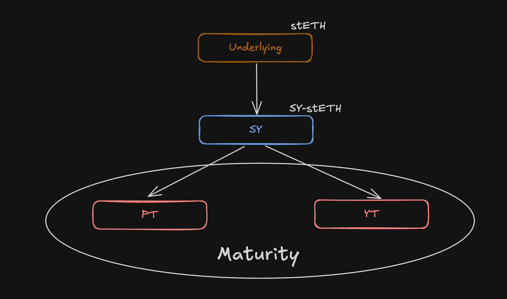

C `PT` и `YT` связан еще один термин - **maturity**. Это срок погашения, когда `YT` перестает приносить доходность, а `PT` может быть полностью поменян на базовый актив в соотношении 1:1.

`PT` можно обменять через AMM до наступления срока погашения (со скидкой относительно номинальной стоимости), но 1:1 обменять на базовый актив — только после наступления срока погашения.

**AMM**

Обе части обернутого токена `PT` и `YT` могут торговаться на специальной площадке протокола под названием Pendle AMM.

AMM является ключевым функционалом протокола. Математическая база взята из протокола [Notional Finance](https://www.notional.finance/). Кривая AMM сужает ценовой диапазон с приближением ко времени погашения (maturity). Но по сути, все это напоминает Uniswap v2 с его формулой постоянного произведения `x * y = k`.

Для AMM также необходимы поставщики ликвидности, которые готовы предоставить свои токены `SY` и `PT`. Взамен они получат LP токен, в качестве притязаний на свою часть ликвидности в пуле.

Не смотря на то, что в пуле два актива (`PT` и `SY`) при помощи AMM также может обмениваться и `YT` токен. Такой обмен называется **Flash своп**. Flash, потому что множество преобразований для свопа происходят в рамках одного блока.

Flash своп работают поверх математической связи `P(PT) + P(YT) = P(SY)` при создании обертки `SY`, где:
- **P(PT)** - цена токена `PT`,
- **P(YT)** - цена токена `YT`,
- **S(SY)** - цена токена `SY`.

Таким образом, математика гарантирует, что разделение `SY` на `PT` + `YT` (или их объединение обратно в `SY`) всегда экономически сбалансировано в момент создания или погашения `SY`.

Если пользователь хочет купить `YT`, то он отдает `SY` в пул (для получения `SY` он оборачивает базовый актив), так как в природе `SY` становится больше, то для сохранения баланса нужно доминтить `PT` и `YT`. После этого часть `YT` отправляется пользователю, а в пул отправляется некоторое количество `PT`, которое будет соблюдать баланс по формуле `P(PT) + P(YT) = P(SY)`.

*// Схема взята из документации протокола Pendle*

**vePENDLE**

Это [vote-escrowed](https://medium.com/@db371.eth/vote-escrowed-tokenomics-3cee9e9614db) токен, который используется владельцами в управлении протоколом. Владельцы vePENDLE получат доступ ко множеству функций протокола:
- Дополнительный доход.
- Голосование за пулы, которые получат дополнительное вознаграждение.
- Увеличение награды для поставщика ликвидности.

vePENDLE также служит механизмом для сокращения свободного предложения токенов PENDLE, за счет того, что получении vePENDLE требует застейкать PENDLE. C течением времени количество vePENDLE уменьшается и PENDLE разблокируется.

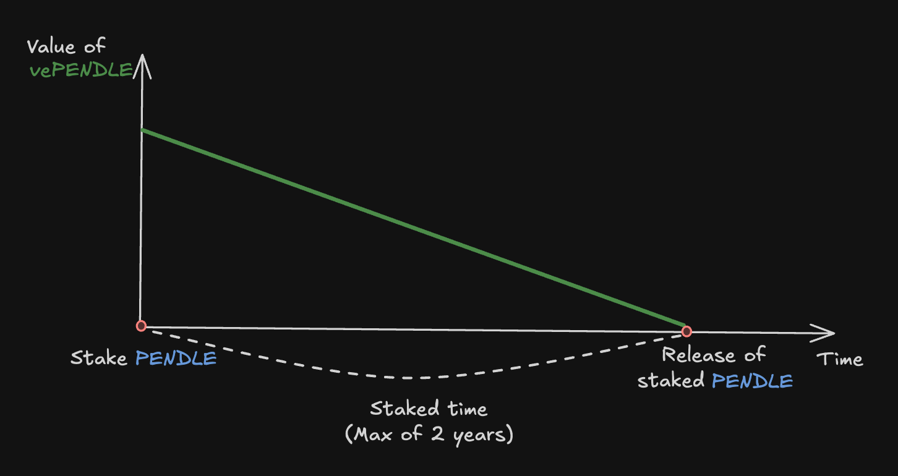

Таким образом протокол повышает стабильность токена PENDLE и общую надежность протокола.

Для пользователей из L2 сетей все немного сложнее. Чтобы получить максимальную прибыль, пользователи, предоставляющие ликвидность на Arbitrum, должны заблокировать PENDLE на Ethereum и синхронизировать информацию с Arbitrum с помощью кроссчейн-сообщений.

При этом для получения дохода с LP токенов этого не требуется, так как распределение вознаграждения происходит непосредственно в сети Arbitrum (аналогично в другой L2 сети).

## Типы APY

Внутри протокола можно столкнуться с разными типами APY. Всего их четыре вида и необходимо понимать, что каждый из них обозначает. Это поможет эффективно пользоваться протоколом или понимать кодовую базу.

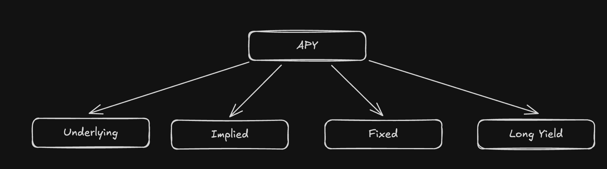

**Underlying APY**

Представляет собой 7-ми дневную скользящую средней доходности базового актива.

**Implied APY**

Рыночная стоимость базового актива, рассчитанная на основании стоимости `YT` и `PT`.

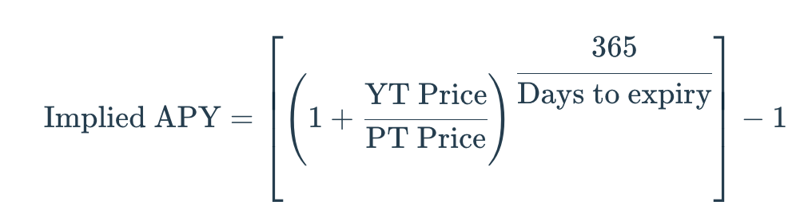

**Fixed APY**

Гарантированная доходность, которую можно получить при наличии `PT` на своем кошельке до времени погашения (maturity). Она определяется Implied APY в момент создания `PT`.

**Long Yield APY**

Приблизительная годовая доходность при покупке `YT` по текущей стоимости. Актуально, при условии, что базовая годовая процентная доходность остается постоянной.

## Ключевые механики PT и YT

И `PT` и `YT` тесно связаны со временем погашения (**maturity**). Это мы уже обсуждали выше.

**Магия с PT токеном**

`PT` представляет собой эквивалент базового токена, который может быть погашен после наступления maturity. Это означает, что обменять `PT` на базовый токен в соотношение 1:1 можно только по истечение определенного времени.

В начале maturity `PT` торгуется со скидкой. Это возможно благодаря тому, что доходность базового актива представлена в отдельном токене YT.

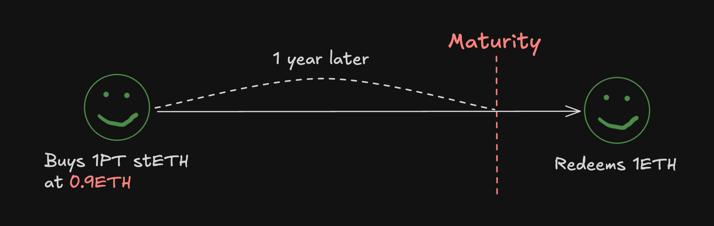

В течении периода maturity, `PT` будет приближаться к стоимости базового актива и в конечном итоге соответствовать ей, когда погашение будет возможно. Подобный рост стоимости базового актива и определяет фиксированную годовую доходность (Fixed APY).

Важно понимать, что stETH - это доходный токен, который растет относительно базового ETH за счет начисления вознаграждения за стейкинг. Приобретая `PT` токен, обратный обмен 1:1 (redeems на схеме) может быть произведен только в ETH, не в stETH, который по прежнему растет относительно ETH в стоимости.

**Магия с YT токеном**

Обладатель `YT` претендует на всю доходность от базового актива вплоть до наступления времени погашения (maturity).

Например, владея 10 YT-stETH в течение 5 дней, получаешь доход эквивалентный застейканным 10 ETH на Lido за тот же период времени.

Стоимость `YT` стремится к 0 по мере приближения к maturity. И здесь важным показателем является Implied APY. Пользователи получают прибыль, когда доходность, собранная на `YT`, выше, чем покупка этого `YT`.

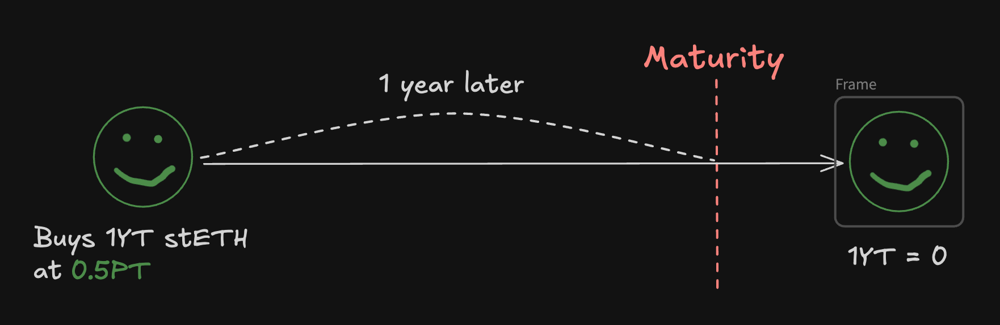

_Важно!_ Можно получить собранную доходность с токена `YT` в любой момент времени, даже до наступления времени погашения (maturity).

## OrderBook

Пользователи могут создавать лимитные ордера на покупку или продажу. Особенность лимитного ордера заключается в том, что исполнен он будет при достижение заданного Implied APY.

Ордербук работает в связке с AMM, но любые свопы в первую очередь исполняют лимитные ордер и только во вторую очередь переходят к исполнениям на AMM. Однако ордербук опционален, то есть протокол может работать на одном AMM.

Согласно документации у Pendle существует арбитражный бот, который выравнивает цены между AMM и ордербуком. Это гарантирует, что любые расхождения в ценах из-за разницы в ликвидности (между AMM и ордербук) будут быстро исправлены.

Работают ордера по гибридной схеме: создаются и хранятся off-chain, исполняются on-chain.

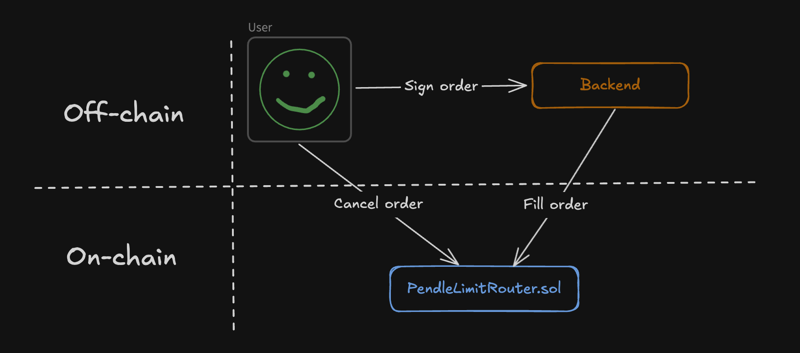

Для создания ордера пользователь подписывает структуру данных с полями, описывающими ордер и передает ордер на бекенд. Исполнение ордера будет происходить на смарт-контракте [PendleLimitRouter.sol](https://github.com/pendle-finance/pendle-core-v2-public/blob/main/contracts/limit/PendleLimitRouter.sol).

Стоит отметить, что создание ордера не требует от пользователя совершать транзакцию, но для отмены созданного ордера транзакцию сделать необходимо. Смарт-контракт должен знать, что подпись данная пользователем бекенду больше не актуальна.

[Документация](https://api-v2.pendle.finance/limit-order/docs#/Maker/MakersController_generateLimitOrderData) для  работы с API лимитных ордеров.

## ERC-5115: SY Token

Для реализации `SY` токена протокол разработал и предложил собственный стандарт [ERC-5115: SY Token](https://eips.ethereum.org/EIPS/eip-5115), который описывает расширение ERC-20 с необходимыми функциями для создания обертки (deposit, withdraw и так далее).

Основная мотивация создания стандарта заключается в том, что [ERC-4626 Tokenized Vault](https://eips.ethereum.org/EIPS/eip-4626) не покрывал все типы доходных токенов. Например, нативные reward-токены (COMP, CRV и другие) или LP токены AMM, которые измеряется в "единицах ликвидности", а не в базовых токенах.

Поэтому со своей стороны ERC-5115 предложил расширить ERC-4626, чтобы поддерживать любые yield-механизмы. Для этого стандарт разделяет понятия "входного токена" (токена для начала получения доходности) и "базового актива" (с которого доход будет получен).

Таким образом SY-токены стандарта могут оборачивать ERC-4626, добавляя им недостающую функциональность.

## Обзор архитектуры смарт-контрактов

В этом разделе будут рассмотрены смарт-контракты на верхнем уровне. Глубоких деталей реализации не будет, поэтому доступно для чтения всем.

### Репозитории

Стоит отметить, что на момент написания статьи у протокола две версии. Для двух версий смарт-контрактов у протокола три репозитория:
- [Первая версия](https://github.com/pendle-finance/pendle-core).
- [Вторая версия](https://github.com/pendle-finance/pendle-core-v2-public).
- [Standardized Yield (SY)](https://github.com/pendle-finance/Pendle-SY-Public/tree/main).

Первая версия устаревшая, но нам она может быть интересна с точки зрения смарт-контрактов, которые были задеплоены давно и не менялись. К таким смарт-контрактам относится токен протокола [PENDLE](https://github.com/pendle-finance/pendle-core/blob/master/contracts/tokens/PENDLE.sol).

Вторая версия протокола, она же core функционал, отвечает за несколько фичей:
- Токенизация (реализации токенов [PT](https://github.com/pendle-finance/pendle-core-v2-public/blob/main/contracts/core/YieldContracts/PendlePrincipalToken.sol) и [YT](https://github.com/pendle-finance/pendle-core-v2-public/blob/main/contracts/core/YieldContracts/PendleYieldToken.sol)).
- AMM (три контракта: [фабрика](https://github.com/pendle-finance/pendle-core-v2-public/blob/main/contracts/core/Market/v3/PendleMarketFactoryV3.sol), [маркет](https://github.com/pendle-finance/pendle-core-v2-public/blob/main/contracts/core/Market/v3/PendleMarketV3.sol) и [математика AMM](https://github.com/pendle-finance/pendle-core-v2-public/blob/main/contracts/core/Market/MarketMathCore.sol)).
- Маршрутизация (смарт-контракт [роутера](https://github.com/pendle-finance/pendle-core-v2-public/blob/main/contracts/router/PendleRouterV4.sol) и различных вспомогательных контрактов).
- И несколько других, включая оракул, исполнение лимитных ордеров, распределение вознаграждения.

Смарт-контракты для оборачивания токена находятся в отдельном репозитории. Основной функционал обертки находится в абстрактном смарт-контракте [SYBase.sol](https://github.com/pendle-finance/Pendle-SY-Public/blob/main/contracts/core/StandardizedYield/SYBase.sol).

## Flow вызова смарт-контрактов

Не смотря на то, что смарт-контракты распределены по разным репозиториям, в большинстве случаев для пользователя есть одна основная точка входа - это группа смарт-контрактов отвечающих за маршрутизацию (на схеме `Router`).

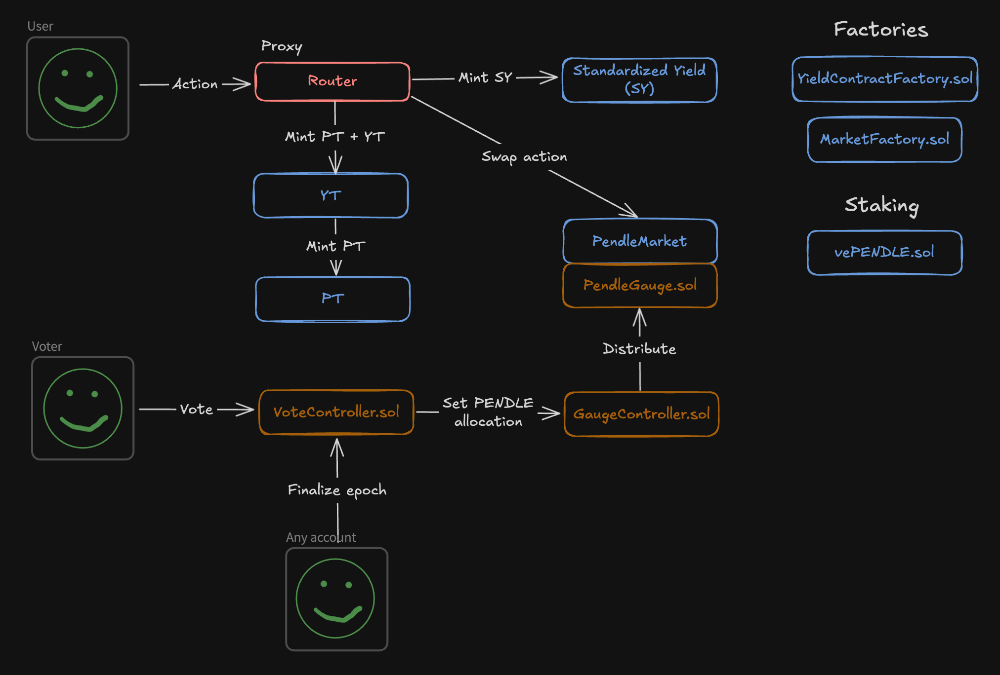

**Router**

Последняя версия смарт-контракта роутера является прокси смарт-контрактом и основная его задача делегировать вызов к нужным смарт-контрактам. При необходимости роутер комбинирует вызовы.

Для создания обертки вокруг базового актива вызов будет отправлен на смарт-контракт `SY`, для токенизации на `YT` (`YT` сам перенаправит вызов на `PT`), для свопа на `PendleMarket`.

Реализация роутера находится в смарт-контракте [PendleRouterV4.sol](https://github.com/pendle-finance/pendle-core-v2-public/blob/main/contracts/router/PendleRouterV4.sol). На схеме ниже посмотрим, как работает делегирование вызова.

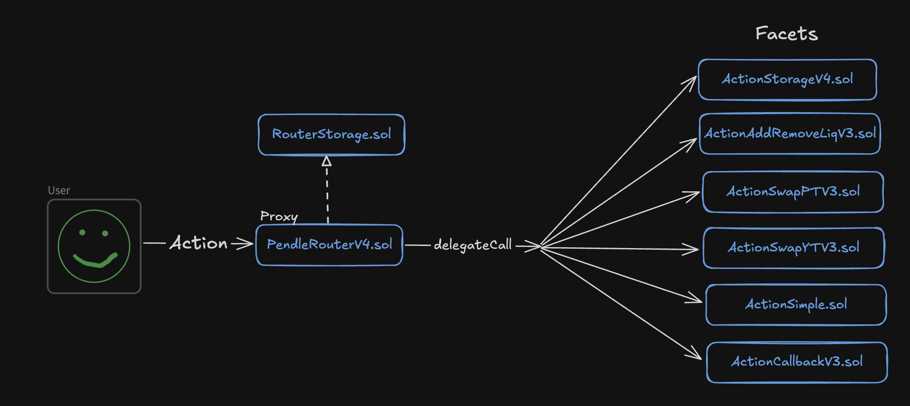

PendleRouterV4 наследуется от смарт-контракта [RouterStorage.sol](https://github.com/pendle-finance/pendle-core-v2-public/blob/main/contracts/router/RouterStorage.sol) и стандартного смарт-контракта от OpenZeppelin [Proxy.sol](https://github.com/OpenZeppelin/openzeppelin-contracts/blob/v4.9.5/contracts/proxy/Proxy.sol).

`RouterStorage.sol` хранит список смарт-контрактов на которые прокси может делегировать вызовы. В зависимости от типа вызова, вызов делегируется на смарт-контракт работы с ликвидностью, свопа и так далее ([ActionAddRemoveLiqV3.sol](https://github.com/pendle-finance/pendle-core-v2-public/blob/main/contracts/router/ActionAddRemoveLiqV3.sol), [ActionSwapPTV3.sol](https://github.com/pendle-finance/pendle-core-v2-public/blob/main/contracts/router/ActionSwapPTV3.sol) и другие).

**SY токен**

**SY** — это обернутая версия доходного токена. Напоминаю, токен торгуется на `PendleMarket` в паре с `PT`.

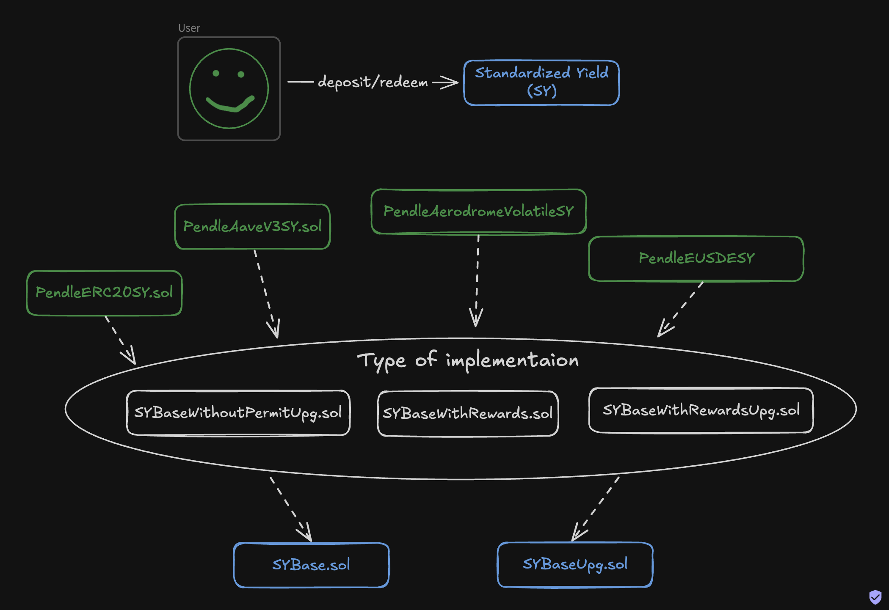

С точки зрения обертки здесь мало чего интересного. Базовый актив блокируется на смарт-контракте обертки с вызовом функции [deposit()](https://github.com/pendle-finance/Pendle-SY-Public/blob/main/contracts/core/StandardizedYield/SYBase.sol#L38) и разблокируется обратно с вызовом функции [redeem()](https://github.com/pendle-finance/Pendle-SY-Public/blob/main/contracts/core/StandardizedYield/SYBase.sol#L59).

Однако когда дело доходит до конкретного доходного токена, то есть нюансы. Стоит посмотреть сколько разных [имплементаций](https://github.com/pendle-finance/Pendle-SY-Public/tree/main/contracts/core/StandardizedYield/implementations) `SY` существует (PendleAaveV3SY, PendleAerodromeVolatile и так далее). Складывается ощущение, что сколько есть токенов, столько существует и модификаций.

Да, имплементации несложные, но у каждого есть свою нюанс. Одни доходные токены приносят доход за счет механизма ребейза, другие за счет механизма вознаграждения и так далее. Для каждого `SY` должна быть реализована [функция](https://github.com/pendle-finance/Pendle-SY-Public/blob/main/contracts/core/StandardizedYield/SYBase.sol#L107), которая будет рассчитывать **exchangeRate**, регламентирующего сколько `SY` будет получено при депозите.

Например, токен `SY` для AaveV3 будет работать, как отображено на схеме ниже.

Именно поэтому и существует несколько базовых смарт-контрактов (SYBase, SYBaseWithRewards). Однако основная базова логика находится в смарт-контракте [SYBase.sol](https://github.com/pendle-finance/Pendle-SY-Public/blob/main/contracts/core/StandardizedYield/SYBase.sol).

_Важно!_ Обратите внимание, существуют обертки с механизмом [upgradeable](https://github.com/pendle-finance/Pendle-SY-Public/blob/main/contracts/core/StandardizedYield/SYBaseUpg.sol).

**PendleMarket**

Или просто маркет — это смарт-контракт, который представляет собой пул пары токенов `PT` и `SY`. Комиссия за своп уходит напрямую поставщикам ликвидности. Каждый маркет имеет свой собственный встроенный оракул, аналогично UniswapV3.

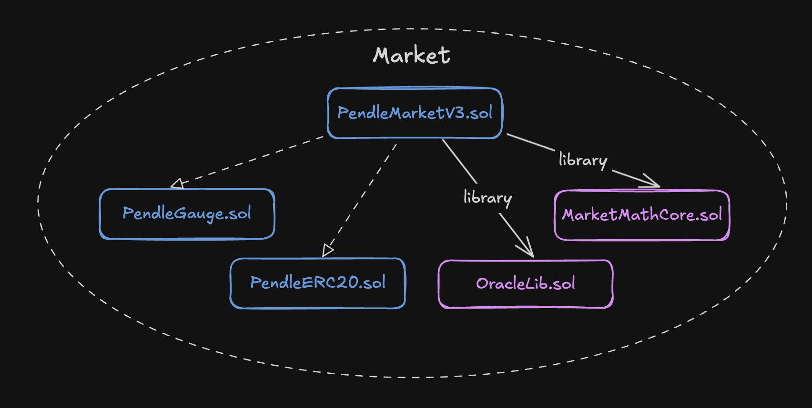

Версий реализаций маркета уже было несколько. Последняя третья версия находится в смарт-контракте [PendleMarketV3.sol](https://github.com/pendle-finance/pendle-core-v2-public/blob/main/contracts/core/Market/v3/PendleMarketV3.sol).

Смарт-контракт маркета наследуется от двух других смарт-контрактов:
- [PendleERC20.sol](https://github.com/pendle-finance/pendle-core-v2-public/blob/main/contracts/core/erc20/PendleERC20.sol). Реализует LP токен для поставщиков ликвидности, которые вкладывают в пул `SY` и `PT` токены.
- [PendleGauge.sol](https://github.com/pendle-finance/pendle-core-v2-public/blob/main/contracts/core/Market/PendleGauge.sol). Смарт-контракт, который распределяет PENDLE и другие вознаграждения, сгенерированные `SY`, среди держателей Market LP.

Основная математика пула (логика AMM) реализована в отдельной библиотеки [MarketMathCore.sol](https://github.com/pendle-finance/pendle-core-v2-public/blob/main/contracts/core/Market/MarketMathCore.sol). Сюда входит добавление/удаление ликвидности и свап одного актива на другой. Все по классике AMM!

**VotingController** и **GaugeController**

**VotingController** — это [смарт-контракт](https://github.com/pendle-finance/pendle-core-v2-public/blob/main/contracts/LiquidityMining/VotingController/PendleVotingControllerUpg.sol), который позволяет держателям vePENDLE в голосованиии за маркеты. Предварительно vePENDLE можно получить путем стейкинга основного токена протокола PENDLE на смарт-контракте [VotingEscrowPendleMainchain.sol](https://github.com/pendle-finance/pendle-core-v2-public/blob/main/contracts/LiquidityMining/VotingEscrow/VotingEscrowPendleMainchain.sol) для мейннет и [VotingEscrowPendleSidechain.sol](https://github.com/pendle-finance/pendle-core-v2-public/blob/main/contracts/LiquidityMining/VotingEscrow/VotingEscrowPendleSidechain.sol) для сайдчейн.

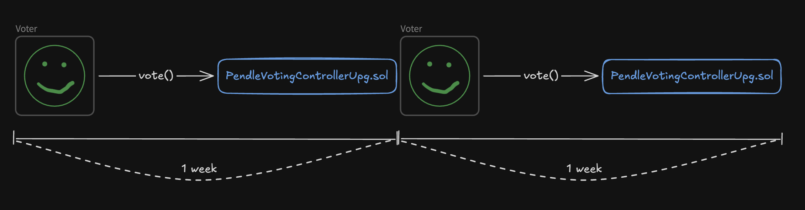

Процесс голосования определяет количество PENDLE, которое получит каждый рынок в следующую эпоху. Каждая эпоха длится ровно одну неделю, начиная с 0:00 UTC в четверг. В течение эпохи можно изменить свой голос, так как голосование станет окончательным только по окончании эпохи.

**GaugeController** — это смарт-контракт, который получает результаты голосования от VotingController и распределяет PENDLE среди gauges разных маркетов (помним, что gauge встроен внутрь каждого маркета). Есть две версии для [мейннет](https://github.com/pendle-finance/pendle-core-v2-public/blob/main/contracts/LiquidityMining/GaugeController/PendleGaugeControllerMainchainUpg.sol) и [сайдчейна](https://github.com/pendle-finance/pendle-core-v2-public/blob/main/contracts/LiquidityMining/GaugeController/PendleGaugeControllerSidechainUpg.sol).

Две версии для мейннет и сайдчейна нужны потому, что голосование происходит только в сети мейннет. Результаты голосования доставляются в сеть через кроссчейн сообшения, которые реализованы на базе LayerZero.

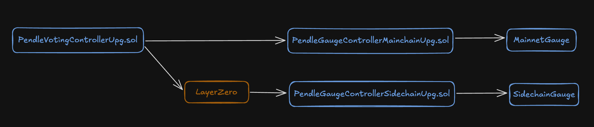

_Важно!_ Баланс vePENDLE у пользователя будет уменьшаться еженедельно, пока не станет нулевым по истечении срока действия, аналогично [модели](https://resources.curve.finance/vecrv/overview/) veCRV у Curve. Это модель заимствована многими протоколами.

## Комиссии

Протокол имеет два источника дохода:

- **YT Fees.** Pendle взимает комиссию (до 5%) с доходности `YT`. Точный размер определяется голосованием владельцев vePENDLE. Плюс комиссия взимается с поинтов (YT Fees on Points), которые работают off-chain в качестве вознаграждения пользователей и тоже считаются доходом.
- **Swap Fees**. Pendle взимает комиссию со всех свопов `PT`. Размер комиссии определяется тем, кто разворачивает пул, то есть создает пару токенов. Чем ближе наступление периода погашения `PT` (maturity), тем ниже комиссии.

Собранные комиссии собираются на отдельные кошельки и позже отправляются владельцам токена vePENDLE. Протокол ничего не оставляет себе, но имеет возможность изменить это в будущем.

## Вывод

Секрет протокола Pendle прост - возьми все что уже хорошо работает, скомбинируй и популярность найдет тебя сама!

**Что я имею ввиду?**

- Идея токенизации, как у Yearn.
- AMM, как у Notional с базой Uniswap.
- vePENDLE, как veCRV у Curve.
- Обмен сообщениями между сетями. Использован [LayerZero](https://layerzero.network/).
- Разделение актива на доходность и основную стоимость, как в традиционных финансах на рынке облигаций.

Все эти концепты многократно обкатаны различными протоколами и доказали свою состоятельность. В свою очередь, Pendle систематизировал различный опыт в области токенизации и унифицировал стандарт токенизации (ERC-5115: SY Token).

Благодаря новому стандарту удалось расширить список доходных токенов, а благодаря AMM нивелировать непостоянные потери для поставщиков ликвидности, которые преследуют их при предоставлении ликвидности.

_Вкусно!_ Смарт-контракты Pendle под лицензией GPL-3.0-or-later. Это означает, что разрешено личное и коммерческое использование, модификация кодовой базы и построение новых продуктов поверх. Важно понимать, что использованный код должен оставаться публичным.

Также можно развернуть новый токен Standardized Yield (SY) без одобрения команды Pendle. Чтобы внедрить токен `SY`, необходимо следовать стандарту Pendle `SY` Token, обеспечивая совместимость с экосистемой.

Бекенд протокола открыт для интеграций (Restful API, Pendle Hosted SDK).

Однако протокол не является полностью безрисковым. Ликвидность в пулах Pendle подвержена риску изменения доходности базового актива. Например, если APY stETH упадет, спрос на `YT` снизится, и цена `PT` может не достичь номинала (соотношения обмена 1:1) ко времени погашения.

## Links

1. [Официальная документация](https://docs.pendle.finance/Home).
2. [Yield Tokenization Protocols, How They're Made: Pendle](https://mixbytes.io/blog/yield-tokenization-protocols-how-they-re-made-pendle) от MixBytes().
3. [Репозиторий core-v2](https://github.com/pendle-finance/pendle-core-v2-public/tree/main).
4. [Репозиторий](https://github.com/pendle-finance/Pendle-SY-Public/tree/main) для `SY` токена.
