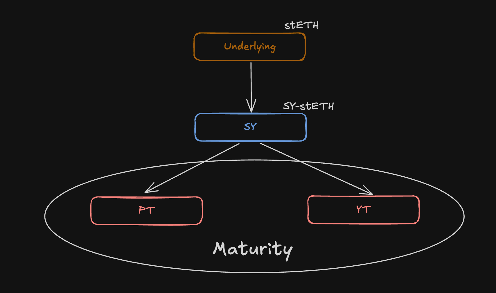
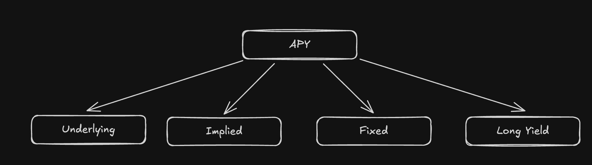
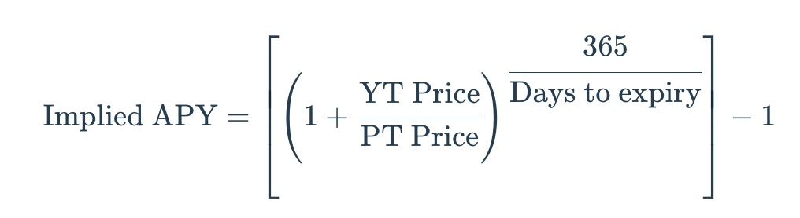

# Pendle

**Автор:** [Павел Найданов](https://github.com/PavelNaydanov) 🕵️‍♂️

[Pendle](https://www.pendle.finance/) - это протокол доходности c элементами трейдинга (yield-trading protocol).

Есть три ключевые штуки, которые характеризуют протокол:

1. Обертка токенов, которые приносят доходность.
2. AMM для торговли обернутыми токенами.
3. vePENDLE.

**Обертка токенов**

Pendle оборачивает токены, приносящие доход (yield-bearing token). Примерами таких токенов могут быть любые токены генерирующие доходность: stETH, GLP, gDAI и так далее.

Протокол вводит аббревиатуру SY (standardized yield tokens) для обертки. Например, SY-stETH - это обертка для stETH. Или stETH выступает базовым токеном для обертки SY-stETH.

SY - это не просто токен, как WETH, он разбивается на две части:
- PT (principal token). Представляет эквивалент базового токена.
- YT (yield token). Представляет доходность базового токена.

Процесс разделения SY на два токен называется токенизацией доходности, где доходность токенизируется в отдельный токен.

C PT и YT связан еще один термин - **Maturity**. Это срок погашения, когда YT перестает приносить доходность, а PT может быть полностью обменян на базовый актив 1:1. То есть, после того, как базовый токен оборачивается в SY (с разделением на PT и YT) полностью получить обратно базовый токен можно только после наступления даты (Maturity).

**AMM**

Обе части обернутого токена PT и YT могут торговаться на специальной площадке протокола под названием Pendle AMM.

AMM является ключевым функционалом протокола.

**vePENDLE**

// TODO: я так понимаю это по типу Curve

## Типы APY

Внутри протокола можно столкнуться с разными типами APY. Всего их четыре вида и нужно понимать, что каждый из них описывает, чтобы не попасть в заблуждение.

**Underlying APY**

Представляет собой 7-ми дневную скользящую средней доходности базового актива.

**Implied APY**

Рыночная стоимость базового актива, рассчитанная на основании стоимости YT и PT.

**Fixed APY**

Гарантированная доходность, которую можно получить при удержании PT. Это значение численно эквивалентно Implied APY за все время.

**Long Yield APY**

Приблизительная годовая доходность от покупки YT по текущей цене, при условии, что базовая годовая процентная доходность остается постоянной на текущей стоимости.

## ERC-5115: SY Token

Для реализации SY токена протокол разработал и предложил собственный [стандарт](https://eips.ethereum.org/EIPS/eip-5115).

## Вывод

## Links

1. [Документация](https://docs.pendle.finance/Home)