# Polymarket

**Автор:** [Павел Найданов](https://github.com/PavelNaydanov) 🕵️‍♂️

**Polymarket** — это один из крупнейших и самых популярных рынков предсказаний на блокчейне. Он позволяет голосовать за результат различных событий: спорт, политика, культура и так далее.

Для хранения активов пользователей используются некастодиальные кошельки. Это означает, что протокол не хранит приватные ключи пользователей и не может получить доступ к их активам.

## Proxy wallets

Когда пользователь впервые использует Polymarket, ему необходимо создать внутренний кошелек. У него есть два варианта:
- Использовать свой существующий EOA-аккаунт. Поддерживаются Metamask, Coinbase и WalletConnect.
- Использовать электронную почту для технологии под названием [Magic Link](https://medium.com/@email_36494/magic-links-2149f31f1a56). Вводите почту и получаете на нее специальную ссылку, по которой можно воспользоваться сервисом.

Кошелек создается через специальную фабрику смарт-контрактов и представляет собой мультисиг со схемой 1/1, что означает, что он полностью управляется пользователем.

Использование внутренних кошельков позволяет Polymarket обеспечить лучший пользовательский опыт, например, отправку нескольких транзакций за раз.

## Рынок прогнозов

Рынок прогнозов начинается с предсказания. Предсказание является основой, вокруг которой строятся пользовательские сценарии. В контексте рынков прогнозов такое утверждение называется **condition**. Это может быть вопрос, утверждение, описание ожидаемого результата, событие, предсказание и так далее. Мы можем рассматривать это как любую форму высказывания, претендующую на истинность в будущем.

Примеры предсказаний:
>
> 1. В сентябре произойдет землетрясение в 7 баллов.
> 2. GPT-5 выйдет в релиз в 2024?
> 3. Ребенок Бибера: мальчик или девочка?
> 4. Самый кассовый фильм в 2024?
> 5. Ethereum достигнет отметки в $10k в 2024?

Каждое предсказание имеет дедлайн для проверки: исполнилось предсказание или нет. За определение результата предсказания в Polymarket отвечает специальный оракул.

**При чем тут оракул?** Polymarket построен с использованием блокчейн-технологии, и для передачи данных в сеть используется оракул. Оракул спроектирован таким образом, что можно доверять его результатам по любому предсказанию.

Зачастую предсказание имеет несколько исходов (outcomes). Именно среди этих исходов оракул будет определять результат предсказания.

Пример предсказаний с исходами:
>
> GPT-5 выйдет в релиз в 2024?
> - Да
> - Нет
>
> Самый кассовый фильм в 2024?
> - Inside Out 2
> - Other
> - Deadpool 3
> - Joker 2
> - Despicable Me 4
> - Dune: Part 2
> - Furiosa: A Mad Max Saga

Типовой рынок прогнозов можно описать при помощи следующей схемы:

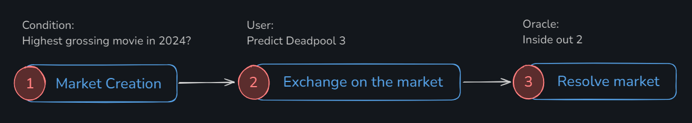

На первом этапе создается рынок, и добавляется новое предсказание (condition) с установленным временем жизни. В течение этого времени пользователи могут выбирать один из исходов, который им кажется наиболее вероятным. На последнем этапе оракул определяет, какая группа пользователей оказалась права, а какая ошиблась.

Пользователи, которые выбрали правильный вариант, получают **вознаграждение**. Это вознаграждение формируется из взносов всех участников. Каждый пользователь, голосуя за определённый исход, вносит некоторую сумму актива, используемого на рынке предсказаний. Соответственно, пользователи, которые ошиблись в выборе исхода, не получают ничего.

Здесь напрашивается вывод, что рынок прогнозов - это ставки. И да и нет. Ключевую идею рынков прогнозов продвигает Виталик в своем [блоге](https://vitalik.eth.limo/general/2021/02/18/election.html). Он считает, что подобные сервисы могут использоваться как нейтральные источники прогнозирования или анализа вероятности наступления различных событий. На основе этих данных можно принимать полноценные управленческие решения.

## На сколько точны прогнозы

В целом, идея о том, что рынок прогнозов может быть достаточно точным, подкрепляется [гипотезой эффективного рынка](https://en.wikipedia.org/wiki/Efficient-market_hypothesis). Согласно этой гипотезе, стоимость любого актива напрямую соответствует его реальной ценности, поскольку все доступные данные уже учтены в цене.

Простой пример:

> Предположим, что инвесторы знают рыночную стоимость товара. Они будут покупать этот товар, пока это выгодно. Постепенно спрос будет расти, и вместе с ним будет увеличиваться стоимость товара, пока его цена не достигнет уровня, при котором покупка перестанет быть выгодной.

Исследования показали, что рынки прогнозов в среднем значительно точнее социальных опросов и мнений экспертов. Точность таких рынков изучалась множеством [исследователей](https://en.wikipedia.org/wiki/Prediction_market#Accuracy) в различных областях, включая проверку теорий и лабораторных данных, здравоохранение и принятие управленческих решений.

Участники рынков прогнозов анализируют широкий спектр информации: новости, спорт, инновации, происшествия, тенденции развития, экологию, политику и многое другое. Их экономический стимул обеспечивает то, что их влияние на стоимость (или вероятность) рынка будет меняться с такой точностью, что это будет отражать истинность прогноза.

Поэтому рынки предсказаний считаются одним из лучших источников вероятностей наступления событий в реальном времени. Polymarket является одним из таких сервисов, который в последнее время привлекает все больше внимания.

## Polymarket. Как работает? Объяснение на пальцах

Для того чтобы понять, как работает сервис, давайте откроем первое попавшееся событие на [Polymarket](https://polymarket.com/) и разберём его интерфейс.

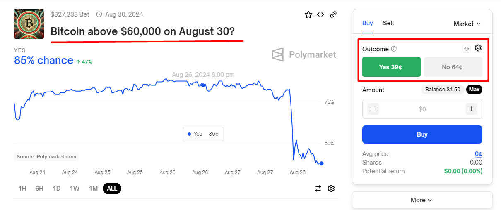

На скриншоте выделено название события *"Bitcoin above \$60,000 on August 30?"* и возможные исходы. В нашем случае исходов всего два: *"Yes"* и *"No"*. Однако важно помнить, что количество исходов может быть больше двух. Давайте взглянем на скриншот ниже для более детального понимания интерфейса.

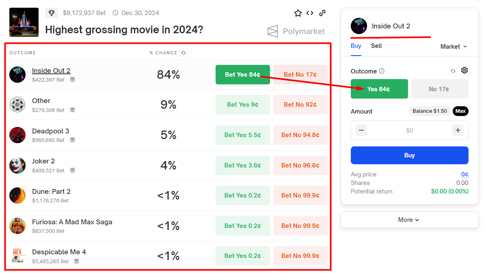

Множество исходов располагается сразу под названием события. На правой панели отображается самый популярный исход — тот, который в данный момент выбран большинством пользователей. Это позволяет быстро получить доступ к этому варианту исхода.

**Что означает кнопка Buy?**.

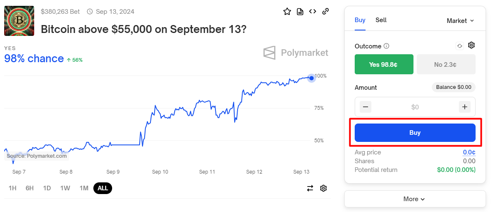

Под капотом каждый исход определяется специальным **share** токеном по стандарту ERC-1155. Кнопка **Buy** предназначена для покупки токенов выбранного исхода. В обмен пользователь платит базовый актив — USDC.

Процесс покупки можно рассматривать как голосование. Пользователи "голосуют" за один из исходов, подкрепляя свой голос реальными активами, что гарантирует ответственность голосующего при принятии решения. Процессу покупки соответствует обратный процесс продажи.

Каждое такое голосование определяет позицию пользователя по конкретному событию. Для процесса покупки можно использовать различные термины: "голос", "ставка", "позиция" или "голосование", "покупка". Каждый может выбрать термин, который ему ближе, но все они обозначают выражение пользовательского мнения по событию.

**Как понимать цену исходов?**

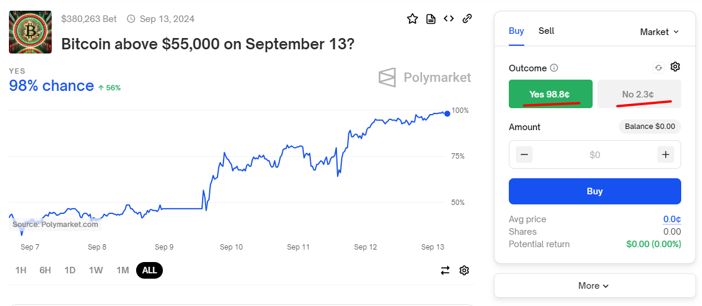

Цена в 98.8 центов за исход "Yes" означает, что вероятность того, что событие *"Bitcoin above \$55,000 on September 13?*" окажется верным, составляет 98\%. Соответственно, цена в 2.3 цента указывает на вероятность в 2\%, что биткоин будет стоить ниже \$55,000.

По сути, стоимость отражает вероятность наступления этого исхода. Чем выше стоимость, тем больше вероятность, что это событие произойдет, по мнению пользователей. Если пользователь считает, что шансы биткоина преодолеть отметку в \$55,000 реальны, он купит токены «Yes» по цене 98.8 центов за штуку.

Если пользователь окажется прав, и биткоин действительно превысит отметку в \$55,000, то каждый купленный токен "Yes" будет стоить \$1. Таким образом, пользователь получит прибыль в 1.2 цента за каждый купленный токен. В то же время любой пользователь, владеющий токенами "No", потеряет свои вложения, так как они станут бесполезными.

Стоит отметить, что пользователь не обязан держать свою позицию до конца: он может продать свои акции в любое время по текущей рыночной стоимости.

## Технический разбор

Далее будет разбор всех аспектов протокола с техническим уклоном. Пристегните ремни! 🤓

### Токенизация исходов

Мы определили, что все исходы событий на Polymarket токенизированы. Повторяемся, что мы уже знаем:
- Такие токены можно назвать **share** токенами
- **Share** токен покупается за базовый актив, поэтому share токены полностью обеспечены
- **Share** токен может быть продан обратно за базовый актив

А дальше пойдет новая информация. Share токены реализуют ERC-1155 на базе [Gnosis Conditional Tokens Framework (CTF)](https://github.com/gnosis/conditional-tokens-contracts), который доказал свою эффективность и был опробован несколькими протоколами.

Максимально CTF может поддерживать для каждого события до 256-и исходов.

Каждое предсказание идентифицируется в CTF. Для этого ему присваивается **conditionalId**. ConditionalId является уникальным за счет результата хеширования трех параметров:
- **oracle**. Адрес оракула, который будет рассчитывать результат события. Это гарантирует, что предсказание может быть рассчитано только указанным оракулом.
- **questionId**. Идентификатор предсказания, который задается создателем предсказания. Это может быть простой счетчик, где для каждого нового предсказания к значению прибавляется единица, или более сложная схема, использующая хеширование текста и других данных.
- **outcomeSlotCount**. Количество возможных исходов для предсказания.

На схеме ниже можно наглядно представить, как работает CTF (Conditional Token Framework).

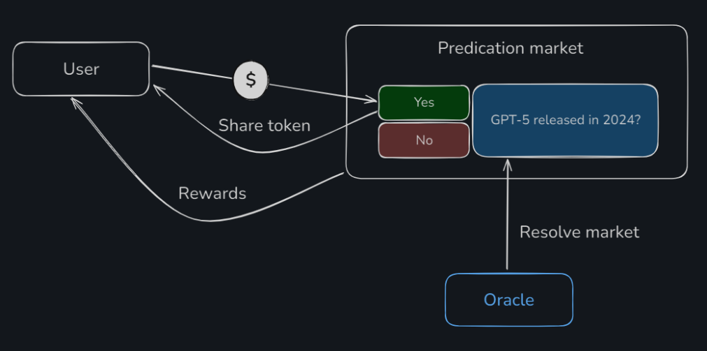

Пользователь передает базовый актив в момент, когда делает ставку, и получает **share** токен, который внутри CTF называется **conditional token**. После того как оракул рассчитает предсказание, пользователь сможет получить свое вознаграждение от CTF на основе результата предсказания.

Когда пользователь получил **conditional token**, считается, что он занял определённую позицию. В CTF позиции представляют собой набор возможных комбинаций исходов для каждого предсказания. CTF генерирует эти позиции для каждого предсказания, и каждая из них соответствует одной из всевозможных комбинаций исходов, которые может выбрать пользователь.

Например:

> Самый кассовый фильм в 2024?
> - Inside Out 2
> - Other
> - Deadpool 3
> - Joker 2
> - Despicable Me 4
> - Dune: Part 2
> - Furiosa: A Mad Max Saga
>
> Пользователь может проголосовать за то, что *"Inside Out 2"* станет самым кассовым фильмом, и за то, что *"Dune: Part 2"* точно не будет кассовым фильмом в 2024 году. Эта комбинация прогнозов и будет называться его позицией.

Для работы с позициями в CTF существуют два интересных механизма: **splitting** и **merging**. Механизм **splitting** позволяет разделять одну позицию на несколько отдельных исходов, а **merging** — объединять различные исходы в одну позицию. Эти механизмы дают пользователям гибкость в управлении своими позициями.

На мой взгляд, CTF дает Polymarket четыре важных преимущества:
- **Share токен** используется для подтверждения голоса пользователя за определённый исход предсказания.
- Реализует **гибкую систему** для комбинирования голосов пользователя в различные позиции.
- **Ответственность за расчет** события возлагается на CTF, основываясь на сигнале оракула.
- **Рассчитывает вознаграждение** в соответствии с долей share токена для выигравших исходов.

Особенно важно отметить, что CTF позволяет организовывать связанные события, в которых позиции пользователей могут быть объединены. Однако в Polymarket я не нашел подобных примеров.

Мне очень понравился концепт CTF, хотя он и достаточно сложен для моего понимания. Подробнее ознакомиться с ним можно в [официальной документации](https://docs.gnosis.io/conditionaltokens/docs/devguide01).

### Orders

Переходим к одной из самых загадочных вещей в Polymarket — ордера.

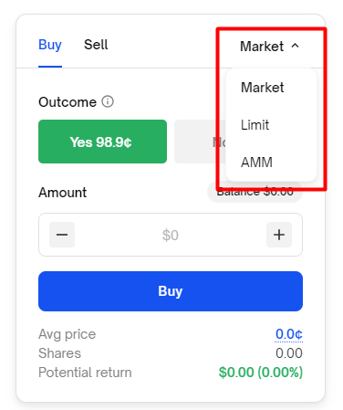

Для совершения покупки интерфейс Polymarket предоставляет три вида ордеров:

- **Market** — покупка по текущей рыночной стоимости, выполняемая немедленно.
- **Limit** — отложенные ордера, которые позволяют указать цену, при достижении которой будет совершена покупка.
- **AMM** — покупка по цене, которая определяется автоматически, как это делается в децентрализованных обменниках, на основе количества резервов в пуле.

На данный момент функция ордеров AMM, похоже, не работает. Я не смог найти событие, которое позволило бы сделать покупку через AMM. Прошерстив Discord протокола, я нашел относительно свежий комментарий одного из пользователей, который проливает свет на эту ситуацию. Смотри скриншот ниже.

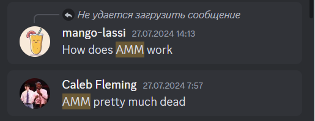

Согласно [документации](https://docs.polymarket.com/#fpmms) протокола, для AMM использовались смарт-контракты, разработанные в рамках [Conditional Token Framework](https://docs.gnosis.io/conditionaltokens/docs/introduction3). Таким образом, с помощью AMM формировалась цена покупки **share** токена.

Эта базовая механика требовала привлечения ликвидности для обеспечения стабильности ценообразования и снижения волатильности. Поставщики ликвидности должны иметь экономический стимул, получая вознаграждение с каждой совершённой покупки, чтобы поддерживать работу системы.

К сожалению, я знаком с Polymarket недавно, но предположу, что изначально протокол полностью запускался на CTF, а для ценообразования использовался AMM. Со временем протокол разработал гибридное решение с ордербуком, и два других типа ордеров (limit и market) стали работать на собственном решении. Это решение называется CLOB (Central Limit Order Book) или BLOB (Binary Limit Order Book).

### CLOB и BLOB

**CLOB** (Central Limit Order Book) или **BLOB** (Binary Limit Order Book) — это система, представляющая собой гибридно-децентрализованный ордербук. В этой системе специальный оператор занимается сопоставлением ордеров и инициирует их исполнение на смарт-контрактах.

Не вдаваясь в детали, систему можно описать следующим образом:

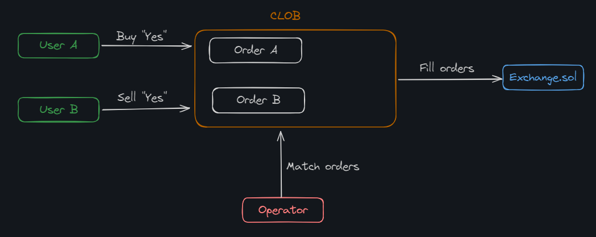

Пользователи создают ордера на исполнение, которые могут быть как лимитными, так и рыночными. Оператор сопоставляет ордера пользователей и инициирует исполнение этих ордеров на смарт-контрактах. Под созданием ордера подразумевается создание структуры данных, подписанной приватным ключом пользователя в соответствии со стандартом [EIP-712](https://eips.ethereum.org/EIPS/eip-712). Поскольку ордер хранится off-chain до момента его исполнения, это позволяет быстро и без дополнительных затрат изменять условия ордера или полностью его отменять.

А если углубиться в детали, то все, что касается ордербука и сопоставления ордеров, можно оценить только через [API](https://docs.polymarket.com/#api). Для удобства Polymarket предоставляет два клиента: для [JavaScript](https://github.com/Polymarket/clob-client) и [Python](https://github.com/Polymarket/py-clob-client).

А вот смарт-контракт [Exchange.sol](https://github.com/Polymarket/ctf-exchange/blob/main/src/exchange/CTFExchange.sol) является публичным и отвечает за создание позиции пользователя внутри CTF. Он также позволяет управлять позициями пользователей и перемещать активы между ними, обеспечивая безопасность и прозрачность операций внутри протокола.

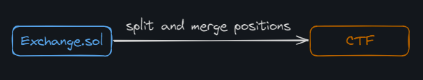

Смарт-контракт проходил аудит. [Отчет](https://github.com/Polymarket/ctf-exchange/blob/main/audit/ChainSecurity_Polymarket_Exchange_audit.pdf) этого аудита прикреплен в репозитории.

### Смарт-контракт

На самом деле, смарт-контракт `Exchange` имеет более расширенное название [CTFExchange.sol](https://github.com/Polymarket/ctf-exchange/blob/main/src/exchange/CTFExchange.sol). Сам по себе он не большой, имеет порядка 100 строчек кода, но при этом имеет весомый букет зависимостей.

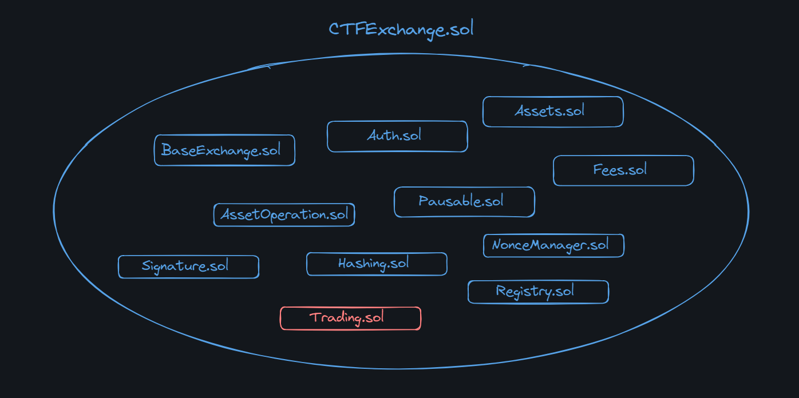

В основном это небольшие смарт-контракты, которые реализуют небольшой функционал:

- [BaseExchange.sol](https://github.com/Polymarket/ctf-exchange/blob/main/src/exchange/BaseExchange.sol). Абстрактный смарт-контракт, который реализует возможность принимать ERC-1155 токен. Также отвечает за защиту от reentrancy атаки.
- [Auth.sol](https://github.com/Polymarket/ctf-exchange/blob/main/src/exchange/mixins/Auth.sol). Менеджер ролей. Определяет функции проверки и модификаторы, которые настраивают роли: админа и оператора для `CTFExchange.sol`
- [Assets.sol](https://github.com/Polymarket/ctf-exchange/blob/main/src/exchange/mixins/Assets.sol). Определяет два актива: базовый актив (collateral) и адрес ctf.
- [Fees.sol](https://github.com/Polymarket/ctf-exchange/blob/main/src/exchange/mixins/Fees.sol). Определяет комиссию протокола
- [Pausable.sol](https://github.com/Polymarket/ctf-exchange/blob/main/src/exchange/mixins/Pausable.sol). Определяет возможность приостановить работу смарт-контрактов. Своего рода централизация на которую протокол соглашается на случай непредвиденных обстоятельств. Доступно только роли админа.
- [AssetOperation.sol](https://github.com/Polymarket/ctf-exchange/blob/main/src/exchange/mixins/AssetOperations.sol). Определяет операции для базового актива и ctf. Включает в себя трансфер, splitting и merging позиций.
- [Signature.sol](https://github.com/Polymarket/ctf-exchange/blob/main/src/exchange/mixins/Signatures.sol). Определяет код для валидации подписей пользователей, которые они дают при работе с ордерами
- [Hashing.sol](https://github.com/Polymarket/ctf-exchange/blob/main/src/exchange/mixins/Hashing.sol). определяет хеширование параметров ордера. Применяется для проверки подписи.
- [Registry.sol](https://github.com/Polymarket/ctf-exchange/blob/main/src/exchange/mixins/Registry.sol). Определяет процесс регистрации предсказания в системе, регистрацию токенов для предсказания.

_Важно!_ Все, что касается непосредственно исполнения ордеров, реализовано в смарт-контракте [Trading.sol](https://github.com/Polymarket/ctf-exchange/blob/main/src/exchange/mixins/Trading.sol).

Походить по коду и изучить смарт-контракт тоже несложно. Структура имеет четко выраженные точки входа через функции:
- [fillOrder()](https://github.com/Polymarket/ctf-exchange/blob/main/src/exchange/CTFExchange.sol#L61) — исполняет ордер между пользователем, который его создал, и мейкером (другим ордером), которого выбрал пользователь.
- [fillOrders()](https://github.com/Polymarket/ctf-exchange/blob/main/src/exchange/CTFExchange.sol#L68C14-L68C24) — то же самое, что и `fillOrder()`, только для списка ордеров.
- [matchOrders()](https://github.com/Polymarket/ctf-exchange/blob/main/src/exchange/CTFExchange.sol#L82) — оператор выбирает два разных ордера и исполняет их.

Все вышеописанные функции могут быть вызваны только **оператором**.

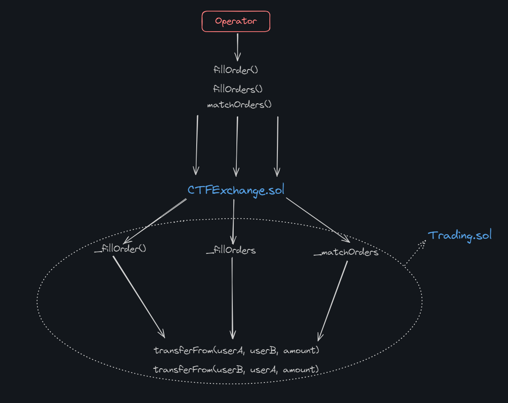

Как бы вызов не заходил в смарт-контракт, результат будет всегда один, два пользователя обменяются токенами, согласно их ордерам.

### Комиссия протокола

Комиссия взимается в активе, который является выходным. Для бинарных предсказаний комиссии симметричны, что означает: если пользователь продает токены по цене $0.99, он заплатит такую же комиссию, как и покупающий их по цене $0.01.

Формулы расчета простые и взяты из [документации](https://docs.polymarket.com/#fees).

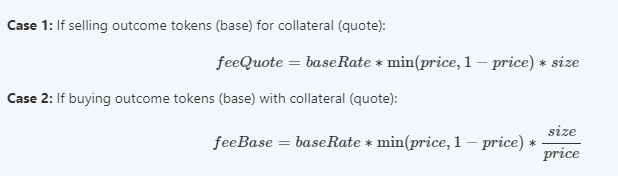

### Liquidity Rewards Program

Общая цель этой программы заключается в стимулировании ликвидности на рынке.

Мы знаем, что для работы обменника на базе ордербука необходимо, чтобы кто-то создавал лимитные ордера. Именно лимитные ордера обеспечивают ликвидность, благодаря которой можно исполнять рыночные ордера немедленно. Пользователей, создающих лимитные ордера, называют **market makers**. Чем "плотнее" лимитные ордера расположены к рыночной стоимости, тем быстрее и в большем объеме могут исполняться рыночные ордера, что, безусловно, является преимуществом для конечного пользователя. Более того, чем больше ликвидности, тем сложнее манипулировать рынком.

Для обеспечения достаточной ликвидности Polymarket разработал специальную программу вознаграждений, которая стимулирует пользователей создавать лимитные ордера.

Чем ближе лимитный ордер к средней рыночной цене, тем выше будет вознаграждение. Выплаты вознаграждений производятся автоматически каждый день в полночь по UTC.

Система сделана по аналогии с [dYdX](https://dydx.exchange/). Исходная программа dYdX описана [здесь](https://docs.dydx.community/governance-documentation/rewards/liquidity-provider-rewards). Оригинальная программа для Polymarket доступна [тут](https://docs.polymarket.com/#liquidity-rewards-program).

### Оракул

Оракул используется для того, чтобы выдавать результаты предсказаний — произошло ли событие или нет. Оракул является одной из важнейших составляющих протокола, однако реализован сторонним сервисом, а не командой Polymarket. Этот оракул называется — [UMA](https://uma.xyz/).

UMA — это децентрализованный оракул, который специализируется на записи любых данных в блокчейн, за исключением тех, которые невозможно проверить. Оракул считается **оптимистичным**, так как данные считаются верными, если они не оспорены. UMA имеет собственную арбитражную систему для разрешения споров, где арбитрами выступают реальные люди — участники экосистемы UMA, точнее держатели токенов UMA. Эта система называется **DVM** (Data Verification Mechanism).

Для определения результата предсказания и записи его в блокчейн используется следующий многоэтапный процесс:

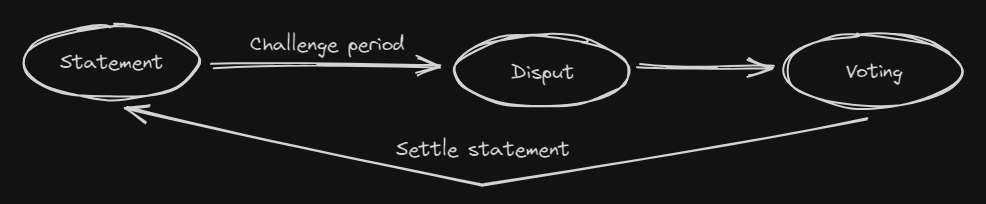

1. **Statement.** Предсказание добавляется в оракул вместе с наградой. Награду может получить тот, кто успешно оспорит результат предсказания.
2. **Challenge period.** В течение этого периода любой может оспорить результат предсказания. Если оспаривания не происходит и время истекает, результат предсказания считается готовым к окончательной фиксации, что означает его достоверность.
3. **Dispute.** Любой участник протокола может оспорить результат с целью получения награды или в интересах справедливости (шутка, конечно). На практике это происходит редко, так как, по теории игр, большинство участников ведут себя честно.
4. **Voting.** Если спор начался, держатели токена UMA голосуют для разрешения спора. UMA — это токен протокола, который используется для голосования, и за участие в нем участники получают вознаграждение.
5. **Settle.** Последний этап — процесс settle, или фактическая фиксация данных в блокчейне. После этого результат предсказания можно считать гарантированно верным.

Весь протокол держится на хорошо продуманной теории игр, где каждому участнику протокола экономически не выгодно думать о злонамеренных действиях.

Примеры:

> 1. Участник, который выносит результат предсказания на голосование передает смарт-контрактам в залог актив. В случае, если его результат будет оспорен, он потеряет залог, иначе вернет залог и получит вознаграждение. Есть выраженный стимул предоставлять только достоверный результат.
> 2. Участник, который оспорит результат предсказания, тоже внесет залог. В случае, если он окажется прав, он заберет залог и получит вознаграждение, иначе потеряет его. Есть стимул оспаривать только те результаты, в которых он уверен, что они неверны.
> 3. Участники, которые разрешают споры. Они должны застейкать токен UMA и будут получать вознаграждение за разрешение споров. Если они голосуют неправильно или вовсе не голосуют, они теряют часть своего застейканного баланса, иначе получают вознаграждение. Филонить не получится.

Особенно стоит отметить, что процесс голосования в споре происходит в два этапа по схеме **commit/reveal**:

1. **Commit.** Участники голосуют в закрытую, передавая на смарт-контракты хеш своего голоса. Это означает, что никто не может понять, как участник проголосовал, просто по хешу.
2. **Reveal.** После завершения фазы голосования, участники раскрывают свои голоса. Смарт-контракт проверяет, соответствуют ли они ранее переданным хешам.

Голосование в два этапа исключает возможность сговора между голосующими для дискредитации оракула или атаки на сервисы, которые используют результаты предсказаний.

Оспорить результат предсказания можно несколько раз. В таких случаях UMA позволяет инициировать процесс принятия решения повторно после окончания предыдущего спора.

Так выглядит процесс открытия споров:

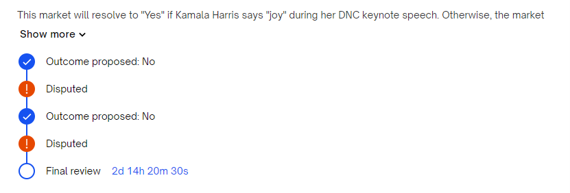

## Вывод

Казалось бы, простая система ставок и прогнозов включает три крупных модуля, разработанных разными протоколами и командами:

- **CTF** (Conditional Token Framework): Управляет комбинаторикой, отображением позиций и долей пользователей в предсказаниях. Огромное спасибо Gnosis за разработку такого гибкого фреймворка, идеально подходящего для рынка предсказаний.
- **CLOB** (Central Limit Order Book): Собственная разработка Polymarket для реализации ордербука и лимитных ордеров. CLOB позволяет пользователям эффективно участвовать в экосистеме и помогает агрегировать ликвидность.
- **UMA**: Децентрализованный оракул с уникальной арбитражной системой для разрешения споров. UMA — это действительно сердце всей системы, которая через блокчейн передает результаты предсказаний.

Эту систему можно рассматривать как систему ставок, однако, когда я начал разбираться в Polymarket, я не ожидал, что придется разделить изучение на три разных протокола и потратить столько времени. Технически этот протокол действительно велик и интересен, удачно объединяя разработки и технологии разных проектов, что делает его особенно привлекательным для разработчиков.

**Мое финальное мнение**: я действительно хочу рассматривать этот протокол как нечто полезное, как это преподносит Виталик Бутерин. Пусть он станет инструментом для прогнозирования, принятия решений и анализа. Однако, несмотря на это, пока протокол особенно вспоминается в связи с выборами, когда спрос на предсказания стремительно возрастает.

## Links

1. [Welcome to Polymarket](https://learn.polymarket.com/)
2. Gnosis Conditional Tokens Framework. [Getting Started](https://docs.gnosis.io/conditionaltokens/docs/devguide01/)
3. [Prediction Markets: Tales from the Election](https://vitalik.eth.limo/general/2021/02/18/election.html)
4. Очень простенько об [Outcome Tokens](https://mirror.xyz/polymarket.eth/txFHoXVU1QAsXCZQj6H_ag3kXv1QTcnbLVI8cL9CFYg) в блоге polymarket
5. [An In-Depth Overview of Polymarket's Market Making Rewards Program](https://mirror.xyz/polymarket.eth/TOHA3ir5R76bO1vjTrKQclS9k8Dygma53OIzHztJSjk)
6. [UMA protocol](https://uma.xyz/)
