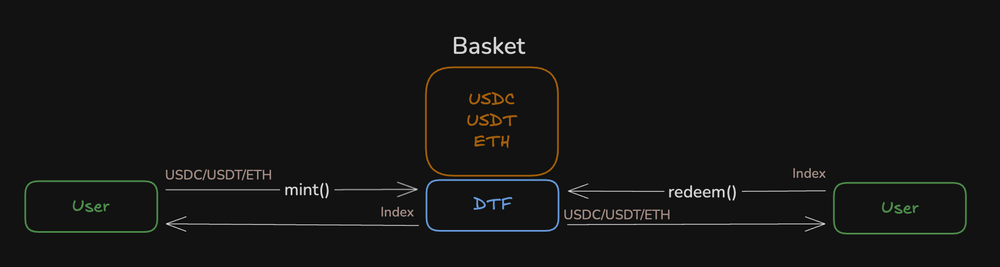
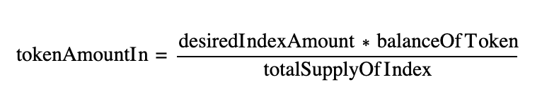
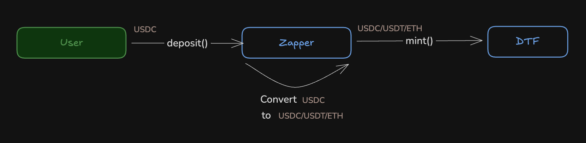
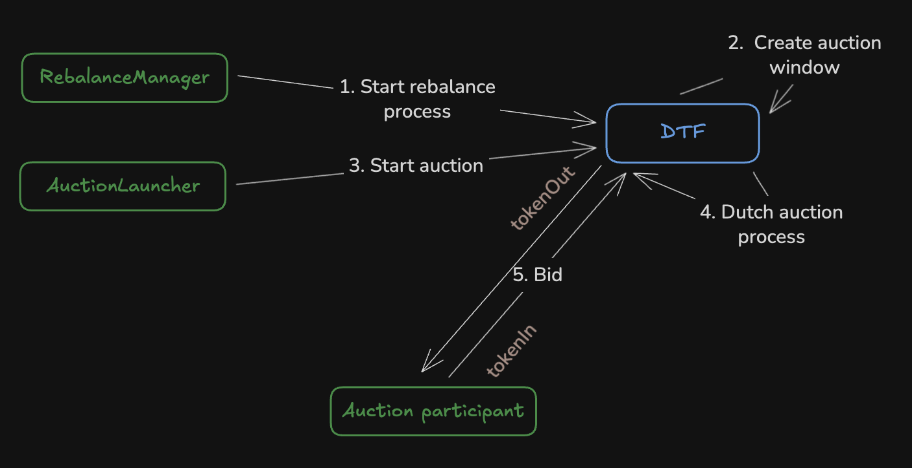
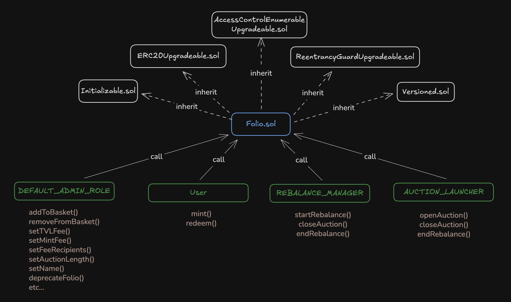
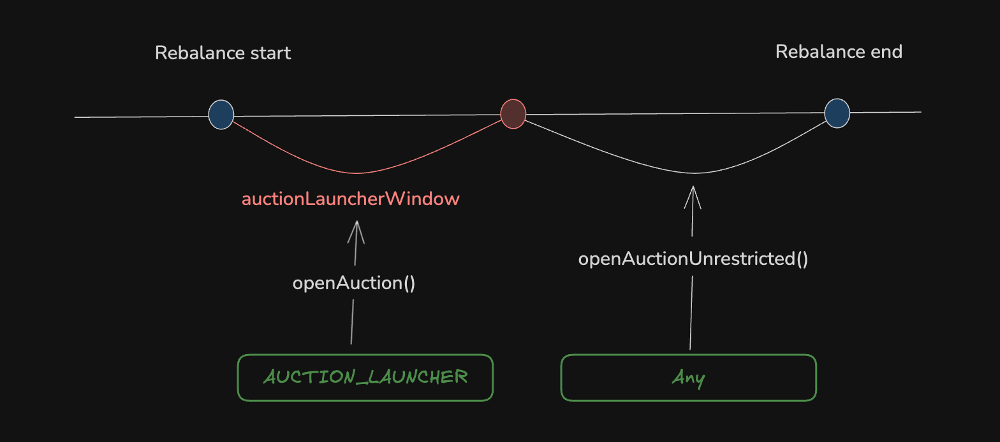
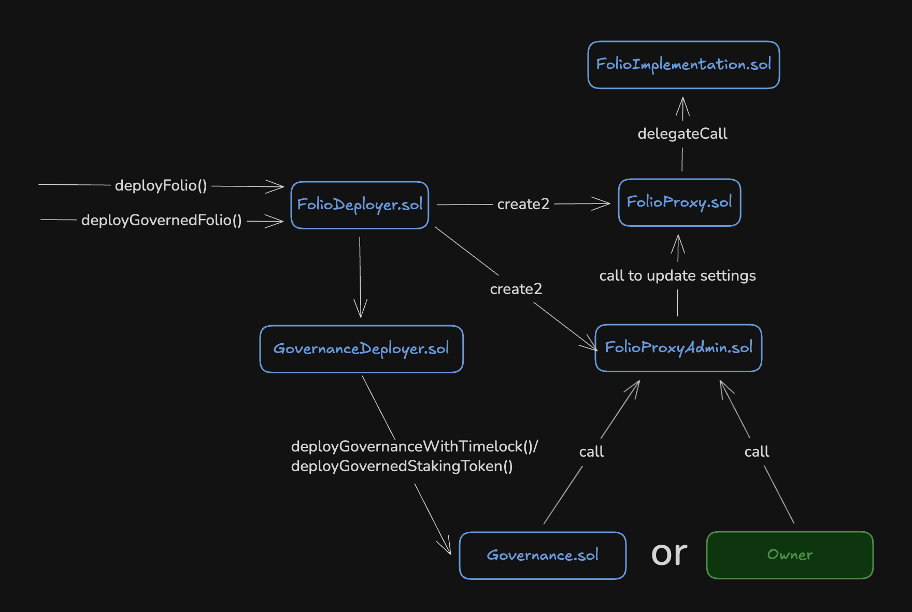

# Reserve finance

**Автор:** [Павел Найданов](https://github.com/PavelNaydanov) 🕵️‍♂️

**[Reserve](https://reserve.org/)** - протокол для запуска и управления синтетическим активом, обеспеченным 1:1 набором других цифровых активов. В контексте протокола, такой синтетический актив называется индексом, а его реализация - DTF.

**DTF (Decentralized Token Folio)** - это набор смарт-контрактов, которые реализуют синтетический актив в виде ERC-20 токена для Ethereum и L2 блокчейнов. DTF предназначен для реализации разных продуктов — от стейблкоина до инвестиционного портфеля.

По задумке, протокол аналогичен централизованным ETF-фондам, но работает полностью on-chain.

## Ключевые компоненты

Reserve поддерживает два основных типа индексов: Yield DTF и Index DTF, которые используются в различных стратегиях.

**Yield DTF**

Позволяют автономно управлять доходными активами (stETH, cUSDC, aUSDC и т.д), распределяя доход в соответствии с правилами, определёнными системой управления.

**Index DTF**

Позволяет управлять набором активов (ETH, WBNB, AVAX и т.д.), используя от нескольких до сотен токенов. Легкий дизайн устраняет необходимость сложного управления обеспечением, позволяя создавать крупные, прозрачные индексы с децентрализованным управлением.

**Маркетинг так описывает преимущества Index DTF:**
- 10+ активов на Ethereum и 100+ активов на блокчейне Base.
- Поддерживается практически любой ERC-20 токен, оракул не нужен.
- Неограниченный доступ: любой может создавать токен индекса или минтить существующий индекс.
- Гибкое управление: любой ERC-20 токен может быть токеном управления. По дефолту используется токен RSR от Reserve.
- Автоматическая ребалансировка, реализованная через аукционы.

| Свойство  | Yield DTF (RTokens)         | Index DTF           |
| --------- | --------------------------- | ------------------- |
| Цель      | Yield-bearing активы        | Диверсификация      |
| Активы    | stETH, aUSDC, LST           | Любые ERC20         |
| Revenue   | Auto-harvest + auctions     | Mint/TVL fees       |
| Сложность | Высокая (множество plugins) | Низкая (1 контракт) |

Index DTF оптимизирован для пассивной диверсификации портфеля с обычными токенами, а Yield DTF на механизмы сбора дохода (harvest mechanisms).

В этой статье мы рассмотрим детально **Index DTF**. Это более свежее, лаконичное решение для того, чтобы понимать, как устроены подобного рода протоколы.

## Minting and redemption

Мы определили, что Index DTF реализуется при помощи смарт-контрактов. Эти смарт-контракты полностью совместимы с ERC-20 интерфейсом. Поэтому индекс имеет следующий базовый функционал: трансфер, минтинг, сжигание.

Для пользователя, в контексте индекса, **Minting and redemption** - два основных процесса, которые позволяют конвертировать активы пользователя в индекс и обратно.



Каждый индекс определяет набор активов для обеспечения, которые пользователь должен предоставить в обмен на токен индекса. На скриншоте набор состоит из трех активов: USDC, USDT, ETH.

Для обратного обмена пользователь передает индекс и получает активы из набора.

**По какому курсу будет происходить обмен?**

Для расчета курса используется формула, которая считает количество каждого токена для списания с пользователя при минтинге:



Это формула применяется для каждого списываемого с пользователя токена обеспечения. Желаемое количество токена индекса умножается на баланс токена, залоченного внутри протокола и делится на общее количество токена индекса.

_Важно!_ Точно такая же формула применяется для **redemption**, чтобы посчитать сумму токена обеспечения, которая будет выплачена пользователю в обмен на токен индекса.

Эта формула поддерживает курс обмена и сохраняет пропорции каждого токена обеспечения относительно друг друга в наборе. Эти пропорции задаются создателем индекса при его инициализации. Для этого создатель передает токены в смарт-контракт в нужных пропорциях и обозначает параметр **базовой единицы корзины**.

**Базовая единица корзины**

Базовая единица корзины ({BU} - basket units) описывает сколько токенов обеспечения необходимо внести для минтинга 1-го токена индекса.

Если базовая единица корзины описывается, как {100 USDC, 150 USDT, 0.1 ETH}, то легко высчитать, сколько нужно активов обеспечения для получения 2-x, 10-x и так далее токенов индекса.

|Количество индекса|Количество USDC|Количество USDT|Количество ETH|
|-|-|-|-|
|1 INDEX|100 USDC|150 USDT|0.1 ETH|
|2 INDEX|200 USDC|300 USDT|0.2 ETH|
|...|...|...|...|
|10 INDEX|1000 USDC|1500 USDT|1 ETH|
|...|...|...|...|

**Как посчитать доли токенов обеспечения в корзине?**

На смарт-контрактах доли каждого токена устанавливаются при инициализации создателем индекса и дальше только сохраняются пропорции.

Однако в интерфейсе необходимо показывать процентное соотношение токенов обеспечения в корзине. Но как это делать, если все токены разные?

Для этого протокол определяет еще один параметр **Unit of Account** (UoA), который обозначает в какой единице будут сравниваться все активы внутри протокола.

Для корзины {100 USDC, 150 USDT, 0.1 ETH} удобным UoA может быть USD. Тогда USDC и USDT имеют привязку 1:1 к USD. А для ETH нужно будет получить его курс в USD.

Предположим, что 1 ETH = 3000 USD. Тогда, мы можем посчитать пропорции на основе базовой единицы корзины. 100 USD (100 USDC) + 150 USD (150 USDT) + 300 USD (0.1 ETH) = 550 USD. Значения взяли из таблицы выше.

Теперь можно посчитать пропорции токенов корзины.
||Количество токена|Количество в USD|Доля токена в %|
|-|-|-|-|
|USDC|100|100| ≈ 18.2%|
|USDT|150|150| ≈ 27.3%|
|ETH|0.1|300| ≈ 54.5%|

При этом, мы выбрали в качестве обозначения UoA доллары, но никто не мешает нам сделать тоже самое в другой валюте, например ETH, BTC или даже не криптовалюте.

**Zapper**

У Reserve индексы могут быть обеспечены большим количеством токенов и это достаточно неудобно для пользователя. Необходимо готовить необходимую сумму по каждому токену из корзины индекса.

Для улучшения этого процесса Reserve предлагает собственное решение под названием **Zapper**, которое реализует депозит пользователя для минта токена индекса в одном единственном токене. Под капотом, протокол выполнит преобразование полученного от пользователя токена в набор токенов корзины.



_Важно!_ На момент написания статьи, ручной режим, где пользователь самостоятельно вносит каждый актив корзины, все еще возможен.

## Ребалансировка

**Ребалансировка активов** — это основная функция протокола. Задача заключается в изменение пропорции токенов обеспечения, которые находятся в корзине индекса.

Например, в корзине находятся (USDC, USDT, ETH) в пропорциях (30%, 20%, 50%). Классическая задача ребалансировки заключается в уменьшении количества USDC и наращивания доли ETH в корзине. Например, до пропорций (15%, 20%, 65%).

Технически, ребалансировка реализована через голландский аукцион.
Это аукцион с понижением цены, когда на старте устанавливается максимальная цена за обмен токена. Например, если нужно уменьшить долю USDC и увеличить долю ETH, аукцион определяет, сколько USDC можно получить за 1 ETH.

Запуск этого процесса требует участия двух ролей:
- **Менеджер ребалансировки.** Это или governance смарт-контракт или установленный адрес при инициализации индекса
- **Запускающий аукцион.** Установленный при инициализации адрес



1. Менеджер запускает процесс ребалансировки, указывая список токенов корзины, лимиты покупки/продажи токена и другие настройки. Этот вызов может проводиться через голосование.
2. Создается окно аукциона для каждой пары токенов, которые требуют корректировки.
3. Запускающий аукцион инициирует запуск голландского аукциона.
4. Запускается голландский аукцион прямо на смарт-контракте индекса, то есть аукцион имеет прямой доступ к токенам индекса и его действия ограничиваются настройками ребалансировки.
5. Участники аукциона выкупают актив, количество которого нужно уменьшить, предоставляя актив, который нужно увеличить. Когда цель аукциона выполняется или срок его действия истекает, аукцион закрывается.

## Архитектура Index DTF

В этом разделе будем разбирать архитектуру смарт-контрактов **Index DTF** на базе [репозитория](https://github.com/reserve-protocol/reserve-index-dtf/tree/main).

**Точка входа**

Начать изучать смарт-контракты легко, у протокола всего одна точка входа. Смарт-контракт [Folio.sol](https://github.com/reserve-protocol/reserve-index-dtf/blob/main/contracts/Folio.sol), который реализует основную логику индекса:
- Реализация корзины.
- Хранение токенов обеспечения.
- Минтинг и сжигание токена индекса.

Характеристики смарт-контракта `Folio.sol`:
- Смарт-контракт обновляемый и версионируется при помощи собственного решения.
- Совместим с ERC-20. Для этого наследуется от ERC-20 из OpenZeppelin.
- Наследуется от AccessControl от OpenZeppelin для реализации разделения доступа к функционалу по ролям.
- Использует классическую защиту от reentrance от OpenZeppelin.

На схеме ниже определен список смарт-контрактов от которых наследуется `Folio.sol` для реализации описанных характеристик и акторы, которые могут взаимодействовать с ним.



Акторы, которые могут взаимодействовать со смарт-контрактом, определены 4-мя зелеными боксами:
1. **Default admin:** Может обновлять токены в корзине, устанавливать настройки (от комиссий до названия), остановить работу индекса навсегда и некоторые другие возможности.
2. **User:** Любой пользователь может выпустить себе токен индекса и обменять индекс на токены обеспечения обратно в любой момент времени. Никакие паузы и заморозки не предусмотрены.
3. **Rebalance manager:** Может инициировать процесс ребалансировки, закрыть аукцион и закрыть процесс ребалансировки токенов в корзине.
4. **Auction launcher:** Может открыть аукцион, закрыть аукцион и остановить процесс ребалансировки. Последнее на мой взгляд не логично с точки зрения разделения ролей, но это не уязвимость, такой дизайн.

_Важно!_ Если индекс будет "задепрекейчен" владельцем, это не помешает пользователям обменять токены индекса на свои вложенные активы (вызвать функцию `redeem()`). Обмен будет по тому курсу, который определят пропорции токенов в корзине на момент закрытия индекса.

**Корзина**

Теперь мы готовы посмотреть, как устроена [корзина токенов обеспечения](https://github.com/reserve-protocol/reserve-index-dtf/blob/main/contracts/Folio.sol#L118).

```solidity
EnumerableSet.AddressSet private basket;
```

Как мы видим, корзина - это "set" от библиотеки OpenZeppelin, которая хранит адреса токенов обеспечения. Это позволяет исключить повторения токенов в корзине. Взаимодействие с корзиной простое:

```solidity
// Получить список адресов токенов
basket.values();

// Добавить адрес токена в корзину
basket.add(token);

// Удалить адрес токена из корзины
basket.remove(token);
```

Мы можем встретить работу с корзиной в разных частях смарт-контракта `Folio.sol`.

Например, функции: [addToBasket()](https://github.com/reserve-protocol/reserve-index-dtf/blob/main/contracts/Folio.sol#L266) и [removeFromBasket()](https://github.com/reserve-protocol/reserve-index-dtf/blob/main/contracts/Folio.sol#L271), которые находятся под управлением `defaultAdmin`.

Ниже мы посмотрим на функцию добавления токена в корзину.
```solidity
  function addToBasket(IERC20 token) external nonReentrant onlyRole(DEFAULT_ADMIN_ROLE) {
      require(_addToBasket(address(token)), Folio__BasketModificationFailed());
  }

  function _addToBasket(address token) internal returns (bool) {
    // Исключает возможность добавить в корзину токен индекса или нулевой токен
    require(token != address(0) && token != address(this), Folio__InvalidAsset());
    emit BasketTokenAdded(token);

    return basket.add(token);
}
```

Из интересного здесь - это то, что токен самого индекса ( `address(this)`) никогда не сможет быть добавлен в корзину. То есть, индекс никогда не будет обеспечивать себя сам. Это важное техническое ограничение.

Теперь мы посмотрим на часть функции удаления токена из корзины.

```solidity
    function removeFromBasket(IERC20 token) external nonReentrant {
        ...

        // Удалить токен из корзины всегда может defaultAdmin или любой пользователь, если баланс токена и его вес равняются 0
        require(
            hasRole(DEFAULT_ADMIN_ROLE, msg.sender) ||
            (
              rebalance.details[address(token)].weights.spot == 0
              && IERC20(token).balanceOf(address(this)) == 0
            ),
            Folio__BalanceNotRemovable()
        );
        require(_removeFromBasket(address(token)), Folio__BasketModificationFailed());
    }

    function _removeFromBasket(address token) internal returns (bool) {
        emit BasketTokenRemoved(token);

        delete rebalance.details[token];

        return basket.remove(token);
    }
```

Интересный факт про удаление токена из корзины. `defaultAdmin` может заблокировать токены обеспечения внутри смарт-контракта `Folio.sol`, если удалит токен из корзины.

В таком случае, при обмене токена индекса на токены обеспечения, пользователь не дополучит этот токен. В этом случае для пользователя надежнее, когда индексом управляет **governance** и **timeLock**. Это даст время, на то, чтобы успеть принять меры и сделать обмен до удаления токена из корзины.

Также протокол сам отмечает в коде, что удаление токена любым пользователем может быть недоступно, если кто-то отправит немного удаляемого токена на смарт-контракт `Folio.sol`. В этом случае только `defaultAdmin` может удалить токен из корзины, но если `defaultAdmin` - это **governance**, то сначала придется проголосовать за это удаление и подождать **timeLock**.

**Minting**

Функция [mint()](https://github.com/reserve-protocol/reserve-index-dtf/blob/main/contracts/Folio.sol#L386C1-L433C6) выдает токен индекса любому пользователю, который предоставит обеспечение. Главное, чтобы это было не в процессе реентранси и дефолт админ не закрыл индекс.

```solidity
function mint(
    uint256 shares,
    address receiver,
    uint256 minSharesOut
) external nonReentrant notDeprecated sync returns (address[] memory _assets, uint256[] memory _amounts) {
    // Здесь рассчитываются комиссии
    ...
    uint256 totalFeeShares = ...

    // От ожидаемого количества токена индекса отнять рассчитанные комиссии
    uint256 sharesOut = shares - totalFeeShares;

    // Защита от проскальзывания после изъятия комиссии
    require(sharesOut != 0 && sharesOut >= minSharesOut, Folio__InsufficientSharesOut());

    // Рассчитать сумму каждого токена обеспечения для списания его с пользователя
    (_assets, _amounts) = _toAssets(shares, Math.Rounding.Ceil);

    // Списать рассчитанную долю каждого токена обеспечения с пользователя
    uint256 assetLength = _assets.length;
    for (uint256 i; i < assetLength; i++) {
        if (_amounts[i] != 0) {
            SafeERC20.safeTransferFrom(IERC20(_assets[i]), msg.sender, address(this), _amounts[i]);
        }
    }

    // Выдать токен индекса пользователю
    _mint(receiver, sharesOut);

    // Записать информацию о комиссии для DAO
    daoPendingFeeShares += daoFeeShares;
    // Записать информацию о  комиссии для получателей индекса, которые установлены при инициализации
    feeRecipientsPendingFeeShares += totalFeeShares - daoFeeShares;
}
```

На базе того, сколько пользователь хочет получить токена индекса, код рассчитает суммы каждого токена обеспечения и спишет их с пользователя в процессе вызова.

Интересно здесь то, что пользователь получит токен индекса за вычетом комиссии, которая не будет сразу отправлена получателям (dao и другим).

Для того, чтобы распределить комиссии, нужно будет отдельно вызвать функцию [distributeFees()](https://github.com/reserve-protocol/reserve-index-dtf/blob/main/contracts/Folio.sol#L478C1-L508C6), которая создаст накопленное количество токена индекса для адресов получателей комиссии.

**Redemption**

Функция [redeem()](https://github.com/reserve-protocol/reserve-index-dtf/blob/main/contracts/Folio.sol#L439C5-L465C6) выдает пользователю токены обеспечения в обмен на токен индекса. Единственное ограничение в том, что это должно быть выполнено не в процессе реентранси вызова.

```solidity
function redeem(
    uint256 shares,
    address receiver,
    address[] calldata assets,
    uint256[] calldata minAmountsOut
) external nonReentrant sync returns (uint256[] memory _amounts) {
    address[] memory _assets;
    // Рассчитать сумму каждого токена обеспечения для выдачи его пользователю
    (_assets, _amounts) = _toAssets(shares, Math.Rounding.Floor);

    // Сжечь токен индекса у вызывающего функцию пользователя
    _burn(msg.sender, shares);

    // Проверяем, что пользователь правильно обозначил минимальную сумму получения по каждому токену корзины
    uint256 len = _assets.length;
    require(len == assets.length && len == minAmountsOut.length, Folio__InvalidArrayLengths());

    for (uint256 i; i < len; i++) {
        require(_assets[i] == assets[i], Folio__InvalidAsset());
        // Защита от проскальзывания
        require(_amounts[i] >= minAmountsOut[i], Folio__InvalidAssetAmount(_assets[i]));

        // Выдача каждого токена пользователю
        if (_amounts[i] != 0) {
            SafeERC20.safeTransfer(IERC20(_assets[i]), receiver, _amounts[i]);
        }
    }
}
```

Функция погашения токена индекса простая и не вызывает вопросов. Главное здесь то, что она доступна для вызова всегда. Это означает, что пользователь всегда может обменять токен индекса для получения своих токенов обеспечения.

**Ребалансировка и аукцион**

Мы объединяем процесс ребалансировки и аукциона потому что это два шага одного неразъединимого процесса. Порядок вызова выглядит следующим образом:


Начинается процесс ребалансировки с того, что менеджер ребалансировки стартует процесс через вызов функции [startRebalance()](https://github.com/reserve-protocol/reserve-index-dtf/blob/main/contracts/Folio.sol#L589C1-L610C6).

```solidity
function startRebalance(
    TokenRebalanceParams[] calldata tokens,
    RebalanceLimits calldata limits,
    uint256 auctionLauncherWindow,
    uint256 ttl
) external onlyRole(REBALANCE_MANAGER) nonReentrant notDeprecated sync {
    RebalancingLib.startRebalance(
        basket.values(),
        rebalanceControl,
        rebalance,
        tokens,
        limits,
        auctionLauncherWindow,
        ttl,
        bidsEnabled
    );

    // Добавить новые токены в корзину
    for (uint256 i; i < tokens.length; i++) {
        _addToBasket(tokens[i].token);
    }
}
```

Здесь важно то, что новые токены добавятся в корзину, только если переданный в функцию `startRebalance()` адрес будет уникальным. Вся остальная логика спрятана в библиотеке [RebalancingLib.sol](https://github.com/reserve-protocol/reserve-index-dtf/blob/main/contracts/utils/RebalancingLib.sol#L24).

Посмотрим на самые интересные моменты.

```solidity
function startRebalance(
    address[] calldata oldTokens,
    IFolio.RebalanceControl storage rebalanceControl,
    IFolio.Rebalance storage rebalance, // Информация о ребалансе будет записана здесь
    IFolio.TokenRebalanceParams[] calldata tokens,
    IFolio.RebalanceLimits calldata limits,
    uint256 auctionLauncherWindow,
    uint256 ttl,
    bool bidsEnabled
) external {
    ...

    // Проверяем, что ttl время жизни ребалансировки находится в допусках
    require(ttl != 0 && ttl >= auctionLauncherWindow && ttl <= MAX_TTL, IFolio.Folio__InvalidTTL());

    ...

    uint256 len = tokens.length;
    require(len > 1, IFolio.Folio__EmptyRebalance());

    // Сохраняем информацию по каждому токену, который будет участвовать в ребалансировке
    for (uint256 i; i < len; i++) {
        IFolio.TokenRebalanceParams calldata params = tokens[i];

        // Проверяем различные параметры по токену: устанавливаемая стоимость, адрес, дубликаты, тип ребалансировки (по фиксированному весу в корзине или нет)

        ...

        rebalance.details[params.token] = IFolio.RebalanceDetails({
            inRebalance: true,
            weights: params.weight,
            initialPrices: params.price,
            maxAuctionSize: params.maxAuctionSize
        });
    }

    // Сохраняем информацию о процессе ребалансировке
    rebalance.nonce++;
    rebalance.limits = limits;
    rebalance.startedAt = block.timestamp;
    rebalance.restrictedUntil = block.timestamp + auctionLauncherWindow;
    rebalance.availableUntil = block.timestamp + ttl;
    rebalance.priceControl = rebalanceControl.priceControl;
    rebalance.bidsEnabled = bidsEnabled;

    emit IFolio.RebalanceStarted(
        rebalance.nonce,
        rebalance.priceControl,
        tokens,
        limits,
        block.timestamp,
        block.timestamp + auctionLauncherWindow,
        block.timestamp + ttl,
        bidsEnabled
    );
}
```

Что здесь интересно:
1. ttl (Time-To-Live) должен быть больше, чем окно аукциона (auctionLauncherWindow), но при этом ttl ограничивается максимум 4-мя неделями.
2. Можно запускать несколько аукционов в рамках ttl или не запускать вообще, если auctionLauncherWindow указать 0.
3. В моменте может быть запущен только один процесс ребалансировки.

**auctionLauncherWindow** - может быть равен 0. Когда параметр не равен нулю, он делит процесс ребалансировки на два отрезка и влияет на тип аукциона, который можно запустить в будущем.



С момента начала ребалансировки, пока не кончится окно аукциона, аукцион может быть запущен только менеджером ребалансировки через вызов функции [openAuction()](https://github.com/reserve-protocol/reserve-index-dtf/blob/main/contracts/Folio.sol#L619).

После того, как окно аукциона закончилось, но условия ребалансировки не выполнены, аукцион может быть запущен любым аккаунтом через вызов функции [openAuctionUnrestricted()](https://github.com/reserve-protocol/reserve-index-dtf/blob/main/contracts/Folio.sol#L646C14-L646C37).

Как можно понять из названия аукцион будет запущен без каких-либо ограничений для выполнения ребалансировки. Важно, что для запуска "Unrestricted" аукциона всегда остается минимальное временное окно. Этого хватает, потому что аукцион **должен** начаться в рамках ребалансировки, но сам аукцион может продолжаться после окончания ребалансировки.

Логика открытия аукциона - создания записи о его начале в блокчейне тоже спрятана в библиотеку `RebalancingLib.sol` в функцию [openAuction()](https://github.com/reserve-protocol/reserve-index-dtf/blob/main/contracts/utils/RebalancingLib.sol#L122).

Ты можешь самостоятельно изучить, как происходит открытие аукциона, а мы переместимся к более интересной логике, которая отвечает за выкуп лота аукциона. Любой пользователь во время аукциона может вызвать функцию [bid()](https://github.com/reserve-protocol/reserve-index-dtf/blob/main/contracts/Folio.sol#L720C1-L739C6).

```solidity
function bid(
  uint256 auctionId,
  IERC20 sellToken,
  IERC20 buyToken,
  uint256 sellAmount,
  uint256 maxBuyAmount,
  bool withCallback,
  bytes calldata data
) external nonReentrant notDeprecated sync returns (uint256 boughtAmt) {
  require(rebalance.bidsEnabled, Folio__PermissionlessBidsDisabled());
  Auction storage auction = auctions[auctionId];

  // Получить сумму покупки
  (, boughtAmt, ) = _getBid(auction, sellToken, buyToken, sellAmount, sellAmount, maxBuyAmount);

  // Выполнить покупку и удалить продаваемый токен из корзины, если достигнута цель аукциона
  if (RebalancingLib.bid(auction, auctionId, sellToken, buyToken, sellAmount, boughtAmt, withCallback, data)) {
      _removeFromBasket(address(sellToken));
  }
}
```

Функция принимает токен покупки и токен продажи, а также сумму токена продажи. Здесь нужно понимать, что:
- **sellToken:** Это токен, который протокол продает, значит для вызывающего функцию `bid()` - это токен покупки.
- **buyToken:** Это токен, который протокол покупает, значит для вызывающего функцию `bid()` - это токен продажи.

Поэтому с пользователя будет списываться именно **buyToken** в рамках покупки лота аукциона.

Функция `bid()` прячет свою логику в библиотеку `RebalancingLib.sol`. Нас будет интересовать две функции: [getBid()](https://github.com/reserve-protocol/reserve-index-dtf/blob/main/contracts/utils/RebalancingLib.sol#L264) и [bid()](https://github.com/reserve-protocol/reserve-index-dtf/blob/main/contracts/utils/RebalancingLib.sol#L343C5-L343C18).

Посмотрим на эти функции ниже.

```solidity
function getBid(
    IFolio.Rebalance storage rebalance,
    IFolio.Auction storage auction,
    IERC20 sellToken,
    IERC20 buyToken,
    GetBidParams memory params
) external view returns (uint256 sellAmount, uint256 bidAmount, uint256 price) {
    assert(params.minSellAmount <= params.maxSellAmount);

    // Рассчитываем аукционную стоимость покупки
    price = _price(rebalance, auction, sellToken, buyToken);

    uint256 buyAvailable;
    {
        IFolio.RebalanceDetails memory buyDetails = rebalance.details[address(buyToken)];

        // Рассчитывается лимит покупки на основе минимального веса токена и общего лимита ребалансировки
        uint256 buyLimit = Math.mulDiv(rebalance.limits.low, buyDetails.weights.low, D18, Math.Rounding.Floor);

        // Рассчитывается сколько уже куплено
        uint256 buyLimitBal = Math.mulDiv(buyLimit, params.totalSupply, D27, Math.Rounding.Floor);
        buyAvailable = params.buyBal < buyLimitBal ? buyLimitBal - params.buyBal : 0;

        // Рассчитываем остаток токена доступного для покупки согласно аукциону
        uint256 buyRemaining = buyDetails.maxAuctionSize > auction.traded[address(buyToken)]
            ? buyDetails.maxAuctionSize - auction.traded[address(buyToken)]
            : 0;

        // Возвращаем минимально доступную сумму или оставшуюся
        buyAvailable = Math.min(buyAvailable, buyRemaining);

        ...
    }

    uint256 sellAvailable;
    {
        ...

        // На базе buyAvailable рассчитываем сколько токена возможно продать
        uint256 sellAvailableFromBuy = Math.mulDiv(buyAvailable, D27, price, Math.Rounding.Floor);
        sellAvailable = Math.min(sellAvailable, sellAvailableFromBuy);

        ...

        sellAvailable = Math.min(sellAvailable, sellRemaining);
    }

    ...

    // Итоговое количество токенов, которые можно купить
    bidAmount = Math.mulDiv(sellAmount, price, D27, Math.Rounding.Ceil);
    require(bidAmount <= params.maxBuyAmount, IFolio.Folio__SlippageExceeded());
}
```

По итогу `getBid()` определяет сколько токенов он может продать и купить, соблюдая все ограничения, такие как лимиты ребалансировки, доступные балансы и текущую цену. Стоит отметить, что цена формируется отдельно в функции [getPrice()](https://github.com/reserve-protocol/reserve-index-dtf/blob/main/contracts/utils/RebalancingLib.sol#L427) и согласно правилу голландского аукциона понижается с течением времени.

```solidity
function _price(
    IFolio.Rebalance storage rebalance,
    IFolio.Auction storage auction,
    IERC20 sellToken,
    IERC20 buyToken
) internal view returns (uint256 p) {
    IFolio.PriceRange memory sellPrices = auction.prices[address(sellToken)];
    IFolio.PriceRange memory buyPrices = auction.prices[address(buyToken)];

    ...

    uint256 elapsed = block.timestamp - auction.startTime;
    uint256 auctionLength = auction.endTime - auction.startTime;

    // Рассчитываем коэффициент скорости изменения цены
    uint256 k = MathLib.ln(Math.mulDiv(startPrice, D18, endPrice)) / auctionLength;

    // Рассчитываем текущую стоимость
    p = Math.mulDiv(startPrice, MathLib.exp(-1 * int256(k * elapsed)), D18, Math.Rounding.Ceil);
    if (p < endPrice) {
        p = endPrice;
    }
}
```

Интересно здесь то, что коэффициент k отвечает за скорость изменения цены (представлен натуральным логарифмом). Коэффициент зависит от начальной и конечной цены, а также от продолжительности аукциона. Чем больше разница между ценами и чем короче аукцион, тем выше скорость изменения цены.

Теперь остается посмотреть только на логику самого выкупа токена в функции [bid()](https://github.com/reserve-protocol/reserve-index-dtf/blob/main/contracts/utils/RebalancingLib.sol#L343).

```solidity
function bid(
    IFolio.Auction storage auction,
    uint256 auctionId,
    IERC20 sellToken,
    IERC20 buyToken,
    uint256 sellAmount,
    uint256 bidAmount,
    bool withCallback,
    bytes calldata data
) external returns (bool shouldRemoveFromBasket) {
    ...

    // Покупатель получает токен продажи
    SafeERC20.safeTransfer(sellToken, msg.sender, sellAmount);

    // Реализация обратного вызова при необходимости для списания токена покупки со смарт-контракта
    if (withCallback) {
        IBidderCallee(msg.sender).bidCallback(address(buyToken), bidAmount, data);
    } else {
        SafeERC20.safeTransferFrom(buyToken, msg.sender, address(this), bidAmount);
    }

    ...

    // Сохранение информации о том сколько было продано и куплено в рамках аукциона
    auction.traded[address(sellToken)] += sold;
    auction.traded[address(buyToken)] += bought;

    emit IFolio.AuctionBid(auctionId, address(sellToken), address(buyToken), sold, bought);

    // Вернуть true, если нужно будет удалить токен из корзины
    return sellBalAfter == 0;
}
```

Помимо простого выполнения движения токенов между вызывающим транзакцию и смарт-контрактом индекса мы можем заметить, что вызывающим может быть смарт-контракт, который оплатит покупку на аукционе. Однако смарт-контракт должен будет реализовать специальный интерфейс `IBidderCallee`.

Заканчивается процесс ребалансировки и аукционов тем, что истекло время или физически были вызваны функции [closeAuction()](https://github.com/reserve-protocol/reserve-index-dtf/blob/main/contracts/Folio.sol#L779) и [endRebalance()](https://github.com/reserve-protocol/reserve-index-dtf/blob/main/contracts/Folio.sol#L799).

Это очень простые функции:

```solidity
function closeAuction(uint256 auctionId) external nonReentrant {
  require(
      hasRole(DEFAULT_ADMIN_ROLE, msg.sender) ||
          hasRole(REBALANCE_MANAGER, msg.sender) ||
          hasRole(AUCTION_LAUNCHER, msg.sender),
      Folio__Unauthorized()
  );
  ...

  // Установить текущее время временем окончания аукциона
  auctions[auctionId].endTime = block.timestamp - 1;
}

function endRebalance() external nonReentrant {
    require(
        hasRole(DEFAULT_ADMIN_ROLE, msg.sender) ||
            hasRole(REBALANCE_MANAGER, msg.sender) ||
            hasRole(AUCTION_LAUNCHER, msg.sender),
        Folio__Unauthorized()
    );

    // Установить текущее время временем окончания ребалансировки
    rebalance.availableUntil = block.timestamp;
}
```

Таким образом мы рассмотрели самый значимый и самый сложный процесс протокола: ребалансировка и аукционы. У аукционов есть альтернативный способ выкупа лотов, через специально зарегистрированных "филлеров", которые реализуют интеграцию с CowDAO. Оставляю это в [качестве домашнего задания](https://github.com/reserve-protocol/reserve-index-dtf/blob/main/contracts/Folio.sol#L742C5-L773C6).

**Деплой и обновление индекса**

Деплой - это процесс, который развернет смарт-контракт индекса в блокчейне и подготовит его к работе. Для этого протокол реализовал отдельный смарт-контракт [FolioDeployer.sol](https://github.com/reserve-protocol/reserve-index-dtf/blob/main/contracts/deployer/FolioDeployer.sol).



Можно развернуть принципиально два разных индекса по типу управления: централизованно одним аккаунтом или через DAO. Смарт-контракты для DAO могут быть развернуты прямо в ходе деплоя или отдельно и просто переданы в качестве владельца.

Под капотом индекс будет развернут, как обновляемый смарт-контракт по типу `TransparentUpgradeableProxy`, но с некоторыми особенностями. Все настройки будут инициализированы в ходе выполнения вызова по деплою: от установления параметров индекса, до выдачи прав и назначения ролей. Взаимодействие с прокси для управления выполняется через смарт-контракт [FolioProxyAdmin.sol](https://github.com/reserve-protocol/reserve-index-dtf/blob/main/contracts/folio/FolioProxy.sol#L14).

Тот кто является владельцем `FolioProxyAdmin.sol` может выполнить обновление до новой имплементации, Однако, новая имплементация должна быть зарегистрирована внутри протокола и не должна быть устаревшей. Таким образом, протокол гарантирует, что обновление не может быть выполнено на имплементацию с уязвимостью или ошибкой.

Смотрим на функцию [upgradeToVersion()](https://github.com/reserve-protocol/reserve-index-dtf/blob/main/contracts/folio/FolioProxy.sol#L24C14-L24C30) в смарт-контракте `FolioProxyAdmin.sol`, которая это реализует.

```solidity
function upgradeToVersion(address proxyTarget, bytes32 versionHash, bytes memory data) external onlyOwner {
    IFolioVersionRegistry folioRegistry = IFolioVersionRegistry(versionRegistry);

    // Проверяем, чтобы версия была не запрещена
    require(!folioRegistry.isDeprecated(versionHash), VersionDeprecated());
    // Проверяем, чтобы версия была зарегистрирована
    require(address(folioRegistry.deployments(versionHash)) != address(0), InvalidVersion());

    address folioImpl = folioRegistry.getImplementationForVersion(versionHash);

    ITransparentUpgradeableProxy(proxyTarget).upgradeToAndCall(folioImpl, data);
}
```

## Governance и RSR

В этом разделе мы посмотрим на смарт-контракт [FolioGovernance.sol](https://github.com/reserve-protocol/reserve-index-dtf/blob/main/contracts/governance/FolioGovernor.sol), который Reserve предлагает из коробки. В целом это решение от OpenZeppelin, но имеется несколько отличий от классического governance:

1. Динамический **proposalThreshold**. В OpenZeppelin задаётся как фиксированное значение. В `FolioGovernor.sol` он вычисляется динамически на основе общего предложения токенов в момент времени:

    ```solidity
    function proposalThreshold()
        public
        view
        override(GovernorUpgradeable, GovernorSettingsUpgradeable)
        returns (uint256)
    {
        uint256 threshold = super.proposalThreshold();
        uint256 pastSupply = Math.max(1, token().getPastTotalSupply(clock() - 1));

        // Рассчитать порог предложения
        return (threshold * pastSupply + (1e18 - 1)) / 1e18;
    }
    ```
2. Динамический **quorum**. Используется `GovernorVotesQuorumFractionUpgradeable` для того, чтобы кворум вычислялся, как доля от общего предложения токенов на определённый момент времени.

    ```solidity
    function quorum(
        uint256 timepoint
    ) public view override(GovernorUpgradeable, GovernorVotesQuorumFractionUpgradeable) returns (uint256) {
        return super.quorum(timepoint);
    }
    ```
Есть еще несколько других отличий, но это скорее настройки системы голосования. Опустим их и двинемся дальше. Смарт-контракты Governance требуют токена для голосования.

Когда пользователь разворачивает индекс, он может выбрать DAO, как модель управления индексом и указать токен голосования для DAO. Можно указать собственный ERC-20 токен или токен протокола RSR.

**RSR - токен протокола**

**RSR** - это токен ERC-20, который необходим для управления в governance, управления рисками и использования внутри экосистемы.

RSR выполняет три основные функции:
- **Staking**: Стейкинг в Yield DTF в качестве предоставления капитала в обмен на доходность DTF.
- **Vote-locking on Index DTFs**: Голосование для Index DTF: RSR токен устанавливается по дефолту для управления Index DTF (изменения по корзине или обновление других параметров).
- **Deflationary sink**: Часть комиссий с каждого Index DTF используется для рыночной покупки RSR и его сжигания, таким образом, постепенно сокращается оборотное предложение.

## Fees & revenue

Комиссия - важная движущая сила для заинтересованных сторон в работе индекса.

Для Index DTF есть две явных комиссий, которые взимаются прямо с каждого смарт-контракта токена индекса:
1. **TVL fee** (management fee). Размер строго <10% APY (governance устанавливает, обычно 0.01-0.1% годовых)
2. **Mint fee**. Комиссия за эмиссию индекса.

Обе комиссии взимается в токене индекса. При вызове `mint()` пользователь получает токен индекса за вычетом комиссии, а информация о комиссии будет записана внутри смарт-контракта индекса.

Фактически комиссионные индексы будут созданы позже. Для этого нужно будет вызвать публичную функцию [distributeFees()](https://github.com/reserve-protocol/reserve-index-dtf/blob/main/contracts/Folio.sol#L478C1-L508C6).

```solidity
function distributeFees() public nonReentrant sync {
    uint256 _feeRecipientsPendingFeeShares = feeRecipientsPendingFeeShares;
    feeRecipientsPendingFeeShares = 0;
    uint256 feeRecipientsTotal;

    // Минтинг токена индекса для получателей комиссии, указанных при создание индекса
    uint256 len = feeRecipients.length;
    for (uint256 i; i < len; i++) {
        uint256 shares = (_feeRecipientsPendingFeeShares * feeRecipients[i].portion) / D18;
        feeRecipientsTotal += shares;

        _mint(feeRecipients[i].recipient, shares);

        emit FolioFeePaid(feeRecipients[i].recipient, shares);
    }

    // Минтинг токена индекса для DAO
    uint256 daoShares = daoPendingFeeShares + _feeRecipientsPendingFeeShares - feeRecipientsTotal;

    (address daoRecipient, , , ) = daoFeeRegistry.getFeeDetails(address(this));

    _mint(daoRecipient, daoShares);
    emit ProtocolFeePaid(daoRecipient, daoShares);

    daoPendingFeeShares = 0;
}
```

Это позволяет накопить комиссию с течением времени, чтобы затем одной транзакцией ее распределить. Распределение - это публичная функция, которая может быть вызвана любой заинтересованной стороной.

Несмотря на то, что комиссионный индекс минтится отдельно, в [totalSupply()](https://github.com/reserve-protocol/reserve-index-dtf/blob/main/contracts/Folio.sol#L356) функции индекса комиссия все равно учитывается сразу, даже если комиссия не была фактически распределена.

```solidity
function totalSupply() public view override returns (uint256) {
    (uint256 _daoPendingFeeShares, uint256 _feeRecipientsPendingFeeShares, ) = _getPendingFeeShares();

    // К существующему объему токена индекса добавить накопленные комиссии
    return super.totalSupply() + _daoPendingFeeShares + _feeRecipientsPendingFeeShares;
}
```

## Риски

Протокол Reserve содержит риски для пользователя и в своей [документации](https://reserve.org/protocol/risks/) предлагает ознакомиться с ними. Забегая вперед, мое мнение, что они логичны и не такие критичные. Это просто то, о чем нужно знать.

**Смарт-контракты**

Протокол создан с использованием смарт-контрактов. Если в них обнаружатся ошибки или уязвимости, то это может привести к потере пользовательских активов. Смарт-контракты протокола прошли несколько аудитов безопасности, но ни один аудит не может гарантировать полную безопасность. На мой взгляд - этот риск характерен для любых defi приложений.

**Оракул**

Для Yield DTF существует риск, связанный с работой оракула. Оракул используется для получения ценовых данных в реальном времени для расчета суммы обеспечения.

Поэтому, если условный оракул ошибочно сообщит цену токена обеспечения, DTF может считать залог дефолтом и попытаться обменять его на аварийный залог, потенциально с убытком.

**Sandwich атаки и MEV**

**Mev searchers** постоянно ищут в блокчейне возможности для извлечения выгоды. При взаимодействии с любым dex на AMM пользователю следует учитывать проскальзывание, которое определяет, насколько поисковики могут извлечь выгоды из транзакции.

Стоит помнить, что существуют способы защиты от MEV через [Flashbots RPC](https://docs.flashbots.net/).

**Governance риски. Управление индексом через DAO**

Протокол предлагает систему управления для DTF из коробки. Она обеспечивает полное ончейн-управление. Полномочия у системы большие, поэтому возможны атаки.
Эти потенциальные атаки могут включать накопление у злоумышленника достаточной управленческой власти, чтобы провести злонамеренное обновление, позволяющее украсть средства.

Подобные типы атак смягчаются за счёт наличия специальных ролей в управление индексом.

**Admin риски. Централизованное управление индексом**

Если используется `Default admin` вместо `governance` для управления, тогда администратор может:
- Удалить токен из корзины, тем самым заморозив его
- Остановить **mint** (но redeem продолжит работать)
- Обновить до вредоносной версии (смягчено тем, что версия должна быть в versionRegistry)
- Завершить работу индекса

**Collateral asset риски**

Риск активов обеспечения связан с тем, что внутри токена обеспечения может быть реализован blacklist в который могут попадать адреса пользователя. Это сделает невозможным получение "черного" токена обеспечения обратно и вместе с ним других токенов.

Также есть некоторые другие риски, которые на мой взгляд менее интересны. Например, это риски фронтенд части протокола, который может быть скомпрометирован или ответственность других протоколов, токены которых используются, как обеспечение.

## Выводы

**Reserve Index DTF** — это минималистичное и элегантное решение для создания on-chain индексов, которое решает ключевые проблемы DeFi: сложность диверсификации активов, создание портфеля из активов, создание обеспеченного стейблкоина.

Всего один смарт-контракт `Folio.sol` реализует следующий функционал:

- **Permissionless запуск**: Любой может создать индекс с любой корзиной ERC-20 без оракулов. В интерфейсе это пока **coming soon**.

- **Автоматическая ребалансировка** через голландские аукционы — децентрализованный AMM для портфелей.

- **Экономика без дополнительных сборов**: Комиссия взимается только в токене индекса, который участвует в выкупе и сжигании RSR токена, тем самым уменьшая его предложение на рынке.

- **Доступная ликвидность:** Обмен токена индекса на залоговые активы без ограничения по текущим пропорциям корзины.

Архитектурная философия **Reserve** — соревнование продуктов: нет "правильной" корзины, нет навязанных активов. Рынок сам выберет эффективные индексы и отсеет неэффективные. Другими словами - это "decentralized BlackRock", где любой пользователь может запустить ETF.

При этом, для пользователя остаются риски: управление, MEV, governance атаки, сторонние токены обеспечения.

## Links

1. [Reserve docs](https://reserve.org/protocol/)
2. Yield DTFs [репозиторий](https://github.com/reserve-protocol/protocol)
3. Index DTFs [репозиторий](https://github.com/reserve-protocol/reserve-index-dtf)
4. Приятного просмотра тем, кто любит смотреть видео. Узнать протокол через [серию обучающих фильмов](https://reserve.org/protocol/video_overview/).