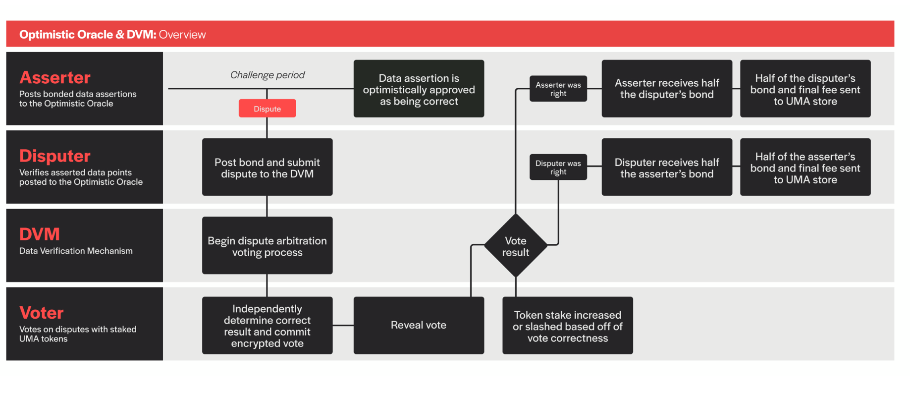
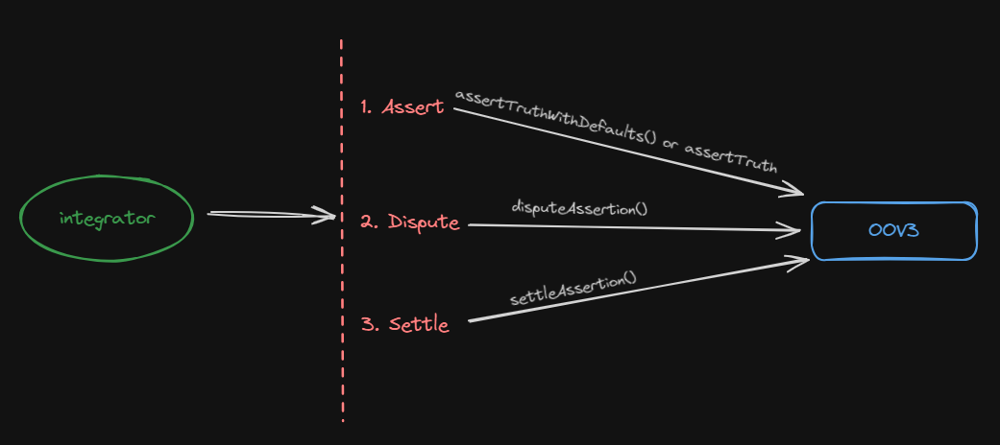
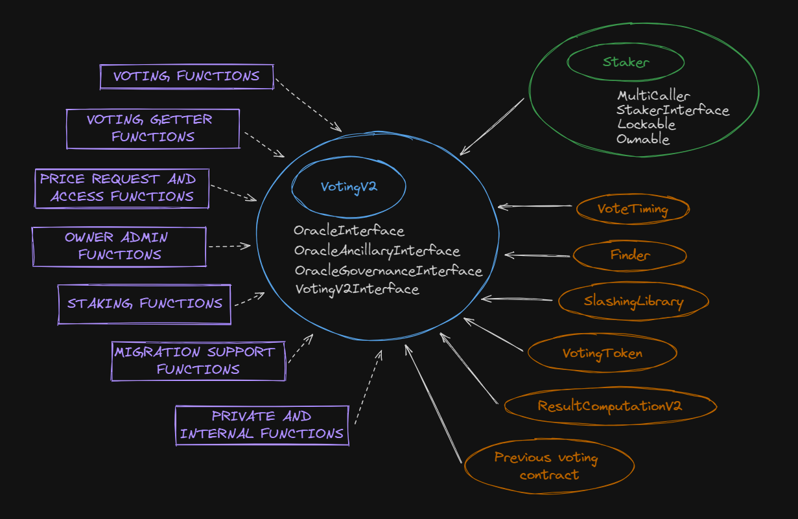
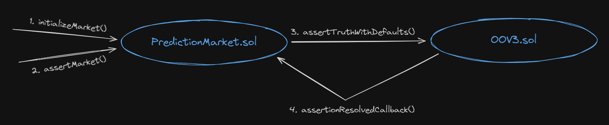

# Uma. Optimistic oracle

**Автор:** [Павел Найданов](https://github.com/PavelNaydanov) 🕵️‍♂️

**Uma** - это децентрализованный оракул, который специализируется на записи любых данных в блокчейн за исключением тех, которые невозможно проверить.

Этот оракул называется оптимистичным, потому что считается, что если данные не оспорены, то они полностью верны. Имеет собственную арбитражную систему для разрешения споров.

Предлагает данные для таких проектов, как кроссчейн мосты, протоколы страхования, рынки предсказаний и деривативы.

Тип данных может быть достаточно вариативным. От цен на криптовалюты до спортивных или политических событий. Однако все данные будут касаться вещей из реального мира, которые можно проверить в какой-то момент времени.

Приведем парочку примеров таких данных:
1. Илон Маск сделает твит о криптовалютах до 31-го августа.
2. Трамп скажет слово "тампон" в своем интервью.
3. В 2024 случится эпидемия обезьяний оспы.
4. Токен Solana будет больше 140$ на момент 23-го августа.
5. Псевдоним Сатоши будет раскрыт в 2024 году.

## Как оракул работает на пальцах?

Рассмотрим упрощенный процесс получения оракулом данных, которым можно доверять. Под данными мы понимаем те примеры, которые были описаны выше. В статье мы будем называть эти данные с которыми работает оракул разными терминами: statement, утверждение, событие, предсказание и так далее. Все эти термины описывают данные для разных предметных областей в разные моменты их жизненного цикла.


Согласно схеме процесс поставки данных в оракул выглядит следующим образом:
1. **Statement.** Утверждение добавляется в оракул вместе с наградой. Предполагается что награду сможет забрать тот, кто сможет оспорить утверждение.
2. **Challenge period.** Любой может оспорить утверждение за этот период. Или не оспорить. Если время выйдет утверждение будет считаться готовым к окончательно фиксации. Это будет означать, что оно верное и ему можно доверять.
3. **Dispute.** И все таки любой участник протокола может оспорить утверждение с целью получения награды или исполнения своего "гражданского долга". Это шутка конечно. На практике это происходит достаточно редко. Согласно теории игр, большинство участников ведет себя в экосистеме протокола честно.
4. **Voting.** Если спор был начат, то его разрешают держатели токена UMA. Это токен протокола, который позволяет голосовать для разрешения споров и получить за это вознаграждение.
5. **Settle.** Последним этапом является процесс settle или фактическая фиксация данных, после которых можно считать, что предложенное утверждение гарантированно является истиной.

Посмотрим этот процесс на примере.
> Василий, слава Богу не Теркин, считает, что на евро 2024 по футболу победила Испания. Факт достаточно известный и Василий решает научить оракул Uma этому. Для этого он передает информацию о событии в оракул. Это этап **statement**. Проходит **challenge period**. Никто это не оспорил, это бессмысленно. Тогда последний этап **settle** окончательно зафиксировал в оракуле, что Испания стала чемпионом. Теперь оракул может всегда отвечать по этому событию и выдавать победителя.

Василий воодушевлен успехом и планирует передать все таблицу результатов евро 2024 по футболу.

> Но Василий в этом турнире болел за команду Франции, которая заняла третье место. И он решает смухлевать переместив ее на второе место. **Disputer** это замечает и открывает спор. Надо сказать, что и Василий и disputer **ставят на кон** не только свою репутацию, но и **некоторую сумму** токенов. Процесс голосования прошел, подлог Василию сделать не удалось, так как арбитражная система оракула отработала штатно и выдала результат, что событие неверное. Тогда на последнем этапе **settled**, оракул выдал часть токенов Василия спорщику в качестве вознаграждения. Василий потерял свои токены, **disputer** приумножил.

Примерно таким образом можно описать работу оракула Uma по утверждению новых данных из реального мира.

## Как это работает технически?

Uma оракул позволяет смарт-контрактам быстро запрашивать и получать информацию. Однако до того момента пока информация станет подтвержденной, пройдет определенный момент времени и отработает целый процесс верификации данных.

В процессе работы оракула принимают участие следующие компоненты системы:

- **Asserter** - участник, который опубликует в системе некоторое утверждение из реального мира. Например "Курс юаня на сегодняшний день равняется одному доллару".
- **Disputer** - участник, который может усомниться в утверждении, которое публикует **asserter**.
- **DVM** - программный модуль для разрешения споров между **asserter** и **disputer**. Однако использование этого модуля опционально и может быть заменено собственной системой разрешение споров.
- **voter** - участник, который будет своим голосом решать прав **asserter** или **disputer**.

Посмотрим на схему из официальной документации на которой изображено взаимодействие всех компонентов системы, описанных выше.



Согласно схеме процесс работы uma выглядит следующим образом:

1. **Asserter** публикует некоторый **statement** и передает некоторую сумму залога в токене, который разрешен протоколом.
2. На протяжение *challenge period* **disputer** может открыть спор, если он не согласен с утверждением **asserter**. Для инициализации спора **disputer** тоже передает протоколу залог. Если на протяжение разрешенного периода **statement** не оспаривается, то он считается верным.
3. После этого в **DVM** начинается процесс независимого голосования всеми держателями токена UMA. Этот процесс включает в себя стадии **commit** и **reveal**, когда сначала никто не знает знает голосов других участников, а потом каждый участник раскрывает результат своего голосования.
4. После завершения процесса голосования, если прав был **asserter**, то он получает половину от залога **disputer**, вторая половина остается в протоколе. Если побеждает **disputer**, то наоборот, он забирает половину залога **asserter**.

Для того, чтобы **voter** смог принять участие в голосовании, необходимо, чтобы его токен UMA был застейкан на протоколе. Это значительное отличие между версиями DVM v1.0 и v2.0. Мотивацией для стейкинга является возможность получить вознаграждение. В целом это стандартная история, которая используется многими протоколам и здесь UMA не предлагает ничего нового.

**Voter** принимает участие в голосовании на двух этапах: передача голоса в закрытую и раскрытие своего голоса. Так называемая схема "commit/reveal". Где на первой стадии смарт-контракту передается результат хеширования голоса, а потом его раскрытие. Это необходимо для того, чтобы никто не видел результатов голосования участников. Считается, что если участники не знают результата голосования других, то это гарантирует действительно независимое голосование.

Также есть один очень интересный механизм, который называется **slashing**. Согласно этому механизму происходит перераспределение застейканных балансов от участников не принимающих участие в голосовании, или делающих это неправильно, к участникам, которые голосуют правильно.

Здесь стоит определить "правильных" и "неправильных" участников. Неправильный участник - это участник, который отдал голос и в результате оказался в группе меньшинства.

> Например, система предлагает событие "Зимбабве завоюет на олимпийских играх ровно 10 золотых медалей". Событие маловероятно, однако, звезды сошлись и Зимбабве выиграло ровно 10 золотых медалей. Казалось все просто, мы голосуем, что событие верное, но большинство участников, по какой-то причине, видимо попали на источник с ошибкой, проголосовали, что событие не наступило, подумали, что Зимбабве вообще не выиграло медалей. В этом случае, хоть мы и все сделали честно, мы будем названы "неправильно" проголосовавшими и подвергнемся процессу **slashing**.

Стоит еще раз отметить, что неправильный участник, этот тот, который отдал свой голос вместе с меньшинством. Однако пример маловероятен, потому что участники не знают голосов других до момента раскрытия, все голосуют секретно. Поэтому никто из голосующих не захочет оказаться в группе меньшинства, а значит будут голосовать правильно.

Таким образом, исключается экономическая мотивация вести себя в системе некорректно или саботировать процесс голосования. В документации это называется штрафом за не участие в голосовании.

## OOV3

OOV3 - это кодовое название смарт-контракта [Optimistic Oracle V3](https://github.com/UMAprotocol/protocol/blob/master/packages/core/contracts/optimistic-oracle-v3/implementation/OptimisticOracleV3.sol). С этим смарт-контрактом будет необходимо делать интеграцию, если есть необходимость подключить Uma протокол.

Во время деплоя конструктор смарт-контракта принимает три параметра:
- **finder**. Смарт-контракт, который хранит адреса всех актуальных смарт-контрактов протокола. Позволяет эффективно использовать его в любом стороннем смарт-контракте.
- **defaultCurrency**. Адрес токена в котором протокол будет принимать залог.
- **defaultLiveness**. Время за которое есть возможность начать спор по statement.

```solidity
constructor(
    FinderInterface _finder,
    IERC20 _defaultCurrency,
    uint64 _defaultLiveness
) {
    finder = _finder;
    // Устанавливаем _defaultCurrency и _defaultLiveness на смарт-контракт
    setAdminProperties(_defaultCurrency, _defaultLiveness, 0.5e18);
}
```

Основная логика смарт-контракта несложная, отражает работу протокола за три шага:
1. **Assert truth**. Предлагает событие/утверждение из мира для фиксации утверждения
2. **Dispute assertion**. Дает возможность оспорить событие
3. **Settle assertion**. Фиксирует событие, как правдивое, точное или правильное



Для утверждения события есть две публичных функции: [assertTruthWithDefaults()](https://github.com/UMAprotocol/protocol/blob/master/packages/core/contracts/optimistic-oracle-v3/implementation/OptimisticOracleV3.sol#L98) и [assertTruth()](https://github.com/UMAprotocol/protocol/blob/master/packages/core/contracts/optimistic-oracle-v3/implementation/OptimisticOracleV3.sol#L138). По сути первая вызывает вторую с дефолтными параметрами, поэтому посмотрим на вторую функцию в облегченном виде.

```solidity
function assertTruth(
    bytes memory claim, // Набор байт кодированного утверждения
    address asserter, // Адрес инициатора утверждения, нужен для получения своего залога обратно
    address callbackRecipient, // Адрес дял обратного вызова
    address escalationManager, // Альтернативный менеджер разрешения спора
    uint64 liveness, // Время, в течении которого можно оспорить утверждение
    IERC20 currency, // Адрес токена в котором будет взиматься залог
    uint256 bond, // Размер залога, не должен быть меньше минимально разрешенного протоколом
    bytes32 identifier, // Идентификатор для DVM
    bytes32 domainId // Опциональный параметр, который позволяет объединять утверждения в группы
) public nonReentrant returns (bytes32 assertionId) {
    uint64 time = uint64(getCurrentTime());
    // Создается идентификатор для утверждения. По сути это хеш его параметров
    assertionId = _getId(claim, bond, time, liveness, currency, callbackRecipient, escalationManager, identifier);

    // Проверки возможности добавления утверждения
    require(asserter != address(0), "Asserter cant be 0");
    require(assertions[assertionId].asserter == address(0), "Assertion already exists");
    require(_validateAndCacheIdentifier(identifier), "Unsupported identifier");
    require(_validateAndCacheCurrency(address(currency)), "Unsupported currency");
    require(bond >= getMinimumBond(address(currency)), "Bond amount too low");

    // Сохраняет утверждение на смарт-контракте
    assertions[assertionId] = Assertion({
        // все параметры утверждения
        ...
    });

    // Эта часть определяет каким образом будет разрешаться спор. По дефолту,
    // если escalationManager указан, как address(0), то спор будет решаться через DVM протокола, иначе через escalationManager, который должен реализовывать специальный интерфейс
    {
        EscalationManagerInterface.AssertionPolicy memory assertionPolicy = _getAssertionPolicy(assertionId);
        // Система разрешающая споры должна быть активна (DVM или escalationManager)
        require(!assertionPolicy.blockAssertion, "Assertion not allowed");
        EscalationManagerSettings storage emSettings = assertions[assertionId].escalationManagerSettings;
        // Переприсвоение необходимо, чтобы использовались настройки напрямую из escalationManager
        (emSettings.arbitrateViaEscalationManager, emSettings.discardOracle,
        emSettings.validateDisputers) = (
            assertionPolicy.arbitrateViaEscalationManager,
            assertionPolicy.discardOracle,
            assertionPolicy.validateDisputers
        );
    }

    // Забирает залог у вызывающего и переводит на смарт-контракт
    currency.safeTransferFrom(msg.sender, address(this), bond);
    ...
}
```

После создания утверждения начинается отсчет времени в течении которого есть возможность открыть спор. Для этого любому несогласному необходимо вызвать функцию [disputeAssertion()](https://github.com/UMAprotocol/protocol/blob/master/packages/core/contracts/optimistic-oracle-v3/implementation/OptimisticOracleV3.sol#L220). Это небольшая функция посмотрим на нее внимательнее.

```solidity
function disputeAssertion(bytes32 assertionId, address disputer) external nonReentrant {
    // Проверка возможности создавать спор
    require(disputer != address(0), "Disputer can't be 0");
    Assertion storage assertion = assertions[assertionId];
    require(assertion.asserter != address(0), "Assertion does not exist");
    require(assertion.disputer == address(0), "Assertion already disputed");
    // Проверка того, что время открытия спора не истекло
    require(assertion.expirationTime > getCurrentTime(), "Assertion is expired");
    // Проверка, что есть система, которая будет разрешать спор (DVM или escalation manager)
    require(_isDisputeAllowed(assertionId), "Dispute not allowed");

    // Устанавливает адрес спорщика для утверждения
    assertion.disputer = disputer;

    // Взимает залог у спорщика
    assertion.currency.safeTransferFrom(msg.sender, address(this), assertion.bond);

    // Сообщает DVM о том, что пора запускать механизм голосования для разрешения спора
    _oracleRequestPrice(assertionId, assertion.identifier, assertion.assertionTime);

    // Делает обратный вызов для адреса callbackRecipient, который был установлен вместе с утверждением
    _callbackOnAssertionDispute(assertionId);
    ...
    emit AssertionDisputed(assertionId, msg.sender, disputer);
}
```

После того, как время спора прошло можно окончательно фиксировать утверждение для публичного использования. Для этого необходимо вызвать функцию [settleAssertion()](https://github.com/UMAprotocol/protocol/blob/master/packages/core/contracts/optimistic-oracle-v3/implementation/OptimisticOracleV3.sol#L250). Посмотрим на нее подробнее.

```solidity
function settleAssertion(bytes32 assertionId) public nonReentrant {
  Assertion storage assertion = assertions[assertionId];

  // Проверки возможности вызывать settleAssertion()
  require(assertion.asserter != address(0), "Assertion does not exist");
  require(!assertion.settled, "Assertion already settled");

  // Устанавливает флаг, что утверждение settled()
  assertion.settled = true;

  // Если спор не был начат
  if (assertion.disputer == address(0)) {
      // Дожидаемся, чтобы прошло время, когда еще можно начать спор
      require(assertion.expirationTime <= getCurrentTime(), "Assertion not expired");

      assertion.settlementResolution = true;
      // Возвращаем залог обратно аккаунту создавшему утверждение
      assertion.currency.safeTransfer(assertion.asserter, assertion.bond);

      // Делаем обратный вызов на адресе callbackRecipient, который создается вместе с утверждением
      _callbackOnAssertionResolve(assertionId, true);

      emit AssertionSettled(assertionId, assertion.asserter, false, true, msg.sender);
  } else {
      // Если спор все-таки был, то запрашиваем его результат
      int256 resolvedPrice = _oracleGetPrice(assertionId, assertion.identifier, assertion.assertionTime);

      // Записываем результат спора
      if (assertion.escalationManagerSettings.discardOracle) assertion.settlementResolution = false;
      else assertion.settlementResolution = resolvedPrice == numericalTrue;

      // Решает, кто будет получать залог обратно
      address bondRecipient = resolvedPrice == numericalTrue ? assertion.asserter : assertion.disputer;

      // Рассчитываем комиссию оракулу
      uint256 oracleFee = (burnedBondPercentage * assertion.bond) / 1e18;
      // Рассчитываем размер суммы получателю залога
      uint256 bondRecipientAmount = assertion.bond * 2 - oracleFee;

      // Отправляем комиссию
      assertion.currency.safeTransfer(address(_getStore()), oracleFee);
      // Отправляем залог получателю
      assertion.currency.safeTransfer(bondRecipient, bondRecipientAmount);

      // Делаем обратный вызов для адреса callbackRecipient, который был установлен вместе с утверждением
      if (!assertion.escalationManagerSettings.discardOracle)
          _callbackOnAssertionResolve(assertionId, assertion.settlementResolution);

      emit AssertionSettled(assertionId, bondRecipient, true, assertion.settlementResolution, msg.sender);
  }
}
```

## DVM

Пришло время получше познакомиться с системой разрешения споров **DVM**. В репозитории эта часть кода лежит в отдельной папке под названием [data-verification-mechanism](https://github.com/UMAprotocol/protocol/blob/master/packages/core/contracts/data-verification-mechanism/README.md).

Основной контракт с которого удобно начинать разбирать систему называется [Voting.sol](https://github.com/UMAprotocol/protocol/blob/master/packages/core/contracts/data-verification-mechanism/implementation/Voting.sol). Ниже мы будем разбирать его вторую версию: смарт-контракт [VotingV2.sol](https://github.com/UMAprotocol/protocol/blob/master/packages/core/contracts/data-verification-mechanism/implementation/VotingV2.sol).



Это уже система побольше, чем OOV3, но мы постараемся охватить наиболее важные моменты. В центре схемы находится сам смарт-контракт `VotingV2.sol` и перечислены интерфейсы от которых он наследуется: [OracleInterface](https://github.com/UMAprotocol/protocol/blob/master/packages/core/contracts/data-verification-mechanism/interfaces/OracleInterface.sol), [OracleAncillaryInterface](https://github.com/UMAprotocol/protocol/blob/master/packages/core/contracts/data-verification-mechanism/interfaces/OracleAncillaryInterface.sol), [OracleGovernanceInterface](https://github.com/UMAprotocol/protocol/blob/master/packages/core/contracts/data-verification-mechanism/interfaces/OracleGovernanceInterface.sol), [VotingV2Interface](https://github.com/UMAprotocol/protocol/blob/master/packages/core/contracts/data-verification-mechanism/interfaces/VotingV2Interface.sol).

Для того, чтобы держатели токена UMA могли голосовать в спорах, им необходимо застейкать эти токены. За это отвечает отдельный смарт-контракт [Staker.sol](https://github.com/UMAprotocol/protocol/blob/master/packages/core/contracts/data-verification-mechanism/implementation/Staker.sol), от которого `VotingV2.sol` наследуется. На схеме он отмечен зеленым цветом.

Не то желтым, не то оранжевым цветом отмечены смарт-контракты, которые используются внутри основного `VotingV2.sol`. Все они так или иначе подключают дополнительную логику. Для некоторых из них необходимо передать их адреса в constructor `VotingV2.sol` при деплое, что само собой подразумевает их отдельный, преждевременный деплой. Перечислим и скажем, за что каждый и них отвечает:
1. [VoteTiming.sol](https://github.com/UMAprotocol/protocol/blob/master/packages/core/contracts/data-verification-mechanism/implementation/VoteTiming.sol). Определяет временные интервалы для голосования держателей токена UMA. Правильнее сказать порядок commit/reveal операций. Помним, что голосование проходит в два этапа. Сначала голосующие отправляют хеш своего голоса, а потом раскрывают этот хеш.
2. [Finder.sol](https://github.com/UMAprotocol/protocol/blob/master/packages/core/contracts/data-verification-mechanism/implementation/Finder.sol). Отвечает за хранение адресов других смарт-контрактов, которые используются во всем протоколе и за его пределами.
3. [FixedSlashSlashingLibrary.sol](https://github.com/UMAprotocol/protocol/blob/master/packages/core/contracts/data-verification-mechanism/implementation/FixedSlashSlashingLibrary.sol). Отвечает за перераспределение токена UMA между честными и нечестными участниками в пользу первых.
4. [VotingToken.sol.](https://github.com/UMAprotocol/protocol/blob/master/packages/core/contracts/data-verification-mechanism/implementation/VotingToken.sol). Это и есть токен протокола UMA. Его адрес передается в `VotingV2.sol` вместе с деплоем. Именно его должны стейкать пользователи для получения доступа к голосованию.
5. [ResultComputationV2](https://github.com/UMAprotocol/protocol/blob/master/packages/core/contracts/data-verification-mechanism/implementation/ResultComputationV2.sol). Очень важная библиотека, которая занимается подсчетом голосов.
6. **Previous voting contract.** Адрес предыдущей версии смарт-контракта [Voting.sol](https://github.com/UMAprotocol/protocol/blob/master/packages/core/contracts/data-verification-mechanism/implementation/Voting.sol). Используется только для получения ревардов со старой версии или хранящейся на нем информации.

Фиолетовым цветом на схеме перечислены группы функций смарт-контрактов, которые реализует смарт-контракт `Voting.sol`:
- Voting functions
- Voting getter functions
- Price request and access functions
- Owner admin functions
- Staking functions
- Migrating support functions
- Private and internal functions

Думаю здесь нет смысла расписывать, что за функции в каждой группе делают. Названия говорят сами за себя.

Зная все это, ты можешь самостоятельно пошариться в смарт-контракте [VotingV2.sol](https://github.com/UMAprotocol/protocol/blob/master/packages/core/contracts/data-verification-mechanism/implementation/VotingV2.sol).

## Slashing

Отдельно стоит поговорить про механизм **slashing**. Мы уже определили его, как основной механизм для стимуляции держателей токена UMA принимать участие в разрешение споров.

Чтобы понять, как этот механизм работает, надо найти в коде его начало. Удобно его рассматривать от внутренней функции [_updateTrackers()](https://github.com/UMAprotocol/protocol/blob/425b075093de42695ef9ca02d542197f44dcfc31/packages/core/contracts/data-verification-mechanism/implementation/VotingV2.sol#L773) в смарт-контракте VotingV2.sol. Посмотрим на нее.

```solidity
// voter - адрес голосующего участника
function _updateTrackers(address voter) internal override {
    // Подготавливает список запросов на голосование, дополняет список тех по которым голосование прошло, чтобы можно было посмотреть участвовал ли в них voter
    processResolvablePriceRequests();

    // Делает slashing для конкретного адреса voter
    _updateAccountSlashingTrackers(voter, UINT64_MAX);

    // Вызывает функцию, которая была переопределена. Физически она находится в смарт-контракте Staker.sol
    super._updateTrackers(voter);
}
```

Эта функция используется много где по коду. Но если присмотреться, то большинство мест - это действие пользователя: [stake()](https://github.com/UMAprotocol/protocol/blob/master/packages/core/contracts/data-verification-mechanism/implementation/Staker.sol#L133), [unstake()](https://github.com/UMAprotocol/protocol/blob/master/packages/core/contracts/data-verification-mechanism/implementation/Staker.sol#L157), [withdrawRewards()](https://github.com/UMAprotocol/protocol/blob/master/packages/core/contracts/data-verification-mechanism/implementation/Staker.sol#L202). Есть еще парочка мест, как говорится, найди их сам.

Получается, что любое действие голосующего будет для него делать **slashing**. И избежать его он уже не сможет. То есть не получиться, застейкать токены, накопить вознаграждение за стейкинг, при этом не участвуя в голосовании, а потом вывести вознаграждение. В момент вывода пользователь сам, собственной транзакцией запустит для себя slashing и получит штраф.
Единственный способ избежать штрафа, принимать участие в голосовании и делать это честно.

Помимо этого протокол дает возможность кому угодно и для кого угодно запустить slashing **в любой момент времени**. То есть потенциально, даже просто отсидеться до лучших времен, когда протокол отменит slashing через DAO, не получится. Кто-нибудь обязательно запустит для такого пользователя slashing. Для этого достаточно вызывать публичную функцию [updateTrackers()](https://github.com/UMAprotocol/protocol/blob/master/packages/core/contracts/data-verification-mechanism/implementation/VotingV2.sol#L755). А вот она уже под капотом вызовет одноименную внутреннюю функцию.

```solidity
function updateTrackers(address voter) external {
    _updateTrackers(voter);
}
```

Если не хочется прогонять пользователя по всей истории голосований, то можно использовать функцию, которая позволит определить максимальное количество событий в глубину для slashing. Отвечает за это функция [updateTrackersRange()](https://github.com/UMAprotocol/protocol/blob/master/packages/core/contracts/data-verification-mechanism/implementation/VotingV2.sol#L766C14-L766C33).

Остается подытожить когда пользователь попадает на slashing. Посмотрим на схему.


Единственное, что мы не рассмотрели, это каким образом написан код для slashing. Оставляю это в качестве домашнего задания. Подсказка: смотреть функцию [_updateAccountSlashingTrackers()](https://github.com/UMAprotocol/protocol/blob/master/packages/core/contracts/data-verification-mechanism/implementation/VotingV2.sol#L832).

_Важно!_ Ранее мы упоминали библиотеку [FixedSlashSlashingLibrary.sol](https://github.com/UMAprotocol/protocol/blob/master/packages/core/contracts/data-verification-mechanism/implementation/FixedSlashSlashingLibrary.sol). При ее детальном рассмотрение, можно понять, что она всего лишь отвечает за количество токена, которое будет снято с пользователя при получение штрафа за неучастие в голосовании или за неправильное голосование.

## Строить вместе с Uma

Uma предлагает несколько примеров проектов, которые показывают варианты использования протокола:

- [Prediction market](https://github.com/UMAprotocol/dev-quickstart-oov3/blob/master/src/PredictionMarket.sol). Реализует рынок предсказаний, где проверка предсказаний делается при помощи Optimistic Oracle V3.
- [Insurance contract](https://github.com/UMAprotocol/dev-quickstart-oov3/blob/master/src/PredictionMarket.sol). Реализует договор страхования, который позволяет получить один полис с возможностью получить выплату в случае наступления страхового случая.
- [A generic data assertion framework](https://github.com/UMAprotocol/dev-quickstart-oov3/blob/master/src/DataAsserter.sol). Позволяет делать утверждения на произвольные данные, подтверждая их через Optimistic Oracle V3.

Разберем наиболее интересный пример "Prediction market". Я выбрал именно этот пример, потому что знаю один популярный сервис среди рынков предсказаний [Polymarket](https://polymarket.com/), который использует Uma протокол.

**Как работает рынок предсказаний?** Сервис наполняется предсказаниями с возможностью проголосовать за один из его исходов. Например: "Завтра биткоин будет стоить 100000$". Пользователь в правке согласиться с этим утверждением или не согласиться и отдать свой голос за положительный или отрицательный исход.

Можно на это смотреть как на сервис ставок. Мы ставим на определенный исход события. Когда событие произойдет. Ставка либо сыграет и мы заработаем, либо все проиграем. Обычно исходов у предсказания два, три, но встречается и больше. Под каждый исход создается взаимозаменяемый токен. Для того, чтобы сделать ставку, нам необходимо купить этот токен. Полученный токен можно обменять на других площадках на более известный токен, если он там листится. Часто, возможность для обмена реализуется прямо в самом сервисе предсказаний.

Начнем сразу с места в карьер. Смотрим на [конструктор](https://github.com/UMAprotocol/dev-quickstart-oov3/blob/master/src/PredictionMarket.sol#L71):

```solidity
constructor(
    address _finder,
    address _currency,
    address _optimisticOracleV3
) {
    // Устанавливаем адреса:
    // finder - для обращения к нужным контрактам UMA
    // currency - токен в котором будет залог
    // optimisticOracleV3 - адрес оракула
    finder = FinderInterface(_finder);
    // Проверяем, разрешает ли uma использовать этот токен в качестве залога
    require(_getCollateralWhitelist().isOnWhitelist(_currency), "Unsupported currency");
    currency = IERC20(_currency);
    oo = OptimisticOracleV3Interface(_optimisticOracleV3);
    defaultIdentifier = oo.defaultIdentifier();
}
```

Основная задача рынка предсказаний создавать различные бинарные утверждения, где пользователи могут оставлять свое мнение "согласны" или "не согласны" они с утверждением. Такие штуки в смарт-контракте называется возможными исходами (outcome) утверждения или предсказания. Для хранения утверждений есть специальный маппинг, который называется [markets](https://github.com/UMAprotocol/dev-quickstart-oov3/blob/master/src/PredictionMarket.sol#L38).

```solidity
struct Market {
    bool resolved; // True, если утверждение проверено и может быть settled
    bytes32 assertedOutcomeId; // Хеш всевозможных исходов (outcome1, outcome2 or unresolvable).
    ExpandedIERC20 outcome1Token;
    ExpandedIERC20 outcome2Token;
    uint256 reward; // Вознаграждение за утверждение истинного результата
    uint256 requiredBond; // Ожидаемый залог для добавления утверждения в uma оракул
    bytes outcome1; // Короткое название первого исхода
    bytes outcome2; // Короткое название второго исхода
    bytes description; // Описание предсказания
}

mapping(bytes32 => Market) public markets;
```

Зная, какие структуры данных описывают рынок предсказаний можно смотреть функцию [initializeMarket()](https://github.com/UMAprotocol/dev-quickstart-oov3/blob/master/src/PredictionMarket.sol#L87), которая создает рынки на смарт-контракте.

```solidity
function initializeMarket(
    string memory outcome1, // Название первого исхода
    string memory outcome2, // Название второго исхода
    string memory description, // Описание рынка
    uint256 reward, // Вознаграждение для asserter
    uint256 requiredBond // Залог для оркула UMA
) public returns (bytes32 marketId) {
    ...

    // Создание идентификатора для рынка предсказаний
    marketId = keccak256(abi.encode(block.number, description));

    ...

    // Создание записи о рынке
    markets[marketId] = Market({
        resolved: false,
        assertedOutcomeId: bytes32(0),
        outcome1Token: outcome1Token,
        outcome2Token: outcome2Token,
        reward: reward,
        requiredBond: requiredBond,
        outcome1: bytes(outcome1),
        outcome2: bytes(outcome2),
        description: bytes(description)
    });

    // Пополнение контракта на сумму вознаграждения
    if (reward > 0) currency.safeTransferFrom(msg.sender, address(this), reward);

    emit MarketInitialized(
        marketId,
        outcome1,
        outcome2,
        description,
        address(outcome1Token),
        address(outcome2Token),
        reward,
        requiredBond
    );
}
```

Следующим этапом, после того, как рынок предсказаний создан и пользователи уже сделали свои ставки "за" или "против" и предсказанное событие произошло необходимо добавить предполагаемый исход в uma протокол для того, чтобы утвердить результат. Наш смарт-контракт для этого реализует функцию [assertMarket()](https://github.com/UMAprotocol/dev-quickstart-oov3/blob/master/src/PredictionMarket.sol#L136).

```solidity
// assertedOutcome - это один из исходов предсказания, которое вызывающий функцию считает верным
function assertMarket(bytes32 marketId, string memory assertedOutcome) public returns (bytes32 assertionId) {
    Market storage market = markets[marketId];
    require(market.outcome1Token != ExpandedIERC20(address(0)), "Market does not exist");

    // Хеш исхода будет являться идентификатором
    bytes32 assertedOutcomeId = keccak256(bytes(assertedOutcome));
    require(market.assertedOutcomeId == bytes32(0), "Assertion active or resolved");
    // Полученный хеш обязательно должен равняться хешу одного из исходов маркета
    require(
        assertedOutcomeId == keccak256(market.outcome1) ||
            assertedOutcomeId == keccak256(market.outcome2) ||
            assertedOutcomeId == keccak256(unresolvable),
        "Invalid asserted outcome"
    );

    market.assertedOutcomeId = assertedOutcomeId;
    // Получаем размер залога, который требует оракул Uma
    uint256 minimumBond = oo.getMinimumBond(address(currency));
    uint256 bond = market.requiredBond > minimumBond ? market.requiredBond : minimumBond;
    // Генерируем утверждение, которое будет отправлено в Uma для проверки
    bytes memory claim = _composeClaim(assertedOutcome, market.description);

    // Переводим залог с вызывающего транзакцию на смарт-контракт
    currency.safeTransferFrom(msg.sender, address(this), bond);
    currency.safeApprove(address(oo), bond);
    // Отправляем утверждение в оракул Uma
    assertionId = _assertTruthWithDefaults(claim, bond);

    // Сохраняем идентификатор утверждения и идентификатор соответствующего маркета
    assertedMarkets[assertionId] = AssertedMarket({ asserter: msg.sender, marketId: marketId });

    emit MarketAsserted(marketId, assertedOutcome, assertionId);
}
```

Здесь может возникнуть резонный вопрос, а каким образом мы теперь на смарт-контракте `PredictionMarket.sol` узнаем, когда оракул рассчитает событие и будет готов сообщить нам, что наше утверждение верно. Время вспомнить про callbacks, которые оракул умеет делать. Поэтому нам достаточно реализовать один из таких callback, под названием [assertionResolvedCallback()](https://github.com/UMAprotocol/dev-quickstart-oov3/blob/master/src/PredictionMarket.sol#L167). Когда утверждение будет проверено оракулом, он сделает обратный вызов.

```solidity
function assertionResolvedCallback(bytes32 assertionId, bool assertedTruthfully) public {
    // Проверяем, что вызывающий является оракулом
    require(msg.sender == address(oo), "Not authorized");
    Market storage market = markets[assertedMarkets[assertionId].marketId];

    if (assertedTruthfully) {
        // Если исход подтвержден, то считать рынок рассчитанным
        market.resolved = true;
        // Если кому-то за этот рынок предназначалось вознаграждение, то отправить его
        if (market.reward > 0) currency.safeTransfer(assertedMarkets[assertionId].asserter, market.reward);
        emit MarketResolved(assertedMarkets[assertionId].marketId);
    } else market.assertedOutcomeId = bytes32(0); // В противном случае ничего не делать, необходимо начинать процесс утверждения заново

    // Удаляем информацию о том, что рынок утверждается оракулом
    delete assertedMarkets[assertionId];
}
```

Весь порядок вызовов, который мы описали выше можно представить на схеме для закрепления.



На этом основная логика взаимодействия смарт-контракта `PredictionMarket.sol` c оракулом Uma заканчивается. Мы не рассмотрели и намерено опустили историю, которая касается работы самого рынка предсказаний. Часто для каждого исхода рынка создается взаимозаменяемый токен. Когда пользователи выбирают исход, они по сути покупают эти токены под капотом и более того, могут обменивать его (этот функционал вынесен за границы примера). Зачатки этой логики также есть в нашем контракте-примере. За это отвечают функции: [createOutcomeTokens()](https://github.com/UMAprotocol/dev-quickstart-oov3/blob/master/src/PredictionMarket.sol#L184), [redeemOutcomeTokens()](https://github.com/UMAprotocol/dev-quickstart-oov3/blob/master/src/PredictionMarket.sol#L197C14-L197C33), [settleOutcomeTokens()](https://github.com/UMAprotocol/dev-quickstart-oov3/blob/master/src/PredictionMarket.sol#L215).

## Участие в качестве voter

Раньше, для того, чтобы получить право принять участие в голосовании достаточно было держать токены UMA на кошельке. Протокол использовал механизм снепшотов, фиксирую балансы пользователей и это являлось "входным билетом". В новой версии для доступа к голосованию уже необходимо застейкать токены UMA на смарт-контракт протокола.

На момент написания статьи пользователям предлагается APR равный 30.1%. Но это не означает, что можно застейкать и пассивно получать вознаграждение. Помним, что система имеет механизм slashing, который может перераспределять балансы стейкеров.

Согласно документации, каждый период голосвания равняется 48 часам:
- первые 24 часа позволяют зашифровать голос. Стадия commit.
- вторые 24 часа позволяют раскрыть голос. Стадия reveal.

Награды за стейкинг накапливаются постоянно. Забрать их можно в любой момент.

Однако есть нюанс, когда потребуется анстейкнуть токены обратно. Придется сначала сделать заявку, после этого необходимо выждать период времени, токены не будут приносить вознаграждение и только после этого, отдельной транзакцией можно забрать застейканные токены.

_Важно!_ На момент написания штраф за пропуск голосования: 0,05% от застейканного баланса.

## Governance

Токен протокола UMA помимо того, что нужен для голосования при утверждения событий из реального мира, также используется для управления протоколом.

Процесс голосования разделен на два этапа commit и reveal голоса и длиться 48 часов. Это нам уже знакомо.

Протокол придумал свой стандарт предложений по образу и подобию EIP в Ethereum. Называются предложения UMIPs (UMA Improvement Proposals).

Стоит отметить, что протокол использует прогрессивный подход в голосовании. Что это означает? Это означает, что голосование не сразу проводится ончейн, а стартует со специального сервиса [snapshot.org](https://snapshot.org/#/uma.eth). В итоге голосование выглядит следующи образом:
1. **Post to Discourse.** Первым делом необходимо разместить предложение в "https://discourse.uma.xyz/". Предложение описывает ключевую идею. На этом этапе сообщество имеет возможность обсудить предложение.
2. **Snapshot Vote**. Когда предложение готово, автор создает голосование в snapshot длительностью в пять дней.
3. **On-chain Vote**. Если в snapshot голосование имеет положительный результат, то голосование проводится ончейн.

На момент написания статьи [протокол в snapshot](https://snapshot.org/#/uma.eth) имеет всего 71-го участника.

## Вывод

Оптимистичный оракул UMA гарантированно стоит особняком от других оракулов. В классической модели оракулы стараются максимально исключить человеческий фактор, вводя децентрализацию по агрегированию данных, определению лидера, который доставит эти данные. Для этого применяют целые блокчейны, дополнительные консенсусы, несколько независимых источников данных и так далее. В Uma ничего подобного нет, этот протокол идет совершенно другим путем, полностью полагаясь на свое сообщество в определении достоверности данных.

Такой взгляд открывает совершенно новые варианты использования, которые прекрасно подходят рынкам прогнозов, страхованию и многим другим областям, где скорость поставки данных не так приоритетна и они могут позволить себе подождать пока пройдет полный цикл по верификации данных внутри uma протокола. Однако это позволяет оракулу поставлять совершенно неограниченные типы данных, по сути с полуавтоматическим подтверждением их целостности и правдивости.

По традиции мое личное мнение такое. Это интересный протокол, который хорошо подумал о системе мотивации и сдерживанию своих участников. Прекрасно понимает свою нишу, где он может быть полезным и затачивает под это свой сервис. Протокол точно заслуживает внимания, потому что решение является достаточно простым и элегантным технически, но при этом полностью непохожим на классическую модель оракулов. Практический же успех зависит от активности сообщества, которому необходимо стейкать, голосовать, решать спорные утверждения. Но это конечно отдельная история.

## Links

1. [Официальная документация](https://docs.uma.xyz/)
2. [Официальный репозиторий](https://github.com/UMAprotocol/protocol/tree/master)
3. [UMA token staking is live — Here is how you participate](https://medium.com/uma-project/uma-token-staking-is-live-here-is-how-you-participate-bf959cc39091)
4. [UMA Building with the Optimistic Oracle](https://www.youtube.com/embed/tyi6PnlIHw8?rel=0&start=26)
