# Архитектура Uniswap v4

**Автор:** [Павел Найданов](https://github.com/PavelNaydanov) 🕵️‍♂️

**Uniswap V4** - это платформа для строительства DeFi протоколов, реализующая архитектуру **"Singleton Design"**, которая позволяет внедрять произвольную логику в работу пула.

Архитектура четвертой версии протокола претерпела значительные изменения: объединила все пулы ликвидности на одном смарт-контракте и реализовала механизм "хуки" для кастомизации логики пулов.

В третьей версии протокола работает правило 1 пул = 1 смарт-контракт. Для создания нового пула используется специальный смарт-контракт фабрики [UniswapV3Factory.sol](https://github.com/Uniswap/v3-core/blob/main/contracts/UniswapV3Factory.sol), который наследуется от [UniswapV3PoolDeployer.sol](https://github.com/Uniswap/v3-core/blob/main/contracts/UniswapV3PoolDeployer.sol).

При этом пользовательские операции, например различные виды свапа, проходят через смарт-контракт [SwapRouter.sol](https://github.com/Uniswap/v3-periphery/blob/main/contracts/SwapRouter.sol) напрямую к пулу.

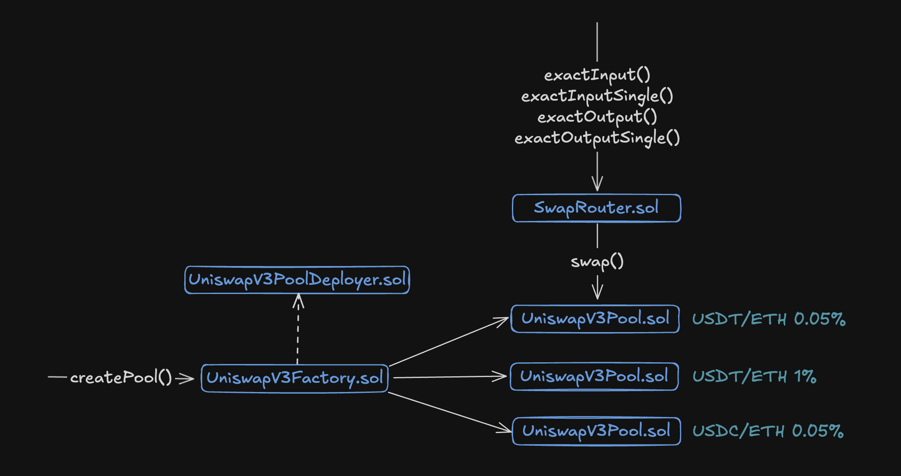

Теперь смотрим, как создание пула работает в четвертой версии.

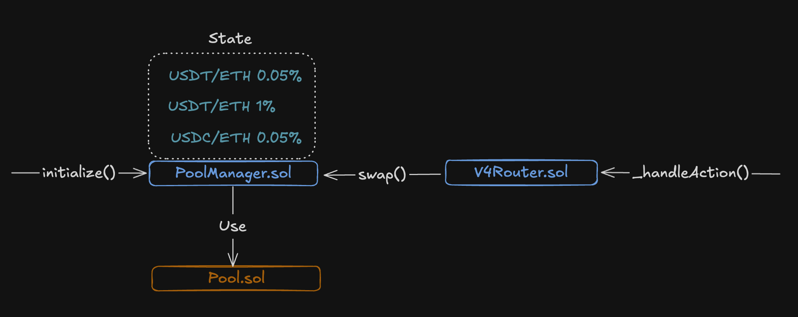

Для создания нового пула используется вызов [initialize()](https://github.com/Uniswap/v4-core/blob/main/src/PoolManager.sol#L117) на смарт-контракте [PoolManager.sol](https://github.com/Uniswap/v4-core/blob/main/src/PoolManager.sol). Информация о созданном пуле записывается в состояние смарт-контракта менеджера пулов.

При этом пользовательские операции, например различные виды свапа, проходят через смарт-контракт [V4Router.sol](https://github.com/Uniswap/v4-periphery/blob/main/src/V4Router.sol), но вся низкоуровневая логика с обработкой операции на пуле происходит в библиотеке [Pool.sol](https://github.com/Uniswap/v4-core/blob/main/src/libraries/Pool.sol), которую использует `PoolManager.sol`

Синглтон архитектура обеспечивает значительную экономию газа, так как для создания нового пула достаточно обновить состояние вместо развертывания нового смарт-контракта пула. Также обмен через цепочку пулов больше не требует физической передачи токенов через промежуточные пулы, что значительно снижает затраты на газ.

## Репозитории протокола

Протокол продолжает следовать своей традиции в отношение разделения кодовой базы на два репозитория аналогично предыдущим версиям:
- [v4-core](https://github.com/Uniswap/v4-core/tree/main).
- [v4-periphery](https://github.com/Uniswap/v4-periphery).

Core все также отвечает за пулы, а periphery — за маршрутизацию к пулам. Также существует множество дополнительных смарт-контрактов, которые так или иначе реализуют логику пулов, роутера, LP токена и математики.

Схема ниже показывает список смарт-контрактов в двух репозиториях.

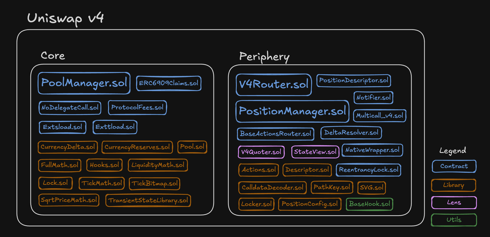

Я выписал наименования основных смарт-контрактов разбитых на 4 группы:
- **Синий цвет** обозначает основные смарт-контракты, которые реализуют первостепенную логику протокола.
- **Оранжевый цвет** обозначает смарт-контракты, которые являются библиотеками.
- **Розовый цвет** обозначает вспомогательные смарт-контракты, которые предназначены только для чтения данных из блокчейна.
- **Зеленый цвет** обозначает вспомогательные смарт-контракты. В нашем случае мы определили только смарт-контракт, который описывает минимальную логику хуков.

Чем больше размер названия смарт-контракта, тем он важнее в коде Uniswap. На схеме таких смарт-контрактов несколько:
- [PoolManager.sol](https://github.com/Uniswap/v4-core/blob/main/src/PoolManager.sol). Первоочередный смарт-контракт из группы core, который управляет пулами токенов.
- [V4Router.sol](https://github.com/Uniswap/v4-periphery/blob/main/src/V4Router.sol). Смарт-контракт из группы periphery, который отвечает за первичную обработку операций пользователя перед тем, как отправлять вызов в смарт-контракты группы core.
- [PositionManager.sol](https://github.com/Uniswap/v4-periphery/blob/main/src/PositionManager.sol). Смарт-контракт из группы periphery, который отвечает за добавление/удаление ликвидности и реализацию LP токена (нфтишки), отображающего позицию поставщика ликвидности. Это точка входа для поставщика ликвидности, которая позволит управлять ликвидностью на смарт-контракте `PoolManager.sol`.

## Устройство менеджера пулов

Смарт-контракт [PoolManager.sol](https://github.com/Uniswap/v4-core/blob/main/src/PoolManager.sol) реализует следующий функционал:

- **modifyLiquidity()**. Функция управления ликвидностью: добавление, удаление и модификации. Обычно функция вызывается поставщиком ликвидности, но не напрямую, а через смарт-контракт `PositionManager.sol`.
- **swap()**. Обмен активов. Обычно функция вызывается пользователем, но не напрямую, а через смарт-контракт `V4Router.sol`.
- **donate()**. Прямые донаты поставщикам ликвидности. Это способ увеличить ликвидность в пуле в обход механизма поставщиков ликвидности.
- **mint()/burn()**. Минт и сжигание ERC-6909, который подтверждает наличие активов пользователя в протоколе. После свапа можно не забирать токен, а сминтить его эквивалент в ERC-6909. Минт ERC-6909 всегда дешевле по газу, чем трансфер любого токена.
- **take()/settle()**. Функции для получения и погашения активов. Используется для flash loans и не только. Позволяет взять активы из пула в долг и погасить.
- **sync()**. Для синхронизации состояния пула с его текущими резервами токенов и ценой.

**Переменные стораджа**

Менеджер пула приобрел красивый mapping для управления множеством пулов.

```solidity
mapping(PoolId id => Pool.State) internal _pools;
```

**PoolId** - это уникальный идентификатор пула, который на самом деле `bytes32`. По сути, идентификатор является хешом параметров пула. Для получения id используется библиотека [PoolIdLibrary](https://github.com/Uniswap/v4-core/blob/main/src/types/PoolId.sol#L9) с одной единственной функцией `toId()`.

```Solidity
// Взято из PoolKey.sol
struct PoolKey {
    // Информация о токене 0
    Currency currency0;
    // Информация о токене 1
    Currency currency1;
    // Комиссия
    uint24 fee;
    // Размер тика
    int24 tickSpacing;
    // Адрес смарт-контракта хука
    IHooks hooks;
}

library PoolIdLibrary {
    function toId(PoolKey memory poolKey) internal pure returns (PoolId poolId) {
        assembly ("memory-safe") {
            // 0xa0 представляет размер PoolKey (5 slots of 32 bytes)
            poolId := keccak256(poolKey, 0xa0)
        }
    }
}
```

`Pool.State` - это все актуальное состояние пула, посмотрим на него чуть ниже.

Также в сторадже `PoolManager.sol` две константы обозначающие минимальную и максимальную границу тика.

```solidity
int24 private constant MAX_TICK_SPACING = TickMath.MAX_TICK_SPACING;
int24 private constant MIN_TICK_SPACING = TickMath.MIN_TICK_SPACING;
```

Все остальные переменные стораджа попрятаны по смарт-контрактам от которых наследуется `PoolManager.sol`.

**От чего наследуется PoolManager**

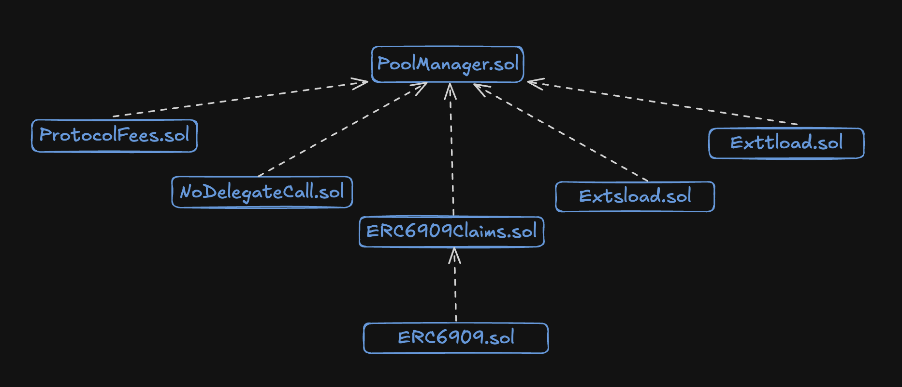

- [NoDelegateCall.sol](https://github.com/Uniswap/v4-core/blob/main/src/NoDelegateCall.sol). Защита от делегированного вызова. Защищает механизм разблокировки. Когда делается обратный вызов, то не получится исполнить логику другого смарт-контракта. Другими словами, `delegateCall` к `PoolManager` запрещен в целях безопасности.
- [ERC6909Claims.sol](https://github.com/Uniswap/v4-core/blob/main/src/ERC6909Claims.sol). Позволяет минтить и сжигать токен в эквивалент активам пользователя, оставленным внутри протокола.
- [Extsload.sol](https://github.com/Uniswap/v4-core/blob/main/src/Extsload.sol) и [Exttload.sol](https://github.com/Uniswap/v4-core/blob/main/src/Exttload.sol). Позволяет библиотеке [TransientStateLibrary.sol](https://github.com/Uniswap/v4-core/blob/main/src/libraries/TransientStateLibrary.sol) читать и писать данные во временное хранилище. Сама библиотека используется из-за пределов смарт-контрактов группы core. Используется для промежуточных вычислений.

Но это еще не все, если вспомнить скриншот со смарт-контрактами репозиториев, то там было изображено множество логики, вынесенной в библиотеки.

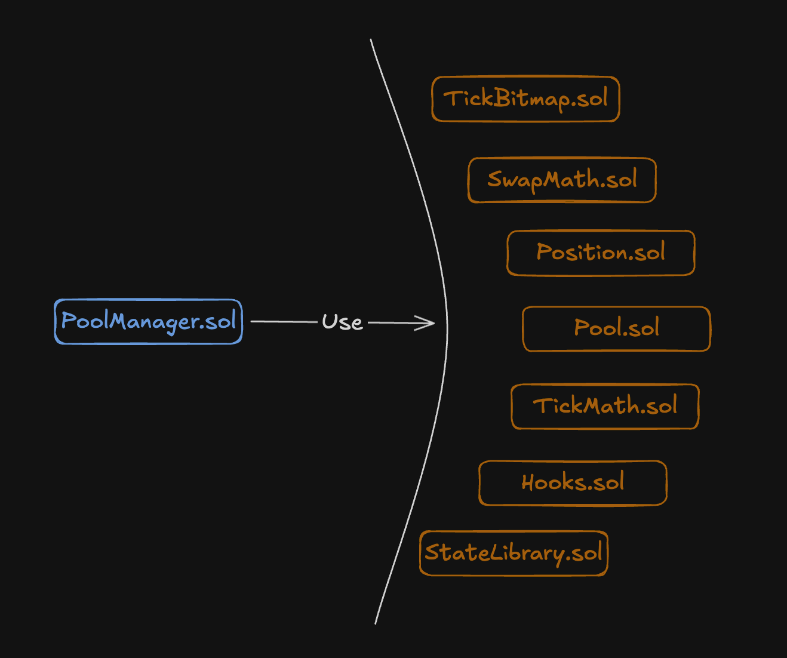

На самом деле библиотек сильно [больше](https://github.com/Uniswap/v4-core/tree/main/src/libraries). Но в первую очередь интересен смарт-контракт [Pool.sol](https://github.com/Uniswap/v4-core/blob/main/src/libraries/Pool.sol). Библиотека отвечает за все операции, которые могут быть применены к пулу: от модификации позиции поставщика ликвидности, до свапа и изменения информации о тике.

В `Pool.sol` описана структура [состояния](https://github.com/Uniswap/v4-core/blob/main/src/libraries/Pool.sol#L83C1-L91C6) пула. Мы обещали посмотреть на структуру состояния ранее.

```solidity
struct State {
    Slot0 slot0; // Упакованные байты: стоимость, комиссия, флаг разблокировки, текущий тик
    uint256 feeGrowthGlobal0X128; // Накопление комиссии для поставщиков ликвидности по токену 0
    uint256 feeGrowthGlobal1X128; // Накопление комиссии для поставщиков ликвидности по токену 1
    uint128 liquidity; // Общая текущая ликвидность пула, выраженная в единицах ликвидности
    mapping(int24 tick => TickInfo) ticks; // Информация по ликвидности во всех тиках
    mapping(int16 wordPos => uint256) tickBitmap; // Битовое представление тиков для удобного поиска при свопах
    mapping(bytes32 positionKey => Position.State) positions; // Хранит состояние каждой позиции ликвидности в пуле
}
```

Уже потом следует ознакомиться с библиотеками:
- [StateLibrary.sol](https://github.com/Uniswap/v4-core/blob/main/src/libraries/StateLibrary.sol). Помогает получать данные по Slot0. Напрямую в `PositionManager.sol` не используется, но хорошо показывает структуру Slot0.
- [Position.sol](https://github.com/Uniswap/v4-core/blob/main/src/libraries/Position.sol). Отвечает за операции с позицией поставщиков ликвидности.
- [TickBitmap.sol](https://github.com/Uniswap/v4-core/blob/main/src/libraries/TickBitmap.sol) и [TickMath.sol](https://github.com/Uniswap/v4-core/blob/main/src/libraries/TickMath.sol). Вспомогательные библиотеки для работы с тиками.
- [SwapMath.sol](https://github.com/Uniswap/v4-core/blob/main/src/libraries/SwapMath.sol). Помогает рассчитать результаты свопа.
- [Hooks.sol](https://github.com/Uniswap/v4-core/blob/main/src/libraries/Hooks.sol). Выполняет логику хуков: валидацию и исполнение.

Это были основные библиотеки необходимы для понимания, дальше знакомиться с кодом по необходимости.

## Флоу вызова смарт-контрактов

В этом разделе разберем флоу вызова транзакции от момента отправки пользователем до финального исполнения на смарт-контрактах. Условно можно всех пользователей разделить на два типа:
- Поставщик ликвидности, предоставляющий активы в абстрактный пул токенов.
- Обычный пользователь, выполняющий свап одного актива на другой.

Для каждого из пользователей будет разная точка входа.

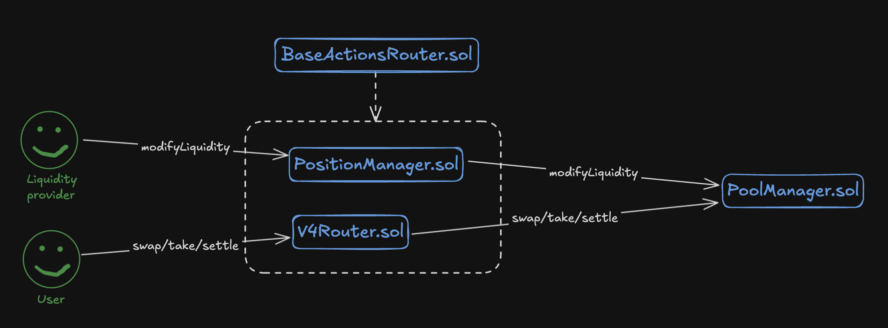

Поставщики ликвидности должны взаимодействовать со смарт-контрактом [PositionManager.sol](https://github.com/Uniswap/v4-periphery/blob/main/src/PositionManager.sol#L195), который разбирает данные операции и перенаправляет на смарт-контракт менеджера пулов.

Обычные пользователи используют [V4Router.sol](https://github.com/Uniswap/v4-periphery/blob/main/src/V4Router.sol#L32), который разбирает данные операции и перенаправляет на смарт-контракт менеджера пулов.

Обе точки входа, что логично, наследуются от смарт-контракта [BaseActionsRouter.sol](https://github.com/Uniswap/v4-periphery/blob/main/src/base/BaseActionsRouter.sol), который регламентирует обработку входящих операций.

## Кросс-версионная маршрутизация

Нужно понимать, что на момент написания статьи существует вторая, третья и четвертая версии протокола. И я думаю это не предел! Свапы могут выстраиваться в целую цепочку обменов через разные пулы и разные версии протокола.

Таким образом, логично появление прослойки между интерфейсом протокола и различными версиями смарт-контрактов. Такая прослойка называется **UniversalRouter** и находится в отдельном [репозитории](https://github.com/Uniswap/universal-router).

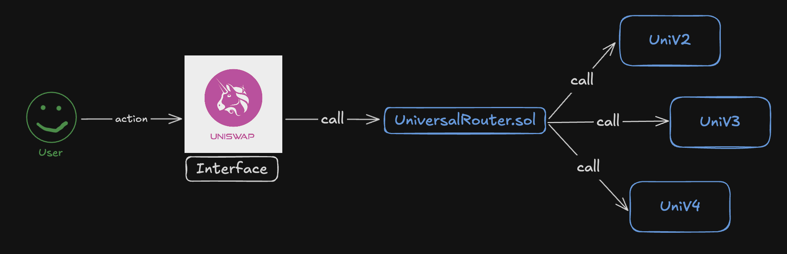

Смарт-контракт [UniversalRouter.sol](https://github.com/Uniswap/universal-router/blob/main/contracts/UniversalRouter.sol) наследуется от определенных смарт-контрактов (роутеров), которые выполняют интеграционную логику с каждой из версий протокола.

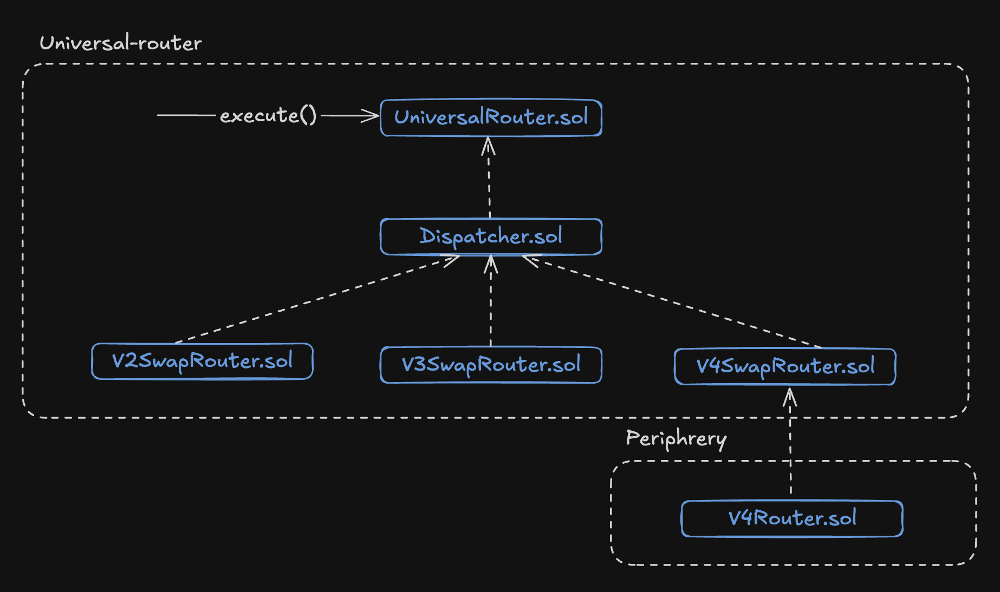

Для того, чтобы запустить механизм маршрутизации через `UniversalRouter.sol` необходимо вызвать функцию [execute(bytes calldata commands, bytes[] calldata inputs, uint256 deadline)](https://github.com/Uniswap/universal-router/blob/main/contracts/UniversalRouter.sol#L35). Функция принимает набор байт команд (или операций пользователя, например свап в UniV2), массив входных данных (адрес получателя, сумма и так далее для каждой команды) и дедлайн.

Ниже псевдокод: как закодировать вызов execute().

```solidity
import {Commands} from 'universal-router/contracts/libraries/Commands.sol';

...

function executeV2SwapExactOut(address recipient, uint256 amountIn, uint256 amountOutMin) external {
    uint256 deadline = block.timestamp + 60;
    bytes memory commands = abi.encodePacked(bytes1(uint8(Commands.V2_SWAP_EXACT_OUT)));

    bytes[] memory inputs = new bytes[](1);
    inputs[0] = abi.encode(
      recipient,
      amountIn,
      amountOutMin,
      abi.encodePacked(WETH, DAI),
      true // Определяет, кто оплатит вызов
    );

    IUniversalRouter(router).execute{value: 0}(commands, inputs, deadline);
}
```

Несколько команд кодируется следующим образом:

```solidity
bytes memory commands = abi.encodePacked(
    bytes1(uint8(Commands.V2_SWAP_EXACT_OUT)),
    bytes1(uint8(Commands.V4_POSITION_MANAGER_CALL))
);
```

_Важно!_ Стоит оценить местоположения смарт-контрактов. В цепочке наследований смарт-контракт [V4SwapRouter.sol](https://github.com/Uniswap/universal-router/blob/main/contracts/modules/uniswap/v4/V4SwapRouter.sol#L11) наследуется от смарт-контракта [V4Router.sol](https://github.com/Uniswap/v4-periphery/blob/main/src/V4Router.sol), который находится в репозитории periphery.

## Интересные приемы в коде протокола

В этом разделе разберем еще больше интересных механик, которые применяются в протоколе.

### Разблокировка пула

По дефолту пулы токенов "заблокированы", то есть операции с ними недоступны. Механизм разблокировки пула гарантирует, что операции выполняются атомарно, и никто не может вмешаться в процесс. По сути это защита от атаки повторного входа (reentrancy).

Отвечает за разблокировку пула функция [unlock()](https://github.com/Uniswap/v4-core/blob/main/src/PoolManager.sol#L104). По совместительству, функция `unlock()` является единственной точкой входа для смарт-контракта `PoolManager.sol`.

Реализован механизм разблокировки при помощи [EIP-1153: Transient storage opcodes](https://eips.ethereum.org/EIPS/eip-1153).

> Мы писали про Transient Storage. Если хочешь узнать про него больше, то ищи его внутри нашего wiki в папке EIPs.

Весь процесс разблокировки пула представлен на схеме ниже.

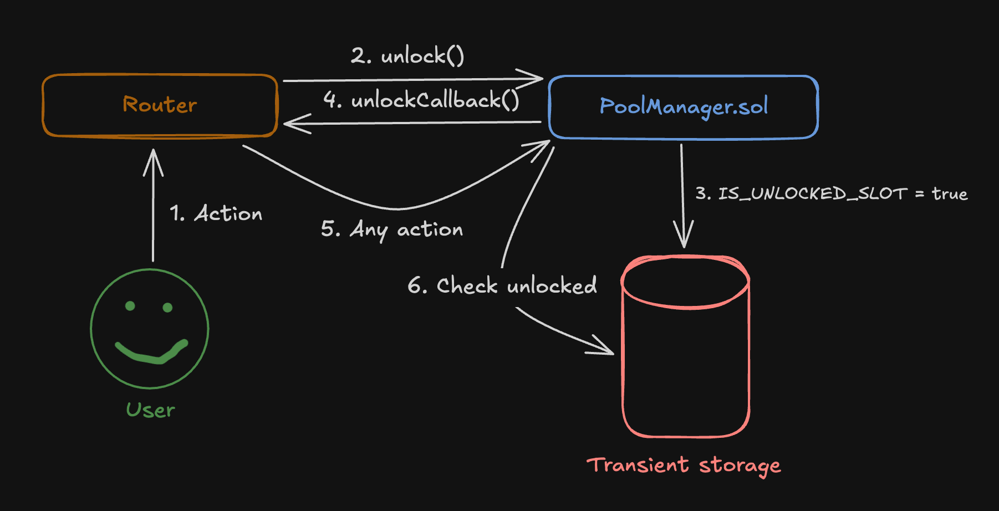

Любое действие пользователя попавшее на смарт-контракт роутинга (`V4Router.sol`, `PositionManager.sol`) первым делом вызывает [unlock()](https://github.com/Uniswap/v4-periphery/blob/main/src/base/BaseActionsRouter.sol#L26) на смарт-контракте [PoolManager.sol](https://github.com/Uniswap/v4-core/blob/main/src/PoolManager.sol#L104).

После разблокировки `PoolManager.sol` делает обратный вызов через функцию [unlockCallback()](https://github.com/Uniswap/v4-core/blob/main/src/PoolManager.sol#L110). Затем действие пользователя [обрабатывается](https://github.com/Uniswap/v4-periphery/blob/main/src/base/BaseActionsRouter.sol#L51) и снова делается вызов на `PoolManager.sol` с необходимостью обработать действие пользователя.

В конце операции пул будет снова [заблокирован](https://github.com/Uniswap/v4-core/blob/main/src/PoolManager.sol#L113) и недоступен для операции. Таким образом, кто пул разблокировал, тот и выполняет операцию.

```solidity
function unlock(bytes calldata data) external override returns (bytes memory result) {
    if (Lock.isUnlocked()) AlreadyUnlocked.selector.revertWith();

    // Разблокируем пул, если он не был разблокирован
    Lock.unlock();

    // Делаем обратный вызов для запуска операции
    result = IUnlockCallback(msg.sender).unlockCallback(data);

    ...

    // Блокируем пул
    Lock.lock();
}
```

Функция [unlockCallback()](https://github.com/Uniswap/v4-periphery/blob/main/src/base/SafeCallback.sol) находится на смарт-контракте [SafeCallback.sol](https://github.com/Uniswap/v4-periphery/blob/main/src/base/SafeCallback.sol), от которого наследуется [BaseActionsRouter.sol](https://github.com/Uniswap/v4-periphery/blob/main/src/base/BaseActionsRouter.sol#L12C19-L12C36).

Сама реализация функции находится в [BaseActionsRouter.sol](https://github.com/Uniswap/v4-periphery/blob/main/src/base/BaseActionsRouter.sol#L32).

```solidity
function _unlockCallback(bytes calldata data) internal override returns (bytes memory) {
    // Декодирует параметры вызова
    (bytes calldata actions, bytes[] calldata params) = data.decodeActionsRouterParams();

    // Выполняет операцию/операции пользователя
    _executeActionsWithoutUnlock(actions, params);

    return "";
}
```

Здесь интересно посмотреть, что из себя представляет сама блокировка, потому что для хранения состояния разблокировки используется временное хранилище (Transient Storage).

Здесь все просто, написана отдельная библиотека [Lock.sol](https://github.com/Uniswap/v4-core/blob/main/src/libraries/Lock.sol) через которую проставляется флаг разблокировки при помощи новых опкодов `tstore`, `tload`.

```solidity
library Lock {
    // Уникальный хеш слота
    bytes32 internal constant IS_UNLOCKED_SLOT = ...;

    function unlock() internal {
        assembly ("memory-safe") {
            // Установить флаг разблокировано
            tstore(IS_UNLOCKED_SLOT, true)
        }
    }

    function lock() internal {
        assembly ("memory-safe") {
            // Установить флаг заблокировано
            tstore(IS_UNLOCKED_SLOT, false)
        }
    }

    ...
}
```

Таким незамысловатым образом гарантируется атомарность вызова. В будущем библиотека может быть упразднена, когда компилятор Solidity введет ключевые слова для управления временным хранилищем.

### Как интегрированы хуки

Теория проста. Готовите ваш смарт-контракт хука (для этого обязательно надо наследовать его от абстрактного смарт-контракта [BaseHook.sol](https://github.com/Uniswap/v4-periphery/blob/main/src/utils/BaseHook.sol)) и создаете пул с этим хуком. Теперь все вызовы автоматически будут проходить через этот смарт-контракт хука.

Для этой механики хуков логично предположить, что смарт-контракт менеджера пулов должен уметь две вещи:
1. Знать хук каждого пула (если он есть)
2. Уметь делать вызовы на смарт-контракт хука

Все хуки работают по одному принципу, поэтому рассмотрим функцию [swap()](https://github.com/Uniswap/v4-core/blob/main/src/PoolManager.sol#L187) в качестве примера.

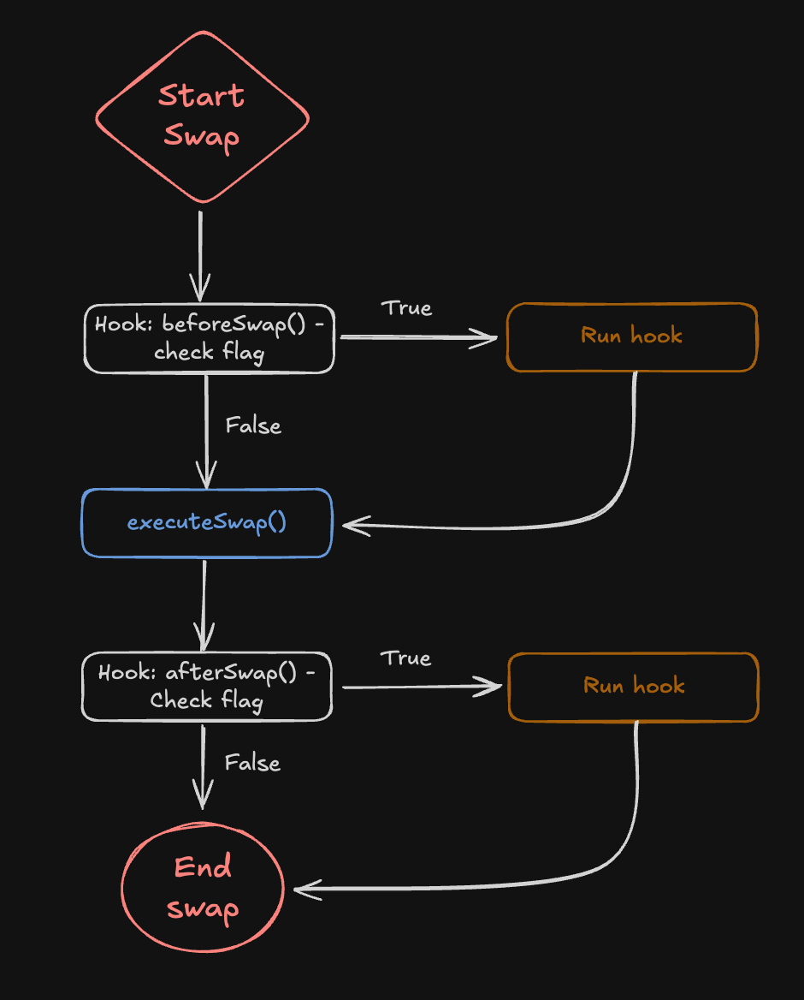

В коде запуск хука до и после операции выглядит просто и выполняется через прямой вызов функции `beforeSwap()`/`afterSwap()`.

```solidity
function swap(PoolKey memory key, SwapParams memory params, bytes calldata hookData)
    external
    onlyWhenUnlocked
    noDelegateCall
    returns (BalanceDelta swapDelta)
{
    ...

    BeforeSwapDelta beforeSwapDelta;
    {
        int256 amountToSwap;
        uint24 lpFeeOverride;
        (amountToSwap, beforeSwapDelta, lpFeeOverride) =

        // Вызов хука перед выполнением свопа
        key.hooks.beforeSwap(key, params, hookData);

        swapDelta = _swap(...);
    }

    BalanceDelta hookDelta;
    // Вызов хука после выполнения хука
    (swapDelta, hookDelta) = key.hooks.afterSwap(key, params, swapDelta, hookData, beforeSwapDelta);

    ...
}
```

Таким образом, хук выполняется до и после любой операции пользователя. Хранится информация об адресе хука в структуре [PoolKey](https://github.com/Uniswap/v4-core/blob/main/src/types/PoolKey.sol#L21).

_Важно!_ Стоит обратить внимание на параметр функции `swap()` под названием `bytes calldata hookData`. Это произвольный набор байт, который может быть передан вместе с вызовом в хук.

**Архитектура кодовой базы хуков**

Если с флоу выполнения хука должно быть все понятно, то со смарт-контрактами немножко сложнее.

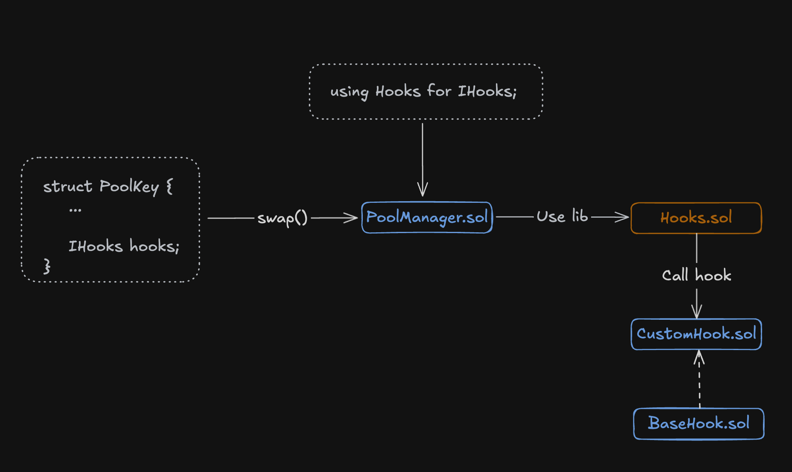

Изначально, при вызове свопа, функция на `PoolManager.sol` принимает параметр `PoolKey`, который помимо информации о токенах содержит информацию об адресе смарт-контракта хуков.

_Важно!_ Адрес смарт-контракта хуков принимает участие в формирование уникального идентификатора пула. Именно поэтому смарт-контракт хуков устанавливается единожды при инициализации пула.

Затем для обработки вызовы хука используется библиотека, которая накидывается на все интерфейсы `IHooks`. Именно эта библиотека валидирует вызов и если хук активирован, то перенаправляет вызов на пользовательский смарт-контракт `CustomHook.sol`, который наследуется от базовой реализации `BaseHook.sol`.

**Библиотека обработки хуков**

Логика обработки вызова хука находится в библиотеке [Hooks.sol](https://github.com/Uniswap/v4-core/blob/main/src/libraries/Hooks.sol).

Если хук не определен, то фактически вызов не выполняется, но код проверки все равно присутствует. На проверку тратиться газ, без этого никуда.

```solidity
function beforeSwap(IHooks self, PoolKey memory key, SwapParams memory params, bytes calldata hookData)
    internal
    returns (int256 amountToSwap, BeforeSwapDelta hookReturn, uint24 lpFeeOverride)
{
    ...

    // Проверка, что хук активен
    if (self.hasPermission(BEFORE_SWAP_FLAG)) {
        // Вызов функции beforeSwap на смарт-контракте хука
        bytes memory result = callHook(self, abi.encodeCall(IHooks.beforeSwap, (msg.sender, key, params, hookData)));

        ...
    }
}
```

**Хук инициализации**

Есть одно важное отличие в хуке, который вызывается при инициализации. Мы знаем, что адрес смарт-контракта хука не случайный, он создается при помощи специальной библиотеки [HookMiner.sol](https://github.com/Uniswap/v4-periphery/blob/main/src/utils/HookMiner.sol), которая в адрес хука зашивает список функций (действий пользователя, свап и так далее) для которых хук активен.

Поэтому при инициализации пула дополнительно проверяется адрес хука.

```solidity
function initialize(PoolKey memory key, uint160 sqrtPriceX96) external noDelegateCall returns (int24 tick) {
    ...

    // Проверка адреса хука
    if (!key.hooks.isValidHookAddress(key.fee)) Hooks.HookAddressNotValid.selector.revertWith(address(key.hooks));

    ...

    // Вызов хука до инициализации пула
    key.hooks.beforeInitialize(key, sqrtPriceX96);

    PoolId id = key.toId();
    tick = _pools[id].initialize(sqrtPriceX96, lpFee);

    ...

    // Вызов хука после инициализации пула
    key.hooks.afterInitialize(key, sqrtPriceX96, tick);
}
```

## Вывод

Uniswap V4 продолжает задавать тренды в технической реализации DeFi приложений. Объединение всех пулов ликвидности в один смарт-контракт не только снижает затраты на газ за счёт устранения необходимости развертывать новые смарт-контракты, но и упрощает "сложные" свопы, устраняя физическую передачу токенов между пулами.

Архитектура V4, с управлением через `PoolManager.sol`, обеспечивает атомарность операций благодаря механизму разблокировки (используя EIP-1153), защищая от reentrancy атак.

Новая фича "хуки" добавляет гибкость, позволяя разработчикам внедрять кастомную логику.

Uniswap V4 — это не только оптимизация, но и платформа для инноваций в DeFi, ожидающая вашего вклада!

Благодаря этой статье мы разобрали основы V4, оставив простор для дальнейшего исследования — от глубокого погружения в библиотеки, такие как `Pool.sol`, `SwapMath.sol` и `Hooks.sol`, до экспериментов с хуками.