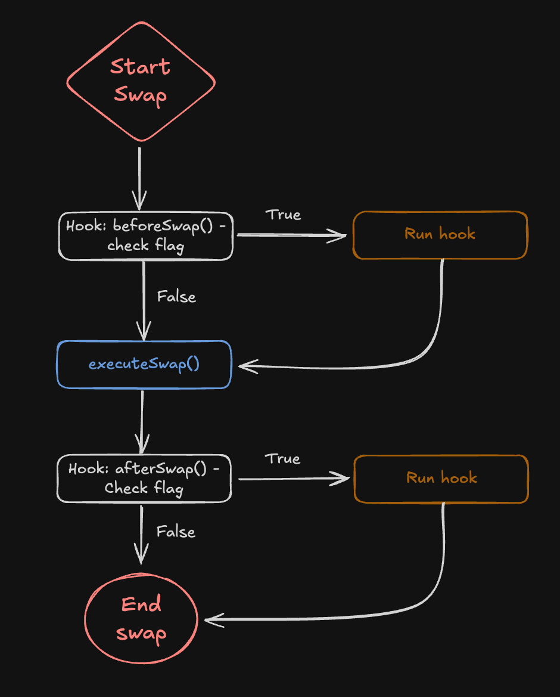
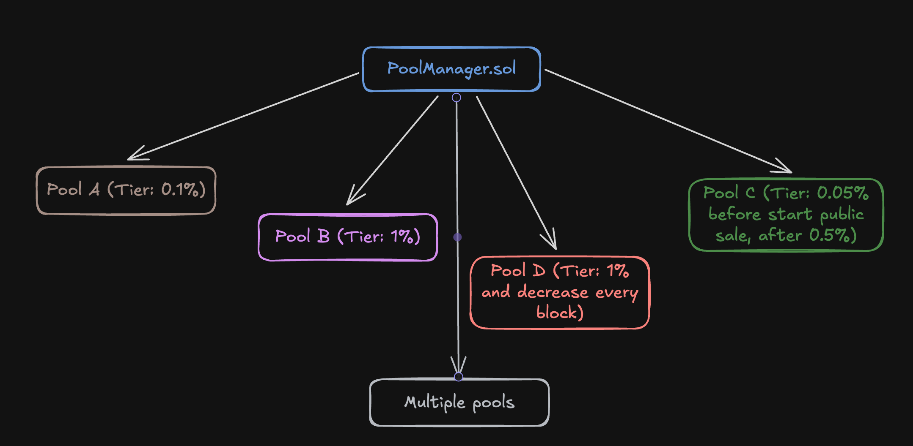
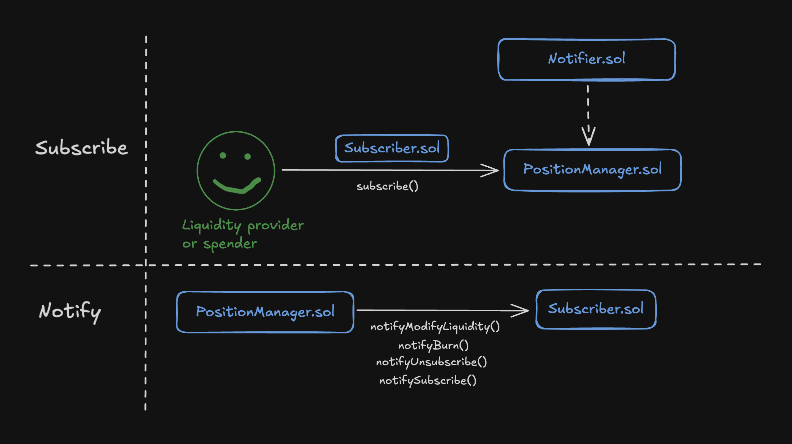
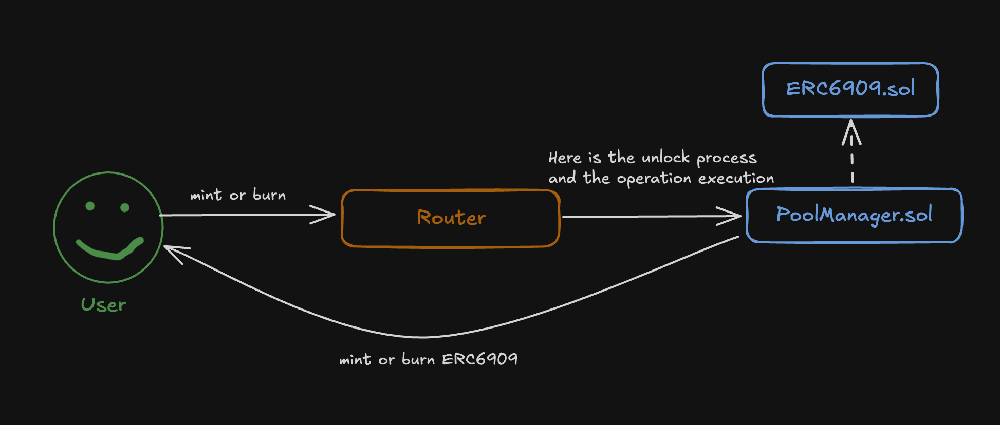

# Обзор Uniswap v4

**Автор:** [Павел Найданов](https://github.com/PavelNaydanov) 🕵️‍♂️

Uniswap v4 — новая версия протокола, разработанная для повышения эффективности обмена активами и улучшения масштабирования.

Это все еще DEX. Многие считают, что это DEX нового поколения?!😅

В новой версии хорошо подумали над двумя недостатками предыдущей версии:

- **Высокие комиссии при обмене актива.** Обмен, который требует задействовать множество пулов (больше двух), является достаточно энергоемкой операцией. Это особенно важно для работы в сети Ethereum.
- **Ограниченная возможность использования ликвидности протокола за его пределами.** Единая кодовая база для всех пулов не позволяла управлять операциями и строить другие приложения поверх. Любое изменение логики работы протокола требовало полного форка кодовой базы.

## Обзор нововведений

Начать стоит с того, что математика протокола сохранена и взята из предыдущей версии. Код четвертой версии продолжает поддерживать концепт концентрированной ликвидности по умолчанию, несмотря на то что появляется возможность изменить это. При этом по-прежнему во главу угла ставятся такие принципы, как non-custodial, non-upgradable, permissionless.

Основные изменения в четвертой версии направлены на:
- улучшение инструментов кастомизации пулов для разработчиков
- архитектурные изменения для повышения эффективности использования газа.

С помощью этих изменений планируется решать проблемы высоких комиссий и ограниченности использования ликвидности.

Ниже разберем основные нововведения, описанные в документации протокола.

### Хуки

*Призваны решить проблему масштабирования и сделать гибче возможность использования ликвидности за пределами протокола.*

Благодаря хукам разработчики могут добавлять собственную логику в работу с пулами протокола. Эта логика может выполняться до и после определенных операций: создание пула ликвидности, добавление или удаление ликвидности, свапы.

**Хук** — это функция, объявленная на внешнем смарт-контракте, который передается вместе с вызовом произвольной операции. Хук может выполняться до или после операции в зависимости от предназначения. Смарт-контракт хуков добавляется к пулу в момент его создания и не может быть изменен позже. За исключением случаев, когда смарт-контракт хуков — это прокси смарт-контракт.

На схеме отображено, как хук встраивается в процесс обмена активов. При вызове функции `swap()`, вместе с параметрами функции передается адрес смарт-контракта хуков и если хук `beforeSwap()` определен как функция этого смарт-контракта, то вызов будет перенаправлен на нее. Затем вызов возвращается обратно, и происходит основное исполнение обмена на Uniswap. После обмена аналогично запускается хук `afterSwap()`.

Если хук не указан в смарт-контракте хуков, то вызов хука игнорируется в потоке исполнения.

**Места для встраивания хука**

Существует несколько операций с пулами, на которые может влиять смарт-контракт хуков:

1. При инициализации пула:
    - **beforeInitialize**: Хук будет вызван перед инициализацией пула.
    - **afterInitialize**: Хук будет вызван после инициализации пула.

2. Добавление или удаление ликвидности:
    - **beforeAddLiquidity**: Хук будет вызван перед добавлением ликвидности.
    - **afterAddLiquidity**: Хук будет вызван после добавления ликвидности.
    - **beforeRemoveLiquidity**: Хук будет вызван перед удалением ликвидности.
    - **afterRemoveLiquidity**: Хук будет вызван после удаления ликвидности.

3. Swap Hooks:
    - **beforeSwap**: Хук будет вызван перед обменом активов.
    - **afterSwap**: Хук будет вызван после обмена активов.

4. Donate Hooks:
    - **beforeDonate**: Хук будет вызван перед донатом в пул.
    - **afterDonate**: Хук будет вызван после доната в пул.

Хук может влиять на все описанные выше операции и встраиваться во все возможные места пула или только в некоторые из них.

**Интересные моменты**

**Первый момент.** Хуки **beforeInitialize** и **afterInitialize** исполняются один раз, остальные виды хуков могут быть использованы неограниченное количество раз.

**Второй момент.** Хуки для доната в пул. Что такое донаты? Донаты — Донаты — это новый функционал, который позволяет пожертвовать активы в пул. Это своего рода прямой платеж поставщикам ликвидности пула, который можно расценивать, как чаевые. Может применяться, как классическая система донатов, только в криптоактивах.

Например, проект запускает пул (токен протокола, стейблкоин). Через смарт-контракт хуков реализуется механизм первичных продаж токена за стейблкоин. Но если пользователю нравится проект, то он может сделать пожертвование без необходимости покупать токен протокола.

**Третий момент.** Хуки позволяют вмешиваться в логику обмена. От контроля доступа до изменения комиссии обмена и новой кривой формирования цены. Все, что может придумать фантазия, может быть реализовано при помощи хуков, например, StableSwap, как у Curve для обмена стейблкоинов.

### Singleton Design

*Один пул на все пары токенов, что обходится дешевле, чем создание отдельных смарт-контрактов под каждый пул (так было в Uniswap v2, Uniswap v3).*

Вводится новая архитектура под названием "Singleton Design", которая подразумевает реализацию всех пулов на одном смарт-контракте [PoolManager.sol](https://github.com/Uniswap/v4-core/blob/main/src/PoolManager.sol). Этот смарт-контракт описывает логику по управлению пулами и операциями. Такой подход позволяет экономить на газе при создании пулов.

Более того, упрощается сложный обмен активов, когда задействуется несколько пулов. Пропадает необходимость перемещать активы между разными контрактами пулов, так как теперь все пулы реализованы в рамках одного смарт-контракта, и достаточно обновить балансы внутри одного общего смарт-контракта.

Однако не стоит думать, что в новой версии существует один смарт-контракт на все. Во-первых, аналогично предыдущим версиям существует два репозитория: [v4-core](https://github.com/Uniswap/v4-core) и [v4-periphery](https://github.com/Uniswap/v4-periphery). Core все также отвечает за пулы, а periphery — за маршрутизацию. Также существует множество дополнительных контрактов, которые так или иначе реализуют логику смарт-контракта пулов, роутера, нфт и математики. Для перечисления смарт-контрактов различных библиотек не хватит пальцев на руках.

С появлением новых версий протокола маршрутизация уже была чуть сложнее устроена. Для унификации маршрутизации используется еще один смарт-контракт под названием [UniversalRouter.sol](https://github.com/Uniswap/universal-router/blob/main/contracts/UniversalRouter.sol), который определяет, на какой роутер какой версии протокола необходимо отправить вызов. И все, что связано с маршрутизацией, находится в отдельном репозитории.

Таким образом, схематично четвертая версия протокола работает следующим образом.

Любой вызов пользователя сначала попадает в универсальный роутер, который наследуется от всех версий роутеров (v2, v3, v4). Этот роутер занимается маршрутизацией вызовов между разными версиями протокола, а также поддерживает миграцию ликвидности из третьей версии в четвертую.

Для четвертой версии основная логика выполнения операций находится в [BaseActionRouter.sol](https://github.com/Uniswap/v4-periphery/blob/main/src/base/BaseActionsRouter.sol). Там происходит вызов разблокировки (на схеме вызов [unlock()](https://github.com/Uniswap/v4-periphery/blob/main/src/base/BaseActionsRouter.sol#L25)) пула, с которым работает роутер. Затем, при помощи обратного вызова, управление передается обратно на роутер для выполнения операции (на схеме вызов [unlockCallback()](https://github.com/Uniswap/v4-core/blob/main/src/PoolManager.sol#L109)).

После разблокировки пула вызов возвращается на роутер для определения типа действия. Например, если действие пользователя будет определено как [swap()](https://github.com/Uniswap/v4-core/blob/main/src/PoolManager.sol#L109), то вызов будет отправлен обратно на смарт-контракт пула для выполнения. При этом пул будет разблокирован для выполнения операции.

Механизм блокировки/разблокировки пула реализован при помощи стандарта [EIP-1153: Transient storage opcodes](http://eips.ethereum.org/EIPS/eip-1153) и одновременно выполняет несколько задач:
- защита от повторного входа, или более известное название — защита от reentrancy атаки
- атомарность выполнения сложной операции, когда обмен состоит из цепочки обменов; в промежуточном хранилище хранятся промежуточные балансы
- контроль доступа к пулу, который позволяет только авторизованным акторам делать вызов к смарт-контракту пулов.

### Flash Accounting

*Использование максимально дешевого хранилища данных для проведения сложных операций*

Использование [EIP-1153: Transient storage opcodes](http://eips.ethereum.org/EIPS/eip-1153) позволяет более эффективно выполнять операции.

> Мы писали про Transient Storage. Если хочешь узнать про него больше, то ищи его внутри нашего wiki в папке EIPs.

Происходит это за счет того, что **Transient Storage** используется как хранилище промежуточных операций, а состояние блокчейна меняется только по результатам проведения всех операций. Таким образом, дорогое хранилище (Storage) используется только для финализации данных.

Ниже, в нашу схему добавлено промежуточное хранилище, но упрощен роутер. Демонстрируется использование transient storage для механизма разблокировки пула.

Механизм разблокировки пула, для защиты его от reentrancy атаки, проставляет во временное хранилище значение true в специальный IS_UNLOCKED_SLOT. После этого возвращает роутеру вызов, и роутер выполняет операции пользователя. По окончании транзакции промежуточное хранилище будет очищено.

Чтобы понимать целесообразность использования transient storage, нужно посмотреть на цифры. Изменение состояния блокчейна при помощи опкода `sstore` (запись в пустой слот хранилища) стоит 20_000 газа, при этом запись во временное хранилище при помощи опкода `tstore` стоит всего 100 газа.

### Нативный эфир

*Поддерживается нативный эфир без необходимости использовать обертки по типу [WETH](https://coinmarketcap.com/academy/article/what-is-wrapped-ethereum-weth).*

Стоит отметить, что протокол не работал с нативной валютой напрямую со времен первой версии протокола. Эта возможность была удалена во второй версии из-за нарастающей сложности протокола и конфликта нативной валюты с обернутым представлением, что приводило бы к дроблению ликвидности.

| Версия Uniswap | Обработка ETH | Пояснение |
|----------------|---------------|-------------|
| **v2** | Можно работать с ETH напрямую | Конвертация в WETH внутри контракта |
| **v3** | Для работы с ETH необходимо использовать WETH | Обертка в WETH обязательна для всех операций |
| **v4** | Можно работать с ETH напрямую без необходимости оборачивать в WETH | Прямое использование ETH, улучшенная эффективность и оптимизация работы с газом |

Подход в работе с нативной валютой в прошлых версиях добавлял дополнительные шаги для пользователя, которому приходилось оборачивать свою нативную валюту перед использованием протокола.

Теперь это неудобство в прошлом, во многом благодаря новой Singleton архитектуре и Flash Accounting. Это положительно скажется на пользовательском опыте и удешевит транзакции, связанные с нативной валютой.

### Fees. Dynamic fees

*Комиссия в Uniswap — это сборы за обмены активов, собираемые с пользователей и напрямую начисляемые поставщикам ликвидности.*

> Помимо комиссии поставщикам ликвидности есть и комиссия протокола. Но мы рассмотрим только комиссии поставщикам, так как там есть действительно важные изменения.

Ограничение комиссий (0,05%, 0,30%, 1,00%) третьей версии отменено. Теперь позволяется устанавливать произвольную комиссию в пуле.

Также нововведением являются динамические комиссии, которые могут изменяться в пулах: увеличиваться или уменьшаться.

Изменение комиссии может происходить при каждом обмене, блоке или по расписанию: раз в неделю, месяц и так далее.

Доступ к работе с комиссиями открыт через хуки. То есть в хуках можно добавлять произвольную логику, которая будет влиять на размер комиссии или делать ее динамической. Это может быть полезно для волатильных пар или особого сценария использования ликвидности.

_Важно!_ Результатом добавления динамической комиссии является то, что любая пара токенов может иметь бесконечное количество пулов, указывая различные конфигурации комиссии или хуков.

С одной стороны множество пар позволит пользователям выбирать пулы с наиболее предпочтительными комиссиями, что будет создавать природную конкуренцию и вести к снижению комиссий пулов в борьбе за своих пользователей. С другой стороны мне пока сложно давать оценку на сколько усложнится маршрутизация в солянке множества пулов.

### Subscribers

*Позволяет подписываться на смарт-контракт позиции поставщика ликвидности для получения нотификации об изменениях его позиции.*

Это совершенно новый концепт для протокола Uniswap, который нацелен на улучшение практики поставщиков ликвидности.

Работает это следующим образом: произвольный смарт-контракт может подписаться на изменения позиции поставщика ликвидности и получать нотификации при изменении этой позиции.

Для того чтобы подписаться, владелец позиции или одобренный им адрес должны вызвать функцию [subscribe()](https://github.com/Uniswap/v4-periphery/blob/main/src/base/Notifier.sol#L40) на смарт-контракте [PositionManager.sol](https://github.com/Uniswap/v4-periphery/blob/main/src/PositionManager.sol), который отождествляет позиции, и передать адрес смарт-контракта, который будет получать нотификации. На схеме это смарт-контракт `Subscriber.sol`, который реализует заведомо известный интерфейс с четырьмя функциями.

После подписки смарт-контракт `Subscriber.sol` будет получать нотификации обо всех изменениях позиции поставщика ликвидности напрямую со смарт-контракта, реализующего эту позицию.

Доступны следующие виды нотификаций:
- Инициализация подписки
- Изменение позиции: увеличение или уменьшение. Тут же информация по изъятому вознаграждению
- Позиция передана
- Подписка аннулирована

### ERC-6909

*Новый стандарт токена, который отображает владельцу эквивалент его активов, находящихся внутри протокола Uniswap, доступных для использования.*

Стандарт токена [ERC-6909](https://eips.ethereum.org/EIPS/eip-6909) является альтернативным для ERC-1155. Он реализует минимальную логику и за счет этого более экономичен в использовании.

По сравнению с ERC-1155 в ERC-6909 отсутствует пакетная обработка и обратные вызовы, улучшено делегирование, снижены затраты на газ при развертывании и взаимодействии.

Работает это достаточно просто и чем-то похоже на LP токены для поставщика ликвидности в классических моделях. Вместо того чтобы перемещать токены из смарт-контракта пула, пользователь может оставить их внутри пула и в качестве подтверждения владения сминтить себе ERC-6909.

В последующих взаимодействиях, требующих использования токенов внутри пула, пользователь может просто сжигать часть (или все) свои токены ERC-6909, которые у него есть.

Целесообразность этого заключается в уменьшении накладных расходов, так как зачастую для перемещения токенов в пул и обратно требуется выполнять вызовы на сторонние смарт-контракты самих токенов. В данном случае, с использованием ERC-6909, такое взаимодействие минимизировано.

Подобное нововведение понравится трейдерам и арбитражерам, которые выполняют множество обменов за короткий промежуток времени и для них это возможность неплохо сэкономить.

Также открывается новая возможность для поставщиков ликвидности, которые часто открывают, закрывают или перемещают свои позиции. Я думаю, что на базе ERC-6909 в скором времени появятся новые инструменты ребалансировки позиций.

## Проблема маршрутизации в Uniswap V4

По сравнению с Uniswap V3 маршрутизация в V4 стала значительно сложнее. Это связано с тем, что помимо поиска оптимального маршрута обмена необходимо учитывать логику, которую добавляют хуки.

Несмотря на то что хуки должны реализовывать понятную и безопасную логику, фактическое поведение невозможно узнать без выполнения. Хотя можно определить, какие функции реализует хуки, но неопределенность не исчезает и значительно усложняет маршрутизацию в Uniswap V4.

Таким образом, для пользователей появляется необходимость доверять логике хуков, связанных с пулами ликвидности. А для исполнителей в UniswapX необходимо тщательно проверять хуки, прежде чем включать их в свои алгоритмы маршрутизации.

Учитывая проблему доверия хукам, появляется необходимость в создании сервисов, отслеживающих безопасность хуков. Сообщество уже начало создавать подобные инструменты, и наиболее ярким примером является [HookRank](https://hookrank.io/?ref=ghost-2077.arvensis.systems), похожий на [L2Beat](https://l2beat.com/scaling/summary) идеей, только для хуков Uniswap V4 и попроще.

## Вывод

Uniswap V4 — это следующая стадия в эволюции децентрализованных обменников. Здесь не придумали новой математики, зато позаботились о новых вариантах использования!

Новая архитектура устраняет многие ограничения предыдущих версий и предоставляет новый уровень масштабирования. Теперь Uniswap не просто обменник, а полноценная платформа для построения децентрализованных приложений и уникальных рынков.

Задачи, которые можно решать с новой версией:
- проблема непостоянных потерь через динамические комиссии, настраиваемые в хуках
- снижение затрат на газ
- реализация уникальной формулы кривой ценообразования
- эффективное использование капитала с помощью хуков и подписок
- минимизация влияния MEV
- честные и прозрачные запуски новых токенов
- и все, до чего дойдет фантазия

Отвечая на вопрос, является ли Uniswap v4 DEX нового поколения? Ответ: скорее нет, чем да. С точки зрения обменника ничего инновационного не сделано. Концепт концентрированной ликвидности продолжает работать по дефолту. Однако новая версия широко открывает ворота, чтобы DEX нового поколения действительно появился!

Сегодня Uniswap имеет потенциал стать платформой ликвидности, в которой другие строятся поверх него с использованием хуков, способствуя росту всей экосистемы протокола.

## Links

1. [Официальная документация](https://docs.uniswap.org/contracts/v4/overview)
2. [Официальные репозитории](https://github.com/Uniswap)
3. [Uniswap V4: Hooks Security Considerations](https://www.certik.com/resources/blog/uniswap-v4-hooks-security-considerations?utm_source=substack&utm_medium=email)
4. [A Complete Guide to Uniswap V4](https://research.2077.xyz/a-complete-guide-to-uniswap-v4-1#history-of-uniswap-v1-and-v2)
5. [Uniswap V4 vs V3: Architectural Changes and Technical Innovations with Code Examples](https://www.cyfrin.io/blog/uniswap-v4-vs-v3-architectural-changes-and-technical-innovations-with-code-examples)
