# Побитовые операции

-   [Немного информатики](#немного-информатики)
-   [Беззнаковые числа](#беззнаковые-числа-положительные)
-   [Знаковые числа](#знаковые-числа-положительные-и-отрицательные)
    -   [Прямой код](#прямой-код)
    -   [Обратный код](#обратный-код)
    -   [Дополнительный код](#дополнительный-код)
-   [Битовые операции](#битовые-операции)
    -   [Логические вентили](#логические-вентили)
    -   [Простые действия с побитовыми операторами](#простые-действия-с-побитовыми-операторами)
        -   [Проверка бита](#проверка-бита)
        -   [Изменение значения одного или нескольких битов](#изменение-значения-одного-или-нескольких-битов-с-помощью-or-и-and)
        -   [Инвертирование отдельно взятых битов](#инвертирование-отдельно-взятых-битов)
    -   [Битовые сдвиги](#битовые-сдвиги)
        -   [Арифметический сдвиг](#арифметический-сдвиг)
        -   [Логический сдвиг](#логический-сдвиг)
        -   [Циклический сдвиг](#циклический-сдвиг)
    -   [Примеры кода на solidity](#примеры-кода-на-solidity)
-   [Варианты использования](#варианты-использования)
-   [Заключение](#заключение)
-   [Ссылки](#ссылки)

Перед тем как переходить к побитовым операциям необходимо понять а что такое вообще бит и байт. Так что да, эта та самая школьная информатика на который лично я играл в cs с одноклассниками и преподавателем и что-то мне подсказывает что я такой не один.

## Немного информатики

[Бит](https://ru.wikipedia.org/wiki/%D0%91%D0%B8%D1%82) - это наименьшая единица информации, символ или сигнал который может принимать только 2 значения: включено или выключено, да или нет, высокий или низкий, заряженный или незаряженный. Можно сказать что любая лампочка может стать битом - она либо включена, либо выключена. Соответственно в двоичной системе счисления бит это 0 или 1.

В общем если бит это кирпич, что стеной из кирпичей будет - байт.

[Байт](https://ru.wikipedia.org/wiki/%D0%91%D0%B0%D0%B9%D1%82) - это уже совокупность битов, которые компуктер может обрабатывать одновременно и так исторически сложилось что один байт в 99,9% случаев будет равняться 8 битам, потому что это оказалось удобно и эффективно.

Есть отличная статья: ["Как два байта переслать"](https://pikabu.ru/story/kak_dva_bayta_pereslat_7070913), в которой показывается что будет на уровне байтов если отправить слово «Hello!» с одного компьютера на другой.

В бит мы можем положить только 0 или 1, знак минус туда не запишешь, а с отрицательными числами работать как-то нужно, поэтому на уровне битов существуют знаковые и беззнаковые числа. Дальше обо всем поподробнее.

### Беззнаковые числа (положительные)

В одном бите (если мы говорим про беззнаковое число) содержатся значения от 0 до 255 или если в двоичном виде от 00000000 до 11111111.

Это очень просто, каждой позиции от младшего (LSB - Least Significant Bit) до старшего (MSB - Most Significant Bit) бита соответствует определенное число. Это значение (его еще называют "вес") по сути число 2 возведенное в степень той позиции на которой оно стоит (2<sup>N</sup>).
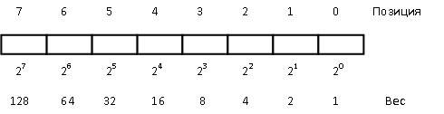

Получается максимальное число это 2<sup>N</sup> - 1, в нашем случае 255, помним что 0 это тоже число.

А вот так будет выглядеть 2 байта или 16 бит если их разложить на десятичные числа. 2 байта образуют машинное слово, но об этом в следующих сериях.


Чтобы запомнить можно потренироваться, например можно для начала взять только первые 4 позиции байта и попереводить числа от 0 до 15 в двоичный код. Чтобы получить число 5 нам нужно сложить 2<sup>2</sup> + 2<sup>0</sup> потому что на второй позиции стоит число 4, а на нулевой число 1, получится 0101.

К примеру 10 в двоичной системе будет 1010, 13 = 1101, 14 = 1110 и т.д.

Таким образом имея 4 позиции мы можем оперировать числами от 0 до 15 потому что 2<sup>3</sup> + 2<sup>2</sup> + 2<sup>1</sup> + 2<sup>0</sup> = 15.

С этими знаниями уже можно двигаться дальше.

### Знаковые числа (положительные и отрицательные)

Числа могут быть не только положительными, но и отрицательными. Это заставляет нас по-другому взглянуть на хранение чисел. Допустим, число 5 в двоичной форме выглядит как 00000101, но число -5 имеет точно такую же последовательность нулей и единиц, только с минусом. У нас нет специального обозначения, которое позволило бы хранить этот символ в памяти. Поэтому нам нужен специальный формат обозначения, по которому компьютер мог бы различать числа и понимать, какое число положительное, а какое отрицательное. Для этого существует [прямой, обратный и дополнительный код](https://microkontroller.ru/programmirovanie-mikrokontrollerov-avr/pryamoy-obratnyiy-dopolnitelnyiy-kod-dvoichnogo-chisla/). Это три разных представления как хранить отрицательные числа в двоичном коде.

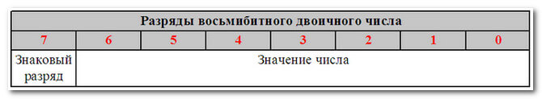

#### Прямой код

Прямой код просто использует старший бит для обозначения знака числа. Однако это создает проблемы с обработкой отрицательного нуля и требует дополнительной обработки знакового бита.

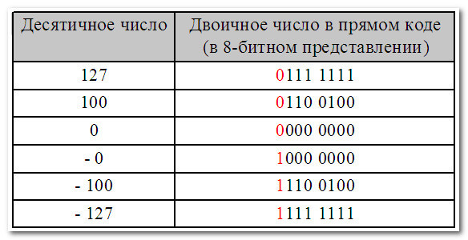

#### Обратный код

Обратный код решает некоторые из этих проблем, инвертируя все биты числа для создания его отрицательного эквивалента. Но он все еще сталкивается с проблемой отрицательного нуля.

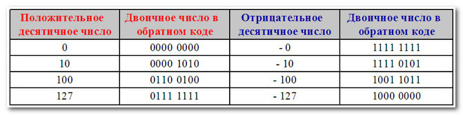

#### Дополнительный код

Дополнительный код, который используется в большинстве современных компьютеров, решает все эти проблемы, добавляя 1 к обратному коду числа. Это позволяет избавиться от отрицательного нуля, делает числа упорядоченными и расширяет диапазон чисел, которые можно представить.

Операция вычитания в дополнительном коде происходит путем добавления двух чисел, одно из которых представляет собой отрицательное число. Если результат сложения двух больших положительных чисел или двух больших отрицательных чисел не укладывается в диапазон чисел, которые можно представить, происходит переполнение. В этом случае результат будет на другой стороне диапазона чисел, на которую указывает количество шагов переполнения.

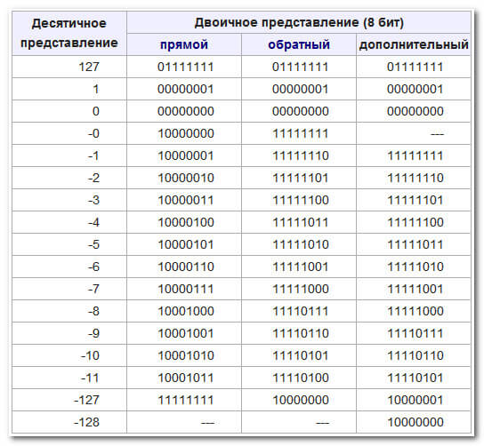

Форма записи чисел в дополнительном коде оказалась наиболее оптимальной как с точки зрения математики, так и с точки зрения упрощения архитектуры компьютера.

Я очень рекомендую к просмотру [это видео](https://www.youtube.com/watch?v=BIYiuy8WWiU) про отрицательные числа по мотивам которого написана информация выше.

Вот теперь можно начать разбираться с битовыми операциями.

## Битовые операции

**Битовые операции** - _это особый тип операций в вычислениях, который позволяет манипулировать битами данных напрямую. Они работают на уровне отдельных битов в двоичном представлении чисел._

Во многих языках программирования очень часто приходится работать с такими логическими операциями как:

-   `&&` - Логическое И (AND)
-   `||` - Логическое ИЛИ (OR)
-   `!` - Логическое НЕ (NOT)
-   `< > =` - меньше, больше, равно и их комбинации

Вот к примеру таблицы истинности для операторов AND, OR и NOT:
**AND**
| left operand | right operand | result |
| ---- | ----- | ------ |
| 0 | 0 | **0** |
| 0 | 1 | **0** |
| 1 | 0 | **0** |
| 1 | 1 | **1** |

**OR**
| left operand | right operand | result |
|------|-------|--------|
| 0 | 0 | **0** |
| 0 | 1 | **1** |
| 1 | 0 | **1** |
| 1 | 1 | **1** |

**NOT**

| operand | result |
| ------- | ------ |
| 0       | **1**  |
| 1       | **0**  |

Но эти операторы работают с числами или булевыми значениями (по факту с байтами) в то время как битовые операции работают на более низком уровне и к ним добавляется еще несколько операций, таким образом полный список битовых операций будет выглядеть так:

-   `& ` - Побитовое И (AND)
-   `| ` - Побитовое ИЛИ (OR)
-   `^ ` - Исключающее ИЛИ (XOR)
-   `~ ` - Побитовое отрицание (NOT)
-   `<<` - Побитовый сдвиг влево
-   `>>` - Побитовый сдвиг вправо

Также добавляется еще одна таблица истинности для исключающего ИЛИ - XOR:

**XOR**
| left operand | right operand | result |
|------|-------|--------|
| 0 | 0 | **0** |
| 0 | 1 | **1** |
| 1 | 0 | **1** |
| 1 | 1 | **0** |

Таблицы для AND, OR, NOT работают также как и с логическими операциями, поэтому запомнить не сложно. Исключающее или дает 1 только когда операнды отличаются, а когда они одинаковые получаем 0.

### Логические вентили

Фактически битовые операции в сочетании с запоминающими элементами это то, на чем строится вся вычислительная техника на самом низком уровне. Так как это базовые элементарные логические операции (их еще называют логические вентили) с которыми может работать непосредственно процессор используя напряжение и различные схемы.
К примеру так будет выглядеть схема оператора отрицания NOT:
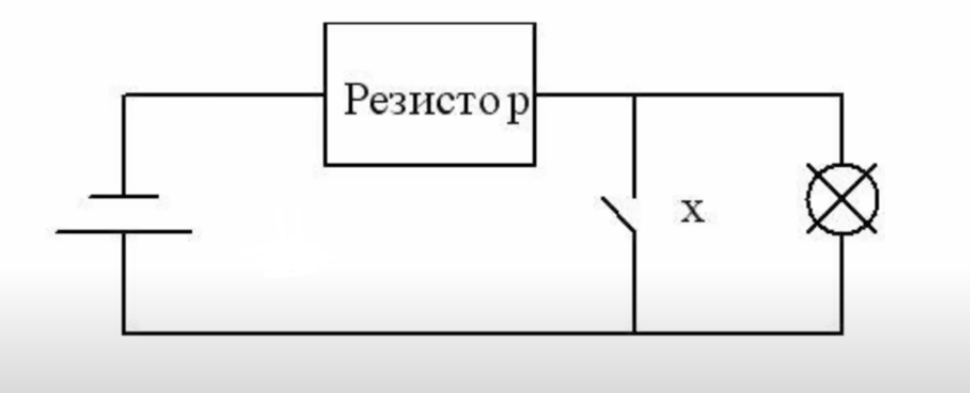
_Схема элементарной логической операции NOT на уровне электроники_

То есть если представить что зачеркнутый круг это лампочка (наличие напряжения или 1 на выходе), а `x` это переключатель, то в случае с когда переключатель замыкается ток на лампочку не идет и мы получаем 0, в противном случае будет 1.

А вот так будет выглядеть OR, то есть когда хотя бы один переключатель (`x` или `y`) замкнется на выходе мы получим напряжение:
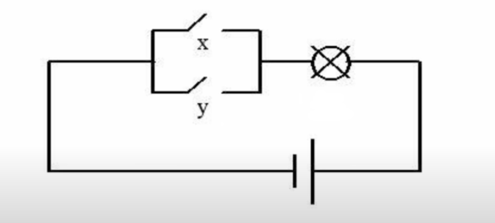
_Схема элементарной логической операции OR на уровне электроники_

В случае с AND нужно чтобы были замкнуты оба переключателя:
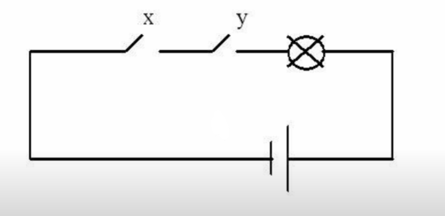
_Схема элементарной логической операции AND на уровне электроники_

### Простые действия с побитовыми операторами

Перед тем как изучать информацию ниже очень рекомендую [это видео](https://www.youtube.com/watch?v=qewavPO6jcA).

Итак, перейдем к примерам на уровне двоичного кода.
Начнем с простого примера, если взять два числа 5 и 6 и применить к ним побитовый оператор `&` мы получим 4. Чтобы понять почему так произошло нужно перевести десятичные числа в двоичные и выполнить побитовое И (AND) с каждым отдельным битом применив таблицу истинности для AND:

```js
    // x     = 101 = 4 + 0 + 1 = 5
    // y     = 110 = 4 + 2 + 0 = 6
    // x & y = 100 = 4 + 0 + 0 = 4
    function and(uint x, uint y) external pure returns (uint) {
        return x & y;
    }
```

Подобные примеры для остальных операторов можно посмотреть [здесь](https://solidity-by-example.org/bitwise/), также можно посмотреть [вот это видео](https://www.youtube.com/watch?v=oSALkuoONkw).
Это простой принцип, по которому будут работать все базовые побитовые операции. Единственный нюанс о котором стоит помнить, то что у нас может быть знаковое или беззнаковое двоичное число, к примеру если применить оператор `~` NOT к числу 8 (00001000) т.е. выполнить инверсию, в зависимости от того знаковый это тип или беззнаковый мы получим два разных числа.

```bash
    x  = 00001000 =   0 +  0 +  0 +  0 + 8 + 0 + 0 + 0 = 8
    ~x = 11110111 = 128 + 64 + 32 + 16 + 0 + 4 + 2 + 1 = 247 (unsigned)
    ~x = 11110111 =   0 +  0 +  0 +  0 + 8 + 0 + 0 + 0 + 1 = -9 (signed)
```

Помним что в дополнительном коде нам нужно прибавить единицу чтобы получить нужное отрицательное число.

#### Проверка бита

А теперь немного магии, которую можно творить использую битовые операции. Например
мы храним три состояния в одном байте используя 3 последних бита. Нам нужно узнать что находится внутри отдельно взятого бита.

```js
bytes1 state1 = 0x1; // 00000001
bytes1 state2 = 0x2; // 00000010
bytes1 state3 = 0x4; // 00000100
```

Чтобы это сделать нам нужно создать маску для нужного бита и применить оператор `&` AND, к примеру мы хотим получить значение второго бита:

```bash
    mask = 00000010

    00110010
  &
    00000010
    00000010 // result
    --------
    00110001
  &
    00000010
    00000000 // result
```

Таким образом если во втором бите что-то есть то мы получим 1, а если нет - там будет 0.

#### Изменение значения одного или нескольких битов с помощью OR и AND:

1. Установка бита в единицу

```bash
    00110000
  |
    00000010
    00110010
```

Тут мы поменяли второй бит на 1 применив побитовое ИЛИ `|` OR при этом оставив остальные биты такими же.

2. Установка бита в ноль (применим побитовое чтобы занулить второй бит)

```bash
    00110010
  &
    11111101
    00110000

```

А здесь занулили второй бит c использованием И `&` AND оставив другие биты нетронутыми.

#### Инвертирование отдельно взятых битов

Оператор ИСКЛЮЧАЮЩЕЕ ИЛИ `^` XOR позволяет инвертировать отдельно взятые биты. Чтобы это сделать возьмем как всегда второй бит и подставим туда 1.
Если в втором бите был 0 то он превратится в единицу:

```bash
    00110000
  ^
    00110010
    00110010
```

И наоборот если там была 1 она станет 0:

```bash
   00110010
 ^
   00110010
   00110000
```

Здесь нет ничего сложного, но вот чтобы написать соответствующие функции для работы с отдельными битами нужно разобраться с еще одной темой - **битовые сдвиги**.

### Битовые сдвиги

Вообще существует три вида побитовых сдвигов:

-   Арифметический сдвиг `<< >>`
-   Логический `<<< >>>`
-   Циклический `<<<< >>>>`

Тут все зависит от того, какой язык программирования используется. Сдвиги бывают в левую `<<` и правую `>>` сторону.

#### Арифметический сдвиг

В случае арифметического сдвига вправо `>>` будет произведен сдвиг всех битов на n позиций вправо, а освободившийся старший бит будет заполнен битом знака: если число положительно - 0, если отрицательное - 1.

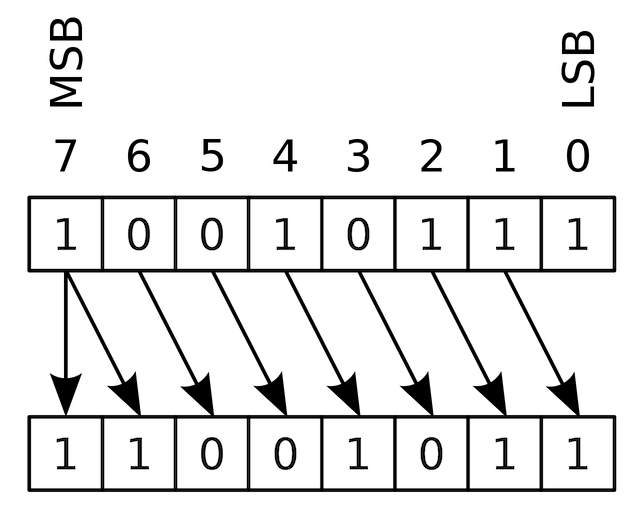

Запись сдвига числа 8 на одну позицию будет выглядеть так: `8 >> 1` (слева число, справа - на сколько бит нужно произвести сдвиг)

```js
    00001000 >> 1 = 00000100 // 8 >> 1 = 4
```

В данном случае получаем 4.

При арифметическом сдвиге влево `<<` будет произведен сдвиг всех битов на n позиций в лево, а младший бит будет заполнен 0.

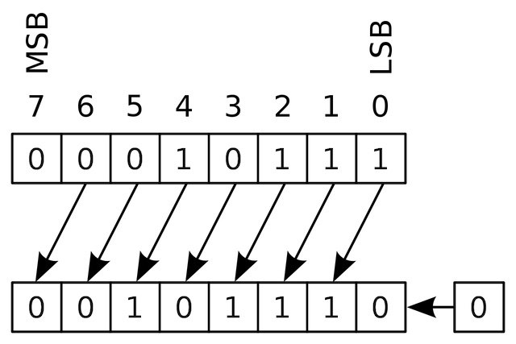

Сдвинем 8 на одну позицию влево `8 << 1` и получим число 16.

```js
    00001000 << 1 = 00010000 // 8 << 1 = 16
```

Таким образом мы получаем быстрый способ умножения или деления числа на 2<sup>n<sup>:

```bash
    n << 1 == n * 2   |   n >> 1 == n / 2
    n << 2 == n * 4   |   n >> 2 == n / 4
    n << 3 == n * 8   |   n >> 1 == n / 8
```

_Важно! Деление происходит с округлением в меньшую сторону, например `9 >> 1 = 4`._
_Важно! Сдвиг вправо числа (-1) всегда будет давать (-1), выглядеть это будет так:_

```js
    11111111 >> 1 = 11111111 // -1 >> 1 = -1
```

_Потому что как мы помним при сдвиге числа вправо старший бит заполняется битом знака, у отрицательно числа это 1._

#### Логический сдвиг

В случае с логическим сдвигом освободившийся бит всегда будет заполняться 0, как при сдвиге вправо `>>>` так и при сдвиге влево `<<<`. Такой сдвиг еще называют беззнаковым сдвигом.

```js
    01000001 <<< 1 = 10000010 //  65 <<< 1 = 130
    10000001 >>> 1 = 01000000 // 129 >>> 1 = 64
```

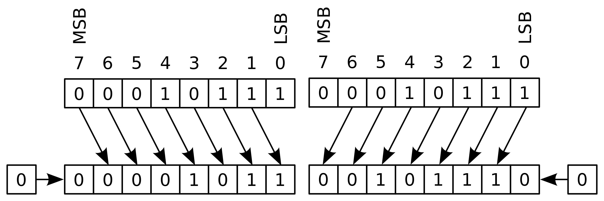
_Важно! Логический сдвиг применим только к беззнаковым числам._

#### Циклический сдвиг

Когда выполняется циклический сдвиг влево `<<<<` или вправо `>>>>` вышедший за пределы регистра старший или младший бит переходит на противоположную сторону:

```js
    10000000 <<< 1 = 00000001 //  128 <<<< 1 = 1
    00000001 <<< 1 = 10000000 //    1 >>>> 1 = 128
```

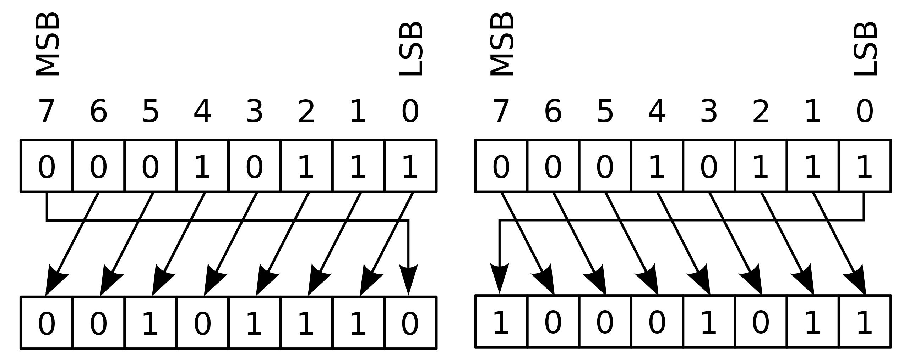

_Важно! В Solidity используется только арифметический тип сдвига и только для беззнаковых чисел (uint)._

### Примеры кода на solidity

Теперь зная про сдвиги можно [взять этот код](./examples/BitwiseOperations.sol) и потыкать в Remix. Это 4 примера использования побитовых операций которые мы разбирали выше:

-   Проверка отдельно взятого бита
-   Установка отдельно взятого бита в 1
-   Установка отдельно взятого бита в 0
-   Инверсия отдельно взятого бита

Также теперь можно разобрать оставшиеся примеры со сдвигами [тут](https://solidity-by-example.org/bitwise/). Более сложные операции и алгоритмы можно глянуть [тут](https://neerc.ifmo.ru/wiki/index.php?title=%D0%9F%D0%BE%D0%B1%D0%B8%D1%82%D0%BE%D0%B2%D1%8B%D0%B5_%D0%BE%D0%BF%D0%B5%D1%80%D0%B0%D1%86%D0%B8%D0%B8).

### Варианты использования

**1. Работа с флагами и масками**
Одним из главных применений битовых операций является работа с флагами и масками. В разделе с поиском бита мы уже использовали оба подхода.
Флаги - это биты, которые используются для представления состояний или свойств объектов или систем. Битовые операции позволяют установить или сбросить определенные биты, что удобно для управления флагами. Также с помощью масок (последовательности битов) можно выбирать или скрывать определенные свойства объекта или данных.

Изящный пример работы с флагами в solidity можно увидеть в контракте [Universal Router](https://github.com/Uniswap/universal-router#universalrouter-command-encoding) от Uniswap где они в один байт зашивают большое количество команд.

**2. Компактное представление данных**
Битовые операции позволяют компактно хранить и передавать данные. Несколько булевых флагов мы можем объединить в одно число и использовать битовые операции для чтения или записи каждого флага отдельно. Это экономит память и упрощает работу с данными.

К примеру в solidity тип `bool` храниться в `uint8`, если взять `uint8` и хранить каждый флаг в отдельном бите можно поместить в него 256 булевых значений!!!

**3. Оптимизация производительности**
Операции над битами выполняются намного быстрее, чем стандартные арифметические операции или условные выражения. Использование битовых операций особенно полезно в смарт-контрактах на блокчейне, где за каждую операцию нужно платить газ и оптимизация кода является критически важной для снижения расходов на выполнение кода.

**4. Шифрование и хеширование**
Битовые операции играют важную роль в шифровании данных и создании хешей. Многие алгоритмы шифрования и хеширования используют битовые операции для обработки данных на уровне битов. Это помогает обеспечить безопасность данных и уникальность хешей.

**5. Работа с аппаратным обеспечением**
Битовые операции широко используются при программировании встроенных систем и работы с аппаратным обеспечением. Они позволяют управлять регистрами устройств, отправлять и принимать битовые данные, а также выполнять другие задачи, связанные с низкоуровневым программированием.

## Заключение

Битовые операции являются мощным инструментом, который предоставляет разработчикам возможности для более эффективной работы с данными, оптимизации кода и обеспечения безопасности. Они имеют широкое применение в различных областях программирования, включая блокчейн. Понимание битовых операций поможет использовать их преимущества в своих проектах и создавать более эффективный и производительный код.

## Ссылки:

-   [Двоичные числа](https://asm.kcup.tusur.ru/Library/chapter%201/1-1.html)
-   [Как два байта переслать](https://pikabu.ru/story/kak_dva_bayta_pereslat_7070913)
-   [Прямой, обратный и дополнительный код](https://microkontroller.ru/programmirovanie-mikrokontrollerov-avr/pryamoy-obratnyiy-dopolnitelnyiy-kod-dvoichnogo-chisla/)
-   [Видео: как работают отрицательные числа](https://www.youtube.com/watch?v=BIYiuy8WWiU)
-   [Bitwise operation](https://en.wikipedia.org/wiki/Bitwise_operation)
-   [Видео: как работать с битами](https://www.youtube.com/watch?v=qewavPO6jcA)
-   [Побитовые операции](https://neerc.ifmo.ru/wiki/index.php?title=%D0%9F%D0%BE%D0%B1%D0%B8%D1%82%D0%BE%D0%B2%D1%8B%D0%B5_%D0%BE%D0%BF%D0%B5%D1%80%D0%B0%D1%86%D0%B8%D0%B8)
